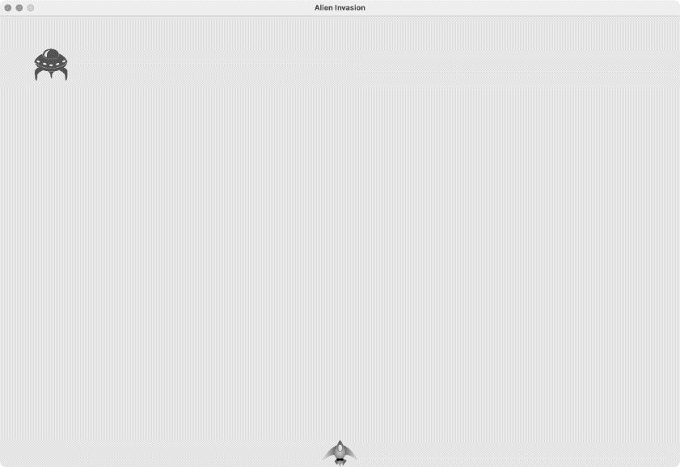
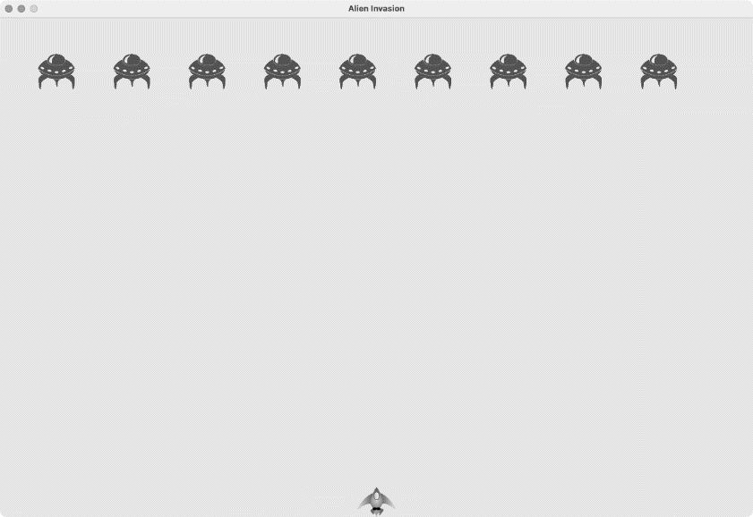
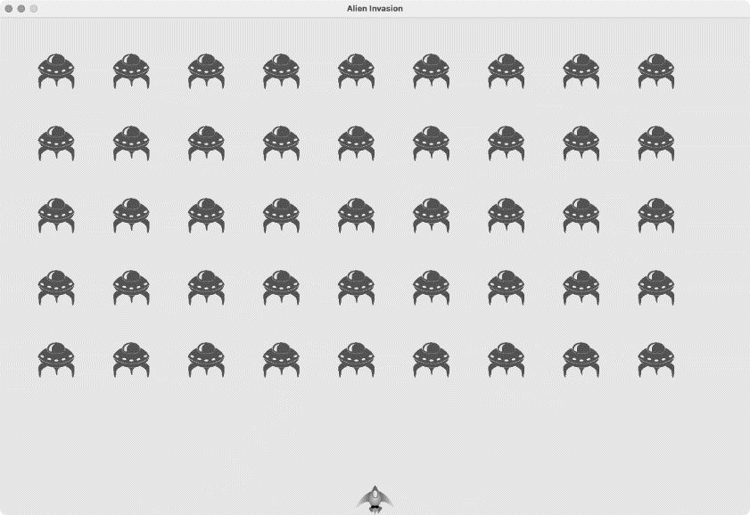
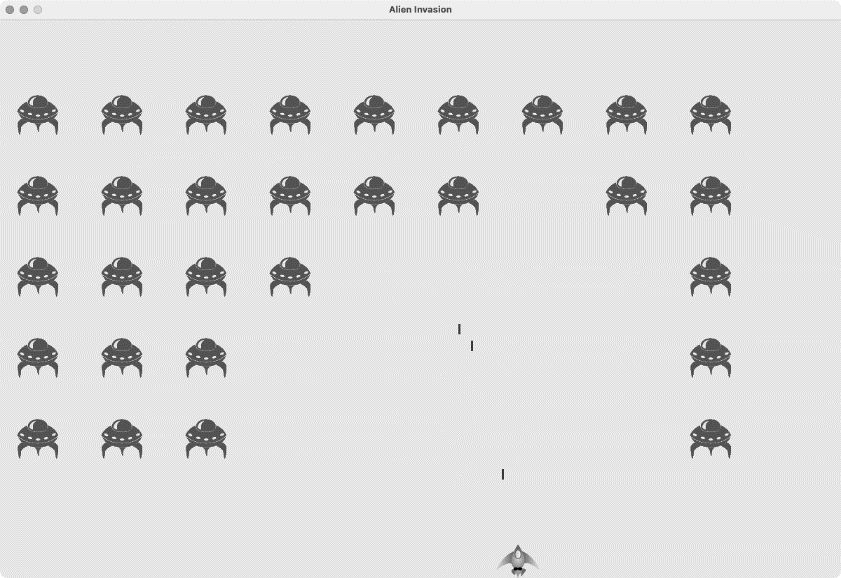
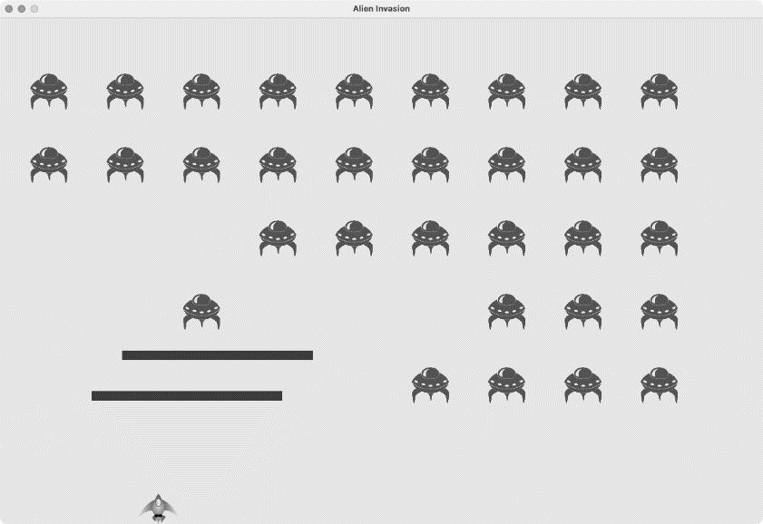

## 1. 项目回顾

本章将为游戏《外星人入侵》添加外星人。我们将先在屏幕的上边缘附近添加一个外星人，再生成一个外星舰队；然后让这群外星人向两侧和向下移动，并删除被子弹击中的外星人；最后，显示玩家拥有的飞船数量，并在玩家的飞船用完后结束游戏。

你将更深入地了解 Pygame 和大型项目的管理，还将学习如何检测游戏元素之间的碰撞，如子弹和外星人之间的碰撞。检测碰撞有助于定义游戏元素之间的交互：例如，可以将角色限制在迷宫的墙壁之间，或让两个角色相互传球。

在开发大型项目时，进入每个开发阶段前都要回顾一下开发计划，牢记接下来要通过编写代码完成哪些任务。本章将完成以下开发计划：

- 在屏幕左上角添加一个外星人，并指定合适的边距
- 沿屏幕上边缘添加一行外星人，再不断地添加成行的外星人，直到填满屏幕的上半部分
- 让外星人向两侧和向下移动，直到外星舰队被全部击落、有外星人撞到飞船或有外星人抵达屏幕的下边缘。如果外星舰队都被击落，将再创建一个外星舰队；如果有外星人撞到飞船或抵达屏幕的下边缘，就销毁飞船并再创建一个外星舰队
- 限制玩家可用的飞船数量，分配的飞船被用完后，游戏将结束

在项目中添加新功能前，还应审核既有的代码。每进入一个新阶段，项目通常会更复杂，因此最好对混乱或低效的代码进行清理。因为我们一直在不断重构，所以当前没有需要重构的代码。

## 2. 创建第一个外星人

在屏幕上放置外星人与放置飞船类似。每个外星人的行为都由类控制，我们将像创建 Ship 类那样创建 Alien 类。简单起见，这里还是使用位图来表示外星人。你既可以自己寻找表示外星人的图像，也可使用图 13-1 所示的图像，它可在本书的源代码文件中找到（chapter_13/creating_first_alien/images/alien.bmp）。这幅图像的背景为灰色，与屏幕的背景色一致。请务必将选择的图像文件保存到文件夹 images 中。


### 创建类Alien

下面来编写 Alien 类并将其保存为文件 alien.py：

```python
  import pygame
  from pygame.sprite import Sprite

  class Alien(Sprite):
      """表示单个外星人的类"""

      def __init__(self, ai_game):
          """初始化外星人并设置其起始位置"""
          super().__init__()
          self.screen = ai_game.screen

          # 加载外星人图像并设置其rect属性
          self.image = pygame.image.load('images/alien.bmp')
          self.rect = self.image.get_rect()

          # 每个外星人最初都在屏幕的左上角附近
❶         self.rect.x = self.rect.width
          self.rect.y = self.rect.height

          # 存储外星人的精确水平位置
❷         self.x = float(self.rect.x)
```

除了位置不同以外，这个类的大部分代码与 Ship 类相似。每个外星人最初都位于屏幕的左上角附近。将每个外星人的左边距都设置为外星人的宽度，并将上边距设置为外星人的高度（见❶），这样较为美观。我们主要关心的是外星人的水平移动速度，因此精确地记录了每个外星人的水平位置（见❷）。

Alien 类不需要在屏幕上绘制外星人的方法，因为我们将使用一个 Pygame 编组方法，自动地在屏幕上绘制编组中的所有元素。

### 创建实例Alien

要让第一个外星人在屏幕上现身，需要创建一个 Alien 实例。这属于初始化工作之一，因此需要把这些代码放在 AlienInvasion 类的 \_\_init\_\_() 方法末尾。我们最终会创建一个外星舰队，涉及的工作量不少，因此将新建一个名为 \_create_fleet() 的辅助方法。

在类中，方法的定义顺序无关紧要，只要按统一的标准排列就行。我们将把 \_create_fleet() 放在 \_update_screen() 前面，但其实放在 AlienInvasion 类的任何地方都行。首先，需要导入 Alien 类：

```python
--snip--
from bullet import Bullet
from alien import Alien
```

下面是修改后的 \_\_init\_\_() 方法：

```python
    def __init__(self):
    --snip--
        self.ship = Ship(self)
        self.bullets = pygame.sprite.Group()
        self.aliens = pygame.sprite.Group()
        self._create_fleet()
```

这创建了一个用于存储外星舰队的编组，还调用了接下来将编写的 \_create_fleet() 方法：

```python
    def _create_fleet(self):
        """创建一个外星舰队"""
        # 创建一个外星人
        alien = Alien(self)
        self.aliens.add(alien)
```

在这个方法中，先创建一个 Alien 实例，再将其添加到用于存储外星舰队的编组中。外星人默认被放在屏幕的左上角附近。要让外星人现身，需要在 \_update_screen() 中对外星人编组调用 draw() 方法：

```python
    def _update_screen(self):
    --snip--
        self.ship.blitme()
        self.aliens.draw(self.screen)

        pygame.display.flip()
```

当对编组调用 draw() 时，Pygame 将把编组中的每个元素绘制到属性 rect 指定的位置上。方法 draw() 接受一个参数，这个参数指定了要将编组中的元素绘制到哪个 surface 上。图 13-2 显示了在屏幕上现身的第一个外星人。



第一个外星人已经被正确地绘制在屏幕上了，下面来编写绘制一个外星舰队的代码。

## 3. 创建外星舰队

要绘制外星舰队，需要确定如何使用外星人填充屏幕的上半部分，同时避免游戏窗口过于拥挤。实现这个目标的方式有很多，我们将采取如下方法：沿屏幕上边缘水平向右不断地添加外星人，直到填满一整行；然后重复这个过程，直到没有足够的垂直空间供我们再添加一行为止。

### 创建一行外星人

现在可以创建一整行外星人了。我们首先创建一个外星人，以便能够访问其宽度，然后在屏幕的左上角放置一个外星人，再不断添加，直到没有空间添加外星人为止：

```python
      def _create_fleet(self):
          """创建一个外星舰队"""
          # 创建一个外星人，再不断添加，直到没有空间添加外星人为止
          # 外星人的间距为外星人的宽度
          alien = Alien(self)
          alien_width = alien.rect.width

❶         current_x = alien_width
❷         while current_x < (self.settings.screen_width - 2 * alien_width):
❸             new_alien = Alien(self)
❹             new_alien.x = current_x
              new_alien.rect.x = current_x
              self.aliens.add(new_alien)
❺             current_x += 2 * alien_width
```

获取第一个外星人对象的宽度，再定义一个名为 current_x 的变量（见❶）。这个变量表示我们要在屏幕上放置的下一个外星人的水平位置。我们将这个变量的初始值设置为外星人的宽度，以免第一个外星人紧贴屏幕的左边缘。

接下来是一个 while 循环（见❷），它不断地添加外星人，直到没有足够的空间再放下一个外星人为止。为了确定是否有足够的空间再放置一个外星人，我们将 current_x 与一个最大值进行比较。在第一次尝试时，这个 while 循环可能类似于 `while current_x < self.settings.screen_width`，这看似可行，但将导致行尾的外星人超出屏幕的右边缘。因此，我们在屏幕的右边缘处留出一点儿空间：只要余下的空间超过外星人宽度的两倍，就继续执行循环，再添加一个外星人。

只要余下的水平空间足够，循环就会不断执行。在循环中，我们要做两件事：一是在正确的位置创建一个外星人，二是定义当前行中下一个外星人的水平位置。我们创建一个外星人，并将其赋给变量 new_alien（见❸）；然后，将该外星人的水平位置设置为 current_x 的当前值（见❹），同时将该外星人的 rect 的 x 值也设置为 current_x 的当前值，并将该外星人添加到编组 self.aliens 中。

最后，递增 current_x 的值（见❺）：将其值加上外星人宽度的两倍，从而越过刚添加的外星人，并在外星人之间留下一些空间。回到 while 循环的开头后，Python 将重新对循环条件进行判断，确定是否有足够的空间再添加一个外星人。如果没有足够的空间，循环结束，第一行外星人也就创建好了。

现在运行这个游戏，将看到第一行外星人，如图 13-3 所示。



注意：对于像本节中这样的循环，并非总是一眼就能看出该如何编写。编程的一个有趣之处在于，并不要求在一开始就找到解决问题的正确方法：即使这个循环最初导致最后一个外星人离屏幕右边缘太远也没关系，你可对其进行修改，直到最后一个外星人与屏幕右边缘的距离合适为止。

### 重构\_create_fleet()

倘若只需使用前面的代码就能创建一个外星舰队，也许应该让 \_create_fleet() 保持原样，但鉴于创建外星舰队的工作还未完成，我们稍微整理一下这个方法。为此，添加辅助方法 \_create_alien()，并在 \_create_fleet() 中调用它：

```python
      def _create_fleet(self):
      --snip--
          while current_x < (self.settings.screen_width - 2 * alien_width):
              self._create_alien(current_x)
              current_x += 2 * alien_width

❶     def _create_alien(self, x_position):
          """创建一个外星人并将其放在当前行中"""
          new_alien = Alien(self)
          new_alien.x = x_position
          new_alien.rect.x = x_position
          self.aliens.add(new_alien)
```

除了 self，\_create_alien() 方法还接受一个参数：指定外星人水平位置的值（见❶）。\_create_alien() 方法的代码与原来放在 \_create_fleet() 中的代码相同，只是 current_x 被替换成了参数 x_position。这样重构后，将更容易添加新行，进而创建整个外星舰队。

### 添加多行外星人

为了创建一个外星舰队，我们需要不断添加外星人，直到没有足够的空间再添加一行为止。我们将使用一个嵌套循环：将当前循环放在另一个 while 循环中。里面的循环负责沿水平方向添加外星人，关注的是外星人的 x 值；而外面的循环沿垂直方向添加外星人，关注的是外星人的 y 值。我们将在到达屏幕底部附近后停止添加外星人，以避免覆盖飞船，并且在飞船和外星舰队之间留下一些空间，让玩家有足够的时间去击落外星人。

下面演示了如何在 \_create_fleet() 中嵌套两个 while 循环：

```python
      def _create_fleet(self):
          """创建一个外星舰队"""
          # 创建一个外星人，再不断添加，直到没有空间再添加外星人为止
          # 外星人的间距为外星人的宽度和外星人的高度
          alien = Alien(self)
❶         alien_width, alien_height = alien.rect.size

❷         current_x, current_y = alien_width, alien_height
❸         while current_y < (self.settings.screen_height - 3 * alien_height):
              while current_x < (self.settings.screen_width - 2 * alien_width):
❹                 self._create_alien(current_x, current_y)
                  current_x += 2 * alien_width

❺             # 添加一行外星人后，重置x值并递增y值
              current_x = alien_width
              current_y += 2 * alien_height
```

为了确定下一行外星人的位置，需要知道单个外星人的高度，因此我们从外星人的属性 rect.size 中获取外星人的宽度和高度（见❶）。属性 rect.size 是一个元组，包含外星人的宽度和高度。

接下来，我们设置 x 坐标和 y 坐标的初始值，以指定外星舰队中第一个外星人的位置（见❷）：它与屏幕左边缘和上边缘之间的距离分别为外星人的宽度和高度。然后，定义一个 while 循环，它决定在屏幕上放置多少行外星人（见❸）：只要下一行外星人的 y 值小于屏幕高度减去三个外星人高度的差，就继续添加外星人（如果这样留下的空间不合适，可进行调整）。

我们调用 \_create_alien()，并将外星人的 x 值和 y 值传递给它（见❹）。请注意最后两行代码的缩进位置（见❺）：它们属于外部循环，不属于内部循环，因此将在内部循环结束后运行，即每创建一行外星人运行一次。每添加一行外星人后，都重置 current_x 的值，确保下一行的第一个外星人与前面各行的第一个外星人对齐；然后，将 current_y 的值加上外星人高度的两倍，确保下一行外星人离屏幕下边缘更近。在这里，缩进非常重要——如果你在本节末尾运行 alien_invasion.py 时看到的外星舰队有问题，请检查这些嵌套循环中代码行的缩进是否正确。

需要修改 \_create_alien()，以正确地设置外星人的垂直位置：

```python
def _create_alien(self, x_position, y_position):
    """创建一个外星人，并将其加入外星舰队"""
    new_alien = Alien(self)
    new_alien.x = x_position
    new_alien.rect.x = x_position
    new_alien.rect.y = y_position
    self.aliens.add(new_alien)
```

我们修改了这个方法的定义，使其将待创建的外星人的 y 值作为参数，并在这个方法中设置新创建的外星人的 rect 的垂直位置。

现在运行这个游戏，可以看到一个外星舰队，如图 13-4 所示。



## 4. 让外星舰队移动

下面来让外星舰队在屏幕上向右移动，到达屏幕右边缘后下移一定的距离，再向左移动，依此类推。这样不断地移动所有的外星人，直到外星人都被击落、有外星人撞上飞船或有外星人抵达屏幕的下边缘。下面先来让外星人向右移动。

### 向右移动外星舰队

移动外星舰队需要使用 alien.py 中的 update() 方法，对于外星舰队中的每个外星人，都要调用它。首先，添加一个控制外星人速度的设置：

```python
    def __init__(self):
    --snip--
        # 外星人设置
        self.alien_speed = 1.0
```

然后，在 alien.py 中使用这个设置来实现 update()：

```python
      def __init__(self, ai_game):
          """初始化外星人并设置其初始位置"""
          super().__init__()
          self.screen = ai_game.screen
          self.settings = ai_game.settings
      --snip--

      def update(self):
          """向右移动外星人"""
❶         self.x += self.settings.alien_speed
❷         self.rect.x = self.x
```

在 \_\_init\_\_() 中添加属性 settings，以便能够在 update() 中获取外星人的速度。每次更新外星人时，都将它向右移动，移动量为 alien_speed 的值。我们使用属性 self.x 跟踪每个外星人的精确位置，这个属性可存储浮点数（见❶）；然后，使用 self.x 的值来更新外星人 rect 的水平位置（见❷）。

在 while 主循环中，我们已调用了更新飞船和子弹的方法，现在还要调用更新每个外星人位置的方法。需要编写一些代码来管理外星舰队的移动，因此新建一个名为 \_update_aliens() 的方法。我们在更新子弹后更新外星人的位置，因为稍后要检查是否有子弹击中了外星人：

```python
        while True:
            self._check_events()
            self.ship.update()
            self._update_bullets()
            self._update_aliens()
            self._update_screen()
            self.clock.tick(60)
```

只要缩进正确，将这个方法定义在模块的什么地方无关紧要，但为了确保代码有条理，我将它放在 \_update_bullets() 方法的后面，以便与 while 循环中的调用顺序保持一致。下面是我们编写的第一版 \_update_aliens()：

```python
    def _update_aliens(self):
        """更新外星舰队中所有外星人的位置"""
        self.aliens.update()
```

对 aliens 编组调用 update() 方法，将自动对每个外星人调用 update() 方法。现在运行这个游戏，将看到外星舰队向右移动，并在屏幕右边缘处消失。

### 创建表示外星舰队移动方向的设置

下面来创建让外星人到达屏幕右边缘后先向下移动、再向左移动的设置：

```python
        # 外星人设置
        self.alien_speed = 1.0
        self.fleet_drop_speed = 10
        # fleet_direction为1表示向右移动，为-1表示向左移动
        self.fleet_direction = 1
```

设置 fleet_drop_speed 用来指定当有外星人到达屏幕边缘时，外星舰队向下移动的速度。将这个速度与水平速度分开是有好处的，便于分别调整。

要实现设置 fleet_direction，可将其设置为文本值，如 'left' 或 'right'，但这样必须编写 if-elif 语句来检查外星舰队的移动方向。鉴于只有两个可能的方向，我们使用值 1 和 -1 来表示它们，并在外星舰队改变方向时在这两个值之间切换（鉴于向右移动时需要增大每个外星人的 x 坐标，而向左移动时需要减小每个外星人的 x 坐标，因此使用这两个数字来表示方向也十分合理）。

### 检查外星人是否到达了屏幕边缘

现在需要编写一个方法来检查外星人是否到达了屏幕边缘，还需要修改 update() 让每个外星人都沿正确的方向移动。这些代码位于 Alien 类中：

```python
def check_edges(self):
    """如果外星人位于屏幕边缘，就返回True"""
    screen_rect = self.screen.get_rect()
❶   return (self.rect.right >= screen_rect.right) or (self.rect.left <= 0)

      def update(self):
          """向左或向右移动外星人"""
❷         self.x += self.settings.alien_speed * self.settings.fleet_direction
          self.rect.x = self.x
```

可对任意外星人调用新方法 check_edges()，看看它是否位于屏幕的左边缘或右边缘。如果外星人的 rect 的 right 属性大于或等于屏幕 rect 的 right 属性，就说明外星人位于屏幕的右边缘；如果外星人的 rect 的 left 属性小于或等于 0，就说明外星人位于屏幕的左边缘（见❶）。这里没有将这个条件测试放在 if 代码块中，而将其直接放在 return 语句中。如果外星人位于屏幕的左边缘或右边缘，这个方法将返回 True，否则返回 False。

修改方法 update()，将移动量设置为外星人的速度和 fleet_direction 的乘积，让外星人向左或向右移动（见❷）：如果 fleet_direction 为 1，就将外星人的当前 x 坐标加上 alien_speed，从而让外星人向右移动；如果 fleet_direction 为 -1，就将外星人的当前 x 坐标减去 alien_speed，从而让外星人向左移动。

### 向下移动外星舰队并改变移动方向

当有外星人到达屏幕（右/左）边缘时，需要让整个外星舰队向下移动，并改变它们的移动方向（向左/右）。因此，需要在 AlienInvasion 中添加一些代码，检查是否有外星人到达了左边缘或右边缘。为此，编写方法 \_check_fleet_edges() 和 \_change_fleet_direction()，并修改 \_update_aliens()：

```python
      def _check_fleet_edges(self):
          """在有外星人到达边缘时采取相应的措施"""
❶         for alien in self.aliens.sprites():
              if alien.check_edges():
❷                 self._change_fleet_direction()
                  break

      def _change_fleet_direction(self):
          """将整个外星舰队向下移动，并改变它们的方向"""
          for alien in self.aliens.sprites():
❸             alien.rect.y += self.settings.fleet_drop_speed
          self.settings.fleet_direction *= -1
```

在 \_check_fleet_edges() 中，遍历外星舰队并对其中的每个外星人调用 check_edges()（见❶）。如果 check_edges() 返回 True，就表明相应的外星人位于屏幕的边缘，需要改变外星舰队的移动方向，因此调用 \_change_fleet_direction() 并退出循环（见❷）。在 \_change_fleet_direction() 中，遍历所有外星人，将每个外星人下移 fleet_drop_speed 的值（见❸）；然后，将 fleet_direction 的值改为其当前值与 1 的乘积（即取反）。调整外星舰队移动方向的代码行不在 for 循环中，因为虽然要调整每个外星人的垂直位置，但只需调整外星舰队的移动方向一次。

下面显示了对 \_update_aliens() 所做的修改：

```python
    def _update_aliens(self):
        """检查是否有外星人位于屏幕边缘，并更新整个外星舰队的位置"""
        self._check_fleet_edges()
        self.aliens.update()
```

先调用 \_check_fleet_edges()，再更新每个外星人的位置。如果现在运行这个游戏，外星舰队将在屏幕上左右来回移动，并在到达屏幕边缘后向下移动。现在可以开始向外星人射击了，并检查是否有外星人撞到飞船或抵达屏幕的下边缘。

## 5. 击落外星人

我们创建了飞船和外星舰队，但子弹在击中外星人时，将穿过外星人，因为还没有检查碰撞。在游戏编程中，**碰撞**指的是游戏元素有重叠。为了让子弹能够击落外星人，我们将使用函数 sprite.groupcollide() 检测两个编组的成员之间的碰撞。

### 检测子弹和外星人的碰撞

当子弹击中外星人时，我们需要马上知道，以便在碰撞发生后让子弹立即消失。为此，将在更新所有子弹的位置后（绘制子弹前）立即检测碰撞。在 \_update_bullets() 方法末尾，添加如下检查子弹和外星人碰撞的代码：

```python
    def _update_bullets(self):
        """更新子弹的位置，并删除已消失的子弹"""
    --snip--
        # 检查是否有子弹击中了外星人
        # 如果是，就删除相应的子弹和外星人
        collisions = pygame.sprite.groupcollide(
            self.bullets, self.aliens, True, True)
```

函数 sprite.groupcollide() 将一个编组中每个元素的 rect 与另一个编组中每个元素的 rect 进行比较。在这里，是将每颗子弹的 rect 与每个外星人的 rect 进行比较，并返回一个字典，其中包含发生了碰撞的子弹和外星人。在这个字典中，键表示特定的子弹，而关联的值表示被该子弹击中的外星人（在实现记分系统时，也将使用这个字典）。

这些新增的代码将 self.bullets 中的所有子弹与 self.aliens 中的所有外星人进行比较，看它们的 rect 是否重叠在一起。每当有子弹和外星人的 rect 重叠时，就在 groupcollide() 返回的字典中添加一个键值对。两个值为 True 的实参告诉 Pygame 在发生碰撞时删除对应的子弹和外星人（要模拟能够飞到屏幕上边缘的高能子弹——它会消灭击中的每个外星人，但自己不受影响，可将第一个布尔实参设置为 False，并保留第二个布尔实参为 True。这样被击中的外星人将消失，但所有的子弹始终有效，直到抵达屏幕的上边缘后消失）。此时运行这个游戏，被击中的外星人将消失。如图 13-5 所示，有些外星人已经被击落了。



### 为测试创建大子弹

只需运行这个游戏就可以测试它的很多功能，但有些功能在正常情况下测试起来比较烦琐。例如，要测试代码能否正确地处理外星人编组为空的情形，需要花很长时间将屏幕上的外星人全部击落。

在测试特定的功能时，可以修改游戏的某些设置，以便能够专注于游戏的某个方面。例如，可以缩小屏幕，以减少需要击落的外星人数量；也可以加快子弹的速度，以便能够在单位时间内发射大量子弹。我喜欢做的一项修改是，增大子弹的尺寸并使其在击中外星人后依然有效，如图 13-6 所示。请尝试将 bullet_width 设置为 300 乃至 3000，看看将外星人全部击落有多快！



这样做不仅可以提高测试效率，也许还能启发你为游戏设计出威力更大的武器。完成测试后，别忘了将设置恢复正常。

### 生成新的外星舰队

这个游戏的一个重要特点是，外星人无穷无尽：一个外星舰队被击落后，又会出现另一个外星舰队。

要在一个外星舰队被击落后显示另一个外星舰队，首先需要检查编组 aliens 是否为空。如果是，就调用 \_create_fleet()。我们将在 \_update_bullets() 末尾执行这项任务，因为外星人都是在这里被击落的：

```python
      def _update_bullets(self):
      --snip--
❶         if not self.aliens:
              # 删除现有的子弹并创建一个新的外星舰队
❷             self.bullets.empty()
              self._create_fleet()
```

在❶处，检查编组 aliens 是否为空。空编组相当于 False，因此这是一种检查编组是否为空的简单方式。如果编组为空，就使用方法 empty() 删除编组 bullets 中余下的所有精灵，从而删除现有的所有子弹（见❷）；另外，还调用了 \_create_fleet()，在屏幕上重新生成一个外星舰队。现在，当前外星舰队被全部击落后，将立刻出现一个新的外星舰队。

### 加快子弹的速度

如果现在尝试在游戏中击落外星人，可能会发现子弹的速度不太合适（有点快或有点慢），游戏感不好。当前，可通过修改设置让这款游戏更有意思。别忘了，这个游戏的节奏会逐渐加快，因此不要在一开始就让节奏太快。

要修改子弹的速度，可调整 settings.py 中 bullet_speed 的值。我在自己的程序中把 bullet_speed 的值调整到了 2.5，让子弹的速度更快一些：

```python
        # 子弹设置
        self.bullet_speed = 2.5
        self.bullet_width = 3
        --snip--
```

这项设置的最佳值取决于你玩游戏的感受，请找出适合你的值。此外，还可以调整其他设置。

### 重构\_update_bullets()

下面来重构 \_update_bullets()，使其不再执行那么多任务。为此，将处理子弹和外星人碰撞的代码移到一个独立的方法中：

```python
   def _update_bullets(self):
   --snip--
        # 删除已消失的子弹
        for bullet in self.bullets.copy():
            if bullet.rect.bottom <= 0:
                 self.bullets.remove(bullet)

        self._check_bullet_alien_collisions()

    def _check_bullet_alien_collisions(self):
        """响应子弹和外星人的碰撞"""
        # 删除发生碰撞的子弹和外星人
        collisions = pygame.sprite.groupcollide(
                self.bullets, self.aliens, True, True)

        if not self.aliens:
            # 删除现有的所有子弹，并创建一个新的外星舰队
            self.bullets.empty()
            self._create_fleet()
```

这里创建了一个新方法 \_check_bullet_alien_collisions()，用于检测子弹和外星人之间的碰撞，以及在整个外星舰队被全部击落时采取相应的措施。这能避免 \_update_bullets() 过长，简化后续的开发工作。

## 6. 结束游戏

如果玩家根本不会输，游戏还有什么趣味和挑战性可言？因此，如果玩家没能在足够短的时间内将整个外星舰队全部击落，导致有外星人撞到了飞船或到达屏幕的下边缘，飞船将被摧毁。与此同时，我们还会限制玩家可使用的飞船数，在玩家用光所有的飞船后，游戏将结束。

### 检测外星人和飞船的碰撞

首先检查外星人和飞船之间的碰撞，以便能够在外星人撞上飞船时做出合适的响应。为此，在 AlienInvasion 中更新每个外星人的位置后，立即检测外星人和飞船之间的碰撞：

```python
      def _update_aliens(self):
      --snip--
          self.aliens.update()

          # 检测外星人和飞船之间的碰撞
❶         if pygame.sprite.spritecollideany(self.ship, self.aliens):
❷             print("Ship hit!!!")
```

函数 spritecollideany() 接受两个实参：一个精灵和一个编组。它检查编组是否有成员与精灵发生了碰撞，并在找到与精灵发生碰撞的成员后停止遍历编组。这里，它遍历 aliens 编组，并返回找到的第一个与飞船发生碰撞的外星人。

如果没有发生碰撞，spritecollideany() 将返回 None，因此❶处的 if 代码块不会执行。如果找到了与飞船发生碰撞的外星人，它就返回这个外星人，因此 if 代码块将执行：打印 Ship hit!!!（见❷）。当有外星人撞到飞船时，需要执行一系列操作：删除余下的外星人和子弹、让飞船重新居中、创建一个新的外星舰队。编写完成这些任务的代码前，需要确定检测外星人和飞船碰撞的方法是否可行，而最简单的方式就是调用函数 print()。

现在运行这个游戏，每当有外星人撞到飞船时，终端窗口都将显示 Ship hit!!!。在测试这项功能时，请将 fleet_drop_speed 设置为较大的值，如 50 或 100，这样外星人将更快地撞到飞船。

### 响应外星人和飞船的碰撞

现在需要确定，当外星人与飞船发生碰撞时，该做些什么。我们不是销毁 Ship 实例再创建一个新的，而是通过跟踪游戏的统计信息来记录飞船被撞了多少次（跟踪统计信息还有助于记分）。

下面来编写一个用于跟踪游戏统计信息的新类 GameStats，并将其保存为文件 game_stats.py：

```python
  class GameStats:
      """跟踪游戏的统计信息"""

      def __init__(self, ai_game):
          """初始化统计信息"""
          self.settings = ai_game.settings
❶         self.reset_stats()

      def reset_stats(self):
          """初始化在游戏运行期间可能变化的统计信息"""
          self.ships_left = self.settings.ship_limit
```

在游戏运行期间，只创建一个 GameStats 实例，但每当玩家开始新游戏时，都需要重置一些统计信息。为此，在方法 reset_stats() 中初始化大部分统计信息，而不是在 \_\_init\_\_() 中直接初始化，然后在 \_\_init\_\_() 中调用这个方法，这样在创建 GameStats 实例时将妥善地设置这些统计信息（见❶）；在玩家开始新游戏时，也能调用 reset_stats()。

当前，只有一项统计信息 ships_left，其值将在游戏运行期间不断变化。玩家在一开始拥有的飞船数存储在 Settings 类的 ship_limit 属性中：

```python
        # 飞船设置
        self.ship_speed = 1.5
        self.ship_limit = 3
```

还需对 alien_invasion.py 做些修改，以创建一个 GameStats 实例。首先，更新这个文件开头的 import 语句：

```python
import sys
from time import sleep

import pygame

from settings import Settings
from game_stats import GameStats
from ship import Ship
--snip--
```

从 Python 标准库的模块 time 中导入 sleep() 函数，以便能够在飞船被外星人撞到后让游戏暂停一会儿；此外，还导入了 GameStats。接下来，在 \_\_init\_\_() 中创建一个 GameStats 实例：

```python
    def __init__(self):
    --snip--
        self.screen = pygame.display.set_mode(
            (self.settings.screen_width, self.settings.screen_height))
        pygame.display.set_caption("Alien Invasion")

        # 创建一个用于存储游戏统计信息的实例
        self.stats = GameStats(self)

        self.ship = Ship(self)
    --snip--
```

在创建游戏窗口后（但在定义诸如飞船等其他游戏元素之前），创建一个 GameStats 实例。

当有外星人撞到飞船时，将余下的飞船数减 1，创建一个新的外星舰队，并将飞船重新放在屏幕底部的中央；另外，让游戏暂停一会儿，让玩家意识到发生了碰撞，并在创建新的外星舰队前重整旗鼓。下面将实现这些功能的大部分代码都放到新方法 \_ship_hit() 中（我们会在 \_update_aliens() 中调用它，在有外星人撞到飞船时执行其中的代码）：

```python
      def _ship_hit(self):
          """响应飞船和外星人的碰撞"""
          # 将ships_left减1
❶         self.stats.ships_left -= 1

          # 清空外星人列表和子弹列表
❷         self.bullets.empty()
          self.aliens.empty()

          # 创建一个新的外星舰队，并将飞船放在屏幕底部的中央
❸         self._create_fleet()
          self.ship.center_ship()

          # 暂停
❹         sleep(0.5)
```

新方法 \_ship_hit() 会在飞船被外星人撞到时做出响应。在这个方法中，先将余下的飞船数减 1（见❶），再清空编组 aliens 和 bullets（见❷）；接下来，创建一个新的外星舰队，并将飞船居中（见❸）（稍后将在 Ship 类中添加 center_ship() 方法）；在更新所有元素后（但在将修改显示到屏幕之前）暂停，让玩家知道飞船被撞到了（见❹）。这里的函数调用 sleep() 让游戏暂停半秒，让玩家能够看到外星人撞到了飞船。sleep() 函数执行完毕后，将接着执行 \_update_screen() 方法，将新的外星舰队绘制到屏幕上。

在 \_update_aliens() 中，在有外星人撞到飞船时，不调用 print() 函数，而是调用 \_ship_hit()：

```python
    def _update_aliens(self):
    --snip--
        if pygame.sprite.spritecollideany(self.ship, self.aliens):
            self._ship_hit()
```

下面是新方法 center_ship()，请将其添加到 ship.py 中：

```python
    def center_ship(self):
        """将飞船放在屏幕底部的中央"""
        self.rect.midbottom = self.screen_rect.midbottom
        self.x = float(self.rect.x)
```

这里像 \_\_init\_\_() 中那样将飞船放在屏幕底部的中央，随后重置用于跟踪飞船确切位置的属性 self.x。

注意：我们根本没有创建多艘飞船。在整个游戏运行期间，只创建了一个飞船实例，并在该飞船被撞到时将其居中。统计信息 ships_left 指出玩家是否用完了所有的飞船。

请运行这个游戏，击落几个外星人，并让一个外星人撞到飞船。游戏暂停一会儿后，将出现一个新的外星舰队，而飞船将重新出现在屏幕底部的中央。

### 有外星人到达屏幕下边缘

如果有外星人到达屏幕的下边缘，游戏应该像有外星人撞到飞船那样做出响应。为了检测这种情况，在 alien_invasion.py 中添加一个新方法：

```python
      def _check_aliens_bottom(self):
          """检查是否有外星人到达了屏幕的下边缘"""
          for alien in self.aliens.sprites():
❶             if alien.rect.bottom >= self.settings.screen_height:
                  # 像飞船被撞到一样进行处理
                  self._ship_hit()
                  break
```

\_check_aliens_bottom() 方法检查是否有外星人到达了屏幕下边缘：到达屏幕的下边缘后，外星人的属性 rect.bottom 会大于或等于屏幕高度（见❶）。如果有外星人到达了屏幕的下边缘，就调用 \_ship_hit()。只要检测到一个外星人到达屏幕下边缘，就无须检查其他外星人了，因此在调用 \_ship_hit() 后退出循环。

我们在 \_update_aliens() 中调用 \_check_aliens_bottom()：

```python
    def _update_aliens(self):
    --snip--
        # 检查是否有外星人撞到飞船
        if pygame.sprite.spritecollideany(self.ship, self.aliens):
            self._ship_hit()

        # 检查是否有外星人到达了屏幕的下边缘
        self._check_aliens_bottom()
```

在更新所有外星人的位置并检测是否有外星人和飞船发生碰撞后调用 \_check_aliens_bottom()。现在，每当有外星人撞到飞船或抵达屏幕的下边缘时，都将出现一个新的外星舰队。

### 游戏结束

现在这个游戏看起来更完整了，但它永远都不会结束——ships_left 只会不断地变成越来越小的负数。下面添加标志 game_active，以便在玩家的飞船用完后结束游戏。首先，在 AlienInvasion 类的 \_\_init\_\_() 方法末尾设置这个标志：

```python
    def __init__(self):
    --snip--
        # 游戏启动后处于活动状态
        self.game_active = True
```

接下来在 \_ship_hit() 中添加代码，在玩家的飞船用完后将 game_active 设置为 False：

```python
    def _ship_hit(self):
        """响应飞船和外星人的碰撞"""
        if self.stats.ships_left > 0:
            # 将ships_left减1
            self.stats.ships_left -= 1
        --snip--
            # 暂停
            sleep(0.5)
        else:
            self.game_active = False
```

\_ship_hit() 的大部分代码没有变。原来的代码被移到了一个 if 语句块中，这条 if 语句会检查玩家是否至少还有一艘飞船：如果是，就创建一个新的外星舰队，暂停一会儿，再接着往下执行；如果玩家没有了飞船，就将 game_active 设置为 False。

## 7. 确定应运行游戏的哪些部分

我们需要确定游戏的哪些部分在所有情况下都应运行，哪些部分仅在游戏处于活动状态时才运行：

```python
    def run_game(self):
        """开始游戏的主循环"""
        while True:
            self._check_events()

            if self.game_active:
                self.ship.update()
                self._update_bullets()
                self._update_aliens()

            self._update_screen()
            self.clock.tick(60)
```

在主循环中，在所有情况下都需要调用 \_check_events()，即便游戏处于非活动状态也是如此。例如，程序需要知道玩家是否按了 Q 键以退出游戏或单击了关闭窗口的按钮；还需要在等待玩家重新开始游戏时持续更新屏幕，以便显示这期间的更改（比如提供一个等待动画）。其他的方法仅在游戏处于活动状态时才需要调用，因为当游戏处于非活动状态时，不用更新游戏元素的位置。现在运行这个游戏时，它将在飞船用完后停止不动。

## 8. 小结

在本章中，你首先通过创建外星舰队学习了如何在游戏中添加大量相同的元素、如何使用嵌套循环来创建成行成列的整齐元素，以及如何通过调用每个元素的 update() 方法移动大量的元素；接着学习了如何控制对象在屏幕上的移动方向，以及如何响应特定的情形，如有外星人到达屏幕边缘；然后学习了如何检测并响应子弹和外星人的碰撞以及外星人和飞船的碰撞；最后，你学习了如何在游戏中跟踪统计信息，以及如何使用标志 game_active 来判断游戏是否结束。
