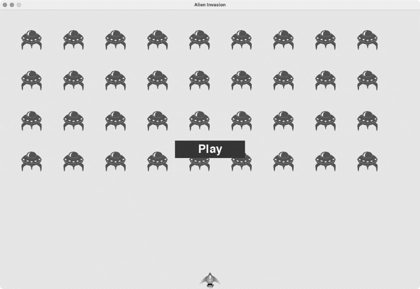
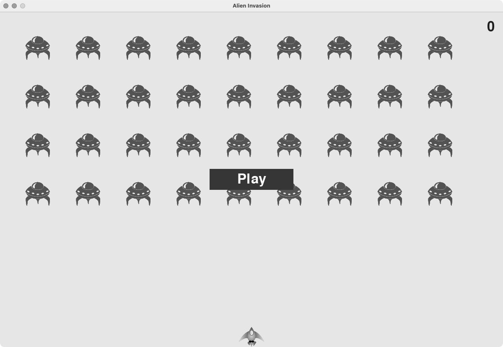
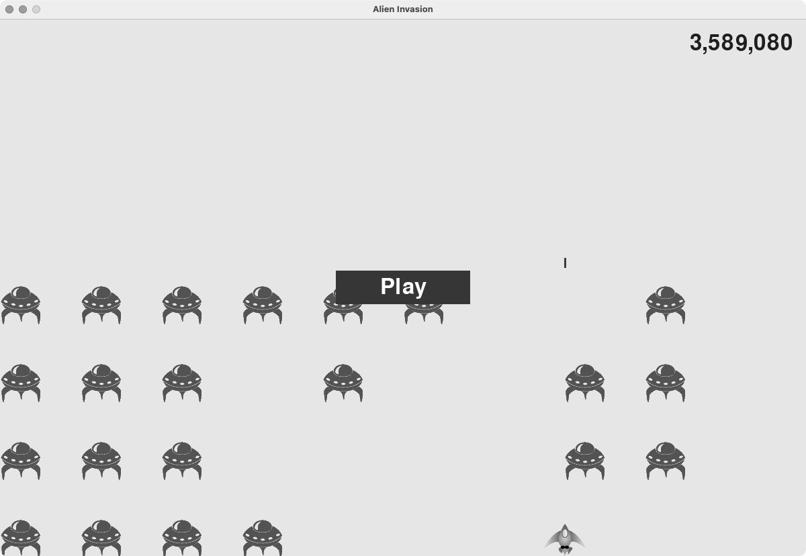
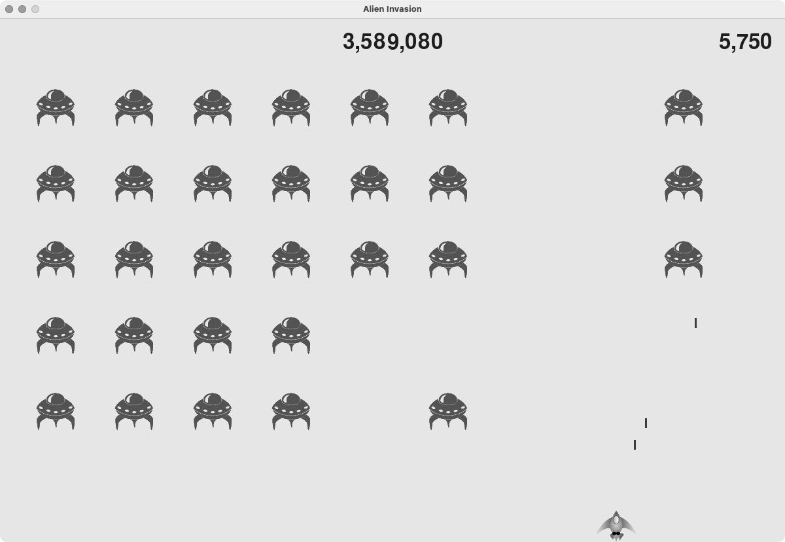
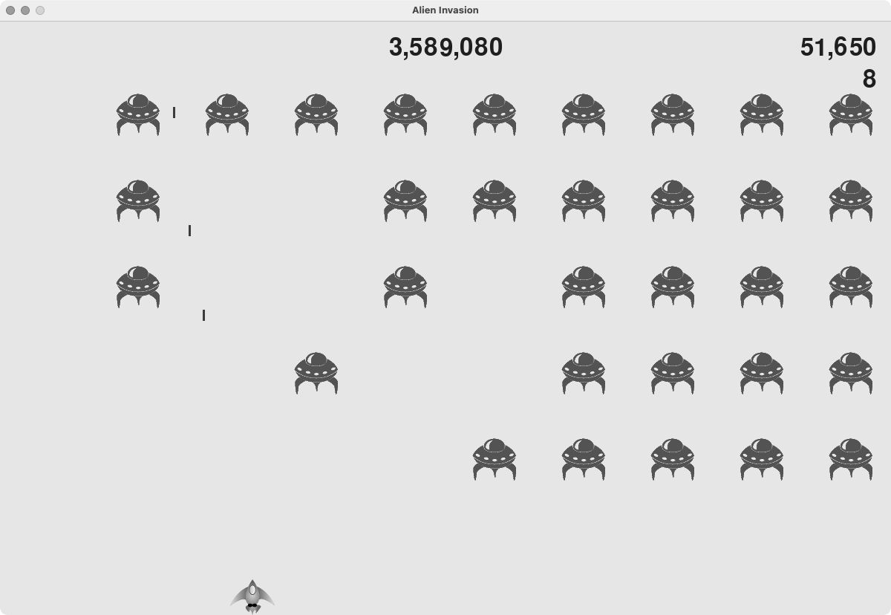
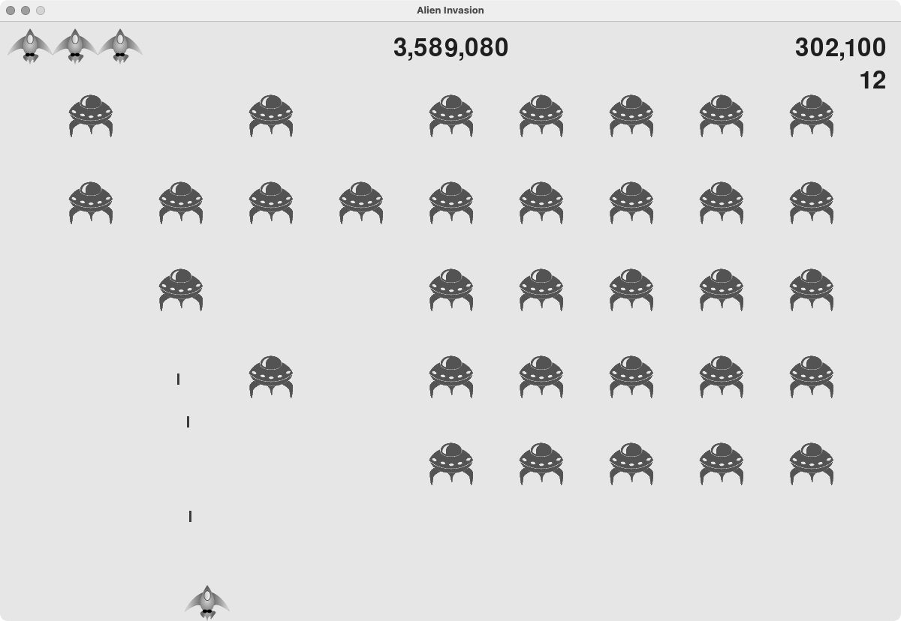

## 1. 添加 Play 按钮

本章将结束游戏《外星人入侵》的开发：添加一个 Play 按钮，用于根据需要启动游戏以及在游戏结束后重启游戏；还会修改这个游戏，使其随玩家等级的提高而加快节奏，并实现一个记分系统。

本节将添加一个 Play 按钮，它在游戏开始前出现，并在游戏结束后再次出现，让玩家能够开始新游戏。当前，这个游戏在玩家运行 alien_invasion.py 时就开始了。下面让游戏在一开始处于非活动状态，并提示玩家单击 Play 按钮来开始游戏：

```python
    def __init__(self):
        """初始化统计信息"""
        pygame.init()
    --snip--
        # 让游戏在一开始处于非活动状态
        self.game_active = False
```

现在，游戏在一开始处于非活动状态，等玩家单击我们创建的 Play 按钮后，才能开始游戏。

### 创建类Button

由于 Pygame 没有内置创建按钮的方法，我们将编写一个 Button 类，用于创建带标签的实心矩形。你可在游戏中使用这些代码来创建任意按钮。下面是 Button 类的第一部分，请将这个类保存为文件 button.py：

```python
  import pygame.font

  class Button:
      """为游戏创建按钮的类"""

❶     def __init__(self, ai_game, msg):
          """初始化按钮的属性"""
          self.screen = ai_game.screen
          self.screen_rect = self.screen.get_rect()

          # 设置按钮的尺寸和其他属性
❷         self.width, self.height = 200, 50
          self.button_color = (0, 135, 0)
          self.text_color = (255, 255, 255)
❸         self.font = pygame.font.SysFont(None, 48)

          # 创建按钮的rect对象，并使其居中
❹         self.rect = pygame.Rect(0, 0, self.width, self.height)
          self.rect.center = self.screen_rect.center

          # 按钮的标签只需创建一次
❺         self._prep_msg(msg)
```

首先，导入 pygame.font 模块，它让 Pygame 能够将文本渲染到屏幕上。\_\_init\_\_() 方法接受参数 self、对象 ai_game 和 msg，其中 msg 是要在按钮中显示的文本（见❶）。我们设置按钮的尺寸（见❷），再通过设置 button_color 让按钮的 rect 对象为深绿色的，并通过设置 text_color 让文本为白色的。

接下来，指定使用什么字体来渲染文本（见❸）：实参 None 让 Pygame 使用默认字体，而 48 指定了文本的字号。为让按钮在屏幕上居中，创建一个表示按钮的 rect 对象（见❹），并将其 center 属性设置为屏幕的 center 属性。

Pygame 处理文本的方式是，将要显示的字符串渲染为图像。最后，调用 \_prep_msg() 来处理这样的渲染（见❺）。\_prep_msg() 的代码如下：

```python
      def _prep_msg(self, msg):
          """将msg渲染为图像，并使其在按钮上居中"""
❶         self.msg_image = self.font.render(msg, True, self.text_color,
                   self.button_color)
❷         self.msg_image_rect = self.msg_image.get_rect()
          self.msg_image_rect.center = self.rect.center
```

\_prep_msg() 方法接受实参 self 以及要渲染为图像的文本（msg）。我们在其中调用 font.render() 将存储在 msg 中的文本转换为图像，再将该图像存储在 self.msg_image 中（见❶）。方法 font.render() 还接受一个布尔实参，该实参指定是否开启反锯齿功能（反锯齿让文本的边缘更平滑），余下的两个实参分别是文本颜色和背景色。我们开启反锯齿功能，并将文本的背景色设置为按钮的颜色（如果没有指定背景色，Pygame 在渲染文本时将使用透明的背景）。

在❷处，让文本图像在按钮上居中：根据文本图像创建一个 rect，并将其 center 属性设置为按钮的 center 属性。

最后，创建 draw_button() 方法，用来将这个按钮显示到屏幕上：

```python
    def draw_button(self):
        """绘制一个用颜色填充的按钮，再绘制文本"""
        self.screen.fill(self.button_color, self.rect)
        self.screen.blit(self.msg_image, self.msg_image_rect)
```

调用 screen.fill() 来绘制表示按钮的矩形，再调用 screen.blit() 向它传递一幅图像以及与该图像相关联的 rect，从而在屏幕上绘制文本图像。至此，Button 类便创建好了。

### 在屏幕上绘制按钮

将在 AlienInvasion 中使用 Button 类来创建一个 Play 按钮。首先，更新 import 语句：

```python
--snip--
from game_stats import GameStats
from button import Button
```

由于只需要一个 Play 按钮，因此在 AlienInvasion 类的 \_\_init\_\_() 方法中创建它：

```python
    def __init__(self):
    --snip--
        self.game_active = False

        # 创建Play按钮
        self.play_button = Button(self, "Play")
```

这些代码创建一个标签为 Play 的 Button 实例，但没有将它显示到屏幕上。要显示这个按钮，在 \_update_screen() 中对这个按钮调用 draw_button() 方法：

```python
    def _update_screen(self):
    --snip--
        self.aliens.draw(self.screen)

        # 如果游戏处于非活动状态，就绘制Play按钮
        if not self.game_active:
            self.play_button.draw_button()

        pygame.display.flip()
```

为了让 Play 按钮显示在屏幕上其他所有元素之上，要在绘制其他所有元素后再绘制这个按钮，然后切换到新屏幕。将这些代码放在一个 if 代码块中，让按钮仅在游戏处于非活动状态时才出现。现在运行这个游戏，将在屏幕中央看到一个 Play 按钮，如图 14-1 所示。



### 开始游戏

为了在玩家单击 Play 按钮时开始新游戏，在 \_check_events() 末尾添加如下 elif 代码块，以监视与这个按钮相关的鼠标事件：

```python
      def _check_events(self):
          """响应按键和鼠标事件"""
          for event in pygame.event.get():
              if event.type == pygame.QUIT:
              --snip--
❶             elif event.type == pygame.MOUSEBUTTONDOWN:
❷                 mouse_pos = pygame.mouse.get_pos()
❸                 self._check_play_button(mouse_pos)
```

无论玩家单击屏幕的什么地方，Pygame 都将检测到一个 MOUSEBUTTONDOWN 事件（见❶），但我们只想让这个游戏在玩家单击 Play 按钮时做出响应。为此，使用 pygame.mouse.get_pos()，它返回一个元组，其中包含玩家单击鼠标时光标的 x 坐标和 y 坐标（见❷）。我们将这个元组传递给新方法 \_check_play_button()（见❸），其代码如下，放在 \_check_events() 后面：

```python
      def _check_play_button(self, mouse_pos):
          """在玩家单击Play按钮时开始新游戏"""
❶         if self.play_button.rect.collidepoint(mouse_pos):
              self.game_active = True
```

这里使用 rect 的 collidepoint() 方法检查鼠标的单击位置是否在 Play 按钮的 rect 内（见❶）。如果是，就将 game_active 设置为 True，让游戏开始。

至此，现在应该能够开始这个游戏了。游戏结束时，game_active 会被设置为 False，从而重新显示 Play 按钮。

### 重置游戏

前面编写的代码只处理了玩家第一次单击 Play 按钮的情况，没有处理游戏结束的情况，因为还没有重置导致游戏结束的条件。

为了在玩家每次单击 Play 按钮时都正确地重置，需要重置统计信息、删除现有的外星人和子弹、创建一个新的外星舰队并让飞船居中，如下所示：

```python
      def _check_play_button(self, mouse_pos):
          """在玩家单击Play按钮时开始新游戏"""
          if self.play_button.rect.collidepoint(mouse_pos):
              # 重置游戏的统计信息
❶             self.stats.reset_stats()
              self.game_active = True

              # 清空外星人列表和子弹列表
❷             self.bullets.empty()
              self.aliens.empty()

              # 创建一个新的外星舰队，并将飞船放在屏幕底部的中央
❸             self._create_fleet()
              self.ship.center_ship()
```

在❶处，重置游戏的统计信息，给玩家提供三艘新飞船。接下来，将 game_active 设置为 True（这样，只要这个方法的代码执行完毕，游戏就将开始），清空编组 aliens 和 bullets（见❷），创建一个新的外星舰队并将飞船居中（见❸）。现在，每当玩家单击 Play 按钮时，这个游戏都将正确地重置，让玩家想玩多少次就玩多少次。

### 将Play按钮切换到非活动状态

当前存在一个问题：即便 Play 按钮不可见，当玩家单击其原来所在的区域时，游戏也依然会做出响应。游戏开始后，如果玩家不小心单击了 Play 按钮原来所处的区域，游戏将重新开始。

为了修复这个问题，可让游戏仅在 game_active 为 False 时才开始：

```python
      def _check_play_button(self, mouse_pos):
          """在玩家单击Play按钮时开始新游戏"""
❶         button_clicked = self.play_button.rect.collidepoint(mouse_pos)
❷         if button_clicked and not self.game_active:
              # 重置游戏的统计信息
              self.stats.reset_stats()
          --snip--
```

标志 button_clicked 的值为 True 或 False（见❶）。仅当玩家单击了 Play 按钮，且游戏当前处于非活动状态时，游戏才会重新开始（见❷）。要测试这种行为，可开始新游戏，并不断地单击 Play 按钮原来所在的区域。如果一切正常，单击 Play 按钮原来所处的区域应该没有任何影响。

### 隐藏光标

当游戏处于非活动状态时，我们要让光标可见，但游戏开始后，光标只会添乱。为了修复这个问题，需要在游戏处于活动状态时让光标不可见。可在 \_check_play_button() 方法末尾的 if 代码块中完成这项任务：

```python
    def _check_play_button(self, mouse_pos):
        """在玩家单击Play按钮时开始新游戏"""
        button_clicked = self.play_button.rect.collidepoint(mouse_pos)
        if button_clicked and not self.game_active:
        --snip--
            # 隐藏光标
            pygame.mouse.set_visible(False)
```

通过向 set_visible() 传递 False，让 Pygame 在光标位于游戏窗口内时将其隐藏起来。

游戏结束后，将重新显示光标，让玩家能够单击 Play 按钮来开始新游戏。相关的代码如下：

```python
    def _ship_hit(self):
        """响应飞船和外星人的碰撞"""
        if self.stats.ships_left > 0:
        --snip--
        else:
            self.game_active = False
            pygame.mouse.set_visible(True)
```

在 \_ship_hit() 中，我们在游戏进入非活动状态后，立即让光标可见。关注这样的细节既让游戏显得更专业，也让玩家能够专注于玩游戏而不是去费力理解用户界面。

## 2. 提高难度

当前，整个外星舰队被全部击落后，玩家将提高一个等级，但游戏的难度不变。下面来增加一点儿趣味性：每当玩家将屏幕上的外星人全部击落后，都加快游戏的节奏，让游戏玩起来更难。

### 修改速度设置

首先重新组织 Settings 类，将游戏设置划分成两组：静态的和动态的。对于随着游戏进行而变化的设置，还要确保在开始新游戏时重置。settings.py 的 \_\_init\_\_() 方法如下：

```python
      def __init__(self):
          """初始化游戏的静态设置"""
          # 屏幕设置
          self.screen_width = 1200
          self.screen_height = 800
          self.bg_color = (230, 230, 230)

          # 飞船设置
          self.ship_limit = 3

          # 子弹设置
          self.bullet_width = 3
          self.bullet_height = 15
          self.bullet_color = 60, 60, 60
          self.bullets_allowed = 3

          # 外星人设置
          self.fleet_drop_speed = 10

          # 以什么速度加快游戏的节奏
❶         self.speedup_scale = 1.1

❷         self.initialize_dynamic_settings()
```

依然在 \_\_init\_\_() 中初始化静态设置。在❶处，添加设置 speedup_scale，用来控制游戏节奏的加快速度：2 表示玩家每提高一个等级，游戏的节奏就翻一倍；1 表示游戏的节奏始终不变。将这个值设置为 1.1 既可以不断加快游戏的节奏，又可以避免因难度提升过快而玩不下去。最后，调用 initialize_dynamic_settings() 初始化随游戏进行而变化的属性（见❷）。

initialize_dynamic_settings() 的代码如下：

```python
    def initialize_dynamic_settings(self):
        """初始化随游戏进行而变化的设置"""
        self.ship_speed = 1.5
        self.bullet_speed = 2.5
        self.alien_speed = 1.0

        # fleet_direction为1表示向右，为-1表示向左
        self.fleet_direction = 1
```

这个方法设置飞船、子弹和外星人的初始速度。随着游戏的进行，这些速度都将逐渐加快。每当玩家开始新游戏时，都将重置这些速度。在这个方法中，还设置了 fleet_direction，使得在游戏刚开始时，外星人总是向右移动。不需要增大 fleet_drop_speed 的值，因为外星人移动的速度越快，到达屏幕下边缘所需的时间就已经越短了。

为了在玩家的等级提高时加快飞船、子弹和外星人的速度，编写一个名为 increase_speed() 的新方法：

```python
    def increase_speed(self):
        """提高速度设置的值"""
        self.ship_speed *= self.speedup_scale
        self.bullet_speed *= self.speedup_scale
        self.alien_speed *= self.speedup_scale
```

为了加快这些游戏元素的速度，将每个速度设置都乘以 speedup_scale 的值。在 alien_invasion.py 中，在 \_check_bullet_alien_collisions() 里整个外星舰队被全部击落后调用 increase_speed() 来加快游戏的节奏：

```python
    def _check_bullet_alien_collisions(self):
    --snip--
        if not self.aliens:
            # 删除现有的子弹并创建一个新的外星舰队
            self.bullets.empty()
            self._create_fleet()
            self.settings.increase_speed()
```

通过修改速度设置 ship_speed、alien_speed 和 bullet_speed 的值，足以加快整个游戏的节奏。

### 重置速度

每当玩家开始新游戏时，都需要将发生了变化的设置还原为初始值，否则新游戏将沿用上一轮已经调整了的速度参数：

```python
    def _check_play_button(self, mouse_pos):
        """在玩家单击Play按钮时开始新游戏"""
        button_clicked = self.play_button.rect.collidepoint(mouse_pos)
        if button_clicked and not self.game_active:
            # 还原游戏设置
            self.settings.initialize_dynamic_settings()
        --snip--
```

现在，游戏《外星人入侵》玩起来更有趣，也更有挑战性了。每当玩家将屏幕上的外星人全部击落后，游戏都将加快节奏，因此难度会越来越大。如果游戏的难度提高得太快，可减小 settings.speedup_scale 的值；如果游戏的挑战性不足，可稍微增大这个设置的值。找出这个设置的最佳值，让难度的提高速度相对合理：一开始的几群外星舰队很容易全部击落；接下来的几群消灭起来有一定难度，但也不是不可能；而要将之后的外星舰队全部击落则几乎不可能。

## 3. 记分

下面来实现记分系统，以实时地跟踪玩家的得分，并显示最高分、等级和余下的飞船数。

得分是游戏的一项统计信息，因此在 GameStats 中添加一个属性 score：

```python
class GameStats:
--snip--
    def reset_stats(self):
        """初始化随游戏进行可能变化的统计信息"""
        self.ships_left = self.settings.ship_limit
        self.score = 0
```

为了在每次开始游戏时都重置得分，在 reset_stats() 而不是 \_\_init\_\_() 中初始化 score。

### 显示得分

为了在屏幕上显示得分，首先创建一个新类 Scoreboard。当前，这个类只显示当前得分，但后面也将用来显示最高分、等级和余下的飞船数。下面是这个类的前半部分，它被保存为文件 scoreboard.py：

```python
  import pygame.font

  class Scoreboard:
      """显示得分信息的类"""

❶     def __init__(self, ai_game):
          """初始化显示得分涉及的属性"""
          self.screen = ai_game.screen
          self.screen_rect = self.screen.get_rect()
          self.settings = ai_game.settings
          self.stats = ai_game.stats

          # 显示得分信息时使用的字体设置
❷         self.text_color = (30, 30, 30)
❸         self.font = pygame.font.SysFont(None, 48)

          # 准备初始得分图像
❹         self.prep_score()
```

因为 Scoreboard 需要在屏幕上显示文本，所以首先导入模块 pygame.font。接下来，为了获取我们跟踪的值，在 \_\_init\_\_() 中包含形参 ai_game，以便访问游戏中的对象 settings、stats 和 screen。然后，设置文本颜色（见❷）并实例化一个字体对象（见❸）。为了将要显示的文本转换为图像，调用 prep_score()（见❹），其定义如下：

```python
      def prep_score(self):
          """将得分渲染为图像"""
❶         score_str = str(self.stats.score)
❷         self.score_image = self.font.render(score_str, True,
                   self.text_color, self.settings.bg_color)

          # 在屏幕右上角显示得分
❸         self.score_rect = self.score_image.get_rect()
❹         self.score_rect.right = self.screen_rect.right - 20
❺         self.score_rect.top = 20
```

在 prep_score() 中，将数值 stats.score 转换为字符串（见❶），再将这个字符串传递给创建图像的 render()（见❷）。为了在屏幕上清晰地显示得分，向 render() 传递文本颜色并设置屏幕的背景色。

得分放在屏幕的右上角，当位数增加导致数字更宽时，它会向左延伸。为了确保得分始终锚定在屏幕的右上角，创建一个名为 score_rect 的 rect（见❸），让其右边缘与屏幕右边缘相距 20 像素（见❹），并让其上边缘与屏幕上边缘也相距 20 像素（见❺）。

接下来，创建 show_score() 方法，用于显示渲染好的得分图像：

```python
    def show_score(self):
        """在屏幕上显示得分"""
        self.screen.blit(self.score_image, self.score_rect)
```

这个方法将在屏幕上显示得分图像，并将其放在 score_rect 指定的位置上。

### 创建记分牌

为了显示得分，在 AlienInvasion 中创建一个 Scoreboard 实例。先来更新 import 语句：

```python
--snip--
from game_stats import GameStats
from scoreboard import Scoreboard
--snip--
```

接下来，在 \_\_init\_\_() 方法中创建一个 Scoreboard 实例：

```python
    def __init__(self):
    --snip--
        pygame.display.set_caption("Alien Invasion")

        # 创建存储游戏统计信息的实例，并创建记分牌
        self.stats = GameStats(self)
        self.sb = Scoreboard(self)
    --snip--
```

然后，在 \_update_screen() 中将记分牌绘制到屏幕上：

```python
    def _update_screen(self):
    --snip--
        self.aliens.draw(self.screen)

        # 显示得分
        self.sb.show_score()

        # 如果游戏处于非活动状态，就显示Play按钮
    --snip--
```

在显示 Play 按钮前调用 show_score()。现在运行这个游戏，将在屏幕右上角看到 0（当前，我们只想在进一步开发记分系统前确认得分出现在了正确的地方）。图 14-2 显示了游戏开始前的得分。



### 在外星人被击落时更新得分

为了在屏幕上实时地显示得分，每当有外星人被击中时，都先更新 stats.score 的值，再用 prep_score() 更新得分图像。但在此之前，需要指定玩家每击落一个外星人将得到多少分：

```python
    def initialize_dynamic_settings(self):
    --snip--
        # 记分设置
        self.alien_points = 50
```

随着游戏的进行，将提高每个外星人的分数。为了确保每次开始新游戏时这个值都会重置，在 initialize_dynamic_settings() 中设置它。

在 \_check_bullet_alien_collisions() 中，每当有外星人被击落时，都更新得分：

```python
    def _check_bullet_alien_collisions(self):
        """响应子弹和外星人的碰撞"""
        # 删除发生碰撞的子弹和外星人
        collisions = pygame.sprite.groupcollide(
                self.bullets, self.aliens, True, True)

        if collisions:
            self.stats.score += self.settings.alien_points
            self.sb.prep_score()
    --snip--
```

当有子弹击中外星人时，Pygame 返回字典 collisions。我们检查这个字典是否存在，如果存在，就将得分加上一个外星人的分数。接下来，调用 prep_score() 来创建一幅包含最新得分的新图像。现在，运行这个游戏，尽情得分吧！

### 重置得分

当前，仅在有外星人被击落之后生成得分，这在大多数情况下可行，但从开始新游戏到有外星人被击落之间，显示的还是上一局的得分。

为了修复这个问题，可在开始新游戏时生成得分：

```python
    def _check_play_button(self, mouse_pos):
    --snip--
        if button_clicked and not self.game_active:
        --snip--
            # 重置游戏的统计信息
            self.stats.reset_stats()
            self.sb.prep_score()
        --snip--
```

在开始新游戏时，我们重置游戏的统计信息再调用 prep_score()。此时生成的记分牌上显示的得分为 0。

### 将每个被击落的外星人都计入得分

当前的代码可能会遗漏一些被击落的外星人：如果在一次循环中有两颗子弹分别击中了两个外星人，或者因一颗子弹太宽而同时击中了多个外星人，玩家将只能得到一个外星人的分数。为了修复这个问题，我们来调整检测子弹和外星人碰撞的方式。

在 \_check_bullet_alien_collisions() 中，与外星人碰撞的子弹都是字典 collisions 中的一个键，而与每颗子弹相关联的值都是一个列表，其中包含该子弹击中的外星人。我们遍历字典 collisions，确保将每个被击落的外星人都计入得分：

```python
    def _check_bullet_alien_collisions(self):
    --snip--
        if collisions:
            for aliens in collisions.values():
                self.stats.score += self.settings.alien_points * len(aliens)
            self.sb.prep_score()
    --snip--
```

如果字典 collisions 存在，就遍历其中的所有值。别忘了，每个值都是一个列表，包含被同一颗子弹击中的所有外星人。对于每个列表，都将其包含的外星人数量乘以一个外星人的分数，并将结果加入当前得分。为了进行测试，可以将子弹的宽度改为 300 像素，并验证用这颗更宽的子弹击中每个外星人都会得分，然后将子弹的宽度恢复到正常值。

### 提高分数

鉴于玩家每提高一个等级，游戏都会变得更难，因此在处于较高的等级时，外星人的分数应该更高。为了实现这个功能，需要编写在游戏节奏加快时提高分数的代码：

```python
  class Settings:
      """存储游戏《外星人入侵》的所有设置的类"""

      def __init__(self):
      --snip--
          # 以什么速度加快游戏的节奏
          self.speedup_scale = 1.1
          # 外星人分数的提高速度
❶         self.score_scale = 1.5

          self.initialize_dynamic_settings()

      def initialize_dynamic_settings(self):
      --snip--

      def increase_speed(self):
          """提高速度设置的值和外星人分数"""
          self.ship_speed *= self.speedup_scale
          self.bullet_speed *= self.speedup_scale
          self.alien_speed *= self.speedup_scale

❷         self.alien_points = int(self.alien_points * self.score_scale)
```

我们定义了分数的提高速度，并称之为 score_scale（见❶）。较慢的节奏加快速度（1.1）也能让游戏很快变得极具挑战性，但为了让得分发生显著的变化，需要将分数的提高速度设置为更大的值（1.5）。现在，在加快游戏节奏的同时，还提高了每个外星人的分数（见❷）。为了让外星人的分数为整数，使用函数 int()。

为了显示外星人的分数，在 Settings 的方法 increase_speed() 中调用函数 print()：

```python
    def increase_speed(self):
    --snip--
        self.alien_points = int(self.alien_points * self.score_scale)
        print(self.alien_points)
```

现在每提高一个等级，你都将在终端窗口看到新的分数值。

注意：确认分数在不断增加后，请记得删除调用函数 print() 的代码，否则可能影响游戏的性能，分散玩家的注意力。

### 对得分进行舍入

大多数街机风格的射击游戏将得分显示为 10 的整数倍，下面就让记分系统遵循这个原则。我们还将设置得分的格式，在大数中添加用逗号表示的千位分隔符。在 Scoreboard 中进行这种修改：

```python
    def prep_score(self):
        """将得分渲染为图像"""
        rounded_score = round(self.stats.score, -1)
        score_str = f"{rounded_score:,}"
        self.score_image = self.font.render(score_str, True,
                self.text_color, self.settings.bg_color)
    --snip--
```

round() 函数通常让浮点数（第一个实参）精确到小数点后某一位，其中的小数位数由第二个实参指定。如果将第二个实参指定为负数，round() 会将第一个实参舍入到最近的 10 的整数倍，如 10、100、1000 等。这里的代码让 Python 将 stats.score 的值舍入到最近的 10 的整数倍，并将结果存储到 rounded_score 中。

接下来，在表示得分的 f 字符串中使用一个**格式说明符**。格式说明符是一个特殊的字符序列，用于指定如何显示变量的值。这里使用的字符序列为冒号和逗号（:，），它让 Python 在数值的合适位置插入逗号，生成的字符串类似于 1,000,000（而不是 1000000）。

现在运行这个游戏，看到的得分将是 10 的整数倍，即便得分很高也是如此，如图 14-3 所示。



### 最高分

每个玩家都想超过游戏的最高分记录。下面来跟踪并显示最高分，给玩家提供要超越的目标。我们将最高分存储在 GameStats 中：

```python
    def __init__(self, ai_game):
    --snip--
        # 在任何情况下都不应重置最高分
        self.high_score = 0
```

由于在任何情况下都不会重置最高分，因此在 \_\_init\_\_() 而不是 reset_stats() 中初始化 high_score。

下面来修改 Scoreboard 以显示最高分。先来修改 \_\_init\_\_() 方法：

```python
      def __init__(self, ai_game):
      --snip--
          # 准备包含最高分和当前得分的图像
          self.prep_score()
❶         self.prep_high_score()
```

最高分将与当前得分分开显示，因此需要编写一个新方法 prep_high_score()，用于准备包含最高分的图像（见❶）。方法 prep_high_score() 的代码如下：

```python
      def prep_high_score(self):
          """将最高分渲染为图像"""
❶         high_score = round(self.stats.high_score, -1)
          high_score_str = f"{high_score:,}"
❷         self.high_score_image = self.font.render(high_score_str, True,
                   self.text_color, self.settings.bg_color)

          # 将最高分放在屏幕顶部的中央
          self.high_score_rect = self.high_score_image.get_rect()
❸         self.high_score_rect.centerx = self.screen_rect.centerx
❹         self.high_score_rect.top = self.score_rect.top
```

首先，将最高分舍入到最近的 10 的整数倍，并添加用逗号表示的千分位分隔符（见❶）。然后，根据最高分生成一幅图像（见❷），使其水平居中（见❸），并将其属性 top 设置为当前得分图像的属性 top（见❹）。

现在，方法 show_score() 需要在屏幕右上角显示当前得分，并在屏幕顶部的中央显示最高分：

```python
    def show_score(self):
        """在屏幕上显示当前得分和最高分"""
        self.screen.blit(self.score_image, self.score_rect)
        self.screen.blit(self.high_score_image, self.high_score_rect)
```

为了检查是否诞生了新的最高分，在 Scoreboard 中添加一个新方法 check_high_score()：

```python
    def check_high_score(self):
        """检查是否诞生了新的最高分"""
        if self.stats.score > self.stats.high_score:
            self.stats.high_score = self.stats.score
            self.prep_high_score()
```

check_high_score() 方法比较当前得分和最高分：如果当前得分更高，就更新 high_score 的值，并调用 prep_high_score() 来更新包含最高分的图像。

在 \_check_bullet_alien_collisions() 中，每当有外星人被击落时，都需要在更新得分后调用 check_high_score()：

```python
    def _check_bullet_alien_collisions(self):
    --snip--
        if collisions:
            for aliens in collisions.values():
                self.stats.score += self.settings.alien_points * len(aliens)
            self.sb.prep_score()
            self.sb.check_high_score()
    --snip--
```

如果字典 collisions 存在，就根据击落了多少个外星人更新得分，再调用 check_high_score()。

在第一次玩这款游戏时，当前得分就是最高分，因此两个地方显示的都是当前得分。但是再次开始这个游戏时，最高分会出现在屏幕顶部的中央，而当前得分则会出现在屏幕的右上角，如图 14-4 所示。



### 显示等级

为了在游戏中显示玩家的等级，首先需要在 GameStats 中添加一个表示当前等级的属性。要确保在每次开始新游戏时都重置等级，我们在 reset_stats() 中初始化该属性：

```python
    def reset_stats(self):
        """初始化随游戏进行可能变化的统计信息"""
        self.ships_left = self.settings.ship_limit
        self.score = 0
        self.level = 1
```

为了让 Scoreboard 显示当前等级，在 \_\_init\_\_() 中调用一个新方法 prep_level()：

```python
    def __init__(self, ai_game):
    --snip--
        self.prep_high_score()
        self.prep_level()
```

prep_level() 的代码如下：

```python
      def prep_level(self):
          """将等级渲染为图像"""
          level_str = str(self.stats.level)
❶         self.level_image = self.font.render(level_str, True,
                   self.text_color, self.settings.bg_color)

          # 将等级放在得分下方
          self.level_rect = self.level_image.get_rect()
❷         self.level_rect.right = self.score_rect.right
❸         self.level_rect.top = self.score_rect.bottom + 10
```

方法 prep_level() 会根据存储在 stats.level 中的值创建一幅图像（见❶），并将其 right 属性设置为得分的属性 right（见❷）；然后，将 top 属性设置得比得分图像的 bottom 属性大 10 像素，在得分和等级之间留出一定的空间（见❸）。

还需要更新 show_score()：

```python
     def show_score(self):
        """在屏幕上显示得分和等级"""
        self.screen.blit(self.score_image, self.score_rect)
        self.screen.blit(self.high_score_image, self.high_score_rect)
        self.screen.blit(self.level_image, self.level_rect)
```

新增的代码行用于在屏幕上显示等级图像。

接下来，我们在 \_check_bullet_alien_collisions() 中提高等级 stats.level 并更新等级图像：

```python
    def _check_bullet_alien_collisions(self):
    --snip--
        if not self.aliens:
            # 删除现有的子弹并创建一个新的外星舰队
            self.bullets.empty()
            self._create_fleet()
            self.settings.increase_speed()

            # 提高等级
            self.stats.level += 1
            self.sb.prep_level()
```

如果整个外星舰队都被击落，就将 stats.level 的值加 1，并调用 prep_level() 以确保正确地显示了新等级。为了确保在开始新游戏时更新等级图像，还需在玩家单击按钮 Play 时调用 prep_level()：

```python
    def _check_play_button(self, mouse_pos):
    --snip--
        if button_clicked and not self.game_active:
        --snip--
            self.sb.prep_score()
            self.sb.prep_level()
        --snip--
```

现在我们可以知道玩家到了多少级，如图 14-5 所示。



注意：在一些经典游戏中，得分带标签，如 Score、High Score 和 Level。这里没有显示这些标签，因为在游戏开始后，每个数的含义将一目了然。要包含这些标签，只需在 Scoreboard 中调用 font.render() 之前，将它们添加到得分字符串中。

### 显示余下的飞船数

最后，我们使用图形而不是数来显示玩家还剩多少艘飞船。为此，在屏幕左上角绘制飞船图像来指出还余下多少艘飞船，就像众多经典的街机游戏那样。

首先，需要让 Ship 继承 Sprite，以便能够创建飞船编组：

```python
  import pygame
  from pygame.sprite import Sprite

❶ class Ship(Sprite):
      """管理飞船的类"""

      def __init__(self, ai_game):
          """初始化飞船并设置其起始位置"""
❷         super().__init__()
      --snip--
```

这里导入了 Sprite，让 Ship 继承 Sprite（见❶），并在 \_\_init\_\_() 的开头调用 super() 以完成精灵的初始化工作（见❷）。

接下来，需要修改 Scoreboard，以创建可供显示的飞船编组。下面是其中的 import 语句：

```python
import pygame.font
from pygame.sprite import Group

from ship import Ship
```

鉴于需要创建飞船编组，导入 Group 类和 Ship 类。下面是 \_\_init\_\_() 方法：

```python
    def __init__(self, ai_game):
        """初始化记录得分的属性"""
        self.ai_game = ai_game
        self.screen = ai_game.screen
    --snip--
        self.prep_level()
        self.prep_ships()
```

我们将游戏实例赋给一个属性，因为创建飞船时需要用到它。然后在调用 prep_level() 后调用 prep_ships()。

prep_ships() 的代码如下：

```python
      def prep_ships(self):
          """显示还余下多少艘飞船"""
❶         self.ships = Group()
❷         for ship_number in range(self.stats.ships_left):
              ship = Ship(self.ai_game)
❸             ship.rect.x = 10 + ship_number * ship.rect.width
❹             ship.rect.y = 10
❺             self.ships.add(ship)
```

方法 prep_ships() 会创建一个空编组 self.ships，用于存储飞船实例（见❶）。根据玩家还有多少艘飞船，以相应的次数运行一个循环，来填充这个编组（见❷）。在这个循环中，我们创建新飞船并设置其 x 坐标，让整个飞船编组都位于屏幕左边缘，且每艘飞船的左边距都为 10 像素（见❸）；我们还将飞船的 y 坐标设置为距离屏幕上边缘 10 像素，让所有飞船都出现在屏幕的左上角（见❹）；最后，将每艘新飞船都添加到编组 ships 中（见❺）。

现在需要在屏幕上绘制飞船了：

```python
    def show_score(self):
        """在屏幕上绘制得分、等级和余下的飞船数"""
        self.screen.blit(self.score_image, self.score_rect)
        self.screen.blit(self.high_score_image, self.high_score_rect)
        self.screen.blit(self.level_image, self.level_rect)
        self.ships.draw(self.screen)
```

对编组调用 draw()，Pygame 将在屏幕上绘制每艘飞船。

为了在游戏开始时让玩家知道自己有多少艘飞船，可以在开始新游戏时调用 prep_ships()，因此修改 AlienInvasion 类中的 \_check_play_button() 方法：

```python
    def _check_play_button(self, mouse_pos):
    --snip--
        if button_clicked and not self.game_active:
        --snip--
            self.sb.prep_level()
            self.sb.prep_ships()
        --snip--
```

当然，还要在飞船被外星人撞到时调用 prep_ships()，从而在玩家损失飞船时更新飞船图像：

```python
    def _ship_hit(self):
        """响应飞船和外星人的碰撞"""
        if self.stats.ships_left > 0:
            # 将ships_left减1并更新记分牌
            self.stats.ships_left -= 1
            self.sb.prep_ships()
    --snip--
```

这里在将 ships_left 的值减 1 后调用 prep_ships()。这样每次损失飞船后，显示的剩余飞船数都是正确的。

图 14-6 显示了完整的记分系统，它在屏幕的左上角指出了还余下多少艘飞船。



## 4. 小结

在本章中，你学习了如何创建用于开始新游戏的 Play 按钮、如何检测鼠标事件，以及如何在游戏处于活动状态时隐藏光标。你可以利用学到的知识在游戏中创建其他按钮，如显示游戏玩法的 Help 按钮。你还学习了如何随游戏的进行调整节奏、如何实现记分系统，以及如何以文本和非文本方式显示信息。
