数据可视化指的是通过可视化表示来探索和呈现数据集内的规律。它与数据分析紧密相关，而数据分析指的是使用代码来探索数据集内的规律和关联。数据集既可以是用一行代码就能装下的小型数值列表，也可以是数万亿字节、包含多种信息的数据。

有效的数据可视化不仅仅是以漂亮的方式呈现数据。重要的是，通过以简单而引人注目的方式呈现数据，让观看者能够明白其含义：发现数据集中原本未知的规律和意义。所幸，即便没有超级计算机，也能够可视化复杂的数据：鉴于 Python 的高效性，使用它在笔记本计算机上就能快速地探索由数百万个数据点组成的数据集。

在遗传学、天气研究、政治和经济分析等众多领域，人们常常使用 Python 来完成数据密集型工作。数据科学家使用 Python 编写了一系列优秀的可视化和分析工具，你可以轻易使用其中的大部分工具。一个流行的工具是 Matplotlib，它是一个数学绘图库。本章将使用它来制作简单的**绘图**（plot），如折线图和散点图，还将基于随机游走的概念（根据一系列随机决策生成图形）生成一个更有趣的数据集。

本章还将使用 Plotly 包来分析掷骰子的结果，这个包生成的图形非常适合在数字设备上显示——不仅能根据显示设备的尺寸自动调整大小，还具备众多交互特性，如在用户将鼠标指向图形的不同区域时，突出显示数据集的相应特征。

## 1. 安装 Matplotlib

本章将首先使用 Matplotlib 来生成几个图形，为此像前面安装 pytest 那样，这里使用 pip 安装 Matplotlib。要安装 Matplotlib，请在终端提示符下执行如下命令：

```
$ python -m pip install --user matplotlib
```

如果你在运行程序或启动终端会话时使用的命令不是 python，而是 python3，应使用类似下面的命令来安装 Matplotlib：

```
$ python3 -m pip install --user matplotlib
```

要查看使用 Matplotlib 可绘制的各种图形，请访问 Matplotlib 主页并单击 Examples。通过单击 Plot types 页面中的绘图，就能查看生成它们的代码。

## 2. 绘制简单的折线图

下面使用 Matplotlib 绘制一张简单的折线图，再对其进行定制，以实现信息更丰富的数据可视化效果。我们将使用平方数序列 1、4、9、16 和 25 来绘制这个图形。要创建简单的折线图，只需指定要使用的数，Matplotlib 将完成余下的工作：

```python
  import matplotlib.pyplot as plt

  squares = [1, 4, 9, 16, 25]

❶ fig, ax = plt.subplots()
  ax.plot(squares)

  plt.show()
```

首先导入 pyplot 模块，并给它指定别名 plt，以免反复输入 pyplot（在线示例大多这样做）。pyplot 模块包含很多用于生成图形和绘图的函数。

其次创建一个名为 squares 的列表，在其中存储要用来制作图形的数据。然后，采取 Matplotlib 的另一种常见做法——调用 subplots() 函数（见❶）。这个函数可在一个**图形**（figure）中绘制一或多个绘图（plot）。变量 fig 表示由生成的一系列绘图构成的整个图形；变量 ax 表示图形中的绘图，在大多数情况下，使用这个变量来定义和定制绘图。

接下来调用方法 plot()，它将根据给定的数据以浅显易懂的方式绘制绘图。plt.show() 函数打开 Matplotlib 查看器并显示绘图，如图 15-1 所示。在查看器中，既可缩放和浏览绘图，还可单击磁盘图标将绘图保存起来。

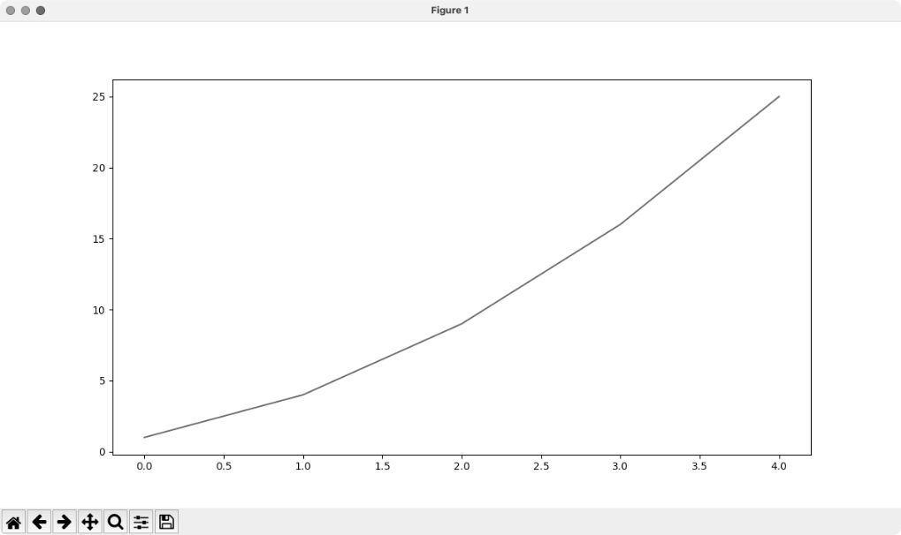

### 修改标签文字和线条粗细

图 15-1 所示的绘图表明数是越来越大的，但是标签文字太小、线条太细，看不清楚。幸运的是，Matplotlib 让你能够调整可视化的各个方面。

下面通过定制来改善这个绘图的可读性：添加图题并给坐标轴加上标签。

```python
  import matplotlib.pyplot as plt

  squares = [1, 4, 9, 16, 25]

  fig, ax = plt.subplots()
❶ ax.plot(squares, linewidth=3)

  # 设置图题并给坐标轴加上标签
❷ ax.set_title("Square Numbers", fontsize=24)
❸ ax.set_xlabel("Value", fontsize=14)
  ax.set_ylabel("Square of Value", fontsize=14)

  # 设置刻度标记的样式
❹ ax.tick_params(labelsize=14)

  plt.show()
```

参数 linewidth 决定了 plot() 绘制的线条的粗细（见❶）。生成绘图后，可在显示前使用很多方法修改它。方法 set_title() 给绘图指定标题（见❷）。在上述代码中，多次出现的参数 fontsize 用于指定图中各种文字的大小。set_xlabel() 方法和 set_ylabel() 方法让你能够为每条轴设置标题（见❸）。方法 tick_params() 设置刻度标记的样式（见❹），它在这里将两条轴上的刻度标记的字号都设置为 14（labelsize=14）。

最终的图阅读起来容易得多，如图 15-2 所示：标签文字更大，线条也更粗了。通常，需要尝试不同的值，才能找到最佳参数生成理想的图。

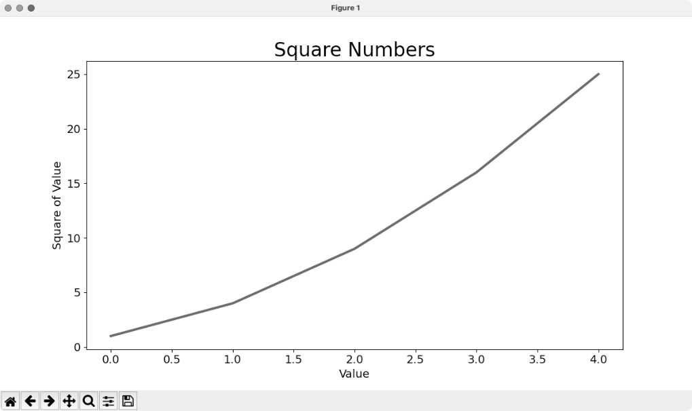

### 校正绘图

图更容易看清后，我们发现数据绘制得并不正确：折线图的终点指出 4.0 的平方为 25。下面来修复这个问题。

在向 plot() 提供一个数值序列时，它假设第一个数据点对应的 x 坐标值为 0，但这里的第一个点对应的 x 坐标值应该为 1。为了改变这种默认行为，可给 plot() 同时提供输入值和输出值：

```python
import matplotlib.pyplot as plt

input_values = [1, 2, 3, 4, 5]
squares = [1, 4, 9, 16, 25]

fig, ax = plt.subplots()
ax.plot(input_values, squares, linewidth=3)

# 设置图题并给坐标轴加上标签
--snip--
```

现在，plot() 无须对输出值的生成方式做出假设，因此生成了正确的绘图，如图 15-3 所示。


不仅可以在使用 plot() 时指定各种实参，还可以在生成绘图后使用众多方法对其进行定制。本章后面在处理更有趣的数据集时，将继续探索这些定制方式。

### 使用内置样式

Matplotlib 提供了很多已定义好的样式，这些样式包含默认的背景色、网格线、线条粗细、字体、字号等设置，让你无须做太多定制就能生成引人瞩目的可视化效果。要看到能在你的系统中使用的所有样式，可在终端会话中执行如下命令：

```
>>> import matplotlib.pyplot as plt
>>> plt.style.available
['Solarize_Light2', '_classic_test_patch', '_mpl-gallery',
--snip--
```

要使用这些样式，可在调用 subplots() 的代码前添加如下代码行：

```python
import matplotlib.pyplot as plt

input_values = [1, 2, 3, 4, 5]
squares = [1, 4, 9, 16, 25]

plt.style.use('seaborn')
fig, ax = plt.subplots()
--snip--
```

这些代码生成的绘图如图 15-4 所示。可用的内置样式有很多，请尝试使用它们，找出你喜欢的。

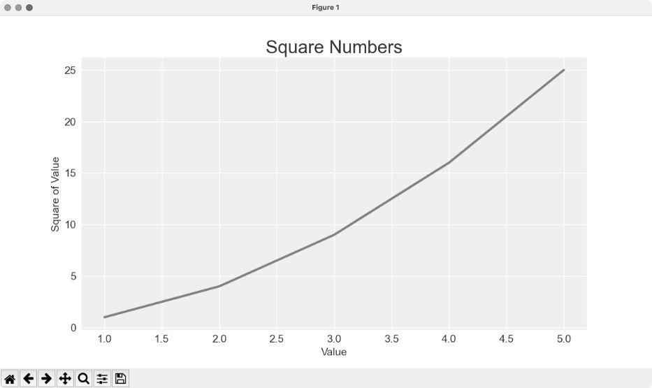

### 使用scatter()绘制散点图并设置样式

有时候，需要绘制散点图并设置各个数据点的样式。例如，你可能想用一种颜色显示较小的值，用另一种颜色显示较大的值。在绘制大型数据集时，还可先对每个点都设置同样的样式，再使用不同的样式重新绘制某些点，以示突出。

要绘制单个点，可使用方法 scatter()，并向它传递该点的 x 坐标值和 y 坐标值：

```python
import matplotlib.pyplot as plt

plt.style.use('seaborn')
fig, ax = plt.subplots()
ax.scatter(2, 4)

plt.show()
```

下面来设置图的样式，使其更有趣。我们将添加标题，给坐标轴加上标签，并确保所有文本都足够大、能看清：

```python
  import matplotlib.pyplot as plt

  plt.style.use('seaborn')
  fig, ax = plt.subplots()
❶ ax.scatter(2, 4, s=200)

  # 设置图题并给坐标轴加上标签
  ax.set_title("Square Numbers", fontsize=24)
  ax.set_xlabel("Value", fontsize=14)
  ax.set_ylabel("Square of Value", fontsize=14)

  # 设置刻度标记的样式
  ax.tick_params(labelsize=14)
```

在❶处，调用 scatter()，并使用参数 s 设置绘图时使用的点的尺寸。如果此时运行 scatter_squares.py，将在图中央看到一个点，如图 15-5 所示。

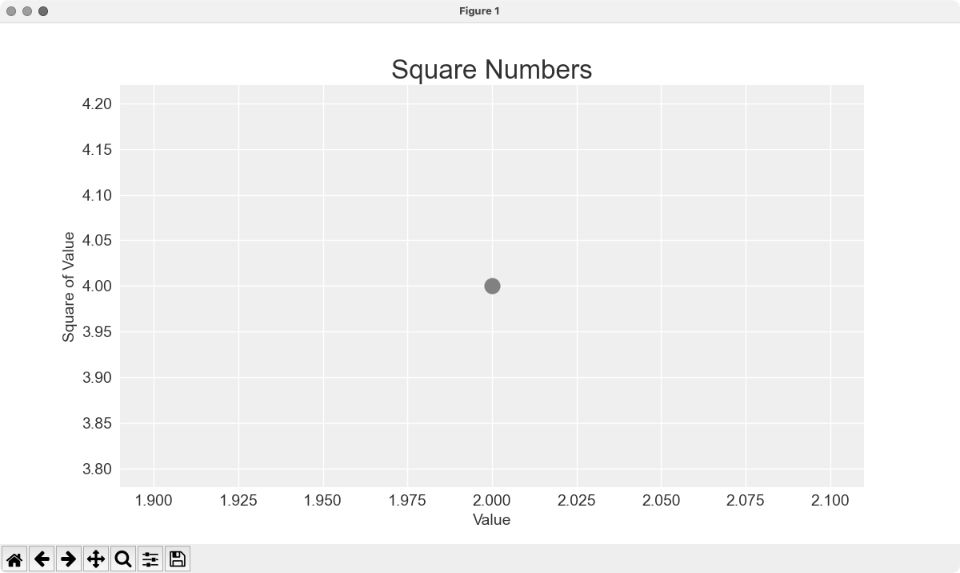

### 使用scatter()绘制一系列点

要绘制一系列点，可向 scatter() 传递两个分别包含 x 坐标值和 y 坐标值的列表，如下所示：

```python
import matplotlib.pyplot as plt

x_values = [1, 2, 3, 4, 5]
y_values = [1, 4, 9, 16, 25]

plt.style.use('seaborn')
fig, ax = plt.subplots()
ax.scatter(x_values, y_values, s=100)

# 设置图题并给坐标轴加上标签
--snip--
```

列表 x_values 包含要计算平方值的数，列表 y_values 包含这些数的平方值。在将这两个列表传递给 scatter() 时，Matplotlib 会依次从每个列表中读取一个值来绘制一个点：要绘制的点的坐标分别为 (1, 1)、(2, 4)、(3, 9)、(4, 16) 和 (5, 25)，最终的结果如图 15-6 所示。

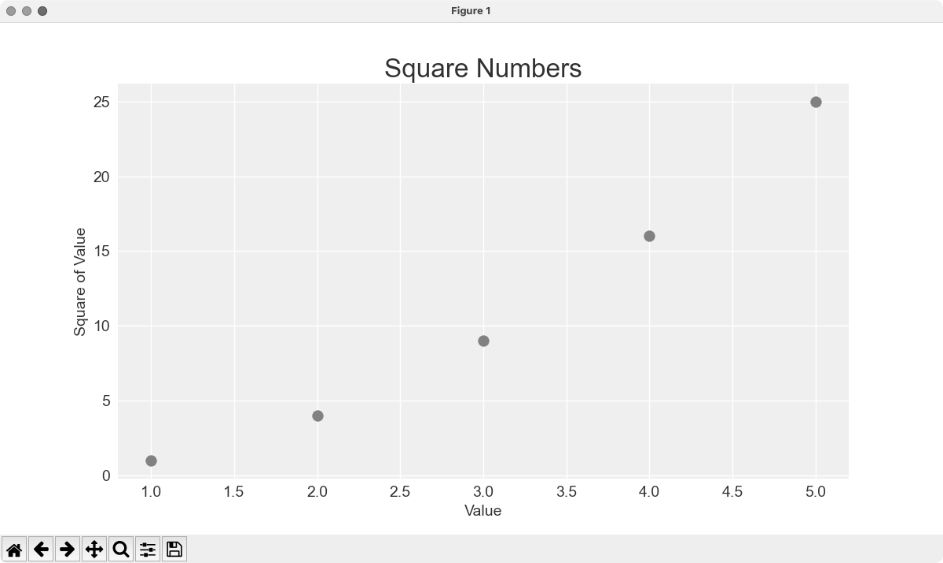

### 自动计算数据

手动指定列表要包含的值效率不高，在需要绘制的点很多时尤其如此。好在可以不指定值，直接使用循环来计算。下面是绘制 1000 个点的代码：

```python
  import matplotlib.pyplot as plt

❶ x_values = range(1, 1001)
  y_values = [x**2 for x in x_values]

  plt.style.use('seaborn')
  fig, ax = plt.subplots()
❷ ax.scatter(x_values, y_values, s=10)

  # 设置图形标题并给坐标轴加上标签
  --snip--

  # 设置每个坐标轴的取值范围
❸ ax.axis([0, 1100, 0, 1_100_000])

  plt.show()
```

首先创建一个包含 x 坐标值的列表，其中有数 1～1000（见❶）。接下来，是一个生成 y 坐标值的列表推导式，它遍历 x 坐标值（for x in x_values），计算其平方值（x\*\*2），并将结果赋给列表 y_values。然后，将输入列表和输出列表传递给 scatter()（见❷）。这个数据集很大，因此将点设置得较小。

显示绘图前，使用方法 axis() 指定每个坐标轴的取值范围（见❸）。方法 axis() 要求提供四个值：x 轴和 y 轴各自的最小值和最大值。这里将 x 轴的取值范围设置为 0～1100，将 y 轴的取值范围设置为 0～1100000。结果如图 15-7 所示。

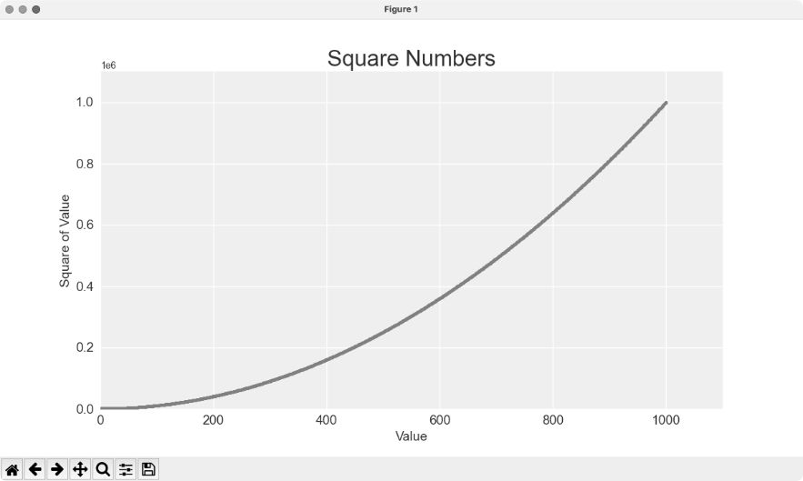

### 定制刻度标记

在刻度标记表示的数足够大时，Matplotlib 将默认使用科学记数法。这通常是好事，因为如果使用常规表示法，很大的数将占据很多内存。几乎每个图形元素都是可定制的，如果你愿意，可让 Matplotlib 始终使用常规表示法：

```python
--snip--
# 设置每个坐标轴的取值范围
ax.axis([0, 1100, 0, 1_100_000])
ax.ticklabel_format(style='plain')

plt.show()
```

ticklabel_format() 方法让你能够覆盖默认的刻度标记样式。

### 定制颜色

要修改数据点的颜色，可向 scatter() 传递参数 color，并将其设置为要使用的颜色的名称（用引号引起来），如下所示：

```python
ax.scatter(x_values, y_values, color='red', s=10)
```

还可以使用 RGB 颜色模式定制颜色。此时传递参数 color，并将其设置为一个元组，其中包含三个 0～1 的浮点数，分别表示红色、绿色和蓝色分量。例如，下面的代码行创建一个由浅绿色的点组成的散点图：

```python
ax.scatter(x_values, y_values, color=(0, 0.8, 0), s=10)
```

值越接近 0，指定的颜色越深；值越接近 1，指定的颜色越浅。

### 使用颜色映射

**颜色映射**（colormap）是一个从起始颜色渐变到结束颜色的颜色序列。在可视化中，颜色映射用于突出数据的规律。例如，你可能用较浅的颜色来显示较小的值，使用较深的颜色来显示较大的值。使用颜色映射，可根据精心设计的色标（color scale）准确地设置所有点的颜色。

pyplot 模块内置了一组颜色映射。要使用这些颜色映射，需要告诉 pyplot 该如何设置数据集中每个点的颜色。下面演示了如何根据每个点的 y 坐标值来设置其颜色：

```python
--snip--
plt.style.use('seaborn')
fig, ax = plt.subplots()
ax.scatter(x_values, y_values, c=y_values, cmap=plt.cm.Blues, s=10)

# 设置图题并给坐标轴加上标签
--snip--
```

参数 c 类似于参数 color，但用于将一系列值关联到颜色映射。这里将参数 c 设置成了一个 y 坐标值列表，并使用参数 cmap 告诉 pyplot 使用哪个颜色映射。这些代码将 y 坐标值较小的点显示为浅蓝色，将 y 坐标值较大的点显示为深蓝色，结果如图 15-8 所示。

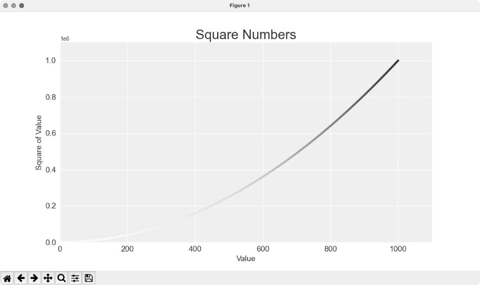

注意：要了解 pyplot 中所有的颜色映射，请访问 Matplotlib 主页并单击 Documentation，在 Learning resources 部分找到 Tutorials 并单击其中的 Introductory tutorials，向下滚动到 Colors，再单击 Choosing Colormaps in Matplotlib。

### 自动保存绘图

如果要将绘图保存到文件中，而不是在 Matplotlib 查看器中显示它，可将 plt.show() 替换为 plt.savefig()：

```python
plt.savefig('squares_plot.png', bbox_inches='tight')
```

第一个实参指定要以什么文件名保存绘图，这个文件将被存储到 scatter_squares.py 所在的目录中。第二个实参指定将绘图多余的空白区域裁剪掉；如果要保留绘图周围多余的空白区域，只需省略这个实参即可。你还可以在调用 savefig() 时使用 Path 对象，将输出文件存储到系统上的任何地方。

## 3. 随机游走

本节将使用 Python 生成随机游走数据，再使用 Matplotlib 以美观的形式将这些数据呈现出来。**随机游走**是由一系列简单的随机决策产生的行走路径。可以将随机游走看作一只晕头转向的蚂蚁每一步都沿随机的方向前行所经过的路径。

在自然界、物理学、生物学、化学和经济学中，随机游走都有实际的用途。例如，漂浮在水滴上的一粒花粉不断受到水分子的挤压而在水滴表面移动，因为水滴中的分子运动是随机的，所以花粉在水面上的运动路径就是随机游走。稍后编写的代码能模拟现实世界中的很多情形。

### 创建类RandomWalk

为了模拟随机游走，我们将创建一个名为 RandomWalk 的类，用来随机地选择前进的方向。这个类需要三个属性：一个是跟踪随机游走次数的变量，另外两个是列表，分别存储随机游走经过的每个点的 x 坐标值和 y 坐标值。RandomWalk 类只包含两个方法：\_\_init\_\_() 和 fill_walk()，后者计算随机游走经过的所有点。先来看看 \_\_init\_\_() 方法：

```python
❶ from random import choice

  class RandomWalk:
      """一个生成随机游走数据的类"""

❷     def __init__(self, num_points=5000):
          """初始化随机游走的属性"""
          self.num_points = num_points

          # 所有随机游走都始于(0, 0)
❸         self.x_values = [0]
          self.y_values = [0]
```

为做出随机决策，将所有可能的选择都存储在一个列表中，并在每次决策时使用模块 random 中的 choice() 来决定做出哪种选择（见❶）。

接下来，将随机游走包含的默认点数设置为 5000（见❷）。这个数既大到足以生成有趣的模式，同时又足够小，可确保能够快速地模拟随机游走。然后，创建两个用于存储 x 坐标值和 y 坐标值的列表，并让每次游走都从点 (0, 0) 出发（见❸）。

### 选择方向

下面使用 fill_walk() 方法来生成游走包含的点。请将这个方法添加到刚才创建的 RandomWalk 类之下（别忘了缩进）：

```python
      def fill_walk(self):
          """计算随机游走包含的所有点"""

          # 不断游走，直到列表达到指定的长度
❶         while len(self.x_values) < self.num_points:

              # 决定前进的方向以及沿这个方向前进的距离
❷             x_direction = choice([1, -1])
              x_distance = choice([0, 1, 2, 3, 4])
❸             x_step = x_direction * x_distance

              y_direction = choice([1, -1])
              y_distance = choice([0, 1, 2, 3, 4])
❹             y_step = y_direction * y_distance

              # 拒绝原地踏步
❺             if x_step == 0 and y_step == 0:
                  continue

              # 计算下一个点的x坐标值和y坐标值
❻             x = self.x_values[-1] + x_step
              y = self.y_values[-1] + y_step

              self.x_values.append(x)
              self.y_values.append(y)
```

首先建立一个循环，它不断运行，直到获得所有的随机游走点（见❶）。fill_walk() 方法的主要部分告诉 Python 如何模拟四种游走决策：向右走还是向左走；沿指定的方向（右或左）走多远；向上走还是向下走；沿选定的方向（上或下）走多远。

使用 choice([1, -1]) 给 x_direction 选择一个值，结果要么是表示向右走的 1，要么是表示向左走的 -1（见❷）。接下来，choice([0, 1, 2, 3, 4]) 随机地选择沿指定的方向走多远（这个距离被赋给变量 x_distance）。列表中的 0 能够模拟只沿一条轴移动的情况。

在❸和❹处，将移动方向乘以移动距离，确定沿 x 轴和 y 轴移动的距离。如果 x_step 为正，将向右移动；为负将向左移动；为 0 将垂直移动。如果 y_step 为正，将向上移动；为负将向下移动；为 0 将水平移动。如果 x_step 和 y_step 都为 0，则意味着原地踏步。我们拒绝二者都为 0 的情况，接着执行下一次循环（见❺）。

为了获取游走中下一个点的 x 坐标值，将 x_step 与 x_values 中的最后一个值相加（见❻），对 y 坐标值也做相同的处理。获得下一个点的 x 坐标值和 y 坐标值后，将它们分别追加到列表 x_values 和 y_values 的末尾。

### 绘制随机游走图

下面的代码将随机游走的所有点都绘制出来：

```python
  import matplotlib.pyplot as plt

  from random_walk import RandomWalk

  # 创建一个RandomWalk实例
❶ rw = RandomWalk()
  rw.fill_walk()

  # 将所有的点都绘制出来
  plt.style.use('classic')
  fig, ax = plt.subplots()
❷ ax.scatter(rw.x_values, rw.y_values, s=15)
❸ ax.set_aspect('equal')
  plt.show()
```

首先导入模块 pyplot 和类 RandomWalk，再创建一个 RandomWalk 实例并将其存储到 rw 中（见❶），然后调用 fill_walk()。在❷处，将随机游走包含的 x 坐标值和 y 坐标值传递给 scatter()，并选择合适的点的尺寸。默认情况下，Matplotlib 独立地缩放每个轴，而这将水平或垂直拉伸绘图。为避免这种问题，这里使用 set_aspect() 指定两条轴上刻度的间距必须相等（见❸）。

图 15-9 显示了包含 5000 个点的随机游走图。

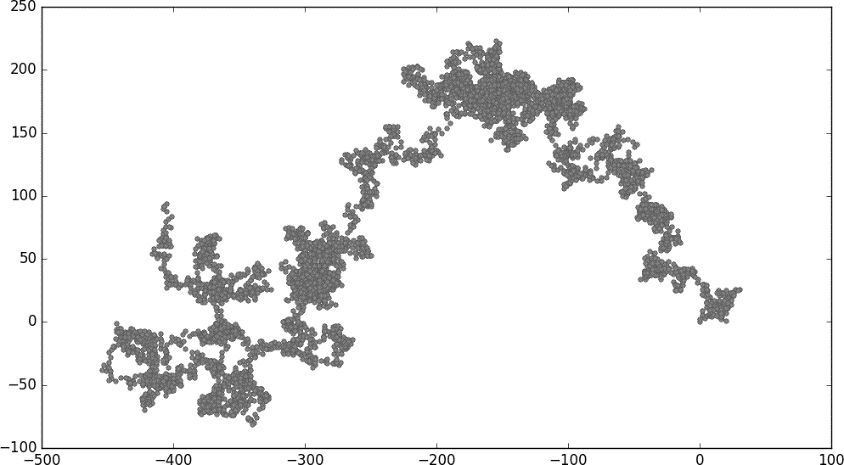

### 模拟多次随机游走

每次随机游走都不同，探索可能生成的各种模式很有趣。要在不运行程序多次的情况下使用前面的代码模拟多次随机游走，一种办法是将这些代码放在一个 while 循环中，如下所示：

```python
import matplotlib.pyplot as plt

from random_walk import RandomWalk

# 只要程序处于活动状态，就不断地模拟随机游走
while True:
    # 创建一个RandomWalk实例
    --snip--
    plt.show()

    keep_running = input("Make another walk? (y/n): ")
    if keep_running == 'n':
        break
```

这些代码每模拟完一次随机游走，都会在 Matplotlib 查看器中显示结果，并在不关闭查看器的情况下暂停。如果关闭查看器，程序将询问是否要再模拟一次随机游走。如果模拟多次，你将发现会生成各种各样的随机游走：集中在起点附近的、沿特定方向远远偏离起点的、点的分布非常不均匀的，等等。要结束程序，请按 N 键。

### 设置随机游走图的样式

本节将定制绘图，以突出每次游走的重要特征，并让分散注意力的元素不那么显眼。为此，先确定要突出的元素，如游走的起点、终点和经过的路径，再确定不需要那么显眼的元素，如刻度标记和标签。最终的结果是简单的可视化表示，能清楚地指出每次游走经过的路径。

#### 给点着色

我们将使用颜色映射来指出游走中各个点的先后顺序，并删除每个点的黑色轮廓，让其颜色更加明显。为了根据游走中各个点的先后顺序进行着色，传递参数 c，并将其设置为一个列表，其中包含各点的先后顺序。由于这些点是按顺序绘制的，因此给参数 c 指定的列表只需包含数 0～4999，如下所示：

```python
--snip--
  while True:
      # 创建一个RandomWalk实例
      rw = RandomWalk()
      rw.fill_walk()

      # 将所有的点都绘制出来
      plt.style.use('classic')
      fig, ax = plt.subplots()
❶     point_numbers = range(rw.num_points)
      ax.scatter(rw.x_values, rw.y_values, c=point_numbers, cmap=plt.cm.Blues,
          edgecolors='none', s=15)
      ax.set_aspect('equal')
      plt.show()
--snip--
```

使用 range() 生成一个数值列表，列表长度值等于游走包含的点的个数（见❶）。接下来，将这个列表赋给变量 point_numbers，以便后面使用它来设置每个游走点的颜色。将参数 c 设置为 point_numbers，指定使用颜色映射 Blues，并传递实参 edgecolors='none' 以删除每个点的轮廓。最终的随机游走图从浅蓝色渐变为深蓝色，准确地指出从起点游走到终点的路径，如图 15-10 所示。

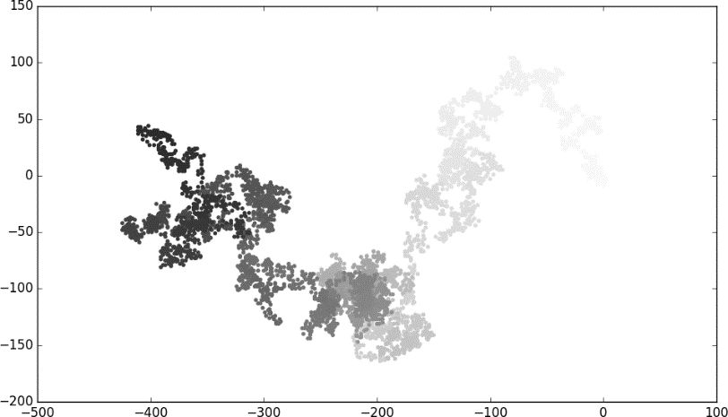

#### 重新绘制起点和终点

除了给随机游走的各个点着色，以指出它们的先后顺序以外，如果还能呈现随机游走的起点和终点就好了。为此，可在绘制随机游走图后重新绘制第一个点和最后一个点。这里让起点和终点比其他点更大并显示为不同的颜色，以示突出：

```python
--snip--
while True:
--snip--
    ax.scatter(rw.x_values, rw.y_values, c=point_numbers, cmap=plt.cm.Blues,
        edgecolors='none', s=15)
    ax.set_aspect('equal')

    # 突出起点和终点
    ax.scatter(0, 0, c='green', edgecolors='none', s=100)
    ax.scatter(rw.x_values[-1], rw.y_values[-1], c='red', edgecolors='none',
        s=100)

    plt.show()
--snip--
```

为了突出起点，使用绿色绘制点 (0, 0)，并使其比其他点更大（s=100）。为了突出终点，在游走包含的最后一个 x 坐标值和 y 坐标值处绘制一个点，将其颜色设置为红色，并将尺寸设置为 100。务必将这些代码放在调用 plt.show() 的代码前面，确保在其他点的上面绘制起点和终点。

现在运行这些代码，就能准确地知道每次随机游走的起点和终点了。如果起点和终点不明显，请调整颜色和大小，直到明显为止。

#### 隐藏坐标轴

下面来隐藏绘图的坐标轴，以免分散观看者的注意力。要隐藏坐标轴，可使用如下代码：

```python
--snip--
while True:
--snip--
    ax.scatter(rw.x_values[-1], rw.y_values[-1], c='red', edgecolors='none',
        s=100)

    # 隐藏坐标轴
    ax.get_xaxis().set_visible(False)
    ax.get_yaxis().set_visible(False)

    plt.show()
--snip--
```

先使用 ax.get_xaxis() 方法和 ax.get_yaxis() 方法获取每条坐标轴，再通过链式调用方法 set_visible() 让每条坐标轴都不可见。现在运行 rw_visual.py，可以看到一系列绘图，但看不到坐标轴。随着对数据可视化的不断学习和实践，你会经常看到通过方法链式调用来定制不同的可视化效果。

#### 增加点的个数

下面来增加随机游走中的点，以提供更多的数据。为此，在创建 RandomWalk 实例时增大 num_points 的值，并在绘图时调整每个点的大小：

```python
--snip--
while True:
    # 创建一个RandomWalk实例
    rw = RandomWalk(50_000)
    rw.fill_walk()

    # 将所有的点都绘制出来
    plt.style.use('classic')
    fig, ax = plt.subplots()
    point_numbers = range(rw.num_points)
    ax.scatter(rw.x_values, rw.y_values, c=point_numbers, cmap=plt.cm.Blues,
        edgecolors='none', s=1)
--snip--
```

这个示例模拟了一次包含 50000 个点的随机游走，并将每个点的大小都设置为 1。最终的随机游走图像云雾一般，如图 15-11 所示。我们使用简单的散点图制作出了一件艺术品！请尝试修改上述代码，看看将游走包含的点增加到多少个以后，程序的运行速度将变得极其缓慢或绘图将变得很难看。

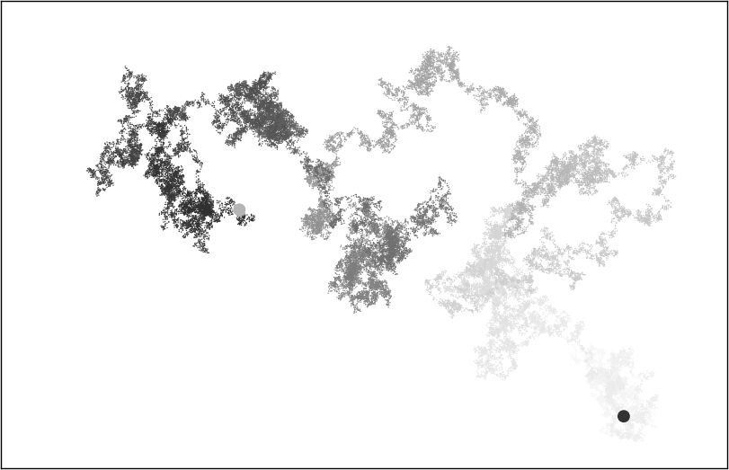

#### 调整尺寸以适应屏幕

当图形适应屏幕的大小时，能更有效地将数据的规律呈现出来。为了让绘图窗口更适应屏幕的大小，可在调用 subplots() 中调整 Matplotlib 输出的尺寸：

```python
fig, ax = plt.subplots(figsize=(15, 9))
```

在创建绘图时，可向 subplots() 传递参数 figsize，以指定生成的图形尺寸。参数 figsize 是一个元组，向 Matplotlib 指出绘图窗口的尺寸，单位为英寸。

Matplotlib 假定屏幕的分辨率为每英寸 100 像素。如果上述代码指定的绘图尺寸不合适，可根据需要调整数值。如果知道当前系统的分辨率，可通过参数 dpi 向 plt.subplots() 传递该分辨率：

```python
fig, ax = plt.subplots(figsize=(10, 6), dpi=128)
```

这有助于高效地利用屏幕空间。

## 4. 使用 Plotly 模拟掷骰子

本节将使用 Plotly 来生成交互式图形。当需要创建要在浏览器中显示的图形时，Plotly 很有用，因为它生成的图形将自动缩放，以适应观看者的屏幕。Plotly 生成的图形还是交互式的：当用户将鼠标指向特定的元素时，将显示有关该元素的信息。本节将使用 Plotly Express 来创建初始图形。Plotly Express 是 Plotly 的一个子集，致力于让用户使用尽可能少的代码来生成绘图。我们将先使用几行代码生成初始绘图，在确定输出正确后再像使用 Matplotlib 那样对绘图进行定制。

在这个项目中，我们将对掷骰子的结果进行分析。在掷一个 6 面的常规骰子时，可能出现的结果为 1～6 点，且出现每种结果的可能性相同。然而，如果同时掷两个骰子，某些点数出现的可能性将比其他点数大。为了确定哪些点数出现的可能性最大，要生成一个表示掷骰子结果的数据集，并根据结果绘图。这项工作有助于模拟涉及掷骰子的游戏，其中的核心理念也适用于所有涉及概率的游戏（如扑克牌）；此外，在随机性扮演着重要角色的众多现实场景中，它也能发挥作用。

### 安装Plotly

要安装 Plotly，可像本章前面安装 Matplotlib 那样使用 pip：

```
$ python -m pip install --user plotly
$ python -m pip install --user pandas
```

Plotly Express 依赖于 pandas（一个用于高效地处理数据的库），因此需要同时安装 pandas。如果前面在安装 Matplotlib 时，使用的是 python3 之类的命令，这里也要使用同样的命令。

要了解使用 Plotly 可创建什么样的图形，请访问 Plotly 主页并单击 DOCS 下拉菜单中的 GRAPHING LIBRARIES，然后单击 Python 图标或在 Languages 下拉菜单中选择 Python，打开 Plotly Open Source Graphing Library for Python。每个示例都包含源代码，让你知道这些图形是如何生成的。

### 创建类Die

为了模拟掷一个骰子的情况，创建下面的类：

```python
  from random import randint

  class Die:
      """表示一个骰子的类"""

❶     def __init__(self, num_sides=6):
          """骰子默认为6面的"""
          self.num_sides = num_sides

      def roll(self):
          """返回一个介于1和骰子面数之间的随机值"""
❷         return randint(1, self.num_sides)
```

\_\_init\_\_() 方法接受一个可选参数。创建这个类的实例时，如果没有指定任何实参，面数默认为 6；如果指定了实参，则这个值将用于设置骰子的面数（见❶）。骰子是根据面数命名的：6 面的骰子名为 D6，8 面的骰子名为 D8，依此类推。

roll() 方法使用 randint() 函数来返回一个介于 1 和面数之间的随机数（见❷）。这个函数可能返回起始值（1）、终止值（num_sides）或这两个值之间的任意整数。

### 掷骰子

使用这个类来创建图形前，先来掷一个 D6，将结果打印出来，并确认结果是合理的：

```python
  from die import Die

  # 创建一个D6
❶ die = Die()

  # 掷几次骰子并将结果存储在一个列表中
  results = []
❷ for roll_num in range(100):
      result = die.roll()
      results.append(result)

  print(results)
```

首先创建一个 Die 实例，其面数为默认值 6（见❶）。然后掷骰子 100 次，并将每次的结果都存储在列表 results 中（见❷）。下面是一个示例结果集：

```
[4, 6, 5, 6, 1, 5, 6, 3, 5, 3, 5, 3, 2, 2, 1, 3, 1, 5, 3, 6, 3, 6, 5, 4,
 1, 1, 4, 2, 3, 6, 4, 2, 6, 4, 1, 3, 2, 5, 6, 3, 6, 2, 1, 1, 3, 4, 1, 4,
 3, 5, 1, 4, 5, 5, 2, 3, 3, 1, 2, 3, 5, 6, 2, 5, 6, 1, 3, 2, 1, 1, 1, 6,
 5, 5, 2, 2, 6, 4, 1, 4, 5, 1, 1, 1, 4, 5, 3, 3, 1, 3, 5, 4, 5, 6, 5, 4,
 1, 5, 1, 2]
```

通过快速浏览这些结果可知，Die 类看起来没有问题：我们看到了 1 和 6，这表明返回了最大和最小的可能值；没有看到 0 或 7，这表明结果都在正确的范围内；还看到了 1～6 的所有数字，这表明所有可能的结果都出现了。下面来确定各个点数都出现了多少次。

### 分析结果

为了分析掷一个 D6 的结果，计算每个点数出现的次数：

```python
--snip--
  # 掷几次骰子并将结果存储在一个列表中
  results = []
❶ for roll_num in range(1000):
      result = die.roll()
      results.append(result)

  # 分析结果
  frequencies = []
❷ poss_results = range(1, die.num_sides+1)
  for value in poss_results:
❸     frequency = results.count(value)
❹     frequencies.append(frequency)
  print(frequencies)
```

由于不再将结果打印出来，因此可将模拟掷骰子的次数增加到 1000（见❶）。为了分析结果，创建空列表 frequencies，用于存储每个点数出现的次数。然后，生成所有可能的点数（这里为 1 到骰子的面数）（见❷），遍历这些点数并计算每个点数在 results 中出现了多少次（见❸），再将这个值追加到列表 frequencies 的末尾（见❹）。接下来，在可视化之前将这个列表打印出来：

```
[155, 167, 168, 170, 159, 181]
```

结果看起来是合理的：有 6 个值，分别对应掷 D6 时可能出现的每个点数；没有任何点数出现的频率比其他点数高很多。下面来可视化这些结果。

### 绘制直方图

有了所需的数据，就可以使用 Plotly Express 来创建图形了，只需要几行代码：

```python
import plotly.express as px

from die import Die
--snip--

for value in poss_results:
    frequency = results.count(value)
    frequencies.append(frequency)

# 对结果进行可视化
fig = px.bar(x=poss_results, y=frequencies)
fig.show()
```

首先导入模块 plotly.express，并按照惯例给它指定别名 px。然后，使用函数 px.bar() 创建一个直方图。对于这个函数，最简单的用法是只向它传递一组 x 坐标值和一组 y 坐标值：这里传递的 x 坐标值为掷一个骰子可能得到的结果，而 y 坐标值为每种结果出现的次数。最后一行调用 fig.show()，让 Plotly 将生成的直方图渲染为 HTML 文件，并在一个新的浏览器选项卡中打开这个文件。结果如图 15-12 所示。

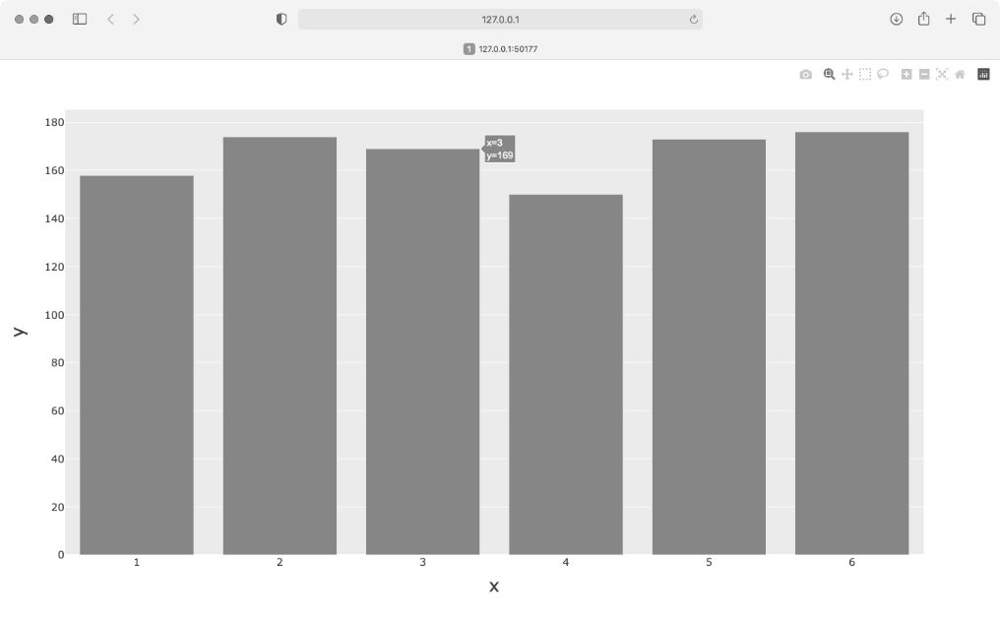

这个直方图非常简单，但并不完整。然而，这正是 Plotly Express 的用途所在：让你编写几行代码就能查看生成的图，确定它以你希望的方式呈现了数据。如果你对结果大致满意，可进一步定制图形元素，如标签和样式；然而，如果你想使用其他的图表类型，也可马上做出改变，而不用花额外的时间来定制当前的图形。请现在就尝试这样做，比如将 px.bar() 替换为 px.scatter() 或 px.line()。

这个直方图是动态、可交互的：如果你调整浏览器窗口的尺寸，该图将自动调整大小，以适应可用空间；如果你将鼠标指向条形，将显示与该条形相关的数据。

### 定制绘图

确定选择的绘图是你想要的类型且数据得到准确的呈现后，便可专注于添加合适的标签和样式了。

要使用 Plotly 定制绘图，一种方式是在调用生成绘图的函数（这里是 px.bar()）时传递一些可选参数。下面演示了如何指定图题并给每条坐标轴添加标签：

```python
--snip--
  # 对结果进行可视化
❶ title = "Results of Rolling One D6 1,000 Times"
❷ labels = {'x': 'Result', 'y': 'Frequency of Result'}
  fig = px.bar(x=poss_results, y=frequencies, title=title, labels=labels)
  fig.show()
```

首先定义图题，并将其赋给变量 title（见❶）。为了定义坐标轴标签，创建一个字典（见❷），其中的键是要添加标签的坐标轴，而值是要添加的标签：这里给 x 轴指定标签 Result，给 y 轴指定标签 Frequency of Result。现在调用 px.bar() 时，会向它传递可选参数 title 和 labels。

现在，生成的直方图将包含标题和坐标轴标签，如图 15-13 所示。

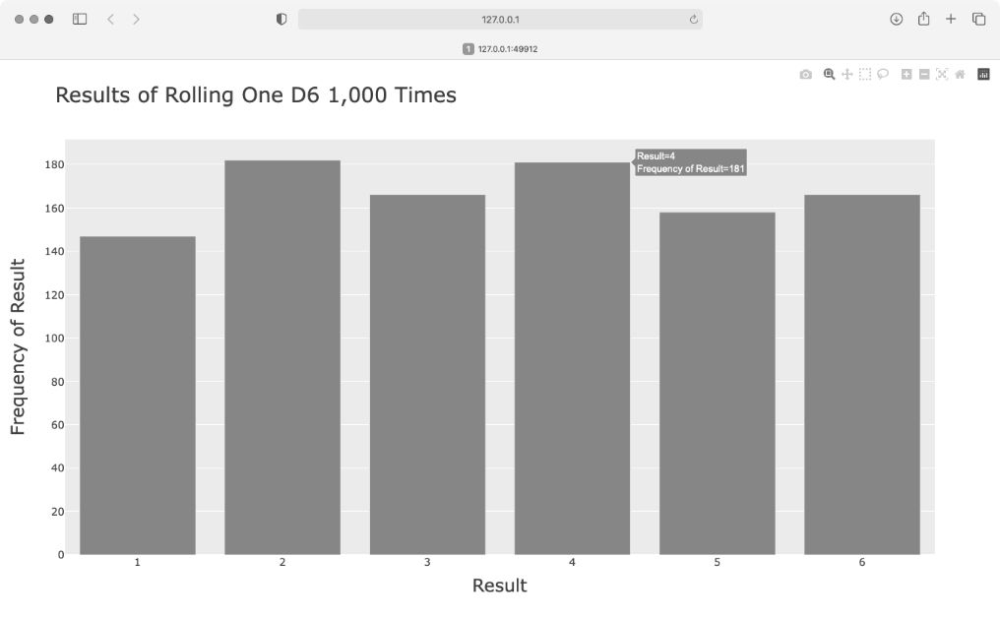

### 同时掷两个骰子

同时掷两个骰子时，得到的点数往往更多，结果分布情况也有所不同。下面来修改前面的代码，创建两个 D6 以模拟同时掷两个骰子的情况。每次掷两个骰子时，都将两个骰子的点数相加，并将结果存储在 results 中。请复制 die_visual.py 并将其保存为 dice_visual.py，再做如下修改：

```python
  import plotly.express as px

  from die import Die

  # 创建两个D6
  die_1 = Die()
  die_2 = Die()

  # 掷骰子多次，并将结果存储到一个列表中
  results = []
  for roll_num in range(1000):
❶     result = die_1.roll() + die_2.roll()
      results.append(result)

  # 分析结果
  frequencies = []
❷ max_result = die_1.num_sides + die_2.num_sides
❸ poss_results = range(2, max_result+1)
  for value in poss_results:
      frequency = results.count(value)
      frequencies.append(frequency)

  # 可视化结果
  title = "Results of Rolling Two D6 Dice 1,000 Times"
  labels = {'x': 'Result', 'y': 'Frequency of Result'}
  fig = px.bar(x=poss_results, y=frequencies, title=title, labels=labels)
  fig.show()
```

创建两个 Die 实例后，多次投掷，并计算每次的总点数（见❶）。可能出现的最小总点数为两个骰子的最小可能点数之和（2），可能出现的最大总点数为两个骰子的最大可能点数之和（12），这个值被赋给 max_result（见❷）。使用变量 max_result 让生成的代码容易理解得多（见❸）。我们原本可以使用 range(2, 13)，但这只适用于两个 D6。在模拟现实世界的情形时，最好编写可轻松地模拟各种情形的代码。前面的代码让我们能够模拟掷任意两个骰子的情形，不管这些骰子有多少面。

运行这些代码后，将看到如图 15-14 所示的图形。该图显示了掷两个 D6 得到的大致结果分布情况。如你所见，总点数为 2 或 12 的可能性最小，而总点数为 7 的可能性最大。这是因为在下面 6 种情况下得到的总点数都为 7：1 和 6、2 和 5、3 和 4、4 和 3、5 和 2、6 和 1。

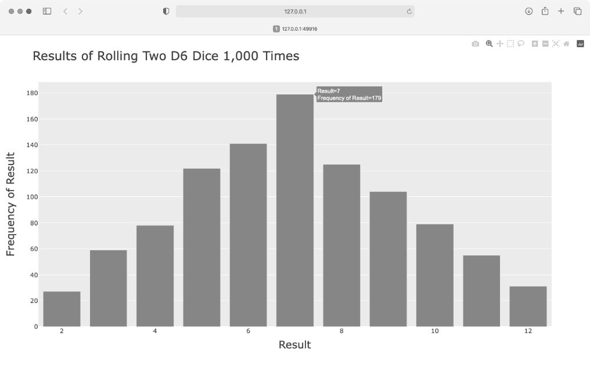

### 进一步定制

刚才生成的绘图存在一个问题，应予以解决：尽管有 11 个条形，但 x 轴的默认布局设置未给所有条形加上标签。虽然对大多数可视化图形来说，这种默认设置的效果很好，但就这里而言，给所有的条形都加上标签效果更佳。

Plotly 提供了方法 update_layout()，可用来对创建的图形做各种修改。下面演示了如何让 Plotly 给每个条形都加上标签：

```python
--snip--
fig = px.bar(x=poss_results, y=frequencies, title=title, labels=labels)

# 进一步定制图形
fig.update_layout(xaxis_dtick=1)

fig.show()
```

对表示整张图的 fig 对象调用 update_layout() 方法。这里传递了参数 xaxis_dtick，它指定 x 轴上刻度标记的间距。我们将这个间距设置为 1，给每个条形都加上标签。如果你再次运行 dice_visual.py，将发现每个条形都有标签了。

### 同时掷两个面数不同的骰子

下面来创建一个 6 面骰子和一个 10 面骰子，看看同时掷这两个骰子 50000 次的结果如何：

```python
  import plotly.express as px

  from die import Die

  # 创建一个D6和一个D10
  die_1 = Die()
❶ die_2 = Die(10)

  # 掷骰子多次，并将结果存储在一个列表中
  results = []
  for roll_num in range(50_000):
      result = die_1.roll() + die_2.roll()
      results.append(result)

  # 分析结果
  --snip--

  # 可视化结果
❷ title = "Results of Rolling a D6 and a D10 50,000 Times"
  labels = {'x': 'Result', 'y': 'Frequency of Result'}
  --snip--
```

为了创建 D10，我们在创建第二个 Die 实例时传递了实参 10（见❶）。我们还修改了第一个循环，模拟掷骰子 50000 次而不是 1000 次；此外，还修改了图题（见❷）。

图 15-15 显示了最终的结果。可能性最大的点数不是一个，而是 5 个。这是因为最小点数和最大点数的组合都只有一种（1 和 1 以及 6 和 10），但面数较少的骰子限制了得到中间点数的组合数：得到总点数 7、8、9、10 和 11 的组合数都是 6 种。因此，这些总点数是最常见的结果，它们出现的可能性相同。

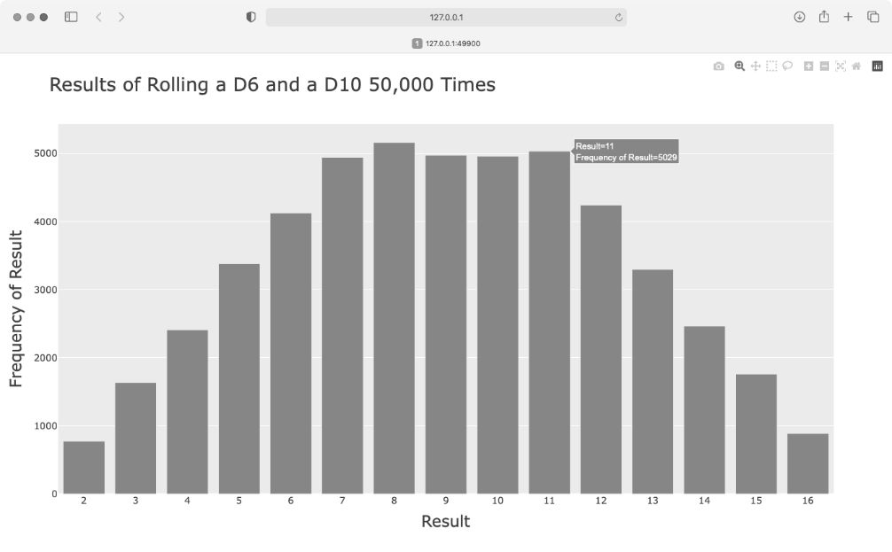

使用 Plotly 来模拟掷骰子的结果，能够非常自由地探索其分布情况。只需几分钟，就可以模拟掷各种骰子很多次。

### 保存图形

生成你喜欢的图形后，就可以通过浏览器将其保存为 HTML 文件了，不过你也可以用代码完成这项任务。要将图形保存为 HTML 文件，可将 fig.show() 替换为 fig.write_html()：

```python
fig.write_html('dice_visual_d6d10.html')
```

write_html() 方法接受一个参数：要写入的文件的名称。如果你只提供了文件名，这个文件将被保存到 .py 文件所在的目录中。在调用 write_html() 方法时，还可以向它传递一个 Path 对象，让你能够将输出文件保存到系统中的任何地方。

## 5. 小结

在本章中，你学习了如何生成数据集以及如何进行数据可视化，包括如何使用 Matplotlib 创建简单的绘图，以及如何使用散点图来探索随机游走过程；你还学习了如何使用 Plotly 来创建直方图，以及如何使用直方图来探索同时掷两个面数不同的骰子的结果。使用代码生成数据集是一种有趣而强大的方式，可用于模拟和探索现实世界的各种情形。在完成后面的数据可视化项目时，请注意可使用代码模拟哪些情形，请研究新闻媒体中的可视化案例，看看其中图表的生成方式是否与本章中的项目类似。
