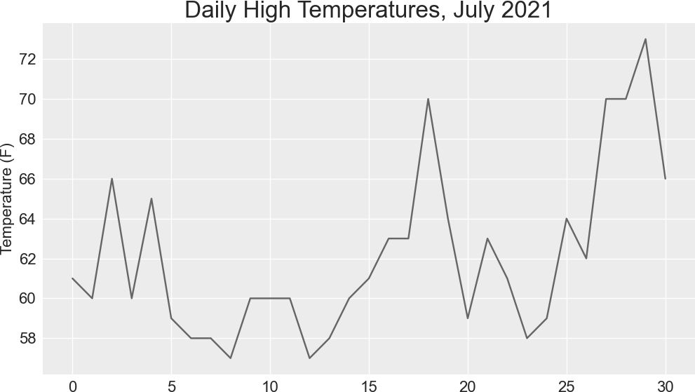
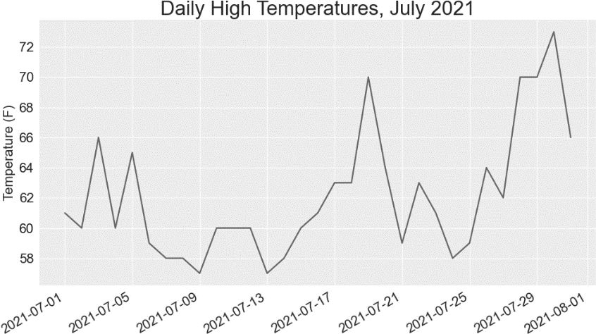
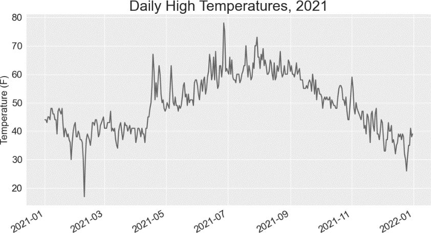
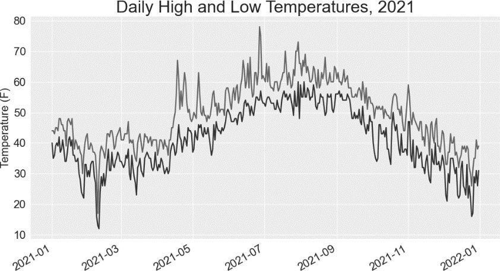
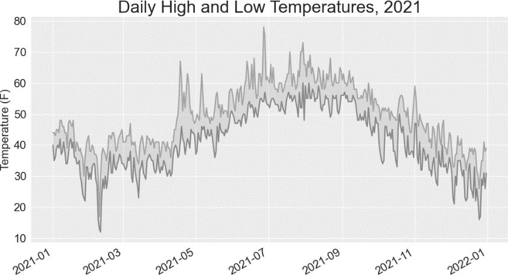
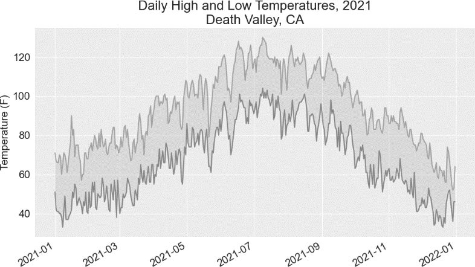
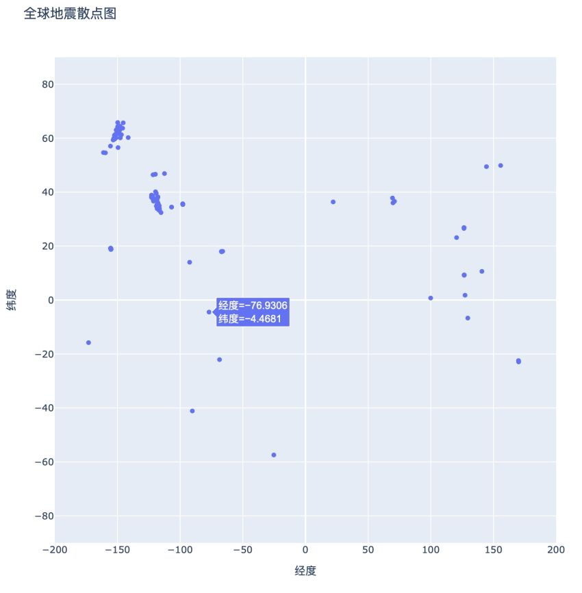
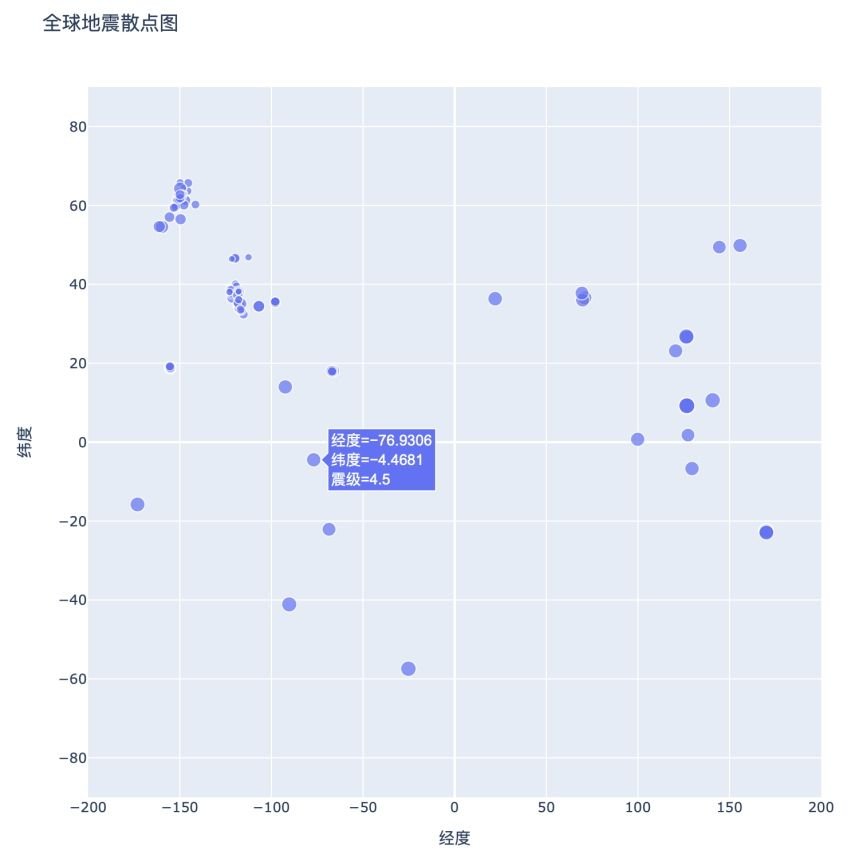
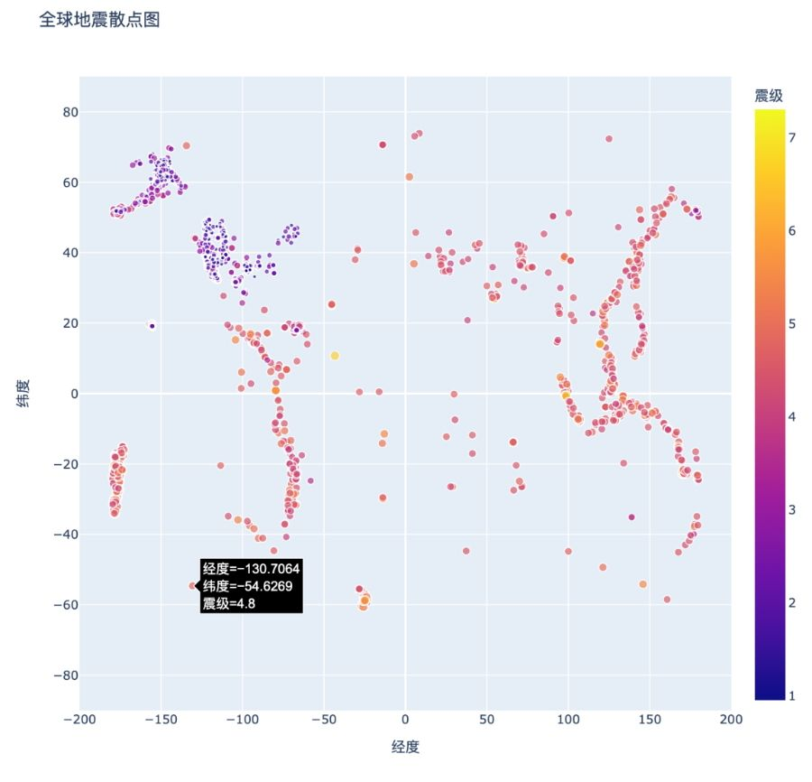
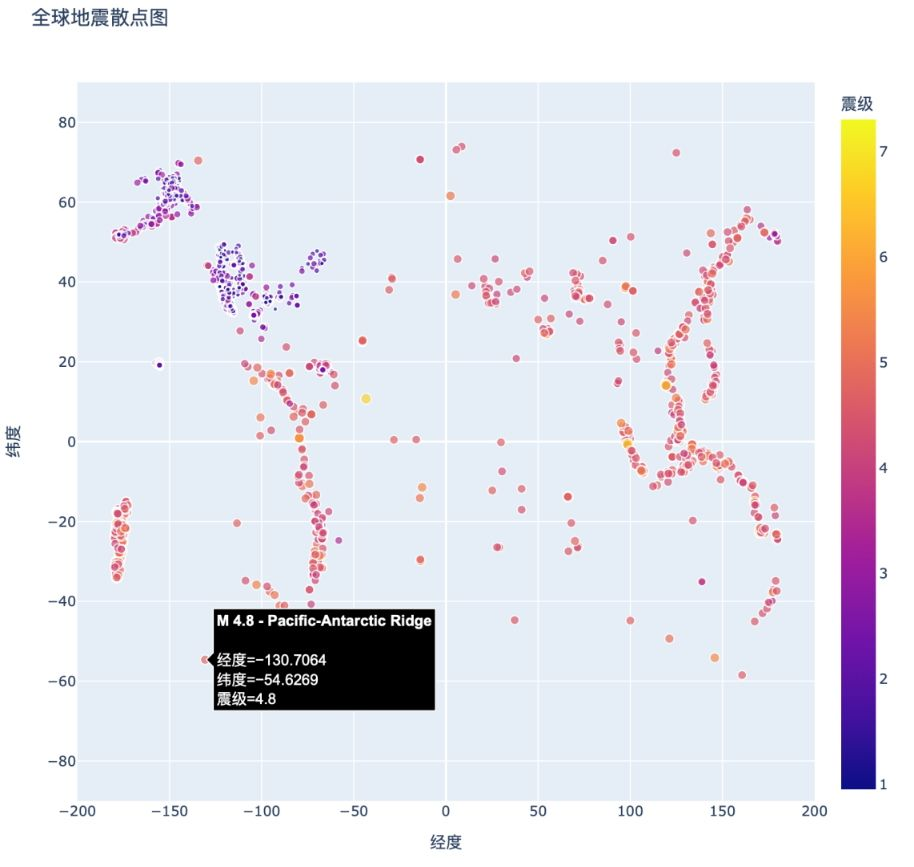

本章将从网上下载数据，并对其进行可视化。

网上的数据多得令人难以置信，其中大多未被仔细研究过。如果能够对这些数据进行分析，就能发现别人没有发现的规律和关联。

我们将接触以两种常见格式（CSV 和 JSON）存储的数据并将其可视化。首先使用 Python 模块 csv 来处理以 CSV 格式存储的天气数据，找出两个截然不同的地区在一段时间内的最高温度和最低温度；然后使用 Matplotlib 根据下载的数据创建图形，展示这两个地区的温度变化；最后使用 json 模块访问以 GeoJSON 格式存储的地震数据，并使用 Plotly 绘制一幅散点图，展示这些地震的位置和强度。

阅读本章后，你将能够处理各种类型和格式的数据集，并对如何创建复杂的图形有更深入的认识。要处理各种真实的数据集，必须能够访问并可视化网络数据。

## 1. CSV 文件格式

要在文本文件中存储数据，最简单的方式是将数据组织为一系列**以逗号分隔的值**（comma-separated values，CSV）并写入文件，这样的文件称为 CSV 文件。例如，下面是一行 CSV 格式的天气数据：

```
"USW00025333","SITKA AIRPORT, AK US","2021-01-01",,"44","40"
```

这是美国阿拉斯加州锡特卡 2021 年 1 月 1 日的天气数据，其中包含当天的最高温度和最低温度等。CSV 文件阅读起来比较麻烦，但程序能够快速而准确地提取并处理其中的信息。

我们将首先处理少量 CSV 格式的锡特卡天气数据，这些数据可在本书的源代码文件中找到。请在存储本章程序的文件夹中新建一个名为 weather_data 的文件夹，再将文件 sitka_weather_07-2021_simple.csv 复制到这个文件夹中。

注意：这个项目使用的天气数据下载自 NOAA Climate Data Online。

### 解析CSV文件头

csv 模块包含在 Python 标准库中，可用于解析 CSV 文件中的数据行，让我们能够快速提取感兴趣的值。先来查看这个文件的第一行，其中的一系列**文件头**（file header，CSV 文件的列标题行）指出了后续各行包含的是什么样的信息：

```python
  from pathlib import Path
  import csv

❶ path = Path('weather_data/sitka_weather_07-2021_simple.csv')
  lines = path.read_text().splitlines()

❷ reader = csv.reader(lines)
❸ header_row = next(reader)
  print(header_row)
```

首先，导入 Path 类和 csv 模块。然后，创建一个 Path 对象，它指向文件夹 weather_data 中我们要使用的天气数据文件（见❶）。我们读取这个文件，并通过把 splitlines() 纳入方法链式调用来获取一个包含文件中各行的列表，再将这个列表赋给变量 lines。

接下来，创建一个 reader 对象（见❷），用于解析文件的各行。为了创建 reader 对象，调用函数 csv.reader() 并将包含 CSV 文件中各行的列表传递给它。

当以 reader 对象为参数时，函数 next() 返回文件中的下一行（从文件开头开始）。在上述代码中，只调用了 next() 一次，且是首次调用，因此得到的是文件的第一行，其中包含文件头（见❸）。接着将返回的数据赋给 header_row。如你所见，header_row 包含与天气相关的文件头，指出了每行都包含哪些数据：

```
['STATION', 'NAME', 'DATE', 'TAVG', 'TMAX', 'TMIN']
```

reader 对象处理文件中以逗号分隔的第一行数据，并将每项数据都作为一个元素存储在列表中。文件头 STATION 表示该列中的数据是记录数据的气象站的编码，这个文件头的位置表明，每行的第一个值都是气象站编码；文件头 NAME 指出每行的第二个值都是记录数据的气象站的名称；其他文件头则指出记录了哪些信息。当前，我们最关心的是日期（DATE）、最高温度（TMAX）和最低温度（TMIN）。这是一个简单的数据集，只包含与温度相关的数据。你自己下载天气数据时，可选择包含其他的值，如风速、风向和降水量数据。

### 打印文件头及其位置

为了让文件头数据更容易理解，我们将列表中的每个文件头及其位置打印出来：

```python
--snip--
reader = csv.reader(lines)
header_row = next(reader)

for index, column_header in enumerate(header_row):
    print(index, column_header)
```

在循环中，对列表调用 enumerate() 来获取每个元素的索引及其值（这里删除了代码行 print(header_row)，以显示更详细的版本）。输出如下，指出了每个文件头的索引：

```
0 STATION
1 NAME
2 DATE
3 TAVG
4 TMAX
5 TMIN
```

从中可知，日期和最高温度分别存储在第 3 列（索引为 2）和第 5 列（索引为 4）中。为了研究这些数据，我们将处理 sitka_weather_07-2021_simple.csv 中的每行数据，并提取索引为 2 和 4 的值。

### 提取并读取数据

知道需要哪些列中的数据后，我们来读取一些数据。首先，读取每日最高温度：

```python
--snip--
  reader = csv.reader(lines)
  header_row = next(reader)

  # 提取最高温度
❶ highs = []
❷ for row in reader:
❸     high = int(row[4])
      highs.append(high)
  print(highs)
```

先创建一个名为 highs 的空列表（见❶），再遍历文件中余下的各行（见❷）。reader 对象从刚才中断的地方继续往下读取 CSV 文件，每次都自动返回当前所处位置的下一行。由于已经读取了文件头行，这个循环将从第二行开始——从这行开始才是实际数据。每次执行循环时，都将索引为 4（TMAX 列）的数据追加到 highs 的末尾（见❸）。在文件中，这项数据是以字符串的格式存储的，因此在追加到 highs 的末尾前，要使用函数 int() 将其转换为数值格式，以便使用。现在存储在 highs 中的数据如下：

```
[61, 60, 66, 60, 65, 59, 58, 58, 57, 60, 60, 60, 57, 58, 60, 61, 63, 63, 70,
 64, 59, 63, 61, 58, 59, 64, 62, 70, 70, 73, 66]
```

提取每日最高温度并将其存储到列表中之后，就可以可视化这些数据了。

### 绘制温度图

为了可视化这些温度数据，首先使用 Matplotlib 创建一个显示每日最高温度的简单绘图，如下所示：

```python
  from pathlib import Path
  import csv

  import matplotlib.pyplot as plt

  path = Path('weather_data/sitka_weather_07-2021_simple.csv')
  lines = path.read_text().splitlines()
--snip--
  # 根据最高温度绘图
  plt.style.use('seaborn')
  fig, ax = plt.subplots()
❶ ax.plot(highs, color='red')

  # 设置绘图的格式
❷ ax.set_title("Daily High Temperatures, July 2021", fontsize=24)
❸ ax.set_xlabel('', fontsize=16)
  ax.set_ylabel("Temperature (F)", fontsize=16)
  ax.tick_params(labelsize=16)
  plt.show()
```

将最高温度列表传给 plot()（见❶），并传递 color='red' 以便将数据点绘制为红色（这里用红色显示最高温度，用蓝色显示最低温度）。接下来，像前面绘制平方数图时那样设置一些其他的格式，如标题、字号和标签（见❷）。鉴于还没有添加日期，因此这里没有给 x 轴添加标签，但 ax.set_xlabel() 确实修改了字号，让默认标签更容易看清（见❸）。图 16-1 显示了生成的绘图：一个简单的折线图，显示了阿拉斯加州锡特卡 2021 年 7 月的每日最高温度。



### datetime模块

下面学习在图中添加日期，使其更为有用。在天气数据文件中，第一个日期在第二行：

```
"USW00025333","SITKA AIRPORT, AK US","2021-07-01",,"61","53"
```

在读取该数据时，获得的是一个字符串 "2021-7-1"，因此需要想办法将字符串转换为一个表示相应日期的对象。为了创建一个表示 2021 年 7 月 1 日的对象，可使用 datetime 模块中的 strptime() 方法。我们在终端会话中看看 strptime() 的工作原理：

```python
>>> from datetime import datetime
>>> first_date = datetime.strptime('2021-07-01', '%Y-%m-%d')
>>> print(first_date)
2021-07-01 00:00:00
```

首先导入 datetime 模块中的 datetime 类，再调用 strptime() 方法，并将包含日期的字符串作为第一个实参。第二个实参告诉 Python 如何设置日期的格式：'%Y-' 让 Python 将字符串中第一个连字符前面的部分视为四位数的年份，'%m-' 让 Python 将第二个连字符前面的部分视为表示月份的两位数，'%d' 让 Python 将字符串的最后一部分视为月份中的一天（1～31）。

strptime() 方法的第二个实参可接受各种以 % 打头的参数，并根据它们来决定如何解读日期。表 16-1 列出了一些这样的参数。

表 16-1　datetime 模块中设置日期和时间格式的参数

| 实参 | 含义 |
| --- | --- |
| %A | 星期的名称，如 Monday |
| %B | 月份名，如 January |
| %m | 用数表示的月份（01～12） |
| %d | 用数表示的月份中的一天（01～31） |
| %Y | 四位数的年份 |
| %y | 两位数的年份 |
| %H | 24 小时制的小时数（00～23） |
| %I | 12 小时制的小时数（01～12） |
| %p | am 或 pm |
| %M | 分钟数（00～59） |
| %S | 秒数（00～61） |

### 在图中添加日期

现在可对温度图进行改进了——提取日期和最高温度，并将日期作为 x 坐标值：

```python
  from pathlib import Path
  import csv
  from datetime import datetime

  import matplotlib.pyplot as plt

  path = Path('weather_data/sitka_weather_07-2021_simple.csv')
  lines = path.read_text().splitlines()

  reader = csv.reader(lines)
  header_row = next(reader)

  # 提取日期和最高温度
❶ dates, highs = [], []
  for row in reader:
❷     current_date = datetime.strptime(row[2], '%Y-%m-%d')
      high = int(row[4])
      dates.append(current_date)
      highs.append(high)

  # 根据数据绘图
  plt.style.use('seaborn')
  fig, ax = plt.subplots()
❸ ax.plot(dates, highs, color='red')

  # 设置绘图的格式
  ax.set_title("Daily High Temperatures, July 2021", fontsize=24)
  ax.set_xlabel('', fontsize=16)
❹ fig.autofmt_xdate()
  ax.set_ylabel("Temperature (F)", fontsize=16)
  ax.tick_params(labelsize=16)

  plt.show()
```

这里创建了两个空列表，用于存储从文件中提取的日期和最高温度（见❶）。然后，将包含日期信息的数据（row[2]）转换为 datetime 对象（见❷），并将其追加到列表 dates 的末尾。

在❸处，将日期和最高温度值传递给 plot()。在❹处，调用 fig.autofmt_xdate() 来绘制倾斜的日期标签，以免它们彼此重叠。图 16-2 显示了改进后的图。



### 涵盖更长的时间

设置好图形后，我们来添加更多的数据，生成一幅更复杂的锡特卡天气图。请将文件 sitka_weather_2021_simple.csv 复制到本章所用数据所在的文件夹中，该文件包含整年的锡特卡天气数据。现在可以创建整年的天气图了：

```python
--snip--
path = Path('weather_data/sitka_weather_2021_simple.csv')
lines = path.read_text().splitlines()
--snip--
# 设置绘图的格式
ax.set_title("Daily High Temperatures, 2021", fontsize=24)
ax.set_xlabel('', fontsize=16)
--snip--
```

这里修改了文件名，以使用数据文件 sitka_weather_2021_simple.csv，还修改了图题，以反映其内容的变化。图 16-3 显示了生成的绘图。



### 再绘制一个数据系列

为了让图更有用，还可以添加最低温度数据：只需要从数据文件中提取最低温度，并将它们添加到图中即可，如下所示：

```python
--snip--
  reader = csv.reader(lines)
  header_row = next(reader)

  # 提取日期、最高温度和最低温度
❶ dates, highs, lows = [], [], []
  for row in reader:
      current_date = datetime.strptime(row[2], '%Y-%m-%d')
      high = int(row[4])
❷     low = int(row[5])
      dates.append(current_date)
      highs.append(high)
      lows.append(low)

  # 根据数据绘图
  plt.style.use('seaborn')
  fig, ax = plt.subplots()
  ax.plot(dates, highs, color='red')
❸ ax.plot(dates, lows, color='blue')

  # 设置绘图的格式
❹ ax.set_title("Daily High and Low Temperatures, 2021", fontsize=24)
--snip--
```

在❶处，添加空列表 lows，用于存储最低温度。接下来，从每行的第 6 列（row[5]）提取最低温度并存储（见❷）。在❸处，添加调用 plot() 的代码，以使用蓝色绘制最低温度。最后，修改图题（见❹）。图 16-4 显示了这样绘制出来的图。



### 给图中区域着色

添加两个数据系列后，就能知道每天的温度范围了。下面来给这张图做最后的修饰，通过着色来呈现每天的温度范围。为此，将使用 fill_between() 方法，它接受一组 x 坐标值和两组 y 坐标值，并填充两组 y 坐标值之间的空间：

```python
--snip--
  # 根据最低和最高温度绘图
  plt.style.use('seaborn')
  fig, ax = plt.subplots()
❶ ax.plot(dates, highs, color='red', alpha=0.5)
  ax.plot(dates, lows, color='blue', alpha=0.5)
❷ ax.fill_between(dates, highs, lows, facecolor='blue', alpha=0.1)
--snip--
```

实参 alpha 指定颜色的透明度（见❶）：alpha 值为 0 表示完全透明，为 1（默认设置）表示完全不透明。通过将 alpha 设置为 0.5，可让红色和蓝色折线的颜色看起来更浅。

在❷处，向 fill_between() 传递一组 x 坐标值（列表 dates）和两组 y 坐标值（highs 和 lows）。实参 facecolor 指定填充区域的颜色，我们还将 alpha 设置成了较小的值 0.1，让填充区域既能将两个数据系列连接起来，又不分散观看者的注意力。图 16-5 显示了最高温度和最低温度之间的区域被填充颜色后的绘图。



着色让两个数据集之间的区域变得更显眼了。

### 错误检查

我们应该能够使用任何地方的天气数据来运行 sitka_highs_lows.py 中的代码，但有些气象站收集的数据类型有所不同，还有些会偶尔出故障，未能收集部分或全部应收集的数据。缺失数据可能引发异常，如果不妥善处理，还可能会导致程序崩溃。

例如，我们来看看生成美国加利福尼亚州死亡谷的温度图时会出现什么情况。请将文件 death_valley_2021_simple.csv 复制到本章所用数据所在的文件夹中，并将 sitka_highs_lows.py 另存为 death_valley_highs_lows.py。

首先通过编写代码来查看这个数据文件包含的文件头：

```python
from pathlib import Path
import csv

path = Path('weather_data/death_valley_2021_simple.csv')
lines = path.read_text().splitlines()

reader = csv.reader(lines)
header_row = next(reader)

for index, column_header in enumerate(header_row):
    print(index, column_header)
```

输出如下：

```
0 STATION
1 NAME
2 DATE
3 TMAX
4 TMIN
5 TOBS
```

与前面一样，日期也在索引 2 处，但最高温度和最低温度分别在索引 3 和 4 处，因此需要修改代码中的索引，以反映这一点。另外，这个气象站没有记录平均温度，而记录了 TOBS，即特定时间点的温度。

下面来修改 death_valley_highs_lows.py，使用前面所说的索引来生成死亡谷的天气图，看看将出现什么状况：

```python
--snip--
# 提取日期、最高温度和最低温度
dates, highs, lows = [], [], []
for row in reader:
    current_date = datetime.strptime(row[2], '%Y-%m-%d')
    high = int(row[3])
    low = int(row[4])
    dates.append(current_date)
--snip--
```

运行这个程序时出现了错误：

```
Traceback (most recent call last):
  File "death_valley_highs_lows.py", line 17, in <module>
    high = int(row[3])
❶ ValueError: invalid literal for int() with base 10: ''
```

该 traceback 指出，Python 无法处理其中一天的最高温度，因为它无法将空字符串（''）转换为整数（见❶）。虽然只要看一下文件 death_valley_2021_simple.csv，就知道缺失了哪一项数据，但这里不这样做，而是直接对缺失数据的情形进行处理。

为此，在从 CSV 文件中读取值时加入错误检查代码，对可能出现的异常进行处理，如下所示：

```python
--snip--
  for row in reader:
      current_date = datetime.strptime(row[2], '%Y-%m-%d')
❶     try:
          high = int(row[3])
          low = int(row[4])
      except ValueError:
❷         print(f"Missing data for {current_date}")
❸     else:
          dates.append(current_date)
          highs.append(high)
          lows.append(low)

  # 根据最高温度和最低温度绘图
--snip--

  # 设置绘图的格式
❹ title = "Daily High and Low Temperatures, 2021\nDeath Valley, CA"
  ax.set_title(title, fontsize=20)
  ax.set_xlabel('', fontsize=16)
--snip--
```

对于每一行数据，我们都尝试从中提取日期、最高温度和最低温度（见❶）。只要缺失最高温度或最低温度，Python 就会引发 ValueError 异常。我们这样处理异常：打印一条错误消息，指出缺失数据的日期（见❷）。

打印错误消息后，循环将接着处理下一行。如果在获取特定日期的所有数据时没有发生错误，就运行 else 代码块，将数据追加到相应列表的末尾（见❸）。这里在绘图时使用的是有关另一个地方的信息，因此修改标题以指出这个地方；因为标题较长，所以我们缩小了字号（见❹）。

如果现在运行 death_valley_highs_lows.py，将发现缺失数据的日期只有一个：

```
Missing data for 2021-05-04 00:00:00
```

妥善地处理错误之后，代码就能够忽略缺失数据的那天并生成绘图。图 16-6 显示了绘制出的图。



将这张图与锡特卡的图进行比较可知，总体而言，死亡谷比锡特卡热，这符合预期。同时，沙漠中的死亡谷每天的温差也更大——从着色区域的高度可以看出这一点。

你使用的很多数据集可能会有缺失数据、格式不正确或数据本身不正确的问题。对于这些情形，可以使用第一部分介绍的工具来处理。这里使用了一个 try-except-else 代码块来处理数据缺失的问题。在有些情况下，需要使用 continue 跳过一些数据，或者使用 remove() 或 del 将已提取的数据删除。可采用任何有效的方法，只要能进行精确而有意义的可视化就好。

## 2. 制作全球地震散点图：GeoJSON 格式

本节将首先下载一个数据集，其中记录了一个月内全球发生的所有地震，然后制作一幅散点图，展示这些地震的位置和强度。这些数据是以 GeoJSON 格式（基于 JSON 的地理空间信息数据交换格式）存储的，因此要使用 json 模块来处理。我们将使用 Plotly 来创建图形，清楚地指出全球的地震分布情况。

### 地震数据

在用于存储本章程序的文件夹中，新建一个文件夹并将其命名为 eq_data，再将文件 eq_1_day_m1.geojson 复制到这个新建的文件夹中。地震规模通常是以里氏震级度量的，而这个文件记录了在（截至写作本节时）过去 24 小时内全球发生的所有不低于 1 级的地震。

### 查看GeoJSON数据

打开文件 eq_1_day_m1.geojson，我们发现内容密密麻麻，难以阅读：

```
{"type":"FeatureCollection","metadata":{"generated":1649052296000,...
{"type":"Feature","properties":{"mag":1.6,"place":"63 km SE of Ped...
{"type":"Feature","properties":{"mag":2.2,"place":"27 km SSE of Ca...
{"type":"Feature","properties":{"mag":3.7,"place":"102 km SSE of S...
{"type":"Feature","properties":{"mag":2.92000008,"place":"49 km SE...
{"type":"Feature","properties":{"mag":1.4,"place":"44 km NE of Sus...
--snip--
```

这些数据适合机器读取，而不是人来阅读。不过还是可以看到，这个文件包含一些字典，还有一些我们感兴趣的信息，如震级和位置。

模块 json 提供了探索和处理 JSON 数据的各种工具，其中一些有助于重新设置这个文件的格式，让我们能够更清楚地查看原始数据，继而决定如何以编程的方式处理它们。

首先加载这些数据并以易于阅读的方式显示它们。这个数据文件很长，因此不打印它，而是将数据写入另一个文件，从而可以打开这个文件并轻松地滚动查看：

```python
  from pathlib import Path
  import json

  # 将数据作为字符串读取并转换为Python对象
  path = Path('eq_data/eq_data_1_day_m1.geojson')
  contents = path.read_text()
❶ all_eq_data = json.loads(contents)

  # 将数据文件转换为更易于阅读的版本
❷ path = Path('eq_data/readable_eq_data.geojson')
❸ readable_contents = json.dumps(all_eq_data, indent=4)
  path.write_text(readable_contents)
```

首先将这个数据文件作为字符串进行读取，并使用 json.loads() 将这个文件的字符串表示转换为 Python 对象（见❶）。这里使用的方法与前面处理用户数据时相同：我们将整个数据集转换成一个字典，并将其赋给变量 all_eq_data。然后，定义一个新的 Path 对象，用于以更易于阅读的方式存储这些数据（见❷）。

json.dumps() 函数前面介绍过，它接受可选参数 indent（见❸），指定数据结构中嵌套元素的缩进量。

如果现在查看目录 eq_data 并打开其中的文件 readable_eq_data.geojson，将发现其开头部分像下面这样：

```
{
    "type": "FeatureCollection",
❶   "metadata": {
        "generated": 1649052296000,
        "url": "https://earthquake.example/earthquakes/.../1.0_day.geojson",
        "title": "USGS Magnitude 1.0+ Earthquakes, Past Day",
        "status": 200,
        "api": "1.10.3",
        "count": 160
    },
❷   "features": [
    --snip--
```

这个文件的开头是一个键为 metadata 的片段（见❶），指出了这个数据文件的生成时间和网址。它还包含适合人类阅读的标题，以及文件中记录了多少次地震：在过去的 24 小时内，发生了 160 次地震。

这个 GeoJSON 文件的结构适合存储基于位置的数据。数据存储在一个与键 features 相关联的列表中（见❷）。这个文件包含的是地震数据，因此列表的每个元素都对应一次地震。

这种结构虽然可能有点令人迷惑，但很有用，让地质学家能够将有关每次地震的任意数量的信息存储在一个字典中，再将这些字典放在一个大型列表中。

我们来看看表示特定地震的字典：

```
--snip--
{
    "type": "Feature",
❶   "properties": {
        "mag": 1.6,
    --snip--
❷     "title": "M 1.6 - 27 km NNW of Susitna, Alaska"
    },
❸   "geometry": {
        "type": "Point",
        "coordinates": [
❹         -150.7585,
❺         61.7591,
          56.3
        ]
    },
    "id": "ak0224bju1jx"
},
```

键 properties 关联了大量与特定地震相关的信息（见❶）。我们关心的主要是与键 mag 相关联的地震强度，还有地震的 title，它很好地概述了地震的震级和位置（见❷）。

键 geometry 指出了地震发生在什么地方（见❸），我们需要根据这项信息将地震在散点图上标出来。在与键 coordinates 相关联的列表中，可以找到地震发生位置的经度（见❹）和纬度（见❺）。

这个文件的嵌套层级比我们编写的代码层级多，即使这让你感到迷惑，也不用担心，Python 将替你处理大部分复杂的工作。我们每次只会处理一两个嵌套层级，首先提取过去 24 小时内发生的每次地震对应的字典。

注意：在说到位置时，通常先说纬度再说经度，这种习惯形成的原因可能是人类先发现了纬度，很久后才有经度的概念。然而，很多地质学框架会先列出经度后列出纬度，因为这与数学约定 (x, y) 一致。GeoJSON 格式遵循（经度， 纬度）的约定，但在使用其他框架时，遵循相应的约定很重要。

### 创建地震列表

首先创建一个列表，其中包含所有地震的各种信息：

```python
from pathlib import Path
import json

# 将数据作为字符串读取并转换为Python对象
path = Path('eq_data/eq_data_1_day_m1.geojson')
contents = path.read_text()
all_eq_data = json.loads(contents)

# 查看数据集中的所有地震
all_eq_dicts = all_eq_data['features']
print(len(all_eq_dicts))
```

我们从字典 all_eq_data 中提取与键 'features' 相关联的数据，并将其赋给变量 all_eq_dicts。我们知道，这个文件记录了 160 次地震。下面的输出表明，我们提取了这个文件记录的所有地震：

```
160
```

注意，我们编写的代码很短。虽然格式良好的文件 readable_eq_data.geojson 包含的内容超过 6000 行，但只需几行代码，就可读取所有的数据并将它们存储到一个 Python 列表中。下面将提取所有地震的震级。

### 提取震级

有了这个包含所有地震数据的列表，就可以遍历它，从中提取所需的数据了。下面来提取每次地震的震级：

```python
--snip--
  all_eq_dicts = all_eq_data['features']

❶ mags = []
  for eq_dict in all_eq_dicts:
❷     mag = eq_dict['properties']['mag']
      mags.append(mag)
  print(mags[:10])
```

先创建一个空列表，用于存储地震的震级，再遍历列表 all_eq_dicts（见❶）。每次地震的震级都存储在相应字典的 'properties' 部分的键 'mag' 下（见❷）。我们依次将地震的震级存储在变量 mag 中，再将这个变量追加到列表 mags 的末尾。

为了确定提取的数据是否正确，打印前 10 次地震的震级：

```
[1.6, 1.6, 2.2, 3.7, 2.92000008, 1.4, 4.6, 4.5, 1.9, 1.8]
```

接下来，只需提取每次地震的位置信息，就可以绘制地震散点图了。

### 提取位置数据

地震的位置数据存储在 geometry 键下。在 geometry 键关联的字典中，有一个 coordinates 键，它关联到一个列表，其中的前两个值为经度和纬度。下面演示了如何提取位置数据：

```python
--snip--
  all_eq_dicts = all_eq_data['features']

  mags, titles, lons, lats = [], [], [], []
  for eq_dict in all_eq_dicts:
      mag = eq_dict['properties']['mag']
❶     title = eq_dict['properties']['title']
❷     lon = eq_dict['geometry']['coordinates'][0]
      lat = eq_dict['geometry']['coordinates'][1]
      mags.append(mag)
      titles.append(title)
      lons.append(lon)
      lats.append(lat)

  print(mags[:10])
  print(titles[:2])
  print(lons[:5])
  print(lats[:5])
```

我们创建了用于存储位置标题的列表 titles，来提取字典 eq_dict 里键 'properties' 对应的 'title' 的值（见❶），还创建了用于存储经度和纬度的空列表。代码 eq_dict['geometry'] 访问与 geometry 键相关联的字典（见❷）；第二个键（'coordinates'）提取与 'coordinates' 相关联的列表，而索引 0 提取这个列表中的第一个值，即地震发生位置的经度。

打印前 5 个经度和纬度，输出表明提取的数据是正确的：

```
[1.6, 1.6, 2.2, 3.7, 2.92000008, 1.4, 4.6, 4.5, 1.9, 1.8]
['M 1.6 - 27 km NNW of Susitna, Alaska', 'M 1.6 - 63 km SE of Pedro Bay, Alaska']
[-150.7585, -153.4716, -148.7531, -159.6267, -155.248336791992]
[61.7591, 59.3152, 63.1633, 54.5612, 18.7551670074463]
```

有了这些数据，就可绘制地震散点图了。

### 绘制地震散点图

有了前面提取的数据，就可以绘制简单的散点图了。这个散点图谈不上美观，但这里只确保显示的信息正确无误就好，之后再专注于调整样式和外观。绘制初始散点图的代码如下：

```python
❶ import plotly.express as px
--snip--
❷ fig = px.scatter(
    x=lons,
    y=lats,
    labels={'x': '经度', 'y': '纬度'},
    range_x=[-200, 200],
    range_y=[-90, 90],
    width=800,
    height=800,
    title='全球地震散点图',
  )
❸ fig.write_html('global_earthquakes.html')
❹ fig.show()
```

就像前面那样，我们导入 plotly.express 并给它指定别名 px（见❶）。然后，调用 px.scatter 函数配置参数，创建一个 fig 实例：分别设置 x 轴为经度（范围是 [-200, 200]，扩大空间以便完整显示东西经 180° 附近的地震散点）、y 轴为纬度（范围是 [-90, 90]），设置散点图显示的宽度和高度均为 800 像素，并设置标题（见❷）。

px.scatter 返回了一个 fig 图对象。fig.write_html 方法可以将图形保存为 .html 文件，在文件夹中找到 global_earthquakes.html 文件，用浏览器打开即可（见❸）。另外，如果使用 Jupyter Notebook，可以直接使用 fig.show() 方法在 notebook 单元格中显示散点图（见❹）。

只用 14 行代码，简单的散点图就配置完成了。图 16-7 显示 24 小时内所有地震的简单散点图。根据数据集里的信息正确地绘制了散点图后，还可以做大量的修改，使其更有意义、更好懂。



### 指定数据的另一种方式

在配置这张图前，先来看看指定 Plotly 图形数据的另一种方式。当前，经度和纬度数据是手动配置的：

```python
--snip--
x=lons,
y=lats,
labels={'x': '经度', 'y': '纬度'},
--snip--
```

这是在 Plotly Express 中给图形指定数据的最简单的方式之一，但在数据处理中并不是最佳的。下面介绍给图形指定数据的一种等效方式，需要使用 pandas 数据分析工具。首先创建一个 DataFrame，将需要的数据封装起来：

```python
import pandas as pd

data = pd.DataFrame(
    data=zip(lons, lats, titles, mags), columns=['经度', '纬度', '位置', '震级']
)
data.head()
```

然后，将配置参数的方式变更为

```python
--snip--
data,
x='经度',
y='纬度',
--snip--
```

这样，相关数据的所有信息都以键值对的形式放在一个字典中。如果在 eq_plot.py 中使用这些代码，生成的绘图是一样的。相比之前的格式，这种格式让我们能够无缝衔接数据分析，并且更轻松地对绘图进行定制。

### 定制标记的尺寸

在确定如何改进散点图的样式时，应着眼于让要传达的信息更清晰。当前的散点图虽然显示了每次地震的位置，但没有指出震级。最好把图中的点显示为不同的大小，以便观看者迅速发现最严重的地震发生在什么地方。

为此，根据地震的震级设置其标记的尺寸：

```python
fig = px.scatter(
    data,
    x='经度',
    y='纬度',
    range_x=[-200, 200],
    range_y=[-90, 90],
    width=800,
    height=800,
    title='全球地震散点图',
❶   size='震级',
❷   size_max=10,
  )
  fig.write_html('global_earthquakes.html')
  fig.show()
```

Plotly Express 支持对数据系列进行定制，这是以设置相应的参数来实现的。这里使用 size 参数来指定散点图中每个标记的尺寸，只需要将前面 data 中的「震级」字段提供给 size 参数即可（见❶）。另外，标记尺寸默认最大为 20 像素，可以通过 size_max=10 将最大显示尺寸缩小到 10 像素（见❷）。

如果运行这些代码，将看到类似于图 16-8 所示的散点图。它已经比图 16-7 好多了，但还有很大的改进空间。



### 定制标记的颜色

我们还可以定制标记的颜色，以呈现地震的严重程度。在执行这些修改之前，将文件 eq_data_30_day_m1.geojson 复制到你的数据目录中，它包含 30 天内的地震数据。使用这个更大的数据集，绘制出来的地震散点图将有趣得多。

首先修改文件名 eq_data_30_day_m1.geojson 以使用 30 天的数据集（见❶）。该数据集中有些地区名称包含特殊字符，之前的代码 path.read_text() 在 Linux 和 macOS 系统中运行正常，但是在 Windows 系统（默认编码是 GBK）中运行时会出现 UnicodeDecodeError 异常，因此需要通过 try-except 代码块进行异常处理，使用 path.read_text(encoding='utf-8') 支持 UTF-8 编码（见❷）：

```python
❶ path = Path('eq_data/eq_data_30_day_m1.geojson')
❷ try:
      contents = path.read_text()
  except:
      contents = path.read_text(encoding='utf-8')
--snip--
  fig = px.scatter(
      data,
      x='经度',
      y='纬度',
      range_x=[-200, 200],
      range_y=[-90, 90],
      width=800,
      height=800,
      title='全球地震散点图',
      size='震级',
      size_max=10,
❸     color='震级',
  )
--snip--
```

为了以不同的标记颜色表示震级，只需要配置 color='震级'（见❸）。视觉映射图例的默认渐变色范围是从蓝色到红色再到黄色，数值越小标记越蓝，而数值越大则标记越黄。

现在运行这个程序，看到的散点图将漂亮得多，如图 16-9 所示。图中的颜色指出了地震的严重程度：最严重的地震为浅黄色，在众多颜色较深的点中显得格外醒目。通过在散点图上显示大量的地震，甚至能将板块的边界大致呈现出来。



### 其他渐变

Plotly Express 有大量的渐变可供选择。要知道有哪些渐变可供使用，可在 Python 终端会话中执行下面两行加粗的代码：

```
>>> import plotly.express as px
>>> px.colors.named_colorscales()
['aggrnyl', 'agsunset', 'blackbody', ..., 'mygbm']
```

既可以尝试在这个地震散点图中使用这些渐变，也可以将它们用于连续变化的颜色有助于呈现数据规律的数据集。

### 添加悬停文本

为了完成这幅散点图的绘制，我们将添加一些说明性文本，在你将鼠标指向表示地震的标记时显示出来。Plotly Express 的操作非常简单，只需要将 hover_name 参数配置为 data 的「位置」字段即可。除了默认显示的经度和纬度以外，这还将显示震级以及地震的大致位置：

```python
fig = px.scatter(
    data,
    x='经度',
    y='纬度',
    range_x=[-200, 200],
    range_y=[-90, 90],
    width=800,
    height=800,
    title='全球地震散点图',
    size='震级',
    size_max=10,
    color='震级',
    hover_name='位置',
)
fig.write_html('global_earthquakes.html')
fig.show()
--snip--
```

现在运行这个程序，并将鼠标指向标记，将显示该地震发生在什么地方，还有准确的震级，如图 16-10 所示。



太令人震惊了！通过编写大约 40 行代码，我们就绘制了一幅漂亮的全球地震活动散点图，展示了地球的板块结构。Plotly 提供了众多定制图形外观和行为的方式，使用它提供的众多选项，可让图形准确地显示你所需的信息。

## 3. 小结

在本章中，你学习了如何使用现实世界中的数据集，包括如何处理 CSV 和 GeoJSON 文件，以及如何提取感兴趣的数据。利用以往的天气数据，你更深入地学习了如何使用 Matplotlib，包括如何使用 datetime 模块，以及在同一个图形中绘制多个数据系列。你还学习了如何使用 Plotly 绘制呈现地震数据的散点图，以及如何定制散点图的样式。

有了使用 CSV 和 JSON 文件的经验后，你就几乎能够处理要分析的任何数据了。大多数在线数据集能以这两种格式中的一种或两种下载，熟悉了这两种格式，再学习使用其他格式的数据会更加轻松。
