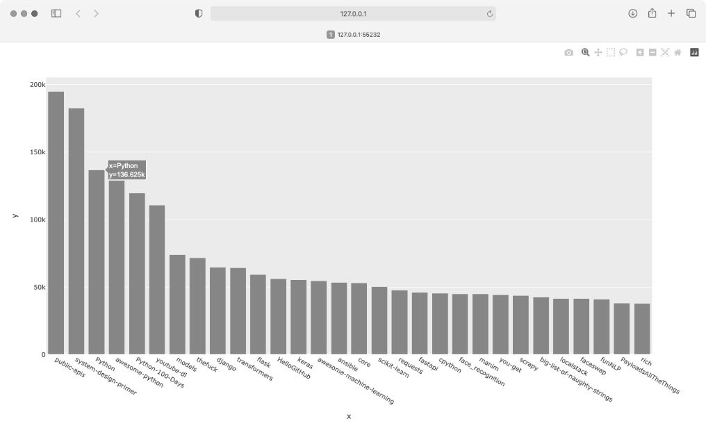
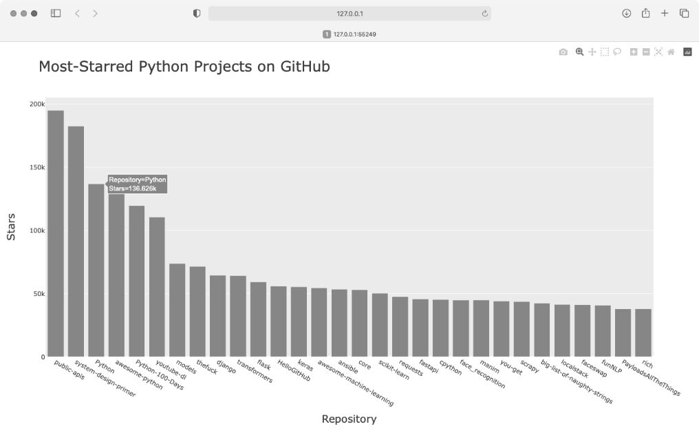
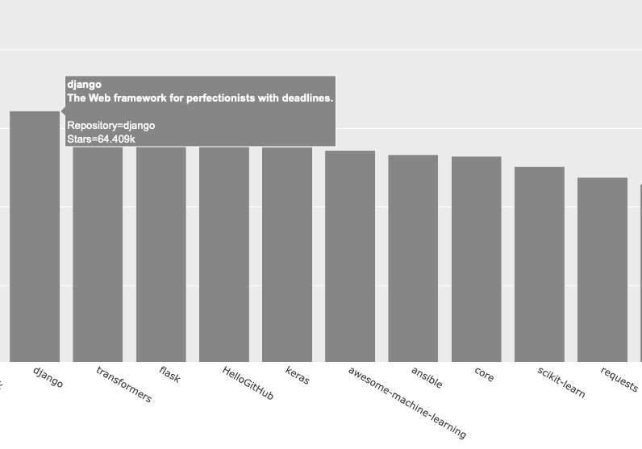

本章介绍如何编写一个独立的程序，对获取的数据进行可视化。这个程序将使用**应用程序接口**（Application Programming Interface，API）自动请求网站的特定信息，并对这些信息进行可视化。这样编写的程序始终使用最新的数据进行可视化，因此即便数据实时更新，图形呈现的信息也是最新的。

## 1. 使用 API

API 是网站的一部分，用于与程序进行交互。这些程序使用非常具体的 URL 请求特定的信息，而这种请求称为 **API 调用**。请求的数据将以程序易于处理的格式（如 JSON 或 CSV）返回。使用外部数据源的应用程序（如集成了社交媒体网站的应用程序）大多依赖 API 调用。

### Git和GitHub

本章会对来自 GitHub 的信息进行可视化。GitHub 是一个让程序员能够协作开发项目的网站。我们将使用 GitHub 的 API 来请求有关该网站中 Python 项目的信息，再使用 Plotly 生成交互式的图形，以呈现这些项目的受欢迎程度。

GitHub 的名字源自 Git，后者是一个分布式版本控制系统，帮助人们管理为项目所做的工作，避免一个人所做的修改影响其他人的工作。当你在项目中实现新功能时，Git 会跟踪你对每个文件所做的修改；确定代码可行后，你可以提交所做的修改，而 Git 将记录项目最新的状态；如果你犯了错，想撤销所做的修改，可借助 Git 轻松地回退到以前的任意一个可行状态。GitHub 上的项目都存储在**仓库**（repository）中，后者包含与项目相关联的一切：代码、项目参与者的信息、问题或 bug 报告，等等。

在 GitHub 上，用户不仅可以给喜欢的项目**加星**（star）来表示支持，还可以关注自己可能想使用的项目。在本章中，我们将编写一个程序，自动下载 GitHub 上星数最多的 Python 项目的信息，并对这些信息进行可视化。

### 使用API调用请求数据

GitHub 的 API 让你能够通过 API 调用请求各种信息。要知道 API 调用是什么样的，请在浏览器的地址栏中输入如下地址并按回车键：

```
https://api.github.com/search/repositories?q=language:python+sort:stars
```

这个 API 调用返回 GitHub 当前托管了多少个 Python 项目，以及有关最受欢迎的 Python 仓库的信息。下面来仔细地研究这个 API 调用。

开头的 https://api.github.com/ 是 GitHub 的 API 地址；接下来的 search/repositories 让 API 搜索 GitHub 上的所有仓库；repositories 后面的问号指出需要传递一个参数——参数 q 表示查询，而等号（=）让我们能够开始指定查询（q=）；接着，通过 language:python 指出只想获取主要语言为 Python 的仓库的信息；最后的 +sort:stars 指定将项目按星数排序。

下面显示了响应的前几行：

```
  {
❶   "total_count": 8961993,
❷   "incomplete_results": true,
❸   "items": [
      {
        "id": 54346799,
        "node_id": "MDEwOlJlcG9zaXRvcnk1NDM0Njc5OQ==",
        "name": "public-apis",
        "full_name": "public-apis/public-apis",
--snip--
```

从响应可知，该 URL 并不适合人工输入，因为它采用了适合程序处理的格式。

在本书编写期间，GitHub 总共有将近 900 万个 Python 项目（见❶）。"incomplete_results" 的值为 true，表明 GitHub 没有处理完这个查询（见❷）。为确保 API 能够及时地响应所有用户，GitHub 对每个查询的运行时间都进行了限制。在这里，GitHub 找出了一些最受欢迎的 Python 仓库，但由于时间不够，没能找出所有的 Python 仓库，稍后我们将修复这个问题。接下来的列表 items 显示了返回的结果，其中包含 GitHub 上最受欢迎的 Python 项目的详细信息（见❸）。

### 安装Requests

Requests 包让 Python 程序能够轻松地向网站请求信息并检查返回的响应。要安装 Requests，可使用 pip：

```
$ python -m pip install --user requests
```

如果你在运行程序或启动终端会话时使用的是命令 python3，请使用下面的命令来安装 Requests 包：

```
$ python3 -m pip install --user requests
```

### 处理API响应

下面来编写一个程序，自动执行 API 调用并处理结果：

```python
  import requests

  # 执行API调用并查看响应
❶ url = "https://api.github.com/search/repositories"
  url += "?q=language:python+sort:stars+stars:>10000"

❷ headers = {"Accept": "application/vnd.github.v3+json"}
❸ r = requests.get(url, headers=headers)
❹ print(f"Status code: {r.status_code}")

  # 将响应转换为字典
❺ response_dict = r.json()

  # 处理结果
  print(response_dict.keys())
```

首先，导入 requests 模块。然后，将 API 调用的 URL 赋给变量 url（见❶）。这个 URL 很长，因此分成了两行：第一行是该 URL 的主要部分，第二行是查询字符串。这里在前面的查询字符串的基础上添加了条件 stars:>10000，让 GitHub 只查找获得超过 10000 颗星的 Python 仓库。这应该让 GitHub 有足够的时间返回完整的结果。

最新的 GitHub API 版本为第 3 版，因此通过指定 headers 显式地要求使用这个版本的 API 并返回 JSON 格式的结果（见❷）。然后，使用 requests 调用 API（见❸）：我们调用 get() 并将变量 url 和 headers 传递给它，再将响应对象存储在变量 r 中。响应对象包含一个名为 status_code 的属性，指出请求是否成功（状态码 200 表示请求成功），我们打印 status_code，以核实调用是否成功（见❹）。前面已经让这个 API 返回 JSON 格式的信息了，因此使用方法 json() 将这些信息转换为一个 Python 字典（见❺），并将结果赋给变量 response_dict。

最后，打印 response_dict 中的键。输出如下：

```
Status code: 200
dict_keys(['total_count', 'incomplete_results', 'items'])
```

状态码为 200，由此知道请求成功了。响应字典只包含三个键：'total_count'、'incomplete_results' 和 'items'。下面来看看响应字典内部是什么样的。

### 处理响应字典

将 API 调用返回的信息存储到字典里后，就可处理其中的数据了。生成一些概述这些信息的输出是一种不错的方式，可帮助我们确认收到了期望的信息，进而开始研究感兴趣的信息：

```python
  import requests

  # 执行API调用并存储响应
--snip--

  # 将响应转换为字典
  response_dict = r.json()
❶ print(f"Total repositories: {response_dict['total_count']}")
  print(f"Complete results: {not response_dict['incomplete_results']}")

  # 探索有关仓库的信息
❷ repo_dicts = response_dict['items']
  print(f"Repositories returned: {len(repo_dicts)}")

  # 研究第一个仓库
❸ repo_dict = repo_dicts[0]
❹ print(f"\nKeys: {len(repo_dict)}")
❺ for key in sorted(repo_dict.keys()):
      print(key)
```

为了探索响应字典，首先打印与 'total_count' 相关联的值，它指出 API 调用返回了多少个 Python 仓库（见❶）。我们还查看了与 'incomplete_results' 相关联的值，以便知道 GitHub 是否有足够的时间处理完这个查询。这里没有直接打印这个值，而打印与之相反的值：如果为 True，就表明收到了完整的结果集。

与 'items' 关联的值是个列表，其中包含很多字典，而每个字典都包含有关一个 Python 仓库的信息。我们将这个字典列表赋给 repo_dicts（见❷），再打印 repo_dicts 的长度，以获悉获得了多少个仓库的信息。

为更深入地了解返回的有关每个仓库的信息，我们先提取 repo_dicts 中的第一个字典，并将其赋给 repo_dict（见❸），再打印这个字典包含的键数，看看其中有多少项信息（见❹）；最后，打印这个字典的所有键，看看其中包含哪些信息（见❺）。

输出让我们对实际包含的数据有更清晰的认识：

```
  Status code: 200
❶ Total repositories: 248
❷ Complete results: True
  Repositories returned: 30

❸ Keys: 78
  allow_forking
  archive_url
  archived
--snip--
  url
  visibility
  watchers
  watchers_count
```

在本书编写期间，只有 248 个 Python 仓库获得的星超过 10000 颗（见❶）。如你所见，GitHub 有足够的时间处理完这个 API 调用（见❷）。在这个响应中，GitHub 返回了前 30 个满足查询条件的仓库的信息——如果要获得更多仓库的信息，可请求额外的数据页。

GitHub 的 API 返回有关仓库的大量信息：repo_dict 包含 78 个键（见❸）。通过仔细查看这些键，能大致知道可提取有关项目的哪些信息（要准确地获悉 API 将返回哪些信息，要么阅读文档，要么像这里一样使用代码来查看）。

下面来提取 repo_dict 中与一些键相关联的值：

```python
--snip--
  # 研究第一个仓库
  repo_dict = repo_dicts[0]

  print("\nSelected information about first repository:")
❶ print(f"Name: {repo_dict['name']}")
❷ print(f"Owner: {repo_dict['owner']['login']}")
❸ print(f"Stars: {repo_dict['stargazers_count']}")
  print(f"Repository: {repo_dict['html_url']}")
❹ print(f"Created: {repo_dict['created_at']}")
❺ print(f"Updated: {repo_dict['updated_at']}")
  print(f"Description: {repo_dict['description']}")
```

这里打印了与表示第一个仓库的字典中的很多键相对应的值。首先，打印项目的名称（见❶）。项目所有者由一个字典表示，因此使用键 owner 来访问表示所有者的字典，再使用键 login 来获取所有者的登录名（见❷）。接下来，打印项目获得了多少颗星（见❸），还有项目的 GitHub 仓库的 URL。然后，显示项目的创建时间（见❹）和最后一次更新的时间（见❺），最后打印对仓库的描述。

输出类似于下面这样：

```
Status code: 200
Total repositories: 248
Complete results: True
Repositories returned: 30

Selected information about first repository:
Name: public-apis
Owner: public-apis
Stars: 191493
Repository: https://github.com/public-apis/public-apis
Created: 2016-03-20T23:49:42Z
Updated: 2022-05-12T06:37:11Z
Description: A collective list of free APIs
```

从上述输出可知，在本书编写期间，GitHub 上星数最高的 Python 项目为 public-apis，其所有者是一家名为 public-apis 的组织，有近 200000 位 GitHub 用户给这项目加星了。可以看到这个项目的仓库的 URL，项目的创建时间为 2016 年 3 月，且最近更新了。最后，描述指出了项目 public-apis 包含程序员可能感兴趣的一系列免费 API。

### 概述最受欢迎的仓库

在对这些数据进行可视化时，我们想涵盖多个仓库。下面就来编写一个循环，打印 API 调用返回的每个仓库的特定信息，以便能够在图形中包含这些信息：

```python
--snip--
  # 研究有关仓库的信息
  repo_dicts = response_dict['items']
  print(f"Repositories returned: {len(repo_dicts)}")

❶ print("\nSelected information about each repository:")
❷ for repo_dict in repo_dicts:
      print(f"\nName: {repo_dict['name']}")
      print(f"Owner: {repo_dict['owner']['login']}")
      print(f"Stars: {repo_dict['stargazers_count']}")
      print(f"Repository: {repo_dict['html_url']}")
      print(f"Description: {repo_dict['description']}")
```

首先，打印一条说明性消息（见❶）；然后，遍历 repo_dicts 中的所有字典（见❷）。在这个循环中，打印每个项目的名称、所有者、星数、在 GitHub 上的 URL 以及描述：

```
Status code: 200
Total repositories: 248
Complete results: True
Repositories returned: 30

Selected information about each repository:

Name: public-apis
Owner: public-apis
Stars: 191494
Repository: https://github.com/public-apis/public-apis
Description: A collective list of free APIs

Name: system-design-primer
Owner: donnemartin
Stars: 179952
Repository: https://github.com/donnemartin/system-design-primer
Description: Learn how to design large-scale systems. Prep for the system
  design interview.  Includes Anki flashcards.
--snip--

Name: PayloadsAllTheThings
Owner: swisskyrepo
Stars: 37227
Repository: https://github.com/swisskyrepo/PayloadsAllTheThings
Description: A list of useful payloads and bypass for Web Application Security
  and Pentest/CTF
```

在上述输出中，有些有趣的项目可能值得一看。但不要在输出的内容上花费太多时间，因为即将创建的图形能让你更容易地看清结果。

### 监控API的速率限制

大多数 API 存在速率限制，即在特定时间内可执行的请求数存在限制。要获悉是否接近了 GitHub 的限制，请在浏览器中输入 https://api.github.com/rate_limit，你将看到类似于下面的响应：

```
  {
    "resources": {
--snip--
❶     "search": {
❷       "limit": 10,
❸       "remaining": 9,
❹       "reset": 1652338832,
        "used": 1,
        "resource": "search"
      },
--snip--
```

我们关心的信息是搜索 API 的速率限制（见❶）。从❷处可知，限值为每分钟 10 个请求，而在当前的这一分钟内，还可执行 9 个请求（见❸）。与键 reset 对应的值是配额将被重置的 Unix 时间或新纪元时间（从 1970 年 1 月 1 日零点开始经过的秒数）（见❹）。在用完配额后，我们将收到一条简单的响应消息，得知已到达 API 的限值。到达限值后，必须等待配额重置。

注意：很多 API 要求，在通过注册获得 API 密钥（访问令牌）后，才能执行 API 调用。在本书编写期间，GitHub 没有这样的要求，但获得访问令牌后，配额将高得多。

## 2. 使用 Plotly 可视化仓库

下面使用收集到的数据来创建图形，以展示 GitHub 上 Python 项目的受欢迎程度。我们将创建一个交互式条形图，其中条形的高度表示项目获得了多少颗星。

请复制前面编写的 python_repos.py，并将副本保存为 python_repos_visual.py，再修改成下面这样：

```python
  import requests
  import plotly.express as px

  # 执行API调用并查看响应
  url = "https://api.github.com/search/repositories"
  url += "?q=language:python+sort:stars+stars:>10000"

  headers = {"Accept": "application/vnd.github.v3+json"}
  r = requests.get(url, headers=headers)
❶ print(f"Status code: {r.status_code}")

  # 处理结果
  response_dict = r.json()
❷ print(f"Complete results: {not response_dict['incomplete_results']}")

  # 处理有关仓库的信息
  repo_dicts = response_dict['items']
❸ repo_names, stars = [], []
  for repo_dict in repo_dicts:
      repo_names.append(repo_dict['name'])
      stars.append(repo_dict['stargazers_count'])

  # 可视化
❹ fig = px.bar(x=repo_names, y=stars)
  fig.show()
```

先导入 Plotly Express，再像前面那样执行 API 调用。然后，打印 API 调用响应的状态，以确定是否出现了问题（见❶）。在处理结果时，我们也打印一条消息，确认收到了完整的结果集（见❷）。然而，其他的 print() 调用都被删除了，这是因为我们确定获得了所需的数据，可跳过探索阶段。

接下来，创建两个空列表，用于存储要在图形中呈现的数据（见❸）。我们需要每个项目的名称（repo_names），用于给条形添加标签，还需要知道项目获得了多少颗星（stars），以确定条形的高度。在循环中，将每个项目的名称和星数分别附加到这两个列表的末尾。

只需要两行代码就可以生成初始图形（见❹），这符合 Plotly Express 的理念：让你能够尽快地看到可视化效果，确定没问题后再改进其外观。这里使用 px.bar() 函数创建了一个条形图，在调用这个函数时，我们将参数 x 和 y 分别设置成了列表 repo_names 和 stars。

生成的图形如图 17-1 所示。从中可知，开头几个项目的受欢迎程度比其他项目高得多，但所有这些项目在 Python 生态系统中都很重要。



### 设置图形的样式

Plotly 提供了众多定制图形以及设置其样式的方式，可在确定信息被正确地可视化后使用。下面对 px.bar() 调用做些修改，并对创建的 fig 对象做进一步的调整。

首先设置图形的样式——添加图形的标题并给每条坐标轴添加标题：

```python
--snip--
  # 可视化
  title = "Most-Starred Python Projects on GitHub"
  labels = {'x': 'Repository', 'y': 'Stars'}
  fig = px.bar(x=repo_names, y=stars, title=title, labels=labels)

❶ fig.update_layout(title_font_size=28, xaxis_title_font_size=20,
      yaxis_title_font_size=20)

  fig.show()
```

像前面的图形一样，我们添加了图形的标题，并给每条坐标轴都添加了标题。然后，使用方法 fig.update_layout() 修改一些图形元素（见❶）。在给图形元素命名时，Plotly 用下划线分隔元素名称的不同部分。熟悉 Plotly 文档后，你将发现，不同的图形元素的命名和修改方式是一致的。这里将图形标题的字号设置成了 28，并将坐标轴标题的字号设置为 20。最终结果如图 17-2 所示。



### 添加定制工具提示

在 Plotly 中，将鼠标指向条形将显示它表示的信息，这通常称为**工具提示**（tooltip）。在这里，当前显示的是项目获得了多少颗星。下面来添加定制工具提示，以显示项目的描述和所有者。

为生成这样的工具提示，需要再提取一些信息：

```python
--snip--
  # 处理有关仓库的信息
  repo_dicts = response_dict['items']
❶ repo_names, stars, hover_texts = [], [], []
  for repo_dict in repo_dicts:
      repo_names.append(repo_dict['name'])
      stars.append(repo_dict['stargazers_count'])

      # 创建悬停文本
❷     owner = repo_dict['owner']['login']
      description = repo_dict['description']
❸     hover_text = f"{owner}<br />{description}"
      hover_texts.append(hover_text)

  # 可视化
  title = "Most-Starred Python Projects on GitHub"
  labels = {'x': 'Repository', 'y': 'Stars'}
❹ fig = px.bar(x=repo_names, y=stars, title=title, labels=labels,
      hover_name=hover_texts)

  fig.update_layout(title_font_size=28, xaxis_title_font_size=20,
          yaxis_title_font_size=20)

  fig.show()
```

首先，定义一个新的空列表 hover_texts，用于存储要给各个项目显示的文本（见❶）。在处理数据的循环中，提取每个项目的所有者和描述（见❷）。Plotly 允许在文本元素中使用 HTML 代码，这让我们在创建由项目所有者和描述组成的字符串时，能够在这两部分之间添加换行符（\<br /\>）（见❸）。然后，我们将这个字符串追加到列表 hover_texts 的末尾。

在 px.bar() 调用中，添加参数 hover_name 并将其设置为 hover_texts（见❹）。Plotly 在创建每个条形时，都将提取这个列表中的文本，并在观看者将鼠标指向条形时显示它们。图 17-3 显示了一个定制工具提示。



### 添加可单击的链接

Plotly 允许在文本元素中使用 HTML，这让你能够轻松地在图形中添加链接。下面将 x 轴标签作为链接，让观看者能够访问项目在 GitHub 上的主页。为此，需要提取 URL 并使用它们来生成 x 轴标签：

```python
--snip--
  # 处理有关仓库的信息
  repo_dicts = response_dict['items']
❶ repo_links, stars, hover_texts = [], [], []
  for repo_dict in repo_dicts:
      # 将仓库名转换为链接
      repo_name = repo_dict['name']
❷     repo_url = repo_dict['html_url']
❸     repo_link = f"<a href='{repo_url}'>{repo_name}</a>"
      repo_links.append(repo_link)

      stars.append(repo_dict['stargazers_count'])
--snip--

  # 可视化
  title = "Most-Starred Python Projects on GitHub"
  labels = {'x': 'Repository', 'y': 'Stars'}
  fig = px.bar(x=repo_links, y=stars, title=title, labels=labels,
          hover_name=hover_texts)

  fig.update_layout(title_font_size=28, xaxis_title_font_size=20,
          yaxis_title_font_size=20)

  fig.show()
```

这里修改了列表的名称（从 repo_names 改为 repo_links），更准确地指出了其中存放的是哪种信息（见❶）。然后，从 repo_dict 中提取项目的 URL，并将其赋给临时变量 repo_url（见❷）。接下来，创建一个指向项目的链接（见❸），为此使用了 HTML 标签 \<a\>，其格式为 \<a href='URL'\>link text\</a\>。然后，将这个链接追加到列表 repo_links 的末尾。

在调用 px.bar() 时，将列表 repo_links 用作图形的 x 坐标值。虽然生成的图形与之前相同，但观看者可单击图形底端的项目名，以访问相应项目在 GitHub 上的主页。至此，我们对 API 获取的数据进行了可视化，得到的图形是可交互的，包含丰富的信息！

### 定制标记颜色

创建图形后，可使用以 update_ 打头的方法来定制其各个方面。前面使用了方法 update_layout()，而 update_traces() 则可用来定制图形呈现的数据。

我们将条形改为更深的蓝色并且是半透明的：

```python
--snip--
fig.update_layout(title_font_size=28, xaxis_title_font_size=20,
        yaxis_title_font_size=20)

fig.update_traces(marker_color='SteelBlue', marker_opacity=0.6)

fig.show()
```

在 Plotly 中，**trace** 指的是图形上的一系列数据。update_traces() 方法接受大量的参数，其中以 marker_ 打头的参数都会影响图形上的标记。这里将每个标记的颜色都设置成了 'SteelBlue'，你可将参数 marker_color 设置为任何有具体名称的 CSS 颜色。我们还将每个标记的不透明度都设置成了 0.6：不透明度值 1.0 表示完全不透明，而 0 表示完全透明。

### 深入了解Plotly和GitHub API

虽然 Plotly 提供了内容丰富、条理清晰的文档，但是可能让你觉得无从下手。因此，要深入了解 Plotly，最好先阅读文章 Plotly Express in Python。这篇文章概述了使用 Plotly Express 可创建的所有图表类型，其中还包含一些链接，指向各种图表的详细介绍。

如果要深入地了解如何定制 Plotly 图形，可阅读文章 Styling Plotly Express Figures in Python。这篇文章深入介绍了本书第 15～17 章提及的定制方式。

要深入地了解 GitHub API，可参阅其文档，这样可知道如何从 GitHub 中提取各种信息。要更深入地了解本章项目介绍的内容，可参阅该文档的 Search 部分。如果有 GitHub 账户，除了其他仓库的公开信息以外，你还可以提取有关自己的信息。

## 3. Hacker News API

为了探索如何使用其他网站的 API 调用，我们来看看 Hacker News 网站。在这个网站上，用户分享编程和技术方面的文章，并就这些文章展开积极的讨论。Hacker News 的 API 让你能够访问有关该网站上所有文章和评论的信息，并且不要求通过注册获得密钥。

下面的 API 调用返回本书编写期间 Hacker News 上最热门文章的信息：

```
https://hacker-news.firebaseio.com/v0/item/31353677.json
```

如果在浏览器中输入这个 URL，你会发现响应的文章信息位于一对花括号内，表明这是一个字典。如果不调整格式，这样的响应信息难以阅读。下面像前面的地震项目那样，通过 json.dumps() 方法来处理这个 URL 的内容，以便对返回的信息进行探索：

```python
  import requests
  import json

  # 执行API调用并存储响应
  url = "https://hacker-news.firebaseio.com/v0/item/31353677.json"
  r = requests.get(url)
  print(f"Status code: {r.status_code}")

  # 探索数据的结构
  response_dict = r.json()
  response_string = json.dumps(response_dict, indent=4)
❶ print(response_string)
```

这里的所有代码都在前两章中使用过，你应该不会感到陌生。主要的差别在于，这里的响应字符串不是很长，因此在设置格式后直接打印（见❶），而没有将其写入文件。

输出是一个字典，其中包含有关 ID 为 31353677 的文章的信息：

```
  {
      "by": "sohkamyung",
❶     "descendants": 302,
      "id": 31353677,
❷     "kids": [
          31354987,
          31354235,
--snip--
      ],
      "score": 785,
      "time": 1652361401,
❸     "title": "Astronomers reveal first image of the black hole
          at the heart of our galaxy",
      "type": "story",
❹     "url": "https://public.nrao.edu/news/.../"
  }
```

这个字典包含很多键。与键 descendants 对应的值是文章被评论的次数（见❶）；与键 kids 对应的值包含文章下所有评论的 ID（见❷）——每个评论本身也可能有评论，因此文章的 descendants 的数量可能比其 kid 的数量多。这个字典中还包含当前文章的标题（见❸）和 URL（见❹）。

下面的 URL 返回一个列表，其中包含 Hacker News 上当前排名靠前的文章的 ID：

```
https://hacker-news.firebaseio.com/v0/topstories.json
```

通过这个调用，可获悉当前有哪些文章位于 Hacker News 主页上，再生成一系列类似于前面的 API 调用。使用这种方法，可概述当前位于 Hacker News 主页上的每篇文章：

```python
  from operator import itemgetter

  import requests

  # 执行API调用并查看响应
❶ url = "https://hacker-news.firebaseio.com/v0/topstories.json"
  r = requests.get(url)
  print(f"Status code: {r.status_code}")

  # 处理有关每篇文章的信息
❷ submission_ids = r.json()
❸ submission_dicts = []
  for submission_id in submission_ids[:5]:
      # 对于每篇文章，都执行一个API调用
❹     url = f"https://hacker-news.firebaseio.com/v0/item/{submission_id}.json"
      r = requests.get(url)
      print(f"id: {submission_id}\tstatus: {r.status_code}")
      response_dict = r.json()

      # 对于每篇文章，都创建一个字典
❺     submission_dict = {
          'title': response_dict['title'],
          'hn_link': f"https://news.ycombinator.com/item?id={submission_id}",
          'comments': response_dict['descendants'],
      }
❻     submission_dicts.append(submission_dict)

❼ submission_dicts = sorted(submission_dicts, key=itemgetter('comments'),
                              reverse=True)

❽ for submission_dict in submission_dicts:
      print(f"\nTitle: {submission_dict['title']}")
      print(f"Discussion link: {submission_dict['hn_link']}")
      print(f"Comments: {submission_dict['comments']}")
```

首先，执行一个 API 调用，并打印响应的状态（见❶）。这个 API 调用返回一个列表，其中包含 Hacker News 上当前最热门的 500 篇文章的 ID。接下来，将响应对象转换为 Python 列表（见❷），并将其赋给 submission_ids。后面将使用这些 ID 来创建一系列字典，其中每个字典都包含一篇文章的信息。

我们创建了一个名为 submission_dicts 的空列表，用于存储前面所说的字典（见❸）。接下来，遍历前 5 篇文章的 ID。对于每篇文章，都执行一个 API 调用，其中的 URL 包含 submission_id 的当前值（见❹）。我们打印请求的状态和文章的 ID，以便知道请求是否成功。

接下来，为当前处理的文章创建一个字典（见❺），并在其中存储文章的标题、链接和评论数。然后，将 submission_dict 追加到 submission_dicts 的末尾（见❻）。

Hacker News 上的文章是根据总体得分排名的，而总体得分取决于很多因素，包括被推荐的次数、评论数和发表时间。我们要根据评论数（键 'comments' 对应的值）对字典列表进行排序，为此使用 operator 模块中的函数 itemgetter()（见❼）。我们向这个函数传递了键 'comments'，因此它从这个列表的每个字典中提取与键 'comments' 对应的值。这样，sorted() 函数将根据这些值对列表进行排序。我们将列表按降序排列，即评论最多的文章位于最前面。

对列表排序后遍历它（见❽），打印每篇热门文章的三项信息：标题、链接和评论数：

```
Status code: 200
id: 31390506    status: 200
id: 31389893    status: 200
id: 31390742    status: 200
--snip--

Title: Fly.io: The reclaimer of Heroku's magic
Discussion link: https://news.ycombinator.com/item?id=31390506
Comments: 134

Title: The weird Hewlett Packard FreeDOS option
Discussion link: https://news.ycombinator.com/item?id=31389893
Comments: 64

Title: Modern JavaScript Tutorial
Discussion link: https://news.ycombinator.com/item?id=31390742
Comments: 20
--snip--
```

基于这种方式，应用程序能够为用户提供网站（如 Hacker News）的定制化阅读体验。要更深入地了解通过 Hacker News API 可访问哪些信息，请参阅其文档页面。

注意：Hacker News 有时允许一些公司发布特殊的招聘帖子，并禁止对这些帖子进行评论。如果你在运行这里的程序时，遇到这样的帖子，将出现 KeyError 错误。如果这种错误会引发问题，可将创建 submission_dict 的代码放在 try-except 代码块中，从而忽略这样的帖子。

## 4. 小结

在本章中，你学习了如何使用 API 来编写独立的程序，以自动采集所需的数据并进行可视化。你不仅使用了 GitHub API 来探索 GitHub 上星数最多的 Python 项目，还大致了解了 Hacker News API，学到了如何使用 Requests 包来自动执行 API 调用，以及如何处理调用的结果。本章还简要地介绍了一些 Plotly 设置，可用其进一步定制生成的图形的外观。
