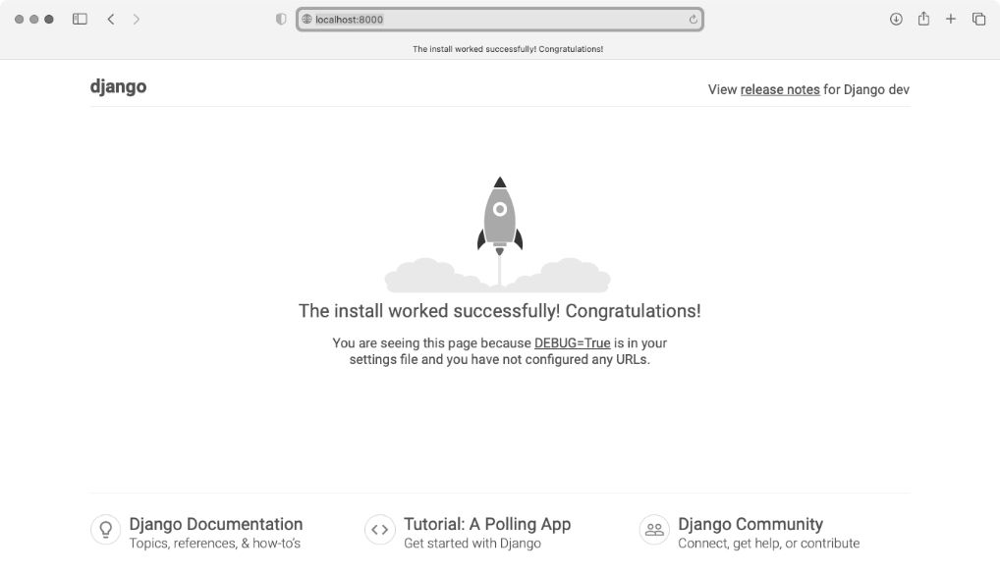
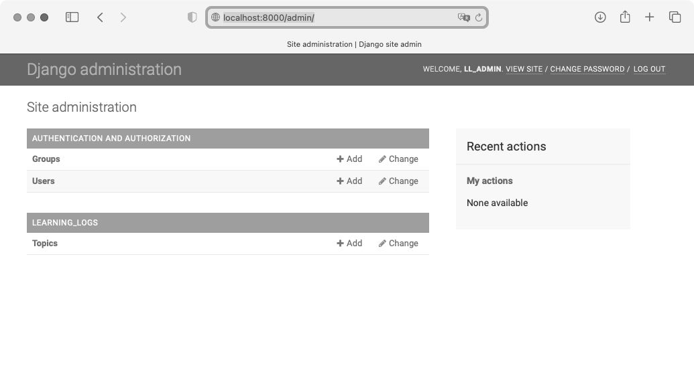
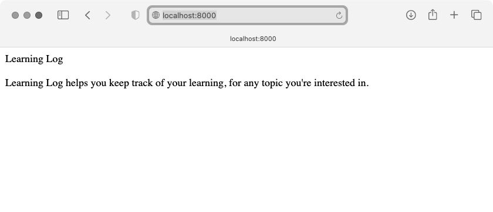
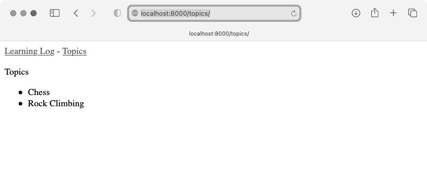
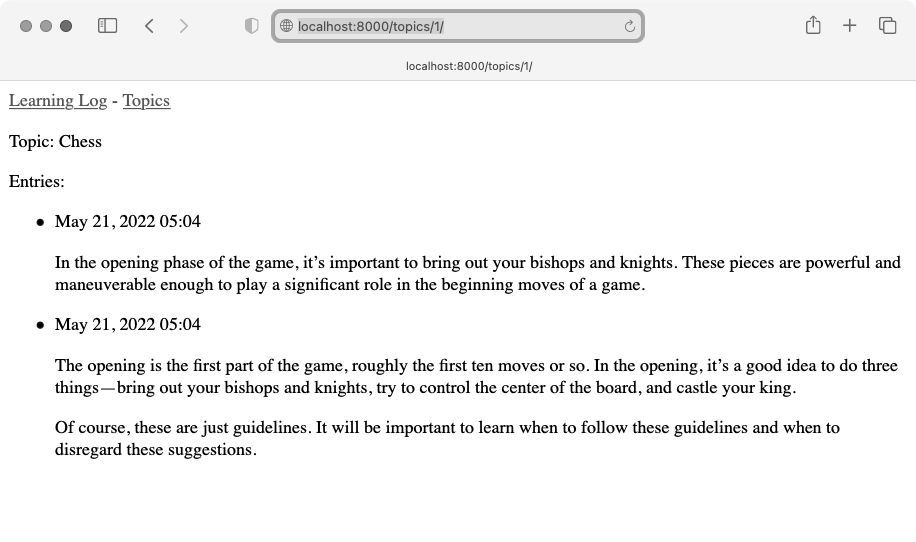

随着互联网的发展，网站和移动应用程序之间的界线不再清晰，它们都能够让用户以各种方式与数据交互。所幸，可以使用 Django 来创建能同时作为动态网站和移动应用程序的项目。Django 是最流行的 Python Web 框架，提供了一系列旨在帮助开发交互式网站的工具。

本章介绍如何使用 Django 来开发一个名为「学习笔记」（Learning Log）的项目。这是一个在线日志系统，让你能够记录针对哪些特定主题学到了哪些知识。我们将先为这个项目制定规范，再为使用的数据定义模型，然后使用 Django 的管理系统来输入一些初始数据，最后编写视图和模板，让 Django 能够创建网页。Django 能够响应网页请求，还让你能够更轻松地读写数据库、管理用户，等等。

## 1. 建立项目

在着手开发像 Web 应用这样的大项目时，首先需要制定**规范**（spec），对项目的目标进行描述。确定要达成的目标后，就能着手找出为达成这些目标而需要完成的任务了。本节将为「学习笔记」项目制定规范，并进入项目开发的第一个阶段，包括搭建虚拟环境以及构建 Django 项目框架。

### 制定规范

完整的规范要详细说明项目的目标，阐述项目的功能，讨论项目的外观和用户界面。与任何良好的项目规划书和商业计划书一样，规范应突出重点，帮助避免项目偏离轨道。这里不制定完整的项目规划，只列出一些明确的目标，以突出开发的重点。我们制定的规范如下：

我们要编写一个名为「学习笔记」的 Web 应用程序，让用户能够记录感兴趣的主题，并在学习每个主题的过程中添加日志条目。「学习笔记」的主页对这个网站进行描述，并邀请用户注册或登录。用户登录后，可以创建新主题、添加新条目以及阅读既有的条目。

在学习新主题时，记录学到的知识可有助于建立知识体系，研究技术主题时尤其如此。优秀的应用程序能让这个记录过程简单高效。

### 建立虚拟环境

使用 Django 之前，需要建立虚拟的工作环境。**虚拟环境**是系统的一个位置，你可在其中安装包，并将这些包与其他 Python 包隔离开来。将项目的库与其他项目分离是有益的，为了之后将「学习笔记」部署到服务器，这也是必须的。

为项目新建一个目录，将其命名为 learning_log，再在终端中切换到这个目录，并执行如下命令创建一个虚拟环境：

```
learning_log$ python -m venv ll_env
learning_log$
```

这里运行了模块 venv，并使用它创建了一个名为 ll_env 的虚拟环境（请注意，ll_env 的开头是两个小写的 L，而不是数字 1）。如果你在运行程序或安装包时使用的是命令 python3，这里也务必使用同样的命令。

### 激活虚拟环境

现在需要使用下面的命令激活虚拟环境：

```
learning_log$ source ll_env/bin/activate
(ll_env)learning_log$
```

这个命令运行 ll_env/bin 中的脚本 activate。当环境处于活动状态时，环境名将包含在括号内，这意味着可在环境中安装包并使用已安装的包。在 ll_env 中安装的包仅在该环境处于活动状态时才可用。

注意：如果你使用的是 Windows 系统，请使用命令 ll_env\Scripts\activate（不包含 source）来激活这个虚拟环境。如果你使用的是 PowerShell，可能需要将 Activate 的首字母大写。

要停止使用虚拟环境，可执行命令 deactivate：

```
(ll_env)learning_log$ deactivate
learning_log$
```

如果关闭运行虚拟环境的终端，虚拟环境也将不再处于活动状态。

### 安装Django

Django 仅在虚拟环境 ll_env 处于活动状态时才可用。现在是在虚拟环境中工作，因此不管使用什么系统，安装 Django 的命令都相同：不需要指定标志 --user，也无须使用像 python -m pip install package_name 这样较长的命令。激活虚拟环境后，执行如下命令来更新 pip 并安装 Django：

```
(ll_env)learning_log$ pip install --upgrade pip
(ll_env)learning_log$ pip install django
Collecting django
--snip--
Installing collected packages: sqlparse, asgiref, django
Successfully installed asgiref-3.5.2 django-4.1 sqlparse-0.4.2
(ll_env)learning_log$
```

pip 从各种地方下载资源，因此升级频繁。有鉴于此，每当你搭建新的虚拟环境后，都最好更新 pip。

注意：每隔大约 8 个月，Django 新版本就会发布，因此你在安装 Django 时，看到的可能是更新的版本。即便你使用的是更新的 Django 版本，这个项目也可行。如果要使用这里所示的 Django 版本，请使用命令 pip install django==4.1.*，这将安装最新的 Django 4.1 版本。

### 在Django中创建项目

在虚拟环境依然处于活动状态的情况下（ll_env 包含在括号内），执行如下命令新建一个项目：

```
❶ (ll_env)learning_log$ django-admin startproject ll_project .
❷ (ll_env)learning_log$ ls
  ll_env ll_project manage.py
❸ (ll_env)learning_log$ ls ll_project
  __init__.py asgi.py settings.py urls.py wsgi.py
```

命令 startproject（见❶）让 Django 新建一个名为 ll_project 的项目。这个命令末尾的句点（.）让新项目使用合适的目录结构，这样在开发完成后可轻松地将应用程序部署到服务器上。

注意：千万别忘了这个句点，否则在部署应用程序时将遭遇一些配置问题。如果忘记了，需要删除已创建的文件和文件夹（ll_env 除外），再重新运行这个命令。

在❷处，运行命令 ls（在 Windows 系统上为 dir），结果表明 Django 新建了一个名为 ll_project 的目录。它还创建了文件 manage.py，这是一个简单的程序，接受命令并将其交给 Django 的相关部分。我们将使用这些命令来管理使用数据库和运行服务器等任务。

目录 ll_project 包含 4 个文件（见❸），其中最重要的是 settings.py、urls.py 和 wsgi.py。文件 settings.py 指定 Django 如何与系统交互以及如何管理项目，在开发项目的过程中，我们将修改其中的一些设置，并添加一些设置；文件 urls.py 告诉 Django，应创建哪些网页来响应浏览器请求；文件 wsgi.py 帮助 Django 提供它创建的文件，名称是 Web Server Gateway Interface（Web 服务器网关接口）的首字母缩写。

### 创建数据库

Django 将大部分与项目相关的信息存储在数据库中，因此需要创建一个供 Django 使用的数据库。为了给项目「学习笔记」创建数据库，要在虚拟环境处于活动状态的情况下执行下面的命令：

```
  (ll_env)learning_log$ python manage.py migrate
❶ Operations to perform:
    Apply all migrations: admin, auth, contenttypes, sessions
  Running migrations:
    Applying contenttypes.0001_initial... OK
    Applying auth.0001_initial... OK
--snip--
    Applying sessions.0001_initial... OK
❷ (ll_env)learning_log$ ls
  db.sqlite3 ll_env ll_project manage.py
```

我们将修改数据库称为**迁移**（migrate）数据库。首次执行命令 migrate 将让 Django 确保数据库与项目的当前状态匹配。在使用 SQLite（后面将详细介绍）的新项目中首次执行这个命令时，Django 将新建一个数据库。在这里，Django 指出它将准备好数据库，用于存储执行管理和身份验证任务所需的信息（见❶）。

❷处运行了命令 ls，其输出表明 Django 又创建了一个文件，名为 db.sqlite3。SQLite 是一种使用单个文件的数据库，是编写简单应用程序的理想选择，因为它让你不用太关注数据库的管理问题。

注意：在活动的虚拟环境中运行 manage.py 时，务必使用命令 python，即便你在运行其他程序时使用了命令 python3 也是如此。在虚拟环境中，命令 python 指的是在创建虚拟环境时使用的 Python 版本。

### 查看项目

下面来核实 Django 正确地创建了项目。为此，可使用命令 runserver 查看项目的状态：

```
  (ll_env)learning_log$ python manage.py runserver
  Watching for file changes with StatReloader
  Performing system checks...

❶ System check identified no issues (0 silenced).
  May 19, 2022 - 21:52:35
❷ Django version 4.1, using settings 'll_project.settings'
❸ Starting development server at http://127.0.0.1:8000/
  Quit the server with CONTROL-C.
```

Django 启动一个**服务器**（development server），让你能够查看系统中的项目，了解它的工作情况。如果你在浏览器中输入 URL 以请求网页，那么该 Django 服务器将进行响应：生成合适的网页，并将其发送给浏览器。

Django 首先通过检查确认正确地创建了项目（见❶），然后指出使用的 Django 版本以及当前使用的设置文件的名称（见❷），最后指出项目的 URL（见❸）。URL http://127.0.0.1:8000/ 表明项目将在你的计算机（即 localhost）的端口 8000 上侦听请求。localhost 表示只处理当前系统发出的请求的服务器，它不允许其他人查看正在开发的网页。

现在打开一款 Web 浏览器，输入 URL http://localhost:8000/（如果不管用，请输入 http://127.0.0.1:8000/），你将看到一个类似于图 18-1 的页面。这个页面是 Django 创建的，让你知道到目前为止一切正常。现在暂时不要关闭这个服务器，等到要关闭时，可切换到执行命令 runserver 时所在的终端窗口并按 Ctrl+C。



注意：如果出现错误消息 "That port is already in use"（指定端口被占用），请执行命令 python manage.py runserver 8001，让 Django 使用另一个端口。如果这个端口也不可用，请逐渐增大端口号并继续执行上述命令，直到找到可用的端口。

## 2. 创建应用程序

Django **项目**（project）由一系列应用程序组成，它们协同工作让项目成为一个整体。本章只创建一个应用程序，它将完成项目里的大部分工作；下一章将添加一个管理用户账户的应用程序。

当前，在前面打开的终端窗口中应该还运行着 runserver。请再打开一个终端窗口（或标签页），并切换到 manage.py 所在的目录，激活虚拟环境，然后执行命令 startapp：

```
  learning_log$ source ll_env/bin/activate
  (ll_env)learning_log$ python manage.py startapp learning_logs
❶ (ll_env)learning_log$ ls
  db.sqlite3 learning_logs ll_env ll_project manage.py
❷ (ll_env)learning_log$ ls learning_logs/
  __init__.py admin.py apps.py migrations models.py tests.py views.py
```

命令 startapp appname 让 Django 搭建创建应用程序所需的基础设施。如果现在查看项目目录，将看到其中新增了文件夹 learning_logs（见❶）。使用命令 ls 查看 Django 都创建了什么（见❷），其中最重要的文件是 models.py、admin.py 和 views.py。我们将使用 models.py 来定义要在应用程序中管理的数据，稍后再介绍 admin.py 和 views.py。

### 定义模型

我们来想想涉及的数据。每个用户都需要在学习笔记中创建很多主题。用户输入的每个条目都与特定的主题相关联，这些条目将以文本的方式显示。还需要存储每个条目的时间戳，以便告诉用户各个条目都是什么时候创建的。

打开文件 models.py，看看它当前包含哪些内容：

```python
from django.db import models

# 在这里创建模型
```

这里导入了模块 models，并让我们创建自己的模型。**模型**告诉 Django 如何处理应用程序中存储的数据。模型就是一个类，就像前面讨论的每个类一样，包含属性和方法。下面是表示用户将存储的主题的模型：

```python
  from django.db import models

  class Topic(models.Model):
      """用户学习的主题"""
❶     text = models.CharField(max_length=200)
❷     date_added = models.DateTimeField(auto_now_add=True)

❸     def __str__(self):
          """返回模型的字符串表示"""
          return self.text
```

这里创建一个名为 Topic 的类，它继承了 Model，即 Django 中定义了模型基本功能的类。我们给 Topic 类添加了两个属性：text 和 date_added。

属性 text 是一个 CharField——由字符组成的数据，即文本（见❶）。当需要存储少量文本（如名称、标题或城市）时，可使用 CharField。在定义 CharField 属性时，必须告诉 Django 该在数据库中预留多少空间，这里将 max_length 设置成了 200（即 200 个字符），这对于存储大多数主题名来说足够了。

属性 date_added 是一个 DateTimeField——记录日期和时间的数据（见❷）。我们传递了实参 auto_now_add=True，每当用户创建新主题时，Django 都会将这个属性自动设置为当前的日期和时间。

最好告诉 Django，你希望它如何表示模型的实例。如果模型有 \_\_str\_\_() 方法，那么每当需要生成表示模型实例的输出时，Django 都将调用这个方法。这里编写了 \_\_str\_\_() 方法，它返回属性 text 的值（见❸）。

要了解可在模型中使用的各种字段，请参阅 Django Model Field Reference（Django 模型字段参考）。就当前而言，你无须了解其中的全部内容，但在你自己开发 Django 项目时，这些内容将提供极大的帮助。

### 激活模型

要使用这些模型，必须让 Django 将前述应用程序包含到项目中。为此，打开 settings.py（它位于目录 ll_project 中），其中有个片段告诉 Django，哪些应用程序被安装到了项目中：

```python
--snip--
INSTALLED_APPS = [
    'django.contrib.admin',
    'django.contrib.auth',
    'django.contrib.contenttypes',
    'django.contrib.sessions',
    'django.contrib.messages',
    'django.contrib.staticfiles',
]
--snip--
```

请将 INSTALLED_APPS 修改成下面这样，将前面的应用程序添加到这个列表中：

```python
--snip--
INSTALLED_APPS = [
    # 我的应用程序
    'learning_logs',
    # Django默认添加的应用程序
    'django.contrib.admin',
--snip--
]
--snip--
```

通过将应用程序编组，在项目因规模不断扩大而包含更多应用程序时，有助于对应用程序进行跟踪。这里新建了一个名为 My apps 的片段，当前它只包含应用程序 learning_logs。务必将你自己创建的应用程序放在默认应用程序前面，这样能够覆盖默认应用程序的行为。

接下来，需要让 Django 修改数据库，使其能够存储与模型 Topic 相关的信息。为此，在终端窗口中执行如下命令：

```
(ll_env)learning_log$ python manage.py makemigrations learning_logs
Migrations for 'learning_logs':
  learning_logs/migrations/0001_initial.py
    - Create model Topic
(ll_env)learning_log$
```

命令 makemigrations 让 Django 确定该如何修改数据库，使其能够存储与前面定义的新模型相关联的数据。输出表明 Django 创建了一个名为 0001_initial.py 的迁移文件，这个文件将在数据库中为模型 Topic 创建一个表。

下面应用这种迁移，让 Django 替我们修改数据库：

```
(ll_env)learning_log$ python manage.py migrate
Operations to perform:
  Apply all migrations: admin, auth, contenttypes, learning_logs, sessions
Running migrations:
  Applying learning_logs.0001_initial... OK
```

这个命令的大部分输出与首次执行命令 migrate 的输出相同。需要检查的是输出的最后一行，其中 Django 指出在为 learning_logs 应用迁移时一切正常。

每当需要修改「学习笔记」管理的数据时，都采取如下三个步骤：修改 models.py、对 learning_logs 调用 makemigrations、让 Django 迁移项目。

### Django管理网站

Django 提供的**管理网站**（admin site）让你能够轻松地处理模型。Django 管理网站仅供网站的管理员使用，普通用户不能使用。本节将建立管理网站，并通过它使用模型 Topic 来添加一些主题。

#### 创建超级用户

Django 允许创建具备所有权限的用户，即**超级用户**（superuser）。权限决定了用户可执行的操作：最严格的权限设置只允许用户阅读网站的公开信息；注册用户通常可阅读自己的私有数据，还可查看一些只有会员才能查看的信息；为了有效地管理项目，网站所有者通常需要访问网站存储的所有信息。优秀的管理员会小心地对待用户的敏感信息，因为用户对其访问的应用程序有极大的信任。

要在 Django 中创建超级用户，请执行下面的命令并按提示做：

```
  (ll_env)learning_log$ python manage.py createsuperuser
❶ Username (leave blank to use 'eric'): ll_admin
❷ Email address:
❸ Password:
  Password (again):
  Superuser created successfully.
  (ll_env)learning_log$
```

在执行命令 createsuperuser 时，Django 会提示输入超级用户的用户名（见❶），这里输入的是 ll_admin，但其实可以输入任意用户名；既可输入电子邮箱地址，也可让这个字段为空（见❷）；需要输入密码两次（见❸）。

注意：可以对网站管理员隐藏一些敏感信息。例如，Django 并不存储你输入的密码，而存储从该密码派生出的一个字符串，称为**哈希值**。每当你输入密码时，Django 都会计算其哈希值，并将结果与存储的哈希值进行比较。如果这两个哈希值相同，你就通过了身份验证。这样，即便黑客获得了网站数据库的访问权，也只能获取其中存储的哈希值，无法获取密码。在网站配置正确的情况下，几乎无法根据哈希值推导出原始密码。

#### 向管理网站注册模型

Django 自动在管理网站中添加了一些模型，如 User 和 Group，如果要添加我们创建的模型，则必须手动注册。

在我们创建应用程序 learning_logs 时，Django 在 models.py 所在的目录中创建了一个名为 admin.py 的文件：

```python
from django.contrib import admin

# 在这里注册你的模型
```

为了向管理网站注册 Topic，请输入下面的代码：

```python
from django.contrib import admin

from .models import Topic

admin.site.register(Topic)
```

首先导入要注册的模型 Topic。句点让 Django 在 admin.py 所在的目录中查找 models.py。admin.site.register() 让 Django 通过管理网站管理模型。

现在，使用超级用户账户访问管理网站：访问 http://localhost:8000/admin/，并输入刚创建的超级用户的用户名和密码。将看到类似于图 18-2 所示的屏幕，这个网页不仅让你能够添加和修改用户和用户组，还可以管理与刚才定义的模型 Topic 相关的数据。



注意：如果在浏览器中看到一条消息，指出访问的网页不可用，请确认在终端窗口中运行着 Django 服务器。如果没有，请激活虚拟环境，并执行命令 python manage.py runserver。在开发过程中，如果无法通过浏览器访问项目，首先应采取的故障排除措施是，先关闭所有打开的终端，再打开终端并执行命令 runserver。

#### 添加主题

向管理网站注册 Topic 后，我们来添加第一个主题。为此，单击 Topics 进入主题网页，它几乎是空的，因为还没有添加任何主题。单击 Add Topic，会出现一个用于添加新主题的表单。在第一个方框中输入 Chess 并单击 Save，我们将回到主题管理页面，其中包含刚创建的主题。

下面再创建一个主题，以便有更多的数据可用。再次单击 Add Topic，并输入 Rock Climbing。单击 Save 后将回到主题管理页面，其中会包含主题 Chess 和 Rock Climbing。

### 定义模型Entry

要记录学到的国际象棋和攀岩知识，用户必须能够在学习笔记中添加条目。因此，需要定义相关的模型。每个条目都与特定的主题相关联，这种关系称为多对一关系，即多个条目可关联到同一个主题。

下面是模型 Entry 的代码，请将这些代码放在文件 models.py 中：

```python
  from django.db import models

  class Topic(models.Model):
  --snip--

❶ class Entry(models.Model):
      """学到的有关某个主题的具体知识"""
❷     topic = models.ForeignKey(Topic, on_delete=models.CASCADE)
❸     text = models.TextField()
      date_added = models.DateTimeField(auto_now_add=True)

❹     class Meta:
          verbose_name_plural = 'entries'

      def __str__(self):
          """返回一个表示条目的简单字符串"""
❺         return f"{self.text[:50]}..."
```

像 Topic 一样，Entry 也继承了 Django 基类 Model（见❶）。第一个属性 topic 是个 **外键**（foreign key）ForeignKey 实例（见❷）。外键是一个数据库术语，它指向数据库中的另一条记录，这里则是将每个条目关联到特定的主题。在创建每个主题时，都为其分配一个键（ID）。当需要在两项数据之间建立联系时，Django 就会使用与每项信息相关联的键，我们稍后将根据这些联系获取与特定主题相关联的所有条目。实参 on_delete=models.CASCADE 让 Django 在删除主题的同时删除所有与之相关联的条目，这称为**级联删除**（cascading delete）。

接下来是属性 text，它是一个 TextField 实例（见❸）。这种字段的长度不受限制，因为我们不想限制条目的长度。属性 date_added 让我们能够按创建顺序呈现条目，并在每个条目旁边放置时间戳。

我们在 Entry 类中嵌套了 Meta 类（见❹）。Meta 存储用于管理模型的额外信息，在这里，它让我们能够设置一个特殊属性，让 Django 在需要时使用 entries 表示多个条目。如果没有这个类，Django 将使用 Entrys 表示多个条目。

\_\_str\_\_() 方法告诉 Django 在呈现条目时应显示哪些信息。条目包含的文本可能很长，因此让 \_\_str\_\_() 方法只返回 text 的前 50 个字符（见❺），这里还添加了一个省略号，指出显示的并非完整的条目。

### 迁移模型Entry

添加新模型后，需要再次迁移数据库。你将慢慢地对这个过程了如指掌：修改 models.py，执行命令 python manage.py makemigrations app_name，再执行命令 python manage.py migrate。

请使用如下命令迁移数据库并查看输出：

```
  (ll_env)learning_log$ python manage.py makemigrations learning_logs
  Migrations for 'learning_logs':
❶   learning_logs/migrations/0002_entry.py
      - Create model Entry
  (ll_env)learning_log$ python manage.py migrate
  Operations to perform:
--snip--
❷   Applying learning_logs.0002_entry... OK
```

生成了新的迁移文件 0002_entry.py，它告诉 Django 如何修改数据库，使其能够存储与模型 Entry 相关的信息（见❶）。然后执行命令 migrate，我们发现 Django 应用该迁移且一切正常（见❷）。

### 向管理网站注册Entry

我们还需要注册模型 Entry，为此要将 admin.py 修改成类似于下面这样：

```python
from django.contrib import admin

from .models import Topic, Entry

admin.site.register(Topic)
admin.site.register(Entry)
```

返回 http://localhost/admin/，将看到 Learning_Logs 下列出了 Entries。单击 Entries 的 Add 链接，或者单击 Entries 再选择 Add entry，将看到一个下拉列表，让我们选择要为哪个主题创建条目，还有一个用于输入条目的文本框。从下拉列表中选择 Chess，并添加一个条目。下面是我添加的第一个条目：

> The opening is the first part of the game, roughly the first ten moves or so. In the opening, it's a good idea to do three things—bring out your bishops and knights, try to control the center of the board, and castle your king.（国际象棋的第一个阶段是开局，大概是前 10 步左右。在开局阶段，最好做三件事情：将象和马调出来，努力控制棋盘的中间区域，以及用车将王护住。）
>
> Of course, these are just guidelines. It will be important to learn when to follow these guidelines and when to disregard these suggestions.（当然，这些只是指导原则。学习在什么情况下遵守、在什么情况下不用遵守这些原则很重要。）

当单击 Save 时，将返回主条目管理页面。在这里，可以发现使用 text[:50] 作为条目的字符串表示的好处：管理界面只显示了条目的开头部分而不是所有文本，这使得管理多个条目容易得多。

再来创建一个国际象棋条目，并创建一个攀岩条目，以提供一些初始数据。下面是第二个国际象棋条目：

> In the opening phase of the game, it's important to bring out your bishops and knights. These pieces are powerful and maneuverable enough to play a significant role in the beginning moves of a game.（在国际象棋的开局阶段，将象和马调出来很重要。这些棋子威力大、机动性强，在开局阶段扮演着重要的角色。）

下面是第一个攀岩条目：

> One of the most important concepts in climbing is to keep your weight on your feet as much as possible. There's a myth that climbers can hang all day on their arms. In reality, good climbers have practiced specific ways of keeping their weight over their feet whenever possible.（最重要的攀岩概念之一是，尽可能让双脚承受体重。有人误认为攀岩者能依靠手臂的力量坚持攀岩一整天。实际上，优秀的攀岩者都经过专门训练，能够尽可能让双脚承受体重。）

接着开发「学习笔记」时，这三个条目提供了可用的数据。

### Django shell

输入一些数据后，就可以通过交互式终端会话以编程的方式查看这些数据了。这种交互式环境称为 Django shell，是测试项目和排除故障的理想之地。下面是一个交互式 shell 会话的示例：

```
  (ll_env)learning_log manage.py shell
❶ >>> from learning_logs.models import Topic
  >>> Topic.objects.all()
  <QuerySet [<Topic: Chess>, <Topic: Rock Climbing>]>
```

在活动的虚拟环境中执行时，命令 python manage.py shell 会启动 Python 解释器，让你能够探索存储在项目数据库中的数据。这里先导入模块 learning_logs.models 中的模型 Topic（见❶），再使用 Topic.objects.all() 方法获取模型 Topic 的所有实例，这将返回一个称为**查询集**（queryset）的列表。

可以像遍历列表一样遍历查询集。下面演示了如何查看分配给每个主题对象的 ID：

```
>>> topics = Topic.objects.all()
>>> for topic in topics:
...     print(topic.id, topic)
...
1 Chess
2 Rock Climbing
```

将返回的查询集赋给 topics，再打印每个主题的属性 id 和字符串表示。从输出可知，主题 Chess 的 ID 为 1，而 Rock Climbing 的 ID 为 2。

知道主题对象的 ID 后，就可以使用 Topic.objects.get() 方法获取该对象并查看其属性了。下面来看看主题 Chess 的属性 text 和 date_added 的值：

```
>>> t = Topic.objects.get(id=1)
>>> t.text
'Chess'
>>> t.date_added
datetime.datetime(2022, 5, 20, 3, 33, 36, 928759,
    tzinfo=datetime.timezone.utc)
```

还可以查看与主题相关联的条目。前面给模型 Entry 定义了属性 topic，这是一个 ForeignKey，将条目与主题关联起来。利用这种关联，Django 能够获取与特定主题相关联的所有条目，如下所示：

```
❶ >>> t.entry_set.all()
  <QuerySet [<Entry: The opening is the first part of the game, roughly...>, <Entry:
  In the opening phase of the game, it's important t...>]>
```

要通过外键关系获取数据，可使用相关模型的小写名称、下划线和单词 set（见❶）。假设有模型 Pizza 和 Topping，而 Topping 通过一个外键关联到 Pizza。如果有一个名为 my_pizza 的对象，就可以使用代码 my_pizza.topping_set.all() 来获取这张比萨的所有配料。

稍后在编写用户可请求的网页时，将使用这种语法。要确认代码能否获取所需的数据时，shell 很有帮助。如果代码在 shell 中的行为符合预期，那么它们在项目文件中也能正常工作；如果代码引发了错误或者获取的数据不符合预期，那么在简单的 shell 环境中排除故障要比在生成网页的文件中排除故障容易得多。每次修改模型后，都需要重启 shell，以便看到修改的效果。要退出 shell 会话，可按 Ctrl+D；如果你使用的是 Windows 系统，应先按 Ctrl+Z，再按回车键。

## 3. 创建网页：学习笔记主页

使用 Django 创建网页的过程分为三个阶段：定义 URL、编写视图、编写模板。按什么顺序完成这三个阶段无关紧要，但在本项目中，总是先定义 URL 模式。**URL 模式**描述了 URL 的构成，让 Django 知道如何将浏览器请求与网站 URL 匹配，以确定返回哪个网页。

每个 URL 都被映射到特定的**视图**。视图函数获取并处理网页所需的数据。视图函数通常使用**模板**来渲染网页，而模板定义网页的总体结构。为了明白其中的工作原理，我们来创建学习笔记的主页：定义该主页的 URL、编写其视图函数、创建一个简单的模板。

因为我们只是要确保「学习笔记」按要求的那样工作，所以暂时让这个网页尽可能简单。确保 Web 应用程序能够正常运行后，设置样式可使其更有趣，但是中看不中用的应用程序毫无意义。就目前而言，主页只显示标题和简单的描述。

### 映射URL

用户通过在浏览器中输入 URL 和单击链接来请求网页，因此需要确定项目需要哪些 URL。主页的 URL 最重要，它是用户用来访问项目的基础 URL。当前，基础 URL（http://localhost:8000/）返回默认的 Django 网站，让我们知道正确地建立了项目。下面进行修改，将这个基础 URL 映射到「学习笔记」的主页。

打开项目主文件夹 ll_project 中的文件 urls.py，将看到如下代码：

```python
❶ from django.contrib import admin
  from django.urls import path

❷ urlpatterns = [
❸     path('admin/', admin.site.urls),
  ]
```

开头两行导入模块 admin 和一个函数 path，以便创建 URL 路径（见❶）。这个文件的主体定义了变量 urlpatterns（见❷）。在这个为整个项目定义 URL 的 urls.py 文件中，变量 urlpatterns 包含项目中应用程序的 URL。这里使用了模块 admin.site.urls（见❸），它定义了可在管理网站中请求的所有 URL。

因为需要包含 learning_logs 的 URL，所以添加如下代码：

```python
from django.contrib import admin
from django.urls import path, include

urlpatterns = [
    path('admin/', admin.site.urls),
    path('', include('learning_logs.urls')),
]
```

这里导入了函数 include()，还添加了一行代码来包含模块 learning_logs.urls。

在文件夹 ll_project 中有了为整个项目定义 URL 的 urls.py 文件，现在需要在文件夹 learning_logs 中再创建一个 urls.py 文件。为此，新建一个 Python 文件，将其命名为 urls.py 并存储到文件夹 learning_logs 中，再在这个文件中输入如下代码：

```python
❶ """定义learning_logs的URL模式"""

❷ from django.urls import path

❸ from . import views

❹ app_name = 'learning_logs'
❺ urlpatterns = [
      # 主页
❻     path('', views.index, name='index'),
  ]
```

为了指出当前位于哪个 urls.py 文件中，在这个文件开头添加一个文档字符串（见❶）。接下来，导入函数 path，因为需要使用它将 URL 映射到视图（见❷）；然后导入 views 模块（见❸），其中的句点让 Python 从当前 urls.py 模块所在的文件夹中导入。变量 app_name 让 Django 能够将这个 urls.py 文件与项目内其他应用程序中的同名文件区分开来（见❹）。在这个模块中，变量 urlpatterns 是一个列表，包含可在应用程序 learning_logs 中请求的网页（见❺）。

实际的 URL 模式是对 path() 函数的调用，这个函数接受三个实参（见❻）。第一个是一个字符串，帮助 Django 正确地**路由**（route）请求：收到请求的 URL 后，Django 力图将请求路由给一个视图，并为此搜索所有的 URL 模式，以找到与当前请求匹配的。Django 忽略项目的基础 URL（http://localhost:8000/），因此空字符串（''）与基础 URL 匹配，其他 URL 都与这个 '' 模式不匹配。如果请求的 URL 与任何既有的 URL 模式都不匹配，Django 将返回一个错误页面。

path() 的第二个实参（见❻）指定了要调用 views.py 中的哪个函数。当请求的 URL 与前述模式匹配时，Django 将调用 views.py 中的 index() 函数（这个视图函数将在下一小节编写）。第三个实参将这个 URL 模式的名称指定为 index，让我们能够在其他项目文件中轻松地引用它。每当需要提供这个主页的链接时，都将使用这个名称，而不编写 URL。

### 编写视图

视图函数接受请求中的信息，准备好生成网页所需的数据，再将这些数据发送给浏览器。这通常是使用定义网页外观的模板实现的。

learning_logs 中的文件 views.py 是执行命令 python manage.py startapp 时自动生成的，其当前内容如下：

```python
from django.shortcuts import render

# 在这里创建视图
```

当前，这个文件只导入了 render() 函数，该函数根据视图提供的数据渲染响应。请在这个文件中添加为主页编写视图的代码：

```python
from django.shortcuts import render

def index(request):
    """学习笔记的主页"""
    return render(request, 'learning_logs/index.html')
```

当 URL 请求与刚才定义的模式匹配时，Django 将在文件 views.py 中查找 index() 函数，再将对象 request 传递给这个视图函数。

这里不需要处理任何数据，因此这个函数只包含调用 render() 的代码。这里向 render() 函数提供了两个实参：对象 request 和一个可用于创建网页的模板。下面来编写这个模板。

### 编写模板

模板定义网页的外观，而每当网页被请求时，Django 都将填入相关的数据。模板让你能够访问视图提供的任何数据。我们的主页视图没有提供任何数据，因此相应的模板非常简单。

在文件夹 learning_logs 中新建一个文件夹，并将其命名为 templates。在文件夹 templates 中，再新建一个文件夹并将其命名为 learning_logs。这好像有点多余（在文件夹 learning_logs 中创建文件夹 templates，又在这个文件夹中创建文件夹 learning_logs），但是建立了 Django 能够明确解读的结构，即使项目很大、包含很多应用程序时也是如此。在最里面的文件夹 learning_logs 中，新建一个文件并将其命名为 index.html（这个文件的路径为 learning_logs/templates/learning_logs/index.html），再在其中编写如下代码：

```html
<p>Learning Log</p>

<p>Learning Log helps you keep track of your learning, for any topic you're
interested in.</p>
```

这个文件非常简单。这里向不熟悉 HTML 的读者解释一下：标签 \<p\>\</p\> 标识段落，其中标签 \<p\> 指出了段落的开头位置，而标签 \</p\> 指出了段落的结束位置。这里定义了两个段落：第一个充当标题，第二个阐述了用户可使用「学习笔记」来做什么。

现在，如果请求这个项目的基础 URL http://localhost:8000/，将看到刚才创建的网页，而不是默认的 Django 网页。Django 接受请求的 URL，发现该 URL 与模式 '' 匹配，因此调用 views.index() 函数。这将使用 index.html 包含的模板来渲染网页，结果如图 18-3 所示。



虽然创建网页的过程可能看起来很复杂，但将 URL、视图和模板分离的效果很好。这让我们能够分别考虑项目的不同方面，在项目很大时，可让各个参与者专注于自己最擅长的那个方面：数据库专家专注于模型，程序员专注于视图代码，而前端专家专注于模板。

注意：可能出现如下错误消息：

```
ModuleNotFoundError: No module named 'learning_logs.urls'
```

此时，请先在执行命令 python manage.py runserver 的终端窗口中按 Ctrl+C 停用服务器，再重新执行这个命令。这样做后，应该能够看到主页。每当遇到类似的错误时，都尝试停用并重启服务器，看看是否管用。

## 4. 创建其他网页

制定好创建网页的流程后，就可以开始扩充「学习笔记」项目了。我们将创建两个显示数据的网页，其中一个列出所有主题，另一个显示特定主题的所有条目。对于每个网页，我们都将指定 URL 模式并且编写一个视图函数和一个模板。在此之前，先创建一个父模板，项目中的其他模板都将继承它。

### 模板继承

在创建网站时，一些通用元素会出现在所有网页中。在这种情况下，可编写一个包含通用元素的**父模板**，并让每个网页都继承父模板，而不是在每个网页中重复定义这些通用元素。这种方法不仅能够让你专注于开发每个网页的独特方面，还使得修改项目的整体外观容易得多。

#### 父模板

下面创建一个名为 base.html 的模板，并将其存储在 index.html 所在的目录中（路径为 learning_logs/templates/learning_logs/base.html）。这个模板包含所有页面都有的元素，而其他模板都继承它。当前，所有页面都包含的元素只有顶端的标题。因为将在每个页面中包含这个模板，所以将这个标题设置为主页的链接：

```html
  <p>
❶   <a href="">Learning Log</a>
  </p>

❷ 
```

这个文件的第一部分创建一个包含项目名的段落，该段落也是主页的链接。为了创建该链接，使用一个**模板标签**。模板标签是用花括号和百分号（）表示的，实质是一小段代码，生成要在网页中显示的信息。这里的模板标签  生成一个 URL，该 URL 与 learning_logs/urls.py 中定义的名为 index 的 URL 模式匹配（见❶）。在这个示例中，learning_logs 是一个命名空间，而 index 是该命名空间中一个名称独特的 URL 模式。这个命名空间来自在文件 learning_logs/urls.py 中赋给 app_name 的值。

在简单的 HTML 页面中，链接是使用锚标签（\<a\>）定义的：

```html
<a href="link_url">link text</a>
```

通过模板标签来生成 URL，能很容易地确保链接是最新的：只需修改 urls.py 中的 URL 模式，Django 就会在网页被请求时自动插入修改后的 URL。在这个项目中，每个网页都将继承 base.html，因此从现在开始，每个网页都包含主页的链接。

我们在最后一行插入了一对块标签（见❷）。这个块名为 content，是一个占位符，其中包含的信息由子模板指定。子模板并非必须定义父模板中的每个块，因此在父模板中，可以使用任意多个块来预留空间，而子模板可根据需要定义相应数量的块。

注意：在 Python 代码中，几乎总是缩进四个空格。相比于 Python 文件，模板文件的缩进层级更多，因此每个层级通常只缩进两个空格。

#### 子模板

现在需要重写 index.html，使其继承 base.html。为此，向 index.html 添加如下代码：

```html
❶ 

❷ 
    <p>Learning Log helps you keep track of your learning, for any topic you're
    interested in.</p>
❸ 
```

如果将这些代码与原来的 index.html 进行比较，将发现标题 Learning Log 没有了，取而代之的是指定要继承哪个模板的代码（见❶）。子模板的第一行必须包含标签 ，让 Django 知道它继承了哪个父模板。文件 base.html 位于文件夹 learning_logs 中，因此父模板路径中包含 learning_logs。这行代码导入模板 base.html 的所有内容，让 index.html 能够指定要在 content 块预留的空间中添加的内容。

我们插入一个名为 content 的标签 ，以定义 content 块（见❷）。不是从父模板继承的内容都在 content 块中，在这里是一个描述项目「学习笔记」的段落。我们使用标签  指出内容定义的结束位置（见❸）。在标签  中，并非必须指定块名，但如果模板包含多个块，指定块名有助于确定结束的是哪个块。

模板继承的优点开始显现出来了：在子模板中，只需包含当前网页特有的内容。这不仅简化了每个模板，还使得网站修改起来容易得多。要修改多个网页共同包含的元素，只需修改父模板即可，所做的修改将传导到继承该父模板的每个页面。在包含数十乃至数百个网页的项目中，这种结构使得网站改进起来容易而快捷得多。

在大型项目中，通常有一个用于整个网站的父模板 base.html，且网站的每个主要部分都有一个父模板。每个部分的父模板都继承 base.html，而网站的每个网页都继承相应部分的父模板。这让你能够轻松地修改整个网站的外观、网站任何一部分的外观以及任何一个网页的外观。

### 显示所有主题的页面

有了高效的网页创建方法后，就可专注于另外两个网页了：显示全部主题的网页以及显示特定主题中条目的网页。所有主题页面显示用户创建的所有主题，它是第一个需要使用数据的网页。

#### URL模式

首先，定义显示所有主题的页面的 URL。通常，使用一个简单的 URL 片段来指出网页显示的信息；这里将使用单词 topics，因此 URL http://localhost:8000/topics/ 将返回显示所有主题的页面。下面演示了该如何修改 learning_logs/urls.py：

```python
"""为learning_logs定义URL模式"""
--snip--
urlpatterns = [
    # 主页
    path('', views.index, name='index'),
    # 显示所有主题的页面
    path('topics/', views.topics, name='topics'),
]
```

新的 URL 模式为 topics/。在 Django 检查请求的 URL 时，这个模式将与如下 URL 匹配：基础 URL 后面跟着 topics。既可在末尾包含斜杠，也可省略，但单词 topics 后面不能有其他任何东西，否则就会与该模式不匹配。URL 与该模式匹配的请求都将交给 views.py 中的 topics() 函数进行处理。

#### 视图

topics() 函数需要从数据库中获取一些数据，并将其交给模板。需要在 views.py 中添加的代码如下：

```python
  from django.shortcuts import render

❶ from .models import Topic

  def index(request):
  --snip--

❷ def topics(request):
      """显示所有的主题"""
❸     topics = Topic.objects.order_by('date_added')
❹     context = {'topics': topics}
❺     return render(request, 'learning_logs/topics.html', context)
```

首先导入与所需数据相关联的模型（见❶）。

函数 topics() 包含一个形参：Django 从服务器那里收到的对象 request（见❷）。我们查询数据库：请求提供对象，并根据属性 date_added 进行排序（见❸），返回的查询集被赋给 topics。接下来，定义一个将发送给模板的**上下文**（context，见❹）。上下文是一个字典，其中的键是将用来在模板中访问数据的名称，而值是要发送给模板的数据。这里只有一个键值对，包含一组将在网页中显示的主题。在创建使用数据的网页时，调用了 render()，并向它传递对象 request、要使用的模板和字典 context（见❺）。

#### 模板

显示所有主题的页面的模板接受字典 context，以便能够使用 topics() 提供的数据。新建一个文件，将其命名为 topics.html，并存储到 index.html 所在的目录中。下面演示了如何在这个模板中显示主题：

```html
  

  

    <p>Topics</p>

❶   <ul>
❷     
❸       <li>{{ topic.text }}</li>
❹     
        <li>No topics have been added yet.</li>
❺     
❻   </ul>

  
```

就像在主页模板中一样，先使用标签  来继承 base.html，再开始定义 content 块。这个网页的主体是一个项目列表，其中列出了用户输入的主题。在标准 HTML 中，项目列表称为无序列表，用标签 \<ul\>\</ul\> 表示。包含所有主题的项目列表始于起始标签 \<ul\>（见❶）。

接下来，使用一个相当于 for 循环的模板标签，它遍历字典 context 中的列表 topics（见❷）。模板中使用的代码与 Python 代码存在一些重要差别：Python 使用缩进来指出哪些代码行是 for 循环的组成部分；而在模板中，每个 for 循环都必须使用  标签来显式地指出结束位置。因此在模板中，循环类似于下面这样：

```html

  do something with each item

```

在循环中，要将每个主题转换为一个项目列表项。要在模板中打印变量，需要将变量名用双花括号括起。这些花括号不会出现在网页中，只是用于告诉 Django，我们使用了一个模板变量。因此每次循环时，代码 {{ topic.text }}（见❸）都会被替换为当前主题的属性 text。HTML 标签 \<li\>\</li\> 表示一个项目列表项：在标签对 \<ul\>\</ul\> 内部，位于标签 \<li\> 和 \</li\> 之间的内容都是一个项目列表项。

我们还使用了模板标签 （见❹），它告诉 Django 在列表 topics 为空时该怎么办——这里会打印一条消息，告诉用户还没有添加任何主题。最后两行分别结束 for 循环（见❺）和项目列表（见❻）。

现在需要修改父模板，使其包含显示所有主题的页面的链接。为此，在 base.html 中添加如下代码：

```html
  <p>
❶   <a href="">Learning Log</a> -
❷   <a href="">Topics</a>
  </p>

  
```

先在主页的链接后面添加一个连字符（见❶），再添加一个显示所有主题的页面的链接——使用的也是模板标签 （见❷）。这行让 Django 生成一个与 learning_logs/urls.py 中名为 topics 的 URL 模式匹配的链接。

现在刷新浏览器中的主页，将看到链接 Topics。如果单击这个链接，将看到类似于图 18-4 所示的网页。



### 显示特定主题的页面

接下来，需要创建一个专注于特定主题的页面，用于显示该主题的名称及其所有条目。我们将定义一个新的 URL 模式、编写一个视图并创建一个模板。还将修改显示所有主题的网页，让每个项目列表项都变为链接：通过单击可显示相应主题的所有条目。

#### URL模式

显示特定主题的页面的 URL 模式与前面的 URL 模式都稍有不同，因为它使用主题的 id 属性来指出请求的是哪个主题：

```python
--snip--
urlpatterns = [
--snip--
    # 特定主题的详细页面
    path('topics/<int:topic_id>/', views.topic, name='topic'),
]
```

我们来详细研究这个 URL 模式中的字符串 'topics/\<int:topic_id\>/'。这个字符串的第一部分（topics）让 Django 查找在基础 URL 后紧跟单词 topics 的 URL，第二部分 (/\<int:topic_id\>/) 与在两个斜杠之间的整数匹配，并将这个整数赋给实参 topic_id。如果用户要查看主题 Chess（其 id 为 1）的详细页面，URL 将为 http://localhost:8000/topics/1/。当发现 URL 与这个模式匹配时，Django 将调用视图函数 topic()，并将 topic_id 的值作为实参传递给它。在这个函数中，将使用 topic_id 的值来获取相应的主题。

#### 视图函数

topic() 需要从数据库中获取指定的主题以及与之相关联的所有条目（就像前面在 Django shell 中所做的一样）：

```python
--snip--
❶ def topic(request, topic_id):
      """显示单个主题及其所有的条目"""
❷     topic = Topic.objects.get(id=topic_id)
❸     entries = topic.entry_set.order_by('-date_added')
❹     context = {'topic': topic, 'entries': entries}
❺     return render(request, 'learning_logs/topic.html', context)
```

这是第一个除了 request 对象外，还包含另一个形参的视图函数。这个函数接受表达式 /\<int:topic_id\>/ 捕获的值，并将其赋给 topic_id（见❶）。然后，使用 get() 来获取指定的主题，就像前面在 Django shell 中所做的一样（见❷）。接下来，获取与该主题相关联的条目，并根据 date_added 进行排序（见❸）：date_added 前面的减号指定按降序排列，即先显示最近的条目。我们将主题和条目都存储到字典 context 中（见❹），再调用 render() 并向它传递对象 request、模板 topic.html 和字典 context（见❺）。

注意：❷和❸处的代码称为查询，因为它们向数据库查询特定的信息。如果要在自己的项目中编写这样的查询，先在 Django shell 中进行尝试大有裨益：比起先编写视图和模板，再在浏览器中检查结果，在 shell 中执行代码可更快获得反馈。

#### 模板

这个模板需要显示主题的名称和条目的内容。如果当前主题不包含任何条目，还需要向用户指出这一点：

```html
  

  

❶   <p>Topic: {{ topic.text }}</p>

    <p>Entries:</p>
❷   <ul>
❸     
        <li>
❹         <p>{{ entry.date_added|date:'M d, Y H:i' }}</p>
❺         <p>{{ entry.text|linebreaks }}</p>
        </li>
❻     
        <li>There are no entries for this topic yet.</li>
      
    </ul>

  
```

像这个项目的其他页面一样，这里也继承了 base.html。接下来，显示请求的主题的 text 属性（见❶）——为什么能够使用变量 topic 呢？因为它在字典 context 中。然后，定义一个显示每个条目的项目列表（见❷），并像前面显示所有主题一样遍历条目（见❸）。

每个项目列表项都将列出两项信息：条目的时间戳和完整的文本。列出时间戳（见❹）需要显示属性 date_added 的值。在 Django 模板中，竖线（|）表示**模板过滤器**——在渲染过程中对模板变量的值进行修改的函数。过滤器 date:'M d, Y H:i' 以类似 January 1, 2022 23:00 这样的格式显示时间戳。接下来的一行显示当前条目的 text 属性，过滤器 linebreaks（见❺）将包含换行符的长条目转换为浏览器能够理解的格式，以免显示为不间断的文本块。在❻处，使用模板标签  打印一条消息，告诉用户当前的主题还没有条目。

#### 将显示所有主题的页面中的每个主题都设置为链接

在浏览器中查看显示特定主题的页面之前，需要修改模板 topics.html，让每个主题都链接到相应的网页，如下所示：

```html
--snip--
    
      <li>
        <a href="">{{ topic.text }}</a>
      </li>
    
--snip--
```

我们使用模板标签  根据 learning_logs 中名为 topic 的 URL 模式生成合适的链接。这个 URL 模式要求提供实参 topic_id，因此在模板标签 url 中添加了属性 topic.id。现在，主题列表中的每个主题都是链接了，并且链接到显示相应主题的页面，如 http://localhost:8000/topics/1/。

现在刷新显示所有主题的页面，再单击其中的一个主题，将看到类似于图 18-5 所示的页面。



注意：topic.id 和 topic_id 之间存在细微而重要的差别。表达式 topic.id 检查主题对象并获取其 ID 值，而在代码中，变量 topic_id 是指向该 ID 的引用。如果在使用 ID 时出现错误，请确保正确地使用了这两个表达式。

## 5. 小结

在本章中，你学习了如何使用 Django 框架来创建简单的 Web 应用程序。首先制定了简要的项目规范，在虚拟环境中安装了 Django，创建了一个项目，并核实该项目已被正确地创建了；其次学习了如何创建应用程序以及如何定义表示应用程序数据的模型：不仅了解了数据库，还明白了在修改模型后，Django 可为迁移数据库提供什么帮助；接着学习了如何创建可访问管理网站的超级用户，并使用管理网站输入了一些初始数据。

然后你探索了 Django shell，它让你能够在终端会话中处理项目的数据；还学习了如何定义 URL、创建视图函数，以及编写为网站创建网页的模板；最后，你使用了模板继承，它可简化各个模板的结构，并且使得修改网站更加容易。
