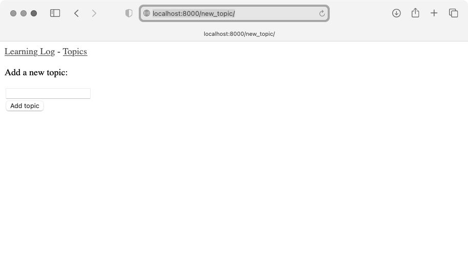
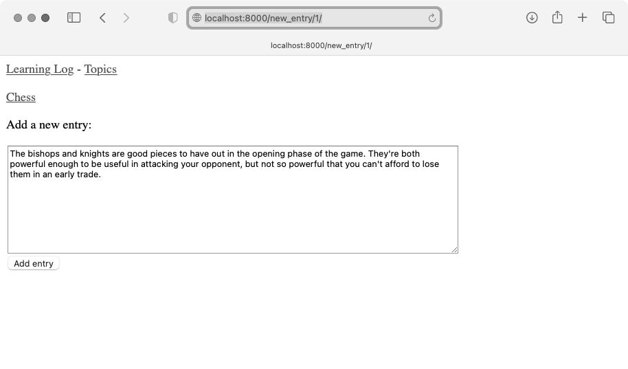
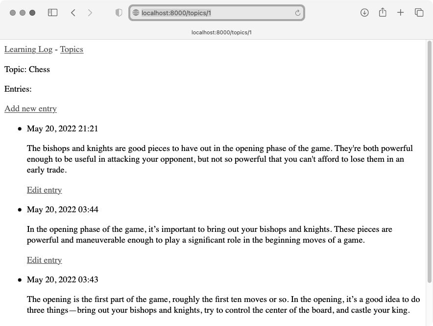
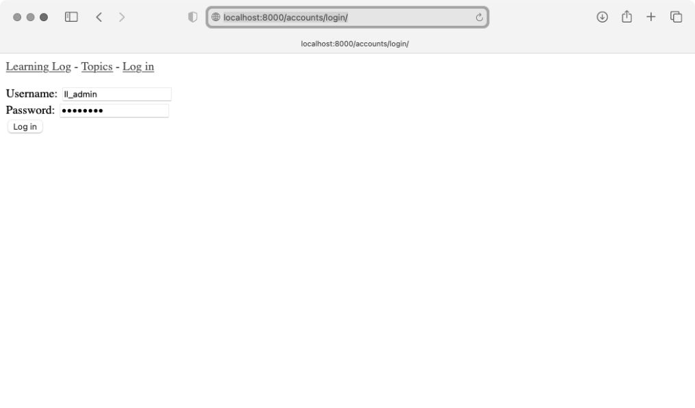

Web 应用程序的核心是让任何地方的任何用户都能够注册账户并使用它。本章将创建一些表单，让用户能够添加主题和条目并编辑既有的条目。你将了解到，Django 能够防范对基于表单的网页发起的常见攻击，让你无须花大量时间考虑应用程序的安全问题。

本章还将实现用户身份验证系统：创建一个注册页面，供用户创建自己的账户，并让一些页面仅供已登录的用户访问；然后修改一些视图函数，使用户只能看到自己的数据。我们还将学习如何确保用户数据的安全。

## 1. 让用户能够输入数据

在建立用于创建用户账户的身份验证系统之前，我们添加几个页面，让用户能够输入数据。用户将能够添加新主题、添加新条目，以及编辑既有的条目。

当前，只有超级用户能够通过管理网站输入数据。我们不想让用户与管理网站交互，因此将使用 Django 的表单创建工具来创建让用户能够输入数据的页面。

### 添加新主题

我们首先让用户能够添加新主题。在创建基于表单的页面时，方法几乎与前面创建网页时一样：定义 URL、编写视图函数、编写模板。一个主要差别是，需要导入包含表单的模块 forms.py。

#### 用于添加主题的表单

让用户输入并提交信息的页面包含名为**表单**（form）的 HTML 元素。当用户输入信息时，需要进行验证，确认他们提供的信息是正确的数据类型并且不是恶意的，如中断服务器的代码。然后，对这些有效信息进行处理，并将其保存到数据库中合适的地方。这些工作很多是由 Django 自动完成的。

在 Django 中，创建表单的最简单的方式是使用 ModelForm，它会根据前面定义的模型中的信息自动创建表单。我们在文件夹 learning_logs 中创建一个名为 forms.py 的文件，将其存储到 models.py 所在的目录中，并在其中编写第一个表单：

```python
  from django import forms

  from .models import Topic

❶ class TopicForm(forms.ModelForm):
      class Meta:
❷         model = Topic
❸         fields = ['text']
❹         labels = {'text': ''}
```

首先，导入模块 forms 以及要使用的模型 Topic。然后，定义一个名为 TopicForm 的类，它继承了 forms.ModelForm（见❶）。

最简单的 ModelForm 版本只包含一个内嵌的 Meta 类，告诉 Django 根据哪个模型创建表单以及在表单中包含哪些字段。这里指定根据模型 Topic 创建表单（见❷），并且其中只包含字段 text（见❸）。字典 labels 中的空字符串告诉 Django 不要为字段 text 生成标签（见❹）。

#### URL模式new_topic

新网页的 URL 应简短且具有描述性，因此在用户要添加新主题时，我们将页面切换到 http://localhost:8000/new_topic/。下面是网页 new_topic 的 URL 模式，请将其添加到 learning_logs/urls.py 中：

```python
--snip--
urlpatterns = [
--snip--
    # 用于添加新主题的网页
    path('new_topic/', views.new_topic, name='new_topic'),
]
```

这个 URL 模式将请求交给视图函数 new_topic()，下面就来编写这个函数。

#### 视图函数new_topic

new_topic() 函数需要处理两种情形：一是刚进入网页 new_topic（在这种情况下应显示空表单）；二是对提交的表单数据进行处理，并将用户重定向到网页 topics。

```python
  from django.shortcuts import render, redirect

  from .models import Topic
  from .forms import TopicForm
--snip--

  def new_topic(request):
      """添加新主题"""
❶     if request.method != 'POST':
          # 未提交数据：创建一个新表单
❷         form = TopicForm()
      else:
          # POST提交的数据：对数据进行处理
❸         form = TopicForm(data=request.POST)
❹         if form.is_valid():
❺             form.save()
❻             return redirect('learning_logs:topics')

      # 显示空表单或指出表单数据无效
❼     context = {'form': form}
      return render(request, 'learning_logs/new_topic.html', context)
```

这里导入了 redirect 函数，用户提交主题后将使用这个函数重定向到网页 topics。我们还导入了刚创建的表单 TopicForm。

#### GET请求和POST请求

在创建应用程序时，两种主要的请求类型是 GET 和 POST。对于只是从服务器读取数据的页面，使用 GET 请求；在用户需要通过表单提交信息时，通常使用 POST 请求。我们在处理所有的表单时，都将指定使用 POST 方法（还有一些其他类型的请求，但这个项目中没有使用）。

函数 new_topic() 将请求对象作为参数。在用户初次请求该网页时，浏览器将发送 GET 请求；在用户填写并提交表单时，浏览器将发送 POST 请求。根据请求的类型，可确定用户请求的是空表单（GET 请求）还是要求对填写好的表单进行处理（POST 请求）。

我们使用 if 测试来确定请求方法是 GET 还是 POST（见❶）。如果请求方法不是 POST，那么请求就可能是 GET，因此需要返回一个空表单（即便请求是其他类型的，返回空表单也不会有任何问题）。我们创建了一个 TopicForm 实例（见❷），将其赋给变量 form，再通过字典 context 将这个表单发送给模板（见❼）。由于在实例化 TopicForm 时没有指定任何实参，Django 将创建一个空表单，供用户填写。

如果请求方法为 POST，将执行 else 代码块，对提交的表单数据进行处理。我们使用用户输入的数据（被赋给了 request.POST）创建一个 TopicForm 实例（见❸），这样，对象 form 将包含用户提交的信息。

要将用户提交的信息保存到数据库中，必须先通过检查确定它们是有效的（见❹）。方法 is_valid() 核实用户填写了所有必不可少的字段（表单字段默认都是必不可少的），而且输入的数据与要求的字段类型一致（例如，字段 text 少于 200 个字符，这是前面在 models.py 中指定的）。这种自动验证避免了我们去做大量的工作。如果所有字段都有效，就可调用 save()（见❺），将表单中的数据写入数据库。

保存数据后，就能离开这个页面了。为此，使用 redirect() 将用户的浏览器重定向到页面 topics（见❻）。在页面 topics 中，用户将在主题列表中看到自己刚输入的主题。函数 redirect() 的作用是，将一个视图作为参数，并将用户重定向到与该视图相关联的网页。

我们在这个视图函数的末尾定义了变量 context，并使用稍后将创建的模板 new_topic.html 来渲染网页。这些代码不在 if 代码块内，因此无论是用户刚进入页面 new_topic 还是提交的表单数据无效，这些代码都将执行。当用户提交的表单数据无效时，将显示一些默认的错误消息，帮助用户提供有效的数据。

#### 模板new_topic

下面来创建新模板 new_topic.html，用于显示刚创建的表单：

```html
  

  
    <p>Add a new topic:</p>

❶   <form action="" method='post'>
❷     
❸     {{ form.as_div }}
❹     <button name="submit">Add topic</button>
    </form>

  
```

这个模板继承了 base.html，因此基本结构与项目「学习笔记」的其他页面相同。我们使用标签 \<form\>\</form\> 定义一个 HTML 表单（见❶）。实参 action 告诉服务器将提交的表单数据发送到哪里，这里会将表单数据发回给视图函数 new_topic()；实参 method 让浏览器以 POST 请求的方式提交数据。

Django 使用模板标签 （见❷）来防止攻击者利用表单来对服务器进行未经授权的访问（这种攻击称为跨站请求伪造）。接下来显示了这个表单，从中可知 Django 让完成显示表单等任务变得有多简单：只需包含模板变量 {{ form.as_div }}（见❸），就可让 Django 自动创建显示表单所需的全部字段。修饰符 as_div 让 Django 将所有表单元素都渲染为 HTML \<div\>\</div\> 元素，这是一种整洁地显示表单的简单方式。

Django 不会为表单创建提交按钮，因此我们在表单末尾定义了一个（见❹）。

#### 链接到页面new_topic

下面在页面 topics 中添加页面 new_topic 的链接：

```html




  <p>Topics</p>

  <ul>
--snip--
  </ul>

  <a href="">Add a new topic</a>


```

这个链接放在既有主题列表的后面。图 19-1 显示了生成的表单，可以尝试使用它来添加几个新主题。



### 添加新条目

添加新主题之后，用户还会想添加新条目。我们将再次定义 URL、编写视图函数和模板，并链接到添加新条目的网页。但在此之前，需要在 forms.py 中再添加一个类。

#### 用于添加新条目的表单

我们需要创建一个与模型 Entry 相关联的表单，这个表单的定制程度比 TopicForm 更高一些：

```python
  from django import forms

  from .models import Topic, Entry

  class TopicForm(forms.ModelForm):
  --snip--

  class EntryForm(forms.ModelForm):
      class Meta:
          model = Entry
          fields = ['text']
❶         labels = {'text': ''}
❷         widgets = {'text': forms.Textarea(attrs={'cols': 80})}
```

首先修改 import 语句，使其除了导入 Topic 外，还导入 Entry。新类 EntryForm 继承了 forms.ModelForm，它包含的 Meta 类指出了表单基于哪个模型以及要在表单中包含哪些字段。这里给字段 text 指定了一个空白标签（见❶）。

对于 EntryForm，我们添加了属性 widgets（见❷）。**小部件**（widget）是一种 HTML 表单元素，如单行文本框、多行文本区域或下拉列表。通过设置属性 widgets，可覆盖 Django 选择的默认小部件。这里让 Django 使用宽度为 80 列（而不是默认的 40 列）的 forms.Textarea 元素，这给用户编写有意义的条目提供了足够的空间。

#### URL模式new_entry

在用于添加新条目的页面的 URL 模式中，需要包含实参 topic_id，因为条目必须与特定的主题相关联。将该 URL 模式添加到 learning_logs/urls.py 中：

```python
--snip--
urlpatterns = [
--snip--
    # 用于添加新条目的页面
    path('new_entry/<int:topic_id>/', views.new_entry, name='new_entry'),
]
```

这个 URL 模式与形如 http://localhost:8000/new_entry/id/ 的 URL 匹配，其中的 id 是一个与主题 ID 匹配的数。代码 \<int:topic_id\> 捕获一个数值，并将其赋给变量 topic_id。当请求的 URL 与这个模式匹配时，Django 会将请求和主题 ID 发送给函数 new_entry()。

#### 视图函数new_entry

视图函数 new_entry() 与 new_topic() 函数很像。在 views.py 中添加如下代码：

```python
  from django.shortcuts import render, redirect

  from .models import Topic
  from .forms import TopicForm, EntryForm
--snip--

  def new_entry(request, topic_id):
      """在特定主题中添加新条目"""
❶     topic = Topic.objects.get(id=topic_id)

❷     if request.method != 'POST':
          # 未提交数据：创建一个空表单
❸         form = EntryForm()
      else:
          # POST提交的数据：对数据进行处理
❹         form = EntryForm(data=request.POST)
          if form.is_valid():
❺             new_entry = form.save(commit=False)
❻             new_entry.topic = topic
              new_entry.save()
❼             return redirect('learning_logs:topic', topic_id=topic_id)

      # 显示空表单或指出表单数据无效
      context = {'topic': topic, 'form': form}
      return render(request, 'learning_logs/new_entry.html', context)
```

我们修改 import 语句，在其中包含了刚创建的 EntryForm。new_entry() 的定义包含形参 topic_id，用于存储从 URL 中获得的值。在渲染页面和处理表单数据时，都需要知道针对的是哪个主题，因此使用 topic_id 来获得正确的主题（见❶）。

接下来，检查请求方法是 POST 还是 GET（见❷）。如果是 GET 请求，就执行 if 代码块，创建一个空的 EntryForm 实例（见❸）。

如果请求方法是 POST，就对数据进行处理：先创建一个 EntryForm 实例，使用 request 对象中的 POST 数据来填充它（见❹）；再检查表单是否有效；如果有效，就设置条目对象的属性 topic，然后将条目对象保存到数据库中。

在调用 save() 时，传递实参 commit=False（见❺），让 Django 创建一个新的条目对象，并将其赋给 new_entry，但不保存到数据库中。将 new_entry 的属性 topic 设置在这个函数开头从数据库中获取的主题（见❻），再调用 save() 且不指定任何实参。这将把条目保存到数据库中，并将其与正确的主题相关联。

redirect() 要求提供两个参数：要重定向到的视图，以及要给视图函数提供的参数（见❼）。这里重定向到 topic()，而这个视图函数需要参数 topic_id。视图函数 topic() 渲染新增条目所属主题的页面，其中的条目列表包含新增的条目。

在视图函数 new_entry() 的末尾，创建一个上下文字典，并使用模板 new_entry.html 渲染网页。这些代码将在表单为空或提交的表单数据无效时执行。

#### 模板new_entry

模板 new_entry 类似于模板 new_topic，如下面的代码所示：

```html
  

  

❶   <p><a href="">{{ topic }}</a></p>

    <p>Add a new entry:</p>
❷   <form action="" method='post'>
      
      {{ form.as_div }}
      <button name='submit'>Add entry</button>
    </form>

  
```

我们在页面顶端显示了主题（见❶），让用户知道自己是在哪个主题中添加了条目。该主题名也是一个链接，单击后可返回该主题的主页面。

表单的实参 action 包含 URL 中的 topic.id 值，让视图函数能够将新条目关联到正确的主题（见❷）。除此之外，这个模板与模板 new_topic.html 完全相同。

#### 链接到页面new_entry

接下来，需要在显示特定主题的页面中添加页面 new_entry 的链接：

```html




  <p>Topic: {{ topic }}</p>

  <p>Entries:</p>
  <p>
    <a href="">Add new entry</a>
  </p>

  <ul>
--snip--
  </ul>


```

我们将这个链接放在了条目列表的前面，因为在这种页面中，最常见的操作是添加新条目。图 19-2 显示了页面 new_entry。现在用户不仅可以添加新主题，还能在每个主题中添加任意数量的条目。



### 编辑条目

下面创建让用户编辑既有条目的页面。

#### URL模式edit_entry

这个页面的 URL 需要传递要编辑的条目的 ID。learning_logs/urls.py 如下：

```python
--snip--
urlpatterns = [
--snip--
    # 用于编辑条目的页面
    path('edit_entry/<int:entry_id>/', views.edit_entry, name='edit_entry'),
]
```

这个 URL 模式与形如 http://localhost:8000/edit_entry/id/ 的 URL 匹配，其中的 id 值将被赋给形参 entry_id。Django 将与这个 URL 模式匹配的请求发送给视图函数 edit_entry()。

#### 视图函数edit_entry

当页面 edit_entry 收到 GET 请求时，edit_entry() 将返回一个表单，让用户能够对既有的条目进行编辑；当收到 POST 请求（条目文本经过修订）时，则将修改后的文本保存到数据库中：

```python
  from django.shortcuts import render, redirect

  from .models import Topic, Entry
  from .forms import TopicForm, EntryForm
--snip--

  def edit_entry(request, entry_id):
      """编辑既有的条目"""
❶     entry = Entry.objects.get(id=entry_id)
      topic = entry.topic

      if request.method != 'POST':
          # 初次请求：使用当前的条目填充表单
❷         form = EntryForm(instance=entry)
      else:
          # POST提交的数据：对数据进行处理
❸         form = EntryForm(instance=entry, data=request.POST)
          if form.is_valid():
❹             form.save()
❺             return redirect('learning_logs:topic', topic_id=topic.id)

      context = {'entry': entry, 'topic': topic, 'form': form}
      return render(request, 'learning_logs/edit_entry.html', context)
```

首先，导入模型 Entry。然后，获取用户要修改的条目对象（见❶）以及与其相关联的主题。在当请求方法为 GET 时将执行的 if 代码块中，使用实参 instance=entry 创建一个 EntryForm 实例（见❷）。这个实参让 Django 创建一个表单，并使用既有条目对象中的信息填充它——用户将看到既有的数据，并且能够进行编辑。

在处理 POST 请求时，传递实参 instance=entry 和 data=request.POST（见❸），让 Django 根据既有条目对象创建一个表单实例，并根据 request.POST 中的相关数据对其进行修改。然后，检查表单是否有效。如果表单有效，就调用 save() 且不指定任何实参（见❹），因为条目已关联到了特定的主题。最后，重定向到显示条目所属主题的页面（见❺），用户将在其中看到自己编辑的条目的新版本。

如果要显示表单来让用户编辑条目，或者用户提交的表单无效，就创建上下文字典并使用模板 edit_entry.html 渲染网页。

#### 模板edit_entry

下面来创建模板 edit_entry.html，它与模板 new_entry.html 类似：

```html
  

  

    <p><a href="">{{ topic }}</a></p>

    <p>Edit entry:</p>

❶   <form action="" method='post'>
      
      {{ form.as_div }}
❷     <button name="submit">Save changes</button>
    </form>

  
```

实参 action 将表单发送给函数 edit_entry() 进行处理（见❶）。在标签  中，将 entry.id 作为一个实参，让视图函数 edit_entry() 能够修改正确的条目对象。我们将提交按钮的标签设置成了 Save changes（见❷），旨在提醒用户：单击该按钮将保存所做的编辑，而不是创建一个新条目。

#### 链接到页面edit_entry

现在，在显示特定主题的页面中，需要给每个条目添加页面 edit_entry 的链接：

```html
--snip--
    
      <li>
        <p>{{ entry.date_added|date:'M d, Y H:i' }}</p>
        <p>{{ entry.text|linebreaks }}</p>
        <p>
          <a href="">
            Edit entry</a></p>
      </li>
--snip--
```

我们将编辑链接放在了每个条目的日期和文本后面。在循环中，使用模板标签  根据 URL 模式 edit_entry 和当前条目的 ID 属性（entry.id）来确定 URL。链接文本为 Edit entry，它出现在页面中每个条目的后面。图 19-3 显示了在包含这些链接时，显示特定主题的页面是什么样的。



至此，「学习笔记」已经具备了所需的大部分功能。用户不仅可以添加主题和条目，还能根据需要查看任意条目。下一节将实现用户注册系统，让任何人都可以申请「学习笔记」的账户，并创建自己的主题和条目。

## 2. 创建用户账户

本节将建立用户注册和身份验证系统，让用户能够注册账户、登录和注销。为此，我们将新建一个应用程序，其中包含与处理用户账户相关的所有功能。这个应用程序将尽可能使用 Django 自带的用户身份验证系统来完成工作。本节还将对模型 Topic 稍作修改，让每个主题都归属于特定的用户。

### 应用程序accounts

首先使用命令 startapp 创建一个名为 accounts 的应用程序：

```
  (ll_env)learning_log$ python manage.py startapp accounts
  (ll_env)learning_log$ ls
❶ accounts db.sqlite3 learning_logs ll_env ll_project manage.py
  (ll_env)learning_log$ ls accounts
❷ __init__.py admin.py apps.py migrations models.py tests.py views.py
```

因为默认的身份验证系统是围绕着**用户账户**（user account）的概念建立的，所以使用名称 accounts 可简化我们与这个默认系统集成的工作。这里的 startapp 命令新建目录 accounts（见❶），该目录的结构与应用程序 learning_logs 相同（见❷）。

### 将应用程序accounts添加到settings.py中

在 settings.py 中，需要将这个新的应用程序添加到 INSTALLED_APPS 中，如下所示：

```python
--snip--
INSTALLED_APPS = [
    # 我的应用程序
    'learning_logs',
    'accounts',

    # Django默认创建的应用程序
--snip--
]
--snip--
```

这样，Django 将把应用程序 accounts 包含到项目中。

### 包含应用程序accounts的URL

接下来，需要修改项目根目录中的 urls.py，使其包含将为应用程序 accounts 定义的 URL：

```python
from django.contrib import admin
from django.urls import path, include

urlpatterns = [
    path('admin/', admin.site.urls),
    path('accounts/', include('accounts.urls')),
    path('', include('learning_logs.urls')),
]
```

这里添加一行代码以包含应用程序 accounts 中的文件 urls.py。这行代码与所有以单词 accounts 打头的 URL（如 http://localhost:8000/accounts/login/）都匹配。

### 登录页面

首先使用 Django 提供的默认视图 login 来实现登录页面，因此这个应用程序的 URL 模式稍有不同。在目录 learning_log/accounts/ 中，新建一个名为 urls.py 的文件，并在其中添加如下代码：

```python
"""为应用程序accounts定义URL模式"""

from django.urls import path, include

app_name = 'accounts'
urlpatterns = [
    # 包含默认的身份验证URL
    path('', include('django.contrib.auth.urls')),
]
```

我们导入函数 path 和函数 include，以便能够包含 Django 定义的一些默认的身份验证 URL。这些默认的 URL 包含具名的 URL 模式，如 'login' 和 'logout'。将变量 app_name 设置成 'accounts'，让 Django 能够将这些 URL 与其他应用程序的 URL 区分开来。即便是 Django 提供的默认 URL，将其写入应用程序 accounts 的文件后，也可通过命名空间 accounts 进行访问。

登录页面的 URL 模式与 URL http://localhost:8000/accounts/login/ 匹配。这个 URL 中的单词 accounts 让 Django 在 accounts/urls.py 中查找，而单词 login 则让它将请求发送给 Django 的默认视图 login。

#### 模板login.html

当用户请求登录页面时，Django 将使用一个默认的视图函数，但我们依然需要为这个页面提供模板。默认的身份验证视图在文件夹 registration 中查找模板，因此我们需要创建这个文件夹。为此，在目录 ll_project/accounts/ 中新建一个名为 templates 的目录，再在这个目录中新建一个名为 registration 的目录。下面是模板 login.html，应将其存储到目录 ll_project/accounts/templates/registration 中：

```html
  

  

❶   
      <p>Your username and password didn't match. Please try again.</p>
    

❷   <form action="" method='post'>
      
❸     {{ form.as_div }}

❹     <button name="submit">Log in</button>
    </form>

  
```

这个模板继承了 base.html，旨在确保登录页面的外观与网站的其他页面相同。请注意，一个应用程序中的模板可继承另一个应用程序中的模板。

如果表单的 errors 属性已设置，就显示一条错误消息（见❶），指出输入的用户名密码对与数据库中存储的任何用户名密码对都不匹配。

我们要让登录视图对表单进行处理，因此将实参 action 设置为登录页面的 URL（见❷）。登录视图将一个 form 对象发送给模板，在模板中，我们显示这个表单（见❸）并添加一个提交按钮（见❹）。

#### 设置LOGIN_REDIRECT_URL

用户成功登录后，Django 需要知道应该将用户重定向到哪里。我们在设置文件中指定这一点。为此，在文件夹 ll_project 中的文件 settings.py 的末尾添加如下代码：

```python
--snip--
# 我的设置
LOGIN_REDIRECT_URL = 'learning_logs:index'
```

文件 settings.py 包含一些默认设置，在下面划出一块地方来添加新设置很有帮助。我们添加的第一个新设置是 LOGIN_REDIRECT_URL，它告诉 Django 在用户成功登录后将其重定向到哪个 URL。

#### 链接到登录页面

下面在 base.html 中添加登录页面的链接，让所有页面都包含它。在用户已登录时，我们不想显示这个链接，因此将它嵌套在一个  标签中：

```html
  <p>
    <a href="">Learning Log</a> -
    <a href="">Topics</a> -
❶   
❷     Hello, {{ user.username }}.
    
❸     <a href="">Log in</a>
    
  </p>

  
```

在 Django 的身份验证系统中，每个模板都可以使用对象 user。这个对象有一个 is_authenticated 属性：如果用户已登录，该属性为 True，否则为 False。这让你能够向已通过身份验证的用户显示一条消息，向未通过身份验证的用户显示另一条消息。

这里向已登录的用户显示问候语（见❶）。对于已通过身份验证的用户，我们还设置了属性 username，这里使用这个属性来个性化问候语，让用户知道自己已登录（见❷）。对于尚未通过身份验证的用户，则显示登录页面的链接（见❸）。

#### 使用登录页面

前面建立了一个用户账户，下面来进行登录，看看登录页面是否管用。首先访问 http://localhost:8000/admin/，如果你已经以管理员的身份登录了，请在页眉上找到注销链接并单击它。

注销后，访问 http://localhost:8000/accounts/login/，可以看到图 19-4 所示的登录页面。输入前面设置的用户名和密码，将进入主页。在这个主页的页眉中，显示了一条个性化问候语，其中包含用户名。



### 注销

现在需要提供一个让用户注销的途径。注销请求应以 POST 请求的方式提交，因此我们将在 base.html 中添加一个小型的注销表单。用户在单击注销按钮时，将进入一个确认自己已注销的页面。

#### 在base.html中添加注销表单

下面在 base.html 中添加注销表单，让每个页面都包含它。将注销表单放在一个 if 代码块中，使得只有已登录的用户才能看到它：

```html
--snip--
  

  
❶   <hr />
❷   <form action="" method='post'>
      
      <button name='submit'>Log out</button>
    </form>
  
```

默认的注销 URL 模式为 'accounts/logout'。然而，注销请求必须以 POST 请求的方式发送，否则攻击者将能够轻松地发送注销请求。为了让注销请求使用 POST 方法，我们定义一个简单的表单。

将这个表单放在页面底部一个水平线元素（\<hr /\>）的后面（见❶），这是一种确保登录按钮总是位于页面中其他内容后面的简单方式。在定义这个表单时，将实参 action 设置成注销 URL，并将请求方法设置成 'post'（见❷）。在 Django 中，每个表单都必须包含 ，即便它像这里的表单一样简单也是如此。这个表单只包含一个提交按钮，没有其他内容。

#### 设置LOGOUT_REDIRECT_URL

用户单击注销按钮后，Django 需要知道应该将用户重定向到哪里。我们使用 settings.py 来控制这一点：

```python
--snip--
# 我的设置
LOGIN_REDIRECT_URL = 'learning_logs:index'
LOGOUT_REDIRECT_URL = 'learning_logs:index'
```

这里的设置 LOGOUT_REDIRECT_URL 让 Django 将已注销的用户重定向到主页。这是一种确认用户已注销的简单方式，因为用户注销后，将不再能在页面中看到自己的用户名。

### 注册页面

下面来创建一个让新用户能够注册的页面。我们将使用 Django 提供的表单 UserCreationForm，但是编写自己的视图函数和模板。

#### 注册页面的URL模式

下面的代码定义了注册页面的 URL 模式，应将其放在 accounts/urls.py 中：

```python
"""为应用程序accounts定义URL模式"""

from django.urls import path, include

from . import views

app_name = 'accounts'
urlpatterns = [
    # 包含默认的身份验证URL
    path('', include('django.contrib.auth.urls')),
    # 注册页面
    path('register/', views.register, name='register'),
]
```

我们从 accounts 中导入了模块 views。为何需要这样做呢？因为我们将为注册页面编写视图函数。注册页面的 URL 模式与 URL http://localhost:8000/accounts/register/ 匹配，并将请求发送给即将编写的 register() 函数。

#### 视图函数register

在注册页面被首次请求时，视图函数 register() 需要显示一个空的注册表单，并在用户提交填写好的注册表单时对其进行处理。如果注册成功，这个函数还需要让用户自动登录。在 accounts/views.py 中添加如下代码：

```python
  from django.shortcuts import render, redirect
  from django.contrib.auth import login
  from django.contrib.auth.forms import UserCreationForm

  def register(request):
      """注册新用户"""
      if request.method != 'POST':
          # 显示空的注册表单
❶         form = UserCreationForm()
      else:
          # 处理填写好的表单
❷         form = UserCreationForm(data=request.POST)

❸         if form.is_valid():
❹             new_user = form.save()
              # 让用户自动登录，再重定向到主页
❺             login(request, new_user)
❻             return redirect('learning_logs:index')

      # 显示空表单或指出表单无效
      context = {'form': form}
      return render(request, 'registration/register.html', context)
```

首先导入 render() 函数和 redirect() 函数，然后导入 login() 函数，以便在用户正确地填写了注册信息时让其自动登录，还要导入默认表单 UserCreationForm。在 register() 函数中，检查要响应的是否是 POST 请求。如果不是，就创建一个 UserCreationForm 实例，并且不给它提供任何初始数据（见❶）。

如果响应的是 POST 请求，就根据提交的数据创建一个 UserCreationForm 实例（见❷），并且检查这些数据是否有效（见❸）。这里的有效是指，用户名未包含非法字符，输入的两个密码相同，以及用户没有试图做恶意的事情。

如果提交的数据有效，就调用表单的 save() 方法，将用户名和密码的哈希值保存到数据库中（见❹）。方法 save() 返回新创建的用户对象，我们将它赋给 new_user。保存用户的信息后，调用函数 login() 并传入对象 request 和 new_user（见❺），为用户创建有效的会话，从而让其自动登录。最后，将用户重定向到主页（见❻），主页页眉中显示的个性化问候语会让用户知道注册成功了。

在这个函数的末尾，我们渲染了注册页面，它要么显示一个空表单，要么显示提交的无效表单。

#### 注册模板

下面来创建注册页面模板，它与登录页面的模板类似。务必将其保存到 login.html 所在的目录中：

```html




  <form action="" method='post'>
    
    {{ form.as_div }}

    <button name="submit">Register</button>
  </form>


```

这个模板与前面基于表单的其他模板类似。这里也使用了方法 as_div，让 Django 在表单中正确地显示所有的字段，包括错误消息（如果用户没有正确地填写表单）。

#### 链接到注册页面

下面来添加一些代码，在用户没有登录时显示注册页面的链接：

```html
--snip--
  
    Hello, {{ user.username }}.
  
    <a href="">Register</a> -
    <a href="">Log in</a>
  
--snip--
```

现在，已登录的用户看到的是个性化的问候语和注销按钮，而未登录的用户看到的是注册链接和登录链接。请尝试使用注册页面创建几个用户名各不相同的用户账户。

下一节会将一些页面限制为仅让已登录的用户访问，还将确保每个主题都归属于特定的用户。

注意：这里的注册系统允许任意用户创建任意数量的账户。有些系统要求用户确认身份：先发送一封确认邮件，在用户回复后才让其账户生效。比起本节的简单系统，这样的系统生成的垃圾账户将少得多。然而，在学习创建应用程序时，完全可以像这里所做的一样，使用简单的用户注册系统。

## 3. 让用户拥有自己的数据

用户应该能够在学习笔记中输入私有数据，因此我们将创建一个系统，先确定各项数据所属的用户，再限制用户对页面的访问，让他们只能使用自己的数据。

本节将修改模型 Topic，让每个主题都归属于特定的用户。这也将影响条目，因为每个条目都属于特定的主题。我们先来限制对一些页面的访问。

### 使用@login_required限制访问

Django 提供了装饰器 @login_required，有助于轻松地限制对某些页面的访问。前面介绍过，装饰器是放在函数定义前面的指令，用于改变函数的行为。

#### 限制对页面的访问

每个主题都归属于特定的用户，因此应只允许已登录的用户请求页面 topics。为此，在 learning_logs/views.py 中添加如下代码：

```python
from django.shortcuts import render, redirect
from django.contrib.auth.decorators import login_required

from .models import Topic, Entry
--snip--

@login_required
def topics(request):
    """显示所有的主题"""
--snip--
```

首先导入 login_required() 函数。将 login_required() 作为装饰器应用于视图函数 topics()——在它前面加上符号 @，让 Python 在运行 topics() 的代码之前运行 login_required() 的代码。login_required() 的代码检查用户是否已登录：仅当用户已登录时，Django 才运行 topics() 的代码；如果用户未登录，就重定向到登录页面。

为了实现这种重定向，需要修改 settings.py，让 Django 知道到哪里去查找登录页面。我们在 settings.py 末尾添加如下代码：

```python
--snip--
# 我的设置
LOGIN_REDIRECT_URL = 'learning_logs:index'
LOGOUT_REDIRECT_URL = 'learning_logs:index'
LOGIN_URL = 'accounts:login'
```

现在，如果未登录的用户请求装饰器 @login_required 保护的页面，Django 将重定向到 settings.py 中的 LOGIN_URL 指定的 URL。

要测试这个设置，可注销并进入主页，再单击链接 Topics，这将重定向到登录页面。然后，使用你的账户登录，并再次单击主页中的 Topics 链接，你将看到页面 topics。

#### 全面限制对项目「学习笔记」的访问

Django 能够让我们轻松地限制对页面的访问，但是我们必须确定要保护哪些页面。最好先确定项目的哪些页面不需要保护，再限制对其他所有页面的访问。我们可以轻松地修改过于严格的访问限制，这比不限制对敏感页面的访问风险更低。

在项目「学习笔记」中，我们将不限制对主页和注册页面的访问，并限制对其他所有页面的访问。在下面的 learning_logs/views.py 中，对除了 index() 以外的视图都应用装饰器 @login_required：

```python
--snip--
@login_required
def topics(request):
--snip--

@login_required
def topic(request, topic_id):
--snip--

@login_required
def new_topic(request):
--snip--

@login_required
def new_entry(request, topic_id):
--snip--

@login_required
def edit_entry(request, entry_id):
--snip--
```

如果用户在未登录的情况下尝试访问这些页面，将被重定向到登录页面。另外，未登录的用户无法单击 new_topic 等页面的链接。如果用户输入 URL http://localhost:8000/new_topic/，将被重定向到登录页面。对于所有与私有用户数据相关的 URL，都应限制访问。

### 将数据关联到用户

现在，需要将数据关联到提交它们的用户。只需将最高层的数据关联到用户，低层的数据也将自动关联到该用户。在项目「学习笔记」中，应用程序的最高层数据是主题，所有条目都与特定的主题相关联。只要每个主题都归属于特定的用户，就能确定数据库中每个条目的所有者。

下面来修改模型 Topic，在其中添加一个关联到用户的外键。这样做之后，必须对数据库进行迁移。最后，必须对一些视图进行修改，使其只显示与当前登录的用户相关联的数据。

#### 修改模型Topic

对文件夹 learning_logs 中的 models.py 的修改只涉及两行代码：

```python
from django.db import models
from django.contrib.auth.models import User

class Topic(models.Model):
    """用户学习的主题"""
    text = models.CharField(max_length=200)
    date_added = models.DateTimeField(auto_now_add=True)
    owner = models.ForeignKey(User, on_delete=models.CASCADE)

    def __str__(self):
        """返回模型的字符串表示"""
        return self.text

class Entry(models.Model):
--snip--
```

首先导入 django.contrib.auth 中的模型 User，然后在 Topic 中添加字段 owner，它会建立到模型 User 的外键关系。当用户被删除时，所有与之相关联的主题也会被删除。

#### 确定当前有哪些用户

在迁移数据库时，Django 会对数据库进行修改，使其能够存储主题和用户之间的关联。为执行迁移，Django 需要知道该将各个既有主题关联到哪个用户。最简单的办法是，将所有既有主题都关联到同一个用户，如超级用户。为此，需要知道该用户的 ID。

下面查看已创建的所有用户的 ID。为此，启动一个 Django shell 会话，并执行如下命令：

```
  (ll_env)learning_log manage.py shell
❶ >>> from django.contrib.auth.models import User
❷ >>> User.objects.all()
  <QuerySet [<User: ll_admin>, <User: eric>, <User: willie>]>
❸ >>> for user in User.objects.all():
  ...     print(user.username, user.id)
  ...
  ll_admin 1
  eric 2
  willie 3
  >>>
```

首先，在 shell 会话中导入模型 User（见❶）。然后，查看到目前为止都创建了哪些用户（见❷）。输出中列出了三个用户：ll_admin、eric 和 willie。接下来，遍历用户列表并打印每个用户的用户名和 ID（见❸）。当 Django 询问要将既有主题关联到哪个用户时，我们将指定其中一个 ID 值。

#### 迁移数据库

知道用户 ID 后，就可迁移数据库了。在这样做时，Python 将询问是要暂时将模型 Topic 关联到特定的用户，还是在文件 models.py 中指定默认用户。请选择第一个选项。

```
❶ (ll_env)learning_log$ python manage.py makemigrations learning_logs
❷ It is impossible to add a non-nullable field 'owner' to topic without
  specifying a default. This is because...
❸ Please select a fix:
   1) Provide a one-off default now (will be set on all existing rows with a
      null value for this column)
   2) Quit and manually define a default value in models.py.
❹ Select an option: 1
❺ Please enter the default value now, as valid Python
  The datetime and django.utils.timezone modules are available...
  Type 'exit' to exit this prompt
❻ >>> 1
  Migrations for 'learning_logs':
    learning_logs/migrations/0003_topic_owner.py
  - Add field owner to topic
  (ll_env)learning_log$
```

首先执行命令 makemigrations（见❶）。在输出中，Django 指出我们在试图给既有模型 Topic 添加一个必不可少（不可为空）的字段，而该字段没有默认值（见❷）。Django 提供了两种选择：要么现在提供默认值，要么退出并在 models.py 中添加默认值（见❸）。

这里选择了第一个选项（见❹），因此 Django 让我们输入默认值（见❺）。为了将所有既有主题都关联到管理用户 ll_admin，输入用户 ID 值 1（见❻）。可以使用已创建的任意用户的 ID，并非必须是超级用户。接下来，Django 使用这个值来迁移数据库，并生成了迁移文件 0003_topic_owner.py，它在模型 Topic 中添加字段 owner。

现在可以执行迁移了。在活动的虚拟环境中执行如下命令：

```
  (ll_env)learning_log$ python manage.py migrate
  Operations to perform:
    Apply all migrations: admin, auth, contenttypes, learning_logs, sessions
  Running migrations:
❶   Applying learning_logs.0003_topic_owner... OK
  (ll_env)learning_log$
```

Django 应用新的迁移，结果一切正常（见❶）。

为了验证迁移符合预期，可在 shell 会话中这样做：

```python
>>> from learning_logs.models import Topic
>>> for topic in Topic.objects.all():
...     print(topic, topic.owner)
...
Chess ll_admin
Rock Climbing ll_admin
>>>
```

首先，从 learning_logs.models 中导入 Topic，然后遍历所有的主题，并打印每个主题及其所属的用户。如你所见，现在每个主题都属于用户 ll_admin。如果你在运行这些代码时出错，请尝试退出并重启 shell。

注意：也可不迁移数据库，而是简单地重置它，但此时既有的数据都将丢失。学习如何在迁移数据库的同时确保用户数据的完整性很重要。如果确实想要一个全新的数据库，可执行命令 python manage.py flush，这将重建数据库的结构。如果这样做，就必须重新创建超级用户，而且原来的所有数据都将丢失。

### 只允许用户访问自己的主题

当前，不管以哪个用户的身份登录，都能够看到所有的主题。下面将改变这一点，只向用户显示属于其自己的主题。

在 views.py 中，对函数 topics() 做如下修改：

```python
--snip--
@login_required
def topics(request):
    """显示所有的主题"""
    topics = Topic.objects.filter(owner=request.user).order_by('date_added')
    context = {'topics': topics}
    return render(request, 'learning_logs/topics.html', context)
--snip--
```

用户登录后，对象 request 将有一个属性集 user，其中包含有关该用户的信息。查询 Topic.objects.filter(owner=request.user) 让 Django 只从数据库中获取 owner 属性为当前用户的 Topic 对象。由于没有修改主题的显示方式，因此无须对页面 topics 的模板做任何修改。

要查看结果，可以以所有既有主题关联到的用户的身份登录，并访问页面 topics，应该能看到所有的主题。然后，注销并以另一个用户的身份登录，应该会看到消息 No topics have been added yet.。

### 保护用户的主题

我们还没有限制对显示单个主题的页面的访问，因此任何已登录的用户都可输入形如 http://localhost:8000/topics/1/ 的 URL，来访问显示相应主题的页面。

请你自己试一试。以拥有所有主题的用户的身份登录，访问特定的主题，并复制该页面的 URL 或将其中的 ID 记录下来。然后，注销并以另一个用户的身份登录，再输入显示前述主题的页面的 URL。虽然你是作为另一个用户登录的，但依然能够查看该主题中的条目。

为了修复这个问题，我们在视图函数 topic() 获取请求的条目之前执行检查：

```python
  from django.shortcuts import render, redirect
  from django.contrib.auth.decorators import login_required
❶ from django.http import Http404
--snip--

  @login_required
  def topic(request, topic_id):
      """显示单个主题及其所有的条目"""
      topic = Topic.objects.get(id=topic_id)

      # 确认请求的主题属于当前用户
❷     if topic.owner != request.user:
          raise Http404

      entries = topic.entry_set.order_by('-date_added')
      context = {'topic': topic, 'entries': entries}
      return render(request, 'learning_logs/topic.html', context)
--snip--
```

当服务器上没有被请求的资源时，标准的做法是返回 404 响应。这里导入异常 Http404（见❶），并在用户请求无权访问的主题时引发这个异常。收到主题请求后，在渲染网页前检查该主题是否属于当前登录的用户。如果请求的主题不归当前用户所有，就引发异常 Http404（见❷），让 Django 返回一个 404 错误页面。

现在，如果你试图查看其他用户的主题的条目，将看到 Django 发送的消息 Page Not Found。部署项目时将对这个项目进行配置，让用户看到更合适的错误页面（而不是调试页面）。

### 保护页面edit_entry

页面 edit_entry 的 URL 形如 http://localhost:8000/edit_entry/entry_id/，其中 entry_id 是一个数。下面来保护这种页面，禁止用户通过输入这样的 URL 来访问其他用户的条目：

```python
--snip--
@login_required
def edit_entry(request, entry_id):
    """编辑既有的条目"""
    entry = Entry.objects.get(id=entry_id)
    topic = entry.topic

    if topic.owner != request.user:
        raise Http404

    if request.method != 'POST':
--snip--
```

首先获取指定的条目以及与之相关联的主题，再检查主题的所有者是否是当前登录的用户。如果不是，就引发 Http404 异常。

### 将新主题关联到当前用户

当前，用于添加新主题的页面存在问题——没有将新主题关联到特定的用户。如果用户尝试添加新主题，将看到错误消息 IntegrityError，指出 NOT NULL constraint failed: learning_logs_topic.owner_id（learning_logs_topic.owner 不能为 NULL）。Django 的意思是说，在创建新主题时，必须给字段 owner 指定值。

由于可以通过 request 对象获悉当前的用户，因此有一个修复该问题的简单方案。添加如下代码，将新主题关联到当前用户：

```python
--snip--
  @login_required
  def new_topic(request):
  --snip--
      else:
          # POST提交的数据：对数据进行处理
          form = TopicForm(data=request.POST)
          if form.is_valid():
❶             new_topic = form.save(commit=False)
❷             new_topic.owner = request.user
❸             new_topic.save()
              return redirect('learning_logs:topics')

      # 显示一个空表单或指出表单无效
      context = {'form': form}
      return render(request, 'learning_logs/new_topic.html', context)
--snip--
```

首先调用 form.save() 并传递实参 commit=False（见❶），因为要先修改新主题，再将其保存到数据库中。接下来，将新主题的属性 owner 设置为当前用户（见❷）。最后，对刚定义的主题实例调用 save()（见❸）。现在，主题包含所有必不可少的数据，将被成功地保存。

这个项目现在允许任意用户注册了，而且每个用户想添加多少新主题都可以。每个用户都只能访问自己的数据，无论在查看数据、输入新数据还是修改旧数据时都如此。

## 4. 小结

在本章中，你学习了如何使用表单来让用户添加新主题、添加新条目，以及编辑既有条目；接着学习了如何实现用户账户，既让老用户能够登录和注销，也能使用 Django 提供的表单 UserCreationForm 让用户创建新账户。

建立简单的用户身份验证和注册系统后，你通过装饰器 @login_required 禁止了未登录的用户访问特定的页面；然后使用外键将数据关联到特定的用户，还迁移了要求指定默认数据的数据库；最后，你学习了如何修改视图函数，让用户只能看到属于自己的数据：使用方法 filter() 来获取合适的数据，并且将请求的数据的所有者与当前登录的用户进行了比较。

该让哪些数据可随便访问，又该对哪些数据进行保护呢？这可能并非总是那么显而易见的，但是通过不断地练习就能掌握这种技能。本章针对保护用户数据所做的决策表明，与他人合作开发项目是个不错的主意：让其他人对项目进行检查，更容易发现其薄弱环节。
