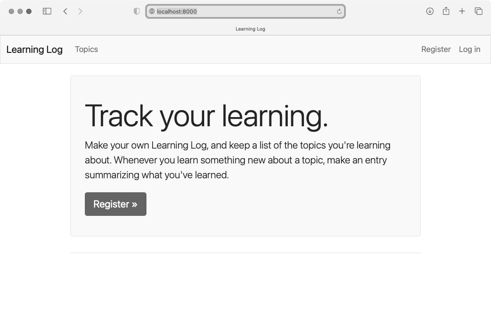
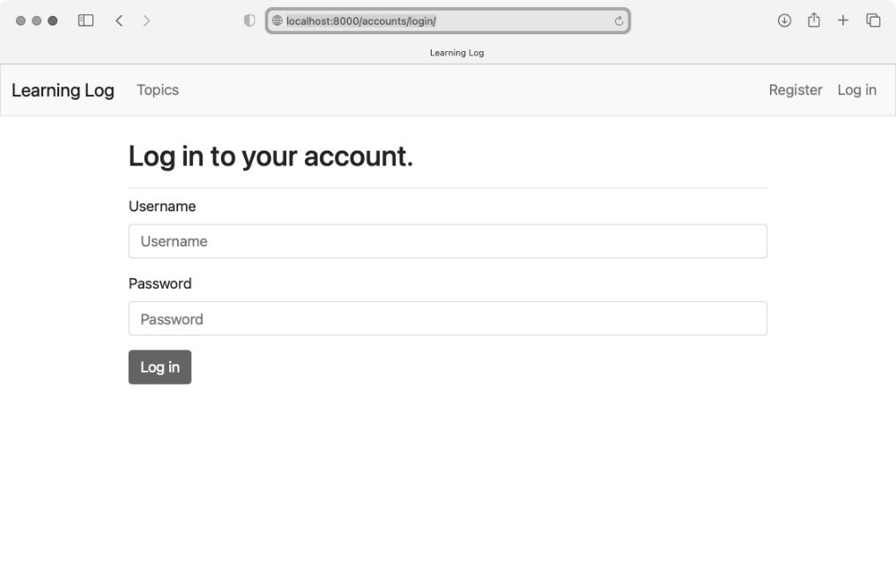
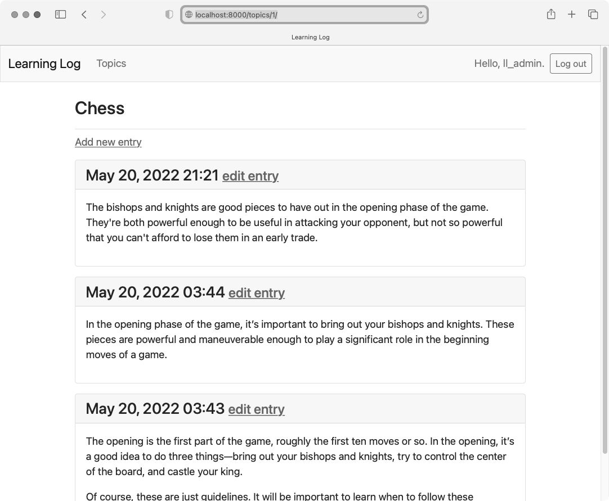
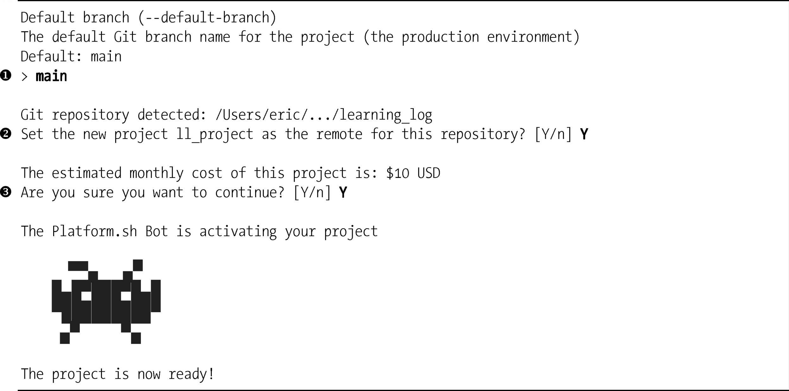

本章为「学习笔记」设置样式，使其看起来更专业，再将其部署到远程服务器上，让任何有互联网连接的人都可使用它。此外，还将使用版本控制系统 Git 来跟踪对这个项目所做的修改。

完成项目「学习笔记」后，你将能够开发简单的 Web 应用程序，让它们看起来很专业，再将其部署到服务器上。你还能够利用更高级的学习资源来提高技能。

## 1. 设置项目「学习笔记」的样式

之前，我们特意一直专注于项目「学习笔记」的功能，没有考虑样式设置的问题。这是一种不错的开发方法，因为能正确运行的应用程序才是有用的。应用程序能够正确运行之后，外观就显得很重要了，因为漂亮的应用程序才能吸引用户。

本节将安装应用程序 django-bootstrap5，并将其添加到项目「学习笔记」中，然后使用它来设置这个项目中各个页面的样式，确保页面的外观一致。

### 应用程序django-bootstrap5

下面使用 django-bootstrap5 将 Bootstrap 集成到项目「学习笔记」中。这个应用程序会下载必要的 Bootstrap 文件，并将它们放到项目的合适位置上，让你能够在项目的模板中使用样式设置指令。

为了安装 django-bootstrap5，在活动的虚拟环境中执行如下命令：

```
(ll_env)learning_log$ pip install django-bootstrap5
--snip--
Successfully installed beautifulsoup4-4.11.1 django-bootstrap5-21.3
    soupsieve-2.3.2.post1
```

接下来，需要将 django-bootstrap5 添加到 settings.py 的 INSTALLED_APPS 中：

```python
--snip--
INSTALLED_APPS = [
    # 我的应用程序
    'learning_logs',
    'accounts',

    # 第三方应用程序
    'django_bootstrap5',

    # Django默认添加的应用程序
    'django.contrib.admin',
--snip--
```

这里新建了片段「第三方应用程序」，用于指定其他开发人员开发的应用程序，并在其中添加了 'django_bootstrap5'。务必将这个片段放在「我的应用程序」和「Django 默认添加的应用程序」之间。

### 使用Bootstrap设置项目「学习笔记」的样式

Bootstrap 包含大量样式设置工具，还提供了大量模板，用于设置项目的总体风格。对于 Bootstrap 初学者来说，模板比样式设置工具用起来容易得多。要查看 Bootstrap 提供的模板，可访问其官网主页并单击 Examples。我们将使用模板 Navbar static，它提供了简单的顶部导航栏以及用于放置页面内容的容器。

图 20-1 显示了对 base.html 应用这个 Bootstrap 模板并对 index.html 做细微修改后的主页。



### 修改base.html

我们需要修改模板 base.html，以使用前述 Bootstrap 模板。这里将分五步逐步修改 base.html。这个文件很大，可以直接从配套的源代码文件中复制过来。即便复制了这个文件，也应仔细阅读接下来的几小节，弄明白都做了哪些修改。

#### 定义HTML头部

对 base.html 所做的第一个修改是，在其中定义 HTML 头部。我们将添加一些代码，以便能够在模板中使用 Bootstrap；此外，还要给页面添加标题。请删除 base.html 的全部代码，并输入如下代码：

```html
❶ <!doctype html>
❷ <html lang="en">
❸ <head>
    <meta charset="utf-8">
    <meta name="viewport" content="width=device-width, initial-scale=1">
❹   <title>Learning Log</title>

❺   
    
    

  </head>
```

首先，将这个文件声明为使用英语（见❷）编写的 HTML 文档（见❶）。HTML 文件分为两大部分：**头部**（head）和**主体**（body）。在这个文件中，头部始于起始标签 \<head\>（见❸）。

HTML 文件的头部不包含任何页面内容，而只向浏览器提供正确显示页面所需的信息。这里包含一个 \<title\> 元素（见❹），在浏览器中打开项目「学习笔记」时，标题栏将显示该元素的内容。

在头部末尾，加载 django-bootstrap5 提供的模板标签集（见❺）。模板标签  是 django-bootstrap5 中的一个定制模板标签，它加载实现 Bootstrap 样式所需的所有 CSS 文件；接下来的标签启用我们可能在页面中使用的所有交互行为，如可折叠的导航栏。最后一行为结束标签 \</head\>。现在，在所有继承 base.html 的模板中，都可以使用所有的 Bootstrap 样式设置选项了。但要使用 django-bootstrap5 中的定制模板标签，模板中必须包含标签 。

#### 定义导航栏

定义页面顶部导航栏的代码很长，因为需要同时支持较窄的手机屏幕和较宽的台式机显示器。下面是导航栏定义代码的开头：

```html
--snip--
  </head>
  <body>

❶ <nav class="navbar navbar-expand-md navbar-light bg-light mb-4 border">
    <div class="container-fluid">
❷     <a class="navbar-brand" href="">
        Learning Log</a>

❸     <button class="navbar-toggler" type="button" data-bs-toggle="collapse"
        data-bs-target="#navbarCollapse" aria-controls="navbarCollapse"
        aria-expanded="false" aria-label="Toggle navigation">
        <span class="navbar-toggler-icon"></span>
    </button>

❹     <div class="collapse navbar-collapse" id="navbarCollapse">
❺       <ul class="navbar-nav me-auto mb-2 mb-md-0">
❻         <li class="nav-item">
❼           <a class="nav-link" href="">
              Topics</a></li>
      </ul> <!--定义导航栏左侧链接的代码到此结束-->
    </div> <!--定义导航栏可折叠部分的代码到此结束-->
  </div> <!--定义导航栏容器的代码到此结束-->
</nav> <!--定义导航栏的代码到此结束-->

❽ 
  </body>
  </html>
```

第一个元素为起始标签 \<body\>。HTML 文件的**主体**（body）包含用户将在页面上看到的内容。接下来是一个 \<nav\> 元素，用于定义页面顶部的导航栏（见❶）。对于这个元素内的所有内容，都将根据 navbar、navbar-expand-md 等**选择器**（selector）定义的 Bootstrap 样式规则来设置样式。选择器决定了样式规则将应用于页面上的哪些元素。选择器 navbar-light 和 bg-light 使用一种浅色来设置导航栏的背景；mb-4 中的 mb 表示下边距（margin-bottom），这个选择器确保导航栏和页面其他部分之间有一些空白区域；选择器 border 在浅色背景周围添加很细的边框，将导航栏与页面的其他部分分开。

在接下来的一行中，起始标签 \<div\> 定义了一个大小可调整的容器，用于放置整个导航栏。div 是 division（分区）的缩写。在创建网页时，会将其分成多个区域，并指定要应用于各个区域的样式和行为规则：在起始标签 \<div\> 中定义的样式和行为规则将影响对应的结束标签 \</div\> 之前的所有元素。这里指定了在屏幕或窗口太窄时要折叠起来的导航栏部分的起始位置。

接下来，指定导航栏显示的第一个元素——项目名 Learning Log（见❷），并像前两章中样式最简单的项目版本一样，将这个项目名设置为主页的链接。选择器 navbar-brand 设置这个链接的样式，使其比其他链接更显眼，这也是凸显网站品牌的一种方式。

然后，这个 Bootstrap 模板定义一个按钮，它将在浏览器窗口太窄、无法水平显示整个导航栏时显示出来（见❸）。如果用户单击这个按钮，将出现一个下拉列表，其中包含所有的导航元素。在用户缩小浏览器窗口或在屏幕较小的设备上显示网站时，collapse 会让导航栏折叠起来。

接下来，开启导航栏的一个新区域（见❹），定义导航栏的可折叠部分（是否折叠取决于浏览器窗口的大小）。Bootstrap 将导航元素定义为无序列表项（见❺），但使用的样式规则让它们一点儿也不像列表。导航栏中的每个链接或元素都能以无序列表项的方式定义（见❻），这里只有一个列表项——Topics 页面的链接（见❼）。请注意，这个链接的后面是结束标签 \</li\>，每个起始标签都必须有对应的结束标签。

余下的代码行包含与之前的起始标签对应的结束标签。这些结束标签后面是类似于下面的 HTML 注释：

```html
<!-- This is an HTML comment. -->
```

虽然我们通常不给结束标签添加注释，但 HTML 新手给一些结束标签添加注释很有帮助。无论是少了标签还是多了标签，都可能导致整个网页的布局不正确。在上述代码的最后，是 content 块（见❽）以及结束标签 \</body\> 和 \</html\>。

#### 添加用户账户链接

还需要添加与用户账户相关的链接。我们先来添加与账户相关的链接，再添加注销表单。对文件 base.html 做如下修改：

```html
--snip--
          </ul> <!--定义导航栏左侧链接的代码到此结束-->

    <!--与账户相关的链接-->
❶   <ul class="navbar-nav ms-auto mb-2 mb-md-0">

❷     
      <li class="nav-item">
❸       <span class="navbar-text me-2">Hello, {{ user.username }}.
        </span></li>
❹     
      <li class="nav-item">
        <a class="nav-link" href="">
          Register</a></li>
      <li class="nav-item">
        <a class="nav-link" href="">
          Log in</a></li>
      
    </ul> <!--与账户相关的链接到此结束-->

        </div> <!--定义导航栏可折叠部分的代码到此结束-->
--snip--
```

首先，使用起始标签 \<ul\> 定义另一组链接（可根据需要在网页中包含任意数量的链接编组）（见❶）。选择器 ms-auto（margin-start automatic 的缩写，表示自动左边距）根据导航栏包含的其他元素设置左边距，确保这组链接位于浏览器窗口的右侧。

if 代码块与以前使用的条件代码块相同，它根据用户是否已登录显示相应的消息（见❷）。

这个代码块比以前长一些，因为它现在包含一些样式规则。我们在一个 \<span\> 元素中定义向已登录用户发出的问候语（见❸）。\<span\> 元素用于设置区域内一系列文本或元素的样式：\<div\> 元素创建区域，而 \<span\> 元素不会。这起初可能令人迷惑，因为很多页面深度嵌套了 \<div\> 元素。这里使用 \<span\> 元素来设置导航栏中提供信息的文本（已登录用户的用户名）的样式。

在用户未登录时执行的 else 块中，包含注册新账户的链接和登录链接（见❹）。这些链接的外观与 Topics 页面的链接类似。如果要在导航栏中添加更多链接，可在现有的编组中添加 \<li\> 元素，并使用类似于上面的样式设置指令。

#### 在导航栏中添加注销表单

注销表单应位于与账户相关的链接之后，但要放在导航栏的可折叠部分内。前面编写注销表单时，我们将其放在了 base.html 的末尾。下面将其放在一个更好的地方——导航栏中：

```html
--snip--
          </ul> <!--与账户相关的链接到此结束-->

  
    <form action="" method='post'>
      
❶     <button name='submit' class='btn btn-outline-secondary btn-sm'>
        Log out</button>
    </form>
  

        </div> <!--定义导航栏可折叠部分的代码到此结束-->
--snip--
```

就表单本身而言，所做的唯一修改是，在元素 \<button\> 中添加了大量的 Bootstrap 样式设置类，以设置注销按钮的 Bootstrap 样式（见❶）。此时重新加载主页，将能够使用已创建的任意账户登录和注销。

#### 定义页面的主要部分

base.html 的余下部分包含页面的主要部分：

```html
--snip--
    </nav> <!--定义导航栏的代码到此结束-->

❶ <main class="container">
❷   <div class="pb-2 mb-2 border-bottom">
      
    </div>
❸   <div>
      
    </div>
  </main>

  </body>
  </html>
```

开头是起始标签 \<main\>（见❶）。\<main\> 元素用于定义页面主体的最重要的部分。这里指定了 Bootstrap 选择器 container，这是一种对页面元素进行编组的简单方式。我们将在这个容器中放置两个 \<div\> 元素。

第一个 \<div\> 元素（见❷）包含一个 page_header 块，在大多数页面中将使用它来指定标题。为了突出标题，设置**内边距**（padding）——内边距指的是元素内容和边框之间的距离。选择器 pb-2 是一个 Bootstrap 指令，将元素的下内边距设置为恰当的值。**外边距**（margin）指的是元素的边框与其他元素之间的距离，选择器 mb-2 将这个 div 的下外边距设置为恰当的值。我们只想添加下边框，因此使用选择器 border-bottom，它在块的 page_header 下面添加较细的边框。

接下来，定义第二个 \<div\> 元素，其中包含 content 块（见❸）。我们没有为这个 content 块指定样式，因此在具体的页面中，可根据需要设置内容的样式。文件 base.html 的末尾是元素 \<main\>、\<body\> 和 \<html\> 的结束标签。

如果现在在浏览器中加载「学习笔记」的主页，将看到一个类似于图 20-1 所示的专业级导航栏。请尝试将窗口调整得非常窄，此时导航栏将变成一个按钮，如果单击这个按钮，将打开一个下拉列表，其中包含所有的导航链接。

### 使用jumbotron设置主页的样式

下面使用 Bootstrap 元素 jumbotron 来修改主页。jumbotron 元素是一个大框，在页面中显得鹤立鸡群，通常用于在主页中呈现简要的项目描述和让用户采取行动的元素。修改后的文件 index.html 如下所示：

```html
  

❶ 
❷ <div class="p-3 mb-4 bg-light border rounded-3">
    <div class="container-fluid py-4">
❸     <h1 class="display-3">Track your learning.</h1>

❹     <p class="lead">Make your own Learning Log, and keep a list of the
      topics you're learning about. Whenever you learn something new
      about a topic, make an entry summarizing what you've learned.</p>

❺     <a class="btn btn-primary btn-lg mt-1"
      href="">Register &raquo;</a>
    </div>
  </div>

```

首先告诉 Django，接下来要定义 page_header 块包含的内容（见❶）。jumbotron 是使用两个应用了一系列样式设置指令的 \<div\> 元素实现的（见❷）。在外面的 div 中，指定了内边距和外边距设置、浅色背景以及圆角设置。里面的 div 是一个容器，其尺寸随窗口的大小而变化，也指定了内边距设置：选择器 py-4 在这个 div 中添加了上内边距和下内边距。可以尝试调整这些设置中的数，看看主页将如何变化。

这个 jumbotron 包含三个元素。首先是一条简短的消息 Track your learning，让新访客大致知道「学习笔记」是用来做什么的。\<h1\> 元素表示一级标题，而选择器 display-3 让这个标题显得更瘦更高（见❸）。其次，我们还添加了一条更长的消息，让用户能够更详细地知道可以使用学习笔记做些什么（见❹）。这里使用 lead 类设置这个段落的格式，让它在常规段落中更加显眼。

最后，为了邀请用户注册账户，创建一个按钮（而不是文本链接）（见❺）。与导航栏中的链接 Register 一样，这个按钮也被链接到注册页面，不同之处是它更加显眼，并且让用户知道需要如何做才能使用这个项目。这里的选择器让这个按钮很大，召唤用户赶快行动起来。

代码 \&raquo; 是一个 HTML 实体，表示两个右尖括号（\>\>）。末尾是两个结束标签 \</div\>，还有结束块 page_header 的代码。这个文件只有两个 \<div\> 元素，在结束标签后面添加注释意义不大。我们不想在这个页面中添加其他内容，因此不需要定义 content 块。

现在的主页如图 20-1 所示，与设置样式前相比有很大的改进。

### 设置登录页面的样式

我们改进了登录页面的整体外观，但还未设置登录表单的样式。下面来修改文件 login.html，让表单的外观与页面的其他部分一致：

```html
  
❶ 

❷ 
  <h2>Log in to your account.</h2>


  

    <form action="" method='post'>
      
❸     
❹     
    </form>

  
```

首先，在这个模板中加载 bootstrap5 模板标签（见❶）。然后，定义 page_header 块，指出这个页面是做什么的（见❷）。注意，我们从这个模板中删除了代码块 ，因为 django-bootstrap5 会自动管理表单错误。

为了显示表单，我们使用模板标签 （见❸），它替换了前面使用的标签 {{ form.as_div }}。模板标签  将 Bootstrap 样式规则应用于各个表单元素。为了生成提交按钮，我们使用标签 ，通过实参将按钮类型指定为提交按钮，并将标签指定为 Log in（见❹）。

图 20-2 显示了现在的登录表单。这个页面比以前整洁得多，而且风格一致、用途明确。如果尝试使用错误的用户名或密码登录，将发现消息的样式与整个网站一致。



### 设置页面的样式topics

下面来确保用于查看信息的页面也有合适的样式，首先来设置页面 topics 的样式：

```html
  


❶ <h1>Topics</h1>


  

❷   <ul class="list-group border-bottom pb-2 mb-4">
      
❸     <li class="list-group-item border-0">
        <a href="">
          {{ topic.text }}</a>
      </li>
      
❹     <li class="list-group-item border-0">No topics have been added yet.</li>
      
    </ul>

    <a href="">Add a new topic</a>

  
```

这里不需要标签 ，因为这个文件没有使用任何 bootstrap5 定制标签。将标题 Topics 移到 page_header 块中，并将其设置为 \<h1\> 元素，而不是简单段落（见❶）。

这个页面的主要内容是一个主题列表，因此我们使用 Bootstrap 组件**列表组**（list group）来渲染这个页面，把一组简单的样式设置指令应用于整个列表和各个列表项。为此，在起始标签 \<ul\> 中首先指定 list-group 类，从而将默认样式指令应用于列表（见❷）。为了进一步定制这个列表，为其指定下边框、下内边距（pb-2）和下外边距（mb-4）。

对于每个列表项，都需要指定 list-group-item 类，同时对默认样式进行定制：删除列表项的边框（见❸）。对于列表为空时显示的消息，也需要指定同样的类（见❹）。现在访问页面 topics，将发现其样式与主页相同。

### 设置页面中条目的样式topic

在页面 topic 中，我们将使用 Bootstrap 组件 card 来突出显示每个条目。card 是带灵活的预定义样式的嵌套 \<div\>，非常适合用于显示主题的条目：

```html
  

❶ 
  <h1>{{ topic.text }}</h1>


  
    <p>
      <a href="">Add new entry</a>
    </p>

    
❷     <div class="card mb-3">
        <!--包含时间戳和编辑链接的标题-->
❸       <h4 class="card-header">
          {{ entry.date_added|date:'M d, Y H:i' }}
❹         <small><a href="">
            edit entry</a></small>
        </h4>
        <!--包含条目文本的正文-->
❺       <div class="card-body">{{ entry.text|linebreaks }}</div>
      </div>
    
❻     <p>There are no entries for this topic yet.</p>
    

  
```

首先将主题放在 page_header 块中（见❶），并删除这个模板中以前使用的无序列表结构。

我们没有将每个条目作为一个列表项，而是创建了一个带选择器 card 的 \<div\> 元素（见❷），其中包含两个嵌套的元素：一个包含条目的创建日期和用于编辑条目的链接，另一个包含条目的内容。这个 \<div\> 元素的样式设置工作主要由选择器 card 完成，还做了细微的定制——指定较小的下外边距（mb-3）。

嵌套的第一个元素是一个标题——带选择器 card-header 的 \<h4\> 元素（见❸），其中包含条目的创建日期和用于编辑条目的链接。用于编辑条目的链接放在标签 \<small\> 内，这让它看起来比时间戳小一些（见❹）。嵌套的第二个元素是一个带选择器 card-body 的 \<div\> 元素（见❺），它将条目的内容放在一个简单的框内。注意，我们只修改了影响页面外观的元素，未对在页面中包含信息的 Django 代码做任何修改。由于不再有无序列表，因此不再将指出列表为空的消息放在列表项标签内，而是将其放在简单段落标签内（见❻）。

图 20-3 显示了修改后的 topic 页面。「学习笔记」的功能没有任何变化，但显得更专业、对用户更有吸引力了。



如果要在这个项目中使用其他 Bootstrap 模板，可采用与本章中类似的流程：首先将要使用的模板复制到 base.html 中，并修改包含实际内容的元素，以使用该模板来显示项目的信息；然后使用 Bootstrap 的样式设置工具来设置各个页面中的内容样式。

注意：Bootstrap 提供了出色的文档。要深入了解 Bootstrap 提供了哪些功能，可访问其主页再单击 Docs。

## 2. 部署「学习笔记」

至此，项目「学习笔记」的外观已经很专业了，下面将其部署到服务器上，让任何有互联网连接的人都能够使用它。我们将使用 Platform.sh，这是一个基于 Web 的平台，供我们管理 Web 应用程序的部署。

### 注册Platform.sh账户

要注册账户，请访问 Platform.sh 官方主页，并单击 Free Trial 按钮。在本书编写期间，Platform.sh 提供了免费试用服务（free tier），不要求你提供信用卡。在试用期间，你可以部署应用程序和少量资源，这让你能够在在线环境中测试应用程序，进而决定是否要购买收费托管套餐。注册页面如图 20-4 所示。



注意：为防范垃圾邮件和资源滥用，Platform.sh 会定期调整对免费试用服务的限制。可访问 Platform.sh 的主页来了解其对免费试用服务的最新限制。

### 安装Platform.sh CLI

要将项目部署到 Platform.sh 服务器上并对其进行管理，需要使用 Platform.sh CLI（command line interface，命令行界面）中的工具。要安装该 CLI 的最新版本，可访问其文档 Command line interface (CLI)，并根据你使用的操作系统按相应的说明做。

在大多数系统中，可以在终端窗口中执行如下命令来安装 Platform.sh CLI：

```bash
$ curl -fsS https://platform.sh/cli/installer | php
```

执行这个命令后，要使用该 CLI，需要打开一个新的终端窗口。

注意：在 Windows 系统中，可能无法在标准终端窗口中执行这个命令。要解决这个问题，可使用 WSL（Windows Subsystem for Linux）或 Git Bash 终端。如果需要安装 PHP，可使用 XAMPP 安装程序。如果在安装 Platform.sh CLI 的过程中遇到麻烦，可参阅 Platform.sh 文档中的 CLI 安装说明。

### 安装platformshconfig

还需安装一个名为 platformshconfig 的包。这个包可帮助我们监测项目运行在本地系统还是 Platform.sh 服务器上。为了安装这个包，可在活动的虚拟环境中执行如下命令：

```
(ll_env)learning_log$ pip install platformshconfig
```

我们将使用这个包来修改运行在服务器上的项目的设置。

### 创建文件requirements.txt

远程服务器需要知道项目「学习笔记」依赖于哪些包，因此我们将使用 pip 生成一个文件，在其中列出这些包。为此，在活动的虚拟环境中执行如下命令：

```
(ll_env)learning_log$ pip freeze > requirements.txt
```

命令 freeze 让 pip 将项目中当前安装的所有包的名称都写入文件 requirements.txt。请打开文件 requirements.txt，查看项目中安装的包及其版本：

```
asgiref==3.5.2
beautifulsoup4==4.11.1
Django==4.1
django-bootstrap5==21.3
platformshconfig==2.4.0
soupsieve==2.3.2.post1
sqlparse==0.4.2
```

项目「学习笔记」依赖于 7 个特定版本的包，因此只在远程服务器有相应的环境时才能正确地运行。在这 7 个包中，有 3 个是我们手动安装的，其他 4 个是作为依赖的包自动安装的。

在我们部署「学习笔记」时，Platform.sh 将安装 requirements.txt 列出的所有包，从而创建一个环境，其中包含在本地使用的所有包。因此，我们可以相信，项目被部署到 Platform.sh 上之后的行为将与它在本地系统上的行为完全相同。当你在自己的系统上开发并维护各种项目时，这种项目管理方法至关重要。

注意：如果在你的系统中，requirements.txt 列出的包的版本与上面列出的不同，请保留原来的版本号。

### 其他部署需求

在线服务器还需要另外两个包，它们用于为生产环境中的项目提供服务，因为在生产环境中，可能有很多用户同时发出请求。在 requirements.txt 所在的目录中，新建一个文件并将其命名为 requirements_remote.txt，然后在其中添加如下两个包：

```
# 线上项目的部署需求
gunicorn
psycopg2
```

gunicorn 包在远程服务器上响应到来的请求，而远程服务器接替了我们一直使用的本地开发服务器的职责。为何必须安装包 psycopg2 呢？因为它让 Django 能够管理 Platform.sh 使用的 Postgres 数据库。Postgres 是一个开源数据库，非常适合部署用于生产环境中的应用程序。

### 添加配置文件

所有托管平台都需要一些配置，这样项目才能在服务器上正确地运行。本节将添加如下三个配置文件：

- **.platform.app.yaml**：这是项目的主配置文件，向 Platform.sh 指出了当前部署的项目是什么类型的以及该项目需要什么样的资源，还包含用于在服务器上构建项目的命令。
- **.platform/routes.yaml**：这个文件定义了通往项目的路由。Platform.sh 收到请求后，将根据这些配置将请求交给特定的项目。
- **.platform/services.yaml**：这个文件定义了项目所需的其他服务。

这些都是 YAML（YAML Ain't Markup Language，YAML 不是标记语言）文件。YAML 是一种旨在用于编写配置文件的语言，无论是人还是计算机都能轻松地读取。你可以手动编写或修改典型的 YAML 文件，计算机也能够读取并准确无误地解读这种文件。YAML 文件非常适合用来指定部署配置，因为它们能够让你很好地控制部署过程。

#### 显示隐藏的文件

大多数操作系统会隐藏名称以句点打头的文件和文件夹，如 .platform。当你打开文件浏览器时，默认看不到这样的文件和文件夹。但作为程序员，你需要看到它们。下面说明了在各种操作系统中如何显示隐藏的文件：

- 在 Windows 系统中，打开资源管理器，再打开一个文件夹，如 Desktop。单击标签「查看」，并确保选中了复选框「文件扩展名」和「隐藏的项目」
- 在 macOS 系统中，要显示隐藏的文件和文件夹，可在文件浏览器窗口中按 Command+Shift+.（句点）
- 在 Ubuntu 等 Linux 系统中，可在文件浏览器中按 Ctrl+H 来显示隐藏的文件和文件夹。为了让这种设置永久生效，可打开文件浏览器（如 Nautilus），再单击选项标签（三条线），并选中复选框 Show Hidden Files（显示隐藏的文件）

#### 配置文件.platform.app.yaml

这个配置文件是最长的，因为它控制着整个配置过程。下面是文件 .platform.app.yaml 的第一部分，应将该文件存储在 manage.py 所在的目录中：

```yaml
❶ name: "ll_project"
  type: "python:3.10"

❷ relationships:
      database: "db:postgresql"

  # 应用程序被暴露到网上时使用的配置
❸ web:
      upstream:
          socket_family: unix
      commands:
❹         start: "gunicorn -w 4 -b unix:$SOCKET ll_project.wsgi:application"
❺     locations:
          "/":
              passthru: true
          "/static":
              root: "static"
              expires: 1h
              allow: true

  # 应用程序的永久性磁盘的大小（单位为MB）
❻ disk: 512
```

在保存这个文件时，文件名开头务必包含句点。否则，Platform.sh 将找不到这个文件，进而不部署你的项目。

当前，无须理解文件 .platform.app.yaml 的全部内容，重点介绍其中最重要的部分。在这个文件中，首先指定了项目的名称（见❶）。为了与我们最初开发这个项目时使用的名称保持一致，这里也将其命名为 ll_project。还需要指定我们使用的 Python 版本，这里为 3.10。有关 Platform.sh 支持的 Python 版本列表，请访问 Platform.sh 主页，单击 DOCS，并在左侧目录中选择 Languages 下的 Python。

接下来是 relationships 部分，它定义了项目需要的其他服务（见❷）。这里唯一的关系（relationship）是 Postgres 数据库。再往下是 web 部分（见❸），其中的 web:commands:start 告诉 Platform.sh，应使用哪个进程处理到来的请求。这里指定的是 gunicorn（见❹），这个命令的作用与我们在本地使用的命令 python manage.py runserver 相同。

locations 部分告诉 Platform.sh，将到来的请求发送到什么地方（见❺）。大多数请求将被交给 gunicorn，而我们编写的 urls.py 文件让 gunicorn 准确地知道如何处理这些请求。对于静态文件请求，将以不同的方式处理，且每隔 1 小时刷新一次。在最后一行，我们请求在一台 Platform.sh 服务器上提供 512MB 的磁盘空间（见❻）。

下面列出了文件 .platform.app.yaml 中余下的内容：

```yaml
--snip--
  disk: 512

# 设置用于读写日志的本地挂载
❶ mounts:
    "logs":
        source: local
        source_path: logs

# 在应用程序生命周期的不同时间点执行的钩子(hook)
❷ hooks:
    build: |
❸     pip install --upgrade pip
        pip install -r requirements.txt
        pip install -r requirements_remote.txt
        mkdir logs
❹     python manage.py collectstatic
        rm -rf logs
❺   deploy: |
        python manage.py migrate
```

mounts 部分（见❶）指定了在项目运行时可读写的目录。这里为要部署的项目定义了目录 logs/。

hooks 部分（见❷）指定了在部署过程的各个时间点要采取的措施。在 build 部分，安装了为线上环境中的项目提供服务的所有包（见❸），还运行了 collectstatic（见❹），它将项目所需的所有静态文件都收集到同一个地方，以便高效地提供给用户。

最后，deploy 部分（见❺）指定每次部署项目时都应执行迁移。在简单的项目中，如果部署之前没有修改，这不会有任何影响。

#### 配置文件routes.yaml

**路由**（route）指的是请求在被服务器处理的过程中经过的路径。Platform.sh 需要知道应将收到的请求发送到哪里。

在 manage.py 所在的目录中新建一个文件夹，并将其命名为 .platform（不要遗漏开头的句点）。在这个文件夹中新建一个文件，将其命名为 routes.yaml，并在其中输入如下内容：

```yaml
# 每条路由都描述了Platform.sh该如何处理到来的请求（用URL表示）

"https://{default}/":
    type: upstream
    upstream: "ll_project:http"

"https://www.{default}/":
    type: redirect
    to: "https://{default}/"
```

这个文件确保 URL 形如 https://project_url.com 和 www.project_url.com 的请求都将被路由到同一个地方。

#### 配置文件services.yaml

这是最后一个配置文件，它指定了项目运行所需的服务。将这个文件与 routes.yaml 一起保存到目录 .platform/ 中：

```yaml
# 这里列出的每个服务都将被部署到Platform.sh项目的一个容器中

db:
    type: postgresql:12
    disk: 1024
```

这个文件定义了一个服务——一个 Postgres 数据库。

### 为部署到Platform.sh而修改settings.py

现在需要在 settings.py 末尾添加一个片段，在其中指定一些 Platform.sh 环境设置：

```python
--snip--
# Platform.sh设置
❶ from platformshconfig import Config
config = Config()
❷ if config.is_valid_platform():
❸     ALLOWED_HOSTS.append('.platformsh.site')

❹ if config.appDir:
      STATIC_ROOT = Path(config.appDir) / 'static'
❺ if config.projectEntropy:
      SECRET_KEY = config.projectEntropy
if not config.in_build():
❻   db_settings = config.credentials('database')
      DATABASES = {
          'default': {
              'ENGINE': 'django.db.backends.postgresql',
              'NAME': db_settings['path'],
              'USER': db_settings['username'],
              'PASSWORD': db_settings['password'],
              'HOST': db_settings['host'],
              'PORT': db_settings['port'],
          },
      }
```

虽然通常将 import 语句放在模块的开头，但在这里，将所有与线上部署相关的设置放在同一个地方大有裨益。我们从 platformshconfig 导入 Config（见❶），它可帮助确定远程服务器上的设置。仅当方法 config.is_valid_platform() 返回 True（这表明设置将用于 Platform.sh 服务器）时（见❷），我们才修改设置。

我们修改 ALLOWED_HOSTS，指定由地址以 .platformsh.site 结尾的主机来支持项目（见❸）。所有通过免费试用服务部署的项目都由该主机提供支持。如果设置正被加载到要部署的应用程序的目录中（见❹），就设置 STATIC_ROOT，以便能够正确地提供静态文件；我们还在远程服务器上设置了更安全的 SECRET_KEY（见❺）。

最后，配置生产环境数据库（见❻）。仅当构建过程已结束且项目得到支持时，才做这些设置。为了让 Django 能够与 Platform.sh 为项目搭建的 Postgres 服务器通信，这里的所有设置都必不可少。

### 使用Git跟踪项目文件

前面说过，Git 是一个版本控制程序，让你能够在每次成功实现新功能后都拍摄项目代码的快照。无论出现什么问题（如在实现新功能时不小心引入了 bug），都可轻松地恢复到最后一个可行的快照。每个快照称为**提交**（commit）。

使用 Git 意味着在尝试实现新功能时无须担心破坏项目。在将项目部署到服务器上时，需要确保部署的是可行版本。

#### 安装Git

在你的系统中，可能已经安装了 Git。要确定是否安装了 Git，可打开一个新的终端窗口，并在其中执行命令 git --version：

```
(ll_env)learning_log$ git --version
git version 2.30.1 (Apple Git-130)
```

如果出现一条消息，指出没有安装 Git，请参阅 Git 官方网站（git-scm.com）的安装说明。

#### 配置Git

Git 跟踪是谁修改了项目，即便项目由一个人开发也是如此。为了进行跟踪，Git 需要知道你的用户名和电子邮箱地址。因此，你必须提供用户名，但对于练习项目，可随便伪造一个电子邮箱地址：

```
(ll_env)learning_log$ git config --global user.name "eric"
(ll_env)learning_log$ git config --global user.email "eric@example.com"
```

如果忘记了这一步，在首次提交时 Git 将提示你提供这些信息。

#### 忽略文件

无须让 Git 跟踪项目中的每个文件，因此我们让它忽略一些文件。在 manage.py 所在的文件夹中创建一个名为 .gitignore 的文件（请注意，这个文件名以句点打头且不包含扩展名），并在其中输入如下代码：

```
ll_env/
__pycache__/
*.sqlite3
```

这里让 Git 忽略目录 ll_env，因为随时都可以自动重新创建它；还指定了不跟踪目录 \_\_pycache\_\_，这个目录包含执行 .py 文件时自动创建的 .pyc 文件。我们没有跟踪对本地数据库的修改，因为这是个坏习惯：如果在服务器上使用的是 SQLite，在将项目推送到服务器上时，可能会不小心用本地测试数据库覆盖在线数据库。让 Git 忽略所有扩展名为 .sqlite3 的文件。

注意：如果你使用的是 macOS 系统，请将 .DS_Store 添加到文件 .gitignore 中。文件 .DS_Store 存储的是有关文件夹设置的信息，与这个项目一点儿关系也没有。

#### 提交项目

我们需要为「学习笔记」初始化一个 Git 仓库，将所有必要的文件都加入进来，并提交项目的初始状态，如下所示：

```
❶ (ll_env)learning_log$ git init
  Initialized empty Git repository in /Users/eric/.../learning_log/.git/
❷ (ll_env)learning_log$ git add .
❸ (ll_env)learning_log$ git commit -am "Ready for deployment to Platform.sh."
  [main (root-commit) c7ffaad] Ready for deployment to Platform.sh.
   42 files changed, 879 insertions(+)
   create mode 100644 .gitignore
   create mode 100644 .platform.app.yaml
 --snip--
   create mode 100644 requirements_remote.txt
❹ (ll_env)learning_log$ git status
  On branch main
  nothing to commit, working tree clean
  (ll_env)learning_log$
```

执行命令 git init，在「学习笔记」所在的目录中初始化一个空仓库（见❶）。然后，执行命令 git add .（千万别忘了这个句点），将未被忽略的文件都加入这个仓库（见❷）。接下来，执行命令 git commit -am "commit message"，其中的标志 -a 让 Git 在这个提交中包含所有修改过的文件，而标志 -m 让 Git 记录一条日志消息（见❸）。

最后，执行命令 git status（见❹）。输出表明当前位于分支 main 上，而工作树是**干净**（clean）的。每当要将项目推送到远程服务器上时，我们都希望看到这样的状态。

### 在Platform.sh上创建项目

当前，项目「学习笔记」虽然还运行在本地系统上，但已经经过了配置，能够在远程服务器上正确地运行。下面使用 Platform.sh CLI 在远程服务器上新建一个项目，再将项目「学习笔记」推送到该服务器上。

打开一个终端窗口，切换到目录 learning_log/，并执行如下命令：

```
  (ll_env)learning_log$ platform login
  Opened URL: http://127.0.0.1:5000
  Please use the browser to log in.
--snip--
❶ Do you want to create an SSH configuration file automatically? [Y/n] Y
```

这个命令打开一个浏览器选项卡，让我们能够登录。登录后，关闭该浏览器选项卡并返回终端窗口。如果系统询问你是否要创建一个 SSH 配置文件（见❶），请输入 Y，以便之后能够连接到远程服务器。

下面来创建一个项目。输出很多，我们将分几部分来介绍创建过程。首先，执行命令 create：

```
  (ll_env)learning_log$ platform create
  * Project title (--title)
  Default: Untitled Project
❶ > ll_project

  * Region (--region)
  The region where the project will be hosted
--snip--
    [us-3.platform.sh] Moses Lake, United States (AZURE) [514 gC02eq/kWh]
❷ > us-3.platform.sh
  * Plan (--plan)
  Default: development
  Enter a number to choose:
    [0] development
--snip--
❸ > 0

  * Environments (--environments)
  The number of environments
  Default: 3
❹ > 3

  * Storage (--storage)
  The amount of storage per environment, in GiB
  Default: 5
❺ > 5
```

第一个提示让你指定项目名称（见❶），这里指定了名称 ll_project。接下来的提示询问你想使用哪个地区的服务器（见❷），请选择离你最近的服务器，对我来说最近的服务器是 us-3.platform.sh。对于余下的三个提示，可接受默认的设置：等级最低的开发套餐（lowest development plan）服务器（见❸）、三个环境（见❹），以及 5GB 的存储空间（见❺）。

还有另外三个提示需要响应：Git 仓库可能有多个分支，因此 Platform.sh 询问项目的默认分支是否应为 main；然后，它询问是否要将本地的项目仓库关联到远程仓库；最后，Platform.sh 指出，如果你在免费试用期过后继续运行这个项目，每月将需要支付 10 美元的费用。

只要你没有输入信用卡号，就不用担心会被扣款，因为免费试用期过后，如果你没有添加信用卡号，Platform.sh 将暂停你的项目。

### 推送到Platform.sh

最后一步是将代码推送到远程服务器上，然后就可以查看项目的在线版本了。请执行如下命令：

```
  (ll_env)learning_log$ platform push
❶ Are you sure you want to push to the main (production) branch? [Y/n] Y
--snip--
  The authenticity of host 'git.us-3.platform.sh (...)' can't be established.
  RSA key fingerprint is SHA256:Tvn...7PM
❷ Are you sure you want to continue connecting (yes/no/[fingerprint])? Y
  Pushing HEAD to the existing environment main
--snip--
    To git.us-3.platform.sh:3pp3mqcexhlvy.git
     * [new branch]      HEAD -> main
```

在执行命令 platform push 时，Platform.sh CLI 将进一步确认你要推送项目（见❶）。如果这是你首次连接到 Platform.sh，还可能出现一条有关该网站**真实性**（authenticity）的消息（见❷）。对于这些提示，都输入 Y，将看到大量向上滚动的输出。这些输出可能令人迷惑，但在出现问题时对排除故障很有帮助。

通过浏览这些输出，可以发现 Platform.sh 安装了必要的包、收集了静态文件、应用了迁移，并且设置了项目的 URL。

注意：可能出现易于诊断的错误，如配置文件存在录入错误。如果出现这种情况，请在文本编辑器中修复错误，保存文件，并执行命令 platform push。然后，再次执行 git commit 命令。

### 查看线上项目

完成推送工作后，就可以打开项目了：

```bash
(ll_env)learning_log$ platform url
Enter a number to open a URL
  [0] https://main-bvxea6i-wmye2fx7wwqgu.us-3.platformsh.site/
--snip--
 > 0
```

命令 platform url 列出与所部署的项目相关联的 URL。你可以从多个 URL 中做出选择，这些 URL 对你的项目来说都合法。选择一个 URL 后，项目将在一个新的浏览器选项卡中打开。它与我们前面在本地运行的项目一样，但你可将该 URL 共享给任何人，让他们也能够访问并使用这个项目。

注意：在使用免费试用账户部署项目时，如果页面的加载时间比平常长，请不要大惊小怪。在大多数托管平台上，空闲的免费资源常常被挂起，仅当有新请求到来时才重新启动。如果你购买了付费托管套餐，大多数平台的响应速度将快得多。

### 改进Platform.sh部署

下面来改进部署。为此，我们将像在本地一样创建超级用户，并且让项目更安全：将 DEBUG 设置为 False，让用户无法在错误消息中看到额外的信息，以防他们利用这些信息来攻击服务器。

#### 在Platform.sh上创建超级用户

虽然我们已为线上项目搭建了数据库，但这个数据库是空的。前面创建的所有用户都只存在于这个项目的本地版本中。为了在这个项目的线上版本中创建超级用户，我们启动一个 SSH（secure socket shell，安全套接字外壳）会话，以便通过它在远程服务器上执行管理命令：

```
  (ll_env)learning_log$ platform environment:ssh

   ___ _      _    __                    _
  | _ \ |__ _| |_ / _|___ _ _ _ __    __| |_
  |  _/ / _` |  _|  _/ _ \ '_| '  \ _(_-< ' \
  |_| |_\__,_|\__|_| \___/_| |_|_|_(_)__/_||_|

   Welcome to Platform.sh.

❶ web@ll_project.0:~$ ls
  accounts  learning_logs  ll_project  logs  manage.py  requirements.txt
      requirements_remote.txt  static
❷ web@ll_project.0:~$ python manage.py createsuperuser
❸ Username (leave blank to use 'web'): ll_admin_live
  Email address:
  Password:
  Password (again):
  Superuser created successfully.
❹ web@ll_project.0:~$ exit
  logout
  Connection to ssh.us-3.platform.sh closed.
❺ (ll_env)learning_log$
```

在首次执行命令 platform environment:ssh 时，可能显示一条有关主机真实性的消息。如果看到这条消息，只要输入 Y，就将登录远程终端会话。此时你的终端就像是远程服务器上的终端：提示符变了，指出当前位于一个与项目 ll_project 相关联的 web 会话中（见❶）。

如果执行命令 ls，将看到之前被推送到 Platform.sh 服务器上的文件。请执行前面用过的命令 createsuperuser（见❷）。在这里，指定的管理用户名为 ll_admin_live，与本地使用的超级用户名不同（见❸）。使用完远程终端会话，执行命令 exit（见❹），提示符将发生变化，表明又回到了本地系统（见❺）。

现在，可在线上应用程序的 URL 末尾添加 /admin/ 来登录管理网站了。如果有其他人使用这个项目，别忘了你可以访问他们的所有数据！千万别不把这一点当回事儿，否则用户就不会再将数据托付给你了。

注意：即便使用的是 Windows 系统，也应使用这里列出的命令（如 ls 而不是 dir），因为这里是在通过远程连接运行 Linux 终端。

#### 确保线上项目的安全

当前，部署的项目存在严重的安全问题：settings.py 包含设置 DEBUG=True，指定在发生错误时显示调试信息。在开发项目时，Django 的错误页面显示了重要的调试信息，但如果将项目部署到远程服务器后还保留这个设置，将给攻击者提供大量可以利用的信息。

要见识这有多糟糕，请访问部署在远程服务器上的项目的主页，用有效的用户账户登录，再在主页 URL 后面加上 /topics/999/。只要你创建的主题没上千，就将看到一个包含消息 DoesNotExist at /topics/999/ 的页面。如果向下滚动，还将看到大量有关项目和服务器的信息。你不希望用户看到这些信息，更不希望想攻击网站的人获得这些信息。

为了防止线上项目显示这些信息，可在 settings.py 文件中用于线上版本的设置部分指定 DEBUG=False。这样，你在本地依然能够看到调试信息（它们对你来说很有用），但线上部署的版本不会显示它们。请在文本编辑器中打开文件 settings.py，并在修改 Platform.sh 设置的部分添加一行代码：

```python
--snip--
if config.is_valid_platform():
    ALLOWED_HOSTS.append('.platformsh.site')
    DEBUG = False
--snip--
```

#### 提交并推送修改

现在需要提交对 settings.py 所做的修改，并将修改推送到 Platform.sh 上。下面的终端会话演示了这个过程的第一步：

```
❶ (ll_env)learning_log$ git commit -am "Set DEBUG False on live site."
  [main d2ad0f7] Set DEBUG False on live site.
    1 file changed, 1 insertion(+)
❷ (ll_env)learning_log$ git status
  On branch main
  nothing to commit, working tree clean
  (ll_env)learning_log$
```

执行命令 git commit，并指定一条简短而有描述性的提交消息（见❶）。别忘了，标志 -am 让 Git 提交所有修改过的文件，并记录一条日志消息。Git 找出唯一一个修改过的文件，并将所做的修改提交到仓库。

我们运行命令 git status，其输出表明，当前位于仓库的分支 main 上，没有任何未提交的修改（见❷）。在将项目推送到远程服务器上之前，务必检查其状态，这很重要。如果状态不是 clean，就说明有未提交的修改，而这些修改将不会被推送到服务器上。在这种情况下，可尝试再次执行命令 commit。如果不知道该如何解决这个问题，可阅读 Git 官方文档，更深入地了解 Git 的用法。

第二步是将修改后的仓库推送到 Platform.sh 上：

```
(ll_env)learning_log$ platform push
Are you sure you want to push to the main (production) branch? [Y/n] Y
Pushing HEAD to the existing environment main
--snip--
  To git.us-3.platform.sh:wmye2fx7wwqgu.git
     fce0206..d2ad0f7  HEAD -> main
(ll_env)learning_log$
```

Platform.sh 发现仓库发生了变化，因此重新构建项目，确保所有的修改都生效。它不会重建数据库，因此不会丢失任何数据。

为确定修改生效了，再次访问 URL /topics/999/。这次将只出现消息 Server Error (500)，而没有显示任何有关项目的敏感信息。

### 创建定制错误页面

前面已经对「学习笔记」进行了配置，使其在用户请求不属于自己的主题或条目时返回 404 错误。你可能还见过 500 错误（内部错误）。404 错误通常意味着 Django 代码是正确的，但请求的对象不存在；而 500 错误则通常意味着代码有问题，如 views.py 中的函数有问题。

当前，在这两种情况下，Django 都返回通用的错误页面，但我们可以编写外观与「学习笔记」一致的 404 和 500 错误页面模板。这些模板应放在根模板目录中。

#### 创建定制模板

在文件夹 learning_log 中，新建一个文件夹，并将其命名为 templates。然后在这个文件夹中新建一个名为 404.html 的文件（这个文件的路径应为 learning_log/templates/404.html），并在其中输入如下内容：

```html



  <h2>The item you requested is not available. (404)</h2>

```

这个简单的模板指定了通用的 404 错误页面包含的信息，而且该页面的外观与网站其他部分一致。

再创建一个名为 500.html 的文件，并在其中输入如下代码：

```html



  <h2>There has been an internal error. (500)</h2>

```

这些新文件要求对 settings.py 做细微的修改：

```python
--snip--
TEMPLATES = [
    {
        'BACKEND': 'django.template.backends.django.DjangoTemplates',
        'DIRS': [BASE_DIR / 'templates'],
        'APP_DIRS': True,
--snip--
    },
]
--snip--
```

这个修改让 Django 在根模板目录中查找错误页面模板以及其他不与特定应用程序相关联的模板。

#### 将修改推送到Platform.sh

现在需要提交刚才所做的修改，并将这些修改推送到 Platform.sh 上：

```
❶ (ll_env)learning_log$ git add .
❷ (ll_env)learning_log$ git commit -am "Added custom 404 and 500 error pages."
   3 files changed, 11 insertions(+), 1 deletion(-)
   create mode 100644 templates/404.html
   create mode 100644 templates/500.html
❸ (ll_env)learning_log$ platform push
--snip--
    To git.us-3.platform.sh:wmye2fx7wwqgu.git
       d2ad0f7..9f042ef  HEAD -> main
  (ll_env)learning_log$
```

执行命令 git add .（见❶），这是因为我们在项目中创建了一些新文件。然后提交所做的修改（见❷），并将修改后的项目推送到 Platform.sh 上（见❸）。

现在，错误页面的样式应该与网站的其他部分一致。这样，在发生错误时，用户将不会感到别扭。

### 继续开发

将项目「学习笔记」推送到远程服务器上之后，你可能想进一步开发它或开发要部署的其他项目。更新项目的过程几乎完全相同：

首先，对本地项目做必要的修改。如果在修改过程中创建了新文件，使用命令 git add .（千万别忘记末尾的句点）将它们加入 Git 仓库。如果有修改要求迁移数据库，也需要执行这个命令，因为每次迁移都将生成新的迁移文件。然后，使用命令 git commit -am "commit message" 将修改提交到仓库，再使用命令 platform push 将修改推送到 Platform.sh 上。最后，访问线上的项目，确认期望看到的修改已生效。

在这个过程中很容易犯错，因此在看到错误时不要大惊小怪。如果代码不能正确地工作，请重新审视你所做的工作，尝试找出错误。如果找不出错误，或者不知道如何撤销错误，可在 Python 社区（如官方论坛或 Stack Overflow）寻求帮助。不要羞于寻求帮助：每个学习过开发项目的人都可能遇到过你面临的问题，因此总有人乐意伸出援手。通过解决遇到的每个问题，可稳步提高技能，最终开发出可靠而有意义的项目，甚至能帮助别人解决遇到的问题。

### 将项目从Platform.sh上删除

一个不错的练习是，使用同一个项目或一系列小项目多次执行部署过程，直到对部署过程了如指掌。然而，你需要知道如何删除已部署的项目。Platform.sh 限制了可免费托管的项目数，而你也不希望自己的账户中包含大量练习项目。

要删除项目，可使用 Platform.sh CLI：

```
(ll_env)learning_log$ platform project:delete
```

Platform.sh 将确认你是否确实要采取这种破坏性措施。确认之后，项目将被删除。

命令 platform create 还在本地 Git 仓库中添加了一个引用，它指向位于 Platform.sh 服务器上的远程仓库。可在命令行中删除这个远程仓库：

```
(ll_env)learning_log$ git remote
platform
(ll_env)learning_log$ git remote remove platform
```

命令 git remote 列出与当前仓库相关联的所有远程 URL 的名称，而命令 git remote remove remote_name 则从本地仓库中删除指定的远程 URL。

还可以删除项目的资源。首先登录 Platform.sh 网站，并访问你的**仪表盘**（dashboard）。这个页面列出了你的所有活动项目。单击项目框中的三个点，再单击 Edit Plan。这将打开项目的**计价页面**（pricing page），单击该页面底部的 Delete Project 按钮，将出现一个确认页面，然后就可以按其中的说明完成项目的删除了。即便你选择使用 CLI 删除项目，也应该熟悉托管提供商提供的仪表盘。

注意：删除 Platform.sh 上的项目对本地项目没有任何影响。如果没有人使用你部署的项目，而你只是想练习部署过程，完全可以将项目从 Platform.sh 上删除，再重新部署。需要明白的是，如果出现了问题，很可能是免费试用服务的限制导致的。

## 3. 小结

在本章中，你学习了如何使用 Bootstrap 库和应用程序 django-bootstrap5 赋予应用程序简单而专业的外观。使用 Bootstrap 意味着，无论用户使用哪种设备来访问你的项目，你选择的样式都将实现几乎相同的效果。你还了解了 Bootstrap 的模板，并使用模板 Navbar static 赋予了「学习笔记」简单的外观；然后学习了如何使用 jumbotron 来突出显示主页中的消息，以及如何给网站的所有网页设置一致的样式。

在本章的最后一节中，你学习了如何将项目部署到远程服务器上，让所有人都能够访问：创建了一个 Platform.sh 账户，还安装了一些帮助管理部署过程的工具；使用 Git 将能够正确运行的项目提交到仓库中，再将这个仓库推送到 Platform.sh 的远程服务器上；最后，你在远程服务器上将 DEBUG 设置为 False，以确保应用程序的安全，还创建了定制错误页面，让不可避免的错误看起来得到了妥善的处理。

开发完项目「学习笔记」，你就可以自己动手开发项目了。请先让项目尽可能简单，确定它能正确运行后，再添加复杂的功能。
