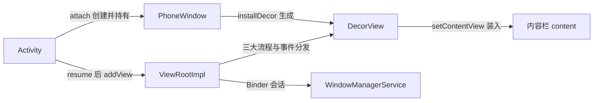

### 1. 四大组件是什么？

Activity、Service、BroadcastReceiver、ContentProvider。都需要在 AndroidManifest 中注册（BroadcastReceiver 也支持动态注册）。

### 2. 四大组件的生命周期和简单用法

#### Activity

典型生命周期之外，重点看两种特殊情况：

**1. 横竖屏切换（配置变更）**

Activity 会被销毁并重建，完整回调顺序：

```
onPause() → onSaveInstanceState() → onStop() → onDestroy()
→ onCreate() → onStart() → onRestoreInstanceState() → onResume()
```

- onSaveInstanceState 在 onStop 之前调用，只有在 Activity **异常终止**时才会回调（正常按返回键退出不会）；保存的 Bundle 会同时传给重建后的 onCreate 和 onRestoreInstanceState；
- onRestoreInstanceState 在 onStart 之后回调，**其 Bundle 必非空**，不需要判空，比 onCreate 里恢复更简洁；
- 避免重建：manifest 中配置 `android:configChanges="orientation|screenSize"`，此时只回调 `onConfigurationChanged(Configuration)`；

```java
@Override
public void onConfigurationChanged(Configuration newConfig) {
    super.onConfigurationChanged(newConfig);
}
```

**2. 资源内存不足，低优先级 Activity 被杀**

优先级：前台 Activity > 可见但非前台 > 后台 Activity。

> 【演进】配置变化的现代处理：数据放 ViewModel（旋转屏幕时 ViewModel 存活，不必靠 Bundle 全量恢复）；ViewModel + SavedStateHandle 处理进程被杀重建的场景。Android 13+ 引入手势导航的预测性返回（Predictive Back），Android 15 起强制 edge-to-edge，onConfigurationChanged 需要关注的配置项更多（uiMode、screenLayout 等）。

**启动模式**

| 模式 | 行为 | 典型场景 |
| --- | --- | --- |
| standard | 每次都新建实例压栈 | 普通页面 |
| singleTop | 栈顶复用，回调 onNewIntent | 推送落地页，避免连点叠多个实例 |
| singleTask | 栈内复用，清掉其上的 Activity，回调 onNewIntent | 主页/首页（返回时清栈） |
| singleInstance | 独占一个任务栈，全局唯一 | 系统级全局页面（很少用） |

- 在 Service / Application 中启动 Activity 没有任务栈，需要加 `FLAG_ACTIVITY_NEW_TASK`；
- singleTask 可配合 `taskAffinity` 指定目标栈（未指定时默认等于包名）；
- 常用 Flags：`FLAG_ACTIVITY_NEW_TASK`、`FLAG_ACTIVITY_SINGLE_TOP`、`FLAG_ACTIVITY_CLEAR_TOP`（与 standard 组合时会连同自身出栈重建）。

**Activity 的启动过程（应用进程已存在时）**

1. Launcher 通过 Binder 通知 AMS（ActivityManagerService）要启动一个 Activity；
2. AMS 通过 Binder 通知 Launcher 进入 Paused 状态；
3. AMS 创建/复用一个进程，初始化 ActivityThread，ActivityThread 把 ApplicationThread（Binder 对象）交给 AMS 作为后续通信渠道；
4. AMS 通过 Binder 通知 ActivityThread 一切就绪，真正执行启动：创建 Activity 实例 → attach → onCreate → onResume。

#### Service

后台运行的组件，**默认运行在主线程**，耗时操作必须自建子线程。

按运行地点：本地服务（主进程内，节约资源）/ 远程服务（独立进程，android:process，需 AIDL, Android Interface Definition Language）；按运行类型：前台服务（带 ongoing 通知，如音乐播放）/ 后台服务；按使用方式：startService（不通信）/ bindService（要通信）/ 混合。

生命周期：

```
startService(): onCreate → onStartCommand（多次）→ onDestroy
bindService():  onCreate → onBind（一次）→ onUnbind → onDestroy
```

要点：

- 第一次 startService 触发 onCreate + onStartCommand，后续只触发 onStartCommand；stopService 一次即停；
- bindService 的生命周期**依附于调用者 Context**：绑定者销毁，系统自动解绑并停止服务；unbind 后再 unbind 抛异常；
- 混合使用时，必须 stopService（或 stopSelf）且全部解绑后服务才销毁。

> 【演进】Android 8.0 起后台应用 startService 直接抛 IllegalStateException，须改用 startForegroundService 并在 **5 秒内**调用 startForeground 显示通知；Android 14 要求前台服务在 manifest 声明 `android:foregroundServiceType` 并申请对应权限。长期后台任务优先考虑 WorkManager。

#### BroadcastReceiver

用于监听/接收广播并响应：组件间通信、与系统通信（来电、网络变化等）。

**实现原理（观察者模式 + Binder）**

1. 广播接收者通过 Binder 在 AMS 注册（订阅）；
2. 发送者通过 Binder 向 AMS 发送广播；
3. AMS 按 IntentFilter / Permission 匹配接收者，把广播投递到其消息循环；
4. 接收者回调 onReceive()（**运行在主线程，不能耗时，否则 ANR, Application Not Responding**）。

**注册方式**

```java
// 动态注册（跟随组件生命周期，onResume 注册 / onPause 注销）
IntentFilter filter = new IntentFilter(ConnectivityManager.CONNECTIVITY_ACTION);
registerReceiver(receiver, filter);
unregisterReceiver(receiver);
```

静态注册在 AndroidManifest 中声明 `<receiver>`，常驻但耗电；**Android 8.0 起绝大多数系统广播不再允许静态注册**（BOOT_COMPLETED 等少数除外），必须动态注册。

**广播类型**

- 普通广播：sendBroadcast，所有匹配者异步接收；
- 有序广播：sendOrderedBroadcast，按 priority 排序接收，可截断/修改；
- 应用内广播：exported=false + setPackage，或 LocalBroadcastManager；
- 粘性广播：**API 21 已废弃**。

> 【演进】LocalBroadcastManager 已废弃，应用内事件用 LiveData/SharedFlow 或自己封装的事件流替代；onReceive 耗时操作用 goAsync() 拿 PendingIntent 延长处理时间（约 10s），或转交 WorkManager；targetSdk 34+ 动态注册必须指定 RECEIVER_EXPORTED / RECEIVER_NOT_EXPORTED。

#### ContentProvider

跨进程数据共享组件，底层是 Binder。通过 URI 定位：`content://authority/path/id`（通配符 `*` 任意字符、`#` 数字），getType 返回 MIME 类型；对外暴露 query / insert / update / delete 四个方法，它们**运行在提供方进程的 Binder 线程池，不在主线程**。

> 【演进】现代组合：Room（SQLite ORM）+ Paging 分页 + ContentProvider 对外共享；数据变化 notifyChange 配合 ContentObserver 或 Paging 的 InvalidatingTracker。

### 3. Context的理解？

组件的运行需要一个完整的 Android 工程环境，组件不能像普通对象那样 new 出来——这个上下文环境就是 Context，它是维持各组件正常工作的核心功能类。可以把 App 理解成一部电影：四大组件是剧组定好的主角（不能随便拉人 new），Button/TextView 是群演（可以 new），但都得经过镜头（Context）才能把戏呈现给观众。

**类结构**

- ContextImpl：Context 的真正实现，各种 Context 方法都来自它；
- ContextWrapper：包装类，内部持有真正的 Context（attachBaseContext 指定），方法调用全部转发；
- Activity 继承 ContextThemeWrapper（带主题），Service / Application 直接继承 ContextWrapper。

**数量**：Context 数 = Activity 数 + Service 数 + 1（Application）。BroadcastReceiver / ContentProvider 不是 Context 子类，它们持有的 Context 是外部传入的。

**作用域规则**

- UI 相关（Dialog、主题相关 inflate）必须用 Activity 的 Context；
- Application 的 Context 启动 standard 模式 Activity 会报错（没有任务栈），需要 FLAG_ACTIVITY_NEW_TASK；
- Toast 用 ApplicationContext 也可以。

一句话：**凡跟 UI 相关的都用 Activity 的 Context；其余场景 Application/Service 都可以，注意引用持有防止泄漏**（单例、静态持有要传 applicationContext）。

### 4. AsyncTask详解（已废弃）

> 【演进】**AsyncTask 在 API 30 已废弃**。现代替代：Kotlin 协程（lifecycleScope + Dispatchers.IO）、Flow、Executor + Handler、RxJava。以下原理仍值得了解（线程池 + Handler 切线程的思路是通用的）。

AsyncTask 是轻量级异步类：在线程池中执行后台任务，把进度和结果切回主线程。

**内部结构**：两个线程池 + 一个 Handler——SerialExecutor 负责任务**排队（串行）**，THREAD_POOL_EXECUTOR 真正执行任务，InternalHandler 从工作线程切到主线程。

**泛型参数** `AsyncTask<Params, Progress, Result>` 与核心方法：

| 方法 | 线程 | 作用 |
| --- | --- | --- |
| onPreExecute | 主线程 | 准备工作（显示进度条） |
| doInBackground | 子线程 | 耗时任务；publishProgress 上报进度 |
| onProgressUpdate | 主线程 | 根据进度更新 UI |
| onPostExecute | 主线程 | 处理结果 |

调用顺序：onPreExecute → doInBackground →（publishProgress → onProgressUpdate）→ onPostExecute。

注意：cancel() 只是设置取消标记（类似 interrupt），需要在 doInBackground 中主动检查；实例只能 execute 一次；必须在 UI 线程创建和调用 execute。

### 5. Android虚拟机以及编译过程

#### Dalvik 与 JVM 的区别

- **字节码格式**：JVM 运行 Java 字节码（.class）；Dalvik 运行 dex（dx 工具把多个 class 转换、去冗余、共享常量池，体积更小）；
- **架构**：JVM 基于**栈**（指令多、访存多）；Dalvik 基于**寄存器**（指令少、速度快，适合移动设备）；
- 每个进程对应一个 Dalvik 实例；早期无 JIT（Just-In-Time，即时编译），Android 2.2 才加入。

#### ART 的改进（Android 5.0 起默认）

- **AOT 编译**（Ahead-Of-Time，提前编译）：安装时把字节码预编译成机器码（对比 Dalvik 的 JIT 运行时解释），启动更快、运行更流畅；代价是安装时间长、占用存储多（10%-20%）；
- **GC（Garbage Collection，垃圾回收）改进**：Dalvik 全程挂起所有线程；ART 改成部分并发（标记与回收期间多次短暂挂起），GC 效率提高约一倍；
- **内存利用**：引入 Large-Object-Space 专存大对象 + moving collector 对齐内存，缓解标记-清除的碎片化，内存利用率显著提高。

> 【演进】Android 7.0 起 ART 改为 **JIT + AOT 混合编译**：安装时只做基本编译（加快安装），运行时 JIT 热点代码被记录到 Profile，空闲时按 Profile 做 AOT——兼顾安装速度、运行性能与存储占用。64 位强制（2019 起 Play 要求）、dex 字节码版本演进（D8 产出）。

#### APK 编译打包流程

AAPT 打包资源（xml 编译为二进制、生成 R.java）→ AIDL 转 Java 接口 → javac 编译为 .class → dx 转 dex → 打包 APK → 签名、对齐。完整流程与现代工具链详见第 18 题。

### 6. 进程保活方案

两个思路：**提高优先级降低被杀概率**、**被杀后拉活**。

进程优先级五级：前台 > 可见 > 服务 > 后台 > 空进程。前台进程特征：正在交互的 Activity、前台 Service（startForeground）、正在执行 onReceive 的接收者等。

**经典手段**：

- 提高优先级：1 像素 Activity（锁屏期间挂在前台）、setForeground 通知；
- 拉活：静态注册系统广播（开机/解锁）、第三方 SDK 广播互相唤醒、START_STICKY、Native 进程 fork 监控拉活（5.0 后失效）、JobScheduler（5.0+）、账号同步。

> 【现状，重要】以上手段在今天**基本全部失效或不可用**：Android 8.0 移除大多数静态广播并限制后台 Service；Doze / App Standby 分级省电；国产厂商（华为/小米/OPPO 等）激进的后台管理与自启动白名单；「双进程守护」「相互唤醒」均被针对。

> **现代策略**：接受进程被杀，把正确性建立在**进程重建后的状态恢复**上（持久化 + SavedStateHandle）；确需常驻用**前台服务 + 明确通知**；延迟任务用 **WorkManager**（约束型、系统调度、Doze 友好）；消息到达依赖**推送通道**——FCM（Firebase Cloud Messaging）或各厂商通道。保活不再是技术问题而是合规与体验问题。

### 7. Android 消息机制

Handler 是消息机制的上层接口，内部四要素：

- **Message**：消息载体；
- **MessageQueue**：消息队列，单链表实现（插入删除 O(1)），enqueueMessage 入队 / next 取出；
- **Handler**：发送（sendMessage）与处理（handleMessage）消息；
- **Looper**：循环调用 next() 取消息，分发给目标 Handler 的 dispatchMessage。

流程：子线程 Handler.sendMessage → MessageQueue.enqueueMessage → Looper.loop 循环取出 → handler.dispatchMessage → handleMessage（在 Handler 创建线程执行）。

**线程关系**：每个线程最多一个 Looper（保存在 ThreadLocal），主线程的 Looper 由 ActivityThread 创建；一个 Looper 对应一个 MessageQueue，可以挂多个 Handler，队列中的消息可来自不同 Handler。

**ThreadLocal 原理**：线程内部的数据存储类，同一 ThreadLocal 在不同线程 get/set 互不干扰——因为数据实际存在每个**线程自己的** ThreadLocalMap 里，ThreadLocal 实例只是查表的 key。

```java
ThreadLocal<Boolean> threadLocal = new ThreadLocal<>();
threadLocal.set(true);                          // 主线程 get: true
new Thread(() -> threadLocal.set(false)).start(); // 该线程 get: false
new Thread(() -> Log.d(TAG, ""+threadLocal.get())).start(); // null
```

适用场景：数据以线程为作用域且各线程副本不同（Looper 存取），或复杂调用链中的对象传递（避免参数透传和静态变量）。

> 【补充】MessageQueue 的 epoll 空闲挂起；IdleHandler 在队列空闲时执行（延迟任务）；同步屏障（postSyncBarrier）可让异步消息优先（ViewRootImpl 绘制消息即异步）；Handler 持有外部引用导致泄漏 → 静态内部类 + WeakReference 或在 onDestroy 移除消息。Kotlin 中主线程切后台再回来，直接用协程更简洁。

### 8. Window、Activity、DecorView以及ViewRoot之间的关系

先分清四个角色：

- **Activity**：控制器，不直接操作视图，只处理生命周期与事件，视图工作全部委托出去；
- **Window**：视图承载器（抽象类），Activity 持有其唯一实现 **PhoneWindow**；
- **DecorView**：视图树的根，FrameLayout 子类，内部是一个竖直 LinearLayout——上为标题栏，下为内容栏（id 为 android.R.id.content 的 FrameLayout），setContentView 的布局就加在内容栏里；
- **ViewRoot（实现类 ViewRootImpl）**：WindowManagerService 与 DecorView 之间的纽带。它不是 View，但实现了 ViewParent，是 DecorView 的名义父节点，且继承了 Handler；View 三大流程（measure/layout/draw）与事件分发都由它发起。



建立链路：

1. Activity.attach() 创建 PhoneWindow，并把自己注册为 Window.Callback，窗口事件由此回调给 Activity；
2. setContentView() 时 PhoneWindow 若还没有 DecorView 则先生成，再把布局 inflate 进内容栏——全程只有 Window 在动手，Activity 不碰视图细节；
3. onResume 之后 WindowManager.addView(decorView) 创建 ViewRootImpl，它通过 IWindowSession 与 WindowManagerService 通信，窗口这才真正显示到屏幕；
4. 此后 ViewRootImpl 对 DecorView 发起 measure/layout/draw 与事件分发。

一句话：Activity 是控制器、PhoneWindow 是承载器、DecorView 是视图树的根、ViewRootImpl 是这棵树与系统窗口服务之间的桥，层层委托，共同撑起一个窗口界面。

> 【演进】现代 App 主题多为 NoActionBar，标题栏一级不存在，DecorView 里基本只剩内容栏；Jetpack Compose 把 View 树换成了 Compose UI，但窗口机制不变——ComposeView 仍要挂在 android.R.id.content 里。

### 9. Android事件分发机制

传递链：Activity.dispatchTouchEvent → ViewGroup → View，消费不掉再从下往上回溯。

- dispatchTouchEvent / onTouchEvent **return true**：事件被消费，终止传递；
- **return false**：回传给父控件的 onTouchEvent（从下往上回溯，直到有人消费，最终兜底是 Activity 的 onTouchEvent）；
- **onInterceptTouchEvent**（仅 ViewGroup 有）：return true 拦截事件交给自己的 onTouchEvent；默认不拦截（super = false）。ViewGroup 的 dispatchTouchEvent 内部会调用它来决定是否拦截；
- View 没有 onInterceptTouchEvent，dispatchTouchEvent 默认把事件交给自己的 onTouchEvent；
- OnTouchListener.onTouch 返回 true 时 onTouchEvent 不会被调用（优先级：onTouch > onTouchEvent > onClick）；
- DOWN 没被任何 View 消费时，同一序列后续的 MOVE/UP 不再下发给它。

一句话：dispatch/onTouch 的 true 终结、false 回溯；ViewGroup 靠拦截器截留，View 默认自己消费。

### 10. dp、sp、px的理解以及相互转换

- **px**：物理像素，要求 1:1 物理精度时使用（如分割线）；
- **dp（dip）**：密度无关像素，160dpi 屏幕上 1dp = 1px，控件尺寸首选；
- **sp**：在 dp 基础上还随用户字体设置缩放，**字体专用**。

```java
int px = (int) (dpValue * resources.getDisplayMetrics().density + 0.5f);   // dp → px
int px2 = (int) (spValue * resources.getDisplayMetrics().scaledDensity + 0.5f); // sp → px
```

> 【演进】Compose 中 `16.dp` / `16.sp` 由 Composable 环境自动换算；Android 12+ 支持按 App 单独设置语言与字号（fontScale 差异更大），布局要能容纳 200% 字号。

### 11. RelativeLayout和LinearLayout在实现效果同等的情况下使用哪个？为什么？

选 LinearLayout。原因：

- RelativeLayout 的子 View 相互依赖定位，测量要**横向、纵向各来一次**（每个子 View 被测两遍）；子 View 带 margin 时两次测量的差异与开销更明显——**能用 padding 代替 margin 就用 padding**；
- LinearLayout 只在设置了 weight 时才会二次测量。

结论：层级深度相同时优先 LinearLayout / FrameLayout。

> 【演进】现代首选 **ConstraintLayout**：约束求解一次布局，一个扁平层级实现复杂依赖关系（避免多层嵌套 LinearLayout）；**Compose 声明式布局**更进一步——每个子 Composable 只测量一次（单遍测量 + Intrinsics），从根本上消除了「多次测量」的性能税，嵌套成本远低于 View 体系。

### 12. 布局相关的 \<merge>、\<viewstub> 控件作用及实现原理

**ViewStub（懒加载占位）**

- 本身是一个设置成隐藏且不绘制的 View，占位零绘制成本；
- 调用 inflate() 或 setVisibility(VISIBLE) 时：从父视图移除自己 → 把 android:layout 指定的布局 inflate 后加到原位置（并把 ViewStub 的 LayoutParams 传给它）；
- 只能 inflate 一次，适合"大多数时候用不到"的界面块（错误页、进度覆盖层）。

**\<merge>（消除冗余层级）**

- 配合 \<include> 使用：include 的布局若根节点是 merge，inflate 时**根节点被跳过**，其子 View 直接并入宿主容器，避免 include 自带的一层多余包裹；
- 典型场景：自定义组合控件（根节点 merge 到外层 FrameLayout）、列表 Item 根布局；
- 限制：merge 必须是根标签；inflate 时必须提供 parent 才能确定并入位置（否则抛异常）；merge 本身不能设置背景/padding（它没有自己的容器）。

**\<include>（布局复用）**：抽取公共布局，注意要复用 id 需要 include 上指定（android:id 会覆盖内部根节点 id）。

### 13. Fragment详解

**生命周期**：onAttach → onCreate → onCreateView → onActivityCreated → onStart → onResume →（退到后台/替换）→ onPause → onStop → onDestroyView → onDestroy → onDetach。

**使用方式**

静态：xml 中 `<fragment android:name="全限定名">`（必须有 id 或 tag）。

动态：FragmentManager.beginTransaction() → add/remove/replace/hide/show/detach/attach → commit：

- replace = remove + add；hide/show 只切可见性不销毁视图（适合 Tab 切换）；
- detach 销毁视图但保留状态，attach 重建视图；
- addToBackStack(null) 把事务加入回退栈，完全弹出后再按返回退出 Activity。

**与 Activity 通信**

- Activity 持有引用或 findFragmentById/ByTag；Fragment 通过 getActivity()；
- 传参必须用 setArguments(Bundle)（**不要用构造函数**——重建时系统只调无参构造）。

> 【演进】Fragment 1.2+ 用 **FragmentFactory** 支持带参构造；**setMaxLifecycle** 限制后台 Fragment 最高处于 STARTED（配合 ViewPager2/BottomNavigationView 的懒加载）；通信推荐共享 **ViewModel**（同一 Activity 作用域）或 SharedFlow 事件流，替代接口回调；Jetpack **Navigation** 组件以 Fragment 为页面单元做路由（替代手工事务）。onActivityCreated 已废弃（用 onViewCreated）。

### 14. Json、XML

JSON：轻量级数据交换格式，编码解码快、体积小、与 JavaScript 交互方便，但描述性弱于 XML。XML：可扩展标记语言，结构化描述能力强，适合配置文件（布局、manifest）与文档。

> 【演进】Android 的序列化库演进：org.json（内置）→ Gson（反射，简单）→ Moshi（注解生成，Kotlin 友好）→ kotlinx.serialization（编译期生成，无反射、支持多态与 ProtoBuf/CBOR 格式）；跨语言高性能场景直接 ProtoBuf。

### 15. Assets目录与res目录的区别

|  | assets | res/raw | res/drawable |
| --- | --- | --- | --- |
| 获取方式 | 文件路径 + AssetManager | R.raw.xxx | R.drawable.xxx |
| 是否压缩 | 否 | 否 | 是（失真压缩） |
| 子目录 | 可以 | 不可以 | 不可以 |

- res/raw 映射进 R.java，assets 不会（按路径流式读取）；
- assets 不能处理单个超过 1M 的文件；存放不编译的原生文件（图片、html、js）。

### 16. View视图绘制过程原理

入口：Activity.setContentView → PhoneWindow.setContentView（无 DecorView 则创建）→ inflate 布局加入内容栏 → 在 onResume 之后由 ViewRootImpl 触发 **performTraversals()**。

三大流程（自顶向下递归）：

1. **performMeasure → measure → onMeasure**：MeasureSpec（2 位 SpecMode + 30 位 SpecSize）决定尺寸规格。DecorView 的 MeasureSpec 由窗口尺寸 + 自身 LayoutParams 决定；普通 View 由父容器的 MeasureSpec + 自身 LayoutParams 决定（getChildMeasureSpec）。View 的 onMeasure 默认 setMeasuredDimension(getDefaultSize(), ...)，**自定义 View 不重写 onMeasure 时 wrap_content 相当于 match_parent**；ViewGroup 递归 measureChild；
2. **performLayout → layout → onLayout**：layout 中 setFrame 确定自身四顶点，ViewGroup 在 onLayout（抽象）中确定子 View 位置（如 LinearLayout 遍历调用 child.layout）；
3. **performDraw → draw**：drawBackground → onDraw（自身）→ dispatchDraw（子 View，经 drawChild 递归）→ onDrawScrollBars（装饰）。

SpecMode：UNSPECIFIED（不限制）、EXACTLY（精确值 / match_parent）、AT_MOST（wrap_content）。

invalidate 的传递：View.invalidate → 父链 invalidateChild → ViewRootImpl（**校验主线程**）→ scheduleTraversals（通过 Handler 安排）→ doTraversal → performTraversals。动画就是不断 invalidate 实现重绘。

> 【演进】绘制由 **Choreographer 按垂直同步（Vsync）驱动**，保证每帧节奏；Android 5.0+ 硬件加速默认开启，绘制命令走 DisplayList 由 **RenderThread** 提交 GPU（invalidate 只重录 DisplayList，不再全量重绘）；**Compose** 跳过了传统三大流程：声明式重组 + 单遍测量 + 独立的渲染管线（仍落到 RenderNode）。

### 17. 解决滑动冲突的方式？

三种冲突类型：外内方向不一致（ViewPager 纵向列表）、方向一致、两者嵌套。

**外部拦截法（推荐，符合事件分发机制）**：父容器改写 onInterceptTouchEvent，满足条件时返回 true 拦截。注意 **DOWN 必须返回 false**（否则后续 MOVE/UP 全被自己截获，拦截失去意义）；拦截是"条件性"的，不是全量拦截。

```java
@Override
public boolean onInterceptTouchEvent(MotionEvent ev) {
    boolean intercepted = false;
    switch (ev.getActionMasked()) {
        case MotionEvent.ACTION_DOWN:
            intercepted = false;             // 必须放行
            break;
        case MotionEvent.ACTION_MOVE:
            intercepted = 父容器当前是否需要处理; // 按滑动方向/距离判断
            break;
        case MotionEvent.ACTION_UP:
            intercepted = false;
            break;
    }
    return intercepted;
}
```

**内部拦截法**：父容器不拦截，子 View 在 dispatchTouchEvent 中按条件调用 `parent.requestDisallowInterceptTouchEvent(true)` 禁止父容器拦截（父容器的 onInterceptTouchEvent 除 DOWN 外都返回 true 配合）：

```java
// 子 View 的 dispatchTouchEvent 中
case MotionEvent.ACTION_DOWN:
    parent.requestDisallowInterceptTouchEvent(true);
    break;
case MotionEvent.ACTION_MOVE:
    if (本次应由父容器处理)
        parent.requestDisallowInterceptTouchEvent(false); // 放权给父容器
    break;
```

更现代的方式是**嵌套滑动**（NestedScrolling，见第 28 题）：不靠拦截事件，而是子控件主动与父控件"协商消费"滑动距离。

### 18. APP Build过程

经典流程：**编译 → DEX → 打包 → 签名（对齐）**

1. aapt/aapt2 打包资源（编译二进制 xml、生成 R.java、resource.arsc）；
2. aidl 生成 Java 接口；
3. javac 编译源码为 .class；
4. dx/d8 转 dex；
5. 打包 assets + res + dex 为 APK；
6. 签名（debug/release keystore）；
7. zipalign 对齐（运行时按 4 字节边界读取资源更快）。

> 【演进】现代 AGP（Android Gradle Plugin）工具链：**AAPT2**（增量编译、资源合并 link）、**D8**（dex 编译 + desugar，把 Java 8+ 语法糖在低版本可用）、**R8**（默认开启：shrink + obfuscate + optimize，替代 ProGuard）、签名方案 v2/v3/v4（整包校验，防篡改更全面）、发布格式 **AAB**（Google Play 按设备 ABI/密度/语言生成 Split APK）、**Baseline Profile** 预编译热点路径加快启动；多 dex（65535 方法数限制）由 AGP 自动处理。

### 19. Android利用scheme协议进行跳转

scheme 是页面跳转协议：H5 跳 native、push 消息落地、App 间跳转。

```xml
<activity android:name=".SchemeActivity">
    <intent-filter>
        <data android:scheme="myscheme" android:host="detail" android:path="/goods"/>
        <action android:name="android.intent.action.VIEW"/>
        <category android:name="android.intent.category.DEFAULT"/>
        <category android:name="android.intent.category.BROWSABLE"/>
    </intent-filter>
</activity>
```

```java
// 跳转
startActivity(new Intent(Intent.ACTION_VIEW, Uri.parse("myscheme://detail/goods?goodsId=2333")));
// 目标页解析
Uri uri = getIntent().getData();
uri.getHost(); uri.getPath(); uri.getQueryParameter("goodsId");
```

> 【演进】自定义 scheme 不校验来源（任何 App/网页都能拼），Android 6.0+ 推荐 **App Links**：https 域名 + 服务器上托管 `assetlinks.json`（SHA256 指纹）完成域名归属验证，系统直接打开指定 App 且不弹选择框；应用内路由更多用框架（ARouter / Navigation Compose）统一管理页面跳转与参数。

### 20. MVC、MVP（与现代架构）

**MVC**：View（xml）+ Controller（Activity 又当 Controller 又当 View）+ Model。问题：Activity 臃肿、View 与 Controller 耦合在 Activity 里。

**MVP**：把 Activity 的 UI 逻辑抽象为 View 接口，业务逻辑抽象为 Presenter 接口；**View 不再直接操作 Model**，Presenter 作为中间桥梁持有一方引用。优点：解耦、可读性、Presenter 接口化便于单测、避免后台线程持 Activity 泄漏。流程：View → Presenter → Model → 回调 Presenter → 刷新 View。

> 【演进：MVVM / MVI / Compose】
>
> - **MVVM**（Jetpack 官方推荐）：ViewModel（生命周期感知、配置变化存活）持有状态，View 观察 **LiveData / StateFlow** 自动更新——观察者模式替代 MVP 的接口回调，View 与 ViewModel 解耦更彻底（DataBinding 可选，现已不推荐重度使用）；
> - **MVI**：单向数据流（UI 事件 → Intent → ViewModel 归约出新 State → UI 渲染唯一状态源），状态不可变、可追溯、易测试，配合 Compose 最为自然；
> - **Jetpack Compose**：声明式 UI，"UI = f(state)"——不再命令式地操作 View，状态变化自动重组渲染；配合 ViewModel + StateFlow 构成现代标准组合。
> - 面试表述：MVP 解决了 MVC 的耦合，MVVM 用数据绑定/观察解决了 MVP 接口爆炸，MVI+Compose 把单向数据流做到极致。

### 21. SurfaceView

与普通 View 的区别：

- View 适用于主动更新，SurfaceView 适用于**被动/高频刷新**（视频、游戏、相机预览）；
- View 在主线程绘图，SurfaceView 通常在**子线程**绘制（不打断 UI 线程）；
- SurfaceView 底层自带**双缓冲**（独立 Surface，前后缓冲交换）。

频繁刷新或单帧数据量大时用 SurfaceView 替代 View。经典用法（画板）：

```java
public class DrawBoardView extends SurfaceView implements SurfaceHolder.Callback, Runnable {
    private SurfaceHolder mHolder;
    private Canvas mCanvas;
    private volatile boolean mIsDrawing;
    private Paint mPaint = new Paint();
    private Path mPath = new Path();

    public DrawBoardView(Context context, AttributeSet attrs) {
        super(context, attrs);
        mHolder = getHolder();
        mHolder.addCallback(this);
        setFocusable(true);
        setFocusableInTouchMode(true);
        setKeepScreenOn(true);
        mPaint.setStyle(Paint.Style.STROKE);
    }

    @Override public void surfaceCreated(SurfaceHolder holder) {
        mIsDrawing = true;
        new Thread(this).start();
    }
    @Override public void surfaceChanged(SurfaceHolder holder, int f, int w, int h) { }
    @Override public void surfaceDestroyed(SurfaceHolder holder) { mIsDrawing = false; }

    @Override public void run() {
        while (mIsDrawing) {
            long start = System.currentTimeMillis();
            draw();
            long cost = System.currentTimeMillis() - start;
            if (cost < 100) {                    // 控制帧率
                try { Thread.sleep(100 - cost); } catch (InterruptedException ignored) {}
            }
        }
    }

    private void draw() {
        try {
            mCanvas = mHolder.lockCanvas();       // 锁定画布
            mCanvas.drawColor(Color.WHITE);
            mCanvas.drawPath(mPath, mPaint);
        } finally {
            if (mCanvas != null) mHolder.unlockCanvasAndPost(mCanvas); // 提交并解锁
        }
    }

    @Override public boolean onTouchEvent(MotionEvent event) {
        switch (event.getAction()) {
            case MotionEvent.ACTION_DOWN: mPath.moveTo(event.getX(), event.getY()); break;
            case MotionEvent.ACTION_MOVE:  mPath.lineTo(event.getX(), event.getY()); break;
        }
        return true;
    }
}
```

> 【演进】**TextureView** 对比：SurfaceView 独立图层（合成高效、但受 View 层级变换限制、有黑块问题）；TextureView 普通 View 参与变换动画（透明、旋转）但内容经 GPU 纹理多一跳更耗。视频/相机预览首选 SurfaceView（CameraX 的 PreviewView 内部自适应两者）；Compose 里通过 AndroidView 嵌入。

### 22. HandlerThread

继承 Thread 并在 run() 中创建 Looper 的"自带消息循环的线程"：

```java
@Override
public void run() {
    mTid = Process.myTid();
    Looper.prepare();
    synchronized (this) {
        mLooper = Looper.myLooper();
        notifyAll();          // 通知 getLooper() 中的 wait：Looper 已就绪
    }
    Process.setThreadPriority(mPriority);
    onLooperPrepared();       // 子类钩子：循环前做准备
    Looper.loop();
}
```

特点：Handler + Thread + Looper 组合；通过消息队列**串行复用**线程（省资源），也因此某个任务耗时会影响后续任务；必须搭配 Handler 使用（Handler 传 handlerThread.getLooper()，且要在 start() 之后才能 getLooper）；IntentService 内部就是它。

> 【演进】Kotlin 时代大多直接用协程替代：Dispatchers.Default 并发执行，或 `Dispatchers.IO.limitedParallelism(1)` 得到同样的"单线程串行队列"语义；约束型后台任务用 WorkManager。

### 23. IntentService

本质是 Service + HandlerThread + Handler：onCreate 创建 HandlerThread 与 ServiceHandler，onStartCommand 把 intent 入队，**onHandleIntent(intent) 在子线程串行执行**，队列处理完自动 stopSelf。适合"启动即忘"的有序后台任务。

> 【演进】**API 30 已废弃**（JobIntentService 也废弃）：约束型后台任务用 **WorkManager**（网络/充电条件、重试、链式任务），进程内存中的串行队列用协程或 ExecutorService。

### 24. 谈谈你对Application类的理解

- 一个**进程**一个 Application 实例（多进程 = 多实例，数据互不相通）——初始化 SDK 时注意按进程名区分；
- 启动时序：attachBaseContext（隐藏方法）→ onCreate（开发者接触的第一个回调）。onCreate 里做各种初始化，但**不要耗时**（直接影响启动速度），非必要初始化用懒加载/异步；
- 获取方式：getApplicationContext()（ContextImpl 实现）与 getApplication()（Activity/Service 中实现），两者返回同一对象，作用域不同；
- 全局数据可放 Application，但注意低内存下进程被杀后重建时数据清空——**做好判空**或持久化；
- onLowMemory / onTrimMemory 可做内存回收（关数据库、清图片缓存）；
- 单例/静态初始化要用 Application 作为 Context（避免 Activity 泄漏）；Dialog 用 Application 需要 SYSTEM_ALERT_WINDOW 权限与窗口类型。

> 【演进】AndroidX App Startup 库：库初始化集中在 ContentProvider 声明式完成（替代各库各自塞一个 Provider 拖慢启动）；启动优化手段：Baseline Profile、严格模式（StrictMode）排查主线程 IO、启动器框架把初始化按依赖拓扑并行化。

### 25. Android为什么要设计出Bundle而不是直接使用HashMap来进行数据传递？

- **数据结构**：Bundle 基于 ArrayMap（两个数组 + 二分查找），小数据量下内存占用与操作速度都优于 HashMap（数组+链表+Entry 对象）；Intent 传参恰是小数据量场景；
- **序列化**：跨进程传输需要序列化，Bundle 用 **Parcelable**（内存级、开销小），HashMap 体系是 Serializable（IO 流、临时变量多）。

### 26. SharedPreference在使用过程中有什么注意点？

**commit() vs apply()**：commit 同步写盘、返回 boolean；apply 先原子提交内存再异步写盘、无返回值。不关心结果用 apply（避免并发 commit 排队卡顿）。

**多进程**：不支持。MODE_MULTI_PROCESS 早已名存实亡（只在重新加载时检查文件），跨进程共享用 ContentProvider 封装。

**其他坑**：第一次 getSharedPreferences 会同步读盘（放主线程会卡）；commit/apply 的写盘任务排队，频繁小写入会积压（SP 不是为高频写设计）。

> 【演进】替代品：**DataStore**（Jetpack，协程 + Flow，Preferences/Proto 两种，事务性写入）适合异步小数据；**MMKV（腾讯，mmap 内存映射 + protobuf 编码）** 读写性能高且支持多进程；SP 适合"少量、低频、简单"的配置。apply 的 ANR 问题：onStop 前系统会等待未完成的写盘（QueuedWork），大量积压会 ANR。

### 27. SQLite有哪些可以优化的地方？

- **索引**：加快查询/排序/分组，但占空间且拖慢增删改；适合更新少、查询多、区分度高（唯一值/总数大）的字段，组合查询建复合索引；
- **事务**：批量插入包在事务里（要么全成功要么全失败），避免每条 insert 都隐式起一个事务各自落盘，可提速 1-2 个数量级；
- **只查需要的字段与行数**：减少内存与传输；
- 其他：预编译复用 SQLiteStatement、分页 LIMIT、rowid 优于条件查询。

> 【演进】**Room**（Jetpack 官方 ORM）：编译期校验 SQL、返回 Flow/LiveData 观察变化、自动迁移（Migration）与降级策略，配合 Paging 做分页；大量数据或加密场景可考虑 WCDB/Realm。

### 28. 嵌套滑动机制

事件分发是"独占"的（一个 View 消费后别人拿不到），嵌套滑动（NestedScrolling）改为**协商共享**：

1. 子控件准备滑动时先通知父控件：startNestedScroll；
2. 滑动前询问父控件要不要先消费：dispatchNestedPreScroll（父消费一部分并告知消耗量）；
3. 子控件处理剩余距离，若还有剩再问父控件要不要继续：dispatchNestedScroll；
4. 结束：stopNestedScroll。

由子 View 驱动、按距离配额协商，因此不需要"拦截"事件。

> 【演进】support → androidx 的 **NestedScrollingParent2/3 / Child2/3**（新增非消费距离透传与 fling 修正）；CoordinatorLayout.Behavior 就是基于此实现（AppBarLayout 与列表的联动）；自定义嵌套用 NestedScrollView/RecyclerView 已内置 Child 实现，父容器实现 Parent 接口即可。

### 29. RecyclerView 优化

1. **减少 Item 布局嵌套**：ConstraintLayout 扁平化（层级深度与 View 数量直接影响 inflate 与测量）；
2. **setHasFixedSize(true)**：Item 增删不影响 RecyclerView 宽高时，跳过 requestLayout（注意 notifyDataSetChanged 仍会触发）；
3. **复用与缓存**：默认 itemViewCacheSize=2 + RecycledViewPool（多列表共享池：同一类型 item 跨列表复用）；setDrawingCacheEnabled 等 API **已废弃**，不要再用；
4. **局部刷新**：用 notifyItemRangeInserted / notifyItemChanged 代替 notifyDataSetChanged；更进一步用 **DiffUtil**（后台计算差异，自动定向刷新）或直接继承 **ListAdapter**（内置 DiffUtil + 后台 diff）；
5. **onBindViewHolder 减负**：不在其中创建对象（监听器放 ViewHolder 初始化或整体复用）、少逻辑判断；图片用 Glide 加载并让其感知 ViewHolder 尺寸，避免解码超过显示大小的图；
6. 其他：Recycler.prefetch（默认开启，GapWorker 预取）、setItemViewCacheSize 按场景调大、无谓动画可关：setItemAnimator(null)，或 SimpleItemAnimator.setSupportsChangeAnimations(false)（减少闪烁）、**ConcatAdapter** 拼接多数据源。

> 【演进】Compose **LazyColumn/LazyGrid**：组合复用（相同组合可复用）+ 增量重组，省去手写 ViewHolder 与刷新通知，配套 keys() 与 contentType() 进一步优化复用。
