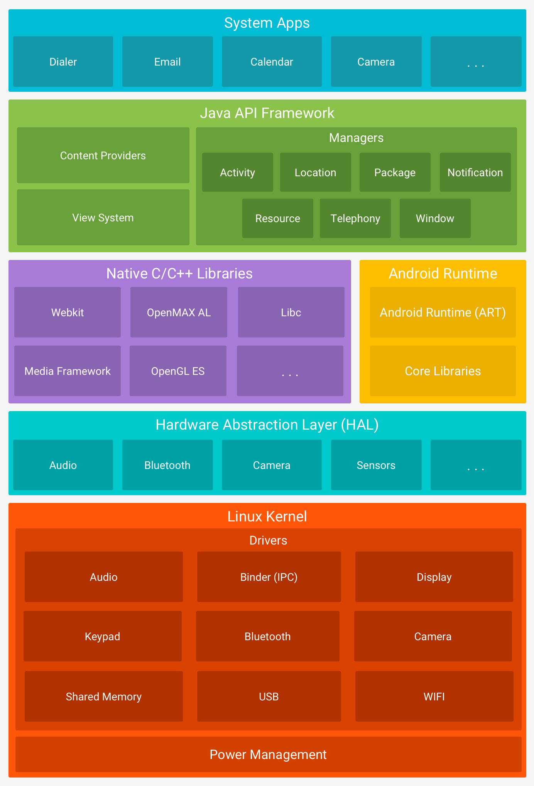

### 1. Android 系统架构

- 应用层
- 应用框架层
- 系统运行库层
- 硬件抽象层
- Linux 内核层

	

> 【演进】分层的现代关键词：
> - **Treble（8.0+）**：vendor 与 framework 用 HIDL/AIDL 接口隔离，加快系统升级；
> - **Project Mainline（10+）**：ART、媒体编解码、 conscrypt 等核心组件模块化为 **APEX**，经应用商店直接更新，不必等 OTA；
> - **GKI（12+）**：通用内核镜像，统一内核基线；
> - 框架本身 Jetpack 化（androidx 独立迭代），"分层"正演进为"模块化 + 接口化"。

### 2. Android 各个版本特性

1. Android 5

   引入 Material Design、ART、优化通知栏、弃用 HTTP 类、增强 WebView、TLS / SSL 默认配置变更。

2. Android 6

   运行时权限、低电耗模式、应用待机模式、指纹身份验证。

3. Android 7

   SurfaceView、更多的表情支持、多窗口支持、通知增强功能。

4. Android 8

   后台执行限制、后台位置限制、画中画模式、可下载字体、自动调整 TextView 的大小、自适应图标、新增权限。

5. Android 9

   对使用非 SDK 接口的限制、电池管理、强制执行 FLAG_ACTIVITY_NEW_TASK 要求、利用 WI-FI 进行室内定位、全面屏支持、适用于可绘制图像和位图的 ImageDecoder、引入 AnimatedImageDrawable 类，用于绘制和显示 GIF 和 WebP 图像。

6. Android 10

   暗色主题、全面手势导航、**Scoped Storage（分区存储）**、折叠屏与多屏支持、桌面模式、Live Caption。

7. Android 11

   一次性权限 / 自动重置未使用权限、气泡通知（Bubbles）、内置录屏、内置屏幕翻转？——重点是**隐私工具面板**与分区存储强制启用、对话置顶。

8. Android 12

   **Material You** 动态取色、**Splash Screen API** 统一启动画面、通知 trampoline 限制（点通知不能经服务/广播中转拉 Activity）、蓝牙权限细分、Performance Class 设备性能分级。

9. Android 13

   **通知运行时权限（POST_NOTIFICATIONS）**、按应用单独设置语言、自适应图标的单色主题化（跟随 Material You）、照片选择器（Photo Picker，无需全部媒体权限）、预测性返回预览。

10. Android 14

    **前台服务必须声明 foregroundServiceType** 并申请对应权限、部分媒体访问权限（READ_MEDIA_VISUAL_USER_SELECTED）、语法性别（Grammatical Inflection）、App 数据目录禁止写入可执行文件。

### 3. Android 系统启动流程

1. init 进程启动过程
   1. 创建和挂载启动所需的文件目录
   2. 初始化和启动属性服务
   3. 解析 init.rc 配置文件并启动 Zygote 进程
2. Zygote 进程启动过程
   1. 创建 AppRuntime 并调用 start 方法，启动 Zygote 进程
   2. 创建 Java 虚拟机并为 Java 虚拟机注册 JNI 方法
   3. 通过 JNI 调用 ZygoteInit 的 main 方法进入 Zygote 的 Java 框架层
   4. 通过 registerZygoteSocket 方法创建服务端 Socket，并通过 runSelectLoop 方法等待 AMS 的请求来创建新的应用程序进程
   5. 启动 SystemServer 进程
3. SystemServer 处理过程
   1. 启动 Binder 线程池，这样就可以与其他进程进行通信
   2. 启动 SystemServiceManager，其用于对系统的服务进程创建、启动和生命周期管理
   3. 启动各种启动服务
4. Launcher 启动过程

### 4. 应用程序进程启动过程

启动过程可以分为两步：

1. AMS 发送启动应用程序进程请求

   AMS 如果想要启动应用程序进程，就需要向 Zygote 进程发送创建应用程序进程的请求，AMS 会通过调用 startProcessLocked 方法向 Zygote 进程发送请求。

2. Zygote 接收请求并创建应用程序进程

### 5. Activity 状态的保存与恢复

其实就是 onSaveInstanceState 和 onRestoreInstanceState 方法的使用。不过需要注意的是 onRestoreInstanceState 方法时，应当先调用 super 方法，这样由系统负责保存的部分才能够恢复，比如文本输入类型控件的输入文本以及光标位置。

整个保存 View 状态的流程如下：

1. 调用 Activity 的 onSaveInstanceState 方法
2. 该方法又调用 mWindow.saveHierarchyState，把返回的结果保存到 WINDOW_HIERARCHY_TAG 这个 key 对应的 value 中
3. mWindow 的实现类 PhoneWindow 当中，调用根布局的 saveHierarchyState 方法，这里面会从根布局按树形结构遍历，调用每个 ViewGroup / View 的 onSaveInstanceState。

于是，我们得出结论，保存的前提有两个：

1. View 的子类必须实现了 onSaveInstanceState
2. 它必须要有一个 ID，这个 ID 作为 Bundle 的 key，这也为我们实现自定义 View 时，需要保存状态提供了思路。

onSaveInstanceState 调用时机：

在 onPause() 方法之后，和 onStop() 方法没有既定的时序关系。

onRestoreInstanceState 调用时机：

在 onStart() 方法之后，onResume() 之前。

> 【演进】现代状态保存的分工：
> - **配置变化（旋转屏幕）**：数据放 **ViewModel**——它在配置变化中存活，不必把大对象塞进 Bundle；
> - **进程被杀重建**：ViewModel 会丢，用 **SavedStateHandle**（ViewModel 内置的持久化键值对，底层仍是 onSaveInstanceState 那套）；
> - 时序说明：targetSdk 28+ 起 onSaveInstanceState 固定在 **onStop 之后**调用（更早版本在 onPause 与 onStop 之间）。

### 6. Android 动画框架实现原理

- **View 动画（补间动画）**：只改变 View 的**绘制效果**（通过矩阵变换），不改变真实的布局属性——所以位移动画后点击区域还在原处；包含 alpha/scale/translate/rotate；
- **属性动画（3.0+，推荐）**：ValueAnimator 通过 Choreographer 按垂直同步信号逐帧计算插值，回调更新目标属性，**真正修改属性值**；ObjectAnimator 通过反射调用 setter；
- **帧动画**：AnimationDrawable 顺序切换一组 Drawable；
- 新旧动画可以配合：用属性动画做状态，View 动画做过渡。

### 7. requestLayout、onLayout、onDraw、drawChild 区别与联系

- **requestLayout()**：标记自身尺寸可能变化，沿父链向上传递直到 ViewRootImpl，触发下一次 performTraversals（重新 measure/layout，一般也伴随重绘）；
- **onLayout()**：布局阶段回调，ViewGroup 在这里确定每个子 View 的位置（调用 child.layout）；
- **onDraw()**：绘制阶段回调，用 canvas/paint 画出内容；不要在其中创建对象或做耗时操作；
- **drawChild()**：ViewGroup 绘制子元素的方法（dispatchDraw 遍历调用，应用子 View 的平移/裁剪/动画变换后再 draw）；
- 联系：requestLayout 走 measure→layout→draw 全流程；invalidate 只触发 draw。

### 8. requestLayout、invalidate、postInvalidate 的区别

1. requestLayout 会回掉 onMeasure、onLayout、onDraw（ViewGroup.setWillNotDraw(fasle)情况下）方法
2. invalidate 只会回掉 onDraw 方法
3. postInvalidate 只会回掉 onDraw 方法（可以在非 UI 线程中调用）

### 9. Activity、Window、View 的区别以及联系

- **Activity**：四大组件之一，负责生命周期与用户交互的调度者，本身不直接绘制界面；
- **Window**：视图的容器，每个 Activity 持有一个 PhoneWindow，是 View 体系的承载与窗口管理（WMS）的接口；
- **View**：UI 绘制的基本单元，DecorView 是 Window 内部的根 View，setContentView 的布局挂在 DecorView 的 content 区域；
- 关系链：Activity → PhoneWindow → DecorView → 内容 View 树，三者配合完成 measure/layout/draw。

### 10. Volley 的理解

Google 2013 年推出的网络库，定位**高频、小数据量**的网络请求（JSON、图片）：

- 架构：RequestQueue + 缓存线程（CacheDispatcher）+ 默认 4 个网络线程（NetworkDispatcher），请求按优先级调度；磁盘缓存默认开启；
- Request 抽象：StringRequest / JsonObjectRequest / ImageRequest，ResponseDelivery 用 Handler 把结果切回主线程；
- 不适合大文件的上传下载；
- 底层 HttpStack 可插拔（HttpURLConnection 或 HttpClient）；如今一般直接用 OkHttp/Retrofit（Android 4.4 起 HttpURLConnection 的实现本来就是 OkHttp）。

### 11. 如何优化自定义 View

- **onDraw 里不创建对象**（Paint 等提前初始化复用），避免 GC 抖动；
- 控制 invalidate 范围（clipRect / invalidate(Rect)），减少重绘面积；requestLayout 尽量少触发（会引发整树测量布局）；
- 减少布局层级：merge、ViewStub、扁平化自定义组合控件；
- 减少过度绘制：移除多余的 background，用 canvas.clipRect 裁剪；
- 图片用采样/缓存（BitmapFactory.Options、内存复用 inBitmap），列表中 onViewRecycled 及时回收；
- 滑动流畅性配合硬件加速与 postInvalidateOnAnimation。

### 12. 低版本如何实现高版本 API

- **官方兼容库（AndroidX / Support Library）**：NotificationCompat、AppCompat 等内部按 `Build.VERSION.SDK_INT` 分发——新版本走系统 API，旧版本走等价兼容实现，这是标准做法；
- 自己写：`if (Build.VERSION.SDK_INT >= Build.VERSION_CODES.XXX)` 分支 + `@RequiresApi` 注解（lint 会检查）；
- 平台 API 侧面：`@Hide`/反射不可靠且受限（非 SDK 接口限制）；
- 本质：新 API 的"效果"在高版本用系统能力、低版本用自己实现的降级方案。

### 13. 描述一次网络请求的过程

以 OkHttp 为例：请求经**拦截器链**（重试与重定向 → 桥（补 header）→ 缓存 → 连接 → 服务器调用）后：

1. **DNS 解析**：域名 → IP（系统 DNS，Android 上经 netd 代查）；
2. **TCP 连接**：三次握手建立连接（连接池可复用）；
3. **TLS 握手**（https）：证书校验、密钥协商；
4. **发送 HTTP 报文** → 服务端处理 → **返回响应**；
5. 客户端解析（缓存判断、Gzip 解压、JSON 反序列化），回调到主线程刷新 UI。

路由器层面的 ARP、NAT 以及 HTTP 的版本差异（1.1 长连接 / 2 多路复用）是加分项。

### 14. HttpUrlConnection 与 OkHttp 的关系

- **HttpURLConnection**：Android 自带的 HTTP 客户端（JDK 的 URL 体系）；
- **OkHttp**：Square 的网络库，连接池、HTTP/2、Gzip、响应缓存、拦截器、失败重试；
- 关系：**Android 4.4 起 HttpURLConnection 的底层实现就是 OkHttp**（系统把它接到了 OkHttp 上）；OkHttp 也提供过返回 HttpURLConnection 的包装工厂；
- 结论：两者早已"同源"，新项目直接用 OkHttp（或 Retrofit + OkHttp）获得更完整的特性与可控性。

### 15. Bitmap 的理解

- **内存大小 ≈ 宽 × 高 × 单像素字节数**：ARGB_8888 为 4 字节、RGB_565 为 2 字节、ALPHA_8 为 1 字节；注意 drawable 目录的 density 会让图片被缩放加载；
- **加载优化**：先用 inJustDecodeBounds 拿到尺寸，再按目标大小算 inSampleSize 采样解码；对透明度无要求可用 RGB_565；inBitmap 复用内存块；
- **缓存**：内存用 LruCache，磁盘用 DiskLruCache（Glide/Fresco 内部就是这么做的，还带了生命周期关联的请求取消）；
- 及时 recycle（低版本）并避免主线程解码大图。

### 16. Looper 架构

- **每线程一个 Looper**（ThreadLocal 保存），`prepare()` 创建（主线程由 `Looper.prepareMainLooper()` 在 ActivityThread 中创建），`loop()` 开启分发循环；
- **MessageQueue**：按 when 排序的单链表；空闲时通过 native 的 epoll 挂起（nextPollTimeout），不空转；
- **Message 复用**：obtain() 从对象池取，避免频繁分配；
- 一个线程一个 Looper 一个队列，可挂多个 Handler；Handler 持有 Looper 与 Callback；
- 注意内存泄漏：非静态内部类 Handler 持有外部引用 → 静态类 + WeakReference，onDestroy 里 removeCallbacksAndMessages。

### 17. ActivityThread 的工作原理

- 入口 `main()`：`Looper.prepareMainLooper()` → 创建 ActivityThread（保存到 sCurrentActivityThread）→ `Looper.loop()` 开启主线程消息循环，**主线程的消息循环是永远不退出的**；
- 与 AMS 通信：ApplicationThread 是 ActivityThread 暴露给 AMS 的 **Binder 接口**，AMS 的调度（scheduleLaunchActivity / scheduleResumeActivity...）经它转成 Handler 消息，由内部 Handler `H` 切回主线程处理；
- `handleLaunchActivity` → `performLaunchActivity`（创建 Activity 实例、attach(PhoneWindow)、onCreate）→ `handleResumeActivity`（onResume 并把 DecorView 添加到 WindowManager）；
- Application、Activity、Service 的生命周期回调都在这套消息驱动下执行——**ANR 本质就是主线程消息处理超时**。

### 18. AMS 的工作原理

ActivityManagerService 运行在 system_server，是**四大组件调度与进程管理的中枢**：

- 与应用通过 Binder 通信（IActivityManager，客户端代理 ActivityManagerNative/ActivityManager）；
- Activity 启动链路：Instrumentation.execStartActivity → AMS.startActivity → 权限/任务栈（TaskRecord/ActivityRecord）处理 → 通过应用进程的 ApplicationThread.scheduleLaunchActivity 回到客户端（ActivityThread 的 H 处理，见第 17 题）；
- 进程管理：进程 LRU 列表与优先级（oom_adj），配合 LowMemoryKiller 回收；
- ANR 判定也由 AMS 超时机制触发（主线程处理超时发 ANR 消息）。

### 19. WMS 的工作原理

WindowManagerService 运行在 system_server，是所有窗口的**管理中心**：

- 职责：窗口的添加/删除（WindowState）、层级（Z-order）与布局计算、窗口动画、触摸事件派发的目标确定；
- 通信：ViewRootImpl 通过 IWindowSession（Binder）调用 WMS 的 addWindow / relayoutWindow；
- 协作：向 SurfaceFlinger 申请 Surface（图层）供 View 绘制上屏；与 InputManager 配合把触摸事件按窗口派发；
- Activity 界面显示链路：setContentView → ViewRootImpl.setView → WMS relayout → 拿到 Surface → measure/layout/draw → SurfaceFlinger 合成。

### 20. 自定义 View 如何考虑机型适配

- 尺寸用 **dp/sp** 资源（dimen + `getDimensionPixelSize`），支持不同屏幕宽度的 values-swXXXdp 限定符；不要写死 px；
- onMeasure 正确处理 **wrap_content 与 padding**（默认 setMeasuredDimension 的行为是内容尺寸）；
- 绘制考虑 **density**：px = dp × density；Bitmap 加载按目标尺寸采样；
- 文字用 sp（跟随用户字号），必要时 clamp 最大宽度（ellipsize 思想）；
- 极端屏幕（折叠屏/平板）用比例或 ConstraintLayout 百分比约束；
- 加分项：深色模式适配、无障碍（contentDescription）、大字体不裁剪。

### 21. 自定义 View 的事件

- **分发流程**：dispatchTouchEvent →（ViewGroup）onInterceptTouchEvent → onTouchEvent；一旦 onTouchEvent 返回 true（消费），同一序列的后续事件都交给它；
- 处理触摸：重写 onTouchEvent / onTouch；滑动用 Scroller + computeScroll 配合 invalidate；速度用 VelocityTracker；复杂手势用 GestureDetector；
- **滑动冲突**：外部拦截法（父容器在 onInterceptTouchEvent 中按需拦截）、内部拦截法（子 View 调 requestDisallowInterceptTouchEvent，配合父容器重写 onInterceptTouchEvent）；
- 多指：用 pointerId 跟踪（getActionMasked / findPointerIndex）。

### 22. LaunchMode 应用场景

- **standard**：默认，普通页面；
- **singleTop**：栈顶复用——推送通知点击打开的落地页、聊天消息页，避免连点产生多个实例（走 onNewIntent）；
- **singleTask**：栈内复用并清掉它之上的 Activity——常用于**主页/首页**（从任何深处返回主页，清空其上任务）、支付收银台；
- **singleInstance**：独占一个任务栈、全局唯一——系统级全局页（历史上如电话拨号界面），业务中很少用；
- 相关 flag：FLAG_ACTIVITY_CLEAR_TOP（配合 singleTop 实现清栈回退）、FLAG_ACTIVITY_SINGLE_TOP。

### 23. SpareArray 原理

（正确拼写是 **SparseArray**）Android 特有的 `int → Object` 映射，替代 `HashMap<Integer, V>`：

- 结构：两个平行数组——`mKeys（int[]）`与 `mValues（Object[]）`，**key 有序存放**，读写用**二分查找**（ContainerHelpers.binarySearch）；
- 优势：key 是基本类型 int，**避免自动装箱**；没有 Entry 对象、没有负载因子，内存占用远小于 HashMap；
- 劣势：二分 O(log n)、插入要 System.arraycopy 移动元素，**数据量大（一般几百以上）性能反而不如 HashMap**；删除是 DELETED 标记延迟整理；
- 家族：SparseBooleanArray / SparseIntArray / SparseLongArray；ArrayMap 同样是双数组省内存思路（hash 索引 + 环形数组）。

### 24. ContentProvider 是如何实现数据共享的

- 本质是一套**标准化的 Binder C/S 数据接口**：提供方在自己的进程实现 CRUD，以 authority（全局唯一）向系统注册（AMS 的 ProviderMap 管理）；
- 访问方 `getContentResolver().query(uri, ...)` → AMS 按 authority 找到目标进程（进程未启动会先拉起）→ Binder 调用转发到提供方的实现；
- **URI 寻址**：`content://authority/path/id`，UriMatcher 匹配到表/记录；返回 Cursor，大数据经 CursorWindow（共享内存）跨进程传输；
- 支持读/写权限分离（readPermission / writePermission）与 grantUriPermission；
- 数据变化通过 `notifyChange` + ContentObserver 通知（详见 Android_Binder 的 ContentProvider 一节）。

### 25. Service 与 Activity 的通信方式

- **bindService + ServiceConnection**（最常用）：onBind 返回 IBinder，同进程直接强转成 Binder 类型调用方法，还能拿到 Service 实例；
- **跨进程**：AIDL 定义接口（自动生成 Stub/Proxy）或 Messenger（Handler 封装，串行消息）；
- **广播**：Service 发送、Activity 动态注册接收，适合单向低频通知（LocalBroadcastManager 已废弃，可用 LiveData/Flow 替代）；
- 间接方式：startService 的 Intent 带数据、共享文件/SP/数据库；
- 不要忘了解绑时机（onDestroy 中 unbind，避免泄漏）。

### 26. IntentService 原理与作用

- 作用：在**工作线程串行**处理耗时任务的 Service，任务做完自动销毁，不用自己管理线程生命周期；
- 原理：onCreate 中创建 HandlerThread（自带 Looper 的工作线程）和 ServiceHandler；每次 onStartCommand 把 intent 包装成消息入队，ServiceHandler 在子线程回调 onHandleIntent(intent)；队列处理完调 stopSelf(id) 自动停止；
- 与普通 Service：Service 的回调在主线程（要做耗时必须自建线程），IntentService 帮你排队+后台执行+自动退出；
- 注意多次 start 是**串行**的（消息队列）；
- API 30 起已废弃：官方推荐 WorkManager（约束型任务）或协程。

### 27. ApplicationContext 与 ActivityContext 的区别

- **生命周期**：Application 的 context 与进程同寿；Activity 的与其绑定——**静态/单例持有 Activity context 会泄漏 Activity**；
- **能力差异**：Dialog 相关（show 一个 Dialog）、getContentTheme、startActivity（Application context 需加 FLAG_ACTIVITY_NEW_TASK）等依赖 Activity context，用 Application context 直接 show Dialog 会抛 BadTokenException；
- **共性**：资源访问、getContentResolver、启动 Service/发送广播等两者皆可；
- 原则：**能用 Application context 的场景就用 Application**（图片库、数据库单例等传 applicationContext）。

### 28. SP 是进程同步的嘛？如何做到进程同步？

**不是。** SharedPreferences 是进程内的单例缓存 + XML 文件，跨进程不安全：`MODE_MULTI_PROCESS` 早已名存实亡（只在重新加载时检查文件改动，无法实时同步），多进程读写会丢数据。

跨进程共享数据的做法：

- 用 **ContentProvider 封装**一层（所有进程都经它读写，串行化访问）；
- 换存储方案：**MMKV（基于 mmap，官方支持多进程）**、DataStore；
- 自行协调：AIDL/Messenger 通知 + 文件锁（FileLock），或干脆用数据库（SQLite 事务/行锁）；
- 首选：能不用 SP 跨进程就不用——设计上让每个进程持有各自的配置。

### 29. 谈谈多线程在 Android 中的应用

- **主线程只做 UI**：耗时操作放工作线程，否则 ANR（输入事件 5s / 广播 10s / Service 20s 超时）；
- 常用工具：Thread + Handler、**HandlerThread**（自带 Looper 的串行后台线程，适合 IntentService、EventBus）、**线程池**（ThreadPoolExecutor，AsyncTask 内部也是串行+并行的两个池）、**IntentService**（Service + HandlerThread，任务执行完自动 stop）；
- 线程通信：Handler / runOnUiThread / view.post；Kotlin 用**协程**（Dispatchers.Main / IO，结构化并发）；
- 典型场景：子线程做网络请求、数据库、Bitmap 解码，主线程刷新 UI；约束型后台任务（充电/WiFi）用 WorkManager。

### 30. 进程和 Application 的生命周期

- **Application 在每个进程中各创建一次**：多进程（android:process）时，每个进程有自己的虚拟机与 Application 实例，onCreate 会执行多次——按进程名初始化（区分主进程/push 进程，避免重复初始化推送等 SDK）；
- 进程优先级（oom_adj，由 AMS 维护）：前台 > 可见 > 服务 > 缓存进程，LowMemoryKiller 从低往高回收；
- 进程被杀（LMK / 用户划掉 / 崩溃）后，再次启动其中组件时**进程重建**：Application 重新走 onCreate，再执行组件；
- 前台 Service、正在广播等会提升优先级；onTrimMemory 可响应内存压力做释放。
