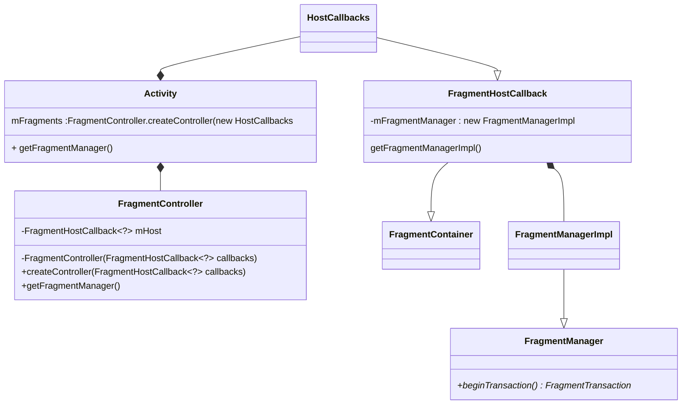
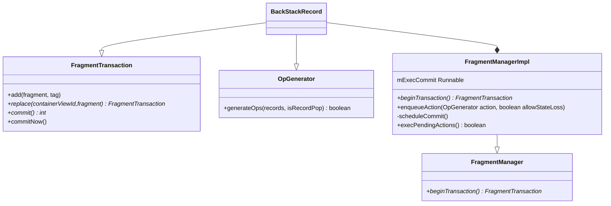

---


title:  fragment源码分析(一)
date:   2017/5/2
categories:
- Android
- Android源码分析
tags:
-  Android
-  fragment

---


基本使用
```java
activity.getSupportFragmentManager().beginTransaction().add(fragment,tag).commit();
```

###  FragmentManager的获取





```java
public class Activity{
    final FragmentController mFragments = FragmentController.createController(new HostCallbacks());
	
    public FragmentManager getFragmentManager() {
        return mFragments.getFragmentManager();
    }

    class HostCallbacks extends FragmentHostCallback<Activity> {
    
            public HostCallbacks() {
                super(Activity.this /*activity*/);
            }
    }  
}
```
>  FragmentHostCallback:Fragments may be hosted by any object; such as an **Activity**. In order to host fragments, implement **FragmentHostCallback**, overriding the methods applicable to the host.

<!-- more -->


FragmentHostCallback中的handler

```java
public abstract class FragmentHostCallback<E> extends FragmentContainer {
    private final Activity mActivity;
    final Context mContext;
    private final Handler mHandler;
    final int mWindowAnimations;

    FragmentHostCallback(Activity activity) {
        this(activity, activity /*context*/, activity.mHandler, 0 /*windowAnimations*/);
    }

    FragmentHostCallback(Activity activity, Context context, Handler handler,
            int windowAnimations) {
        mActivity = activity;
        mContext = context;
        mHandler = handler;
        mWindowAnimations = windowAnimations;
    }
}
```

```java
public abstract class FragmentHostCallback<E> extends FragmentContainer {
    final FragmentManagerImpl mFragmentManager = new FragmentManagerImpl();
	
    FragmentHostCallback(Activity activity) {
        this(activity, activity /*context*/, activity.mHandler, 0 /*windowAnimations*/);
    }

    FragmentManagerImpl getFragmentManagerImpl() {
        return mFragmentManager;
    }
    
    //Return the object that's currently hosting the fragment.
    public abstract E onGetHost();
    
}
```
```java
public abstract class FragmentContainer {
 
    @Nullable
    public abstract <T extends View> T onFindViewById(@IdRes int id);

    /**
     * Return {@code true} if the container holds any view.
     */
    public abstract boolean onHasView();

 
    public Fragment instantiate(Context context, String className, Bundle arguments) {
        return Fragment.instantiate(context, className, arguments);
    }
}
```
```java
public class FragmentController {
    private final FragmentHostCallback<?> mHost;
	
    public static final FragmentController createController(FragmentHostCallback<?> callbacks) {
        return new FragmentController(callbacks);
    }
    
    private FragmentController(FragmentHostCallback<?> callbacks) {
        mHost = callbacks;
    }
	
    public FragmentManager getFragmentManager() {
        return mHost.getFragmentManagerImpl();
    }
}
```

#### OpGenerator接口

**An add or pop transaction to be scheduled for the UI thread**

```java
final class FragmentManagerImpl extends FragmentManager implements LayoutInflater.Factory2{

    interface OpGenerator {
        boolean generateOps(ArrayList<BackStackRecord> records, ArrayList<Boolean> isRecordPop);
    }
}
```

### FragmentTransaction获取




```java
public abstract class FragmentManager {
    public abstract FragmentTransaction beginTransaction();
}
```
FragmentManagerImpl与FragmentManager在同一个文件中
```java
final class FragmentManagerImpl extends FragmentManager implements LayoutInflater.Factory2 {

    @Override
    public FragmentTransaction beginTransaction() {
        return new BackStackRecord(this);
    }   
 }
```
#### BackStackRecord
final class BackStackState和BackStackRecord同一个文件中
```java
final class BackStackRecord extends FragmentTransaction implements  FragmentManagerImpl.OpGenerator{

    final FragmentManagerImpl mManager;

    public BackStackRecord(FragmentManagerImpl manager) {
        mManager = manager;
    }  
}
```

#### add/replace
```java
final class BackStackRecord extends FragmentTransaction implements FragmentManagerImpl.OpGenerator{

    @Override
    public boolean generateOps(ArrayList<BackStackRecord> records, ArrayList<Boolean> isRecordPop) {
        records.add(this);
        isRecordPop.add(false);
        if (mAddToBackStack) {
            mManager.addBackStackState(this);
        }
        return true;
    }
    
    public FragmentTransaction add(Fragment fragment, String tag) {
        doAddOp(0, fragment, tag, OP_ADD);
        return this;
    }

    public FragmentTransaction add(int containerViewId, Fragment fragment, String tag) {
        doAddOp(containerViewId, fragment, tag, OP_ADD);
        return this;
    }

    public FragmentTransaction replace(int containerViewId, Fragment fragment) {
        return replace(containerViewId, fragment, null);
    }

    public FragmentTransaction replace(int containerViewId, Fragment fragment, String tag) {
        if (containerViewId == 0) {
            throw new IllegalArgumentException("Must use non-zero containerViewId");
        }
        doAddOp(containerViewId, fragment, tag, OP_REPLACE);
        return this;
    }

}
```
```java
final class BackStackRecord extends FragmentTransaction implements FragmentManagerImpl.OpGenerator{

    private void doAddOp(int containerViewId, Fragment fragment, String tag, int opcmd) {
        fragment.mFragmentManager = mManager;
        if (containerViewId != 0) {
            fragment.mContainerId = fragment.mFragmentId = containerViewId;
        }
        addOp(new Op(opcmd, fragment));
    }
    
}
```
```java
final class BackStackRecord extends FragmentTransaction implements FragmentManagerImpl.OpGenerator{

     static final class Op {
        int cmd;
        Fragment fragment;
        int enterAnim;
        int exitAnim;
        int popEnterAnim;
        int popExitAnim;
        
        Op() {}

        Op(int cmd, Fragment fragment) {
            this.cmd = cmd;
            this.fragment = fragment;
        } 
    }

    ArrayList<Op> mOps = new ArrayList<>();
	
    void addOp(Op op) {
       mOps.add(op);
       op.enterAnim = mEnterAnim;
       op.exitAnim = mExitAnim;
       op.popEnterAnim = mPopEnterAnim;
       op.popExitAnim = mPopExitAnim;
    }

}
```
#### commit

**BackStackRecord 通过 FragmentManagerImpl调用enqueueAction来执行后续添加操作**

```java
final class BackStackRecord extends FragmentTransaction implements FragmentManagerImpl.OpGenerator{

    public int commit() {
        return commitInternal(false);
    }
    
    int commitInternal(boolean allowStateLoss) {
        mManager.enqueueAction(this, allowStateLoss);
        return mIndex;	    
    }
    
}
```
### FragmentManagerImpl

enqueueAction会调用scheduleCommit，在scheduleCommit中实际是将当前的执行线程mExecCommit通过HostCallback中的handler去执行

```java
final class FragmentManagerImpl extends FragmentManager implements LayoutInflater.Factory2 {
	
    ArrayList<OpGenerator> mPendingActions;
    
    public void enqueueAction(OpGenerator action, boolean allowStateLoss) {
        synchronized (this) {
            if (mPendingActions == null) {
                mPendingActions = new ArrayList<>();
            }
            mPendingActions.add(action);
            scheduleCommit();
        }
    }
	
    //在activity创建的实现类，通过FragmentController传递过来
    FragmentHostCallback<?> mHost;
    
    private void scheduleCommit() {
        synchronized (this) {
            boolean postponeReady =mPostponedTransactions != null && !mPostponedTransactions.isEmpty();
            boolean pendingReady = mPendingActions != null && mPendingActions.size() == 1;
            if (postponeReady || pendingReady) {
                //handler获取
                mHost.getHandler().removeCallbacks(mExecCommit);
                mHost.getHandler().post(mExecCommit);
            }
        }
    }
	//mHost赋值
    public void attachController(FragmentHostCallback<?> host, FragmentContainer container, Fragment parent) {
        if (mHost != null) throw new IllegalStateException("Already attached");
        mHost = host;
        mContainer = container;
        mParent = parent;
    }

    Runnable mExecCommit = new Runnable() {
        @Override
        public void run() {
            execPendingActions();
        }
    };    	    	
}
```


#### 具体执行方法execPendingActions

```java
final class FragmentManagerImpl extends FragmentManager{
    // Temporary vars for removing redundant operations in BackStackRecords:
    ArrayList<BackStackRecord> mTmpRecords;
    ArrayList<Boolean> mTmpIsPop;
    ArrayList<Fragment> mTmpAddedFragments;
    
    /**
     * Only call from main thread!
     */
    public boolean execPendingActions() {
        //2.1
        ensureExecReady(true);
        
        boolean didSomething = false;
        //2.2
        while (generateOpsForPendingActions(mTmpRecords, mTmpIsPop)) {
            mExecutingActions = true;
            try {
                removeRedundantOperationsAndExecute(mTmpRecords, mTmpIsPop);
            } finally {
                cleanupExec();
            }
            didSomething = true;
        }
		
        //2.3
        doPendingDeferredStart();
        burpActive();

        return didSomething;
    }

}
```


##### 2.1  ensureExecReady(true)
```java
final class FragmentManagerImpl extends FragmentManager implements LayoutInflater.Factory2{

    boolean mExecutingActions;

    private void ensureExecReady(boolean allowStateLoss) {
        if (mExecutingActions) {
            throw new IllegalStateException("FragmentManager is already executing transactions");
        }

        if (Looper.myLooper() != mHost.getHandler().getLooper()) {
            throw new IllegalStateException("Must be called from main thread of fragment host");
        }

        if (!allowStateLoss) {
            checkStateLoss();
        }

        if (mTmpRecords == null) {
            mTmpRecords = new ArrayList<>();
            mTmpIsPop = new ArrayList<>();
        }
        mExecutingActions = true;
        try {
            executePostponedTransaction(null, null);
        } finally {
            mExecutingActions = false;
        }
    }
    
    
    private void checkStateLoss() {
        if (mStateSaved) {
            throw new IllegalStateException(
                    "Can not perform this action after onSaveInstanceState");
        }
        if (mNoTransactionsBecause != null) {
            throw new IllegalStateException(
                    "Can not perform this action inside of " + mNoTransactionsBecause);
        }
    }
    
}
```
##### 2.2 generateOpsForPendingActions(ArrayList<BackStackRecord> records,ArrayList<Boolean> isPop)
```java
final class FragmentManagerImpl extends FragmentManager implements LayoutInflater.Factory2{

    ArrayList<OpGenerator> mPendingActions;
    
    //Adds all records in the pending actions to records and whether they are add or pop operations to isPop. After executing, the pending actions will be empty.
    private boolean generateOpsForPendingActions(ArrayList<BackStackRecord> records,ArrayList<Boolean> isPop) {
        boolean didSomething = false;
        synchronized (this) {
            if (mPendingActions == null || mPendingActions.size() == 0) {
                return false;
            }

            final int numActions = mPendingActions.size();
            for (int i = 0; i < numActions; i++) {
                didSomething |= mPendingActions.get(i).generateOps(records, isPop);
            }
            //清除
            mPendingActions.clear();
            mHost.getHandler().removeCallbacks(mExecCommit);
        }
        return didSomething;
    }
    
    
    //mPendingActions赋值
    public void enqueueAction(OpGenerator action, boolean allowStateLoss) {
        if (!allowStateLoss) {
            checkStateLoss();
        }
        synchronized (this) {
            if (mDestroyed || mHost == null) {
                if (allowStateLoss) {
                    // This FragmentManager isn't attached, so drop the entire transaction.
                    return;
                }
                throw new IllegalStateException("Activity has been destroyed");
            }
            if (mPendingActions == null) {
                mPendingActions = new ArrayList<>();
            }
            mPendingActions.add(action);
            scheduleCommit();
        }
    }

    
}
```

##### PopBackStackState implements OpGenerator
```java
final class FragmentManagerImpl extends FragmentManager implements LayoutInflater.Factory2{

    Fragment mPrimaryNav;

    private class PopBackStackState implements OpGenerator {
        final String mName;
        final int mId;
        final int mFlags;

        public PopBackStackState(String name, int id, int flags) {
            mName = name;
            mId = id;
            mFlags = flags;
        }

        @Override
        public boolean generateOps(ArrayList<BackStackRecord> records,ArrayList<Boolean> isRecordPop) {
            if (mPrimaryNav != null // We have a primary nav fragment
                    && mId < 0 // No valid id (since they're local)
                    && mName == null) { // no name to pop to (since they're local)
                final FragmentManager childManager = mPrimaryNav.mChildFragmentManager;
                if (childManager != null && childManager.popBackStackImmediate()) {
                    // We didn't add any operations for this FragmentManager even though a child did do work.
                    return false;
                }
            }
            return popBackStackState(records, isRecordPop, mName, mId, mFlags);
        }
    }

}
```

##### 2.3 doPendingDeferredStart()
```java
    void doPendingDeferredStart() {
        if (mHavePendingDeferredStart) {
            boolean loadersRunning = false;
            for (int i=0; i<mActive.size(); i++) {
                Fragment f = mActive.valueAt(i);
                if (f != null && f.mLoaderManager != null) {
                    loadersRunning |= f.mLoaderManager.hasRunningLoaders();
                }
            }
            if (!loadersRunning) {
                mHavePendingDeferredStart = false;
                //跳转方法
                startPendingDeferredFragments();
            }
        }
    }
```
```java
   void startPendingDeferredFragments() {
        if (mActive == null) return;

        for (int i=0; i<mActive.size(); i++) {
            Fragment f = mActive.valueAt(i);
            if (f != null) {
	            //主方法
                performPendingDeferredStart(f);
            }
   }
```
```java
    public void performPendingDeferredStart(Fragment f) {
        if (f.mDeferStart) {
            if (mExecutingActions) {
                // Wait until we're done executing our pending transactions
                mHavePendingDeferredStart = true;
                return;
            }
            f.mDeferStart = false;
            //fragment加载
            moveToState(f, mCurState, 0, 0, false);
        }
    }
```

### fragment加载的具体过程

```java
final class FragmentManagerImpl extends FragmentManager implements LayoutInflater.Factory2 {
    void moveToState(Fragment f, int newState, int transit, int transitionStyle,boolean keepActive) {
        ...
        if (f.mState <= newState) {
            ...
            //4.1
            switch (f.mState) {
                case Fragment.INITIALIZING:
                ...
                
            }
        } else if (f.mState > newState) {
            //4.2
        
        }
        ....
    }

}
```
##### 4.1 if (f.mState <= newState)
```java
switch (f.mState) {
   
    case Fragment.INITIALIZING:
    
        if (newState > Fragment.INITIALIZING) {
            ...
            f.mHost = mHost;
            f.mParentFragment = mParent;
            f.mFragmentManager = mParent != null? mParent.mChildFragmentManager : mHost.getFragmentManagerImpl();
            ...
            //OnFragmentPreAttached
            dispatchOnFragmentPreAttached(f, mHost.getContext(), false);
            f.mCalled = false;
            f.onAttach(mHost.getContext());
            if (!f.mCalled) {
               throw new SuperNotCalledException("Fragment " + f + " did not call through to super.onAttach()");
            }
            if (f.mParentFragment == null) {
               mHost.onAttachFragment(f);
            } else {
               f.mParentFragment.onAttachFragment(f);
            }
            //OnFragmentAttached生命周期
            dispatchOnFragmentAttached(f, mHost.getContext(), false);

            if (!f.mIsCreated) {
               dispatchOnFragmentPreCreated(f, f.mSavedFragmentState, false);
               //onCreate生命周期
               f.performCreate(f.mSavedFragmentState);
               dispatchOnFragmentCreated(f, f.mSavedFragmentState, false);
            } else {
               f.restoreChildFragmentState(f.mSavedFragmentState, true);
               f.mState = Fragment.CREATED;
            }
            f.mRetaining = false;
         }
         
         
         
     case Fragment.CREATED:  
        ensureInflatedFragmentView(f);
        if (newState > Fragment.CREATED) {
        
            if (!f.mFromLayout) {
                ViewGroup container = null;
                if (f.mContainerId != 0) {
                    container = mContainer.onFindViewById(f.mContainerId);
                }
                f.mContainer = container;
                f.mView = f.performCreateView(f.performGetLayoutInflater(f.mSavedFragmentState), container, f.mSavedFragmentState);
                
                 if (f.mView != null) {
                    f.mView.setSaveFromParentEnabled(false);
                    if (container != null) {
                        container.addView(f.mView);
                    }
                    if (f.mHidden) {
                        f.mView.setVisibility(View.GONE);
                    }
                    f.onViewCreated(f.mView, f.mSavedFragmentState);dispatchOnFragmentViewCreated(f, f.mView, f.mSavedFragmentState,false);
                    ...
                 }
            }
            //ActivityCreated
            f.performActivityCreated(f.mSavedFragmentState);
            dispatchOnFragmentActivityCreated(f, f.mSavedFragmentState, false);
            ....     
        }
        
        
        
        case Fragment.ACTIVITY_CREATED:
            if (newState > Fragment.ACTIVITY_CREATED) {
                f.mState = Fragment.STOPPED;
            }
            
         case Fragment.STOPPED:
            if (newState > Fragment.STOPPED) {                       
                f.performStart();
                dispatchOnFragmentStarted(f, false);
            }
                   
         case Fragment.STARTED:
            if (newState > Fragment.STARTED) {                      
                f.performResume();
                dispatchOnFragmentResumed(f, false);
                // Get rid of this in case we saved it and never needed it.
                f.mSavedFragmentState = null;
                f.mSavedViewState = null;
            }
        
        
}
```
##### 4.2  if (f.mState > newState)
```java
switch (f.mState) {
    case Fragment.RESUMED:
        if (newState < Fragment.RESUMED) {                        
            f.performPause();
            dispatchOnFragmentPaused(f, false);
        }
        
    case Fragment.STARTED:
        if (newState < Fragment.STARTED) { 
            f.performStop();
            dispatchOnFragmentStopped(f, false);
        }
        
   case Fragment.STOPPED:
   case Fragment.ACTIVITY_CREATED:
        if (newState < Fragment.ACTIVITY_CREATED) {
            ...
            f.performDestroyView();
            dispatchOnFragmentViewDestroyed(f, false);
            ....动画加载
            f.mContainer = null;
            f.mView = null;
            f.mInLayout = false;
        }
        
    case Fragment.CREATED:
        if (newState < Fragment.CREATED) {
            if (mDestroyed) {
                if (f.getAnimatingAway() != null) {
                    //动画停止
                    Animator anim = f.getAnimatingAway();
                    f.setAnimatingAway(null);
                    anim.cancel();
                }
                if (f.getAnimatingAway() != null) {
                // // We are waiting for the fragment's view to finish animating away.  Just make a note of the state the fragment now should move to once the animation is done.
                    f.setStateAfterAnimating(newState);
                    newState = Fragment.CREATED;
                }
            }else{
            ...
            
            }
                                   
        }
          
          
```