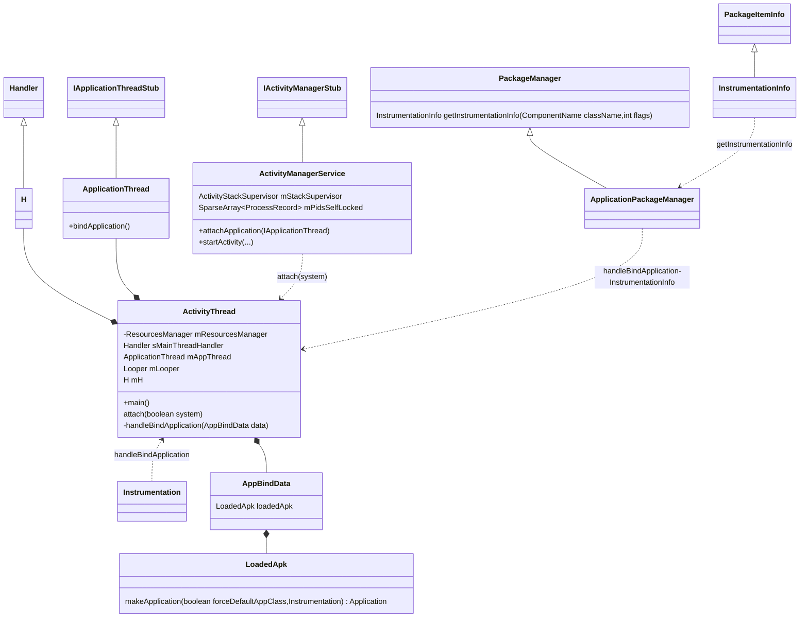
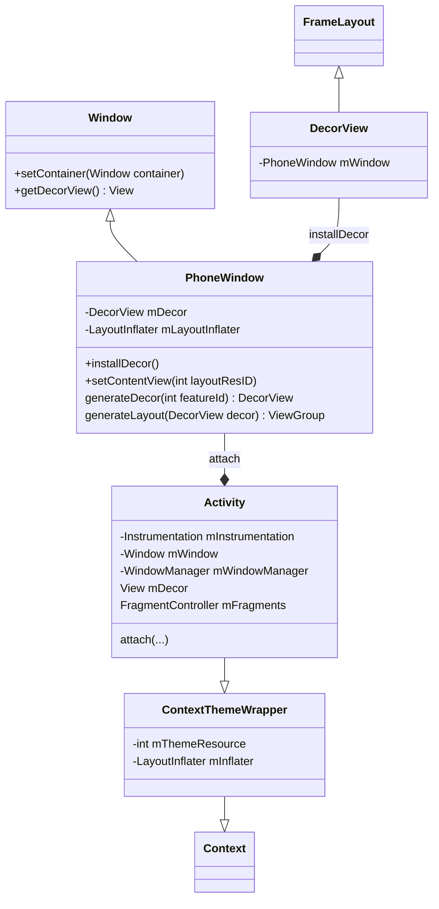

<!-- more -->

### ActivityThread

```java
public final class ActivityThread {
    private final ResourcesManager mResourcesManager;
    static volatile Handler sMainThreadHandler;  // set once in main()
    
    final ApplicationThread mAppThread = new ApplicationThread();
    final Looper mLooper = Looper.myLooper();
    final H mH = new H();
    
     Instrumentation mInstrumentation;
    
    
    ActivityThread() {
        mResourcesManager = ResourcesManager.getInstance();
    }
    
}
```

main方法：创建ActivityThread对象，UI线程的Loop循环开启

```java   
   public static void main(String[] args) {
       ....
        Looper.prepareMainLooper();
				 //创建
        ActivityThread thread = new ActivityThread();
        thread.attach(false);

        if (sMainThreadHandler == null) {
            sMainThreadHandler = thread.getHandler();
        }

        // End of event ActivityThreadMain.
        Trace.traceEnd(Trace.TRACE_TAG_ACTIVITY_MANAGER);
        Looper.loop();

        throw new RuntimeException("Main thread loop unexpectedly exited");
    }
```
 attach方法：AMS对象的绑定appThread
```java  
private void attach(boolean system) {
    if (!system) {
        ....
        //ActivityManagerService绑定
        final IActivityManager mgr = ActivityManager.getService();
            try {
                mgr.attachApplication(mAppThread);
            } catch (RemoteException ex) {
                throw ex.rethrowFromSystemServer();
            }
    }else {
           ....
          
    }
}
```


- handleBindApplication

```java   
   private void handleBindApplication(AppBindData data) {
		...
	// Instrumentation info affects the class loader, so load it before setting up the app context.
        final InstrumentationInfo ii;
        if (data.instrumentationName != null) {
            try {
                ii = new ApplicationPackageManager(null, getPackageManager()).getInstrumentationInfo(data.instrumentationName, 0);
            } catch (PackageManager.NameNotFoundException e) {
               ...
            }
            //InstrumentationInfo赋值
            mInstrumentationPackageName = ii.packageName;
            ....
        } else {
            ii = null;
        }

      ....
      final ContextImpl appContext = ContextImpl.createAppContext(this, data.loadedApk);
		...
       // Continue loading instrumentation.
        if (ii != null) {
            final ApplicationInfo instrApp = new ApplicationInfo();
            ii.copyTo(instrApp);
            instrApp.initForUser(UserHandle.myUserId());
            final LoadedApk loadedApk = getLoadedApk(instrApp, data.compatInfo,appContext.getClassLoader(), false, true, false);
            final ContextImpl instrContext = ContextImpl.createAppContext(this, loadedApk);

            try {
                //mInstrumentation的初始化
                final ClassLoader cl = instrContext.getClassLoader();
                mInstrumentation = (Instrumentation)cl.loadClass(data.instrumentationName.getClassName()).newInstance();
            } catch (Exception e) {
               ...
            }
           ....
        } else {
            mInstrumentation = new Instrumentation();
        }
		        	
        ....
        // Allow disk access during application and provider setup. This could block processing ordered broadcasts, but later processing would probably end up doing the same disk access.
        Application app;
        ...
       try {
            // If the app is being launched for full backup or restore, bring it up in
            // a restricted environment with the base application class.
            app = data.loadedApk.makeApplication(data.restrictedBackupMode, null);
            mInitialApplication = app;
            ...
            try {
                //Application 初始化
                mInstrumentation.callApplicationOnCreate(app);
            } catch (Exception e) {
                ....
            }
        
```
#### H(handler)

 - handleMessage


```java
public final class ActivityThread {
    private class H extends Handler {
        public static final int BIND_APPLICATION = 110;
		
        public void handleMessage(Message msg) {
            switch (msg.what) {
                case LAUNCH_ACTIVITY: {
                    final ActivityClientRecord r =(ActivityClientRecord) msg.obj;
                    r.loadedApk = getLoadedApkNoCheck(r.activityInfo.applicationInfo, r.compatInfo);
                    //activityThread的handleLaunchActivity方法
                    handleLaunchActivity(r, null, "LAUNCH_ACTIVITY");   
                } break;
                
                case BIND_APPLICATION:
                    AppBindData data = (AppBindData)msg.obj;
                    handleBindApplication(data);
                break;
                
        }
    }
	
}

```
-  sendMessage


```java
public final class ActivityThread {
      
    private void sendMessage(int what, Object obj) {
        sendMessage(what, obj, 0, 0, false);
    }

   private void sendMessage(int what, Object obj, int arg1, int arg2, boolean async) {
        Message msg = Message.obtain();
        msg.what = what;
        msg.obj = obj;
        msg.arg1 = arg1;
        msg.arg2 = arg2;
        if (async) {
            msg.setAsynchronous(true);
        }
        mH.sendMessage(msg);
   }
   
}
```

#### ApplicationThread
```java
public final class ActivityThread {
    private class ApplicationThread extends IApplicationThread.Stub {
    
        public final void bindApplication(String processName, ApplicationInfo appInfo, List<ProviderInfo> providers, ComponentName instrumentationName, ProfilerInfo profilerInfo, Bundle instrumentationArgs, IInstrumentationWatcher instrumentationWatcher, IUiAutomationConnection instrumentationUiConnection, int debugMode, boolean enableBinderTracking, boolean trackAllocation, boolean isRestrictedBackupMode, boolean persistent, Configuration config, CompatibilityInfo compatInfo, Map services, Bundle coreSettings, String buildSerial) {

            if (services != null) {
                // Setup the service cache in the ServiceManager
                ServiceManager.initServiceCache(services);
            }

            setCoreSettings(coreSettings);

            AppBindData data = new AppBindData();
            data.processName = processName;
            data.appInfo = appInfo;
            data.providers = providers;
            data.instrumentationName = instrumentationName;
            data.instrumentationArgs = instrumentationArgs;
            data.instrumentationWatcher = instrumentationWatcher;
            data.instrumentationUiAutomationConnection = instrumentationUiConnection;
            data.debugMode = debugMode;
            data.enableBinderTracking = enableBinderTracking;
            data.trackAllocation = trackAllocation;
            data.restrictedBackupMode = isRestrictedBackupMode;
            data.persistent = persistent;
            data.config = config;
            data.compatInfo = compatInfo;
            data.initProfilerInfo = profilerInfo;
            data.buildSerial = buildSerial;
            //通过activity下activityThread的handler发送消息处理
            sendMessage(H.BIND_APPLICATION, data);
        }
    }
}
```
####  performLaunchActivity
- handleLaunchActivity


```java
    private void handleLaunchActivity(ActivityClientRecord r, Intent customIntent, String reason) {
        // If we are getting ready to gc after going to the background, well we are back active so skip it.
        unscheduleGcIdler();
        mSomeActivitiesChanged = true;

        if (r.profilerInfo != null) {
            mProfiler.setProfiler(r.profilerInfo);
            mProfiler.startProfiling();
        }

        // Make sure we are running with the most recent config.
        handleConfigurationChanged(null, null);

        if (localLOGV) Slog.v(
            TAG, "Handling launch of " + r);

        // Initialize before creating the activity
        if (!ThreadedRenderer.sRendererDisabled) {
            GraphicsEnvironment.earlyInitEGL();
        }
        WindowManagerGlobal.initialize();

        Activity a = performLaunchActivity(r, customIntent);

        if (a != null) {
            r.createdConfig = new Configuration(mConfiguration);
            reportSizeConfigurations(r);
            Bundle oldState = r.state;
            handleResumeActivity(r.token, false, r.isForward,
                    !r.activity.mFinished && !r.startsNotResumed, r.lastProcessedSeq, reason);

            if (!r.activity.mFinished && r.startsNotResumed) {
                // The activity manager actually wants this one to start out paused, because it needs to be visible but isn't in the foreground. We accomplish this by going through the normal startup (because activities expect to go through onResume() the first time they run, before their window is displayed), and then pausing it.
                // However, in this case we do -not- need to do the full pause cycle (of freezing and such) because the activity manager assumes it can just retain the current state it has.
                performPauseActivityIfNeeded(r, reason);

                // We need to keep around the original state, in case we need to be created again. But we only do this for pre-Honeycomb apps, which always save their state when pausing, so we can not have them save their state when restarting from a paused state. For HC and later, we want to (and can) let the state be saved as the normal part of stopping the activity.
                if (r.isPreHoneycomb()) {
                    r.state = oldState;
                }
            }
        } else {
            // If there was an error, for any reason, tell the activity manager to stop us.
            try {
                ActivityManager.getService().finishActivity(r.token, Activity.RESULT_CANCELED, null,Activity.DONT_FINISH_TASK_WITH_ACTIVITY);
            } catch (RemoteException ex) {
                throw ex.rethrowFromSystemServer();
            }
        }
    }
```


```java
private Activity performLaunchActivity(ActivityClientRecord r, Intent customIntent) {
        // System.out.println("##### [" + System.currentTimeMillis() + "] ActivityThread.performLaunchActivity(" + r + ")");
        
  ....      
        
}
```

performLaunchActivity这个方法主要完成了如下几件事:
##### 1. 从ActivityClientRecord中获取待启动的Activity的组件信息

```java
    ActivityInfo aInfo = r.activityInfo;
    if (r.loadedApk == null) {
        r.loadedApk = getLoadedApk(aInfo.applicationInfo, r.compatInfo,
                Context.CONTEXT_INCLUDE_CODE);
    }

    ComponentName component = r.intent.getComponent();
    if (component == null) {
        component = r.intent.resolveActivity(
            mInitialApplication.getPackageManager());
        r.intent.setComponent(component);
    }

    if (r.activityInfo.targetActivity != null) {
        component = new ComponentName(r.activityInfo.packageName,
                r.activityInfo.targetActivity);
    }

```

##### 2. 通过Instrumentation的newActivity方法使用类加载器创建Activity对象

```java
    ContextImpl appContext = createBaseContextForActivity(r);
    Activity activity = null;
    try {
        java.lang.ClassLoader cl = appContext.getClassLoader();
        activity = mInstrumentation.newActivity(cl, component.getClassName(), r.intent);
        StrictMode.incrementExpectedActivityCount(activity.getClass());
        r.intent.setExtrasClassLoader(cl);
        r.intent.prepareToEnterProcess();
        if (r.state != null) {
            r.state.setClassLoader(cl);
        }
    } catch (Exception e) {
        if (!mInstrumentation.onException(activity, e)) {
            throw new RuntimeException("Unable to instantiate activity " + component+ ": " + e.toString(), e);
        }
    }
```

##### 3. 通过LoadedApk的makeApplication方法来尝试创建Application对象

```java
try {
        Application app = r.loadedApk.makeApplication(false, mInstrumentation);

        if (localLOGV) Slog.v(TAG, "Performing launch of " + r);
        if (localLOGV) Slog.v(TAG, r + ": app=" + app+ ", appName=" + app.getPackageName() + ", pkg=" + r.loadedApk.getPackageName() + ", comp=" + r.intent.getComponent().toShortString() + ", dir=" + r.loadedApk.getAppDir());
        
        .....
        // 见4.
        
         r.paused = true;
         mActivities.put(r.token, r);
    } catch (SuperNotCalledException e) {
        throw e;

    } catch (Exception e) {
        if (!mInstrumentation.onException(activity, e)) {
            throw new RuntimeException("Unable to start activity " + component+ ": " + e.toString(), e);
        }
    }                    
```
##### 4. 创建ContextImpl对象并通过Activity的attach方法来完成一些重要数据的初始化

```java
    if (activity != null) {
        CharSequence title = r.activityInfo.loadLabel(appContext.getPackageManager());
        Configuration config = new Configuration(mCompatConfiguration);
        if (r.overrideConfig != null) {
            config.updateFrom(r.overrideConfig);
        }
        if (DEBUG_CONFIGURATION) Slog.v(TAG, "Launching activity "
                + r.activityInfo.name + " with config " + config);
        Window window = null;
        if (r.mPendingRemoveWindow != null && r.mPreserveWindow) {
            window = r.mPendingRemoveWindow;
            r.mPendingRemoveWindow = null;
            r.mPendingRemoveWindowManager = null;
        }
        appContext.setOuterContext(activity);
        activity.attach(appContext, this, getInstrumentation(), r.token,
                r.ident, app, r.intent, r.activityInfo, title, r.parent,
                r.embeddedID, r.lastNonConfigurationInstances, config,
                r.referrer, r.voiceInteractor, window, r.configCallback);

        if (customIntent != null) {
            activity.mIntent = customIntent;
        }
        r.lastNonConfigurationInstances = null;
        checkAndBlockForNetworkAccess();
        activity.mStartedActivity = false;
        int theme = r.activityInfo.getThemeResource();
        if (theme != 0) {
            activity.setTheme(theme);
        }

        activity.mCalled = false;
        if (r.isPersistable()) {
            mInstrumentation.callActivityOnCreate(activity, r.state, r.persistentState);
        } else {
            mInstrumentation.callActivityOnCreate(activity, r.state);
        }
        if (!activity.mCalled) {
            throw new SuperNotCalledException(
                "Activity " + r.intent.getComponent().toShortString() +
                " did not call through to super.onCreate()");
        }
        r.activity = activity;
        r.stopped = true;
        if (!r.activity.mFinished) {
            activity.performStart();
            r.stopped = false;
        }
        if (!r.activity.mFinished) {
            if (r.isPersistable()) {
                if (r.state != null || r.persistentState != null) {
                    mInstrumentation.callActivityOnRestoreInstanceState(activity, r.state,
                            r.persistentState);
                }
            } else if (r.state != null) {
                mInstrumentation.callActivityOnRestoreInstanceState(activity, r.state);
            }
        }
        
        //通过Instrumentation调用activity的oncreate方法
        if (!r.activity.mFinished) {
            activity.mCalled = false;
            if (r.isPersistable()) {
                mInstrumentation.callActivityOnPostCreate(activity, r.state,
                        r.persistentState);
            } else {
                mInstrumentation.callActivityOnPostCreate(activity, r.state);
            }
            if (!activity.mCalled) {
                throw new SuperNotCalledException(
                    "Activity " + r.intent.getComponent().toShortString() +
                    " did not call through to super.onPostCreate()");
            }
        }
    }
```

### ActivityManager
#### ActivityManagerService的获取通过ActivityManager的IActivityManager.aidl完成
```java
public class ActivityManager {
    public static IActivityManager getService() {
        return IActivityManagerSingleton.get();
    }

    private static final Singleton<IActivityManager> IActivityManagerSingleton =new Singleton<IActivityManager>() {
        @Override
        protected IActivityManager create() {
            final IBinder b =ServiceManager.getService(Context.ACTIVITY_SERVICE);
            final IActivityManager am =IActivityManager.Stub.asInterface(b);
                return am;
            }
    };
}
```
### ActivityManagerService
```java
public class ActivityManagerService extends IActivityManager.Stub implements Watchdog.Monitor, BatteryStatsImpl.BatteryCallback {
    
     /** Run all ActivityStacks through this */
    final ActivityStackSupervisor mStackSupervisor;
    
    //All of the processes we currently have running organized by pid
    final SparseArray<ProcessRecord> mPidsSelfLocked = new SparseArray<ProcessRecord>();
    
    final ActivityStarter mActivityStarter;
    
    @VisibleForTesting
    public ActivityManagerService(Injector injector) {
        ...
    }
    
    //This method is invoked on the main thread but may need to attach various handlers to other threads.  So take care to be explicit about the looper.
    public ActivityManagerService(Context systemContext) {
     
    }

}
```
#### attachApplication
```java
@Override
public final void attachApplication(IApplicationThread thread) {
    synchronized (this) {
        //通过Binder获取pid
        int callingPid = Binder.getCallingPid();
        final long origId = Binder.clearCallingIdentity();
        //跳转方法
        attachApplicationLocked(thread, callingPid);
        Binder.restoreCallingIdentity(origId);
    }
}
```
```java
private final boolean attachApplicationLocked(IApplicationThread thread,int pid) {
    // Find the application record that is being attached  either via  the pid if we are running in multiple processes, or just pull the next app record if we are emulating process with anonymous threads.
    ProcessRecord app;
    long startTime = SystemClock.uptimeMillis();
    if (pid != MY_PID && pid >= 0) {
        synchronized (mPidsSelfLocked) {
            //通过pid查找进程
            app = mPidsSelfLocked.get(pid);
        }
    }else {
        app = null;
    }
    if (app == null) {
        ...
        if (pid > 0 && pid != MY_PID) {
            killProcessQuiet(pid);
        }else {
            try {
                thread.scheduleExit();
            } catch (Exception e) {
                // Ignore exceptions.
            }
        }
        return false;
    }
    ....
    
    // If this application record is still attached to a previous  process, clean it up now.
    if (app.thread != null) {
        handleAppDiedLocked(app, true, true);
    }    
    ...
    
    app.makeActive(thread, mProcessStats);
    app.curAdj = app.setAdj = app.verifiedAdj = ProcessList.INVALID_ADJ;
    app.curSchedGroup = app.setSchedGroup = ProcessList.SCHED_GROUP_DEFAULT;
    app.forcingToImportant = null;
    updateProcessForegroundLocked(app, false, false);
    app.hasShownUi = false;
    app.debugging = false;
    app.cached = false;
    app.killedByAm = false;
    app.killed = false;
    
    app.unlocked = StorageManager.isUserKeyUnlocked(app.userId);

    mHandler.removeMessages(PROC_START_TIMEOUT_MSG, app);
    ...
    
    
    try {
        ...
        ApplicationInfo appInfo = app.instr != null ? app.instr.mTargetInfo : app.info;
        ...
    
    
        //绑定到application
        if (app.instr != null) {
            thread.bindApplication(processName, appInfo, providers,
                    app.instr.mClass,
                    profilerInfo, app.instr.mArguments,
                    app.instr.mWatcher,
                    app.instr.mUiAutomationConnection, testMode,
                    mBinderTransactionTrackingEnabled, enableTrackAllocation,
                    isRestrictedBackupMode || !normalMode, app.persistent,
                    new Configuration(getGlobalConfiguration()), app.compat,
                    getCommonServicesLocked(app.isolated),
                    mCoreSettingsObserver.getCoreSettingsLocked(),
                    buildSerial);
        }else {
            thread.bindApplication(processName, appInfo, providers, null, profilerInfo,
                null, null, null, testMode,
                mBinderTransactionTrackingEnabled, enableTrackAllocation,
                isRestrictedBackupMode || !normalMode, app.persistent,
                new Configuration(getGlobalConfiguration()), app.compat,
                getCommonServicesLocked(app.isolated),
                mCoreSettingsObserver.getCoreSettingsLocked(),
                buildSerial);
        } 


 // See if the top visible activity is waiting to run in this process
        if (normalMode) {
            try {
		        //ActivityStackSupervisor绑定app
                if (mStackSupervisor.attachApplicationLocked(app)) {
                    didSomething = true;
                }
            } catch (Exception e) {
                badApp = true;
            }
        }

}
```
#### startActivity
```java
    @Override
    public final int startActivity(IApplicationThread caller, String callingPackage,Intent intent, String resolvedType, IBinder resultTo, String resultWho, int requestCode,int startFlags, ProfilerInfo profilerInfo, Bundle bOptions) {
        return startActivityAsUser(caller, callingPackage, intent, resolvedType, resultTo,resultWho, requestCode, startFlags, profilerInfo, bOptions,UserHandle.getCallingUserId());
    }
```
通过 ActivityStarter调用startActivityMayWait
```java
    @Override
    public final int startActivityAsUser(IApplicationThread caller, String callingPackage,Intent intent, String resolvedType, IBinder resultTo, String resultWho, int requestCode,int startFlags, ProfilerInfo profilerInfo, Bundle bOptions, int userId) {
        enforceNotIsolatedCaller("startActivity");
        userId = mUserController.handleIncomingUser(Binder.getCallingPid(), Binder.getCallingUid(),userId, false, ALLOW_FULL_ONLY, "startActivity", null);
        // TODO: Switch to user app stacks here.
        return mActivityStarter.startActivityMayWait(caller, -1, callingPackage, intent,resolvedType, null, null, resultTo, resultWho, requestCode, startFlags,profilerInfo, null, null, bOptions, false, userId, null, "startActivityAsUser");
    }
```
### ActivityStarter
```java
class ActivityStarter {
    private final ActivityManagerService mService;
    private final ActivityStackSupervisor mSupervisor;

}
```
#### startActivityMayWait
```java
    final int startActivityMayWait(IApplicationThread caller, int callingUid,String callingPackage, Intent intent, String resolvedType,IVoiceInteractionSession voiceSession, IVoiceInteractor voiceInteractor,IBinder resultTo, String resultWho, int requestCode, int startFlags,ProfilerInfo profilerInfo, WaitResult outResult,Configuration globalConfig, Bundle bOptions, boolean ignoreTargetSecurity, int userId,TaskRecord inTask, String reason) {
    
        ....
        boolean componentSpecified = intent.getComponent() != null;

        // Save a copy in case ephemeral needs it
        final Intent ephemeralIntent = new Intent(intent);
        // Don't modify the client's object!
        intent = new Intent(intent);
        
        ...
        
        // Collect information about the target of the Intent.
        ActivityInfo aInfo = mSupervisor.resolveActivity(intent, rInfo, startFlags, profilerInfo);

        ActivityOptions options = ActivityOptions.fromBundle(bOptions);
        synchronized (mService) {
            final int realCallingPid = Binder.getCallingPid();
            final int realCallingUid = Binder.getCallingUid();
            int callingPid;
            if (callingUid >= 0) {
                callingPid = -1;
            } else if (caller == null) {
                callingPid = realCallingPid;
                callingUid = realCallingUid;
            } else {
                callingPid = callingUid = -1;
            }

            final ActivityStack stack = mSupervisor.mFocusedStack;
            stack.mConfigWillChange = globalConfig != null && mService.getGlobalConfiguration().diff(globalConfig) != 0;

            final long origId = Binder.clearCallingIdentity();

            if (aInfo != null &&(aInfo.applicationInfo.privateFlags & ApplicationInfo.PRIVATE_FLAG_CANT_SAVE_STATE) != 0) {
                // This may be a heavy-weight process!  Check to see if we already have another, different heavy-weight process running.
                //heavy-weight进程处理流程, 一般情况下不进入该分支
                if (aInfo.processName.equals(aInfo.applicationInfo.packageName)) {
                   ....
            }

            final ActivityRecord[] outRecord = new ActivityRecord[1];
            int res = startActivityLocked(caller, intent, ephemeralIntent, resolvedType,aInfo, rInfo, voiceSession, voiceInteractor, resultTo, resultWho, requestCode, callingPid,callingUid, callingPackage, realCallingPid, realCallingUid, startFlags,options, ignoreTargetSecurity, componentSpecified, outRecord, inTask,reason);

            Binder.restoreCallingIdentity(origId);
            //不进入
            if (stack.mConfigWillChange) {
                ...
            }
            //不进入
            if (outResult != null) {
              ...
            }

            mSupervisor.mActivityMetricsLogger.notifyActivityLaunched(res, outRecord[0]);
            return res;
        }
    }
```

### Instrumentation
```java
public class Instrumentation {
    private List<ActivityMonitor> mActivityMonitors;
}
```

#### 内部类ActivityMonitor
```java
    public static class ActivityMonitor {
        private final IntentFilter mWhich;
        private final String mClass;
        private final ActivityResult mResult;
        private final boolean mBlock;
        private final boolean mIgnoreMatchingSpecificIntents;
        
     }
```

#### callActivityOnCreate
```java
public class Instrumentation {

    public void callActivityOnCreate(Activity activity, Bundle icicle, PersistableBundle persistentState) {
        prePerformCreate(activity);
        activity.performCreate(icicle, persistentState);
        postPerformCreate(activity);
    }
    
    public void callApplicationOnCreate(Application app) {
        app.onCreate();
    }
}
```

#### execStartActivity
```java
    public ActivityResult execStartActivity(Context who, IBinder contextThread, IBinder token, Activity target,Intent intent, int requestCode, Bundle options) {
        IApplicationThread whoThread = (IApplicationThread) contextThread;
        Uri referrer = target != null ? target.onProvideReferrer() : null;
        if (referrer != null) {
            intent.putExtra(Intent.EXTRA_REFERRER, referrer);
        }
        if (mActivityMonitors != null) {
            synchronized (mSync) {
                final int N = mActivityMonitors.size();
                for (int i=0; i<N; i++) {
                    final ActivityMonitor am = mActivityMonitors.get(i);
                    ActivityResult result = null;
                    if (am.ignoreMatchingSpecificIntents()) {
                        result = am.onStartActivity(intent);
                    }
                    if (result != null) {
                        am.mHits++;
                        return result;
                    } else if (am.match(who, null, intent)) {
                        am.mHits++;
                        //当该monitor阻塞activity启动,则直接返回
                        if (am.isBlocking()) {
                            return requestCode >= 0 ? am.getResult() : null;
                        }
                        break;
                    }
                }
            }
        }
        try {
            intent.migrateExtraStreamToClipData();
            intent.prepareToLeaveProcess(who);
            int result = ActivityManager.getService()
                .startActivity(whoThread, who.getBasePackageName(), intent,intent.resolveTypeIfNeeded(who.getContentResolver()),token, target != null ? target.mEmbeddedID : null,requestCode, 0, null, options);
             //检查activity是否启动成功           
            checkStartActivityResult(result, intent);
        } catch (RemoteException e) {
            throw new RuntimeException("Failure from system", e);
        }
        return null;
    }
```
### ActivityStackSupervisor

#### attachApplicationLocked
```java
public class ActivityStackSupervisor extends ConfigurationContainer{

    boolean attachApplicationLocked(ProcessRecord app){
        final String processName = app.processName;
        boolean didSomething = false;
        for (int displayNdx = mActivityDisplays.size() - 1; displayNdx >= 0; --displayNdx) {
            ArrayList<ActivityStack> stacks = mActivityDisplays.valueAt(displayNdx).mStacks;
            for (int stackNdx = stacks.size() - 1; stackNdx >= 0; --stackNdx) {
                final ActivityStack stack = stacks.get(stackNdx);
                if (!isFocusedStack(stack)) {
                    continue;
                }
                stack.getAllRunningVisibleActivitiesLocked(mTmpActivityList);
                final ActivityRecord top = stack.topRunningActivityLocked();
                final int size = mTmpActivityList.size();
                for (int i = 0; i < size; i++) {
                    final ActivityRecord activity = mTmpActivityList.get(i);
                    if (activity.app == null && app.uid == activity.info.applicationInfo.uid
                            && processName.equals(activity.processName)) {
                        try {
                            if (realStartActivityLocked(activity, app,
                                    top == activity /* andResume */, true /* checkConfig */)) {
                                didSomething = true;
                            }
                        } catch (RemoteException e) { 
                               
                    }
                }
            }
        }
	
    }

}
```
#### realStartActivityLocked
```java
public class ActivityStackSupervisor extends ConfigurationContainer{

 final boolean realStartActivityLocked(ActivityRecord r, ProcessRecord app, boolean andResume, boolean checkConfig){

        final TaskRecord task = r.getTask();
        final ActivityStack stack = task.getStack();
        ...
        try {
	        //冻结尚未启动的其他activity
            r.startFreezingScreenLocked(app, 0);
            r.app = app;
            ...
            if (checkConfig) {
                final int displayId = r.getDisplayId();
                final Configuration config = mWindowManager.updateOrientationFromAppTokens(
                getDisplayOverrideConfiguration(displayId), 
                r.mayFreezeScreenLocked(app) ? r.appToken : null,
                 displayId); 
                 mService.updateDisplayOverrideConfigurationLocked(config, r, true /* deferResume */,
                        displayId);
            }
            if (r.getStack().checkKeyguardVisibility(r, true /* shouldBeVisible */, true /* isTop */)) {     
                r.setVisibility(true);
            }
            ...
            int idx = app.activities.indexOf(r);
            if (idx < 0) {
                app.activities.add(r);
            }
            mService.updateLruProcessLocked(app, true, null);
            mService.updateOomAdjLocked();
            ...
            try {   
	            //是否是桌面的activity，是的话将其将其添加到当前栈的底部                                 
                if (r.isHomeActivity()) {
                    // Home process is the root process of the task.
                    mService.mHomeProcess = task.mActivities.get(0).app;
                }  
                ...
                //准备启动activity
                app.thread.scheduleLaunchActivity(new Intent(r.intent), r.appToken,
                        System.identityHashCode(r), r.info,
                        // TODO: Have this take the merged configuration instead of separate global
                        // and override configs.
                        mergedConfiguration.getGlobalConfiguration(),
                        mergedConfiguration.getOverrideConfiguration(), r.compat,
                        r.launchedFromPackage, task.voiceInteractor, app.repProcState, r.icicle,
                        r.persistentState, results, newIntents, !andResume,
                        mService.isNextTransitionForward(), profilerInfo);
             } catch (RemoteException e) {
           ...
           }
        } finally {
            endDeferResume();
        }                                                          
 }

}
```

```java
final class ProcessRecord {
    IApplicationThread thread;  
    
    public void makeActive(IApplicationThread _thread, ProcessStatsService tracker) {
            thread = _thread;
    }    
}
```
ApplicationThread是ActivityThread的内部类
```java
//we use token to identify this activity without having to send the  activity itself back to the activity manager. (matters more with ipc)
//activity启动
public final void scheduleLaunchActivity(Intent intent, IBinder token, int ident, ActivityInfo info, Configuration curConfig, Configuration overrideConfig, CompatibilityInfo compatInfo, String referrer, IVoiceInteractor voiceInteractor, int procState, Bundle state, PersistableBundle persistentState, List<ResultInfo> pendingResults, List<ReferrerIntent> pendingNewIntents, boolean notResumed, boolean isForward, ProfilerInfo profilerInfo) {

            updateProcessState(procState, false);

            ActivityClientRecord r = new ActivityClientRecord();

            r.token = token;
            r.ident = ident;
            r.intent = intent;
            r.referrer = referrer;
            r.voiceInteractor = voiceInteractor;
            r.activityInfo = info;
            r.compatInfo = compatInfo;
            r.state = state;
            r.persistentState = persistentState;

            r.pendingResults = pendingResults;
            r.pendingIntents = pendingNewIntents;

            r.startsNotResumed = notResumed;
            r.isForward = isForward;

            r.profilerInfo = profilerInfo;

            r.overrideConfig = overrideConfig;
            updatePendingConfiguration(curConfig);
			//发送消息到消息队列，由ActivityThread的Handler处理启动
            sendMessage(H.LAUNCH_ACTIVITY, r);
        }

```
ActivityThread
```java
public final class ActivityThread {
	
	private void handleLaunchActivity(ActivityClientRecord r, Intent customIntent, String reason) {
	
	 WindowManagerGlobal.initialize(); 
	 Activity a = performLaunchActivity(r, customIntent);
	}

}
```
### InstrumentationInfo
```java
public class InstrumentationInfo extends PackageItemInfo implements Parcelable {
     public String targetPackage;
     public String targetProcesses;
     public String sourceDir;
     public String publicSourceDir;
     ...
}
```
### Activity
```java
public class Activity extends ContextThemeWrapper implements LayoutInflater.Factory2,Window.Callback, KeyEvent.Callback, OnCreateContextMenuListener, ComponentCallbacks2, Window.OnWindowDismissedCallback, WindowControllerCallback, AutofillManager.AutofillClient {
   private Instrumentation mInstrumentation;        
        
}
```
#### attach

```java
    final void attach(Context context, ActivityThread aThread, Instrumentation instr, IBinder token, int ident,Application application, Intent intent, ActivityInfo info,CharSequence title, Activity parent, String id,NonConfigurationInstances lastNonConfigurationInstances,Configuration config, String referrer, IVoiceInteractor voiceInteractor,Window window, ActivityConfigCallback activityConfigCallback) {
        attachBaseContext(context);

        mFragments.attachHost(null /*parent*/);

        mWindow = new PhoneWindow(this, window, activityConfigCallback);
        mWindow.setWindowControllerCallback(this);
        mWindow.setCallback(this);
        mWindow.setOnWindowDismissedCallback(this);
        mWindow.getLayoutInflater().setPrivateFactory(this);
        if (info.softInputMode != WindowManager.LayoutParams.SOFT_INPUT_STATE_UNSPECIFIED) {
            mWindow.setSoftInputMode(info.softInputMode);
        }
        if (info.uiOptions != 0) {
            mWindow.setUiOptions(info.uiOptions);
        }
        mUiThread = Thread.currentThread();

        mMainThread = aThread;
        mInstrumentation = instr;
        mToken = token;
        mIdent = ident;
        mApplication = application;
        mIntent = intent;
        mReferrer = referrer;
        mComponent = intent.getComponent();
        mActivityInfo = info;
        mTitle = title;
        mParent = parent;
        mEmbeddedID = id;
        mLastNonConfigurationInstances = lastNonConfigurationInstances;
        if (voiceInteractor != null) {
            if (lastNonConfigurationInstances != null) {
                mVoiceInteractor = lastNonConfigurationInstances.voiceInteractor;
            } else {
                mVoiceInteractor = new VoiceInteractor(voiceInteractor, this, this,
                        Looper.myLooper());
            }
        }

        mWindow.setWindowManager(
                (WindowManager)context.getSystemService(Context.WINDOW_SERVICE),
                mToken, mComponent.flattenToString(),
                (info.flags & ActivityInfo.FLAG_HARDWARE_ACCELERATED) != 0);
        if (mParent != null) {
            mWindow.setContainer(mParent.getWindow());
        }
        mWindowManager = mWindow.getWindowManager();
        mCurrentConfig = config;

        mWindow.setColorMode(info.colorMode);
    }
```

#### startActivity
```java
@Override
    public void startActivity(Intent intent, @Nullable Bundle options) {
        if (options != null) {
            startActivityForResult(intent, -1, options);
        } else {
            startActivityForResult(intent, -1);
        }
    }
```
```java
    public void startActivityForResult(@RequiresPermission Intent intent, int requestCode,@Nullable Bundle options) {
    
        if (mParent == null) {
            options = transferSpringboardActivityOptions(options);
            Instrumentation.ActivityResult ar = mInstrumentation.execStartActivity(this,mMainThread.getApplicationThread(), mToken, this,intent, requestCode, options);
            if (ar != null) {
                mMainThread.sendActivityResult(mToken, mEmbeddedID, requestCode, ar.getResultCode(),ar.getResultData());
            }
            if (requestCode >= 0) {
                mStartedActivity = true;
            }

            cancelInputsAndStartExitTransition(options);
        } else {
            if (options != null) {
                mParent.startActivityFromChild(this, intent, requestCode, options);
            } else {
                mParent.startActivityFromChild(this, intent, requestCode);
            }
        }
    }
```
#### setContentView
```java
    public void setContentView(@LayoutRes int layoutResID) {
        getWindow().setContentView(layoutResID);
        initWindowDecorActionBar();
    }
```
#### makeVisible
```java
    void makeVisible() {
        if (!mWindowAdded) {
            ViewManager wm = getWindowManager();
            wm.addView(mDecor, getWindow().getAttributes());
            mWindowAdded = true;
        }
        mDecor.setVisibility(View.VISIBLE);
    }

```
### ApplicationPackageManager

```java
public class ApplicationPackageManager extends PackageManager {
    private final ContextImpl mContext;
    private final IPackageManager mPM;
   
   protected ApplicationPackageManager(ContextImpl context,IPackageManager pm) {
        mContext = context;
        mPM = pm;
    }
   
}
```

```java
    @Override
    public InstrumentationInfo getInstrumentationInfo(ComponentName className, int flags) throws NameNotFoundException {
        try {
            InstrumentationInfo ii = mPM.getInstrumentationInfo(className, flags);
            if (ii != null) {
                return ii;
            }
        } catch (RemoteException e) {
            throw e.rethrowFromSystemServer();
        }

        throw new NameNotFoundException(className.toString());
    }
```

### LoadedApk
```java
public final class LoadedApk {


}
```

#### makeApplication
从makeApplication的实现可以看出，如果Application已经被创建过了，那么就不会再重复创建了，这也意味着一个应用只有一个Application对象。Application对象的创建也是通过Instrumentation来完成的，这个过程和Activity对象的创建一样，都是通过类加载器来实现的。Application创建完毕后，系统会通过Instrumentation的callApplicationOnCreate来调用Application的onCreate方法。


```java
    public Application makeApplication(boolean forceDefaultAppClass, Instrumentation instrumentation) {
        if (mApplication != null) {
            return mApplication;
        }

        Trace.traceBegin(Trace.TRACE_TAG_ACTIVITY_MANAGER, "makeApplication");

        Application app = null;

        String appClass = mApplicationInfo.className;
        if (forceDefaultAppClass || (appClass == null)) {
            appClass = "android.app.Application";
        }

        try {
            java.lang.ClassLoader cl = getClassLoader();
            ...
            ContextImpl appContext = ContextImpl.createAppContext(mActivityThread, this);
            app = mActivityThread.mInstrumentation.newApplication(cl, appClass, appContext);
            appContext.setOuterContext(app);
        } catch (Exception e) {
           ....
        }
        mActivityThread.mAllApplications.add(app);
        mApplication = app;

        if (instrumentation != null) {
            try {
                instrumentation.callApplicationOnCreate(app);
            } catch (Exception e) {
              ....
            }
        }

        // Rewrite the R 'constants' for all library apks.
        SparseArray<String> packageIdentifiers = getAssets().getAssignedPackageIdentifiers();
        final int N = packageIdentifiers.size();
        for (int i = 0; i < N; i++) {
            final int id = packageIdentifiers.keyAt(i);
            if (id == 0x01 || id == 0x7f) {
                continue;
            }

            rewriteRValues(getClassLoader(), packageIdentifiers.valueAt(i), id);
        }

        Trace.traceEnd(Trace.TRACE_TAG_ACTIVITY_MANAGER);

        return app;
    }
```


