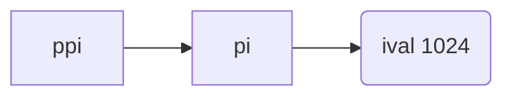

### 1. 基本内置类型

内置类型(Primitive Built-in Types)也称基本类型，内置与编译器中，未在任何头文件中定义。主要包含三个类别：整型、浮点和void。

| Type      | Meaning                         | Minimum Size                   |
| --------- | ------------------------------- | ------------------------------ |
| bool      | boolean                         | NA(未定义)                     |
| char      | character                       | 8 bits                         |
| wchar_t   | wide character                  | 16 bits                        |
| char16_t  | Unicode character               | 16 bits                        |
| char32_t  | Unicode character               | 32 bits                        |
| short     | short integer                   | 16 bits                        |
| int       | integer                         | 16 bits                        |
| long      | long integer                    | 32 bits                        |
| long long | long integer                    | 64 bits                        |
| float     | single-precision floating-point | 6 significant digits(有效数字) |
| double    | double-precision floating-point | 10 significant digits          |

**wchar_t**, **char16_t**,  **char32_t**  用于扩展字符集：

- **wchar_t** ：确保存放机器最大扩展字符集中的任意一个字符（the machine’s largest extended character set.）
-  **char16_t** 与 **char32_t** ：专门为 Unicode 字符服务. (Unicode is a standard for representing characters used in essentially any natural language.)

#### 带符号与无符号类型

除去bool和扩展字符外，其他整型分为带符号和无符号类型（Signed and Unsigned ），**signed类型可以表示负数、0、正数**，**unsigned类型仅表示大于0的值**。如unsigned long。

除了`char`以外，使用没有`signed`的任何整数类型都等同于将其与`signed`一起使用，即`signed int`和`int`是等效的。字符型被分为：`char`, `signed char`, `unsigned char`,但实际表现形式只有两种，char会根据编译器表现为其他两种。

8-bit `signed char`理论上可以表示-127到127，实际的表示范围为-128到127

> 类型选择：
>  -  确定数值不可能为负时，选用unsigned
>  -  使用**int** 进行算数运算，short太小，long一般和int一样的尺寸，如果超出int范围则使用long long
>  -  算术表达式(arithmetic expressions)中不要使用char或bool，只用来存放字符或布尔值(only to hold characters or truth values) . 因为char在不同机器上可能是unsigned或signed。（ If you need a tiny integer, explicitly specify either signed char or unsigned char.）
>  -  执行浮点运算(floating-point computations)使用 double

#### 类型转换

```cpp
bool b = 42;// b is true
int i = b;// i has value 1
i=3.14;// i has value 3
double pi=i;// pi has value 3.0
unsigned char c=-1;// assuming 8-bit chars, c has value 255
signed char c2=256;// assuming 8-bit chars, the value of c2 is undefined
```

给signed类型赋值超出范围的值时，结果是`undefined`，此时程序可能继续工作，也可能崩溃，也可能生成垃圾数据。

```cpp
int i = 42;
if (i) // condition will evaluate as true
i = 0;
```

只有i值为0时，条件才会时false，其他任何值都是true。

```cpp
unsigned u = 10;
int i = -42;
std::cout << i + i << std::endl; // prints -84
std::cout << u + i << std::endl; // if 32-bit ints, prints 4294967264
```

```cpp
unsigned u1 = 42, u2 = 10;
std::cout << u1 - u2 << std::endl; // ok: result is 32
std::cout << u2 - u1 << std::endl; // ok: but the result will wrap around(取模后的值)
```
下述代码会进入死循环
```cpp
    for (unsigned int i = 10; i >= 0; --i) {
        std::cout << i << std::endl;
    }
```

可以改进为:

```cpp
    unsigned u = 11;
    while (u > 0) {
        --u; // decrement first, so that the last iteration will print 0
        std::cout << u << std::endl;
    }
```

如果表达式中既有signed，也有unsigned类型时，signed会自动转换为unsigned，如：

```cpp
int a = -1;
int b = 1;
a*b = -1;
```

如果是混合类型，则`a*b`结果视当前机器上的int占位符而定，当前机器显示4294967295：

```cpp
unsigned int a = -1;
int b = 1; 
```

#### 字面值常量

Literals：value self-evident，称为字面值常量，如42

#####  整型和浮点型
```cpp
0b101  //二进制
20      /* decimal  十进制*/ 
024     /* octal  八进制*/ 
0x14    /* hexadecimal  十六进制*/
```

```cpp
char a = '\101'; // 以\开头表示为八进制65
char b = '\x42'; // 以\x开头表示为十六进制66
```
默认情况下，**decimal literals**是signed类型，**octal and hexadecimal literals**可以是**signed** 或**unsigned**。

**Floating-point literals** 表现为小数( a decimal poin)或者以科学计数法表示的指数(an exponent specified using scientific notation)。  使用E或 e来表示：

```cpp
3.14159   3.14159E0   0.   0e0    .001
```

##### 字符和字符串

Character and Character String Literals

```cpp
'a' // character literal 字符
"Hello World!" // string literal 字符串
```

> The type of a `string litera`l is array of constant chars.The compiler appends a null character (’\0’) to every string literal. Thus, the actual size of a string literal is one more than its apparent size. For example, the literal 'A' represents the single character A, whereas the string literal "A" represents an array of two characters, the letter A and the null character.

##### 转义序列

泛化的转义序列(generalized escape sequence)：\后跟1-3个八进制数(如果超过3个只有前三个构成转义序列)，或\x后跟1个或多个十六进制数。

|                          | Escape Sequences | generalized escape sequence |
| ------------------------ | ---------------- | --------------------------- |
| newline 换行             | \n               | \12                         |
| horizontal tab           | \t               |                             |
| vertical tab  纵向制表符 | \v               |                             |
| backspace                | \b               |                             |
| double quote             | `\"`             |                             |
| single quote             | `\'`             |                             |
| alert (bell) 报警响铃符  | \a               | \7                          |
| backslash                | `\\`             |                             |
| carriage return 回车符   | \r               |                             |
| formfeed 进纸符          | \f               |                             |
| question mark 问号符     | `\?`             |                             |
| blank                    |                  | \40                         |
| null                     |                  | \0                          |
| 'M'                      |                  | \115  或者 \x4d             |

```cpp
std::cout << "\n"; // prints a newline
std::cout << "\tHi!\n"; // prints a tab followd by "Hi!" and a newline

std::cout << "Hi \x4dO\115!\n"; // prints Hi MOM! followed by a newline 
std::cout << '\115' << '\n'; // prints M followed by a newline
/*输出：

	Hi!
Hi MOM!
M
*/
```

##### 指定literal类型

字符字符串（Character and Character String） Literals

| Prefix | meaning                     | type     |
| ------ | --------------------------- | -------- |
| u      | Unicode 16 character        | char16_t |
| U      | Unicode 32 character        | char32_t |
| L      | wide character              | wchar_t  |
| u8     | utf-8(string literals only) | char     |

Integer Literal

| Suffix   | Minimum Type |
| -------- | ------------ |
| u or U   | unsigned     |
| l or L   | long         |
| ll or LL | long long    |

Floating-Point Literal

| Suffix | Type        |
| ------ | ----------- |
| f or F | float       |
| l or L | long double |

```cpp
L'a'; // wide character literal, type is wchar_t
u8"hi!" ;// utf-8 string literal (utf-8 encodes a Unicode character in 8 bits)
42ULL ;// unsigned integer literal, type is unsigned long long
1E-3F ;// single-precision floating-point literal, type is float
3.14159L ;// extended-precision floating-point literal, type is long double
```

###  2. 变量

变量提供一个具体命名的可供程序操作的存储空间(named storage that our programs can manipulate)。在C++中 “**variables**” or “**objects**” 一般可以互换。对象通常是一块能存储数据且具有类型的内存空间(an object is a region of memory that can contain data and has a type)。

#### 变量的定义

```cpp
std::string book("0-201-78345-X");// book initialized from string literal
```
在C++中初始化(initialization)和赋值(assignment)是两个完全不同的操作，初始化是创建变量时赋予其一个初始值，赋值是把对象的当前值擦除(obliterates)，以一个新指代替。C++中几种初始化的形式：

```cpp
int units_sold = 0; 
int units_sold = {0}; 
int units_sold{0}; 
int units_sold(0);
```

在C++11的新标准中，可以使用花括号(curly braces)进行初始化变量，这种形式的初始化成为**列表初始化(list initialization)**。这种初始化用于内置类型的变量时，如果初始值存在丢失信息的风险，编译器会报错。如：


```c
long double ld = 3.1415926536;
int a{ld}, b = {ld}; // error: narrowing conversion required，转换未执行，存在丢失信息风险
int c(ld), d = ld; // ok: but value will be truncated
```

##### 默认初始化(default initialized)：

- 内置类型：内置类型的值如果没有显式初始化，会被默认初始化，值由定义的位置决定。定义于函数体之外的变量被初始化为0，定义于函数体内部则**不被初始化(uninitialized)**。没有初始化的内置类型的值是**未定义的(undefined)**，如果进行访问、操作将引发错误。

- 类：绝大多数类支持无须显式初始化，其提供合适的默认值。如果类要求显式初始化，未进行初始化操作，将引发错误。

  ```cpp
  std::string empty; //隐式初始化为空串 
  Sales_item item; // default-initialized Sales_item object
  ```

#### 声明与定义

C++允许程序拆分成多个逻辑部分来写，支持**分离式编译(separate compilation)**，允许程序分割为多个文件，每个文件可被独立编译。为了支持分离式编译，C++将**声明(declaration)**和**定义(definition)**区分开。一个文件如果想使用别处定义的名称，则必须包含对其的声明。而定义负责创建与声明关联的实体。声明规定了变量的类型和名称，定义会申请存储空间(allocates storage)，也可能会为变量赋予初始值。

如果一个变量仅仅想声明，而不对其定义，则使用**extern**:

```cpp
extern int i; // declares but does not define i 
int j; // declares and defines j
```

下述表达，不再是声明，变成了定义：

```cpp
extern double pi = 3.1416; // definition
```

变量只能被定义一次，可以多次声明。

#### 标识符(Identifiers)

字母、数字、下划线(the underscore character)组成，不能连续下划线，不能下划线紧邻大写字母。

- 用户自定义类名一般以大写字母开头，如：Sales_item
- 变量名一般用小写字母
- 多个单词通过下划线分割

####  名称的作用域(Scope)

```cpp
#include <iostream>
int reused = 42; //  global scope 全局作用域
int main() {
    int unique = 0; //block scope 块作用域
    // 输出 #1：42 0
    std::cout << reused << " " << unique << std::endl;
    int reused = 0; // new, local object named reused hides global reused 新建局部变量，覆盖了全局变量
    // 输出 #2: 0 0
    std::cout << reused << " " << unique << std::endl;
    // 输出 #3:  42 0，显式引用全局变量
    std::cout << ::reused << " " << unique << std::endl;
    return 0;
}
```

### 3. 复合类型

基于其他类型定义的类型(A **compound type** is a type that is defined in terms of another type.)

#### 引用

为对象起了另一个名称，类似于alias。(A **reference** is not an object. Instead, a reference is just another name for an already existing object. A reference type “**refers to**” another type. **A Reference Is an Alias**)。`&`还具备同C语言中一样的取址功能。

```cpp
int ival = 1024;
int &refVal = ival; // refVal 指向ival，是ival的另一种名称
int &refVal2; // error: 引用必须初始化
```

一般在初始化变量时，初始值会被copy到新建的对象中，定义引用时，把引用与初始值绑定(bind)到一起，而不是将初始值copy给引用。**引用必须初始化**。

```cpp
refVal = 2; //2 赋值给refVal指向的对象, 即赋值给ival 
int ii = refVal; // same as ii = ival

//  refVal3 绑定到与 refVal 绑定的对象
int &refVal3 = refVal;
// initializes i from the value in the object to which refVal is bound
int i = refVal; // ok: initializes i to the same value as ival

int &refVal4 = 10; // error: initializer must be an object 
double dval = 3.14;
int &refVal5 = dval; // error: initializer must be an int object
```

一般使用引用时指**左值引用(lvalue reference)**，C++11新增了右值引用(rvalue reference)，这种引用主要用于内置类。

#### 指针

不同于引用，指针本身就是一个对象，允许其copy和赋值，在其生命周期内可以先后指向几个不同的对象(A **pointer** is a `compound type` that “points to” another type. Like references, pointers are used for indirect access to other objects)；而且指针无须在定义时赋予初始值，如果其没有被初始化，将拥有一个不确定的值。

指针大小和其指向的内存中的存储变量大小无关，只和OS系统有关，32位系统大小是4个字节，64位是8个字节。

```c
int *ip1, *ip2; // both ip1 and ip2 are pointers to int
double dp, *dp2; // dp2 is a pointer to double; dp is a double
```
获取对象的地址，先把p定义为一个指向int的指针，随后初始化p，令其指向ival的int对象。
```cpp
int ival = 42;
int *p = &ival; // p 存放ival的地址; 或者说p是指向变量ival的指针，p is a pointer to ival
```
指针类型要和其指向的对象严格匹配：
```cpp
double dval;
double *pd = &dval; // ok: initializer is the address of a double
double *pd2 = pd; // ok: initializer is a pointer to double
int *pi = pd; // error: types of pi and pd differ
pi = &dval; // error: assigning the address of a double to a pointer to int
```
指针值

1. 指向一个对象。
2. 指向紧邻对象所占空间的下一个位置( point to the location just immediately past the end of an object)。
3. 空指针，没有指向任何对象。
4. 无效指针，上述情况之外的其他值。

利用指针访问对象

```c
int ival = 42;
int *p = &ival; // p holds the address of ival; p is a pointer to ival 
cout << *p; // 42
```

不同于C，在C++中，`*`还是一个一元运算符，称为解引用运算符。对指针**解引用**会得出所指的对象(Dereferencing a pointer yields the object to which the pointer points)，所以如果给解引用的结果赋值，实际上就是给指针所指的对象赋值：

```cpp
*p = 0; // 通过* 得到指针p所指的对象，经由p为变量ival赋值
cout<<*p;// 0
```

**解引用**(dereference)操作仅适用于那些确实指向了某个对象的有效指针。某些符号有多重含义：

```c
int i = 42;
int &r = i; //r is a reference
int *p;     // p is a pointer
p = &i;     // & is used in an expression as the address-of operator 
*p = i;     // * is used in an expression as the dereference operator
int &r2 = *p; // & is part of the declaration; * is the dereference operator
```

##### 空指针null pointer

 不指向任何对象

```cpp
int *p1 = nullptr; // equivalent to int *p1 = 0;
int *p2 = 0; // p2 直接初始化为 literal constant 0 
// must #include cstdlib
int *p3 = NULL; // equivalent to int *p3 = 0;
```
过去的程序会使用名为`NULL`的**预处理变量**(preprocessor variable)来给指针赋值。**预处理器**(preprocessor)是运行与边缘过程之前的程序。

不能把int变量直接赋值给指针:

```cpp
int zero = 0;
pi = zero; // error: cannot assign an int to a pointer
```

##### 赋值和指针

指针和引用都能提供对其他对象的访问，但引用本身并非一个对象。引用一旦被定义，无法再绑定到其他对象。每次这个引用访问的都是最初绑定的对象。指针和存放的地址则没有这种限制。

```cpp
int i = 42;
int *pi = 0; // pi is initialized but addresses no object,pi = 0x0
int *pi2 = &i; // pi2 initialized to hold the address of i
int *pi3;// if pi3 is defined inside a block, pi3 is uninitialized
pi3 = pi2;// pi3 and pi2 address the same object, e.g., i
pi2 = 0; // pi2 now addresses no object
```

赋值永远改变的是等号左侧的对象：

```cpp
pi=&ival;// value in pi is changed;pi now points to ival
*pi = 0; // value in ival is changed; pi is unchanged
```

其他指针操作：

```cpp
int ival = 1024;
int *pi = 0; // pi is a valid, null pointer
int *pi2 = &ival; // pi2 is a valid pointer that holds the address of ival 
if (pi) // pi has value 0, so condition evaluates as false
// ...
if (pi2) // pi2 points to ival, so it is not 0; the condition evaluates as true
// ...
```

如果两个指针存放的地址值相同，则他们相等。有时，一个指针指向某对象，另一个指针指向另外对象的下一地址，可能出现两个指针相同的情况。

##### void* 指针

 `void*` 可以存放任意对象的地址，同时我们对其所指向的对象的类型不了解，所以也无法确定能够进行哪些操作。
```cpp
double obj = 3.14, *pd = &obj;// ok: void* can hold the address value of any data pointer type 
void *pv = &obj; // obj can be an object of any type 
pv = pd; // pv can hold a pointer to any type
```
#### 符号类型声明

变量的定义包含数据类型和声明符，数据类型可以相同，声明符缺可以不同，也即一条语句可能定义不同类型的变量：

> a variable definition consists of a base type and a list of declarators. Each declarator can relate its variable to the base type differently from the other declarators in the same definition. 

```cpp
// i is an int;p is a pointer to int;r is a reference to int
int i = 1024, *p = &i, &r = i;
```

多个变量的定义

```cpp
int* p1, p2;// p1是指针，p2是int，*仅修饰p1
int *p1, *p2; // both p1 and p2 are pointers to int
```
指向指针的指针Pointers to Pointers，
```cpp
int ival = 1024;
int *pi = &ival; // pi points to an int
int **ppi = &pi; // ppi points to a pointer to an int

cout << "The value of ival\n"
  << "direct value: " << ival << "\n" << "indirect value: " << *pi << "\n"
  << "doubly indirect value: " << **ppi << endl;

//为了访问原始对象，需要ppi进行两次解引用
/*
The value of ival
direct value: 1024
indirect value: 1024
doubly indirect value: 0x7ffee635b72c */
```



指向指针的引用References to Pointers

```cpp
int i = 42;
int *p;
int *&r = p;  //r is a reference to the pointer i 
r = &i; // r引用了一个指针，给r赋值&i，就是令p指向i
// *r = 42,*p=42;
*r = 0;
// *r = 0,*p=0;
```

### 4. const限定符

const Qualifier，值不可改变

```c
const int bufSize = 512;
bufSize = 512; // error: attempt to write to const object

const int i = get_size(); // ok: initialized at run time 
const int j = 42; // ok: initialized at compile time 
const int k; // error: k is uninitialized const
```
默认情况下const对象仅在文件内有效，如果多个文件中出现了同名的const变量时，等同于不同文件中分别定义了独立的变量。当编译器在编译过程中，会把const变量替换成对应的值。

如果想在多个文件共享const对象，在变量前添加 **extern** 。
```c
// file_1.cc defines and initializes a const that is accessible to other files 
extern const int bufSize = fcn();
// file_1.h
extern const int bufSize; // same bufSize as defined in file_1.cc
```
#### const引用
```c
const int ci = 1024;
const int &r1 = ci;
r1 =42;  // error: r1 is a reference to const
int &r2 = ci; // error: 非常量引用不能指向常量
```

```cpp
int i = 42;
const int &r1 = i; // we can bind a const int& to a plain int object
const int &r2 = 42; // ok: r1 is a reference to const
const int &r3 = r1 * 2; // ok: r3 is a reference to const
int &r4 = r1 * 2; // error: r4 is a plain, non const reference 普通非常量引用
```

普通引用不能绑定到常量引用上，因为当一个常量引用被绑定到另外一个类型上时，如：
```cpp
double dval = 3.14;
const int &ri = dval;
```
会发生如下过程：
```cpp
const int temp = dval; // create a temporary const int from the double
const int &ri = temp; // bind ri to that temporary
```

如果ri不是常量，值则变成可以被改变。

const引用可以引用非const对象，所以可以通过其他途径改变其值：

```cpp
int i = 42; 
int &r1 = i; // r1 bound to i
const int &r2 = i; // r2 also bound to i; but cannot be used to change i
r1 = 0; // r1 is not const;i is now 0
r2=0;// error:r2 is a reference to const
```

#### const指针

**指向常量的指针**不能用于改变其所指对象的值( **pointer to const** may not be used to change the object to which the pointer points):

```c
const double pi = 3.14; 
double *ptr = &pi; // error: ptr is a plain pointer
const double *cptr = &pi; // ok: cptr may point to a double that is const
*cptr = 42; // error: cannot assign to *cptr
```
允许指向常量的指针指向一个非常量的对象：

```cpp
double dval = 3.15; // dval is a double; its value can be changed
cptr = &dval; // ok: but can't change dval through cptr
```

> It may be helpful to think of pointers and references to const as pointers or references “that think they point or refer to const.”

指针是对象，而引用不是。常量指针(**const Pointers**)必须初始化，一旦完成初始化，其值不能改变。指针是一个常量，而非指向的值。

```c
int errNumb = 0;
int *const curErr = &errNumb; // curErr will always point to errNumb
const double pi = 3.14159;
const double *const pip = &pi; // pip is a const pointer to a const object 指向常量对象的常量指针

*pip = 2.72; // error: pip is a pointer to const
// if the object to which curErr points (i.e., errNumb) is nonzero 
if (*curErr) {
    *curErr = 0; // ok: reset the value of the object to which curErr is bound 
}
```

#### 顶层const

顶层const(**top-level const**)表示指针本身是个常量，底层const(**low-level const**)表示指针所指向的对象是个常量：

```c
int i = 0;
int *const p1 = &i; // we can't change the value of p1; const is top-level
const int ci = 42; // we cannot change ci; const is top-level
const int *p2 = &ci; // we can change p2; const is low-level
const int *const p3 = p2; // right-most const is top-level, left-most is not
const int &r = ci; // const in reference types is always low-level

i = ci; // ok: copying the value of ci; top-level const in ci is ignored
p2 = p3; // ok: pointed-to type matches; top-level const in p3 is ignored

int *p = p3; // error: p3 has a low-level const but p doesn't
p2 = p3; // ok: p2 has the same low-level const qualification as p3 
p2 = &i; // ok: we can convert int* to const int*
int &r = ci; // error: can't bind an ordinary int& to a const int object 
const int &r2 = i; // ok: can bind const int& to plain int
```

p3既是顶层const，也是底层const。

#### constexpr与常量表达式

常量表达式(**constant expression**) 是指在编译过程中就能确定、且值不会改变。字面值(literal)属于常量表达式。

```c
const int max_files = 20; // max_files is a constant expression
const int limit = max_files + 1; // limit is a constant expression
int staff_size = 27; // staff_size is not a constant expression
const int sz = get_size(); // sz is not a constant expression,运行时才能获取
```
在复杂系统中，将一个定义一个const变量，并设定初始值为我们认为的常量表达式，但在实际使用时，却并非常量表达式。将变量声明为**constexpr**类型，可以由编译器来验证是否是常量表达式。

```c
constexpr int mf = 20; // 20 is a constant expression
constexpr int limit = mf + 1; // mf + 1 is a constant expression
constexpr int sz = size(); // ok only if size is a constexpr function
```

常量表达式(**constant expression**) 需要在编译时确定，所以类型有所限制，这种类型称为**字面值类型(literal types)**。

算术类型、指针、引用(the arithmetic, reference, and pointer types)属于 literal types，自定义类型、IO库、string类型不属于。虽然指针和引用可以定义为constexpr，但其初始值受到严格限制。constexpr指针初始值必须是nullptr、0或者存储于某个固定地址中的对象。

函数体内定义的变量一般非存放于固定地址，不能定义为constexpr；函数体外的对象的地址固定不变，可以用来初始化constexpr指针。

constexpr声明指针，仅对指针有效，与指针指向的对象无关：

```cpp
const int *p = nullptr; // p is a pointer to a const int
constexpr int *q = nullptr; // q is a const pointer to int
```
p是一个指向常量的指针，q是一个常量指针，constexpr把它所定义的对象置为了顶层const。

constexpr指针既可以指向常量，也可以指向非常量：

```cpp
constexpr int *np = nullptr; // np is a constant pointer to int that is null
int j = 0;
constexpr int i = 42; // type of i is const int
// i and j must be defined outside any function
constexpr const int *p = &i; // p is a constant pointer to the const int i 
constexpr int *p1 = &j; // p1 is a constant pointer to the int j
```

### 5. 类型

#### 类型别名

类型别名(type alias)：使用别名来命名其他类型，两种方法类定义：

- `typedef`关键字

  ```cpp
  typedef double wages; // wages 等同于 double
  typedef wages base, *p; // base类型是double, p for double*
  ```

- 别名声明(alias declaration):使用`using`关键字

  ```cpp
  using SI = Sales_item; // SI 等同于 Sales_item
  ```

只要是类型别名可以出现的地方，都可以使用类型别名：

```cpp
wages hourly, weekly; // same as double hourly, weekly;
SI item; // same as Sales_item item
```

如果类型别名是符合类型或常量：


```cpp
typedef char *pstring;
const pstring cstr = 0; // cstr is a constant pointer to char
const pstring *ps; // ps is a pointer to a constant pointer to char
```
`const pstring`是指向char的常量指针，而非指向常量字符的指针。下属表达是对其错误理解：

```cpp
const char *cstr = 0; // 对const pstring cstr的错误理解
```

#### auto类型说明符

auto类型说明符（the `auto` type specifier）可以让编译器替我们去分析表达式所属的类型：
```c
auto item = val1 + val2; // item initialized to the result of val1 + val2

auto i = 0, *p = &i; //ok: i is int and p is a pointer to int
auto sz = 0, pi = 3.14; // 错误，类型不一致
```

auto复合类型：

```cpp
 int i = 0, &r = i;
auto a = r; // a是int

const int ci = i, &cr = ci;
auto b = ci; // b是int (top-level const被忽略)
auto c = cr; // c is an int (cr is an alias for ci whose const is top-level)
auto d = &i; // d is an int*(& of an int object is int*)
auto e = &ci; // e is const int*(& of a const object is low-level const)
```
如果希望auto类型是一个顶层const，需要明确指出
```cpp
const auto f = ci; // deduced type of ci is int; f has type const int
```
可将引用类型设为auto：
```cpp
auto &g = ci; // g is a const int& that is bound to ci
auto &h = 42; // error: we can't bind a plain reference to a literal
const auto &j = 42; // ok: we can bind a const reference to a literal

auto k = ci, &l = i; // k is int; l is int&
auto &m = ci, *p = &ci;// m is a const int&;p is a pointer to const int

// error: type deduced from i is int; type deduced from &ci is const int
auto &n = i, *p2 = &ci;//i的类型是int，ci的类型是const int
```

#### decltype

**decltype**，返回操作的数据类型，编译器分析表达式并得到它的类型，却不实际计算出表达式的值：

```cpp
decltype(f()) sum = x; // sum的类型就是f的返回类型
```
decltype在处理顶层const与auto稍有不同，如果decltype使用的表达式是一个变量，则返回该变量的类型，包含顶层的const引用在内：

```cpp
const int ci = 0, &cj = ci;
decltype(ci) x = 0; // x类型是const int
decltype(cj) y = x; // y 的类型是int&，且bind到x
decltype(cj) z; // error: z是一个引用必须初始化。cj是一个引用，decltype(cj)的结果就是引用类型
```


如果decltype使用的表达式不是一个变量，则返回表达式对应的类型：
```cpp
// decltype的结果可以是引用类型
int i = 42, *p = &i, &r = i;
decltype(r + 0) b; // ok: addition yields an int; b is an (uninitialized) int
decltype(*p) c; // error: c is int& and must be initialized

// decltype如果是加上括号(parenthesized)的变量，结果将是引用
decltype((i)) d; // error: d是inti，必须初始化
decltype(i) e; // ok: e is an (uninitialized) int
```
### 6. 自定义数据结构

以`struct`开始：

```c
struct Sales_data {
    std::string bookNo;
    unsigned units_sold = 0;
    double revenue = 0.0;
};
```
定义：
```c
struct Sales_data { /* ... */ } accum, trans, *salesptr;
```
与上述定义相同：
```c
struct Sales_data { /* ... */ };
Sales_data accum, trans, *salesptr;
```

使用：

```cpp
#include <iostream>
#include <string>
#include "Sales_data.h"

int main() {
    Sales_data data1, data2;

    double price = 0; 
    std::cin >> data1.bookNo >> data1.units_sold >> price;
    data1.revenue = data1.units_sold * price;


    std::cin >> data2.bookNo >> data2.units_sold >> price;
    data2.revenue = data2.units_sold * price;


    if (data1.bookNo == data2.bookNo) {
        unsigned totalCnt = data1.units_sold + data2.units_sold;
        double totalRevenue = data1.revenue + data2.revenue;
        // print: ISBN, total sold, total revenue, average price per book
        std::cout << data1.bookNo << " " << totalCnt
                  << " " << totalRevenue << " ";
        if (totalCnt != 0)
            std::cout << totalRevenue / totalCnt << std::endl;
        else
            std::cout << "(no sales)" << std::endl;
        return 0; // indicate success
    } else { // transactions weren't for the same ISBN
        std::cerr << "Data must refer to the same ISBN"
                  << std::endl;
        return -1; // indicate failure
    }
}
```

#### 头文件

```cpp
#ifndef SALES_DATA_H
#define SALES_DATA_H

#include <string>

struct Sales_data {
	std::string bookNo;
	unsigned units_sold = 0;
	double revenue = 0.0;
};
#endif
```

预处理器(preprocessor)碰到`#include`标志时，会使用指定头文件代替。

预处理的**头文件保护符**(header guard)，预处理变量有两种状态，已定义和未定义。`#define`把一个名称设定为预处理变量，`#ifndef`当变量未定义时执行后面的操作，直至遇到`#endif`。`#ifndef`当变量已定义时为真。
