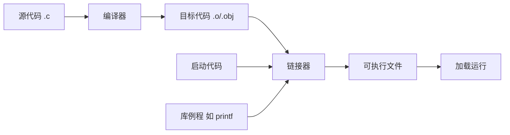

## 1.1 C语言的起源

1972 年，贝尔实验室的 **Dennis Ritchie** 在 Ken Thompson 的 B 语言基础上开发出 C 语言，最初的用途是重写 UNIX 操作系统。C 的定位介于汇编与高级语言之间：既保留对硬件的高效操控能力，又具备高级语言的抽象与可移植性。

## 1.2 选择C语言的理由

- **设计特性**：语言本身小而目标明确，顶层设计思路清晰，贴近硬件但不绑定硬件
- **高效性**：编译产物运行效率接近汇编
- **可移植性**（portability）：不针对特定 CPU 指令集，稍加修改甚至无需修改即可跨平台
- **强大而灵活**：UNIX 内核、数据库、解释器、图形库等系统级软件均由 C 实现
- **面向程序员**：提供位操作、直接内存访问等底层能力，信任程序员
- **缺点**：自由度大、语法检查宽松，指针等特性误用时容易产生难以定位的 bug

## 1.3 C语言的应用范围

UNIX/Linux 系统软件、嵌入式与驱动开发、数据库（MySQL、SQLite）、语言解释器与运行时（CPython、JVM 的 native 层）、图形与科学计算库等。今天 Linux 内核、Git、Android 的 native 层仍是 C 的主战场。

## 1.4 计算机能做什么

CPU（Central Processing Unit， 中央处理器）的工作循环非常简单：取指令 → 执行 → 取下一条指令。指令集是原始的算术、比较、搬数操作。程序运行前必须从持久存储（磁盘、闪存）加载到内存（RAM），CPU 只直接访问自身的寄存器与缓存。

## 1.5 高级计算机语言和编译器

**高级语言**（high-level computer language）用接近人类思维的语句描述计算过程，再由**编译器**（compiler）翻译成特定机器的指令。C 是编译型语言：写好的源代码经编译器处理成机器可执行的形式，而不是像解释型语言那样逐句解释执行。

## 1.6 语言标准

C 的发展经历了多个标准化阶段，不同标准之间差异显著：

| 标准 | 年份 | 关键内容 |
| --- | --- | --- |
| K&R C（经典 C） | 1978 | 《The C Programming Language》第一版定义的事实标准 |
| ANSI C / C89 | 1989 | 美国国家标准；次年 ISO 采纳为 C90，定义了函数原型等 |
| C99 | 1999 | `//` 注释、声明与语句混排、`long long`、变长数组、复数类型、`restrict` |
| C11 | 2011 | `_Generic`、`_Static_assert`、多线程支持、**废除 `gets()`**，本书基于此标准 |

> 时效性注解：C17（2018）以缺陷修复为主，无新特性；C23（2024）已发布，引入 `true`/`false` 关键字、`constexpr`、十进制浮点等。当前主流编译器（gcc、clang、MSVC）均完整支持 C11/C17，C23 支持正在逐步完善。日常开发以 C11/C17 为基线是稳妥选择。

## 1.7 使用C语言的7个步骤

1. **定义程序目标**：明确程序要完成什么
2. **设计程序**：规划界面、数据组织、算法与流程
3. **编写代码**：把设计翻译成 C 源代码
4. **编译**：交给编译器生成可执行文件
5. **运行**
6. **测试和调试程序**：验证结果，定位并修复错误
7. **维护和修改程序**：随需求演进持续更新

## 1.8 编程机制

C 编译的基本单位与产物：

- **源代码文件**（source code file）：程序员编写的文本，扩展名 `.c`
- **目标代码文件**（object code file）：编译器将源代码翻译成的机器码，尚不能独立运行
- **可执行文件**（executable code file）：目标代码经过**链接器**（linker）组合后的最终产物

链接器合并三类内容：目标代码、**启动代码**（startup code，程序与操作系统的接口）、程序用到的**库函数**代码（如 `printf`）。



用 gcc 编译单个文件：

```bash
gcc inform.c -o inform   # 生成名为 inform 的可执行文件
./inform                 # 运行
```

多文件程序把所有源文件一起传给编译器，或使用 make 管理构建；目标文件在 UNIX 惯例下扩展名为 `.o`，Windows 下为 `.obj`。gcc 与 clang 都可用 `-std=c11` 指定语言标准。

## 1.9 本书的组织结构和约定

1.9、1.10 两节介绍原书的章节安排与排版约定，属于阅读指引，笔记从略。

### 小结

- C 兼具高级语言的抽象与接近汇编的效率，适合系统级开发
- 源代码 → 编译 → 目标代码 → 链接（启动代码 + 库）→ 可执行文件
- 语言标准演进的脉络：K&R C → C89/C90 → C99 → C11 → C17/C23，本书基于 C11
