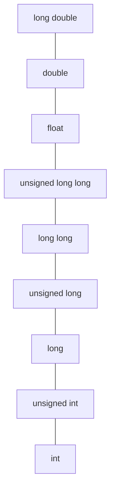

## 5.1 循环简介

原书 `shoes.c`：用 while 循环处理多组数据，引出本章的运算符与语句：

```c
#include <stdio.h>
#define ADJUST 7.31              /* 字符常量 */
int main(void)
{
    const double SCALE = 0.333;  /* const 变量 */
    double shoe, foot;

    printf("Shoe size (men's)    foot length\n");
    shoe = 3.0;
    while (shoe < 18.5)          /* while 循环 */
    {
        foot = SCALE * shoe + ADJUST;
        printf("%10.1f %15.2f inches\n", shoe, foot);
        shoe = shoe + 1.0;
    }
    printf("If the shoe fits, wear it.\n");
    return 0;
}
```

## 5.2 基本运算符

### 赋值运算符：=

`bmw = 2002;` 把右侧的值赋给左侧变量。赋值运算符**从右往左**结合：`a = b = c = 9;` 等价于 `a = (b = (c = 9))`。赋值表达式的值就是被赋的值。`i = i + 1` 在 C 中完全合法（数学上的等号不是这个含义）。

### 加法运算符：+ 与减法运算符：-

二元（binary，两个操作数）运算符：`sum = a + b - 25;`（`4 + 6` 称加法表达式，值为 10）。`-` 还可作一元负号运算符（见 5.3）。

### 符号运算符：- 和 +

一元（unary）`-` 取负：`rocky = -roadway;`；一元 `+` C90 起也可用，但基本无意义。

### 乘法运算符：*

`cm = 2.54 * inch;`。指数方面 C 没有幂运算符，标准库提供 `pow()`（math.h）。

### 除法运算符：/

**整数除法截断小数部分**（向零截断）：

```c
printf("%d\n", 5 / 3);     /* 1,截断 */
printf("%d\n", 6 / 3);     /* 2 */
printf("%f\n", 6.0 / 3);   /* 2.000000,浮点除法 */
```

混用时 int 会先转换为浮点再除（见 5.5）。

### 运算符优先级

`butter = 25.0 + 60.0 * n / SCALE;` 中 `*`/`/` 优先级高于 `+`/`-`，同级从左往右结合。完整优先级表见 5.3 末尾。

### 优先级和求值顺序

优先级决定运算符与操作数的结合方式，**不规定操作数的求值顺序**。如 `y = (4 + x++) + (6 + x++);`，两个 `x++` 之间的求值顺序未定义，应避免这类写法。

## 5.3 其他运算符

### sizeof 运算符和 size_t 类型

`sizeof` 以字节为单位给出类型大小，返回 `size_t` 类型（无符号整数，底层由实现选定）：

```c
size_t n = sizeof(int);        /* sizeof type 时建议加括号 */
printf("%zu\n", sizeof n);     /* 运算对象是表达式时可省括号 */
```

### 求模运算符：%

`%` 给出整数除法的余数：`5 % 3` 得 2。**只可用于整数**，浮点求模用 `fmod()`（math.h）。负数求模结果的符号 C99 起规定与被除数相同：`-7 % 3` 得 -1。

### 自增运算符：++ 与自减运算符：--

- 前缀形式 `++i`：先自增，再使用新值
- 后缀形式 `i++`：先使用旧值，再自增

```c
int a = 1, b = 1;
int aplus, plusb;
aplus = a++;       /* aplus = 1, a = 2 */
plusb = ++b;       /* plusb = 2, b = 2 */
```

一条语句中多次修改同一变量（`y = (4 + x++) + (6 + x++)`）的行为未定义，应拆开写。

### 优先级

常用运算符优先级（自高到低，完整表见原书 Table 5.1）：

| 运算符（优先级从高到低） | 结合性 |
| --- | --- |
| `()` | 从左往右 |
| `++ --`（后缀） | 从左往右 |
| `+ -`（一元）、`++ --`（前缀）、`sizeof` | 从右往左 |
| `* / %` | 从左往右 |
| `+ -`（二元） | 从左往右 |
| `=` 及复合赋值 | 从右往左 |
| `,`（逗号运算符） | 从左往右 |

## 5.4 表达式和语句

### 表达式

**表达式**（expression）由运算符和操作数组成，每个表达式都有一个值：`4 + 6` 的值是 10，`x = 4` 的值是 4。

### 语句

**语句**（statement）是程序的基本执行单元，以分号结尾。`x = 4;` 是赋值语句（表达式语句）。赋值表达式的副作用是把值写入变量。

### 复合语句（块）

用 `{}` 把多条语句组合成**复合语句/块**（compound statement / block），在语法上视作一条语句。

### 类型转换

见 5.5。

## 5.5 类型转换

C 自动类型转换的几条规则：

### 自动转换的规则

1. **提升**（promotion）：`char`、`short` 在表达式中提升为 `int`；`float` 传给 `printf` 时提升为 `double`
2. **通常算术转换**（usual arithmetic conversions）：二元运算的两个操作数类型不一致时，较低级别类型转换为较高级别：



   级别从高到低：long double > double > float > unsigned long long > long long > unsigned long > long > unsigned int > int（long 与 unsigned long 等宽时后者更高，依实现而定）。

3. **赋值转换**：赋值时右侧类型转换为左侧变量类型，可能丢失精度（浮点→整型截断小数，double→float 多余精度丢失）

### 强制类型转换运算符

**强制类型转换**（cast）：`(type) expression`：

```c
int mice = 10;
printf("%f\n", (double) mice / 3);   /* 3.333333,先转换再除 */
```

## 5.6 带参数的函数

原书 `pound.c`：函数原型、形式参数与实际参数：

```c
#include <stdio.h>

void pound(int n);        /* ANSI C 函数原型:声明参数类型 */

int main(void)
{
    int times = 5;
    char ch = '!';        /* ASCII 码 33 */
    float f = 6.0f;

    pound(times);         /* int 实参,正常 */
    pound(ch);            /* char 自动转换为 int */
    pound((int) f);       /* 需要显式转换,否则丢精度且行为由实现定 */
    return 0;
}

void pound(int n)         /* 函数定义:形式参数 n */
{
    while (n-- > 0)
        printf("#");
    printf("\n");
}
```

- **实际参数**（argument，实参）：调用时传的具体值；**形式参数**（parameter，形参）：函数定义中接收值的变量
- 原型让编译器检查参数个数与类型、完成必要的自动转换；省略原型（旧式 K&R 风格）是 C99 已废除的写法

## 5.7 示例程序

原书 `running.c` 综合运用本章内容（秒表换算），思路：输入秒数，用 `/` 与 `%` 分出分钟与秒。

### 小结

- 表达式都有值；语句以分号结尾；块视作一条语句
- `%` 只用于整数；整数除法向零截断
- `++i`/`i++` 的差异在于取值时机；不要在同一表达式多次修改同一对象
- 混合运算遵循提升与通常算术转换；显式转换用 cast
- 函数原型使编译器能检查实参类型，务必为每个函数提供原型
