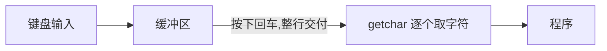

## 8.1 单字符I/O：getchar()和putchar()

`getchar()` 读入一个字符，`putchar()` 输出一个字符：

```c
char ch;
while ((ch = getchar()) != '\n')    /* 读一行并回显 */
    putchar(ch);
```

`getchar`/`putchar` 并非真正的函数，通常实现为宏（经 stdio.h），没有格式说明、只处理单个字符，比 `scanf("%c")`/`printf("%c")` 更轻量。

## 8.2 缓冲区

大多数系统在用户按下回车之前**不会**把输入交给程序——输入先进入**缓冲区**（buffer），回车触发整块交付。这叫**缓冲输入**（buffered input），与之相对的是无缓冲（立即）输入。



缓冲的好处：允许用户退格修改；批量传输效率高。C 标准只规定输入是否缓冲由实现决定，并提供了无缓冲方案（如 UNIX 的 ioctl，标准库层面是 ANSI C 未定义细节）。

## 8.3 结束键盘输入

### 文件、流和键盘输入

文件（file）是存储器中信息组织的单位；C 把输入输出抽象为**流**（stream）：理想化的、任意长度的字符序列。键盘输入是 C 自动打开的**标准输入流**（standard input），与文件流采用同一套读写逻辑。

### EOF

检测到文件结尾时，`getchar()` 返回特殊值 **EOF**（End Of File，文件结尾）：

```c
int ch;                              /* 注意是 int,不是 char */
while ((ch = getchar()) != EOF)
    putchar(ch);
```

两个关键点：

- `ch` 必须声明为 **int**：EOF 是一个宏（常用 -1），取值要能区别于任何合法字符（char 可能无符号，装不下 -1）
- getchar 返回 int 型字符编码或 EOF，`!= EOF` 判断必须在 int 上进行

UNIX 模拟键盘 EOF：Ctrl+D；Windows：Ctrl+Z。

```c
/* 统计字符数 */
long count = 0;
while (getchar() != EOF)
    count++;
printf("%ld characters read.\n", count);
```

## 8.4 重定向和文件

多数系统支持**输入/输出重定向**（redirection），让处理键盘/屏幕的程序直接处理文件，无需改动代码：

| 形式 | UNIX/Linux/Windows 命令行 | 含义 |
| --- | --- | --- |
| 输出重定向 `>` | `echo_eof > words` | 程序的输出写入文件 words（覆盖） |
| 追加 `>>` | `echo_eof >> words` | 输出追加到文件末尾 |
| 输入重定向 `<` | `echo_eof < words` | 程序的输入来自文件 words |
| 组合 | `echo_eof < in > out` | 输入来自 in，输出去 out |

约定：`<` 连接“提供输入的文件”，`>` 连接“接收输出的文件”；重定向是操作系统 shell 的能力，不是 C 的语法。同一命令中一个流只能重定向一次。

## 8.5 创建更友好的用户界面

### 面向数值输入的输入验证

原书 `checking.c`：反复提示直到用户输入合法数值：

```c
long get_long(void)
{
    long input;
    char ch;
    while (scanf("%ld", &input) != 1)
    {
        while ((ch = getchar()) != '\n')   /* 丢弃坏输入所在的整行 */
            putchar(ch);
        printf(" is not an integer.\nPlease enter an ");
        printf("integer value, such as 25, -178, or 3: ");
    }
    return input;
}
```

### 混合输入数值与字符带来的麻烦

scanf 读取数字时会**把结尾的换行符留在缓冲区**，随后 getchar 首先读到 `\n`，这是新手常见陷阱：

```c
int n; char c;
scanf("%d", &n);      /* 输入 "42\n",缓冲区残留 "\n" */
c = getchar();        /* c 拿到的是 '\n',不是用户想输入的字符! */
```

对策：读数字后清空行尾（循环 getchar 到 `\n`），或统一用 fgets + sscanf 解析。

## 8.6 输入验证

实际程序必须假设用户输入任何内容都可能出错。验证框架的思路：

```c
/* 限定输入在 [low, high] 的整数 */
long get_long_in_range(long low, long high)
{
    long value;
    bool good_input = false;
    while (!good_input)
    {
        value = get_long();                       /* 先拿到合法 long */
        if (value < low)
            printf("Too low, try again.\n");
        else if (value > high)
            printf("Too high, try again.\n");
        else
            good_input = true;
    }
    return value;
}
```

分层验证：①类型正确（get_long 循环）②范围合法（本层循环）。原则：**读入失败就清空整行、给出明确提示、循环重来**。

## 8.7 菜单浏览

原书 `menuette.c` 综合运用 do while、switch、字符 I/O 实现字符界面菜单：

```c
void showmenu(void)
{
    printf("Enter the letter of your choice:\n");
    printf("a. advice           b. bell\n");
    printf("c. count            q. quit\n");
}

int main(void)
{
    char choice;

    showmenu();
    while ((choice = getchar()) != 'q')     /* q 退出 */
    {
        if (choice == '\n')                 /* 跳过多余的换行 */
            continue;
        switch (choice)
        {
        case 'a': printf("Buy low, sell high.\n"); break;
        case 'b': putchar('\a');            /* 响铃 */        break;
        case 'c': count();                  break;
        default:  printf("Invalid choice.\n");            break;
        }
        eatline();                          /* 丢弃本行剩余字符 */
        showmenu();
    }
    printf("Bye.\n");
    return 0;
}
```

菜单程序的通用骨架：**显示菜单 → 读取选择 → 处理无效输入 → 分发执行 → 循环**。

### 小结

- getchar 返回 int，用 `!= EOF` 判断流结束
- 输入经缓冲区管理；scanf 的数字读取会在缓冲区留下 `\n`
- 重定向 `<` `>` 让同一程序处理文件与键盘/屏幕
- 健壮输入三板斧：验证返回值、清空坏输入、循环提示
