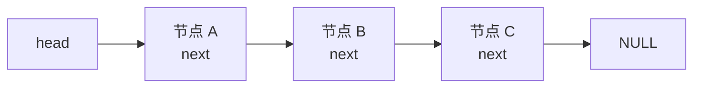
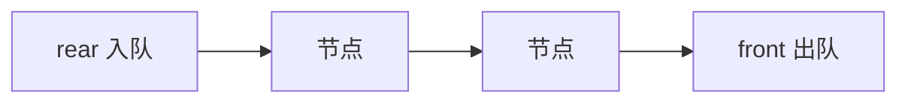
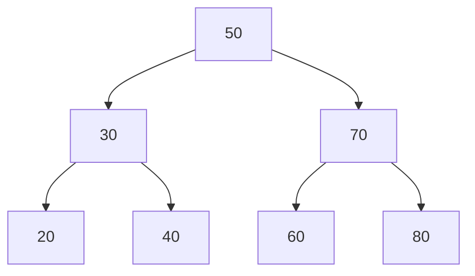

## 17.1 研究数据表示

同一份数据，不同表示方式带来完全不同的性能与易用性。本章以“整数列表”为例，依次经历：int 数组 → 定长数组 → 链表 → ADT，演示**数据表示从具体到抽象的演进**，这是通向数据结构与面向对象思想的桥梁。

## 17.2 从数组到链表

定长数组的大小在编译期固定，可能浪费也可能不够。**链表**（linked list）用一些“节点”串起来，每个节点 = 数据 + 指向下一节点的指针，按需 malloc、用几个分配几个：

```c
struct film {
    char title[45];
    int rating;
    struct film * next;      /* 指向同类型结构:自引用结构 */
};

struct film * head = NULL;   /* 空链表 */
```

插入（头插法）与遍历：

```c
/* 新节点头插 */
struct film * current = (struct film *) malloc(sizeof(struct film));
s_gets(current->title, 45);          /* 原书自定义的安全读行函数 */
current->next = head;
head = current;

/* 遍历:跟随 next 直到 NULL */
current = head;
while (current != NULL)
{
    printf("Movie: %s  Rating: %d\n", current->title, current->rating);
    current = current->next;         /* 走到下一个节点 */
}
```



链表的代价：不能随机访问（必须从头走）、每个节点多一个指针的开销；换来的收益：大小运行期任意增长、插入删除只改指针不搬数据。

### 释放链表

逐节点 free，先存下 next 再释放：

```c
current = head;
while (current != NULL)
{
    head = current->next;    /* 先记住下一个 */
    free(current);           /* 再释放当前 */
    current = head;
}
```

## 17.3 抽象数据类型

### 建立抽象

把“数据 + 能对它做什么”打包考虑，就是**抽象数据类型**（Abstract Data Type, ADT）的思想：

- 定义**类型属性**（存什么）与**类型操作**（能干什么），隐藏实现细节
- 使用者只面对操作接口，**不依赖内部表示**

### 建立接口

接口 = 使用 ADT 的人需要知道的一切：类型名、代表操作的函数原型。以“列表”ADT 为例：

```c
/* list.h —— 接口 */
typedef struct film Item;                 /* Item:列表元素的类型 */
typedef struct node { Item item; struct node * next; } Node;
typedef struct list { Node * head; int size; } List;

void InitializeList(List * plist);
bool ListIsEmpty(const List * plist);
bool ListIsFull(const List * plist);
unsigned int ListItemCount(const List * plist);
bool AddItem(Item item, List * plist);    /* 尾插 */
void Traverse(const List * plist, void (* pfun)(Item item));
void EmptyTheList(List * plist);
```

### 使用接口

使用者只见函数，不见节点：

```c
List movies;
InitializeList(&movies);
if (ListIsFull(&movies)) ...
AddItem(temp, &movies);
Traverse(&movies, showmovies);    /* 函数指针:访问每个元素 */
EmptyTheList(&movies);
```

### 实现接口

list.c 实现各函数，关键片段：

```c
static void CopyToNode(Item item, Node * pnode)  /* 内部工具函数:static 隐藏 */
{
    pnode->item = item;
    pnode->next = NULL;
}

bool AddItem(Item item, List * plist)
{
    Node * pnew = (Node *) malloc(sizeof(Node));
    Node * scan = plist->head;

    if (pnew == NULL)
        return false;                       /* 分配失败 */
    CopyToNode(item, pnew);
    if (scan == NULL)
        plist->head = pnew;                 /* 空表:作首节点 */
    else
    {
        while (scan->next != NULL)          /* 找到尾节点 */
            scan = scan->next;
        scan->next = pnew;                  /* 挂到尾部 */
    }
    plist->size++;
    return true;
}
```

## 17.4 队列ADT

**队列**（queue）是**先进先出**（First In First Out, FIFO）的线性结构：一端进（enqueue，入队）、另一端出（dequeue，出队）。

```c
/* queue.h —— 接口 */
typedef struct item { long arrive; int processtime; } Item;   /* 模拟场景的元素 */

typedef struct node { Item item; struct node * next; } Node;
typedef struct queue {
    Node * front;      /* 队首:出队端 */
    Node * rear;       /* 队尾:入队端 */
    int items;
} Queue;

bool InitializeQueue(Queue * pq);
bool QueueIsFull(const Queue * pq);
bool QueueIsEmpty(const Queue * pq);
int QueueItemCount(const Queue * pq);
bool EnQueue(Item item, Queue * pq);
bool DeQueue(Item * pitem, Queue * pq);
void EmptyTheQueue(Queue * pq);
```



用链表实现队列：front 指向首节点（DeQueue 后移）、rear 指向尾节点（EnQueue 追加）；空队时两者均为 NULL。实现要点：出队后 free 节点、front 置 next；队空时 rear 也要置 NULL。

## 17.5 用队列进行模拟

原书经典案例：模拟超市/银行排队。被模拟对象（顾客到达间隔、服务时长）用带概率的随机数生成，事件驱动地入队出队，统计平均队长、平均等待时间——**真实系统的行为可以不用真实系统，而用数据结构 + 随机模型推演**，这正是 ADT 的价值：队列细节被接口隔离，模拟逻辑一清二楚。

## 17.6 链表和数组

| 维度 | 数组 | 链表 |
| --- | --- | --- |
| 内存 | 连续、一次分配 | 离散、逐节点 malloc |
| 大小 | 固定（或动态分配后固定） | 任意增长 |
| 随机访问 | O(1) 下标直达 | O(n) 从头遍历 |
| 插入/删除 | O(n) 搬移元素 | O(1) 改指针（已定位时） |
| 额外开销 | 无 | 每节点一个指针 |
| 适用 | 读多写少、大小可预估 | 频繁增删、大小未知 |

## 17.7 二叉查找树

**二叉查找树**（Binary Search Tree, BST）：每个节点最多两个子节点，且**左子树所有节点 < 根 < 右子树所有节点**——既保持链式存储的动态性，又把查找降到对数级别。



接口（tree.h 摘录）：

```c
typedef struct item { char petname[20]; char petkind[20]; } Item;
typedef struct trnode { Item item; struct trnode * left; struct trnode * right; } Trnode;
typedef struct tree { Trnode * root; int size; } Tree;

void InitializeTree(Tree * ptree);
bool TreeIsEmpty(const Tree * ptree);
bool TreeIsFull(const Tree * ptree);
int TreeItemCount(const Tree * ptree);
bool AddItem(const Item * pi, Tree * ptree);
bool InTree(const Item * pi, Tree * ptree);      /* 查找 */
bool DeleteItem(const Item * pi, Tree * ptree);  /* 删除 */
void Traverse(const Tree * ptree, void (* pfun)(Item item));
void DeleteAll(Tree * ptree);
```

查找沿“比根小往左、比根大往右”走；插入先找到空位；删除分三种情况（叶子、单子、双子——双子时用右子树最小节点顶替）。删除全树用**后序遍历**释放（先删子树再删根）。

## 17.8 其他说明

ADT 思想可推广：哈希表（用“键→数组下标”的函数组织数据）、双链表（next + prev 双向）、优先级队列（堆）、集合、字典（键值对）。核心方法论不变：**先定义接口（属性 + 操作），再选数据结构实现**。

### 小结

- 链表：自引用结构 + malloc，按需增长；遍历跟随 next 到 NULL；释放时先记 next 再 free
- ADT = 属性 + 操作的抽象；接口（list.h）与实现（list.c）分离，使用者不碰内部表示
- 队列 FIFO，链表实现用 front/rear 双指针；树把动态结构的查找降到对数级
- 数组随机访问强、链表增删强——按访问模式选结构
- 从“怎么存”到“能做什么”的视角切换，是从 C 走向数据结构与面向对象的关键一步
