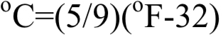
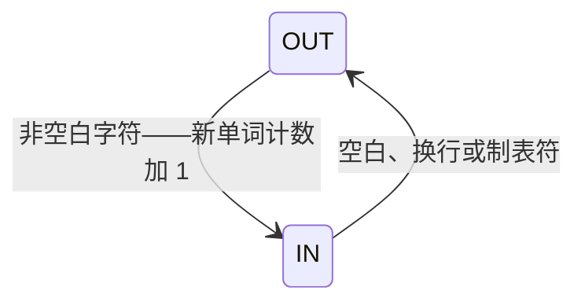
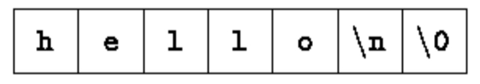

## 1.1 入门

学习一门新语言唯一的途径就是用这门语言编写程序。第一个程序对所有语言都一样：

```c
#include <stdio.h>
main()
{
    printf("hello, world\n");
}
```

运行一个 C 程序的步骤：在编辑器中创建源文件 → 编译 → 链接 → 运行。程序各部分的作用：

| 构成 | 作用 |
|-- | --|
| #include <stdio.h> | 告诉编译器包含标准输入/输出库(standard input/output library)的有关信息 |
| main() | 定义一个名为 main 的函数，它不接收参数值 |
| printf("hello, world\n"); | main 调用库函数 printf 打印这个字符序列，\n 表示换行符(newline character) |
| { } | main 的语句用花括号括起来 |

一个 C 语言程序，无论大小，都由**函数**和**变量**组成。函数包含执行计算过程的**语句**，变量用于存储计算过程中使用的值。每个程序都从 `main` 函数开始执行。

下述转义序列(escape sequences)用于表示无法直接输入或不可见的字符：

| 转义 | 含义 |
|-- | --|
| \n | 换行符，打印时把输出推进到下一行的左端 |
| \t | 制表符(tab) |
| \b | 回退符(backspace) |

## 1.2 变量与算术表达式

下面的程序打印华氏温度(Fahrenheit)与摄氏温度(Celsius)对照表，使用公式：



| Fahrenheit |Celsius |
|--|--|
|0 |	-17 |
|20	| -6 |
|40	| 4 |
|60	|15 |
|80	| 26 |
|100	|37 |
|120	| 48  |
|140	|60 |
|160	|71 |
|180	|82 |
|200	|93 |
|220	|104 |
|240	|115 |
|260	|126 |
|280	|137 |
|300	|148 |

```c
#include <stdio.h>

/* print Fahrenheit-Celsius table
    for fahr = 0, 20, ..., 300 */
main() {
    int fahr, celsius;
    int lower, upper, step;
    lower = 0;   /* 温度表下限 */
    upper = 300; /* 上限 */
    step = 20;   /* 步长 */
    fahr = lower;
    while (fahr <= upper) {
        celsius = 5 * (fahr - 32) / 9;
        printf("%d\t%d\n", fahr, celsius);
        fahr = fahr + step;
    }
}
```

几点说明：

- C 中的**赋值**用 `=` 完成，判断相等用 `==`；`int fahr, celsius;` 声明变量的类型
- 整数除法会**截断**小数部分，所以写 `5 * (fahr - 32) / 9` 而不是 `(5 / 9) * (fahr - 32)`——后者 `5 / 9` 会先被截断为 0
- 循环体用花括号括起；缩进和换行的排版规则编译器并不关心，但恰当的缩进能让程序结构一目了然

C 提供了几种基本数据类型：

| 类型 | 含义 | 典型范围（因机器而异） |
|--|--| --|
| int | 整数(integer) | 16 位 int 介于 -32768 与 +32767 之间 |
|float | 浮点数(floating point) | |
| char | 字符(character)——单字节 | |
| short | 短整型(short integer) | |
| long | 长整型(long integer) | |
| double | 双精度浮点数(double-precision floating point) | |

`printf` 是一个通用输出格式化函数，每个 **%** 指定其余参数（第二个、第三个……）之一在哪里被替换、以什么形式打印，如 `%d` 指定一个整数参数：

> **printf** is not part of the C language; there is no input or output defined in C itself. **printf** is just a useful function from the standard library of functions that are normally accessible to C programs.
>
> printf 不是 C 语言本身的一部分，C 本身没有定义输入输出。它只是标准函数库中一个有用的函数，其行为由 ANSI 标准定义，任何遵循该标准的编译器和库对它的实现都是一致的。

浮点数版本的温度表：

```c
#include <stdio.h>
   /* print Fahrenheit-Celsius table
       for fahr = 0, 20, ..., 300; floating-point version */
main() {
    float fahr, celsius;
    float lower, upper, step;
    lower = 0;   /* 温度表下限 */
    upper = 300; /* 上限 */
    step = 20;   /* 步长 */
    fahr = lower;
    while (fahr <= upper) {
        celsius = (5.0 / 9.0) * (fahr - 32.0);
        printf("%3.0f %6.1f\n", fahr, celsius);
        fahr = fahr + step;
    }
}
```

转换说明 **%3.0f** 表示浮点数（这里是 fahr）至少打印 3 个字符宽，不带小数点和小数部分；**%6.1f** 表示另一个数（celsius）至少 6 个字符宽、小数点后保留 1 位数字。宽度与精度都可以省略：

| 说明 | 含义 |
|--|--|
| %d | 按十进制整数打印 |
| %6d | 按十进制整数打印，至少 6 个字符宽 |
| %f | 按浮点数打印 |
| %6f | 按浮点数打印，至少 6 个字符宽 |
| %.2f | 按浮点数打印，小数点后 2 位，宽度不限 |
| %6.2f | 按浮点数打印，至少 6 个字符宽、小数点后 2 位 |
| %o | 八进制(octal) |
| %x | 十六进制(hexadecimal) |
| %c | 字符 |
| %s | 字符串(character string) |
| %% | 打印百分号本身 |

## 1.3 for 语句

> 本节原摘录未收录，按原书补写。

同一个温度表程序用 for 语句改写：

```c
#include <stdio.h>

/* print Fahrenheit-Celsius table */
main() {
    int fahr;
    for (fahr = 0; fahr <= 300; fahr = fahr + 20)
        printf("%d %6.1f\n", fahr, (5.0 / 9.0) * (fahr - 32));
}
```

for 语句把循环的三要素集中到一处：**初始化**（fahr = 0）、**终止条件**（fahr <= 300）、**步进**（fahr = fahr + 20）。相比 while，for 更适合初始化和步进简单的计数循环——控制语句集中在一行，改起来只动一处。经验法则：循环控制简单、步进规律时用 for，其他情况用 while。

## 1.4 符号常量

温度表程序里的 300、20 这类"幻数"(magic number)读起来不知所云，也给修改带来麻烦。处理幻数的一种方法是给它们起个有意义的名字。`#define` 定义**符号常量**(symbolic constant)：

```c
#define name replacement list
```

```c
#include <stdio.h>

#define LOWER  0    /* 表的下限 */
#define UPPER  300  /* 上限 */
#define STEP   20   /* 步长 */

/* print Fahrenheit-Celsius table */
main() {
    int fahr;
    for (fahr = LOWER; fahr <= UPPER; fahr = fahr + STEP)
        printf("%3d %6.1f\n", fahr, (5.0 / 9.0) * (fahr - 32));
}
```

LOWER、UPPER、STEP 是符号常量而不是变量，不出现在声明中。符号常量名习惯用**大写**，便于与通常小写的变量名区分。注意 `#define` 行末**没有分号**。

## 1.5 字符输入与输出

标准库支持的输入输出模型非常简单：文本输入/输出不论来源与去向，都被当作**字符流**(text stream)处理——字符流是多行字符的序列，每行由 0 个或多个字符加一个换行符组成。让流符合这一模型是库的职责，使用库的 C 程序员不必关心行在程序之外如何表示。

标准库提供了每次读写一个字符的函数，其中 `getchar` 和 `putchar` 最简单。`getchar` 每次被调用时从文本流读入下一个字符并返回：

```c
c = getchar();
```

变量 c 中就是下一个输入字符。`putchar` 每次调用打印一个字符：

```c
putchar(c);
```

### 1.5.1 文件复制

```c
#include <stdio.h>

/* copy input to output; 1st version  */
main() {
    int c;
    c = getchar();
    while (c != EOF) {
        putchar(c);
        c = getchar();
    }
}
```

问题的关键在于区分**输入的结束**与合法数据。解决方案是：没有更多输入时，getchar 返回一个不会与任何真实字符混淆的特定值——**EOF**(end of file, 文件结束标志)。

c 必须声明为 `int` 而不是 `char`：它要大到足以容纳 getchar 返回的任何值——除了任何可能的字符，还得装下 EOF。EOF 是 `<stdio.h>` 中定义的一个整数，具体数值无关紧要，只要不与任何 char 值相同即可。

更紧凑的写法——赋值表达式本身有值，可以放在条件里：

```c
#include <stdio.h>
main() {
    int c;
    while ((c = getchar()) != EOF) {
        putchar(c);
    }
}
```

`!=` 的优先级**高于** `=`，所以括号必不可少：

```c
c = getchar() != EOF
```

等价于

```c
c = (getchar() != EOF)
```

这会把 c 置成 0 或 1（取决于 getchar 是否遇到文件结束），并非本意。

### 1.5.2 字符计数

```c
#include <stdio.h>
/* count characters in input; 1st version */
main() {
    long nc;
    nc = 0;
    while (getchar() != EOF)
        ++nc;
    printf("%ld\n", nc);
}
```

`long` 表示长整型，转换说明 `%ld` 告诉 printf 对应参数是 long 整数。`++nc` 是自增 1 的新运算符（相应有 `--` 减 1）。

double 版本可以计数更大的数：

```c
#include <stdio.h>

/* count characters in input; 2nd version */
main() {
    double nc;
    for (nc = 0; getchar() != EOF; ++nc)
        ;
    printf("%.0f\n", nc);
}
```

printf 对 float 和 double 都用 `%f`；`%.0f` 抑制小数点和小数部分的打印。这个 for 循环体是空的——所有工作都在测试和步进部分完成，而 C 的语法要求 for 必须有循环体，这个孤立的分号叫**空语句**(null statement)，单独占一行使其醒目。

### 1.5.3 行计数

```c
#include <stdio.h>

/* count lines in input */
main() {
    int c, nl;
    nl = 0;
    while ((c = getchar()) != EOF)
        if (c == '\n')
            ++nl;
    printf("%d\n", nl);
}
```

`'\n'` 是换行符的字符值，在 ASCII(American Standard Code for Information Interchange, 美国信息交换标准码)中是 10。注意仔细区分：`'\n'` 是**单个字符**，在表达式中就是一个整数；而 `"\n"` 是恰好只包含一个字符的**字符串常量**。

### 1.5.4 单词计数

统计行数、单词数和字符数，单词的宽松定义是：不含空白、制表符及换行符的连续字符序列。这是 UNIX 程序 wc 的骨架版本：

```c
#include <stdio.h>

#define IN   1  /* 在单词内部 */
#define OUT  0  /* 在单词外部 */

/* count lines, words, and characters in input */
main() {
    int c, nl, nw, nc, state;
    state = OUT;
    nl = nw = nc = 0;
    while ((c = getchar()) != EOF) {
        ++nc;
        if (c == '\n')
            ++nl;
        if (c == ' ' || c == '\n' || c == '\t')
            state = OUT;
        else if (state == OUT) {
            state = IN;
            ++nw;
        }
    }
    printf("%d %d %d\n", nl, nw, nc);
}
```

程序用一个 state 变量在"单词内/单词外"两个状态间切换，遇到第一个非空白字符时计入一个新单词：



`nl = nw = nc = 0;` 把三个变量串行赋值为 0；`||` 表示 OR 运算。

## 1.6 数组

下述程序统计各个数字、空白符及其他字符出现的次数，用数组而不是十个独立变量：

```c
#include <stdio.h>

/* count digits, white space, others */
main() {
    int c, i, nwhite, nother;
    int ndigit[10];
    nwhite = nother = 0;
    for (i = 0; i < 10; ++i)
        ndigit[i] = 0;
    while ((c = getchar()) != EOF)
        if (c >= '0' && c <= '9')
            ++ndigit[c - '0'];
        else if (c == ' ' || c == '\n' || c == '\t')
            ++nwhite;
        else
            ++nother;
    printf("digits =");
    for (i = 0; i < 10; ++i)
        printf(" %d", ndigit[i]);
    printf(", white space = %d, other = %d\n", nwhite, nother);
}
```

`int ndigit[10];` 声明一个由 10 个 int 组成的**数组**，元素访问 `ndigit[i]`，下标从 0 开始。判断是否数字的 `c >= '0' && c <= '9'` 依赖 '0'、'1'……在字符集中连续递增这一性质；表达式 `c - '0'` 得到字符 c 对应的数字值——这是把字符数字转成数值数字的惯用写法。

## 1.7 函数

**函数**(function)封装了一段计算，使用时无需关心其实现——设计得当的函数让人只需知道它做什么，不必管它怎么做。

```c
#include <stdio.h>

int power(int m, int n);

/* test power function */
main() {
    int i;
    for (i = 0; i < 10; ++i)
        printf("%d %d %d\n", i, power(2, i), power(-3, i));
    return 0;
}

/* power:  raise base to n-th power; n >= 0 */
int power(int base, int n) {
    int i, p;
    p = 1;
    for (i = 1; i <= n; ++i)
        p = p * base;
    return p;
}
```

函数定义的一般形式：

```c
返回类型 函数名(参数声明列表)
{
    声明与语句
}
```

`int power(int m, int n);` 是函数**原型**(prototype)声明——参数名可写可不写。程序可以看作变量与函数定义的集合，函数之间没有先后依赖的顺序限制，main 也可以被其他函数调用。`return` 后面可以跟任意表达式，作为返回值；`return` 不带表达式时只交回控制权不返回值。省略返回类型的函数默认返回 int。

## 1.8 参数——传值调用

C 中所有函数参数都是**传值调用**(call by value)：被调用函数收到的参数是实际参数值的**临时副本**，直接修改形参不影响调用方的变量——

> In C the called function cannot directly alter a variable in the calling function; it can only alter its private temporary copy.
>
> 在 C 中，被调用函数不能直接修改调用函数中的变量，只能修改它的私有临时副本。

传值调用是资产而非负担：形参可以当作"已方便初始化的局部变量"随意使用，往往让程序更紧凑。例如把 power 的参数 n 当临时变量递减计数，连局部变量 i 都省了：

```c
#include <stdio.h>

int power(int m, int n);

main() {
    int i;
    for (i = 0; i < 10; ++i)
        printf("%d %d %d\n", i, power(2, i), power(-3, i));
    return 0;
}
int power(int base, int n) {
    int p;
    for (p = 1; n > 0; --n)
        p = p * base;
    return p;
}
```

n 在 power 内部怎么变都不影响调用时传进来的实参。若确实要让被调函数修改调用方的变量，调用方必须提供该变量的**地址**(address)（技术上即指向该变量的指针），被调函数把参数声明为指针并通过它间接访问——这是第 5 章的主题。

**数组**是例外：数组名作为参数时，传给函数的是数组**起始元素的地址**，不复制数组元素。函数通过下标既可访问也可修改数组元素。

## 1.9 字符数组

文本是字符数组最常见的用途之一。下面的程序读取输入行集合，打印最长的一行：

```c
#include <stdio.h>

#define MAXLINE 1000   /* maximum input line length */

int getline(char line[], int maxline);

void copy(char to[], char from[]);

/* print the longest input line */
main() {
    int len;            /* 当前行长度 */
    int max;            /* 目前为止见到的最大长度 */
    char line[MAXLINE];      /* 当前输入行 */
    char longest[MAXLINE];   /* 保存的最长行 */
    max = 0;
    while ((len = getline(line, MAXLINE)) > 0)
        if (len > max) {
            max = len;
            copy(longest, line);
        }
    if (max > 0) /* there was a line */
        printf("%s", longest);
    return 0;
}

/* getline:  read a line into s, return length  */
int getline(char s[], int lim) {
    int c, i;
    for (i = 0; i < lim - 1 && (c = getchar()) != EOF && c != '\n'; ++i)
        s[i] = c;
    if (c == '\n') {
        s[i] = c;
        ++i;
    }
    s[i] = '\0';
    return i;
}

/* copy:  copy 'from' into 'to'; assume to is big enough */
void copy(char to[], char from[]) {
    int i;
    i = 0;
    while ((to[i] = from[i]) != '\0')
        ++i;
}
```

getline 与 copy 在程序开头声明。getline 在构造的字符数组末尾放上 `'\0'`——**空字符**(null character)，值为 0——标记字符串的结束。这一约定也被语言本身采用：程序中出现的字符串常量（如 `"hello\n"`）都存储为字符数组，结尾自动补 `'\0'`。printf 的 `%s` 按此约定打印到 `'\0'` 为止。



`'\0'` 不是普通文本的一部分，输出不可见，但它作为结束标志让 strlen 等函数无需知道数组长度就能确定字符串的长度。

## 1.10 外部变量与作用域

自动(局部)变量在函数内部声明、函数退出即消失。与之相对，可以定义对所有函数都可见的**外部变量**(external variable)：任何函数都可以按名字访问它，因此可以用外部变量代替参数表在函数间交换数据；并且外部变量**永久存在**——不会随函数调用与返回而出现和消失，即使对它赋值的函数已经返回，它的值仍然保留。

外部变量必须**定义**在所有函数之外，且只能定义一次——定义时为它分配存储；每个想使用它的函数必须**声明**它，声明可以用显式的 `extern` 语句，也可以由上下文隐式获得。用外部变量改写"最长行"程序：

```c
#include <stdio.h>

#define MAXLINE 1000
int max;                /* maximum length seen so far */
char line[MAXLINE];     /* current input line */
char longest[MAXLINE];  /* longest line saved here */

int getline(void);
void copy(void);

/* print longest input line; specialized version */
main() {
    int len;
    extern int max;
    extern char longest[];
    max = 0;
    while ((len = getline()) > 0)
        if (len > max) {
            max = len;
            copy();
        }
    if (max > 0) /* there was a line */
        printf("%s", longest);
    return 0;
}

/* getline:  specialized version */
int getline(void) {
    int c, i;
    extern char line[];
    for (i = 0; i < MAXLINE - 1 &&
            (c = getchar()) != EOF && c != '\n'; ++i)
        line[i] = c;
    if (c == '\n') {
        line[i] = c;
        ++i;
    }
    line[i] = '\0';
    return i;
}

/* copy: specialized version */
void copy(void) {
    int i;
    extern char line[], longest[];
    i = 0;
    while ((longest[i] = line[i]) != '\0')
        ++i;
}
```

函数使用外部变量前必须让它的名字对函数可见——声明方式与之前一样，只是多了关键字 `extern`。惯常做法是把变量与函数的 `extern` 声明集中放在一个单独的文件（历史上称为**头文件**, header）中，用 `#include` 包含到每个源文件开头，头文件名习惯用 `.h` 后缀。

这里对**定义**(definition)与**声明**(declaration)的使用是有意区分的：定义指创建变量、分配存储的位置；声明指说明变量的性质但**不分配存储**的地方。

> Relying too heavily on external variables is fraught with peril since it leads to programs whose data connections are not all obvious - variables can be changed in unexpected and even inadvertent ways, and the program is hard to modify.
>
> 过分依赖外部变量充满危险：程序的数据连接不再一目了然，变量可能在意外甚至无意识的情况下被修改，程序也变得难以改动。
