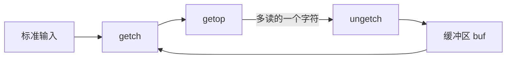
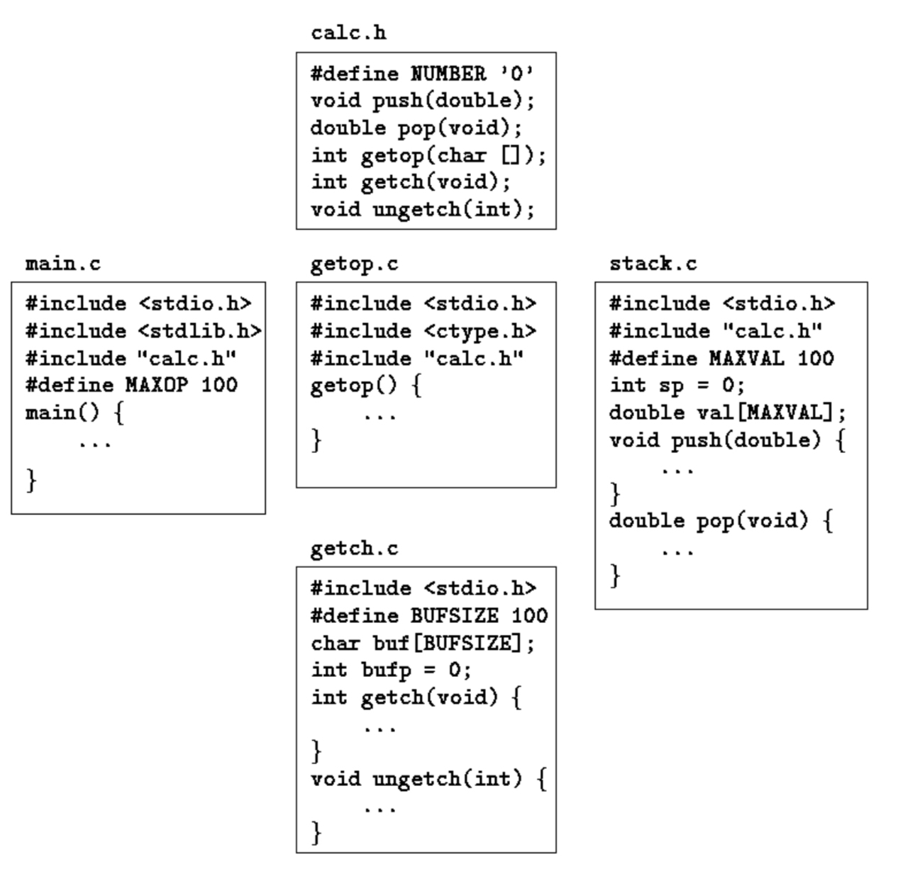

## 4.1 函数的基本知识

函数把一个计算过程打包，之后可以不必关心实现细节直接使用。以"在输入行中查找字母模式 ould"的程序为例，输入：

```c
 Ah Love! could you and I with Fate conspire
 To grasp this sorry Scheme of Things entire,
 Would not we shatter it to bits -- and then
 Re-mould it nearer to the Heart's Desire!
```

输出包含 ould 的行：

```c
Ah Love! could you and I with Fate conspire
Would not we shatter it to bits -- and then
Re-mould it nearer to the Heart's Desire!
```

程序从 main 返回匹配的行数，这个状态值可被调用该程序的环境使用：

```c
#include <stdio.h>

#define MAXLINE 1000 /* maximum input line length */

int getlinee(char line[], int max);

int strindex(char source[], char searchfor[]);

char pattern[] = "ould";   /* pattern to search for */

/* find all lines matching pattern */
main() {
    char line[MAXLINE];
    int found = 0;
    while (getlinee(line, MAXLINE) > 0)
        if (strindex(line, pattern) >= 0) {
            printf("%s", line);
            found++;
        }
    return found;
}

/* getline:  get line into s, return length */
int getlinee(char s[], int lim) {
    int c, i;
    i = 0;
    while (--lim > 0 && (c = getchar()) != EOF && c != '\n')
        s[i++] = c;
    if (c == '\n')
        s[i++] = c;
    s[i] = '\0';
    return i;
}

/* strindex:  return index of t in s, -1 if none */
int strindex(char s[], char t[]) {
    int i, j, k;
    for (i = 0; s[i] != '\0'; i++) {
        for (j = i, k = 0; t[k] != '\0' && s[j] == t[k]; j++, k++);
        if (k > 0 && t[k] == '\0')
            return i;
    }
    return -1;
}
```

每个函数定义的形式：

```c
返回类型 函数名(参数声明)
{
    声明与语句
}
```

最小的函数是

```c
dummy() {}
```

它什么也不做、不返回任何值。这类空函数在程序开发中常作占位符使用。返回类型省略时默认为 int。

程序就是变量和函数定义的集合。函数之间的通信靠参数与返回值，以及外部变量。函数在源文件中的出现顺序任意，源程序也可以拆分到多个文件中，只要单个函数不被拆开即可。

调用函数可以忽略返回值。若一个函数在这里返回值、在那里不返回，虽不违法但多半是麻烦的征兆——未返回值时函数的"值"必然是垃圾。

编译和加载分布在多个源文件中的程序，其具体机制因系统而异。UNIX 上由 cc 命令完成：设三个函数分别存于 `main.c、getline.c、strindex.c`，则

```c
cc main.c getline.c strindex.c
```

编译三个文件（目标代码放入 main.o、getline.o、strindex.o），再一起加载为可执行文件 a.out。若只有 main.c 有错，可单独重编译它并与已有目标文件链接：

```c
cc main.c getline.o strindex.o
```

cc 按 `.c` 与 `.o` 的后缀区分源文件与目标文件。

## 4.2 返回非整型值的函数

`atof(s)`（ascii to floating point numbers，字符串转浮点数）把字符串 s 转换为等价的双精度浮点数。它是 atoi 的扩展：处理可选的符号与小数点，以及整数部分、小数部分任一缺失的情形。

首先，atof 返回的不是 int，必须声明返回类型——类型名写在函数名前面：

```c
#include <ctype.h>

/* atof:  convert string s to double */
double atof(char s[]) {
    double val, power;
    int i, sign;
    for (i = 0; isspace(s[i]); i++)  /* skip white space */
        ;
    sign = (s[i] == '-') ? -1 : 1;
    if (s[i] == '+' || s[i] == '-')
        i++;
    for (val = 0.0; isdigit(s[i]); i++)
        val = 10.0 * val + (s[i] - '0');
    if (s[i] == '.')
        i++;
    for (power = 1.0; isdigit(s[i]); i++) {
        val = 10.0 * val + (s[i] - '0');
        power *= 10;
    }
    return sign * val / power;
}
```

其次同样重要的是：**调用方必须知道 atof 返回非 int 值**，办法是在调用例程中显式声明 atof。下面这个简陋的计算器（勉强够对账用）每行读一个可带符号的数并累加、打印当前和：

```c
#include <stdio.h>

#define MAXLINE 100

/* rudimentary calculator */
main() {
    double sum, atof(char []);
    char line[MAXLINE];
    int getline(char line[], int max);
    sum = 0;
    while (getline(line, MAXLINE) > 0)
        printf("\t%g\n", sum += atof(line));
    return 0;
}
```

声明

```c
double sum, atof(char []);
```

说明 sum 是 double 变量，同时说明 atof 是接收一个 char[] 参数、返回 double 的函数。

atof 的声明与定义必须一致。若 atof 与 main 中对它的调用在同一源文件中类型不一致，编译器能查出错误；但若（更常见的情形）atof 单独编译，不匹配无法被发现——atof 返回 double 而 main 当作 int 使用，结果将毫无意义。

## 4.3 外部变量

**外部变量**(external variables)定义在所有函数之外，因此 potentially 可供许多函数使用。函数本身总是外部的——C 不允许在函数内部定义函数。默认情况下，**同名的外部变量与函数**即使来自分别编译的文件，指的也是同一个实体。

大量变量需要在函数间共享时，外部变量比长参数表更方便高效。但要谨慎：这可能破坏程序结构，造成函数间数据连接过多。

外部变量还因**作用域更广、生存期更长**而有用：**自动变量**是函数内部的，随函数进入而存在、离开而消失；**外部变量则是永久的**，能在一次函数调用到下一次之间保持值。因此，两个需要共享数据而互不调用的函数，把共享数据放在外部变量中往往最方便。

示例程序：支持 +、-、*、/ 的计算器。为了便于实现，采用**逆波兰表示法**(Reverse Polish notation, 后缀表达式)而非中缀——部分袖珍计算器和 Forth、PostScript 语言使用它。

> 逆波兰式（后缀表达式）：我们平时写 a+b，这是中缀表达式，写成后缀表达式就是 ab+；(a+b)*c-(a+b)/e 的后缀表达式为 ab+c*ab+e/-

中缀表达式

```c
(1 - 2) * (4 + 5)
```

按逆波兰输入为

```c
12-45+*
```

逆波兰式的实现关键：**操作数依次入栈，遇到运算符弹出所需操作数、把结果入栈**。主程序：

```c
#include <stdio.h>
#include <stdlib.h>  /* for  atof() */

#define MAXOP   100  /* max size of operand or operator */
#define NUMBER  '0'  /* signal that a number was found */

int getop(char []);

void push(double);

double pop(void);

/* reverse Polish calculator */
main() {
    int type;
    double op2;
    char s[MAXOP];
    while ((type = getop(s)) != EOF) {
        switch (type) {
            case NUMBER:
                push(atof(s));
                break;
            case '+':
                push(pop() + pop());
                break;
            case '*':
                push(pop() * pop());
                break;
            case '-':
                op2 = pop();
                push(pop() - op2);
                break;
            case '/':
                op2 = pop();
                if (op2 != 0.0)
                    push(pop() / op2);
                else
                    printf("error: zero divisor\n");
                break;
            case '\n':
                printf("\t%.8g\n", pop());
                break;
            default:
                printf("error: unknown command %s\n", s);
                break;
        }
    }
    return 0;
}
```

注意 `-` 和 `/` 要先弹出第二个操作数存入 op2——两个 pop 的求值顺序没有保证。push 与 pop 借外部变量实现栈（错误检查简化）：

```c
#define MAXVAL  100  /* maximum depth of val stack */
int sp = 0;          /* next free stack position */
double val[MAXVAL];  /* value stack */
/* push:  push f onto value stack */
void push(double f) {
    if (sp < MAXVAL)
        val[sp++] = f;
    else
        printf("error: stack full, can't push %g\n", f);
}

/* pop:  pop and return top value from stack */
double pop(void) {
    if (sp > 0)
        return val[--sp];
    else {
        printf("error: stack empty\n");
        return 0.0;
    }
}
```

getop 取下一个运算符或数值操作数：

```c
#include <ctype.h>

int getch(void);

void ungetch(int);

/* getop:  get next character or numeric operand */
int getop(char s[]) {
    int i, c;
    while ((s[0] = c = getch()) == ' ' || c == '\t');
    s[1] = '\0';
    if (!isdigit(c) && c != '.')
        return c;      /* not a number */
    i = 0;
    if (isdigit(c))    /* collect integer part */
        while (isdigit(s[++i] = c = getch()));
    if (c == '.')      /* collect fraction part */

        while (isdigit(s[++i] = c = getch()));
    s[i] = '\0';
    if (c != EOF)
        ungetch(c);
    return NUMBER;
}
```

getch 与 ungetch 是干什么的？程序常常在**读多了**之后才发现读够了——收集组成数字的字符就是一例：看到第一个非数字时数字才算完整，但此时已经多读了一个程序没有准备的字符。

如果能"反读"(un-read)这个多余字符，问题就解决了：每次多读，就把它压回输入，其余代码就像从未读过它一样。模拟反读很容易——写一对配合的函数：`getch` 取下一个待处理的输入字符；`ungetch` 把字符放回输入，让下次 getch 先返回它。缓冲区与下标由两者共享、调用间要保持值，因此必须定义为外部变量：

```c
#define BUFSIZE 100
char buf[BUFSIZE];    /* buffer for ungetch */
int bufp = 0;         /* next free position in buf */
int getch(void)  /* get a (possibly pushed-back) character */
{
    return (bufp > 0) ? buf[--bufp] : getchar();
}

void ungetch(int c)   /* push character back on input */
{
    if (bufp >= BUFSIZE)
        printf("ungetch: too many characters\n");
    else
        buf[bufp++] = c;
}
```



## 4.4 作用域规则

组成 C 程序的函数与外部变量不必同时编译：源程序可保存在多个文件中，已编译的例程可从库中加载。关心的问题有：

- 声明怎么写，变量在编译时才能正确声明？
- 声明怎么安排，程序加载时各部分才能正确连接？
- 声明怎么组织，才能保证只有一份拷贝？
- 外部变量如何初始化？

名字的**作用域**(scope)是程序中可以使用该名字的部分。在函数开头声明的**自动变量**，作用域就是所在函数；不同函数中的同名局部变量互不相关，函数的形参也是如此——**形参实际上就是局部变量**。

> 自动变量（Automatic Variable）指局部作用域变量：控制流进入其作用域时系统自动分配存储空间，离开时释放。许多语言中"自动变量"与"局部变量"（Local Variable）同义。

**外部变量或函数的作用域，从声明处持续到被编译文件的末尾**。例如若 main、sp、val、push、pop 按如下顺序定义在一个文件中：

```c
   main() { ... }
   int sp = 0;
   double val[MAXVAL];
   void push(double f) { ... }
   double pop(void) { ... }
```

则 push 和 pop 中直接用名字就能访问 sp 和 val，无需更多声明；但这些名字在 main 中不可见，push、pop 本身也不可见。

反之，若外部变量要在定义之前使用、或定义在与使用不同的源文件中，就必须用 **extern 声明**。

必须区分外部变量的**声明**与**定义**：**声明**宣布变量的性质（主要是类型）；**定义**还引起存储分配。若

```c
 int sp;
 double val[MAXVAL];
```

出现在所有函数之外，它们就**定义**了外部变量 sp 和 val——分配存储，**同时为其后整个源文件充当声明**。而

```c
 extern int sp;
 extern double val[];
```

为源文件的其余部分**声明**了 sp 是 int、val 是 double 数组（大小在别处确定），但**不创建变量、不分配存储**。

组成源程序的所有文件中，外部变量**只能定义一次**；其他文件可以用 extern 声明来访问它（定义所在文件中也可以有 extern 声明）。**数组大小必须随定义给出**，extern 声明中则可选。外部变量的初始化只随定义进行。

push、pop 与 val、sp 分置两个文件时的组织方式：

- file1：

```c
extern int sp;
extern double val[];
void push(double f) { ... }
double pop(void) { ... }
```

- file2：

```c
int sp = 0;
double val[MAXVAL];
```

file1 的 extern 声明位于所有函数定义之前，因此作用于全部函数——一份声明对整个 file1 足够。同一文件中 sp、val 的定义位于使用之后时，也需要这种组织。

## 4.5 头文件

把上一节的计算器程序按功能拆分为五个文件，公共声明集中到头文件 calc.h 中：



- calc.h

```c
#define NUMBER  '0'
void push(double);
double pop(void);
int getop(char []);
int getch(void);
void ungetch(int);
```

- main.c

```c
#include <stdio.h>
#include <stdlib.h>
#include "calc.h"
/* reverse Polish calculator */
#define MAXOP   100  /* max size of operand or operator */
main() {
    int type;
    double op2;
    char s[MAXOP];
    while ((type = getop(s)) != EOF) {
        switch (type) {
            case NUMBER:
                push(atof(s));
                break;
            case '+':
                push(pop() + pop());
                break;
            case '*':
                push(pop() * pop());
                break;
            case '-':
                op2 = pop();
                push(pop() - op2);
                break;
            case '/':
                op2 = pop();
                if (op2 != 0.0)
                    push(pop() / op2);
                else
                    printf("error: zero divisor\n");
                break;
            case '\n':
                printf("\t%.8g\n", pop());
                break;
            default:
                printf("error: unknown command %s\n", s);
                break;
        }
    }
    return 0;
}
```

- getop.c

```c
#include <stdio.h>
#include <ctype.h>
#include "calc.h"

/* getop:  get next character or numeric operand */
int getop(char s[]) {
    int i, c;
    while ((s[0] = c = getch()) == ' ' || c == '\t');
    s[1] = '\0';
    if (!isdigit(c) && c != '.')
        return c;      /* not a number */
    i = 0;
    if (isdigit(c))    /* collect integer part */
        while (isdigit(s[++i] = c = getch()));
    if (c == '.')      /* collect fraction part */

        while (isdigit(s[++i] = c = getch()));
    s[i] = '\0';
    if (c != EOF)
        ungetch(c);
    return NUMBER;
}
```

- stack.c

```c
#include <stdio.h>
#include "calc.h"
#define MAXVAL  100  /* maximum depth of val stack */
int sp = 0;          /* next free stack position */
double val[MAXVAL];  /* value stack */
/* push:  push f onto value stack */
void push(double f) {
    if (sp < MAXVAL)
        val[sp++] = f;
    else
        printf("error: stack full, can't push %g\n", f);
}

/* pop:  pop and return top value from stack */
double pop(void) {
    if (sp > 0)
        return val[--sp];
    else {
        printf("error: stack empty\n");
        return 0.0;
    }
}
```

- getch.c

```c
#include <stdio.h>
#define BUFSIZE 100
char buf[BUFSIZE];    /* buffer for ungetch */
int bufp = 0;         /* next free position in buf */
int getch(void)  /* get a (possibly pushed-back) character */
{
    return (bufp > 0) ? buf[--bufp] : getchar();
}

void ungetch(int c)   /* push character back on input */
{
    if (bufp >= BUFSIZE)
        printf("ungetch: too many characters\n");
    else
        buf[bufp++] = c;
}
```

这样划分后，只改动 push/pop 就只需重编译 stack.c；buf、bufp 藏在 getch.c 里，别处看不见。头文件是"各文件共知内容"的唯一事实来源。

## 4.6 静态变量

stack.c 中的 sp、val 与 getch.c 中的 buf、bufp 只供各自文件中的函数私有使用，不应被其他任何代码访问。**static 声明作用于外部变量或函数时，把该对象的作用域限制在本次编译的源文件其余部分**。**外部 static** 正提供了隐藏名字的手段：buf、bufp 必须是外部变量（要在 getch 与 ungetch 间共享），又不应被 getch/ungetch 的使用者看见。

static 声明写在正常声明之前即可。若两个函数和两个变量编译在一个文件中：

```c
 static char buf[BUFSIZE];  /* buffer for ungetch */
 static int bufp = 0;       /* next free position in buf */
 int getch(void) { ... }
 void ungetch(int c) { ... }
```

则其他例程都无法访问 buf 和 bufp，这两个名字也不会与程序其他文件中的同名冲突。同理，把 sp、val 声明为 static 即可隐藏 push、pop 的栈操作细节。

**外部 static 也可用于函数**。函数名字通常是全局的、对整个程序的任何部分可见；声明为 static 的函数，其名字在所在文件之外不可见。

static 还可用于**内部变量**。**内部 static 变量**像自动变量一样是某个函数的局部变量，但与自动变量不同，它**始终存在**，不随函数的每次激活而来去——内部 static 提供了单一函数私有的永久存储。

## 4.7 寄存器变量

**register 声明**告诉编译器某个变量将被频繁使用，建议把它放进**机器寄存器**，从而让程序更小更快——但编译器可以忽略这个建议：

```c
 register int  x;
 register char c;
```

register 只能作用于**自动变量**和**函数的形参**。作用于形参时：

```c
 f(register unsigned m, register long n)
   {
       register int i;
... }
```

实践中 register 变量有一些限制，反映底层硬件的现实：每个函数只有少数变量能放在寄存器中，且只允许某些类型。多余的 register 声明无害——超出或不允许时 register 一词被忽略。另外，无论变量是否真被放进寄存器，都**无法取 register 变量的地址**。具体限制因机器而异。

## 4.8 程序块结构

C 不是**程序块结构化语言**(block-structured language)，因为函数不能嵌套定义。但在函数内部，**变量可以按块结构方式定义**：变量声明（含初始化）可以出现在任何复合语句的左花括号之后，而不仅是函数开头。这样声明的变量隐藏外层块中的同名变量，存在到匹配的右花括号为止：

```c
if (n > 0) {
    int i; /*declare a new i*/
    for (i = 0; i < n; i++)
        ...
}
```

变量 i 的作用域是 if 的"真"分支，**这个 i 与块外任何 i 无关**。在块中声明并初始化的自动变量，每次进入该块都重新初始化。

自动变量（包括形参）也会**隐藏同名的外部变量与函数**：

```c
int x; int y;
f(double x)
{
double y;
}
```

函数 f 内的 x 指的是 double 型形参，f 外的 x 指外部 int；y 同理。就风格而言，最好避免这种遮蔽外层名字的命名——混淆与出错的风险太大。

## 4.9 初始化

未显式初始化时，**外部变量与 static 变量**保证为零；**自动变量与 register 变量**的初值未定义（垃圾值）。

- **外部与 static 变量**：初值必须是**常量表达式**，初始化只做一次，概念上在程序开始执行前完成
- **自动与 register 变量**：初值不限常量，可以是涉及先前定义值的任意表达式，甚至函数调用

**数组**可以在声明后跟花括号括起、逗号分隔的初始化列表。例如每月天数：

```c
 int days[] = { 31, 28, 31, 30, 31, 30, 31, 31, 30, 31, 30, 31 }
```

省略数组大小时，编译器按初始化项数计算长度（这里 12）。初始化项数少于指定大小时，**其余元素为零**（外部、static、自动变量皆然）；初始化项过多则是错误。既无法指定重复的初始化项，也无法跳过前面元素只初始化数组中间的元素。

**字符数组**是特例——可以用字符串代替花括号逗号形式：

```c
char pattern[] = "ould";
```

它是如下较长写法的简写：

```c
char pattern[] = { 'o', 'u', 'l', 'd', '\0' };
```

（原摘录此处误写为 `char pattern = "ould";`，已按原书补上 `[]`。）

## 4.10 递归

函数可以直接或间接调用自身。以十进制打印 n 的 printd 为例：

```c
#include <stdio.h>

/* printd:  print n in decimal */
void printd(int n) {
    if (n < 0) {
        putchar('-');
        n = -n;
    }
    if (n / 10)
        printd(n / 10);
    putchar(n % 10 + '0');
}
```

递归调用时**每次调用都获得全新的一组自动变量**，与前一次互不影响。printd(123)：第一层收到 n=123，把 12 传给第二层；第二层把 1 传给第三层；第三层打印 1 后返回第二层，第二层打印 2 后返回第一层，第一层打印 3 后结束。

快速排序——对 v[left]...v[right] 递增排序，是递归的经典应用：

```c
/* qsort:  sort v[left]...v[right] into increasing order */
void qsort(int v[], int left, int right) {
    int i, last;
    void swap(int v[], int i, int j);
    if (left >= right) /* do nothing if array contains */
        return;        /* fewer than two elements */
    swap(v, left, (left + right) / 2); /* move partition elem */
    last = left;                     /* to v[0] */
    for (i = left + 1; i <= right; i++)  /* partition */
        if (v[i] < v[left])
            swap(v, ++last, i);
    swap(v, left, last);
    qsort(v, left, last - 1);
    qsort(v, last + 1, right);
}
```

```c
/* swap:  interchange v[i] and v[j] */
void swap(int v[], int i, int j) {
    int temp;
    temp = v[i];
    v[i] = v[j];
    v[j] = temp;
}
```

递归并不节省存储（递归调用期间的栈）也不见得更快，但递归代码更紧凑、通常更易读。树这类递归定义的数据结构，用递归处理最自然。

## 4.11 C 预处理器

C 通过**预处理器**(preprocessor)提供若干语言设施——概念上它是编译的第一个独立步骤。最常用的两个特性：

- `#include`：编译时包含指定文件的内容
- `#define`：用任意字符序列替换某个词法单元(token)

本节其余特性包括**带参数的宏**与**条件编译**。

### 4.11.1 文件包含

```c
#include "filename"
#include <filename>
```

**文件名带引号**时，搜索通常从源程序所在处开始；找不到、或名字括在尖括号中时，按**实现定义**的规则搜索。被包含文件本身还可以有 `#include` 行。

源文件开头常有多个 `#include` 行，用于包含公共的 `#define` 与 extern 声明，或从 `<stdio.h>` 这类头文件取得库函数的原型声明（严格说这些不一定是文件，细节与实现有关）。

`#include` 是把大型程序的声明系在一起的首选方式：它保证所有源文件拿到相同的定义与变量声明，从而消除一类特别讨厌的 bug。当然，被包含文件改变时，所有依赖它的文件都要重新编译。

### 4.11.2 宏替换

```c
#define name replacement text
```

即最简单的**宏替换**(macro substitution)——此后出现的词法单元 name 都被替换为 replacement text。name 的形式与变量名相同；replacement text 任意，通常是该行其余部分，长定义可在行尾加 `\` 续行。`#define` 定义的名字作用域从定义处到被编译源文件末尾，定义可以引用之前的定义。替换只针对 token，**不发生在引号字符串内**——若 YES 是已定义名字，printf("YES") 和 YESMAN 中都没有替换。

任何名字都可以定义为任何替换文本，例如定义一个表示无限循环的新词：

```c
#define forever for (;;) /* infinite loop */
```

宏可以带参数：

```c
#define max(A, B) ((A) > (B) ? (A) : (B))
```

调用

```c
 x = max(p+q, r+s);
```

被替换为

```c
 x = ((p+q) > (r+s) ? (p+q) : (r+s));
```

检查 max 的展开可以注意到陷阱：**表达式被求值两次**——当表达式含有自增运算符、输入输出等副作用时后果严重：

```c
max(i++, j++)  /* WRONG */
```

尽管如此，宏依然有价值。`<stdio.h>` 中 getchar、putchar 常定义为宏，避免每字符一次的函数调用开销；`<ctype.h>` 中的函数通常也实现为宏。

`#undef` 取消名字的定义，常用于**确保某个例程真的是函数而非宏**：

```c
  #undef getchar
  int getchar(void) { ... }
```

形参不会被替换进引号字符串；但若替换文本中形参名前加 `#`，组合会被展开为带实参的引号字符串。配合字符串拼接，可以做出调试打印宏：

```c
 #define  dprint(expr)   printf(#expr " = %g\n", expr)
```

调用 `dprint(x/y)` 展开为

```c
 printf("x/y" " = %g\n", x/y);
```

字符串拼接后即

```c
printf("x/y = %g\n", x/y);
```

实参中每个 `"` 替换为 `\"`、每个 `\` 替换为 `\\`，保证结果是合法的字符串常量。

预处理器运算符 `##` 提供宏展开期间拼接实参的手段：替换文本中的参数若与 `##` 相邻，参数被实参替换、`##` 与周围空白被删除、结果重新扫描。例如：

```c
#define paste(front, back) front ## back
```

`paste(name, 1)` 生成词法单元 name1。

### 4.11.3 条件包含

`#if` 行求值一个常量整数表达式（不得含 sizeof、cast、enum 常量）：表达式非零，则其后直到 `#endif`、`#elif` 或 `#else` 的行被包含。`#elif` 类似 else-if。`#if` 表达式中的 defined(name) 在 name 已定义时为 1，否则为 0。

例如保证 hdr.h 只被包含一次，可用条件包裹其内容：

```c
   #if !defined(HDR)
   #define HDR
   /* contents of hdr.h go here */
   #endif
```

第一次包含 hdr.h 时定义了名字 HDR；再次包含时发现已定义，直接跳到 `#endif`。坚持这种风格，每个头文件就能自行包含它依赖的其他头文件，使用者无需处理依赖关系。

根据名字 SYSTEM 决定包含哪个版本的头部：

```c
  #if SYSTEM == SYSV
       #define HDR "sysv.h"
   #elif SYSTEM == BSD
       #define HDR "bsd.h"
   #elif SYSTEM == MSDOS
       #define HDR "msdos.h"
   #else
       #define HDR "default.h"
   #endif
   #include HDR
```

`#ifdef` 与 `#ifndef` 是测试名字是否已定义的专用形式。上面的例子也可写成：

```c
   #ifndef HDR
   #define HDR
   /* contents of hdr.h go here */
   #endif
```
