**指针是包含变量地址的变量**(A pointer is a variable that contains the address of a variable)。

指针常与 goto 语句一起被当作"制造天书程序"的绝佳工具——用得鲁莽时确实如此，很容易造出指向意料之外处的指针。但有纪律地使用，指针同样能带来清晰与简洁。

ANSI C 的主要变化之一就是把指针操作规则显式化——实际上把优秀程序员早已践行、优秀编译器早已强制的东西写进了标准。另外，通用指针的恰当类型由 `void *`（指向 void 的指针）取代了 `char *`。

## 5.1 指针与地址

典型机器有一组连续编号（编址）的存储单元，可以单独或成组操作：一个字节可以是 `char`，相邻两个字节可视为 `short`，相邻四个字节构成一个 `long`。**指针是能存放一个地址的一组存储单元**（通常 2 或 4 个）。若 `c` 是 `char`、`p` 是指向它的指针，可以这样表示：

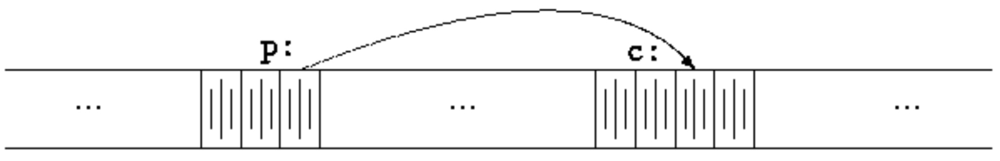

一元运算符 `&` **给出对象的地址**：

```c
p = &c;
```

把 c 的地址赋给 p，称 **p 指向 c**。`&` 只能作用于**内存中的对象：变量与数组元素**，不能作用于表达式、常量或 register 变量。

一元运算符 `*` 是**间接寻址或解引用运算符**(indirection / dereferencing operator)，作用于指针时**访问指针所指的对象**。设 x、y 是整数、ip 是指向 int 的指针：

```c
int x = 1, y = 2, z[10];
int *ip;     /* ip is a pointer to int */

ip = &x;    /* ip now points to x */
y = *ip;    /* y is now 1 */
*ip = 0;    /* x is now 0 */
ip = &z[0]; /* ip now points to z[0] */
```

声明

```c
int *ip;
```

是一种助记：它说明表达式 `*ip` 是 int。**变量声明的语法模仿了该变量可能出现的表达式的语法**。这一推理同样适用于函数声明：

```c
double *dp, atof(char *);
```

说明表达式中 `*dp` 与 `atof(s)` 的值都是 double，且 atof 的参数是指向 char 的指针。

**每个指针都指向一个特定类型**，唯一的例外是"指向 void 的指针"——可以持有任何类型的指针，但自身不能被解引用。

若 ip 指向整数 x，`*ip` 就能出现在 x 能出现的任何场合：

```c
*ip = *ip + 10;   /* *ip 增加 10 */
y = *ip + 1;      /* 取 ip 所指的值加 1 赋给 y */
*ip += 1;         /* ip 所指的值加 1 */
++*ip             /* 同上 */
(*ip)++           /* 同上 */
```

最后一个例子的括号必不可少：`*` 与 `++` 这类一元运算符**从右向左结合**，没有括号就会变成对 ip 自增。

指针是变量，可以不经解引用直接使用。若 iq 是另一个指向 int 的指针：

```c
iq = ip
```

把 ip 的内容拷贝给 iq，使 iq 指向 ip 原来所指的对象。

## 5.2 指针与函数参数

C **按值传参**，被调函数无法直接修改调用函数中的变量。比如排序例程想用 swap 交换两个失序的参数，只写

```c
swap(a, b);
```

是不行的，其中 swap 定义为

```c
void swap(int x, int y)  /* WRONG */
{
    int temp;
    temp = x;
    x = y;
    y = temp;
}
```

**由于传值调用，swap 影响不到调用方中的 a 和 b**——上面这个函数交换的只是 a、b 的副本。

正确做法是让调用方**传递待修改值的指针**：

```c
swap(&a, &b);
```

`&a` 是指向 a 的指针。swap 内部把参数声明为指针，通过指针间接访问操作数：

```c
void swap(int *px, int *py)  /* interchange *px and *py */
{
    int temp;
    temp = *px;
    *px = *py;
    *py = temp;
}
```

**指针参数使函数能访问并修改调用它的函数中的对象**。再看 getint 的例子：它把字符流逐个转换为整数值，每次调用返回一个整数，同时还要能在输入结束时报告文件结束——这两个值必须分开传递：无论 EOF 用什么值表示，它都可能与某个合法输入整数相同。

解决方案：getint 用**函数返回值**报告文件结束状态，用**指针参数**把转换出的整数存回调用方。scanf 用的正是这一方案：

```c
int n, array[SIZE], getint(int *);
for (n = 0; n < SIZE && getint(&array[n]) != EOF; n++)
    ;
```

每次调用把下一个输入整数放入 array[n] 并递增 n。必须传 `&array[n]`——否则 getint 没有途径把转换结果交回调用方。

getint 遇文件结束返回 EOF，下一个输入不是数字返回 0，读到合法数字返回正值：

```c
#include <ctype.h>
#include <stdio.h>

int getch(void);

void ungetch(int);

/* getint:  get next integer from input into *pn */
int getint(int *pn) {
    int c, sign;
    while (isspace(c = getch()))   /* skip white space */
        ;
    if (!isdigit(c) && c != EOF && c != '+' && c != '-') {
        ungetch(c);  /* it is not a number */
        return 0;
    }
    sign = (c == '-') ? -1 : 1;
    if (c == '+' || c == '-')
        c = getch();
    for (*pn = 0; isdigit(c); c = getch())
        *pn = 10 * *pn + (c - '0');
    *pn *= sign;
    if (c != EOF)
        ungetch(c);
    return c;
}
```

getint 中 `*pn` 全程当普通 int 变量使用；并沿用 4.3 节的 getch/ungetch，把多读的一个字符压回输入。

## 5.3 指针与数组

C 中指针与数组关系密切：**任何能靠数组下标完成的操作都能用指针完成**，指针版本一般更快，但至少对初学者更难懂。

```c
int a[10];
```

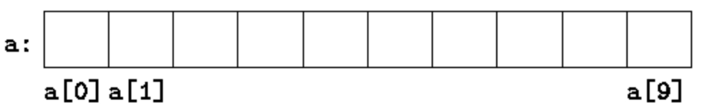

```c
int *pa;
```

```c
pa = &a[0];
```

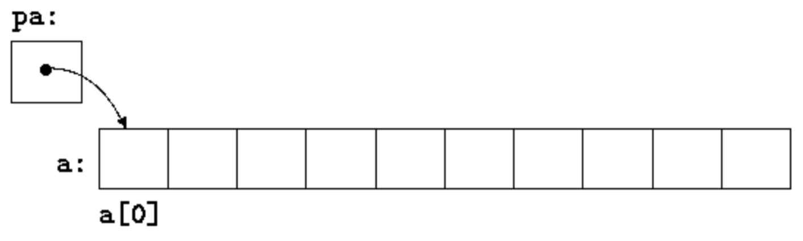

此后

```c
x = *pa;
```

把 a[0] 的内容拷贝给 x。

按定义，**pa 指向数组某元素时，pa+1 指向下一个元素**，pa+i 指向 pa 之后第 i 个元素，pa-i 指向之前第 i 个元素。于是 pa 指向 a[0] 时，`*(pa+1)` 引用 a[1] 的内容，pa+i 是 a[i] 的地址，`*(pa+i)` 是 a[i] 的内容：

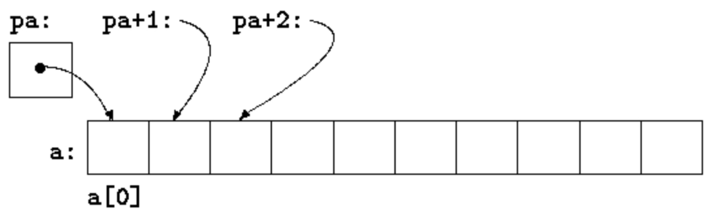

按定义，**数组类型变量或表达式的值是数组第 0 个元素的地址**。因此 `pa = &a[0];` 之后，pa 与 a 的值相同，该赋值也可写作

```c
pa = a;
```

**a[i] 同样可以写成 `*(a+i)`**：求值 a[i] 时 C 立即把它转换为 `*(a+i)`，两种形式等价。对等价两边施加 `&`：`&a[i]` 与 `a+i` 也相同。反过来，pa 是指针时也可以带下标使用——`pa[i]` 等同于 `*(pa+i)`。简言之，**数组加下标的表达式等价于指针加偏移量的写法**。

数组名与指针有一个必须记住的差别：指针是变量，`pa=a`、`pa++` 都合法；**数组名不是变量**，`a=pa`、`a++` 这类构造非法。

**数组名传给函数时，传递的是首元素的位置**。在被调函数内这个参数是局部变量，因此**数组名参数就是指针**——一个含地址的变量。据此可写指针版 strlen：

```c
/* strlen:  return length of string s */
int strlen(char *s) {
    int n;
    for (n = 0; *s != '\0'; s++)
        n++;
    return n;
}
```

参数声明

```c
char s[];
```

与

```c
char *s;
```

等价，倾向用后者——更明确地说出"这是个指针"。函数拿到数组名后，把它当数组还是当指针处理都行，两种记法混用也未尝不可。

传**子数组**也一样——传指向子数组首元素的指针即可。a 是数组时，

```c
f(&a[2])
```

与

```c
f(a+2)
```

都把 a[2] 起的子数组地址传给 f。f 内的参数声明可写

```c
 f(int arr[]) { ... }
```

或

```c
 f(int *arr) { ... }
```

对 f 而言，参数只指向更大数组的一部分这件事无关紧要。

## 5.4 地址算术运算

C 的地址算术运算一致而规整——指针、数组与地址算术的融合是这门语言的强项之一。用一个简易存储**分配器**(allocator)演示：两个例程——`alloc(n)` 返回指向 n 个连续字符位置的指针，供调用方存放字符；`afree(p)` 释放相应存储以备后用。说它"简易"，是因为对 afree 的调用必须与对 alloc 的调用**次序相反**——alloc/afree 管理的是一个**栈**（后进先出，LIFO）。标准库提供了没有这种限制的 malloc 和 free。

> malloc 全称 memory allocation，中文叫动态内存分配：申请一块连续指定大小的内存区域，以 `void*` 类型返回其地址；分配的大小就是程序要求的大小。

最简单的实现：让 alloc 从一个大字符数组 allocbuf 中切分。该数组为 alloc 与 afree 私有——由于两者用指针而非下标操作，其他例程无需知道数组名，把它声明为 `static` 即可对文件外不可见。实际实现中这个数组甚至可能没有名字——通过调用 malloc 或向操作系统要一块未命名存储的指针获得。

还需要知道 allocbuf 用掉了多少：用指针 allocp 指向下一个空闲元素。alloc 被要 n 个字符时，检查剩余空间够不够：够则返回 allocp 当前值（空闲块起始），再将其加 n 指向下一个空闲区；不够则返回 0。afree(p) 只是在 p 位于 allocbuf 内时把 allocp 置为 p。

- 调用 alloc 前：

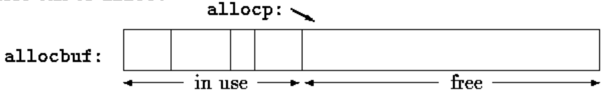

- 调用 alloc 后：

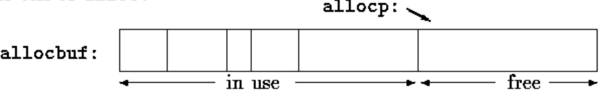

```c
#define ALLOCSIZE 10000 /* size of available space */
static char allocbuf[ALLOCSIZE]; /* storage for alloc */
static char *allocp = allocbuf;  /* next free position */
char *alloc(int n)    /* return pointer to n characters */
{
    if (allocbuf + ALLOCSIZE - allocp >= n) {  /* it fits */
        allocp += n;
        return allocp - n; /* old p */
    } else      /* not enough room */
        return 0;
}

void afree(char *p)  /* free storage pointed to by p */
{
    if (p >= allocbuf && p < allocbuf + ALLOCSIZE)
        allocp = p;
}
```

指针的初始化与其他变量一样，只是有意义的初值通常只有零、或含先前定义数据地址的表达式。声明

```c
static char *allocp = allocbuf;
```

把 allocp 定义为字符指针并初始化为指向 allocbuf 开头，也可写作

```c
  static char *allocp = &allocbuf[0];
```

因为数组名就是第 0 个元素的地址。

测试

```c
 if (allocbuf + ALLOCSIZE - allocp >= n) {  /* it fits */
```

检查**是否还够 n 个字符的请求**。够则返回块首指针（注意函数本身的声明——返回 `char *`）；不够则要返回"无空间"信号——**C 保证零永远不是有效的数据地址**，返回 0 即可。

**指针与整数不能互换**，零是唯一例外：常量 0 可以赋给指针、指针可以与常量 0 比较。常用符号常量 `NULL` 代替 0 以示这是指针的特殊值，NULL 定义在 `<stdio.h>`。

`alloc` 与 `afree` 中的测试展示了指针算术的几个要点：

一、**指针在一定条件下可以比较**。p 和 q 指向同一数组的成员时，`==、!=、<、>=` 等关系正常工作——p 指向的元素比 q 靠前时 `p<q` 为真。**任何指针与零做相等/不等比较都有意义；但指针算术或比较若涉及不指向同一数组元素的指针，行为未定义**。（唯一例外：数组末尾第一个元素的地址可用于指针算术。）

二、**指针可以加减整数**：

```c
p+n
```

是 **p 当前所指对象之后第 n 个对象的地址**——与 p 指向什么类型无关：n 按所指对象大小自动缩放，由 p 的声明决定。若 int 占 4 字节，按 4 缩放。

三、**指针相减也合法**：p、q 指向同一数组元素且 p<q，则 q-p+1 是从 p 到 q（含）的元素个数。于是又有一种 strlen：

```c
/* strlen:  return length of string s */
int strlen(char *s) {
    char *p = s;
    while (*p != '\0')
        p++;
    return p - s;
}
```

指针算术是一致的：如果处理的是占更多存储的 float，p 是指向 float 的指针，`p++` 照样前进到下一个 float。把 alloc/afree 中的 char 全部换成 float，就得到管理 float 的版本——所有指针操作自动考虑所指对象的大小。

合法的指针操作只有：同类型指针赋值、指针加减整数、指向同一数组成员的两指针相减或比较、与零赋值/比较。**其余指针算术全部非法**：两个指针相加，乘、除、移位、掩码，加 float 或 double，以及不经 cast 把一种类型的指针赋给另一种类型（`void *` 除外）。

## 5.5 字符指针与函数

```c
 "I am a string"
```

是一个字符数组。内部表示中数组以空字符 `'\0'` 结尾以便程序找到末尾，存储长度比双引号间字符数多 1。

字符串常量最常见的用途是作函数参数，如

```c
 printf("hello, world\n");
```

程序中出现这样的字符串时，对它的访问**通过字符指针进行**——printf 接到的是指向该字符数组开头的指针。即：字符串常量通过指向其首元素的指针被访问。

字符串常量不必只做函数参数。pmessage 声明为

```c
char *pmessage;
```

后，语句

```c
pmessage = "now is the time";
```

把指向字符数组的指针赋给 pmessage。**这不是字符串拷贝，只涉及指针**——C 不提供把整个字符串当作单元处理的运算符。

两个定义有重要区别：

```c
 char amessage[] = "now is the time"; /* an array */
 char *pmessage = "now is the time"; /* a pointer */
```

| 对比 | amessage：数组 | pmessage：指针 |
|--|--|--|
| 本质 | 存放字符序列和 `\0` 的数组 | 指向字符串常量的指针 |
| 内容可否修改 | 单个字符可改 | 修改所指字符串内容结果未定义 |
| 名字可否再指向别处 | 始终指同一存储 | 可改指别处 |

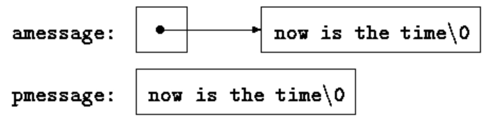

想拷贝字符串，直接 `s=t` 不行——那只是拷贝指针。strcpy 三个版本，一个比一个紧凑：

```c
/* strcpy:  copy t to s; array subscript version */
void strcpy(char *s, char *t) {
    int i;
    i = 0;
    while ((s[i] = t[i]) != '\0')
        i++;
}
```

参数按值传递，strcpy 可随意使用 s 和 t——这里是当作方便初始化了的指针，沿数组每次前进一个字符，直到 t 的结尾 `'\0'` 被拷入 s：

```c
/* strcpy:  copy t to s; pointer version */
void strcpy(char *s, char *t) {
    int i;
    i = 0;
    while ((*s = *t) != '\0') {
        s++;
        t++;
    }
}
```

```c
/* strcpy:  copy t to s; pointer version 2 */
void strcpy(char *s, char *t) {
    while ((*s++ = *t++) != '\0')
        ;
}
```

与 `'\0'` 的比较是多余的——问题只在于表达式是否为零：

```c
/* strcpy:  copy t to s; pointer version 3 */
void strcpy(char *s, char *t) {
    while (*s++ = *t++)
        ;
}
```

strcmp(s, t) 按字典序比较字符串 s 和 t，s 小于/等于/大于 t 时分别返回负值/零/正值——值取自 s 与 t 第一个不同位置处字符之差：

```c
/* strcmp:  return <0 if s<t, 0 if s==t, >0 if s>t */
int strcmp(char *s, char *t) {
    int i;
    for (i = 0; s[i] == t[i]; i++)
        if (s[i] == '\0')
            return 0;
    return s[i] - t[i];
}
```

指针版：

```c
/* strcmp:  return <0 if s<t, 0 if s==t, >0 if s>t */
int strcmp(char *s, char *t) {
    for (; *s == *t; s++, t++)
        if (*s == '\0')
            return 0;
    return *s - *t;
}
```

`++` 和 `--` 有前缀后缀之分，`*` 与它们的组合还有更少见的用法：

```c
*--p
```

先减 p 再取 p 所指的字符。事实上这一对表达式

```c
   *p++ = val;  /* push val onto stack */
   val = *--p;  /* pop top of stack into val */
```

正是压栈/弹栈的标准惯用法。

头文件 `<string.h>` 含本节函数的声明及标准库中其他字符串处理函数。

## 5.6 指针数组以及指向指针的指针

指针本身是变量，自然也可以像其他变量一样存进数组——**指针数组**(array of pointers)。以"把文本行按字母序排序"为例（UNIX 程序 sort 的精简版）。

第 3 章的希尔排序、第 4 章的快速排序算法照用，但现在处理的是长短不一的文本行——不能像整数那样一次比较或一次搬移。需要高效方便处理变长文本行的数据表示：**指针数组**登场。待排序的行首尾相接存进一个长字符数组，每行由指向其首字符的指针访问；指针们再存进一个数组。比较两行时把指针传给 strcmp；交换两个失序的行时，**交换的是指针数组里的指针，而不是文本行本身**。

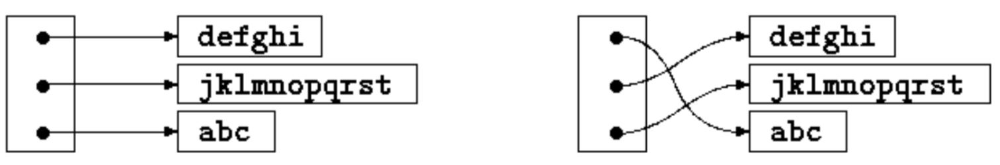

排序过程分三步：

```c
read all the lines of input
sort them
print them in order
```

按这个自然划分把程序分解成函数，main 控制其余函数。暂缓排序，先看数据结构与输入输出：输入例程收集保存每行字符并构造指针数组、统计行数（排序和打印都需要），输入太多时返回 -1 之类的非法计数；输出例程按指针数组顺序打印各行。

```c
#include <stdio.h>
#include <string.h>

#define MAXLINES 5000     /* max #lines to be sorted */
char *lineptr[MAXLINES];  /* pointers to text lines */
int readlines(char *lineptr[], int nlines);

void writelines(char *lineptr[], int nlines);

void qsort(char *lineptr[], int left, int right);

/* sort input lines */
main() {
    int nlines;     /* number of input lines read */
    if ((nlines = readlines(lineptr, MAXLINES)) >= 0) {
        qsort(lineptr, 0, nlines - 1);
        writelines(lineptr, nlines);
        return 0;
    } else {
        printf("error: input too big to sort\n");
        return 1;
    }
}

#define MAXLEN 1000  /* max length of any input line */

int getline(char *, int);

char *alloc(int);

/* readlines:  read input lines */
int readlines(char *lineptr[], int maxlines) {
    int len, nlines;
    char *p, line[MAXLEN];
    nlines = 0;
    while ((len = getline(line, MAXLEN)) > 0)
        if (nlines >= maxlines || (p = alloc(len)) == NULL)
            return -1;
        else {
            line[len - 1] = '\0';  /* delete newline */
            strcpy(p, line);
            lineptr[nlines++] = p;
        }
    return nlines;
}

/* writelines:  write output lines */
void writelines(char *lineptr[], int nlines) {
    int i;
    for (i = 0; i < nlines; i++)
        printf("%s\n", lineptr[i]);
}
```

新的东西是 lineptr 的声明：

```c
char *lineptr[MAXLINES]
```

说明 lineptr 是有 MAXLINES 个元素的数组，**每个元素都是指向 char 的指针**：lineptr[i] 是字符指针，`*lineptr[i]` 是它所指的字符——第 i 个已存文本行的首字符。

lineptr 本身是数组名，因此可像前述例子一样当指针用，writelines 可改写为：

```c
/* writelines:  write output lines */
void writelines(char *lineptr[], int nlines) {
    while (nlines-- > 0)
        printf("%s\n", *lineptr++);
}
```

`*lineptr` 初始指向第一行，每次前进到下一行指针，同时 nlines 递减计数。

输入输出就绪，开始排序。第 4 章的快速排序只需小改：声明要改，比较操作改为调用 strcmp——算法不变，这让我们对它仍能正常工作有了信心：

```c
/* qsort:  sort v[left]...v[right] into increasing order */
void qsort(char *v[], int left, int right) {
    int i, last;
    void swap(char *v[], int i, int j);
    if (left >= right)  /* do nothing if array contains */
        return;         /* fewer than two elements */
    swap(v, left, (left + right) / 2);
    last = left;
    for (i = left + 1; i <= right; i++)
        if (strcmp(v[i], v[left]) < 0)
            swap(v, ++last, i);
    swap(v, left, last);
    qsort(v, left, last - 1);
    qsort(v, last + 1, right);
}
```

swap 也只需小改——v（即 lineptr）的单个元素是字符指针，temp 也必须是指针，才能相互拷贝：

```c
/* swap:  interchange v[i] and v[j] */
void swap(char *v[], int i, int j) {
    char *temp;
    temp = v[i];
    v[i] = v[j];
    v[j] = temp;
}
```

## 5.7 多维数组

日期转换问题：月日 ↔ 年中第几天。如 3 月 1 日在平年是第 60 天、闰年是第 61 天。定义两个函数：`day_of_year` 把月日转为年中天数；`month_day` 反向转换。后者算出两个值，月和日参数用指针：

```c
month_day(1988, 60, &m, &d)
```

把 m 置 2、d 置 29（2 月 29 日）。

```c
static char daytab[2][13] = {
        {0, 31, 28, 31, 30, 31, 30, 31, 31, 30, 31, 30, 31},
        {0, 31, 29, 31, 30, 31, 30, 31, 31, 30, 31, 30, 31}
};

/* day_of_year:  set day of year from month & day */
int day_of_year(int year, int month, int day) {
    int i, leap;
    leap = year % 4 == 0 && year % 100 != 0 || year % 400 == 0;
    for (i = 1; i < month; i++)
        day += daytab[leap][i];
    return day;
}

/* month_day:  set month, day from day of year */
void month_day(int year, int yearday, int *pmonth, int *pday) {
    int i, leap;
    leap = year % 4 == 0 && year % 100 != 0 || year % 400 == 0;
    for (i = 1; yearday > daytab[leap][i]; i++)
        yearday -= daytab[leap][i];
    *pmonth = i;
    *pday = yearday;
}
```

回忆：逻辑表达式（如 leap）的算术值是 0（假）或 1（真），可直接用作 daytab 的下标。

C 的**二维数组实际上是一维数组——它的每个元素又是一个数组**。因此下标写作

```c
 daytab[i][j]    /* [行][列] */
```

除此之外，二维数组的使用与其他语言基本相同。元素按行存储，最右的下标（列）在按存储顺序访问时变化最快。

二维数组的初始化用花括号列表，每行对应一个子列表。daytab 第 0 列填了 0，让月份数从自然的 1～12 而不是 0～11——这里不缺空间，这比调整下标更清晰。

**二维数组传给函数时，参数声明必须包含列数；行数无关紧要**——传的依然是指针，指向"每行 13 个 int 的数组"的首个。daytab 传给函数 f 时，f 可声明为

```c
 f(int daytab[2][13]) { ... }
```

也可

```c
 f(int daytab[][13]) { ... }
```

（行数无关），或

```c
 f(int (*daytab)[13]) { ... }
```

——参数是指向"13 个 int 的数组"的指针。**括号必不可少**，因为 `[]` 的优先级高于 `*`。没有括号时

```c
int *daytab[13]
```

是 13 个"指向 int 的指针"组成的数组。一般规则：数组只有第一维可以不指定，其余各维都必须给出。

## 5.8 指针数组的初始化

写一个 `month_name(n)`：返回指向第 n 个月名字符串的指针。这是**内部 static 数组**的理想用武之地——month_name 拥有一个私有的字符串数组，调用时返回恰当的指针：

```c
/* month_name:  return name of n-th month */
char *month_name(int n) {
    static char *name[] = {
            "Illegal month",
            "January", "February", "March",
            "April", "May", "June",
            "July", "August", "September",
            "October", "November", "December"
    };
    return (n < 1 || n > 12) ? name[0] : name[n];
}
```

name 的声明（字符指针数组）与排序例程中的 lineptr 相同。初始化列表是一组字符串，每个赋给数组对应位置——第 i 个字符串的字符放在某处，指向它们的指针存入 name[i]。数组大小未指定时，编译器统计初始化项数并填入正确数目。

## 5.9 指针与多维数组

初学者常混淆二维数组与指针数组。设有定义

```c
   int a[10][20];
   int *b[10];
```

`a[3][4]` 与 `b[3][4]` 在语法上都是对一个 int 的合法引用，但两者完全不同：

| 对比 | int a[10][20] 二维数组 | int *b[10] 指针数组 |
|--|--|--|
| 分配 | 一次分配 200 个 int 的连续空间 | 只分配 10 个指针，须显式初始化 |
| 定位 | 按矩形公式 `20*row+col` 计算 | 先取 b[row] 指针，再在其上取 [col] |
| 各行长度 | 必须相同（都是 20） | **可以不同**——有的行 2 个元素，有的 50 个，有的为空 |

指针数组的重要优势就是**各行长度可以不同**。虽然以上用整数举例，指针数组最常用的场合还是存放长短不一的字符串（如 month_name）。对比指针数组的声明与图示：

```c
  char *name[] = { "Illegal month", "Jan", "Feb", "Mar" };
```

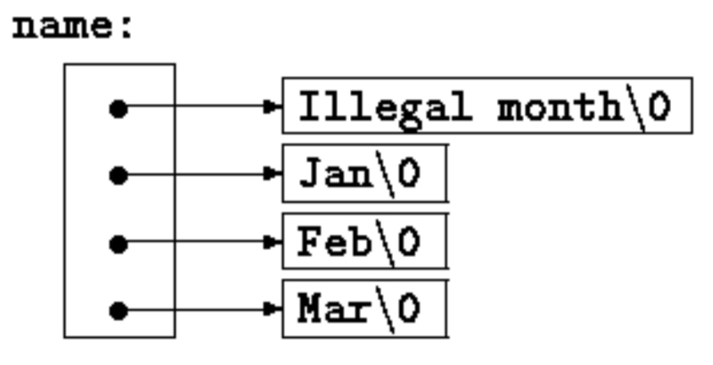

与二维数组的声明与图示：

```c
char aname[][15] = { "Illegal month", "Jan", "Feb", "Mar" };
```

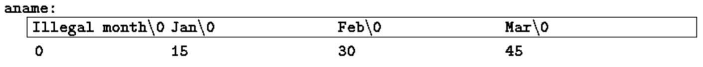

前者每项只占实际字符串所需的空间加一个指针；后者每行固定 15 字节，短的字符串浪费空间。

## 5.10 命令行参数

支持 C 的环境中，程序开始执行时可以把**命令行参数**传给它。调用 main 时给它两个参数：

- 第一个（惯例叫 **argc**，argument count）：调用程序时的命令行参数个数
- 第二个（**argv**，argument vector）：指向字符指针数组的指针，每个参数一个字符串

通常用多层指针操作这些字符串。

最简单的例子是 echo：把命令行参数回显在一行、以空格分隔。命令

```c
 echo hello, world
```

输出

```c
hello, world
```

按惯例，`argv[0]` 是程序被调用时的名字，所以 **argc 至少为 1**；argc 为 1 说明程序名后没有参数。上例中 argc 是 3，argv[0]、argv[1]、argv[2] 分别是 "echo"、"hello,"、"world"。第一个可选参数是 argv[1]，最后一个是 argv[argc-1]；标准还要求 `argv[argc]` 是空指针。

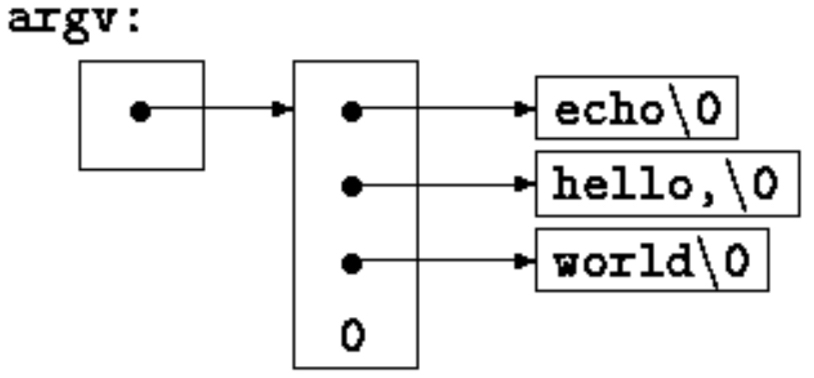

echo 第一个版本把 argv 当字符指针数组：

```c
#include <stdio.h>

/* echo command-line arguments; 1st version */
main(int argc, char *argv[]) {
    int i;
    for (i = 1; i < argc; i++)
        printf("%s%s", argv[i], (i < argc - 1) ? " " : "");
    printf("\n");
    return 0;
}
```

argv 是指向指针数组的指针，可以推进指针而不按下标。第二版基于递增 argv（它是指向 char 的指针的指针），同时递减 argc：

```c
#include <stdio.h>

/* echo command-line arguments; 2nd version */
main(int argc, char *argv[]) {
    while (--argc > 0)
        printf("%s%s", *++argv, (argc > 1) ? " " : "");
    printf("\n");
    return 0;
}
```

argv 指向参数字符串数组的开头，`++argv` 使它指向原来的 argv[1] 而非 argv[0]，之后每次前移指向下一个参数，`*argv` 就是指向该参数的指针；同时 argc 递减，减到 0 就没有参数可打了。printf 语句还可写成

```c
printf((argc > 1) ? "%s " : "%s", *++argv);
```

——printf 的格式参数同样可以是表达式。

第二个例子增强 4.1 节的模式查找程序：模式写死在程序里显然不能令人满意，仿照 UNIX 程序 grep，把模式改为由命令行第一个参数指定：

```c
#include <stdio.h>
#include <string.h>

#define MAXLINE 1000

int getline(char *line, int max);

/* find:  print lines that match pattern from 1st arg */
main(int argc, char *argv[]) {
    char line[MAXLINE];
    int found = 0;
    if (argc != 2)
        printf("Usage: find pattern\n");
    else
        while (getline(line, MAXLINE) > 0)
            if (strstr(line, argv[1]) != NULL) {
                printf("%s", line);
                found++;
            }
    return found;
}
```

标准库函数 `strstr(s, t)` 返回 t 在 s 中第一次出现位置的指针，不出现则返回 NULL，声明在 `<string.h>`。

再进一步：允许两个可选参数——一个表示"打印**不**匹配的所有行"，一个表示"每个打印行前冠以行号"。UNIX C 程序的惯例是**以减号开头的参数是可选标志**：`-x`（except）表示反选，`-n`（number）要求行号，则命令

```c
find -x -npattern
```

打印每个不匹配的行并冠以行号。可选参数应允许任意顺序，程序其余部分应与参数个数无关，且允许选项合并（如 `-nx pattern`）：

```c
#include <stdio.h>
#include <string.h>

#define MAXLINE 1000

int getline(char *line, int max);

/* find: print lines that match pattern from 1st arg */
main(int argc, char *argv[]) {
    char line[MAXLINE];
    long lineno = 0;
    int c, except = 0, number = 0, found = 0;
    while (--argc > 0 && (*++argv)[0] == '-')
        while (c = *++argv[0])
            switch (c) {
                case 'x':
                    except = 1;
                    break;
                case 'n':
                    number = 1;
                    break;
                default:
                    printf("find: illegal option %c\n", c);
                    argc = 0;
                    found = -1;
                    break;
            }
    if (argc != 1)
        printf("Usage: find -x -n pattern\n");
    else
        while (getline(line, MAXLINE) > 0) {
            lineno++;
            if ((strstr(line, *argv) != NULL) != except) {
                if (number)
                    printf("%ld:", lineno);
                printf("%s", line);
                found++;
            }
        }
    return found;
}
```

每处理一个可选参数，argc 减 1、argv 加 1。循环无错结束时，argc 是剩余未处理参数的个数、argv 指向其中第一个——因此 argc 应为 1、`*argv` 指向模式。注意 `*++argv` 是指向参数字符串的指针，`(*++argv)[0]` 是它的第一个字符（等价形式 `**++argv`）。因为 `[]` 比 `*` 和 `++` 结合更紧，这层括号必不可少，否则变成 `*++(argv[0])`。而内层循环里恰恰用的就是后一种——任务是沿着一个具体参数字符串走，表达式 `*++argv[0]` 递增的是指针 argv[0]。

实际中很少用比这更复杂的指针表达式；真遇到，拆成两三步写会更好懂。

## 5.11 指向函数的指针

C 中**函数本身不是变量**，但可以定义**指向函数的指针**——可以赋值、放进数组、传给函数、被函数返回。改造本章开头的排序程序：给出可选参数 -n 时按数值而非字典序排序。

排序由三部分组成——**比较**（决定任两个对象的次序）、**交换**（颠倒次序）、**排序算法**（反复比较交换直到有序）。排序算法独立于比较与交换操作，**向它传递不同的比较函数，就能按不同准则排序**。

字典序比较仍用 strcmp；另写一个 numcmp 按数值比较两行、返回与 strcmp 同类的结果。两者在 main 前声明，把恰当的那个的指针传给 qsort：

```c
#include <stdio.h>
#include <string.h>

#define MAXLINES 5000     /* max #lines to be sorted */
char *lineptr[MAXLINES];  /* pointers to text lines */
int readlines(char *lineptr[], int nlines);

void writelines(char *lineptr[], int nlines);

void qsort(void *lineptr[], int left, int right,
           int (*comp)(void *, void *));

int numcmp(char *, char *);

/* sort input lines */
main(int argc, char *argv[]) {
    int nlines;        /* number of input lines read */
    int numeric = 0;   /* 1 if numeric sort */
    if (argc > 1 && strcmp(argv[1], "-n") == 0)
        numeric = 1;
    if ((nlines = readlines(lineptr, MAXLINES)) >= 0) {
        qsort((void **) lineptr, 0, nlines - 1,
              (int (*)(void *, void *)) (numeric ? numcmp : strcmp));
        writelines(lineptr, nlines);

        return 0;
    } else {
        printf("input too big to sort\n");
        return 1;
    }
}
```

qsort 调用中的 strcmp 和 numcmp 是**函数的地址**。既然已知是函数，& 可写可不写——与数组名前不需要 & 同理。

qsort 写成能处理任何数据类型：按原型，它要一个指针数组、两个整数、一个"接收两个指针参数的函数"。指针参数用通用指针类型 `void *`——任何指针都能无损地转换为 `void *` 再转回来，因此调用时把参数 cast 成 `void *`。对比较函数参数的复杂 cast 不改变实际表示，只为让编译器放心：

```c
/* qsort:  sort v[left]...v[right] into increasing order */
void qsort(void *v[], int left, int right,int (*comp)(void *, void *)) {
    int i, last;
    void swap(void *v[], int, int);
    if (left >= right)    /* do  nothing if array contains */
        return;           /* fewer than two elements */
    swap(v, left, (left + right) / 2);
    last = left;
    for (i = left + 1; i <= right; i++)
        if ((*comp)(v[i], v[left]) < 0)
            swap(v, ++last, i);
    swap(v, left, last);
    qsort(v, left, last - 1, comp);
    qsort(v, last + 1, right, comp);
}
```

```c
int (*comp)(void *, void *)
```

说明 **comp 是指向函数的指针**——该函数接收两个 void * 参数、返回 int。

`(*comp)(v[i], v[left])` 的用法与声明一致：comp 是函数指针，`*comp` 是函数，`(*comp)(...)` 是对它的调用。**括号必不可少**，否则

```c
int *comp(void *, void *) /* WRONG */
```

说明 comp 是"返回指向 int 的指针的函数"——完全不同的东西。

```c
#include <stdlib.h>

/* numcmp:  compare s1 and s2 numerically */
int numcmp(char *s1, char *s2) {
    double v1, v2;
    v1 = atof(s1);
    v2 = atof(s2);
    if (v1 < v2)
        return -1;
    else if (v1 > v2)
        return 1;
    else
        return 0;
}
```

交换两个指针的 swap 与本章前面的版本相同，只是声明改为 void *：

```c
void swap(void *v[], int i, int j) {
    void *temp;
    temp = v[i];
    v[i] = v[j];
    v[j] = temp;
}
```

## 5.12 复杂声明

C 的声明语法时常挨批，尤其是涉及函数指针时。语法本意是让**声明与使用一致**：简单场合没问题，复杂场合就乱——声明不能从左往右读，括号用得太多。对比

```c
   int *f();       /* f: function returning pointer to int */
```

与

```c
int (*pf)(); /* pf: pointer to function returning int */
```

可见问题所在：`*` 是前缀运算符且优先级低于 `()`，必须用括号强制正确的结合。

真正复杂的声明实践中少见，但读懂（必要时造出）它们很重要。一种构造办法是 6.7 节的 typedef 分小步合成；本节则给出一对互逆程序：合法 C 声明 ↔ 文字描述。描述从左往右读。

第一个程序 `dcl` 更复杂，把 C 声明转换为文字描述：

```c
char **argv
    argv:  pointer to char

int (*daytab)[13]
    daytab:  pointer to array[13] of int

int *daytab[13]
    daytab:  array[13] of pointer to int

void *comp()
    comp: function returning pointer to void

void (*comp)()
    comp: pointer to function returning void

char (*(*x())[])()
    x: function returning pointer to array[] of
    pointer to function returning char

char (*(*x[3])())[5]
    x: array[3] of pointer to function returning
    pointer to array[5] of char
```

dcl 基于说明声明符的文法（附录 A.8.5 的简化形式）：

```c
dcl:       optional *'s direct-dcl
direct-dcl   name
             (dcl)
             direct-dcl()
             direct-dcl[optional size]
```

文字地说：`dcl` 是一个 direct-dcl，前面可能带若干 `*`；`direct-dcl` 是一个名字、或加括号的 dcl、或后跟一对圆括号的 direct-dcl、或后跟带可选大小方括号的 direct-dcl。

该文法可用于解析。以声明符

```c
(*pfa[])()
```

为例：pfa 被识别为名字从而是 direct-dcl；`pfa[]` 也是 direct-dcl；`*pfa[]` 是 dcl，于是 `(*pfa[])` 是 direct-dcl；最后 `(*pfa[])()` 是 direct-dcl 从而是 dcl。解析树（direct-dcl 缩写为 dir-dcl）：

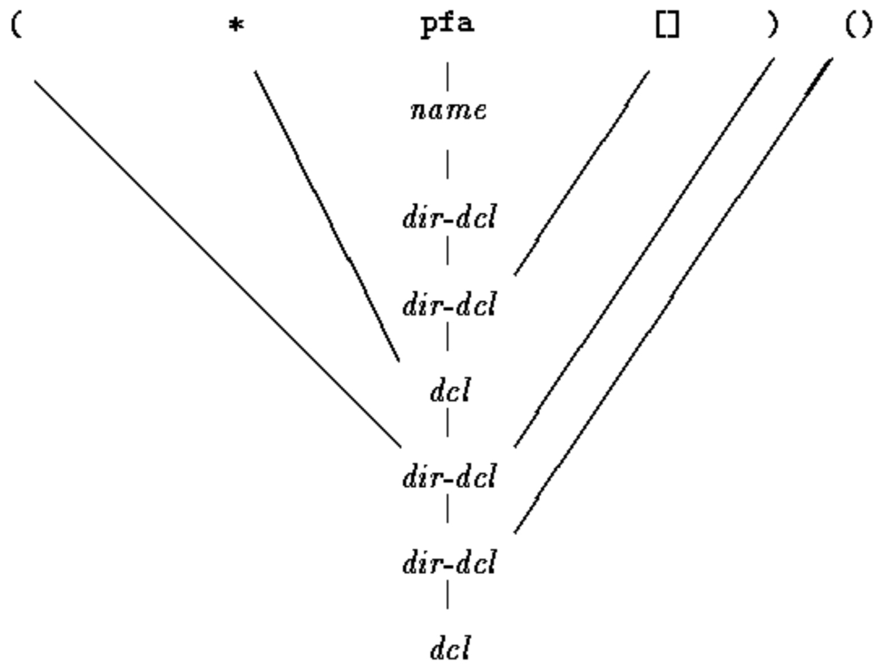

dcl 程序的核心是一对函数 `dcl` 与 `dirdcl`，按文法递归解析声明——文法递归定义，函数随之相互递归调用，这种程序称为**递归下降解析器**(recursive-descent parser)：

```c
/* dcl:  parse a declarator */
void dcl(void) {
    int ns;
    for (ns = 0; gettoken() == '*';) /* count *'s */
        ns++;
    dirdcl();
    while (ns-- > 0)
        strcat(out," pointer to");
}

/* dirdcl:  parse a direct declarator */
void dirdcl(void) {
    int type;
    if (tokentype == '(') {     /* ( dcl ) */
        dcl();
        if (tokentype != ')')
            printf("error: missing )\n");
    } else if (tokentype == NAME)  /* variable name */
        strcpy(name, token);
    else
    printf("error: expected name or (dcl)\n");
    while ((type = gettoken()) == PARENS || type == BRACKETS)
        if (type == PARENS)
            strcat(out, " function returning");
        else {
            strcat(out, " array");
            strcat(out, token);
            strcat(out, " of");
        }
}
```

程序意在演示而非完备，dcl 限制不少：只认 char、int 这类简单类型；不处理函数参数类型和 const 等限定词；杂散空格会把它弄糊涂；错误恢复很弱，非法声明也会让它混乱。改进留作练习。

全局变量与 main：

```c
#include <stdio.h>
#include <string.h>
#include <ctype.h>

#define MAXTOKEN  100
enum {
    NAME, PARENS, BRACKETS
};

void dcl(void);

void dirdcl(void);

int gettoken(void);

int tokentype;
char token[MAXTOKEN];
char name[MAXTOKEN];
char datatype[MAXTOKEN]; /* data type = char, int, etc. */
char out[1000];

main()  /* convert declaration to words */
{
    while (gettoken() != EOF) {   /* 1st token on line */
        strcpy(datatype, token);  /* is the datatype */
        out[0] = '\0';
        dcl();       /* parse rest of line */
        if (tokentype != '\n')
            printf("syntax error\n");
        printf("%s: %s %s\n", name, out, datatype);
    }
    return 0;
}
```

`gettoken` 跳过空格制表符后取下一个 token——token 是名字、一对圆括号、可能带数字的一对方括号、或任何其他单字符：

```c
int gettoken(void)  /* return next token */
{
    int c, getch(void);
    void ungetch(int);
    char *p = token;
    while ((c = getch()) == ' ' || c == '\t')
        ;

    if (c == '(') {
        if ((c = getch()) == ')') {
            strcpy(token, "()");
            return tokentype = PARENS;
        } else {
            ungetch(c);
            return tokentype = '(';
        }
    } else if (c == '[') {
        for (*p++ = c; (*p++ = getch()) != ']';)
            ;
        *p = '\0';
        return tokentype = BRACKETS;
    } else if (isalpha(c)) {
        for (*p++ = c; isalnum(c = getch());)
            *p++ = c;
        *p = '\0';
        ungetch(c);
        return tokentype = NAME;
    } else
        return tokentype = c;
}
```

反方向更容易，尤其不必顾虑生成多余括号。程序 `undcl` 把"x is a function returning a pointer to an array of pointers to functions returning char"这类描述（缩写表达为）

```c
 x () * [] * () char
```

转换为

```c
char (*(*x())[])()
```

缩写语法让我们能复用 gettoken，undcl 也沿用 dcl 的外部变量：

```c
/* undcl:  convert word descriptions to declarations */
main() {
    int type;
    char temp[MAXTOKEN];
    while (gettoken() != EOF) {
        strcpy(out, token);
        while ((type = gettoken()) != '\n')
            if (type == PARENS || type == BRACKETS)
                strcat(out, token);
            else if (type == '*') {
                sprintf(temp, "(*%s)", out);
                strcpy(out, temp);
            } else if (type == NAME) {
                sprintf(temp, "%s %s", token, out);
                strcpy(out, temp);
            } else
                printf("invalid input at %s\n", token);
        printf("%s\n", out);
    }
    return 0;
}
```
