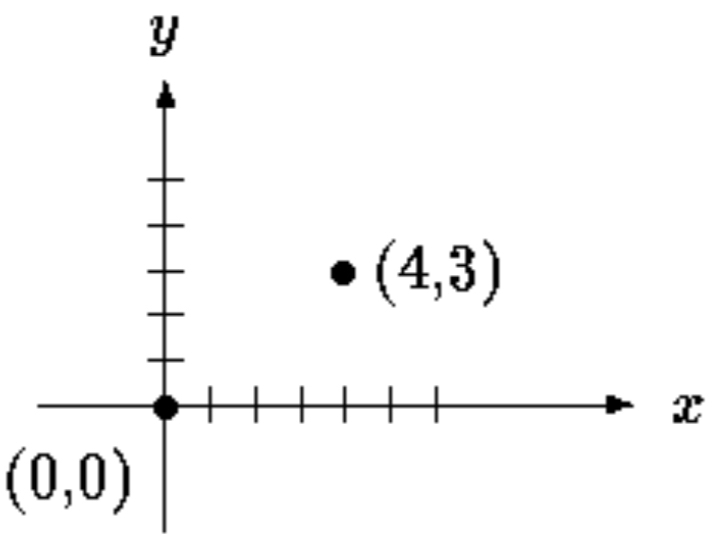
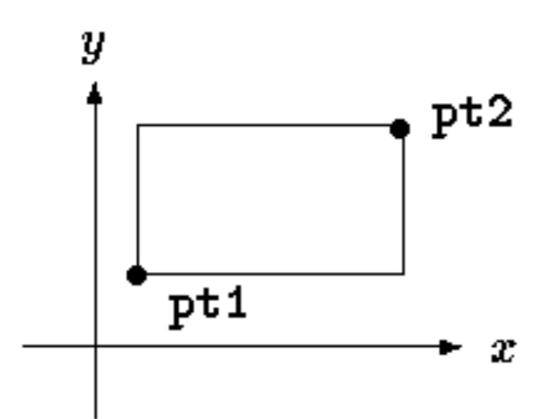
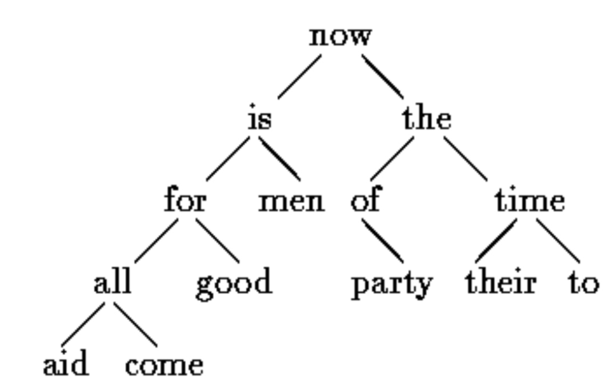
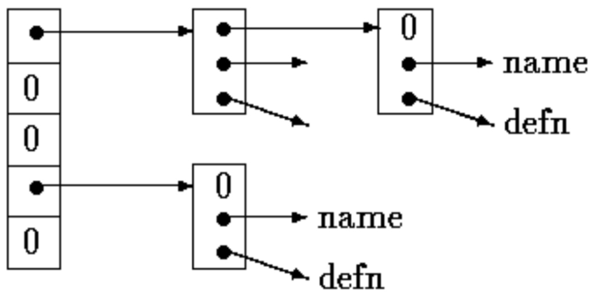

**结构**(structure)是一个或多个变量的集合——变量类型可以不同——为了方便处理而组织在一个名字之下（有些语言称其为"记录"，如 Pascal）。结构有助于组织复杂数据，特别是大型程序中：它让一组相关变量可以作为一个单元而非各自独立的实体来处理。

结构的经典例子是工资记录：雇员由姓名、地址、社保号、工资等属性描述，其中某些属性本身又可以是结构——姓名有若干分量，地址、工资亦然。另一个更 C 风格的例子来自图形学：点是坐标对，矩形是点对，以此类推。

ANSI 标准的主要变化是定义了**结构赋值**——结构可以拷贝和赋值、传给函数、被函数返回（多数编译器支持多年，现在性质被精确定义）。自动结构与数组现在也可以初始化。

## 6.1 结构的基本知识

创建几个适合图形学的结构。基本对象是点，假设它有 x、y 两个整型坐标：



两个分量放进这样声明的结构中：

```c
   struct point {
       int x;
       int y;
   };
```

关键字 struct 引入**结构声明**——花括号括起的声明列表。struct 后可跟一个可选的名字，称**结构标记**(structure tag)（如这里的 point）。标记为这种结构命名，之后可用作花括号部分声明的简写。

结构中命名的变量叫**成员**(members)。结构成员或标记与普通（非成员）变量可以同名不冲突——总能靠上下文区分。不同结构中也可以出现相同的成员名，不过按风格惯例，只有密切相关的对象才复用相同名字。

`struct` 声明定义的是一个**类型**。成员列表的右花括号后可跟变量列表，与基本类型一样：

```c
   struct { ... } x, y, z;
```

在语法上类似于

```c
int x, y, z;
```

两条语句都把 x、y、z 声明为指定类型的变量并分配空间。

**不带变量列表的结构声明不分配存储**，只描述结构的模板或形状。带标记的声明，之后可用标记定义实例：

```c
struct point pt;
```

定义 struct point 类型的结构变量 pt。结构定义后可跟成员初始化列表（每项为常量表达式）来初始化：

```c
   struct point maxpt = { 320, 200 };
```

自动结构还可以用赋值或调用返回同类型结构的函数来初始化。

表达式中用如下构造引用特定结构的成员：

```c
结构名.成员
```

结构成员运算符 `.` **把结构名和成员名连接起来**。打印点 pt 的坐标：

```c
printf("%d,%d", pt.x, pt.y);
```

计算原点 (0,0) 到 pt 的距离：

```c
  double dist, sqrt(double);
  dist = sqrt((double)pt.x * pt.x + (double)pt.y * pt.y);
```

结构可以**嵌套**。矩形的一种表示是对角线两端的两个点：



```c
 struct rect {
       struct point pt1;
       struct point pt2;
   };
```

rect 结构含两个 point 结构。声明

```c
struct rect screen;
```

后，

```c
screen.pt1.x
```

指 screen 的成员 pt1 的 x 坐标。

## 6.2 结构与函数

**结构上合法的操作只有：作为单元拷贝或赋值、用 & 取地址、访问其成员**。拷贝与赋值包括向函数传参和从函数返回值。结构不能比较。结构可用常量成员值列表初始化；自动结构还可用赋值初始化。

写几个操作点和矩形的函数来研究结构。至少有三种途径：分别传递各分量、传递整个结构、传递指向它的指针——各有优劣。

第一个函数 `makepoint` 接收两个整数、返回 point 结构：

```c
/* makepoint:  make a point from x and y components */
struct point makepoint(int x, int y) {
    struct point temp;
    temp.x = x;
    temp.y = y;
    return temp;
}
```

形参名与同名成员不冲突——复用名字反而强调了它们的关系。

makepoint 可用于动态初始化任何结构，或为函数提供结构参数：

```c
struct rect screen;
struct point middle;
struct point makepoint(int, int);

screen.pt1 = makepoint(0,0);
screen.pt2 = makepoint(XMAX, YMAX);
middle = makepoint((screen.pt1.x + screen.pt2.x)/2,
                   (screen.pt1.y + screen.pt2.y)/2);
```

接下来是做点运算的一组函数：

```c
/* addpoints:  add two points */
struct point addpoint(struct point p1, struct point p2){
    p1.x += p2.x;
    p1.y += p2.y;
    return p1;
}
```

参数和返回值都是结构。这里直接在 p1 上累加而不引入显式临时变量，是为了强调**结构参数与其他参数一样按值传递**。

再看 `ptinrect`：测试点是否在矩形内。约定矩形包含左边和底边、不包含顶边和右边：

```c
/* ptinrect:  return 1 if p in r, 0 if not */
int ptinrect(struct point p, struct rect r)
{
    return p.x >= r.pt1.x && p.x < r.pt2.x
           && p.y >= r.pt1.y && p.y < r.pt2.y;
}
```

它假设矩形呈标准形式（pt1 坐标小于 pt2）。下面的函数返回保证为规范形式的矩形：

```c
#define min(a, b) ((a) < (b) ? (a) : (b))
#define max(a, b) ((a) > (b) ? (a) : (b))

/* canonrect: canonicalize coordinates of rectangle */
struct rect canonrect(struct rect r) {
    struct rect temp;
    temp.pt1.x = min(r.pt1.x, r.pt2.x);
    temp.pt1.y = min(r.pt1.y, r.pt2.y);
    temp.pt2.x = max(r.pt1.x, r.pt2.x);
    temp.pt2.y = max(r.pt1.y, r.pt2.y);
    return temp;
}
```

大结构传给函数时，**传指针一般比拷贝整个结构更高效**。结构指针与普通变量指针无异。声明

```c
struct point *pp;
```

说明 pp 是指向 struct point 结构的指针。pp 指向 point 结构时，`*pp` 就是该结构，`(*pp).x`、`(*pp).y` 是其成员：

```c
struct point origin, *pp;

pp = &origin;
printf("origin is (%d,%d)\n", (*pp).x, (*pp).y);
```

`(*pp).x` 的括号必不可少：成员运算符 `.` 的优先级**高于** `*`，`*pp.x` 意为 `*(pp.x)`——这里 x 不是指针，非法。

结构指针用得太频繁，于是有了简写记法。**p 是指向结构的指针**时，

```c
p->member
```

引用结构的特定成员。上例可改写为

```c
printf("origin is (%d,%d)\n", pp->x, pp->y);
```

`.` 与 `->` 都从左向右结合。设有

```c
 struct rect r,
 *rp = &r;
```

则四个表达式等价：

```c
   r.pt1.x
   rp->pt1.x
   (r.pt1).x
   (rp->pt1).x
```

结构运算符 `.` 与 `->` 连同函数调用的 `()`、下标的 `[]` 位于优先级**顶层**，结合得非常紧。设声明

```c
   struct {
       int len;
       char *str;
   } *p;
```

则 `++p->len` 递增的是 len 而不是 p——隐含括号化是 `++(p->len)`。括号可改变结合：`(++p)->len` 先递增 p 再访问 len；`(p++)->len` 先访问 len 后递增 p（这层括号可省）。

同理：`*p->str` 取 str 所指的内容；`*p->str++` 访问后递增 str（类似 `*s++`）；`(*p->str)++` 递增 str 所指的内容；`*p++->str` 访问 str 所指内容后递增 p。

## 6.3 结构数组

写一个统计 C 关键字出现次数的程序：需要一个字符串数组存名字、一个 int 数组存计数。可以用两个平行数组：

```c
   char *keyword[NKEYS];
   int keycount[NKEYS];
```

但"平行"这个事实本身提示了更好的组织——**结构数组**。每个关键字是一对：

```c
   char *word;
   int count;
```

结构声明

```c
struct key {
       char *word;
       int count;
   } keytab[NKEYS];
```

声明结构类型 key、定义该类型的结构数组 keytab 并分配存储，每个元素是一个结构。也可写作

```c
   struct key {
       char *word;
       int count;
    };

   struct key keytab[NKEYS];
```

keytab 中的名字集合是常量，做成外部变量并在定义时一次性初始化最简单。初始化与前面类似——定义后跟花括号初始化列表：

```c
struct key {
    char *word;
    int count;
} keytab[] = {
        "auto", 0,
        "break", 0,
        "case", 0,
        "char", 0,
        "const", 0,
        "continue", 0,
        "default", 0,
        /* ... */
        "unsigned", 0,
        "void", 0,
        "volatile", 0,
        "while", 0
};
```

初始化项按结构成员成对列出。更精确的写法是把每个"行"（结构）的初始化项也用花括号括起：

```c
   { "auto", 0 },
   { "break", 0 },
   { "case", 0 },
   ...
```

但当初始化项是简单变量或字符串且全部给出时，内层花括号可省。照例，初始化项齐全且 `[]` 留空时，数组项数由编译器计算。

关键字计数程序从 keytab 的定义开始。main 反复调用 `getword` 每次取一个词，用第 3 章的二分查找在 keytab 中查找。关键字表必须按递增序排列：

```c
#include <stdio.h>
#include <ctype.h>
#include <string.h>

#define MAXWORD 100

int getword(char *, int);

int binsearch(char *, struct key *, int);

/* count C keywords */
main() {
    int n;
    char word[MAXWORD];
    while (getword(word, MAXWORD) != EOF)
        if (isalpha(word[0]))
            if ((n = binsearch(word, keytab, NKEYS)) >= 0)
                keytab[n].count++;
    for (n = 0; n < NKEYS; n++)
        if (keytab[n].count > 0)
            printf("%4d %s\n",
                   keytab[n].count, keytab[n].word);
    return 0;
}

/* binsearch:  find word in tab[0]...tab[n-1] */
int binsearch(char *word, struct key tab[], int n) {
    int cond;
    int low, high, mid;
    low = 0;
    high = n - 1;
    while (low <= high) {
        mid = (low + high) / 2;
        if ((cond = strcmp(word, tab[mid].word)) < 0)
            high = mid - 1;
        else if (cond > 0)
            low = mid + 1;
        else
            return mid;
    }
    return -1;
}
```

getword 稍后展示；目前只需知道每次调用取一个词并拷入第一个参数命名的数组。

`NKEYS` 是 keytab 中关键字的个数。手工数当然可以，但交给机器数更容易更安全——尤其列表可能变动。

数组的规模在编译时完全确定：数组大小 = 单项大小 × 项数，因此项数就是

```c
size of keytab / size of struct key
```

C 提供编译期一元运算符 `sizeof` 计算任何对象的大小：

```c
sizeof object
```

与

```c
sizeof (type name)
```

产生等于指定对象或类型大小（字节）的整数（严格说，sizeof 产生 unsigned 整数值，其类型 size_t 定义在 `<stddef.h>`）。对象可以是变量、数组或结构；类型名可以是基本类型，也可以是结构、指针等派生类型。

关键字的个数就是数组大小除以一个元素的大小，在 `#define` 中设定 NKEYS：

```c
 #define NKEYS (sizeof keytab / sizeof(struct key))
```

也可以除以某个具体元素的大小：

```c
  #define NKEYS (sizeof keytab / sizeof(keytab[0]))
```

好处是类型改变时无需改动。`sizeof` 不能用于 `#if` 行——预处理器不解析类型名；但 `#define` 中的表达式不由预处理器求值，所以这里合法。

`getword` 写得比本程序所需更通用，但不复杂：从输入取下一个"词"，词是字母开头的字母数字串、或单个非空白字符。函数返回词的首字符；文件结束返回 EOF；非字母字符返回该字符本身：

```c
/* getword:  get next word or character from input */
int getword(char *word, int lim) {
    int c, getch(void);
    void ungetch(int);
    char *w = word;
    while (isspace(c = getch()));
    if (c != EOF)
        *w++ = c;
    if (!isalpha(c)) {
        *w = '\0';
        return c;
    }
    for (; --lim > 0; w++)
        if (!isalnum(*w = getch())) {
            ungetch(*w);
            break;
        }
    *w = '\0';
    return word[0];
}
```

getword 沿用第 4 章的 getch/ungetch：字母数字 token 收集完时它多读了一个字符，ungetch 把它压回输入留给下次调用。isspace 跳空白、isalpha 识字母、isalnum 识字母数字，都来自 `<ctype.h>`。

## 6.4 指向结构的指针

把关键字计数程序再用指针写一遍，展示结构指针与结构数组的若干考量。keytab 的外部声明不变，main 和 binsearch 需要修改：

```c
#include <stdio.h>
#include <ctype.h>
#include <string.h>
#define MAXWORD 100
int getword(char *, int);
struct key *binsearch(char *, struct key *, int);
/* count C keywords; pointer version */
main()
{
    char word[MAXWORD];
    struct key *p;
    while (getword(word, MAXWORD) != EOF)
        if (isalpha(word[0]))
            if ((p=binsearch(word, keytab, NKEYS)) != NULL)
                p->count++;
    for (p = keytab; p < keytab + NKEYS; p++)
        if (p->count > 0)
            printf("%4d %s\n", p->count, p->word);
    return 0;
}

/* binsearch: find word in tab[0]...tab[n-1] */
struct key *binsearch(char *word, struct key *tab, int n){
    int cond;
    struct key *low = &tab[0];
    struct key *high = &tab[n];
    struct key *mid;

    while (low < high) {
        mid = low + (high-low) / 2;
        if ((cond = strcmp(word, mid->word)) < 0)
            high = mid;
        else if (cond > 0)
            low = mid + 1;
        else
            return mid;
        }
    return NULL;
}
```

几点值得注意。第一，binsearch 的声明必须表明它返回**指向 struct key 的指针**而非整数——原型和定义都要。找到返回指向它的指针，找不到返回 NULL。

第二，keytab 的元素改用指针访问，binsearch 变化很大：low、high 初始化为指向表头和"恰好越过表尾"的指针；中间元素不能再写

```c
mid = (low+high) / 2 /* WRONG */
```

——**指针相加非法**。相减合法，high-low 就是元素个数，因此

```c
mid = low + (high-low) / 2
```

把 mid 置于 low 与 high 的正中。

第三，也是最重要的：调整算法保证不产生非法指针、不访问数组之外的元素。`&tab[-1]` 与 `&tab[n]` 都在数组边界之外——前者严格非法，后者解引用非法。但语言定义**保证涉及数组末尾第一个元素（`&tab[n]`）的指针算术正确工作**。

main 中的

```c
for (p = keytab; p < keytab + NKEYS; p++)
```

p 是结构指针时，其算术自动计入结构大小：p++ 前进到结构数组的下一元素，测试在恰当时刻终止循环。

**不要假设结构的大小是其成员大小之和**：对不同对象的对齐(alignment)要求可能在结构中留下未命名的"空洞"。比如 char 占 1 字节、int 占 4 字节时，结构

```c
   struct {
       char c;
    int i;
    };
```

很可能占 8 字节而非 5 字节。sizeof 返回正确的值。

最后一点格式题外话：函数返回结构指针这类复杂类型时，如

```c
struct key *binsearch(char *word, struct key *tab, int n)
```

函数名容易看不清、编辑器不好找。因此有时换一种写法：

```c
 struct key *
 binsearch(char *word, struct key *tab, int n)
```

纯个人口味——选定一种坚持下去即可。

## 6.5 自引用结构

处理更一般的问题：统计输入中**所有**单词的出现次数。单词表事先未知，无法排序后二分查找；对每个到来的单词做线性查找又太慢（运行时间大致随输入单词数平方增长）。如何组织数据才能高效处理任意单词表？

一个方案：让已见单词集合**始终保持有序**——每个单词到来时插入其在序中的恰当位置。但不能靠在线性数组中搬移单词（也太慢），改用**二叉树**(binary tree)。

树中每个不同单词一个"**节点**"(node)，每个节点含：

- 指向单词文本的指针
- 出现次数
- 指向左子节点的指针
- 指向右子节点的指针

任何节点最多两个子节点，也可以只有零个或一个。

节点按如下性质维护：任何节点处，**左子树只含字典序小于该节点单词的词，右子树只含大于的词**。句子 "now is the time for all good men to come to the aid of their party" 逐词插入构成的树：



判断新单词是否已在树中：从根开始比较——相等即找到；新词较小则继续查左子节点，否则查右子节点；所需方向上无子节点，说明新词不在树中，而**这个空位正是添加新词的位置**。该过程是递归的，插入与打印自然也写成递归例程。

按前述节点描述，用含四个分量的结构表示最方便：

```c
struct tnode {/* the tree node: */
    char *word; /* points to the text */
    int count;  /* number of occurrences */
    struct tnode *left; /* left child */
    struct tnode *right;/* right child */
};
```

这种节点的递归声明看着冒险，实际正确。**结构包含自身的实例是非法的**，但

```c
struct tnode *left;
```

声明 left 是指向 tnode 的**指针**，不是 tnode 本身。

偶尔需要自引用结构的变体：两个相互引用的结构，办法是：

```c
struct t {
...
    struct s *p; /*  p points to an s   */
};
struct s {
...
    struct t *q; /*  q points to an t   */
};
```

有了 getword 等少量支撑例程，整个程序出奇地短。main 用 getword 读词、用 addtree 装入树：

```c
#include <stdio.h>
#include <ctype.h>
#include <string.h>

#define MAXWORD 100

struct tnode *addtree(struct tnode *, char *);

void treeprint(struct tnode *);

int getword(char *, int);

/* word frequency count */
main() {
    struct tnode *root;
    char word[MAXWORD];
    root = NULL;
    while (getword(word, MAXWORD) != EOF)
        if (isalpha(word[0]))
            root = addtree(root, word);
    treeprint(root);
    return 0;
}
```

`addtree` 是递归的：单词被交给树根，每一层与节点中已存的词比较，经递归调用向左或右子树下沉。最终要么匹配到已有的词（计数加 1），要么遇到空指针——需要创建一个新节点加入树中。新节点创建后，addtree 返回指向它的指针，装进父节点：

```c
struct tnode *talloc(void);

char *strdup(char *);

/* addtree:  add a node with w, at or below p */
struct tnode *addtree(struct tnode *p, char *w) {
    int cond;
    if (p == NULL) {     /* a new word has arrived */
        p = talloc();    /* make a new node */
        p->word = strdup(w);
        p->count = 1;
        p->left = p->right = NULL;
    } else if ((cond = strcmp(w, p->word)) == 0)
        p->count++;      /* repeated word */
    else if (cond < 0)   /* less than into left subtree */
        p->left = addtree(p->left, w);
    else             /* greater than into right subtree */
        p->right = addtree(p->right, w);
    return p;
}
```

新节点的存储由 `talloc` 获取（返回适合存放树节点的空闲空间指针），新词由 `strdup` 拷入安全的地方（两者稍后讨论）。计数初始化为 1，两个子指针置空。这段代码只在树的叶部、新建节点时执行。（不明智地）省略了对 strdup 和 talloc 返回值的错误检查。

`treeprint` 按排序序打印：每个节点先打印左子树（所有更小的词），再打印自己，最后右子树（所有更大的词）。对递归没把握的话，拿上面的树模拟一遍 treeprint 的执行：

```c
/* treeprint:  in-order print of tree p */
void treeprint(struct tnode *p) {
    if (p != NULL) {
        treeprint(p->left);
        printf("%4d %s\n", p->count, p->word);
        treeprint(p->right);
    }
}
```

实践提示：单词不按随机顺序到达时树可能变得"失衡"，程序运行时间会明显增长。最坏情况——单词已经有序——本程序退化成昂贵的线性查找模拟。有不患此疾的二叉树推广形式，此处不展开。

结束本例前，值得一小段关于存储分配器的题外话。程序中最好只有一个存储分配器，哪怕它分配不同类型的对象。但若一个分配器既要应付指向 char 的指针、又要应付指向 struct tnode 的指针，两个问题随之而来：其一，多数真实机器要求某些类型的对象满足**对齐限制**（如整数常须位于偶地址），如何满足？其二，分配器必然返回不同类型的指针，声明怎么写？

对齐要求一般容易满足，代价是一些空间浪费——保证分配器返回的指针满足所有对齐限制即可。第 5 章的 alloc 不保证对齐，所以改用保证对齐的标准库函数 malloc（第 8 章将展示 malloc 的一种实现）。

malloc 的类型声明问题对任何严肃对待类型检查的语言都是难题。C 的正确做法：**声明 malloc 返回指向 void 的指针，再用 cast 显式转换为想要的类型**。malloc 及相关例程声明在 `<stdlib.h>`。于是 talloc 可以写成

```c
#include <stdlib.h>

/* talloc:  make a tnode */
struct tnode *talloc(void) {
    return (struct tnode *) malloc(sizeof(struct tnode));
}
```

`strdup` 只是把参数字符串拷到由 malloc 取得的安全地方：

```c
char *strdup(char *s)   /* make a duplicate of s */
{
    char *p;
    p = (char *) malloc(strlen(s) + 1); /* +1 for '\0' */
    if (p != NULL)
        strcpy(p, s);
    return p;
}
```

无空间时 malloc 返回 NULL，strdup 原样传递，错误处理留给调用者。

## 6.6 表查找

写一个表查找(table lookup)包的内核，展示结构的更多方面。这类代码是宏处理器或编译器符号表管理例程的典型。以 `#define` 为例：遇到

```c
#define IN 1
```

时，名字 IN 与替换文本 1 存入表中；此后名字 IN 出现在

```c
state = IN;
```

中时必须替换为 1。

操作名字与替换文本的有两个例程：`install(s, t)` 把名字 s 与替换文本 t 记入表中（s、t 都是字符串）；`lookup(s)` 在表中查找 s，找到返回所在位置的指针，找不到返回 NULL。

算法是**散列查找**(hash search)：把到来的名字转换为一个小非负整数，用它索引一个指针数组。数组元素指向描述具有该散列值的名字的块链表首部；没有名字散列到该值则为 NULL。



链表中的块是结构，含指向名字、替换文本和链表下一块的指针；空的 next 指针标记链表末尾：

```c
struct nlist {       /* table entry: */
    struct nlist *next; /* next entry in chain */
    char *name;/* defined name */
    char *defn;/* replacement text */
};
```

指针数组就是

```c
#define HASHSIZE 101
static struct nlist *hashtab[HASHSIZE]; /* pointer table */
```

lookup 和 install 共用的散列函数：把字符串中每个字符值加到此前值的打乱组合中，返回除以数组大小的余数。不是最好的散列函数，但短小有效：

```c
/* hash:  form hash value for string s */
unsigned hash(char *s) {
    unsigned hashval;
    for (hashval = 0; *s != '\0'; s++)
        hashval = *s + 31 * hashval;
    return hashval % HASHSIZE;
}
```

无符号算术保证散列值非负。

散列过程产生 hashtab 的起始下标；字符串若在表中，必在始于该下标的块链表中。查找由 `lookup` 执行：已存在则返回指向它的指针，否则返回 NULL：

```c
/* lookup:  look for s in hashtab */
struct nlist *lookup(char *s) {
    struct nlist *np;
    for (np = hashtab[hash(s)]; np != NULL; np = np->next)
        if (strcmp(s, np->name) == 0)
            return np;     /* found */
    return NULL;           /* not found */
}
```

lookup 中的 for 循环是**沿链表行进的标准惯用法**：

```c
  for (ptr = head; ptr != NULL; ptr = ptr->next)
   ...
```

`install` 用 lookup 确定要安装的名字是否已存在：存在则新定义取代旧的；不存在则创建新条目。任何原因导致无空间放新条目时 install 返回 NULL：

```c
struct nlist *lookup(char *);

char *strdup(char *);

/* install:  put (name, defn) in hashtab */
struct nlist *install(char *name, char *defn) {
    struct nlist *np;
    unsigned hashval;
    if ((np = lookup(name)) == NULL) { /* not found */
        np = (struct nlist *) malloc(sizeof(*np));
        if (np == NULL || (np->name = strdup(name)) == NULL)
            return NULL;
        hashval = hash(name);
        np->next = hashtab[hashval];
        hashtab[hashval] = np;
    } else       /* already there */
        free((void *) np->defn);   /*free previous defn */
    if ((np->defn = strdup(defn)) == NULL)
        return NULL;
    return np;
}
```

## 6.7 类型定义（typedef）

C 提供 `typedef` 设施创建新的数据类型名：

```c
typedef int Length;
```

使 Length 成为 int 的同义词，之后 Length 可用在声明、cast 等一切 int 能用的地方：

```c
   Length len, maxlen;
   Length *lengths[];
```

类似地，

```c
typedef char *String;
```

使 String 成为 `char *` 的同义词：

```c
   String p, lineptr[MAXLINES], alloc(int);
   int strcmp(String, String);
   p = (String) malloc(100);
```

注意 typedef 声明的类型出现在**变量名的位置**而不是 typedef 一词的后面——语法上 typedef 类似 extern、static 等存储类。惯例用大写名字以使其醒目。

更复杂的例子——为树节点做 typedef：

```c
typedef struct tnode *Treeptr;
typedef struct tnode { /* the tree node: */
    char *word;    /* points to the text */
    int count;     /* number of occurrences */
    struct tnode *left;  /* left child */
    struct tnode *right; /* right child */
} Treenode;
```

创建了两个新类型名：Treenode（结构）与 Treeptr（指向该结构的指针）。talloc 于是可以写成

```c
Treeptr talloc(void){
    return (Treeptr) malloc(sizeof(Treenode));
}
```

必须强调：**typedef 声明不创造新类型**，只是为既有类型添加新名字，也没有新语义——这样声明的变量与显式写出声明的变量性质完全相同。效果上 typedef 类似 `#define`，区别在于它**由编译器解释**而非预处理器，能处理预处理器力所不能及的文本替换：

```c
typedef int (*PFI)(char *, char *);
```

创建类型 PFI——"指向（接收两个 char * 参数、返回 int 的）函数的指针"——可用于第 5 章排序程序的语境：

```c
PFI strcmp, numcmp;
```

除纯粹美学外，使用 typedef 有两个主要理由。其一，**使程序对可移植性问题参数化**：对可能依赖机器的数据类型用 typedef，程序移植时只需改 typedef 一处。常见做法是为各种整型量起 typedef 名，再按宿主机恰当地选择 short、int、long——标准库的 `size_t`、`ptrdiff_t` 就是例子。其二，**为程序提供更好的文档**——叫 Treeptr 的类型比"指向复杂结构的指针"更易理解。

## 6.8 联合

**联合**(union)是这样一种变量：可以在不同时刻持有不同类型和大小的对象，编译器跟踪其大小与对齐要求。联合提供了在**单一存储区域**中操作不同类型数据的手段，无需在程序中嵌入任何依赖机器的信息——类似 Pascal 的变体记录。

以编译器符号表管理器中可能出现的情形为例：常量可能是 int、float 或字符指针。特定常量的值必须存进恰当类型的变量，但对表管理来说，值无论什么类型都占用同样大小、存放在同一位置最方便。这正是联合的用途——**能合法持有若干类型之一的单一变量**。语法基于结构：

```c
union u_tag {
    int ival;
    float fval;
    char *sval;
} u;
```

变量 u 的大小足以容纳三个类型中最大者（具体大小实现定义）。任何一种类型都可以赋给 u 再用于表达式，只要**用法一致：取出的类型必须是最近存入的类型**。记住联合中当前存的是哪个类型是程序员的责任——以一种类型存入、以另一种取出，结果依赖实现。

语法上，联合成员的访问与结构相同：

```c
联合名.成员
```

或

```c
联合指针->成员
```

若用变量 utype 记录 u 中当前类型，就会看到这样的代码：

```c
if (utype == INT)
       printf("%d\n", u.ival);
   if (utype == FLOAT)
       printf("%f\n", u.fval);
if (utype == STRING)
       printf("%s\n", u.sval);
   else
       printf("bad type %d in utype\n", utype);
```

联合可出现在结构和数组中，反之亦然；访问嵌套成员的记法与嵌套结构一致。如由

```c
struct {
       char *name;
       int flags;
       int utype;
       union {
           int ival;
           float fval;
           char *sval;
       } u;
   } symtab[NSYM];
```

定义的结构数组中，成员 ival 写作

```c
symtab[i].u.ival
```

字符串 sval 的首字符是

```c
   *symtab[i].u.sval
   symtab[i].u.sval[0]
```

两者之一。

实质上，**联合是所有成员偏移量都为零的结构**：其大小足以容纳最"宽"的成员，对齐对所有类型都合适。联合上允许的操作与结构相同：作为单元赋值或拷贝、取地址、访问成员。

联合只能用**第一个成员类型的值**初始化——上面的 u 只能用整数值初始化。第 8 章的存储分配器将展示用联合把变量强制对齐到特定存储边界的方法。

## 6.9 位字段

存储紧张时，可能需要把几个对象打包进一个机器字——典型用途如编译器符号表中的一组单 bit 标志。外部强加的数据格式（如硬件设备接口）也常要求访问字中的片段。

想象编译器操作符号表的片段：程序中每个标识符都关联一些信息，如是否关键字、是否 external、是否 static 等。编码这类信息最紧凑的方式是在一个 char 或 int 中放一组单 bit 标志。通常做法是定义一组对应相关位的"掩码"：

```c
   #define KEYWORD  01
   #define EXTERNAL 02
   #define STATIC   04
```

或

```c
 enum { KEYWORD = 01, EXTERNAL = 02, STATIC = 04 };
```

数字必须是 2 的幂。之后对这些位的访问就靠第 2 章的移位、掩码、取反做"位摆弄"。

若干惯用法频繁出现：

```c
flags |= EXTERNAL | STATIC;
```

打开 flags 中的 EXTERNAL 与 STATIC 位；

```c
   flags &= ~(EXTERNAL | STATIC);
```

关闭它们；

```c
 if ((flags & (EXTERNAL | STATIC)) == 0) ...
```

在两位都关闭时为真。

这些惯用法不难掌握，但 C 还提供了**不靠位运算、直接定义和访问字中字段**的能力。**位字段**(bit-field，简称字段)是单个实现定义的存储单元（称之为"字"）中相邻位的集合。上面的符号表 `#define` 可换为三个字段的定义：

```c
   struct {
       unsigned int is_keyword : 1;
       unsigned int is_extern  : 1;
       unsigned int is_static  : 1;
    } flags;
```

定义了含三个 1-bit 字段的变量 flags。**冒号后的数字是字段宽度（位数）**；声明为 unsigned int 保证它们是无符号量。

单个字段的引用方式与其他结构成员一样：`flags.is_keyword`、`flags.is_extern` 等。**字段的行为像小整数**，可像其他整数一样参与算术表达式。前面的例子可写得更自然：

```c
flags.is_extern = flags.is_static = 1;
```

打开位；

```c
 flags.is_extern = flags.is_static = 0;
```

关闭位；

```c
  if (flags.is_extern == 0 && flags.is_static == 0)
       ...
```

测试位。

关于字段几乎**一切都有实现定义**：字段可否跨越字边界是实现定义的；字段可以无名（只有冒号和宽度），用于填充；特殊宽度 0 可强制对齐到下一字边界。

字段在有的机器上从左向右分配、有的从右向左。这意味着：字段适合维护**内部定义**的数据结构；拆解**外部定义**的数据时必须仔细考虑哪一端在前——依赖这类细节的程序不可移植。字段只能声明为 int，为可移植性请显式指定 signed 或 unsigned。字段不是数组、没有地址，`&` 运算符不能作用于它们。
