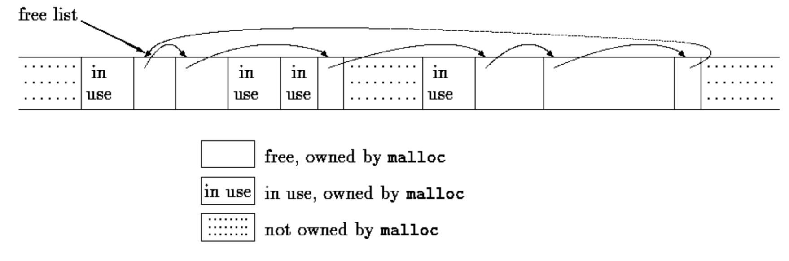
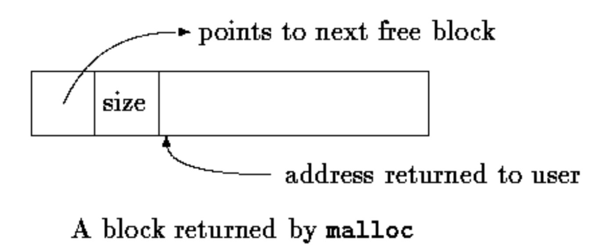

UNIX 操作系统通过一组**系统调用**(system calls)提供服务——它们实际上是操作系统中可被用户程序调用的函数。本章讲述如何在 C 程序中使用一些最重要的系统调用。使用 UNIX 的话这些内容直接有用：有时为了最高效率、或为了访问库中没有的设施，必须使用系统调用。即使在别的操作系统上用 C，这些例子也能带来对 C 编程的洞见——细节虽异，任何系统上都有类似的代码。ANSI C 库在很多方面以 UNIX 设施为蓝本，这些代码也有助于理解标准库。

## 8.1 文件描述符

UNIX 中所有输入输出都靠读写文件完成——所有外围设备（包括键盘和屏幕）都是文件系统中的文件。这意味着**一个单一的同构接口处理程序与外设之间的所有通信**。

最一般的情形下，读写文件前必须告知系统你的意图，这一过程称为**打开**(opening)文件。要写文件可能还得创建它或丢弃原有内容。系统检查你的权限（文件存在吗？你有权访问吗？），一切正常就返回给程序一个小的非负整数，称**文件描述符**(file descriptor)。此后对该文件的一切输入输出都用文件描述符而非名字标识文件。（文件描述符类似标准库的文件指针、MS-DOS 的文件句柄。）打开文件的全部信息由系统维护，用户程序只凭描述符引用文件。

涉及键盘和屏幕的输入输出太常见，系统做了专门安排使其方便：命令解释器（**shell**）运行程序时，会打开三个文件，描述符为 0、1、2，分别叫**标准输入**、**标准输出**、**标准错误**。程序读 0、写 1 和 2，不必操心打开文件就能输入输出。

用户可以用 `<` 和 `>` 把程序的 I/O 重定向到文件：

```c
prog <infile >outfile
```

此时 shell 把描述符 0 和 1 的默认指派改为指定文件。通常描述符 2 仍连着屏幕，错误信息可以到那里去。管道的输入输出同理。**所有情况下文件指派的改变都由 shell 而非程序完成**：程序不知道输入从哪来、输出到哪去，只要用文件 0 做输入、1 和 2 做输出就行。

## 8.2 低级 I/O——read 和 write

输入输出用 `read` 和 `write` 两个系统调用，C 程序通过同名函数访问它们。两者的第一个参数都是文件描述符；第二个参数是程序中存放数据（或从中取出数据）的字符数组；第三个参数是要传送的字节数：

```c
   int n_read = read(int fd, char *buf, int n);
   int n_written = write(int fd, char *buf, int n);
```

每次调用返回传送的字节数。**读**时返回的字节数可能少于请求的数目：返回 0 意味着文件结束，-1 表示某种错误。**写**时返回值是写出的字节数，不等于请求数就是出错。

一次调用可以读写任意多的字节。最常见的值是 1（一次一个字符，即"无缓冲"），以及 1024、4096 这类对应外设物理块大小的数——更大的尺寸更高效，因为系统调用次数更少。

综合这些事实可以写一个把输入拷到输出的简单程序，相当于第 1 章的文件复制程序。它能把任何东西拷到任何地方——输入输出可以重定向到任何文件或设备：

```c
#include "syscalls.h"

main()  /* copy input to output */
{
    char buf[BUFSIZ];
    int n;
    while ((n = read(0, buf, BUFSIZ)) > 0)
        write(1, buf, n);
    return 0;
}
```

我们把系统调用的函数原型集中在一个叫 `syscalls.h` 的文件里供本章程序包含（这个名字不是标准的）。参数 BUFSIZ 也定义在 syscalls.h 中，其值是本地系统的合适大小。文件大小不是 BUFSIZ 整数倍时，某次 read 返回较少字节供 write 写出，再下一次 read 返回 0。

看看 read 和 write 如何构造 getchar、putchar 这类高层例程很有启发。比如**无缓冲**版 getchar，每次从标准输入读一个字符：

```c
#include "syscalls.h"
/* getchar:  unbuffered single character input */
int getchar(void)
{
    char c;
    return (read(0, &c, 1) == 1) ? (unsigned char) c : EOF;
}
```

c 必须是 char——read 需要字符指针。返回语句中把 c cast 成 `unsigned char`，消除符号扩展问题。

第二版 getchar 成大块读入，再一个字符一个字符地交出：

```c
#include "syscalls.h"

/* getchar:  simple buffered version */
int getchar(void) {
    static char buf[BUFSIZ];
    static char *bufp = buf;
    static int n = 0;
    if (n == 0) {  /* buffer is empty */
        n = read(0, buf, sizeof buf);
        bufp = buf;
    }
    return (--n >= 0) ? (unsigned char) *bufp++ : EOF;
}
```

这两个 getchar 若与 `<stdio.h>` 一起编译，必须 `#undef` 名字 getchar，以防它被实现为宏。

## 8.3 open、creat、close 和 unlink

除默认的标准输入、输出、错误外，读写文件必须显式**打开**。为此有两个系统调用：`open` 与 `creat`（原文如此）。

`open` 类似第 7 章的 `fopen`，区别是不返回文件指针而是**文件描述符**（就是个 int）。任何错误返回 -1：

```c
#include <fcntl.h>

int fd;
int open(char *name, int flags, int perms);
fd = open(name, flags, perms);
```

与 fopen 一样，name 是含文件名的字符串。第二个参数 flags 是 int，指明文件如何打开，主要取值：

- `O_RDONLY`：只读打开
- `O_WRONLY`：只写打开
- `O_RDWR`：读写打开

这些常量在 System V UNIX 定义于 `<fcntl.h>`，Berkeley（BSD）版本在 `<sys/file.h>`。

打开一个已有文件来读：

```c
fd = open(name, O_RDONLY,0);
```

我们讨论的用法中 open 的 perms 参数总是 0。

打开不存在的文件是错误。系统调用 **creat** 用来创建新文件或重写旧文件：

```c
   int creat(char *name, int perms);
   fd = creat(name, perms);
```

能创建则返回文件描述符，否则 -1。文件已存在时 creat 把它**截断为零长度**、丢弃原有内容——creat 已存在的文件不是错误。文件不存在时按 perms 指定的权限创建。UNIX 文件系统有 9 位权限信息，控制文件属主、属主组、其他人的读/写/执行，因此三位八进制数表示权限很方便：**0775** 表示属主可读、写、执行，组和其他人可读、执行。

举例——UNIX 程序 cp（把一个文件拷贝到另一个）的简化版：只拷一个文件、第二参数不许是目录、权限是自定的而非拷贝的：

```c
#include <stdio.h>
#include <fcntl.h>
#include "syscalls.h"

#define PERMS 0666     /* RW for owner, group, others */

void error(char *, ...);

/* cp:  copy f1 to f2 */
main(int argc, char *argv[]) {
    int f1, f2, n;
    char buf[BUFSIZ];
    if (argc != 3)
        error("Usage: cp from to");
    if ((f1 = open(argv[1], O_RDONLY, 0)) == -1)
        error("cp: can't open %s", argv[1]);
    if ((f2 = creat(argv[2], PERMS)) == -1)
        error("cp: can't create %s, mode %03o",
              argv[2], PERMS);
    while ((n = read(f1, buf, BUFSIZ)) > 0)
        if (write(f2, buf, n) != n)
            error("cp: write error on file %s", argv[2]);
    return 0;
}
```

程序以固定权限 0666 创建输出文件；用 8.6 节的 stat 系统调用可以取得已有文件的模式，让副本用同样的模式。

注意 `error` 像 printf 一样接收变长参数表，其实现展示了 printf 家族另一个成员的用法：标准库函数 `vprintf` 与 printf 相同，只是变长参数表换成一个经 va_start 初始化的参数；类似地 `vfprintf`、`vsprintf` 对应 `fprintf`、`sprintf`。

```c
#include <stdio.h>
#include <stdarg.h>

/* error:  print an error message and die */
void error(char *fmt, ...) {
    va_list args;
    va_start(args, fmt);
    fprintf(stderr, "error: ");
    vfprintf(stderr, fmt, args);
    fprintf(stderr, "\n");
    va_end(args);
    exit(1);
}
```

程序同时打开的文件数有限制（常见约 20 个），要处理很多文件的程序必须准备**复用**文件描述符。函数 `close(int fd)` 断开文件描述符与打开文件的连接，释放描述符给别的文件用——对应标准库的 fclose，只是没有缓冲要冲刷。经 exit 或从 main 返回而终止程序时，所有打开的文件都被关闭。

函数 `unlink(char *name)` 把文件名从文件系统中删除，对应标准库函数 remove。

## 8.4 随机访问——lseek

输入输出通常是**顺序的**：每次读或写发生在文件中上次操作之后的位置。需要时也可以按任意次序读写文件。系统调用 `lseek` 提供不读写数据而在文件中移动位置的手段：

```c
long lseek(int fd, long offset, int origin);
```

把描述符 fd 的文件当前位置设为 offset，它相对 origin 指定的位置计量，随后的读写从该位置开始。origin 取 0、1、2 分别表示从文件**开头**、**当前位置**、**末尾**计量。例如追加写文件（UNIX shell 的 `>>` 重定向或 fopen 的 "a"）前先移到末尾：

```c
lseek(fd, 0L, 2);
```

回到开头（"rewind"）：

```c
lseek(fd, 0L, 0);
```

注意 `0L` 参数；lseek 声明恰当的话也可写成 (long) 0 或 0。

有了 lseek，就可以把文件或多或少当数组用——代价是访问较慢。下面的函数从文件任意位置读任意多字节，返回读到的字节数，出错返回 -1：

```c
#include "syscalls.h"

/*get:  read n bytes from position pos */
int get(int fd, long pos, char *buf, int n) {
    if (lseek(fd, pos, 0) >= 0) /* get to pos */
        return read(fd, buf, n);
    else
        return -1;
}
```

lseek 的返回值是 long，给出文件的新位置，出错为 -1。标准库函数 `fseek` 与 lseek 类似，只是第一个参数是 `FILE *`，出错返回非零。

## 8.5 实例——fopen 和 getc 函数的实现

通过实现标准库例程 `fopen` 和 `getc`，看看这些部件如何拼在一起。

回忆：标准库用**文件指针**而非文件描述符描述文件。文件指针指向一个结构，含文件的若干信息：**指向缓冲区的指针**（文件可以大块读入）、**缓冲区剩余字符数**、**指向缓冲区下一字符位置的指针**、**文件描述符**、描述读/写模式与错误状态的**标志**。

描述文件的数据结构在 `<stdio.h>` 中。使用标准输入输出库例程的源文件必须包含它，库中函数自己也包含。下面是典型 `<stdio.h>` 的摘录：仅供库函数使用的名字以下划线开头，减少与用户程序名字冲突的机会——所有标准库例程都遵守这一约定：

```c
#define NULL      0
#define EOF       (-1)
#define BUFSIZ    1024
#define OPEN_MAX  20 /* max #files open at once */
typedef struct _iobuf {
    int cnt;/* characters left */
    char *ptr;/* next character position */
    char *base;/* location of buffer */
    int flag;/* mode of file access */
    int fd;/* file descriptor */
} FILE;
extern FILE _iob[OPEN_MAX];

#define stdin   (&_iob[0])
#define stdout  (&_iob[1])
#define stderr  (&_iob[2])
enum _flags {
    _READ = 01,/* file open for reading */
    _WRITE = 02,/* file open for writing */
    _UNBUF = 04,/* file is unbuffered */
    _EOF = 010,  /* EOF has occurred on this file */
    _ERR = 020   /* error occurred on this file */
};

int _fillbuf(FILE *);

int _flushbuf(int, FILE *);

#define feof(p) (((p)->flag & _EOF) != 0)
#define ferror(p) (((p)->flag & _ERR) != 0)
#define fileno(p) ((p)->fd)
#define getc(p)  (--(p)->cnt >= 0 \
                    ? (unsigned char) *(p)->ptr++ : _fillbuf(p))
#define putc(x,p) (--(p)->cnt >= 0 \
                  ? *(p)->ptr++ = (x) : _flushbuf((x),p))
#define getchar()   getc(stdin)
#define putchar(x)  putc((x), stdout)
```

`getc` 宏通常递减计数、推进指针、返回字符（回忆：长的 `#define` 用反斜线续行）。计数变负时 getc 调用函数 `_fillbuf` 补充缓冲区、重新初始化结构内容并返回一个字符。字符以 **unsigned** 形式返回，保证所有字符为正。

`putc` 的运作与 getc 大体相同（缓冲满时调用 `_flushbuf`），就不展开细节了。还包含了访问错误/文件结束状态及文件描述符的宏。

现在可以写 `fopen` 了。它主要做的是打开文件、定位于恰当位置、设置标志位表明正确状态。**fopen 不分配缓冲区**——首次读文件时由 _fillbuf 分配：

```c
#include <fcntl.h>
#include "syscalls.h"

#define PERMS 0666    /* RW for owner, group, others */

FILE *fopen(char *name, char *mode) {
    int fd;
    FILE *fp;
    if (*mode != 'r' && *mode != 'w' && *mode != 'a')
        return NULL;
    for (fp = _iob; fp < _iob + OPEN_MAX; fp++)
        if ((fp->flag & (_READ | _WRITE)) == 0)
            break;        /* found free slot */
    if (fp >= _iob + OPEN_MAX)   /* no free slots */
        return NULL;
    if (*mode == 'w')
        fd = creat(name, PERMS);
    else if (*mode == 'a') {
        if ((fd = open(name, O_WRONLY, 0)) == -1)
            fd = creat(name, PERMS);
        lseek(fd, 0L, 2);
    } else
        fd = open(name, O_RDONLY, 0);
    if (fd == -1)         /* couldn't access name */
        return NULL;
    fp->fd = fd;
    fp->cnt = 0;
    fp->base = NULL;
    fp->flag = (*mode == 'r') ? _READ : _WRITE;
    return fp;
}
```

这个 fopen 未处理标准全部的访问模式，不过补充所需代码不多：它不识别二进制访问的 "b"（UNIX 上无意义），也不认允许同时读写的 "+"。

某文件首次调用 getc 时计数为零，迫使调用 `_fillbuf`。_fillbuf 发现文件不是为读打开就立即返回 EOF；否则（若读要缓冲）尝试分配缓冲区。缓冲区建立后调用 read 填充、设置计数与指针、返回缓冲区首字符。后续调用将发现缓冲区已分配：

```c
#include "syscalls.h"

/* _fillbuf:  allocate and fill input buffer */
int _fillbuf(FILE *fp) {
    int bufsize;
    if ((fp->flag & (_READ | _EOF | _ERR)) != _READ)
        return EOF;
    bufsize = (fp->flag & _UNBUF) ? 1 : BUFSIZ;
    if (fp->base == NULL)     /* no buffer yet */
        if ((fp->base = (char *) malloc(bufsize)) == NULL)
            return EOF;       /* can't get buffer */
    fp->ptr = fp->base;
    fp->cnt = read(fp->fd, fp->ptr, bufsize);
    if (--fp->cnt < 0) {
        if (fp->cnt == -1)
            fp->flag |= _EOF;
        else
            fp->flag |= _ERR;
        fp->cnt = 0;
        return EOF;
    }
    return (unsigned char) *fp->ptr++;
}
```

最后一件遗留事是一切如何启动：数组 `_iob` 必须为 stdin、stdout、stderr 定义并初始化：

```c
FILE _iob[OPEN_MAX] = {    /* stdin, stdout, stderr */
        {0, (char *) 0, (char *) 0, _READ,  0},
        {0, (char *) 0, (char *) 0, _WRITE, 1},
        {0, (char *) 0, (char *) 0, _WRITE | _UNBUF, 2}
};
```

结构 flag 部分的初始化表明：stdin 为读、stdout 为写、stderr 为**无缓冲**写。

## 8.6 实例——目录列表

另一类文件系统交互：查询文件**的信息**而非其内容。目录列表程序如 UNIX 命令 `ls` 就是一例——打印目录中各文件的名字，可选地打印大小、权限等其他信息；MS-DOS 的 dir 命令类似。

UNIX 目录本身就是一个文件，ls 只需读它即可取得文件名；但访问文件的其他信息（如大小）必须用系统调用。别的系统上可能连文件名都要系统调用才能访问（MS-DOS 即如此）。我们想要的是以**相对独立于系统**的方式提供这些信息，哪怕实现高度依赖系统。

写一个叫 fsize 的程序来演示：它是 ls 的特殊形式，打印命令行参数列出的所有文件的大小；某文件是目录时递归处理之；无参数时处理当前目录。

先简要复习 UNIX 文件系统结构。**目录**(directory)是一个文件，含文件名列表及它们所在位置的某种指示。"位置"是另一张表——**inode 表**（index node，索引节点表）——的下标。文件的 **inode** 保存除名字外的全部信息。目录项通常只有两项：文件名和 inode 号。

遗憾的是，各版本系统的目录格式与内容并不相同。于是把任务分成两块，把不可移植的部分隔离出来：外层定义一个 `Dirent` 结构和 opendir、readdir、closedir 三个例程，以独立于系统的方式访问目录项中的名字与 inode 号；fsize 用这个接口写。然后展示在 Version 7 与 System V UNIX 目录结构上的实现，其他变体留作练习。

`Dirent` 结构含 inode 号和名字。文件名分量的最大长度是 NAME_MAX（依赖系统的值）。opendir 返回指向 `DIR` 结构（类似 FILE）的指针，供 readdir 与 closedir 使用。这些信息收在文件 `dirent.h` 中：

```c
#define NAME_MAX 14 /* longest filename component; */
/* system-dependent */
typedef struct { /* portable directory entry */
    long ino;   /* inode number */
    char name[NAME_MAX + 1]; /* name + '\0' terminator */
} Dirent;

typedef struct { /* minimal DIR: no buffering, etc. */
    int fd; /* file descriptor for the directory */
    Dirent d;   /* the directory entry */
} DIR;

DIR *opendir(char *dirname);

Dirent *readdir(DIR *dfd);

void closedir(DIR *dfd);
```

系统调用 `stat` 接收文件名，返回该文件 inode 中的全部信息，出错返回 -1：

```c
char *name;
struct stat stbuf;
int stat(char *, struct stat *);
stat(name, &stbuf);
```

把文件 name 的 inode 信息填入结构 stbuf。描述 stat 返回值的结构在 `<sys/stat.h>`，典型形状如下：

```c
struct stat /* inode information returned by stat */
{
    dev_t st_dev; /* device of inode */
    ino_t st_ino;/* inode number */
    short st_mode; /* mode bits */
    short st_nlink; /* number of links to file */
    short st_uid; /* owners user id */
    short st_gid; /* owners group id */
    dev_t st_rdev; /* for special files */
    off_t st_size; /* file size in characters */
    time_t st_atime;/* time last accessed */
    time_t st_mtime; /* time last modified */
    time_t st_ctime; /* time originally created */
}
```

多数值看注释即明。`dev_t`、ino_t 这类类型定义在 `<sys/types.h>`，也必须包含。

`st_mode` 含描述文件的一组标志，定义同样在 `<sys/types.h>`；我们只需要文件类型部分：

```c
#define S_IFMT 0160000 /* type of file: */
#define S_IFDIR 0040000  /* directory */
#define S_IFCHR 0020000  /* character special */
#define S_IFBLK 0060000 /* block special */
#define S_IFREG 0010000 /* regular */
```

现在可以写 `fsize` 了。stat 得到的模式表明不是目录时，大小唾手可得、直接打印；名字是目录时，逐个处理其中文件，里面又可能有子目录——过程是递归的。main 处理命令行参数，把每个参数交给函数 fsize：

```c
#include <stdio.h>
#include <string.h>
#include "syscalls.h"
#include <fcntl.h>      /* flags for read and write */
#include <sys/types.h>  /* typedefs */
#include <sys/stat.h>   /* structure returned by stat */
#include "dirent.h"

void fsize(char *);

/* print file name */
main(int argc, char **argv)
{
    if (argc == 1)  /* default: current directory */
        fsize(".");
    else
        while (--argc > 0)
            fsize(*++argv);
    return 0;
}
```

函数 `fsize` 打印文件大小；文件是目录时先调用 `dirwalk` 处理其中所有文件。注意 S_IFMT、S_IFDIR 标志名如何用于判断目录——括号重要，`&` 的优先级低于 `==`：

```c
int stat(char *, struct stat *);

void dirwalk(char *, void (*fcn)(char *));

/* fsize:  print the name of file "name" */
void fsize(char *name) {
    struct stat stbuf;
    if (stat(name, &stbuf) == -1) {
        fprintf(stderr, "fsize: can't access %s\n", name);
        return;
    }
    if ((stbuf.st_mode & S_IFMT) == S_IFDIR)
        dirwalk(name, fsize);
    printf("%8ld %s\n", stbuf.st_size, name);
}
```

`dirwalk` 是把函数应用于目录中每个文件的通用例程：打开目录、循环处理其中文件、逐个调用函数、关闭目录返回。fsize 对每个目录调用 dirwalk，两个函数相互递归：

```c
#define MAX_PATH 1024

/* dirwalk:  apply fcn to all files in dir */
void dirwalk(char *dir, void (*fcn)(char *)) {
    char name[MAX_PATH];
    Dirent *dp;
    DIR *dfd;
    if ((dfd = opendir(dir)) == NULL) {
        fprintf(stderr, "dirwalk: can't open %s\n", dir);
        return;
    }
    while ((dp = readdir(dfd)) != NULL) {
        if (strcmp(dp->name, ".") == 0
            || strcmp(dp->name, "..") == 0)
            continue;    /* skip self and parent */
        if (strlen(dir) + strlen(dp->name) + 2 > sizeof(name))
            fprintf(stderr, "dirwalk: name %s %s too long\n",
                    dir, dp->name);
        else {
            sprintf(name, "%s/%s", dir, dp->name);
            (*fcn)(name);
        }
    }
    closedir(dfd);
}
```

每次 `readdir` 返回下一个文件信息的指针，没有文件剩下了返回 NULL。每个目录都含指向自己的项 "." 和指向父目录的项 ".."——必须跳过，否则程序永远循环。

到此为止，代码独立于目录的格式。下一步是给出特定系统上 opendir、readdir、closedir 的最小实现。下面是 Version 7 与 System V UNIX 的例程，使用头文件 `<sys/dir.h>` 中的目录信息：

```c
#ifndef DIRSIZ
#define DIRSIZ  14
#endif
struct direct {   /* directory entry */
    ino_t d_ino;           /* inode number */
    char d_name[DIRSIZ];  /* long name does not have '\0' */
};
```

有的系统版本允许更长的名字、有更复杂的目录结构。

类型 `ino_t` 是描述 inode 表下标的 typedef，在我们常用的系统上恰为 unsigned short——但这不是该嵌进程序的信息：换台机器可能就不同，用 typedef 更好。完整的"系统"类型集合在 `<sys/types.h>`。

`opendir` 打开目录文件、验证它确是目录（这次用类似 stat 但作用于文件描述符的系统调用 `fstat`）、分配一个目录结构并记录信息：

```c
int fstat(int fd, struct stat *);

/* opendir:  open a directory for readdir calls */
DIR *opendir(char *dirname) {
    int fd;
    struct stat stbuf;
    DIR *dp;
    if ((fd = open(dirname, O_RDONLY, 0)) == -1
        || fstat(fd, &stbuf) == -1
        || (stbuf.st_mode & S_IFMT) != S_IFDIR
        || (dp = (DIR *) malloc(sizeof(DIR))) == NULL)
        return NULL;
    dp->fd = fd;
    return dp;
}
```

closedir 关闭目录文件并释放空间：

```c
/* closedir:  close directory opened by opendir */
void closedir(DIR *dp) {
    if (dp) {
        close(dp->fd);
        free(dp);
    }
}
```

最后，`readdir` 用 read 逐条读目录项。目录槽位当前未使用（文件被删除）时 inode 号为零，跳过该位置；否则把 inode 号和名字放进 static 结构并返回指向它的指针——每次调用覆盖上一次的信息：

```c
#include <sys/dir.h>   /* local directory structure */

/* readdir:  read directory entries in sequence */
Dirent *readdir(DIR *dp) {
    struct direct dirbuf;  /* local directory structure */
    static Dirent d;      /* return: portable structure */
    while (read(dp->fd, (char *) &dirbuf, sizeof(dirbuf))
           == sizeof(dirbuf)) {
        if (dirbuf.d_ino == 0) /* slot not in use */
            continue;
        d.ino = dirbuf.d_ino;
        strncpy(d.name, dirbuf.d_name, DIRSIZ);
        d.name[DIRSIZ] = '\0';  /* ensure termination */
        return &d;
    }
    return NULL;
}
```

fsize 程序虽然专门，却说明了两点。其一，很多程序并非"系统程序"，只是使用操作系统维护的信息——对这类程序，关键在于信息的表示只出现在标准头文件中，程序包含这些头文件而不是自己嵌入声明。其二，用心做就能为依赖系统的对象创造**相对独立于系统的接口**——标准库的函数就是好例子。

## 8.7 实例——存储分配程序

第 5 章给出了一个局限很大的面向栈的存储分配器，现在写的版本没有限制：`malloc` 与 free 的调用可以任意交错；malloc 需要时向操作系统申请更多内存。这些例程展示了以相对独立于机器的方式编写依赖机器的代码要考虑的问题，也是结构、联合与 `typedef` 的真实应用。

malloc 不再从编译进程序的定长数组中分配，而是按需向操作系统申请空间。程序中其他活动不经这个分配器也可能申请空间，因此 malloc 管理的空间**未必连续**：空闲存储保存为**空闲块链表**，每块含大小、指向下一块的指针、以及空间本身。块按存储地址**递增**排序，最后一块（最高地址）指向第一块。



请求到来时扫描空闲表直到找到足够大的块。这个算法叫 **first fit**（首次适应），与之相对的 **best fit**（最佳适应）寻找能满足请求的最小块。块恰好是请求的大小就摘出表外交给用户；太大就**分割**，合适部分给用户，剩余留在空闲表。找不到足够大的块，就向操作系统另要一大块并链入空闲表。

释放也要搜索空闲表，找到被释放块该插入的位置。它与任一侧的空闲块相邻就**合并**成更大的块，避免存储过于破碎。判断相邻很容易——空闲表按地址顺序维护。

第 5 章提过的一个问题是保证 malloc 返回的存储对将存放其中的对象有**恰当的对齐**。机器各异，但每台机器都有一个**最苛刻的类型**：最苛刻的类型能存于某地址，其他类型就都能。有的机器上最苛刻的是 double，有的 int 或 long 就够。

空闲块含指向链表下一块的指针、块大小记录、再是空闲空间本身；开头的控制信息称**头部**(header)。为简化对齐，所有块都是头部大小的整数倍，头部自身对齐恰当。做法是用一个**联合**：含所需的头部结构和"最苛刻对齐类型"（这里随意取为 long）的实例：

```c
typedef long Align;    /* for alignment to long boundary */
union header {         /* block header */
    struct {
        union header *ptr; /* next block if on free list */
        unsigned size;     /* size of this block */
    } s;
    Align x;           /* force alignment of blocks */
};
typedef union header Header;
```

Align 字段从不使用，只是强制每个头部对齐到最坏情况的边界。

malloc 中，请求的字节数向上取整为头部大小单位的倍数；分配的块多含一个单位给头部本身，这个数记录在头部的 size 字段。**malloc 返回的指针指向自由空间而非头部**。用户对申请的空间可为所欲为，但若写出分配空间之外，链表多半会被搅乱。



size 字段必不可少——malloc 管辖的块不必连续，不可能靠指针算术算出大小。

变量 base 用于启动。首次调用 malloc 时 freep 为 NULL，于是建立一个退化的空闲表：只含一个大小为零的块，指向自身。然后搜索空闲表，从上次找到块的地方（freep）开始——这一策略有助于保持表均匀。找到过大的块时把**尾端**交给用户：这样原块头部只需调整 size。所有情况下返回给用户的指针都指向块内自由空间，从头部后一个单位开始：

```c
static Header base;       /* empty list to get started */
static Header *freep = NULL;     /* start of free list */
/* malloc:  general-purpose storage allocator */
void *malloc(unsigned nbytes) {
    Header *p, *prevp;
    Header *morecore(unsigned);
    unsigned nunits;
    nunits = (nbytes + sizeof(Header) - 1) / sizeof(Header) + 1;
    if ((prevp = freep) == NULL) {   /* no free list yet */
        base.s.ptr = freep = prevp = &base;
        base.s.size = 0;
    }
    for (p = prevp->s.ptr;; prevp = p, p = p->s.ptr) {
        if (p->s.size >= nunits) {  /* big enough */
            if (p->s.size == nunits)  /* exactly */
                prevp->s.ptr = p->s.ptr;
            else {              /* allocate tail end */
                p->s.size -= nunits;
                p += p->s.size;
                p->s.size = nunits;
            }
            freep = prevp;
            return (void *) (p + 1);
        }
        if (p == freep)  /* wrapped around free list */
            if ((p = morecore(nunits)) == NULL)
                return NULL;    /* none left */
    }
}
```

函数 `morecore` 从操作系统获取存储，细节因系统而异。向系统要内存是相对昂贵的操作，不想每次 malloc 都要一次，因此 morecore 至少申请 NALLOC 个单位，大块按需切分。设好 size 字段后，morecore 调用 free 把新增内存插入 arenas。

UNIX 系统调用 `sbrk(n)` 返回多 n 字节存储的指针，无空间返回 -1（虽然 NULL 本会是更好的设计，但事实如此）。-1 必须 cast 成 char * 才能与返回值比较。cast 让函数相对不受不同机器指针表示细节的影响。不过仍有一个假设：sbrk 返回的不同块的指针可以有意义地比较——标准并不保证（只允许数组内比较指针），因此这个 malloc 只在通用指针比较有意义的机器间可移植：

```c
#define NALLOC  1024   /* minimum #units to request */

/* morecore:  ask system for more memory */
static Header *morecore(unsigned nu) {
    char *cp, *sbrk(int);
    Header *up;
    if (nu < NALLOC)
        nu = NALLOC;
    cp = sbrk(nu * sizeof(Header));
    if (cp == (char *) -1)/* no space at all */
        return NULL;
    up = (Header *) cp;
    up->s.size = nu;
    free((void *) (up + 1));
    return freep;

}
```

最后是 `free`。它从 freep 起扫描空闲表，寻找被释放块的插入位置——在两个已有块之间，或表末端。无论哪种，被释放块与任一侧相邻就合并。麻烦只在于保持指针指向正确的东西、大小正确：

```c
/* free:  put block ap in free list */
void free(void *ap) {
    Header *bp, *p;
    bp = (Header *) ap - 1;    /* point to  block header */
    for (p = freep; !(bp > p && bp < p->s.ptr); p = p->s.ptr)
        if (p >= p->s.ptr && (bp > p || bp < p->s.ptr))
            break;  /* freed block at start or end of arena */
    if (bp + bp->s.size == p->s.ptr) {/* join to upper nbr */
        bp->s.size += p->s.ptr->s.size;
        bp->s.ptr = p->s.ptr->s.ptr;
    } else
        bp->s.ptr = p->s.ptr;
    if (p + p->s.size == bp) {/* join to lower nbr */
        p->s.size += bp->s.size;
        p->s.ptr = bp->s.ptr;
    } else
        p->s.ptr = bp;
    freep = p;
}
```

存储分配本质上是依赖机器的，但上面的代码展示了如何把机器依赖**控制并限制在程序很小的一部分**内：typedef 与联合处理对齐（前提是 sbrk 提供合适的指针）；cast 使指针转换显式进行，甚至能应付设计糟糕的系统接口。这里的细节虽与存储分配相关，一般方法也适用于其他场合。
