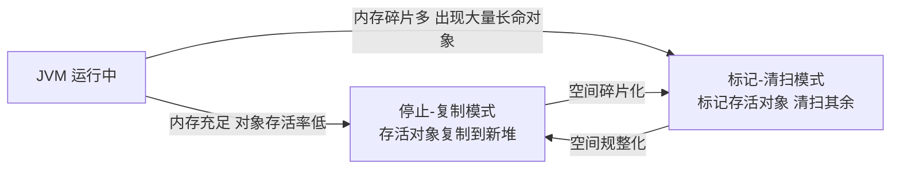

## 1. 保证初始化:构造器（Guaranteed initialization with the constructor）

初始化（initialization）和清理（cleanup）是编程安全问题的主要来源:C 里很多 bug 源于忘记初始化变量;库的使用者不知道要初始化库组件,甚至不知道必须初始化。清理则是另一个极端——用完的元素容易被遗忘,它占用的资源（最典型的是内存）一直得不到释放,最终资源耗尽。

C++ 引入了**构造器（constructor）**的概念:一个在对象创建时被自动调用的特殊方法。Java 采纳了构造器,同时用**垃圾回收器（garbage collector）**自动释放不再使用的内存资源。

> If a class has a constructor, Java automatically calls that constructor when an object is created, before users can even get their hands on it.
>
> 如果一个类有构造器,Java 会在对象创建时自动调用它,用户来不及干预——初始化因此得到保证。

构造器的命名问题:调用构造器的是编译器,所以它必须总能知道该调哪个方法。C++ 的方案最简单也最合逻辑,Java 沿用了它——**构造器与类同名**。

```java
public class SimpleConstructor {
    // 构造器与类同名,没有任何返回值(连 void 都没有)
    SimpleConstructor() {
        System.out.println("Rock ");
    }

    public static void main(String[] args) {
        for (int i = 0; i < 5; i++)
            new SimpleConstructor();
    }
}
```

不接受任何参数的构造器叫**默认构造器（default constructor,也称无参构造器）**,它做的事是"创建一个默认对象"。带参数的构造器则能在初始化时提供初始状态:

```java
public class SimpleConstructor2 {
    SimpleConstructor2(int i) {   // 带参构造器:初始化时传入状态
        System.out.println("Rock " + i);
    }

    public static void main(String[] args) {
        for (int i = 0; i < 5; i++)
            new SimpleConstructor2(i);
    }
}
```

构造器消除了这一类错误:对象创建后忘记调用 `initialize()` 之类的初始化方法。

## 2. 方法重载（Method overloading）

任何程序设计语言都必须解决**命名**问题:同一个词在不同语境下表达不同含义——这是人类语言天然的多义性。在程序里,一个词一个含义固然精确,但也会把简单的事搞复杂。例如 `print()` 对整数、浮点数、字符都应该可用,如果每种类型都要一个新名字（`printInt()`、`printFloat()`……）,使用者就要背下一堆名字。

构造器必须与类同名,那么"用不同方式创建对象"的需求就更迫切了——名字只有一个,只能靠**重载（overloading）**区分:方法名相同,参数列表不同。

### 区分重载方法

每个重载的方法必须有**独一无二的参数类型列表**。参数顺序不同也能区分两个方法,但这会让代码难以维护,不推荐:

```java
public class OverloadingOrder {
    static void f(String s, int i) { }
    static void f(int i, String s) { }   // 顺序不同,合法但不推荐
}
```

### 以基本类型重载

传入的实参类型"小于"声明的形参类型时,基本类型会自动提升（promote）:`char/byte/short` 提升为 `int`;若找不到恰好匹配的重载,依次尝试 `int → long → float → double`。反过来,实参大于形参则需要显式窄化转换,否则编译报错:

| 实参类型 | 找不到精确匹配时的提升路径 |
| -------- | -------------------------------------- |
| char     | int → long → float → double            |
| byte     | short → int → long → float → double    |
| short    | int → long → float → double            |
| int      | long → float → double                  |
| long     | float → double                         |
| float    | double                                 |
| double   | 无法提升,无匹配则编译错误              |

### 以返回值区分?

方法只有返回值不同、参数列表完全相同时,编译器无法判断该调用哪个——`f();` 这行代码根本没用返回值,所以**仅返回值不同不能构成重载**。

## 3. 默认构造器（Default constructors）

默认构造器是一种"无参构造器",它的作用是创建一个默认对象。如果你写的类一个构造器都没有,编译器会**自动合成**一个默认构造器:

```java
class Bird {
    int i;
}

public class DefaultConstructor {
    public static void main(String[] args) {
        Bird b = new Bird();   // 合成默认构造器被调用
    }
}
```

但只要你自己定义了任何构造器（哪怕带参）,编译器就不再合成默认构造器,此时 `new Bird()` 会编译报错。

> Java 5 之后可用 `@Deprecated` 标注 API;同理,若默认构造器的隐式合成规则后来发生变化,语言一定保持向后兼容——"已发布的决策不能撤销"是 Java 演进的一贯约束。

## 4. this 关键字（The this keyword）

两个对象调用同一个方法,编译器如何知道操作的是哪个对象?编译器偷偷把"所操作对象的引用"作为第一个参数传给了方法——`a.f(1)` 实际是 `f(a, 1)`。

这个隐藏参数可以在方法内部显式拿到,就是 **this**——"调用当前方法的那个对象的引用"。只在必需处使用:类内部调用其他方法不必写 `this`。它的典型用法是**链式调用**:

```java
public class Leaf {
    int i = 0;

    Leaf increment() {
        i++;
        return this;   // 返回当前对象引用,支持链式调用
    }

    public static void main(String[] args) {
        Leaf x = new Leaf();
        x.increment().increment().increment();  // 同一个对象连续三次自增
        System.out.println(x.i); // 3
    }
}
```

以及把当前对象传给其他方法:

```java
class Apple {
    Apple getPeeled() {
        return Peeler.peel(this);   // 把自己交给外部工具类处理
    }
}
```

### 在构造器中调用构造器

一个构造器里可以用 `this(参数列表)` 调用另一个构造器,避免重复初始化代码。限制:最多只能调一个,且**必须是构造器的第一条语句**:

```java
public class Flower {
    Flower(int petals) { }
    Flower(String s) { }

    Flower(String s, int petals) {
        this(petals);   // 调用 Flower(int petals),必须是第一句
        // this(s);     // 编译错误:不能再调第二个
    }
}
```

### static 的含义

**static 方法就是没有 this 的方法**。static 方法内部不能调用非静态方法,反过来可以。理解了"this 是隐式的第一个参数",这一点就很自然:非静态方法依赖这个隐式参数,static 方法没有它。

static 的两个典型用途:

1. 只想为某域分配**一份**存储空间,与创建多少对象无关;
2. 希望某个方法不与任何对象绑定,即使没有对象也能调用。

> In Java, the class designer can guarantee initialization of every object by providing a constructor.
>
> 在 Java 中,类的设计者通过提供构造器来保证每个对象的初始化。

## 5. 清理:终结处理与垃圾回收（Cleanup: finalization and garbage collection）

Java 的垃圾回收器负责回收不再需要的内存,但**不保证对象一定会被回收**,也**不保证回收的时机**。理解这些局限,才能正确设计程序。

### finalize() 的用途

`finalize()` 不是 C++ 的析构器（destructor）的等价物。C++ 的对象一定被销毁,析构器一定执行;Java 的对象却未必被垃圾回收（程序没耗尽内存时 GC 可能一直不运行）。

`finalize()` 真正的用途:**在对象被回收时释放非内存资源**,典型场景是对象创建了"非 Java 语言实现"的本地资源（通过 JNI, Java Native Interface 调用 C 的 malloc 分配的内存）,GC 管不到这类资源,需要在 `finalize()` 里调用本地方法释放。

> A potential pitfall: your objects might not get garbage collected.
>
> 一个隐患:你的对象可能永远不会被垃圾回收。

### 必须自己执行清理

如果需要清理,应该自己写显式的清理方法（如 `dispose()`）,由使用者在确定不再使用对象时调用。对文件句柄、数据库连接这类稀缺资源,不要指望 `finalize()`。

### 终止条件（The termination condition）

`finalize()` 有一个有趣的用途:验证对象的终止条件——对象被回收时应该处于某种"可以被回收"的状态。例:对象打开的文件应在字段中记为 closed,`finalize()` 里检查这个标志,若文件仍打开则报错,暴露逻辑缺陷。

```java
class Book {
    boolean checkedOut = false;

    Book(boolean checkOut) {
        checkedOut = checkOut;
    }

    void checkIn() {
        checkedOut = false;
    }

    @Override
    protected void finalize() {   // 终止条件验证:回收时必须已 checkIn
        if (checkedOut)
            System.out.println("Error: checked out");
        // 通常最后调用 super.finalize(),基类也要做自己的清理
    }
}
```

### 垃圾回收器如何工作

对 GC 的常见误解:引用计数（reference counting）——每个对象配一个计数器,被引用时加一。引用计数简单但**无法处理循环引用**（A 引用 B、B 引用 A,二者都该死但计数都不为零）,而且为频繁更新的引用维护计数开销大,Java 未采用。

Java 的自适应 GC 依据"对象存活时间"的不同假设切换策略。如果对象寿命短,则:

1. **停止-复制（stop-and-copy）**:暂停程序,把存活对象从当前堆复制到新堆,新对象紧挨着分配——分配内存只是"堆顶指针移动",高效。代价:内存减半 + 程序暂停时的复制开销。
2. **标记-清扫（mark-and-sweep）**:从栈和静态存储区出发遍历所有引用,标记存活对象,然后清扫未标记的。不需要复制,剩余空间不连续。



实际实现更聪明（如 HotSpot 按"代"分块:新对象一块、老对象一块,分块复制）,并且**自适应**地在两种模式间切换,以及配合 JIT（Just-In-Time,即时编译）做进一步优化。

## 6. 成员初始化（Member initialization）

Java 尽力保证所有变量在使用前被初始化:局部变量未初始化会编译报错;类的成员变量则有**默认初始值**:

| 基本类型  | 默认值    |
| --------- | --------- |
| boolean   | false     |
| char      | '\u0000'  |
| byte      | （byte）0   |
| short     | （short）0  |
| int       | 0         |
| long      | 0L        |
| float     | 0.0f      |
| double    | 0.0d      |
| 引用类型  | null      |

默认值对"防止未初始化错误"有用,但很多情况下默认值并不是合法的业务初值（比如 int 的 0 可能代表"有效状态"）,所以通常还是要在定义处或构造器里直接初始化:

```java
public class InitialValues {
    boolean t = false;      // 直接在定义处初始化
    char c = 'x';
    int i = 3;
    double d = 3.14;
    Depth d2 = new Depth(); // 引用类型也可以指向新对象

    // 也可以通过方法调用提供初值:
    int i2 = f();
    int f() { return 11; }
}
```

成员初始化的顺序:**变量定义的先后顺序决定初始化顺序**,全部完成之后才轮到构造器执行。

## 7. 构造器初始化（Constructor initialization）

在构造器内初始化成员是常用的做法——无法在定义处拿到初始化所需的信息时,必须这样做。

### 初始化顺序

**静态初始化只在必要时进行**:首次访问静态数据或首次创建该类对象时。此后静态对象不再重新初始化。

初始化顺序:静态成员 → 实例成员 → 构造器本体:

```java
class Window {
    Window(int marker) { System.out.println("Window(" + marker + ")"); }
}

class House {
    Window w1 = new Window(1);   // (3) 实例成员

    House() {
        System.out.println("House()");   // (4) 构造器本体
        w3 = new Window(33);
    }

    Window w2 = new Window(2);   // 实例成员按文本顺序初始化
    Window w3 = new Window(3);   // (3') w3 先被初始化,又在构造器里被覆盖
}
```

### 静态数据的初始化

静态成员属于类,只在首次加载类时初始化一次。看初始化顺序的经典示例:

```java
class Bowl {
    Bowl(int marker) { System.out.println("Bowl(" + marker + ")"); }
    void f1(int marker) { System.out.println("f1(" + marker + ")"); }
}

class Table {
    static Bowl bowl1 = new Bowl(1);   // (1) 静态成员
    Table() { System.out.println("Table()"); }
    static Bowl bowl2 = new Bowl(2);   // (2) 静态成员
}

public class StaticInitialization {
    public static void main(String[] args) {
        System.out.println("main()");        // (0) main 先打印
        Table t = new Table();               // 触发 Table 的静态初始化
    }
}
/* Output:
main()
Bowl(1)
Bowl(2)
Table()
*/
```

总结初始化顺序:**先静态（仅一次）→ 再实例成员（每次创建对象）→ 最后构造器**;基类的初始化先于派生类。

### 显式静态初始化（静态块）

多个静态初始化语句可以收进一个静态块,也只执行一次:

```java
class Cups {
    static Cup cup1;
    static Cup cup2;

    static {                        // 静态初始化块
        cup1 = new Cup(1);
        cup2 = new Cup(2);
    }
}
```

### 非静态实例初始化（实例初始化块）

实例初始化块让你不必非得定义一个具名方法,每次创建对象时都执行:

```java
class Mug {
    Mug(int marker) { System.out.println("Mug(" + marker + ")"); }
}

public class Mugs {
    Mug mug1;
    Mug mug2;
    {                              // 实例初始化块:构造器之前执行
        mug1 = new Mug(1);
        mug2 = new Mug(2);
    }

    Mugs() { System.out.println("Mugs()"); }
}
```

它主要服务于**匿名内部类**的初始化（匿名类没有构造器名,无法定义构造器,见内部类一章）。

## 8. 数组初始化（Array initialization）

数组是相同类型（或相容类型）对象的序列,用方括号下标访问。定义数组时方括号可以放在类型后也可以放在变量名前（风格上推荐放类型后）:

```java
int[] a1;   // 推荐
int a1[];   // C 风格,不推荐
```

编译器不允许指定数组大小——`int a1[5]` 非法,因为数组是**引用**,长度由运行时 `new` 分配时才确定:

```java
int[] a1;          // 只是引用,未初始化
a1 = new int[5];   // 分配后元素自动初始化为 0
a1[0] = 1;

Integer[] a = new Integer[5];   // 引用类型数组,元素自动为 null
// a[0]++ 会抛 NullPointerException
```

### 可变参数列表（Variable argument lists）

Java SE5 之后可以用**可变参数（varargs）**语法 `类型... 参数名` 声明可变参数,编译器把它变成一个数组,同时兼容旧的数组调用方式:

```java
public class NewVarArgs {
    static void printArray(Object... args) {   // 任意数量、任意类型的参数
        for (Object obj : args)
            System.out.print(obj + " ");
        System.out.println();
    }

    public static void main(String[] args) {
        printArray(47, 3.14F, 11.11);   // 自动装箱为 Integer/Float
        printArray("one", "two");
        printArray();                   // 空列表也可以
    }
}
```

可变参数与重载结合时可能出现歧义——编译器无法在两个都匹配的 varargs 方法间选择:

```java
static void f(float i, Character... args) { }
static void f(Character... args) { }

f(1, 'a');   // 编译错误:两个方法都匹配,引用歧义
```

解决方式:给其中一个方法加一个非 varargs 参数,或者干脆避免这种重载组合。

## 9. 枚举类型（Enumerated types）

Java SE5 引入 `enum`,用它创建的实例是常量,可以通过 `enum` 名直接引用;`ordinal()` 返回声明顺序,`values()` 返回全部实例,可用在 `switch` 中:

```java
public enum Spiciness {
    NOT, MILD, MEDIUM, HOT, FLAMING
}

public class SimpleEnumUse {
    public static void main(String[] args) {
        Spiciness howHot = Spiciness.MEDIUM;
        System.out.println(howHot);           // MEDIUM
        for (Spiciness s : Spiciness.values())
            System.out.println(s + ", ordinal " + s.ordinal());
    }
}
```

enum 还能携带方法与字段、按接口组织常量、配合 EnumSet/EnumMap 使用,原书后面用整章展开。
