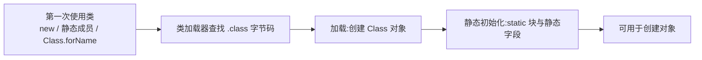

## 1. 为什么需要 RTTI(The need for RTTI)

**RTTI(Runtime Type Information,运行时类型信息)**让你在程序运行时发现并使用类型信息。它源自多态的"向上转型后忘了自己是谁"问题:把 `Circle/Square/Triangle` 都当作 `Shape` 放进容器后,大多数代码只需面向 `Shape` 编程(多态);但偶尔需要"知道确切类型"的场景——比如筛选出所有 Circle 做特殊处理。

```java
// 多态:不知道具体类型,draw() 由动态绑定决定
for (Shape shape : shapes)
    shape.draw();

// RTTI:运行时询问"你是不是 Circle?"
if (shape instanceof Circle)
    ((Circle) shape).specialMethod();
```

Java 在**编译期**打开的类,其类型信息在运行时如何表示?这靠 Class 对象(下一节)。RTTI 有两种形式:

- "传统" RTTI:编译期已知类型,如 `(Circle) shape` 的转型与 `instanceof`;
- **反射(reflection)**:编译期完全不知道类型,运行时才发现并使用(见第 5 节)。

## 2. Class 对象(The Class object)

Java 用 **Class 对象**保存运行时的类型信息,包括属性、方法、构造器等。每个类都有一个 Class 对象——编译 .java 文件时,JVM 就生成了对应的 .class 文件,Class 对象就保存在其中。

**类加载(Class loading)**:程序第一次使用某个类的静态成员、构造器、或发生继承访问时,JVM 的**类加载器(class loader)**子系统加载这个类,加载动作在**静态初始化之前**发生:



获取 Class 对象引用的三种方式:

```java
Class<Apple> c1 = Apple.class;              // 类字面量:不会触发初始化
Class<?> c2 = Class.forName("Apple");       // 全限定名:会立即初始化
Class<? extends Apple> c3 = new Apple().getClass(); // 对象方法
```

> 使用 `.class` 类字面量获得 Class 引用不会初始化该类;`Class.forName()` 立即初始化;`getClass()` 自然要求对象已存在。这是三者关键的行为差异。
>
> 使用类字面量时,初始化被延迟到第一次使用静态方法或构造器时。

Class 引用可以生成该类的实例、查询类型关系:

```java
Apple a = Apple.class.getDeclaredConstructor().newInstance(); // Java 9+ 写法
boolean b = Apple.class.isInstance(new Apple());              // 类似 instanceof
Object o = Apple.class.cast(someFruit);                       // 动态转型
```

> 原书写 `class.newInstance()`,该方法已在 Java 9 废弃,应改用 `getDeclaredConstructor().newInstance()`。

### 泛型类引用(Generic class references)

普通的 `Class` 引用可以指向任意 Class 对象;带泛型的 `Class<Integer>` 则限定指向 Integer 的 Class,编译器承担这个检查:

```java
Class<Integer> genericIntClass = int.class;
genericIntClass = Integer.class;      // 合法
// genericIntClass = double.class;    // 编译错误:类型不符
```

通配符放松限制:`Class<?> intClass = double.class;` 合法。配合 `superType.cast()` 可以写"只接受某基类及其子类"的泛型方法。`Class<? extends Fruit>` 表示"某个继承自 Fruit 的类"。

### 新的转型语法(New cast syntax)

Java 5 给 Class 引用加了 `cast()` 方法:

```java
Apple a = Apple.class.cast(fruit);       // 等价于 (Apple) fruit
```

在**写普通强转语法不合法的泛型代码**时它才有用,日常代码直接写 `(Apple)` 即可。

## 3. 转型前的检查(Checking before a cast)

转型前不知道对象的确切类型时,普通强转 `(Circle) shape` 可能抛 ClassCastException。更安全的做法是先问再转。

### instanceof

`x instanceof Circle` 在 x 是 Circle(或其子类)时为 true;**instanceof 与 null 比较返回 false**。

```java
if (x instanceof Dog)
    Dog d = (Dog) x;   // 检查通过后再转型,d 与 x 是同一个引用
```

### 统计一个容器中各类型的数量

经典例子:容器里装满各种 Pet,统计各确切类型出现次数。要点是把 Class 对象当作 Map 的键:

```java
Map<String, Integer> counter = new HashMap<>();
for (Pet pet : pets) {
    String key = pet.getClass().getSimpleName();  // 不含包名的类名
    counter.merge(key, 1, Integer::sum);
}
// 结果: {Rat=1, Manx=7, Cymric=5, Dog=3, ...}
```

`isInstance()` 是 instanceof 的动态版本,参数是对象;`isAssignableFrom()` 判断类之间的可转换关系。

### 注册工厂(Registered factories)

"生成 Pet"的工具类通过**工厂方法设计模式(Factory Method design pattern)**实现:调用工厂对象,由它创建新对象,把创建细节与调用方解耦。原书用 `Factory<T>` 接口 + 每个 Pet 类一个静态工厂:

```java
interface Factory<T> {
    T create();
}

class Cymric extends Manx {
    public static class Factory implements typeinfo.factory.Factory<Cymric> {
        public Cymric create() { return new Cymric(); }
    }
}

// 注册表:类型 → 工厂
List<Factory<? extends Pet>> petFactories = List.of(
        new Cat.Factory(), new Cymric.Factory(), new Dog.Factory());
// 随机生成时按工厂创建
```

> Java 8 之后,`Supplier<T>` 接口就是现成的工厂:`Supplier<Dog> f = Dog::new`,配合 `Stream.generate(f)` 使用更为简洁。

### instanceof 与 Class 等价性(instanceof vs. Class equivalence)

`instanceof` 与 `==` 检查 Class 的语义不同:

```java
// instanceof:保持多态语义——子类实例也算
if (pet instanceof Pet) { }        // Manx 实例也算 Pet

// getClass() == 比较:要求确切类型一致
if (pet.getClass() == Pet.class) { }  // Manx 实例不匹配
```

### 反射:动态 instanceof

完全解耦的程序里,类的信息在运行时才知道。原书展示了用反射按"全限定类名列表"动态生成对象并统计——这正是 RTTI 与反射的分界:**编译期已知类型用 RTTI;编译期未知、运行时发现类信息用反射**。

## 4. 反射:运行时的类信息(Reflection: runtime class information)

反射机制(runtime class information)让你在完全不知道类的任何信息的情况下,仅凭一个字符串类名就能:创建对象、调用方法、访问字段。RTTI 的限制是"编译期已打开类";反射则可以操作编译期不存在的类。

`Class` 的 getXXX 系列方法返回构造器、方法、字段的元信息:

| Class 方法                      | 返回内容                             |
| ------------------------------- | ------------------------------------ |
| `getConstructors()`             | public 构造器                        |
| `getDeclaredConstructors()`     | 全部构造器(含 private)             |
| `getMethods()`                  | public 方法(含继承的)              |
| `getDeclaredMethods()`          | 本类声明的全部方法                   |
| `getFields()` / `getDeclaredFields()` | public / 全部字段              |

一个"类方法提取器"示例——打印一个类的所有方法签名(含继承层次),对研究陌生的类非常有用:

```java
import java.lang.reflect.*;
import java.util.regex.*;

public class ShowMethods {
    private static String usage =
        "usage: ShowMethods qualified.class.Name";

    public static void main(String[] args) {
        if (args.length < 1) {
            System.out.println(usage);
            System.exit(0);
        }
        int lines = 0;
        try {
            Class<?> c = Class.forName(args[0]);
            Method[] methods = c.getMethods();
            Constructor[] ctors = c.getConstructors();
            for (Method method : methods)
                System.out.println(method.toString());
            for (Constructor ctor : ctors)
                System.out.println(ctor.toString());
            lines = methods.length + ctors.length;
        } catch (ClassNotFoundException e) {
            System.out.println("No such class: " + e);
        }
    }
}
```

反射的常见实际用途:类浏览器、对象检查器(调试器/IDE 的自动补全)、**GUI 构建器里拖出的控件属性面板**。方法签名字符串里的 `native`、`transient`、`volatile` 等修饰符可以通过 `Modifier.toString(method.getModifiers())` 查询。

> 反射是 Spring、MyBatis 等框架的基石:框架代码在编译期不可能知道业务类,只能运行时反射调用。

## 5. 动态代理(Dynamic proxies)

代理(proxy)是"站在真实对象前面、拦截并转发调用"的对象。Java 的动态代理可以**在运行时创建实现了一组接口的代理对象**,把接口方法的调用统一转给 `InvocationHandler`:

```java
import java.lang.reflect.*;

interface Interface {
    void doSomething();
    void somethingElse(String arg);
}

class RealObject implements Interface {
    public void doSomething() { System.out.println("doSomething"); }
    public void somethingElse(String arg) {
        System.out.println("somethingElse " + arg);
    }
}

// 调用处理器:代理上的每次方法调用都进入 invoke()
class DynamicProxyHandler implements InvocationHandler {
    private Object proxied;

    DynamicProxyHandler(Object proxied) { this.proxied = proxied; }

    @Override
    public Object invoke(Object proxy, Method method, Object[] args)
            throws Throwable {
        System.out.println("*** proxy: " + proxy.getClass()
                + ", method: " + method + ", args: " + args);
        return method.invoke(proxied, args);   // 转发给真实对象
    }
}

public class SimpleDynamicProxy {
    public static void consumer(Interface iface) {
        iface.doSomething();
        iface.somethingElse("bonobo");
    }

    public static void main(String[] args) {
        consumer(new RealObject());             // 直接调用
        Interface proxy = (Interface) Proxy.newProxyInstance(
                Interface.class.getClassLoader(),
                new Class[] { Interface.class },  // 代理要实现的接口
                new DynamicProxyHandler(new RealObject()));
        consumer(proxy);                        // 调用全部被拦截
    }
}
/* Output:
doSomething
somethingElse bonobo
*** proxy: class $Proxy0, method: doSomething(), args: null
doSomething
*** proxy: class $Proxy0, method: somethingElse(String), args: [bonobo]
somethingElse bonobo
*/
```

动态代理 vs 静态代理(手写包装类):**一个 handler 能横切任意接口**——日志、事务、远程调用、延迟加载(Spring AOP、RPC 存根)都靠它。静态代理需要为每个接口写一遍转发代码。

代理可以嵌套(代理的代理),handler 里可以按 method 名过滤、修改参数、替换返回值。

## 6. 空对象(Null Objects)

调用方到处写 `if (ref != null)` 既啰嗦又容易漏。**空对象模式(Null Object pattern)**:提供一个"行为为空"的单例对象,让"没有对象"也有一个合法的代表,调用方无需判空:

```java
interface Operation {
    String description();
}

class NullOperation implements Operation {   // 空对象:所有方法都是空操作
    public String description() { return "null"; }
}

class Person {
    // 空对象单例,外部用 position == Person.NULL 判断空位
    public static final Person NULL = new NullPerson();
}

class NullPerson extends Person {
    public String description() { return "None"; }
}
```

空对象是"占位"而非"异常"——它让系统对"缺失"也能正常运转。它与测试用的 Mock Objects、Stubs(同样实现接口但行为受测试代码控制)思想相通,但目的不同。

### 用 Optional 替代空对象(On Java 8)

Java 8 引入 `java.util.Optional` 之后,"缺失值"有了标准表达方式,空对象模式的多数场景可被替代。Optional 为可能为 null 的值套一层代理,强制调用方经由它的接口访问,**从类型系统层面杜绝意外的 NullPointerException**。

实践原则:Optional 最有价值的位置是"贴近数据"的实体对象字段;不必处处包装,有时判 null 就够了:

```java
// Person 用 Optional 包装可能缺失的字段(数据传输对象,全 final,不可变)
import java.util.*;

class Person {
    public final Optional<String> first;
    public final Optional<String> last;
    public final Optional<String> address;
    public final boolean empty;   // 构造时确定:三个字段是否全缺失

    Person(String first, String last, String address) {
        this.first = Optional.ofNullable(first);   // null → Optional.empty
        this.last = Optional.ofNullable(last);
        this.address = Optional.ofNullable(address);
        empty = !this.first.isPresent()
             && !this.last.isPresent()
             && !this.address.isPresent();
    }

    @Override
    public String toString() {
        if (empty) return "<Empty>";
        return (first.orElse("") + " " + last.orElse("")
                + " " + address.orElse("")).trim();   // 缺失按空串处理
    }
}
```

Optional 还能用于**setter 的约束**:字段本身不存 Optional,但用 Optional 的机制强制校验:

```java
class Position {
    private String title;
    private Person person;

    public void setTitle(String newTitle) {
        // null → 抛异常:错误在发生点立即暴露,而不是远处的 NullPointerException
        title = Optional.ofNullable(newTitle)
                        .orElseThrow(EmptyTitleException::new);
    }

    public void setPerson(Person newPerson) {
        // null → 替换为空 Person
        person = Optional.ofNullable(newPerson).orElse(new Person());
    }
}
```

两种用法的差别:`ofNullable().orElseThrow()` 把 null 变成**显式异常**(在出错的那一行抛出,而不是在别处炸出 NPE);`ofNullable().orElse(default)` 把 null **替换为合理默认值**。空对象模式想解决的正是这两件事,现在由 Optional 统一承担。

## 7. 接口与类型信息(Interfaces and type information)

接口的一种重要用法是"只暴露想要暴露的方法,隐藏实现细节"。但 Java 的访问控制是**防君子不防小人**的:通过反射 + `setAccessible(true)` 可以调用任何 private/package-private 成员:

```java
class HiddenC {
    static class A implements AInterface { /* 接口方法 */ }
    // 包私有类,不想被外部使用
}

// 外部仍能穿透:
Class<?> c = Class.forName("HiddenC$A");
AInterface a = (AInterface) c.getDeclaredConstructor().newInstance();
// 甚至反射调用 private 方法:
Method m = a.getClass().getDeclaredMethod("privateMethod");
m.setAccessible(true);          // 绕过访问检查
m.invoke(a);
```

结论:**接口不是保险箱**。如果实现类的确实不该被触碰,能做的只有文档约定与运行时安全管理器(以及 Java 9 起的模块系统封装)。

> Java 9 的模块系统(JPMS, Java Platform Module System)限制了跨模块的反射访问:非 `opens` 导出的包,`setAccessible(true)` 会失败(非法反射访问默认仅警告,新版本 JDK 逐步收紧为拒绝)。"用反射穿透一切"的时代正在落幕。

这也解释了 final 语义的一个细节:private 方法默认就是 final(无法被覆盖),而通过反射绕过访问控制调用 private 方法,绕过了编译器的所有检查——这种代码脆弱且不可移植。
