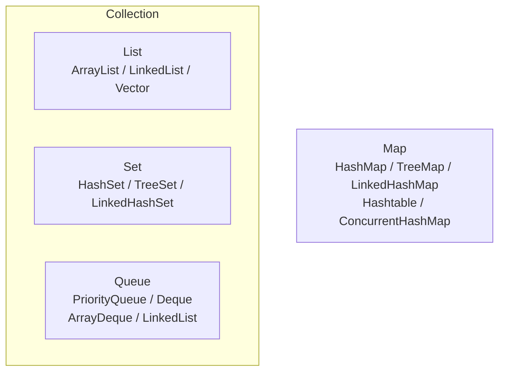

容器深入研究笔记分两篇:本篇(一)覆盖容器谱系、填充容器、Collection/List/Set/Queue 的功能与语义(第 17 章小节 1–7);(二)覆盖 Map、散列、实现选型、实用方法与引用持有(小节 8–12)。

## 1. 完整的容器分类(Full container taxonomy)

Java 容器类库的完整谱系(视图见下),核心划分:

- **Collection**:一组独立元素(List 有序、Set 不重复、Queue 先进先出/按优先级);
- **Map**:键值对,没有真正的"继承自 Collection"(早期 Java 设计的历史包袱)。



各类容器提供多种实现,差别在于:底层结构(数组/链表/哈希表/红黑树)、是否有序、是否线程安全、性能特征。

> Java 1.0/1.1 的老容器(Vector、Stack、Hashtable)带同步开销、接口不统一,已被新容器取代,只在读老代码时遇到——新代码不要再用。On Java 8 起本章内容移入"Collection Topics"附录。

## 2. 填充容器(Filling containers)

Collections 本身不带"填充"工具,常用手法是**生成器 + 集合构造/循环**。

### 生成器方案(A Generator solution)

Collection 的构造器可以接受另一个 Collection; JDK 不直接接受生成器,自己封装即可:

```java
class CollectionData<T> extends ArrayList<T> {
    CollectionData(Generator<T> gen, int quantity) {
        for (int i = 0; i < quantity; i++)
            add(gen.next());
    }
}

// government 词汇表随机填充:
List<String> list = new CollectionData<>(new RandomGenerator.String(9), 10);
```

Set 场景需要"不可重复"的生成器(如递增整数);Map 的 key/value 分别生成。

### Map 生成器与 Abstract 类辅助

继承 Abstract 类(如 `AbstractMap<K,V>`)可以实现"视图式"Map:只需实现 `entrySet()`。原书用 AbstractMap 实现了按需生成的 Map。这揭示了容器库的设计分层:**AbstractXxx 类把"接口的完整实现"与"最少必需的自定义逻辑"分离**。

### 匿名内部类/lambda 填充

Java 8 之前的填充工具多借助匿名内部类;现在直接用 Stream 最自然:

```java
List<Integer> ints = Stream.generate(() -> rand.nextInt(100))
        .limit(10)
        .collect(Collectors.toList());
```

## 3. Collection 的功能(Collection functionality)

所有 Collection(含 List/Set/Queue)共享的方法(不含 Optional 操作的情况见下节):

| 方法                                 | 作用                                       |
| ------------------------------------ | ------------------------------------------ |
| `size()` / `isEmpty()`               | 元素个数 / 是否为空                        |
| `contains(obj)` / `containsAll(c)`   | 包含判断                                   |
| `add(e)` / `addAll(c)`               | 添加(单/批)                              |
| `remove(obj)` / `removeAll(c)`       | 删除                                       |
| `retainAll(c)`                       | 交集(保留同时在 c 里的)                  |
| `clear()`                            | 清空                                       |
| `toArray()` / `toArray(T[])`         | 转数组                                     |
| `iterator()`                         | 迭代器                                     |
| `equals()` / `hashCode()`            | 容器相等判断                               |
| `stream()` / `parallelStream()`      | Java 8:转 Stream                           |

## 4. 可选操作(Optional operations)

`java.lang.UnsupportedOperationException` 是一种**"违背职责链模式"的设计**:接口声明了方法,但实现可以不支持,调用时抛异常。

典型例子:由 `Arrays.asList()` 得到的 List **长度固定**——它直接包装数组,不支持 add/remove:

```java
List<String> list = Arrays.asList("A B C D E F G".split(" "));
// list.add("H");        // UnsupportedOperationException
list.set(1, "X");        // 修改元素可以:数组本身允许改值
```

`Collections.unmodifiableList()` 则是**所有修改方法都抛异常**的视图:

```java
static void test(String msg, List<String> list) {
    System.out.println("-- " + msg);
    try {
        Collection<String> c = list;   // 视作 Collection
        c.add("X");                    // unmodifiable 时抛异常
    } catch (Exception e) {
        System.out.println("Exception: " + e);
    }
}
```

设计动机:**接口的多样性 vs 实现的简单性**——可以让"只读集合""定长集合"也实现同一个 List 接口,调用方按需 try。这个设计的反面是:异常在运行时才暴露,也受批评(现代 Java 的不可变集合逐渐用 `List.of()`、`List.copy()` 等表达,不需要"运行时爆炸")。

## 5. List 的功能(List functionality)

List 的基本类型是 ArrayList(背后是数组,随机访问快)与 LinkedList(双向链表,头尾插入删除快,实现了 Deque 接口)。

| 方法                        | 含义                                        |
| --------------------------- | ------------------------------------------- |
| `get(i)` / `set(i, e)`      | 按下标读 / 写(LinkedList 上较慢)          |
| `add(i, e)` / `remove(i)`   | 按下标插入 / 删除(LinkedList 上较快)      |
| `indexOf(obj)` / `lastIndexOf(obj)` | 查找对象位置(逐个 equals 比较)     |
| `subList(from, to)`         | 区间视图(共享底层,改动互相可见)          |
| `sort(comparator)`          | 排序                                        |
| `listIterator()`            | 双向迭代器,可 add/set/remove               |

`subList()` 返回的是**视图**而非拷贝——对子列表的修改直接影响原列表;原列表结构性修改后子列表失效(抛 ConcurrentModificationException)。

## 6. Set 与存储顺序(Sets and storage order)

Set 的三种实现,差别在于**存储与遍历顺序**:

| 实现类         | 内部结构   | 顺序                                   | 查/增/删      |
| -------------- | ---------- | -------------------------------------- | -------------- |
| HashSet        | 哈希表     | 无序(由 hashCode 决定)               | O(1) 均摊     |
| LinkedHashSet  | 哈希+链表  | **插入顺序**                           | O(1) 均摊     |
| TreeSet        | 红黑树     | **比较顺序**(Comparable/Comparator)   | O(log n)       |

```java
// 同一批字符串,三种 Set 的输出顺序各不相同:
Set<String> hashSet = new HashSet<>();
Set<String> linkedHashSet = new LinkedHashSet<>();
Set<String> treeSet = new TreeSet<>();
```

**自定义类型入 HashSet 的要求:正确实现 equals() 与 hashCode()**(否则相等的对象散落到不同桶,查重失效);入 TreeSet 的要求:实现 Comparable 或提供 Comparator。

### SortedSet

`TreeSet` 的接口视角是 SortedSet,元素按比较顺序维护:

```java
SortedSet<String> sortedSet = new TreeSet<>();
// sortedSet.first()      // 第一个(最小)元素
// sortedSet.last()       // 最后一个(最大)元素
// sortedSet.headSet(to)  // [first, to) 的视图
// sortedSet.tailSet(from)// [from, last] 的视图
// sortedSet.subSet(from, to) // [from, to) 的视图
// sortedSet.comparator() // 所用的比较器(自然排序时为 null)
```

## 7. 队列(Queues)

Queue 除基本 FIFO 语义外,还提供"两套方法"应对**队列满/空的场景**:

| 操作 | 抛异常        | 返回特殊值   |
| ---- | ------------- | ------------ |
| 插入 | `add(e)`      | `offer(e)` → false |
| 移除 | `remove()`    | `poll()` → null    |
| 检查 | `element()`   | `peek()` → null    |

### 优先级队列(Priority queues)

PriorityQueue 按**优先级**出队(默认自然顺序,可传 Comparator)。入队顺序与出队顺序无关,`peek()/poll()` 总是返回当前最小的元素:

```java
PriorityQueue<Integer> priorityQueue = new PriorityQueue<>();
Collections.addAll(priorityQueue, 1, 5, 3, 9, 7);
priorityQueue.offer(2);
// 出队顺序: 1 2 3 5 7 9(始终最小者先出)

// 自定义优先级:
PriorityQueue<Custom> pq = new PriorityQueue<>(
        Comparator.comparingInt(c -> c.priority));
```

内部实现是最小堆(二叉堆的数组表示)。**自然顺序的反向**可用 `Collections.reverseOrder()` 作为比较器。

PriorityQueue 对**任务调度**场景意义重大:按"最近该执行的时间"排序的任务队列,正是定时调度的骨架。

### 双向队列(Deques)

Deque(double-ended queue,双向队列)可以在两端插入/删除。主要实现 ArrayDeque(循环数组,推荐)与 LinkedList:

| 操作(首端)  | 抛异常        | 返回特殊值   |
| ------------- | ------------- | ------------ |
| 插入          | `addFirst(e)` | `offerFirst(e)` |
| 移除          | `removeFirst()` | `pollFirst()` |
| 检查          | `getFirst()`  | `peekFirst()` |

尾端把 First 换成 Last 即可。Deque 同时可以当栈用(`push/pop/peek` 等价于 addFirst/pollFirst/peekFirst),替代老 Stack 类。
