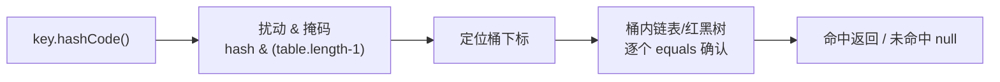

本篇是容器深入研究笔记(二),覆盖第 17 章小节 8–12:理解 Map、散列与散列码、实现选型、Collections 实用方法、持有引用。小节编号接上篇。

## 8. 理解 Map(Understanding maps)

| 实现类         | 结构          | 键的顺序             | 备注                       |
| -------------- | ------------- | -------------------- | -------------------------- |
| HashMap        | 哈希表        | 无序                 | 通用首选,允许 null 键值   |
| LinkedHashMap  | 哈希表 + 链表 | 插入顺序(或访问顺序) | 稍慢;支持 LRU 语义        |
| TreeMap        | 红黑树        | 比较顺序             | 支持 SortedMap 范围操作    |
| WeakHashMap    | 哈希表        | 无序                 | 键是弱引用,见第 12 节     |
| ConcurrentHashMap | 分段哈希表 | 无序                 | 线程安全(java.util.concurrent)|
| Hashtable      | 哈希表        | 无序                 | Java 1.0 遗产,已不推荐    |

### 性能(Performance)

- **HashMap**:哈希表,`get/put` 均摊 O(1)。哈希函数质量决定分布,分布差则退化为 O(n);
- **TreeMap**:红黑树,O(log n),换来"按键排序"与范围查询;
- **LinkedHashMap**:在 HashMap 基础上用双向链表维护顺序,迭代快、稍增开销。

### SortedMap

TreeSet 的 Map 对应物:键有序,支持 `firstKey()/lastKey()/headMap/to)/tailMap(from)/subMap(from, to)` 范围视图。

### LinkedHashMap

构造器第三参 `accessOrder=true` 时按**访问顺序**排列——刚访问的键移到末尾,天然适合 **LRU(Least Recently Used,最近最少使用)缓存**:重写 `removeEldestEntry()` 即可"满了自动淘汰最老条目":

```java
class LRUCache<K, V> extends LinkedHashMap<K, V> {
    private final int capacity;

    LRUCache(int capacity) {
        super(16, 0.75f, true);   // accessOrder = true
        this.capacity = capacity;
    }

    @Override
    protected boolean removeEldestEntry(Map.Entry<K, V> eldest) {
        return size() > capacity;   // 超容量即淘汰最久未访问条目
    }
}
```

## 9. 散列与散列码(Hashing and hash codes)

自定义类做 HashMap 的键(或入 HashSet)却"查不到、判不重",根源几乎都在 equals/hashCode。

### 理解 hashCode

**同一对象必须始终返回同一散列码**(在同一个运行中);**equals 相等的两个对象必须有相同的散列码**——这是约定,更是硬性要求:哈希表靠 hashCode 定位桶、靠 equals 在桶内确认。违反第二条,相等的对象会散落到不同桶,查找失效。

```java
// 反例:只重写 equals 不重写 hashCode
Map<BadKey, String> map = new HashMap<>();
BadKey k1 = new BadKey("a");
map.put(k1, "v");
map.get(new BadKey("a"));   // null!两个"相等"的键散列到了不同的桶
```

### 散列如何提速(Hashing for speed)

哈希表 = 数组 + "把键映射到数组下标"的散列函数。查询不再逐个比较,而是:hashCode → 定位桶(bucket)→ 桶内少量元素 equals 精确比对:



- 桶的数量通常是 2 的幂,取模用位运算完成;
- 桶内元素多时,Java 8 起链表过长(阈值 8)会**树化**为红黑树,防止哈希碰撞攻击退化到 O(n);
- 散列函数要**快**且**均匀分布**——String 的 hashCode 系数 31 正是速度与分布的折中。

### 覆盖 hashCode(Overriding hashCode)

经典配方(Effective Objects 风格):初值取质数 17,对每个参与 equals 的字段,`result = 37 * result + 字段哈希`,字段哈希按类型选取:

```java
public class CountedString {
    private String s;
    private int id;

    @Override
    public int hashCode() {
        int result = 17;
        result = 37 * result + s.hashCode();   // String 用自身 hashCode
        result = 37 * result + id;             // 基本类型直接用值
        return result;
    }

    @Override
    public boolean equals(Object o) {
        return o instanceof CountedString
                && s.equals(((CountedString) o).s)
                && id == ((CountedString) o).id;
    }
}
```

常见类型的哈希来源:

| 字段类型   | 哈希用                            |
| ---------- | --------------------------------- |
| 基本类型   | (int)值 / Double.hashCode(d) 等  |
| 对象       | 其 hashCode()(可能为 null 时取 0)|
| 数组       | Arrays.hashCode(...) / deep 版    |

> `Objects.hash(field1, field2)` 一行完成上述配方;Lombok 的 @EqualsAndHashCode、IDE 生成代码同源。原则不变:**hashCode 与 equals 必须基于同一组字段**。

## 10. 选择实现(Choosing an implementation)

### 性能测试框架与微基准的危险

比较容器实现需要计时框架,但**微基准测试(microbenchmark)充满陷阱**:JIT 预热、死代码消除、GC 时机都会污染结果。JMH(Java Microbenchmark Harness)是 Java 8 后做微基准的正道;原书自写的简陋计时只能看相对趋势。

### 在 List 之间选择

- **随机访问**:ArrayList 完胜(O(1) vs 链表 O(n));
- **尾部插入**:ArrayList 均摊 O(1)(偶尔扩容复制),通常仍快于 LinkedList;
- **中间插入/删除**:LinkedList 改指针 O(1),但"走到那个位置"要 O(n);ArrayList 挪动元素 O(n) 但内存连续、缓存友好——现代硬件上 ArrayList 常常整体更快;
- **栈/队列语义**:用 ArrayDeque。

结论:**默认 ArrayList**,有明确证据才换 LinkedList。

### 在 Set / Map 之间选择

按需求倒推:

1. 只要去重/成员判断 → HashSet;
2. 需要维持插入顺序 → LinkedHashSet / LinkedHashMap;
3. 需要排序或范围查询 → TreeSet / TreeMap;
4. 并发场景 → ConcurrentHashMap / ConcurrentSkipListMap。

### HashMap 的性能因子(HashMap performance factors)

- **容量(capacity)**:桶数量,默认 16;
- **负载因子(load factor)**:默认 0.75——元素数超过 容量×0.75 就**再散列(rehash)**:建更大的表、全部重排。空间与时间的折中:调高省内存但冲突变多,调低反之;
- 预知数据量时,`new HashMap<>(expected / 0.75f + 1)` 一次到位,避免反复扩容。

## 11. 实用方法(Utilities)

`java.util.Collections` 的静态工具(与 Arrays 对数组的作用对称)。

### List 的排序与查找

```java
List<String> list = new ArrayList<>();
Collections.addAll(list, "one two three four five six seven".split(" "));
Collections.sort(list);                          // 自然顺序
int idx = Collections.binarySearch(list, "four");// 二分查找(须先排序)
Collections.shuffle(list, new Random(47));       // 随机打乱
Collections.reverse(list);                       // 反转

Collections.sort(list, String.CASE_INSENSITIVE_ORDER);          // 定制比较器
Collections.sort(list, Collections.reverseOrder());             // 反向自然序
Collections.sort(list, Collections.reverseOrder(String.CASE_INSENSITIVE_ORDER));
```

### 不可修改的容器(Making a Collection or Map unmodifiable)

`Collections.unmodifiableXxx()` 返回**只读视图**,改它抛 UnsupportedOperationException:

```java
static List<String> dataList = List.of("a", "b", "c");   // Java 9+:真正的不可变
static List<String> view =
        Collections.unmodifiableList(new ArrayList<>(dataList)); // 包装既有可变容器
```

注意:unmodifiable 是**视图**——原容器变化会反映到视图;List.of 是**拷贝式不可变**。现代代码优先 `List.of/Set.of/Map.of`。

### 同步的容器(Synchronizing a Collection or Map)

`Collections.synchronizedXxx()` 给容器的方法套上同步锁:

```java
List<String> synced = Collections.synchronizedList(new ArrayList<>());
Map<String, String> syncedMap = Collections.synchronizedMap(new HashMap<>());
```

局限:每个方法各自同步,**复合操作(先查后改、迭代)仍需外部手动 synchronized**,迭代期间别的线程修改仍会 ConcurrentModificationException。并发需求应直接用 java.util.concurrent 的容器(ConcurrentHashMap、CopyOnWriteArrayList)。

## 12. 持有引用(Holding references)

`java.lang.ref` 包提供三级引用,强度递减:

| 引用类型                     | 回收时机                     | 典型用途                       |
| ---------------------------- | ---------------------------- | ------------------------------ |
| 强引用(普通引用)           | 永不(GC 可达即存活)        | 默认                           |
| 软引用 SoftReference         | 内存不足时才回收             | 内存敏感缓存                   |
| 弱引用 WeakReference         | 下次 GC 必回收(无强引用时) | 规范映射(WeakHashMap)        |
| 虚引用 PhantomReference      | 随时,只收通知               | 堆外内存清理(配合 ReferenceQueue) |

设计意图:**允许对象"被引用着"但仍然被回收**——缓存不想"因为缓存存在就阻止回收"。

### WeakHashMap

键是**弱引用**的 Map:某个键只剩 WeakHashMap 自己引用时,下次 GC 该条目自动消失:

```java
WeakHashMap<Element, Value> map = new WeakHashMap<>();
Element key = new Element();
map.put(key, new Value());
key = null;        // 丢弃强引用
System.gc();       // 之后条目可能已被清除
```

典型用途:临时对象的**元数据映射**(如对象的缓存属性),对象本身该死就死,映射跟着消失。

### Java 1.0/1.1 的容器

Vector、Stack、Hashtable 是 Java 1.0 的容器,全部方法同步、接口与新库不统一。新代码一律用 ArrayList/Deque(替代 Stack)/HashMap;仅在维护老代码时认识它们即可。
