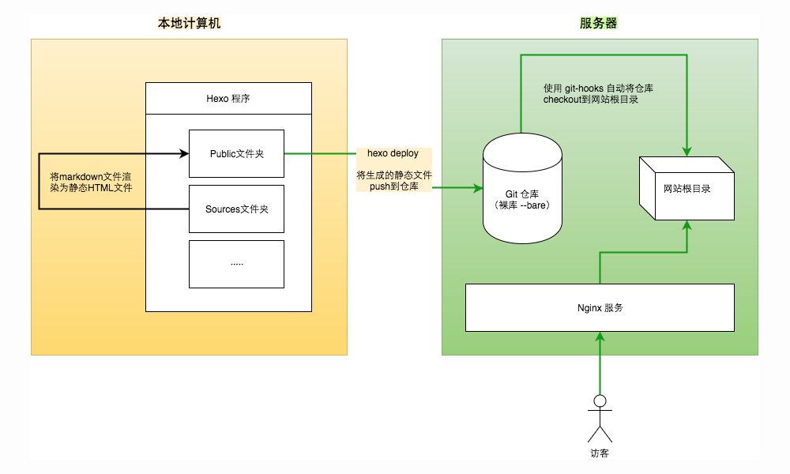

# Hexo 搭建博客



> 基于 Hexo 7.x 整理（基于模型知识更新，未逐条核对官方文档，细节以 [hexo.io/zh-cn/docs](https://hexo.io/zh-cn/docs/) 为准）。

## 本地安装

前置要求：Node.js 20 LTS 及以上（Hexo 7 不再支持旧版 Node），Git。

1. 安装 hexo-cli：

```bash
# 安装
npm install -g hexo-cli
# 升级
npm update hexo-cli -g
```

2. 初始化博客并安装依赖：

```bash
hexo init blog
cd blog
npm install
```

3. 生成并本地预览：

```bash
# hexo generate 生成静态文件
hexo g
# hexo server 启动服务预览
hexo s
```

4. 打开浏览器访问 `http://localhost:4000` 查看效果。

5. 常用维护命令：

```bash
# 新建文章
hexo new "文章标题"
# 清除缓存与静态文件，改了配置或主题后建议先执行
hexo clean
```

## 部署到 GitHub Pages

hexo-deployer-git 仍是官方文档推荐的部署方式：

1. 在 Hexo 项目中安装 hexo-deployer-git：

```bash
npm install hexo-deployer-git --save
```

2. 编辑 `_config.yml`，末尾的 deploy 配置（GitHub 已不支持密码推送，repo 用 SSH 地址或 Personal Access Token）：

```yaml
deploy:
  type: git
  repo: git@github.com:<用户名>/<用户名>.github.io.git
  branch: main
```

3. 一键生成并部署：

```bash
hexo g -d
```

> 用户名仓库 `<用户名>.github.io` 部署到 `main` 分支即可；项目仓库需在仓库 Settings → Pages 中把 Source 设为部署分支（如 `gh-pages`）。使用自定义域名时，把 `CNAME` 文件放在 `source/` 目录下，避免部署时被覆盖。

## 部署到自己的服务器（Git Hook + Nginx）

以 Ubuntu/Debian 为例（CentOS 把 `apt` 换成 `yum` 即可）。

### 服务器端配置

1. 安装 git 并创建 `git` 用户运行 git 服务：

```bash
sudo apt install git
sudo adduser git
```

2. 配置证书登录：收集所有需要登录的用户的公钥（各自的 `id_rsa.pub`），逐行导入 `/home/git/.ssh/authorized_keys`。

3. 创建裸仓库（假定路径 `/home/git/blog.git`）：

```bash
sudo git init --bare /home/git/blog.git
# 注意 blog.git 的属主必须是 git 用户
sudo chown -R git:git /home/git/blog.git
```

### 配置 Nginx

1. 查看配置文件位置：

```bash
nginx -t
```

2. 配置文件在 `/etc/nginx/nginx.conf`，在 `http` 一项中添加虚拟主机（静态站根目录指向钩子检出的目录）：

```nginx
http {
    ...
    server {
        listen 80;
        root   /home/git;
        index  index.html index.htm;
        server_name  localhost;

        location / {
        }
    }
    ...
}
```

3. 常用排查命令：

```bash
# 端口占用
netstat -tulpn
# nginx 进程与运行用户
ps -aux | grep nginx
# 保证 nginx 对静态目录有读权限
chmod -R 755 /home/git
```

4. 重启 Nginx：

```bash
sudo systemctl reload nginx
# 或强制停止
sudo /usr/local/nginx/sbin/nginx -s quit
```

### 自动发布（Git Hook）

通过 hooks 完成网站更新，git hook 的[使用参考](https://aotu.io/notes/2017/04/10/githooks/index.html)。

1. 进入 `/home/git/blog.git/hooks`，复制模板并编辑：

```bash
cp post-update.sample post-update
```

2. 在 `post-update` 中 `exec git update-server-info` 之前添加一行，把生成结果检出到 Nginx 根目录：

```bash
git --work-tree=/home/git --git-dir=/home/git/blog.git checkout -f
```

3. 修改权限为可执行：

```bash
chmod +x post-update
```

4. 本地 Hexo 项目的 `_config.yml` 指向自己的服务器：

```yaml
deploy:
  type: git
  repo: git@<服务器地址>:/home/git/blog.git
  branch: master
```

之后每次执行 `hexo g -d`，推送即自动上线。
