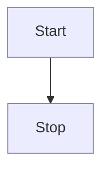
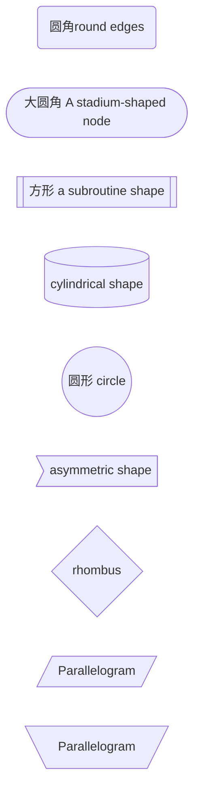
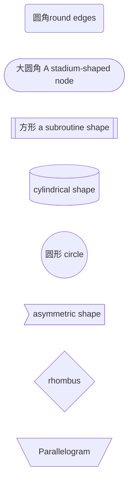
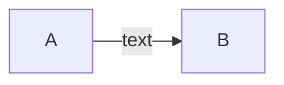
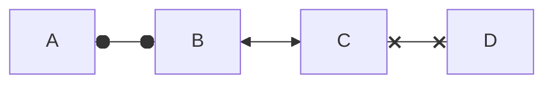
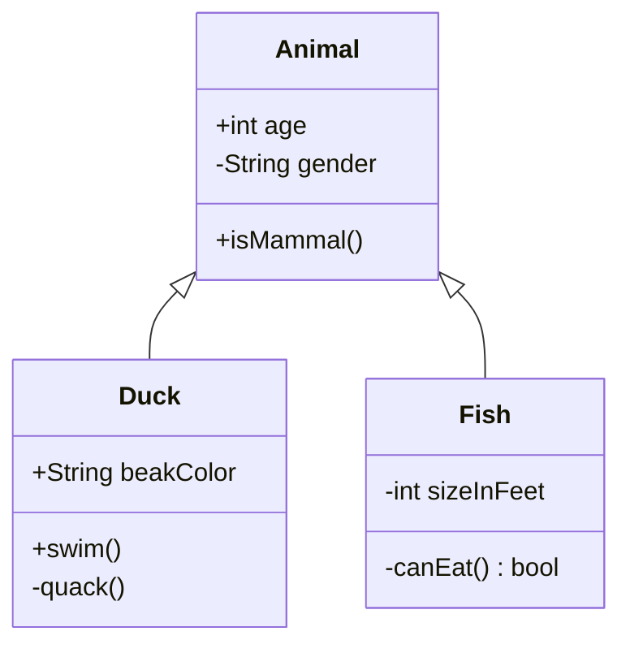
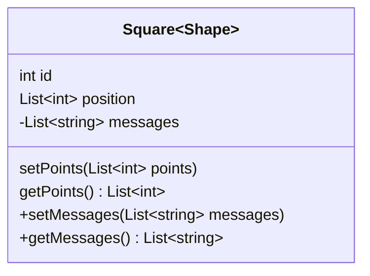
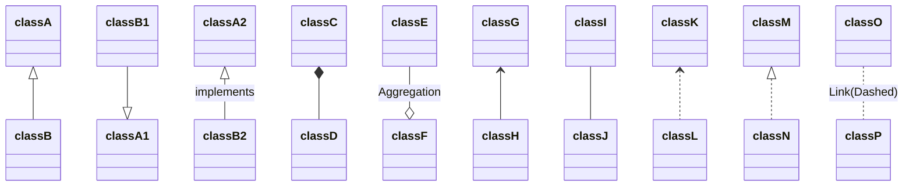
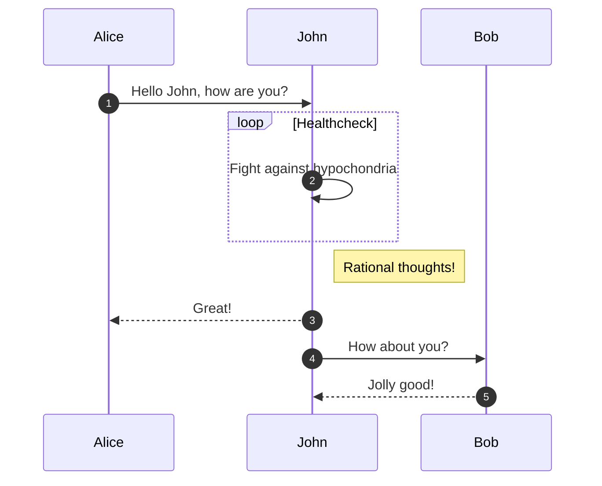

### 基本语法

```shell
# 称行符
<br>
```

```markdown

# 标题
** **  加粗
* * 斜体
~ ~ 删除线
> 引用，多级引用 >>>
--- 或者 ****  分割线
 图片alt就是显示在图片下面的文字，相当于对图片内容的解释。图片title是图片的标题，当鼠标移到图片上时显示的内容。title可加可不加
[超链接名](超链接地址 "超链接title")
- 或 * 或 +  无序列表
1. 2. 有序列表

```

```markdown
|表头|表头|表头|
|---|:--:|---:|
|内容|内容居中|内容|

`单行代码`
```


###  mermaid语法

#### 流程图Flowchart

##### 方向控制

- TB - top to bottom
- TD - top-down/ same as top to bottom
- BT - bottom to top
- RL - right to left
- LR - left to right





```
graph TD
    Start --> Stop
```


```
graph LR
    Start --> Stop
```


##### 形状






##### 样式


```
graph LR
    id1(Start)-->id2(Stop)
    style id1 fill:#f9f,stroke:#333,stroke-width:4px
    style id2 fill:#bbf,stroke:#f66,stroke-width:2px,color:#fff,stroke-dasharray: 5 5
```


##### 连线

| Length            | 1      | 2       | 3        |
| ----------------- | ------ | ------- | -------- |
| Normal            | `---`  | `----`  | `-----`  |
| Normal with arrow | `-->`  | `--->`  | `---->`  |
| Thick             | `===`  | `====`  | `=====`  |
| Thick with arrow  | `==>`  | `===>`  | `====>`  |
| Dotted            | `-.-`  | `-..-`  | `-...-`  |
| Dotted with arrow | `-.->` | `-..->` | `-...->` |



```
graph LR
    A-->|text|B
```




```
flowchart LR
    A o--o B
    B <--> C
    C x--x D
```


####  类图classDiagram

- 类、方法、返回值定义

 `+` Public
 `-` Private
 `#` Protected
 `~` Package/Internal

 `*` Abstract e.g.: `someAbstractMethod()*`
 `$` Static e.g.: `someStaticMethod()$`

显示


代码
```tex
classDiagram
      Animal <|-- Duck
      Animal <|-- Fish
      Animal : +int age
      Animal : -String gender
      Animal: +isMammal()
    
      class Duck{
          +String beakColor
          +swim()
          -quack() 
      }
      class Fish{
          -int sizeInFeet
          -canEat() bool
      }
     
```
- 泛型



```
classDiagram
class Square~Shape~{
    int id
    List~int~ position
    setPoints(List~int~ points)
    getPoints() List~int~
}

Square : -List~string~ messages
Square : +setMessages(List~string~ messages)
Square : +getMessages() List~string~
```


- 关系图

| Type  | Description   |
| ----- | ------------- |
| <\|-- | Inheritance   |
| *--   | Composition   |
| o--   | Aggregation   |
| -->   | Association   |
| --    | Link (Solid)  |
| ..>   | Dependency    |
| ..\|> | Realization   |
| ..    | Link (Dashed) |



```
classDiagram
classA <|-- classB
classB1 --|> classA1
classA2 <|-- classB2 : implements
classC *-- classD
classE --o classF : Aggregation
classG <-- classH
classI -- classJ
classK <.. classL
classM <|.. classN
classO .. classP : Link(Dashed)
```

#### sequenceDiagram




### katex语法

| 最终效果 |语法|
| ---------------------------------------- | ------------------------------------------------------ |
| $\overline{AB}$                                      | \overline{AB}        |
| $$\begin{pmatrix}   a & b \\   c & d \end{pmatrix}$$ | ` \begin{pmatrix}   a & b \\   c & d \end{pmatrix}  `|
| $x_n$ | x_n |
| $a \atop b$ | a \atop b |
| $e^x$ | e^x |
| $$\def\foo{x^2} \foo + \foo$$ | \def\foo{x^2} \foo + \foo |
| $\lor  \land$ | \lor  \land |
| $\begin{bmatrix}   a & b \\ c & d \end{bmatrix}$ | \begin{bmatrix}   a & b \\ c & d \end{bmatrix} |
| $\to $    $\rightarrow$ | \to    \rightarrow |
| $\gets $   $\leftarrow$ | \gets  \leftarrow |
| $\leftrightarrow$  ↔                                         | \leftrightarrow  ↔                                           |
| $ \ni$ | \ni |
| $\notin$ | \notin |
| $\in $                                                       | \in                                                          |
| $\exists$ | \exists |
| $\nexists $ | \nexists |
| $\forall$                                                    | \forall                                                      |
| $\mid$ | \mid |
| $\div  \times$ | \div    \times  × |
| $\implies  \Rightarrow$ | \implies    \Rightarrow |
| $\impliedby   \Leftarrow$ | \impliedby   \Leftarrow |
| $\iff$  $ \eqcirc$    $ \Leftrightarrow  \Harr  \Lrarr  \lrArr$ | \iff           \eqcirc    \Leftrightarrow     \Harr  \Lrarr   \lrArr |
| $\neg$ | \neg |
| $\subset$ | \subset |
| $\supset$ | \supset |
| $\sum$  $\displaystyle\sum_{i=1}^n$  $\textstyle\sum_{i=1}^n$ | \sum    `\displaystyle\sum_{i=1}^n`   `\textstyle\sum_{i=1}^n` |
| $\frac{a}{b}$ | \frac{a}{b} |
| $\int$ | \int |
| $\sqrt{x}$ | \sqrt{x} |
| $\sqrt[3]{x}$ | \sqrt[3]{x} |
| $\not =$  ≠ | \not =  ≠ |
| $x=\frac{-b\pm\sqrt{b^2-4ac}}{2a}$ | x=\frac{-b\pm\sqrt{b^2-4ac}}{2a} |
| $\oplus$  $ \ominus$ | \oplus     \ominus |
| $\binom{n}{k}$   $\dbinom{n}{k}  {n\brace k}$ | \binom{n}{k}   \dbinom{n}{k}   {n \brace k} |
| $\uparrow$   $\downarrow$  $\updownarrow$ | \uparrow   \downarrow   \updownarrow |
| $a'$ | a' |
| $\ge  \geq \geqslant $ | \ge   \geq    \geqslant |
| $\le \leq   \leqslant$ | \le    \leq    \leqslant   ≤ |
| $\frac{a}{b}$   ${a \over b} $ | \frac{a}{b}    {a \over b} |
| $\displaystyle\sum_{i=1}^n$ $\textstyle\sum_{i=1}^n$ | \displaystyle\sum_{i=1}^n    \textstyle\sum_{i=1}^n |
| $\underline{A}$ | \underline{A} |
| $\subseteq  \sube$ $\nsubseteq $ | \subseteq    \sube  \nsubseteq |
| $ \supseteq  \supe   \nsupseteq$ | \supseteq            \supe    \nsupseteq |
| $\subset \supset$ | \subset    \supset |
| $ \emptyset  \empty \varnothing$ | \emptyset   \empty  \varnothing |
| $\bigcap  \cap$ | \bigcap   \cap |
| $\bigcup \cup$ | \bigcup   \bigcup |
| $ n \atop {\bigcap  \atop{i=1}} $ | n \atop { \bigcap  \atop{i=1}} |
| $\thicksim$   $\oplus  \bigoplus$ | \thicksim   \oplus   \bigoplus |
| $\circ  \restriction$ | \circ   \restriction |
| π | π |
| $\cdot \cdot \cdot$ | \cdot |
| $\infty  \infin$ | \infty \infin |
| $\pm  \plusmn$ | \pm  \plusmn |


```
$x=\frac{-b\pm\sqrt{b^2-4ac}}{2a}$
```


