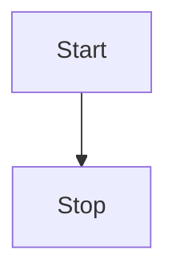
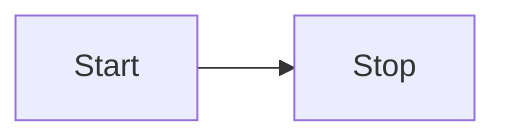
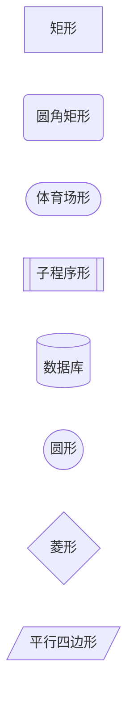
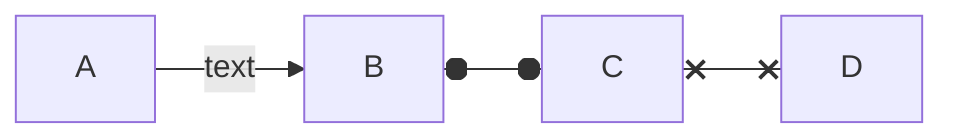
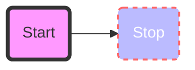
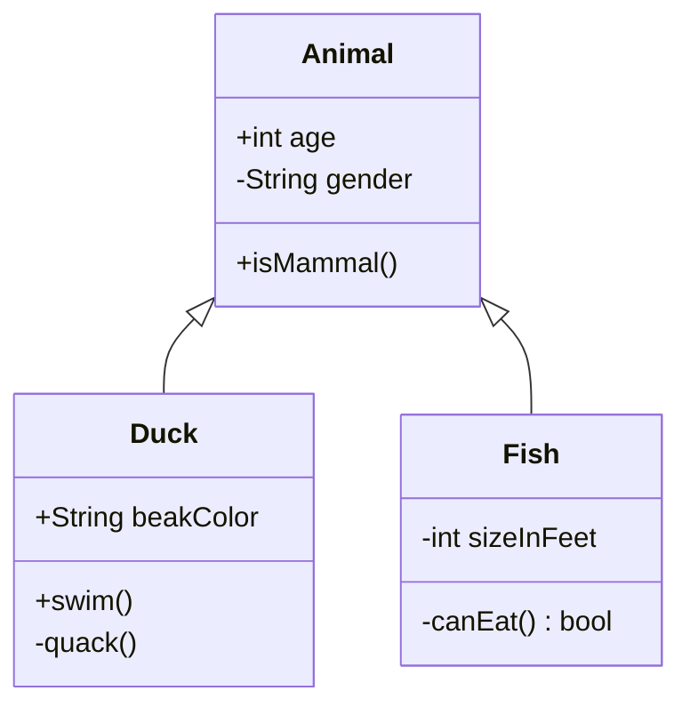
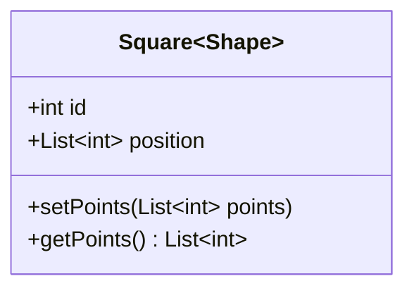
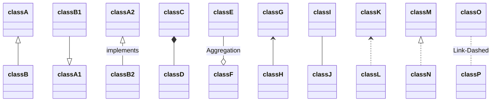
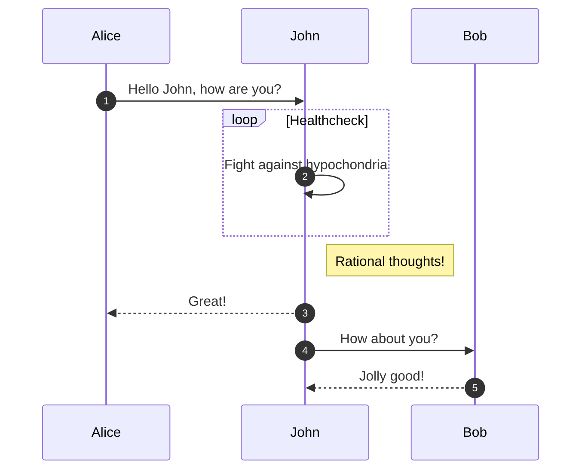

# Markdown 与扩展语法

## 基本语法

```markdown
# 标题
**加粗**
*斜体*
~~删除线~~
> 引用，多级引用 >>>
--- 或者 ***  分割线

[超链接名](超链接地址 "超链接title")
- 或 * 或 +  无序列表
1. 2.  有序列表
```

表格与行内代码：

```markdown
|表头|表头|表头|
|---|:--:|---:|
|内容|内容居中|内容右对齐|

`单行代码`
```

HTML 标签（如换行）也可以直接使用：

```html
<br>
```

## mermaid 语法

### 流程图 flowchart

#### 方向控制

| 关键字 | 含义 |
| --- | --- |
| `TB` / `TD` | 自上而下 |
| `BT` | 自下而上 |
| `RL` | 从右到左 |
| `LR` | 从左到右 |


```mermaid
graph TD
    Start --> Stop
```


```mermaid
graph LR
    Start --> Stop
```

#### 节点形状

| 语法 | 形状 |
| --- | --- |
| `id[文本]` | 矩形 |
| `id(文本)` | 圆角矩形 |
| `id([文本])` | 体育场形，两端半圆 |
| `id[[文本]]` | 子程序形，双边框矩形 |
| `id[(文本)]` | 圆柱形，常用于数据库 |
| `id((文本))` | 圆形 |
| `id>文本]` | 不对称形 |
| `id{文本}` | 菱形，用于判断 |
| `id[/文本/]` | 平行四边形，输入输出 |
| `id[\文本\]` | 反向平行四边形 |


```mermaid
graph LR
    id1[矩形]
    id2(圆角矩形)
    id3([体育场形])
    id4[[子程序形]]
    id5[(数据库)]
    id6((圆形))
    id7{菱形}
    id8[/平行四边形/]
```

#### 连线

| 长度 | 1 | 2 | 3 |
| --- | --- | --- | --- |
| 普通 | `---` | `----` | `-----` |
| 普通带箭头 | `-->` | `--->` | `---->` |
| 粗线 | `===` | `====` | `=====` |
| 粗线带箭头 | `==>` | `===>` | `====>` |
| 虚线 | `-.-` | `-..-` | `-...-` |
| 虚线带箭头 | `-.->` | `-..->` | `-...->` |

连线上加文字用 `-->|text|`；`o--o` 两端圆点、`x--x` 两端叉号、`<-->` 双向：


```mermaid
flowchart LR
    A -->|text| B
    B o--o C
    C x--x D
```

#### 样式

`style` 指定节点填充色、描边、文字颜色等：


```mermaid
graph LR
    id1(Start) --> id2(Stop)
    style id1 fill:#f9f,stroke:#333,stroke-width:4px
    style id2 fill:#bbf,stroke:#f66,stroke-width:2px,color:#fff,stroke-dasharray: 5 5
```

### 类图 classDiagram

成员可见性：

| 符号 | 可见性 |
| --- | --- |
| `+` | Public |
| `-` | Private |
| `#` | Protected |
| `~` | Package / Internal |
| `*` | Abstract，如 `someAbstractMethod()*` |
| `$` | Static，如 `someStaticMethod()$` |

类与成员定义：


```mermaid
classDiagram
    Animal <|-- Duck
    Animal <|-- Fish
    Animal : +int age
    Animal : -String gender
    Animal : +isMammal()

    class Duck {
        +String beakColor
        +swim()
        -quack()
    }
    class Fish {
        -int sizeInFeet
        -canEat() bool
    }
```

泛型用 `~` 包裹类型参数（不能直接写尖括号，会与标签语法冲突）：


```mermaid
classDiagram
    class Square~Shape~ {
        +int id
        +List~int~ position
        +setPoints(List~int~ points)
        +getPoints() List~int~
    }
```

类之间的关系：

| Type | Description |
| ----- | ------------- |
| <\|-- | Inheritance（继承） |
| *-- | Composition（组合） |
| o-- | Aggregation（聚合） |
| --> | Association（关联） |
| -- | Link (Solid)（实线） |
| ..> | Dependency（依赖） |
| ..\|> | Realization（实现） |
| .. | Link (Dashed)（虚线） |


```mermaid
classDiagram
    classA <|-- classB
    classB1 --|> classA1
    classA2 <|-- classB2 : implements
    classC *-- classD
    classE --o classF : Aggregation
    classG <-- classH
    classI -- classJ
    classK <.. classL
    classM <|.. classN
    classO .. classP : Link-Dashed
```

### 时序图 sequenceDiagram

`autonumber` 自动编号，`->>` 实线箭头，`-->>` 虚线箭头，`loop ... end` 循环块，`Note right of` 加备注：


```mermaid
sequenceDiagram
    autonumber
    Alice->>John: Hello John, how are you?
    loop Healthcheck
        John->>John: Fight against hypochondria
    end
    Note right of John: Rational thoughts!
    John-->>Alice: Great!
    John->>Bob: How about you?
    Bob-->>John: Jolly good!
```

## KaTeX 数学公式

行内公式用 `$...$`，独立公式用 `$$...$$`。

### 分式、根式与上下标

| 效果 | 语法 |
| --- | --- |
| $x_n$ | `x_n` |
| $e^x$ | `e^x` |
| $\frac{a}{b}$ | `\frac{a}{b}` 或 `{a \over b}` |
| $\sqrt{x}$ | `\sqrt{x}` |
| $\sqrt[3]{x}$ | `\sqrt[3]{x}` |
| $a \atop b$ | `a \atop b` |
| $\binom{n}{k}$ | `\binom{n}{k}`、`\dbinom{n}{k}`、`{n \brace k}` |
| $x=\frac{-b\pm\sqrt{b^2-4ac}}{2a}$ | `x=\frac{-b\pm\sqrt{b^2-4ac}}{2a}` |

### 求和、积分与运算符

| 效果 | 语法 |
| --- | --- |
| $\sum$ | `\sum` |
| $\displaystyle\sum_{i=1}^n$ | `\displaystyle\sum_{i=1}^n` |
| $\textstyle\sum_{i=1}^n$ | `\textstyle\sum_{i=1}^n` |
| $\int$ | `\int` |
| $\pm$ | `\pm` 或 `\plusmn` |
| $\times$ | `\times` |
| $\div$ | `\div` |
| $\cdot$ | `\cdot` |
| $\infty$ | `\infty` 或 `\infin` |
| $\oplus$ $\ominus$ | `\oplus`、`\ominus` |
| $\bigoplus$ | `\bigoplus` |
| $\circ$ | `\circ` |
| $\thicksim$ | `\thicksim` |

### 集合与逻辑

| 效果 | 语法 |
| --- | --- |
| $\in$ | `\in` |
| $\notin$ | `\notin` |
| $\ni$ | `\ni` |
| $\subset$ | `\subset` |
| $\subseteq$ | `\subseteq`，`\nsubseteq` 取反 |
| $\supset$ | `\supset` |
| $\supseteq$ | `\supseteq`，`\nsupseteq` 取反 |
| $\emptyset$ | `\emptyset` 或 `\varnothing` |
| $\cap$ | `\cap`、`\bigcap` |
| $\cup$ | `\cup`、`\bigcup` |
| $\land$ | `\land` |
| $\lor$ | `\lor` |
| $\neg$ | `\neg` |
| $\forall$ | `\forall` |
| $\exists$ | `\exists`，`\nexists` 取反 |
| $\mid$ | `\mid` |

### 比较与推理

| 效果 | 语法 |
| --- | --- |
| $\le$ | `\le`、`\leq`、`\leqslant` |
| $\ge$ | `\ge`、`\geq`、`\geqslant` |
| $\ne$ | `\not =` |
| $\implies$ | `\implies`、`\Rightarrow` |
| $\impliedby$ | `\impliedby`、`\Leftarrow` |
| $\iff$ | `\iff`、`\Leftrightarrow` |

### 箭头

| 效果 | 语法 |
| --- | --- |
| $\to$ | `\to`、`\rightarrow` |
| $\gets$ | `\gets`、`\leftarrow` |
| $\leftrightarrow$ | `\leftrightarrow` |
| $\uparrow$ | `\uparrow` |
| $\downarrow$ | `\downarrow` |
| $\updownarrow$ | `\updownarrow` |

### 上划线、矩阵与宏定义

| 效果 | 语法 |
| --- | --- |
| $\overline{AB}$ | `\overline{AB}` |
| $\underline{A}$ | `\underline{A}` |
| $a'$ | `a'` |
| $\begin{pmatrix} a & b \\ c & d \end{pmatrix}$ | `\begin{pmatrix} a & b \\ c & d \end{pmatrix}` |
| $\begin{bmatrix} a & b \\ c & d \end{bmatrix}$ | `\begin{bmatrix} a & b \\ c & d \end{bmatrix}` |
| $\def\foo{x^2} \foo + \foo$ | `\def\foo{x^2} \foo + \foo` |
