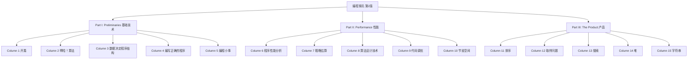

## 0.1 关于本书

《编程珠玑》（Programming Pearls, 2nd Edition, 2000）出自 Bell 实验室的 Jon Bentley，源自他在《美国计算机学会通讯》（Communications of the ACM, CACM）上连载的同名专栏，第一版 1986 年结集出版，第二版大幅修订并新增 3 个专栏。中文版由机械工业出版社出版。

书名的隐喻值得先记住：

> Just as natural pearls grow from grains of sand that have irritated oysters, these programming pearls have grown from real problems that have irritated real programmers.
>
> 正如天然珍珠孕育自硌痛牡蛎的沙粒，这些编程珠玑也生长自那些困扰过真实程序员的真实问题。

定位：Brooks 的《人月神话》（The Mythical Man Month）讲管理大图景，McConnell 的《代码大全》（Code Complete）讲工程化的编程风格，而本书讲的是这个职业里"更有灵光的一面"——**洞察力与创造力如何把一个真实问题变成一个又短又快的程序**。阅读门槛很低：只需要高级语言编程经验，偶尔出现的 C++ 模板等高级特性跳过不影响理解。

本系列笔记对照英文原书（第二版 epub）整理，小节编号与原书一致；习题解答精选自原书 Solutions。

## 0.2 全书结构

15 个专栏（Column）分三部分：

- **Part I（1~5）**：编程基本功——问题定义、算法、数据结构、程序验证与测试
- **Part II（6~10）**：围绕"效率"展开，效率本身有时很重要，而且总是引出有趣编程问题的好跳板
- **Part III（11~15）**：把前面的技术应用到排序、搜索、字符串等实质性问题上

第二版相对第一版的主要变化：旧 Column 4 中二分查找实现的部分独立成了新 Column 5（测试、调试与计时）；旧 Column 11 拆成 Column 12（原问题）与 Column 13（集合表示）；讲 64KB 地址空间拼写检查器的旧 Column 13 被删（精华保留在 13.8 节）；新增 Column 15（字符串）。全书篇幅增加约 25%。

## 0.3 各篇一句话

| 篇 | 标题 | 一句话 |
| --- | --- | --- |
| 1 | 开篇 | 一次"怎么排序磁盘文件"的提问，被追问成位图排序：几行代码、10 秒完成千万级整数排序 |
| 2 | 啊哈！算法 | 缺失整数、向量旋转、变位词三题——二分查找、基本操作与签名的"啊哈"时刻 |
| 3 | 数据决定程序结构 | 用正确的数据结构（数组、表、位向量……）重写程序，代码量骤减 |
| 4 | 编写正确的程序 | 以二分查找为例，用循环不变量与断言写出并验证正确的程序 |
| 5 | 编程小事 | 从伪代码到 C：脚手架、断言艺术、自动化测试与计时 |
| 6 | 程序性能分析 | 性能来自问题定义、数据结构、算法、代码调优与系统软件多个层级 |
| 7 | 粗略估算 | 信封背面算一算：72 法则、安全系数、Little 定律 |
| 8 | 算法设计技术 | 最大子向量问题的四个算法，从 $O(n^3)$ 优化到 $O(n)$ |
| 9 | 代码调优 | 不动大架构，靠整数运算、缓存、哨兵等手段把代码提速数倍 |
| 10 | 节省空间 | 简单性是空间的关键：数据空间与代码空间的压缩技术 |
| 11 | 排序 | 从插入排序手写到简单快速排序，再到更优的快速排序 |
| 12 | 取样问题 | 从一个随机取样问题出发，考察一整片解空间 |
| 13 | 搜索 | 集合的表示与查找：有序数组、二分搜索树、位向量与哈希 |
| 14 | 堆 | siftup/siftdown 两个关键函数撑起优先队列与堆排序 |
| 15 | 字符串 | 单词、短语与 Markov 链文本生成，全书技巧的综合应用 |

## 0.4 阅读路线

- **不要读太快**。原书前言的原话是"don't go too fast"——一次读一篇，认真读；先自己撞一撞每篇中途抛出的问题（有些看起来容易，撞一两个小时才知道深浅），再做篇末习题。原书的说法：**从本书学到的大部分东西，都会从你写下解答的铅笔尖里冒出来**。
- 习题先和朋友讨论，实在不行再看书末的提示（Hints）与解答（Solutions）。
- 每篇末尾的 Further Reading 是作者私人书单里精选的好书，不是学术参考文献列表，值得顺藤摸瓜。
- 三部分有逻辑分组但每篇可独立阅读；时间有限时，Column 1、8、13、14 是最常被引用的精华。

## 0.5 代码与记号约定

- 原书代码在 [www.programmingpearls.com](http://www.programmingpearls.com) 提供，含测试、调试与计时的脚手架（scaffolding）。
- 书中程序采用**刻意精简的风格**：短变量名、少空行、几乎不做错误检查。这在大工程里不合适，但便于传达算法的关键思想。
- 大部分函数用**伪代码**表达，记号约定：
  - `for i = [0, n)` 表示 i 从 0 迭代到 n−1；**圆括号表示开区间（不含端点），方括号表示闭区间（含端点）**
  - `function(i, j)` 仍是函数调用，`array[i]` 仍是数组访问
- 原书性能测量环境为 400MHz Pentium II、128MB 内存、Windows NT 4.0、编译器最高优化级别。**绝对耗时在今天已无参考意义，但耗时的比值（快多少倍）依然成立**——这也是本书强调的读法。
