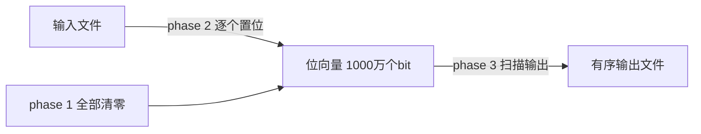

## 1.1 一次友好的对话

故事从一个程序员的问题开始："**How do I sort a disk file?（我如何对一个磁盘文件排序？）**"——作者的第一个错误就是直接回答了这个问题：他给了对方一份磁盘 Merge Sort 的实现思路，又推荐了一个流行编程书里约两百行代码的磁盘排序程序，估计实现加测试要一周。

好在对方的迟疑把作者拉回了正轨。接下来约十五分钟的对话才是本篇的真正内容（作者的问题以斜体标出）：

- *为什么一定要自己写排序？为什么不用系统自带的排序？*
  系统排序用在这个大系统中间有技术障碍。
- *到底排什么？文件里有多少条记录？每条记录什么格式？*
  最多一千万条记录，每条是一个七位整数。
- *文件这么小，何必动磁盘？直接在内存里排序不行吗？*
  机器内存不小，但函数运行时大概只有 1MB 可用。
- *关于记录还有什么可说的？*
  每条是一个七位正整数，无其他关联数据，且**任何整数不会出现两次**。

背景：这些整数是美国 toll-free（对方付费）电话号码，输入文件是去掉一切附加信息的号码列表，输出要求按数值升序排列；用户每小时要一次排好序的文件，排序期间什么都做不了，所以几分钟是上限、十秒左右是理想值。

> My mistake was to answer his question.
>
> 我的错误在于（直接）回答了他的问题。

## 1.2 精确的问题陈述

把对话收集到的事实整理成无偏的问题定义：

| 项 | 约束 |
| --- | --- |
| 输入 | 一个最多包含 $10^7$ 条记录的文件，每条记录是一个 7 位正整数 |
| 数据特点 | 无重复整数，整数之外无其他关联数据（输入来自相对小的范围） |
| 输出 | 按升序排列的整数列表 |
| 内存 | 可用主存约 1MB，磁盘空间充足 |
| 时间 | 希望在 10 秒左右完成（几分钟是上限） |

## 1.3 程序设计

三个候选方案，差别集中在**读写文件的方式与中间文件的有无**：

| 方案 | 思路 | 读输入 | 写输出 | 中间文件 | 代码量 |
| --- | --- | --- | --- | --- | --- |
| 磁盘 Merge Sort | 通用外排裁剪成整数专用 | 1 次 | 1 次 | 多次读写 | 约 200 行 |
| 40 遍过滤 | 每遍只处理一个 25 万整数的区间，内存中 Quicksort 后写出 | 40 次 | 1 次 | 无 | 一两页 |
| 位图 | $10^7$ 个 bit 表示整数集合 | 1 次 | 1 次 | 无 | 十几行 |

40 遍方案利用了"每数占 4 字节则 1MB 可放 25 万个整数"的事实：第 1 遍处理 $[0, 250{,}000)$，第 2 遍处理 $[250{,}000, 500{,}000)$……第 40 遍处理 $[9{,}750{,}000, 10{,}000{,}000)$。

位图方案要成立，问题归结为：**能否用约 800 万个可用 bit 表示最多一千万个不同的整数**——答案是可以（程序员还找到了多余的 200 万 bit）。

## 1.4 实现素描

**位图（bitmap）/位向量（bit vector）**：用一个 bit 串表示一个有限域上的集合，第 i 位为 1 当且仅当整数 i 在集合中。玩具例子——用 20 个 bit 表示小于 20 的非负整数集合 $\{1, 2, 3, 5, 8, 13\}$：

```text
0 1 1 1 0 1 0 0 1 0 0 0 0 1 0 0 0 0 0 0
```

这个表示吃透了本问题的三个特点（一般的排序问题未必有）：输入来自相对小的范围、没有重复、记录除整数外无其他数据。

程序自然分三个阶段：

```c
/* phase 1: initialize set to empty */
    for i = [0, n)
        bit[i] = 0
/* phase 2: insert present elements into the set */
    for each i in the input file
        bit[i] = 1
/* phase 3: write sorted output */
    for i = [0, n)
        if bit[i] == 1
            write i on the output file
```



完整 C 实现（原书 Solution 2/3，位运算版）：

```c
#define BITSPERWORD 32
#define SHIFT 5
#define MASK 0x1F
#define N 10000000
int a[1 + N/BITSPERWORD];      // 每个int存32个bit

void set(int i) {        a[i>>SHIFT] |=  (1<<(i & MASK)); }  // 第i位置1
void clr(int i) {        a[i>>SHIFT] &= ~(1<<(i & MASK)); }  // 第i位清0
int  test(int i){ return a[i>>SHIFT] &   (1<<(i & MASK)); }  // 测试第i位

int main(void)
{   int i;
    for (i = 0; i < N; i++)
        clr(i);
    while (scanf("%d", &i) != EOF)
        set(i);
    for (i = 0; i < N; i++)
        if (test(i))
            printf("%d\n", i);
    return 0;
}
```

移位技巧：`i>>SHIFT` 即 `i/32` 定位到字，`i & MASK` 即 `i%32` 定位到字内的位。

结果：十几行代码、两小时实现，运行约 10 秒——基本就是读入加写出的时间；而磁盘 Merge Sort 要数分钟。原书 Solution 3 还对比了系统 sort、C++ `set` 容器、C `qsort` 与位图四种实现（在 400MHz Pentium II 上，文件 I/O 占 10.2 秒）：位图在扣除 I/O 后的计算时间远小于其他方案；通用 C++ 程序虽慢数十倍，但代码只有一半且易于扩展。

## 1.5 原则

这个案例的一般性原则：

- **The Right Problem（定义对问题）**。定义问题占了这场战斗的九成——幸好程序员没有满足于我描述的第一个程序。
- **The Bitmap Data Structure（位图数据结构）**。表示**有限域上的稠密集合**，每个元素至多出现一次且无附加数据。条件不满足时（有重复或有附加数据），有限域上的键仍可作索引指向更复杂的表项。
- **Multiple-Pass Algorithms（多遍算法）**。对输入做多遍扫描，每遍完成一小步；本篇的 40 遍方案即是一例，习题 5 会得到两遍算法。
- **A Time-Space Tradeoff and One That Isn't（时空权衡，以及一个反例）**。编程 folklore 与理论里到处是"拿时间换空间"，但作者更常遇到的却是：**缩小空间需求的同时也缩短了运行时间**。位图省空间的同时大幅省时间，原因有二：数据少了处理时间就少；数据留在内存而不是磁盘，避免了磁盘访问开销。当然，这种"双赢"只在原设计远非最优时才可能。
- **A Simple Design（简单的设计）**。法国作家兼飞机设计师 Saint-Exupéry 的话：

  > A designer knows he has arrived at perfection not when there is no longer anything to add, but when there is no longer anything to take away.
  >
  > 设计师知道自己达到完美，不是到了再没什么可加的时候，而是到了再没什么可拿走的时候。

  简单的程序通常比复杂的同类更可靠、安全、健壮、高效，也更容易构建与维护。
- **Stages of Program Design（程序设计的阶段）**。本案例体现的设计过程在原书 12.4 节展开。

## 1.6 习题选

**2.如何用位运算（and、or、移位）实现位向量？** 即上文 `set`/`clr`/`test` 三函数。

**5.如果 1MB 是硬上限（位图需要 1.25MB）怎么办？** 两条路：利用电话号码不以 0、1 开头的事实，恰好压到 1MB；或**两遍算法**——第一遍用 $5{,}000{,}000/8 = 625{,}000$ 字节排序 $[0, 5{,}000{,}000)$，第二遍排序 $[5{,}000{,}000, 10{,}000{,}000)$。一般地，k 遍算法可在时间 $kn$、空间 $n/k$ 内排序最多 n 个小于 n 的不重复正整数——这是真正的"以时间换空间"。

**9.初始化本身很耗时怎么办？** 设计一个"首次访问时才初始化为 0"的向量：额外两个 n 元向量 `from`、`to` 加整数 `top`。`data[i]` 已初始化当且仅当 `from[i] < top && to[from[i]] == i`；首次访问 i 时执行 `from[i]=top; to[top]=i; data[i]=0; top++`。初始化与每次访问都是常数时间，代价是与向量大小成正比的额外空间。来自 Aho、Hopcroft 与 Ullman 的《Design and Analysis of Computer Algorithms》习题 2.12。

**10.商店用电话号码作主键存订单，怎么组织？** 真实做法：订单放进 $10\times10$ 的格子架，用电话号码**后两位**做哈希索引——这正是"开散列 + 顺序查找解决冲突"；号码后两位近似随机，是绝佳的哈希函数（前两位则很糟糕，为什么？）。

**11.Lockheed 每天要把十几张 CAD（Computer Aided Design，计算机辅助设计）图纸从 Sunnyvale 送到 25 英里外的 Santa Cruz 测试站，汽车快递要一个多小时、每天上百美元，有何替代方案？** 真实做法：微波链路连接两地计算机，在主厂绘图、拍照，**用信鸽送 35mm 胶卷**，45 分钟就到，每天只花几美元；16 个月里送了几百卷，只丢了两卷。

**12.城市传说：NASA 花一百万美元研制出太空笔，苏联人是怎么解决的？** 用铅笔。

## 1.7 深入阅读

- Michael Jackson《Software Requirements & Specifications》(1995)：深入理解"规格化一个程序"这件事。
- James L. Adams《Conceptual Blockbusting》：程序员当时的困境与其说是技术性的，不如说是心理性的——他在解错误的问题。Adams 把**概念块（conceptual blocks）**定义为"阻止解题者正确感知问题或构想解法的心墙"。
