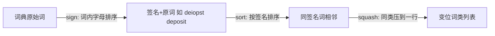

## 2.1 三个问题

算法课教给程序员的先进方法固然重要，但算法在更日常的层面还有更大的影响。本篇标题盗自 Martin Gardner 的《Aha! Insight》，他描述的正是这种贡献：

> A problem that seems difficult may have a simple, unexpected solution.
>
> 一个看似困难的问题，可能有一个简单而出人意料的解法。

**"啊哈！"式的洞察不属于学成归来的专家，愿意在编码前、中、后认真思考的任何程序员都能得到**。本篇围绕三个小问题展开，先自己试一试：

本篇围绕三个小问题展开，先自己试一试：

**A.** 一个顺序文件最多包含 40 亿个随机排列的 32 位整数，找出一个**不在**文件中的 32 位整数（必定至少缺一个——为什么？）。主存充足时怎么做？只有几百字节主存、但有几个外部临时文件时怎么做？

**B.** 将一个 n 元一维向量左旋 i 个位置。如 n=8、i=3 时，`abcdefgh` 旋为 `defghabc`。简单做法借助 n 元中间向量、n 步完成；能否只用几十字节额外存储、时间仍正比于 n？

**C.** 给定一部英语词典，找出所有变位词（anagram）类。如 `pots`、`stop`、`tops` 互为变位词。

## 2.2 无所不在的二分查找

猜数游戏：心里想一个 1~n 之间的整数，对方每次猜一个数你告诉高低——最多 $\log_2 n$ 次必中（n 为一千时 10 次，一百万时 20 次）。这就是**二分查找（Binary Search）**：已知对象在某个范围内，一次探测告诉你对象在给定位置的下方、命中还是上方；反复探测当前区间的中点，不中则区间减半，找到或区间为空时停止。最常用于有序数组查找——注意，**二分查找程序出了名的容易写错**，Column 4 会专门分析代码。

顺序查找平均要 n/2 次比较，二分查找从不超过约 $\log_2 n$ 次。TWA（Trans World Airlines）订票系统的案例很典型：

> 我们有个程序每秒近百次地对一大片内存做线性查找。随着网络增长，每条消息的 CPU 时间涨了 0.3 毫秒——对我们是巨大的跳跃。我们定位到线性查找，把应用程序改成二分查找，问题消失了。

二分查找的用途远不止查有序数组：

- **调试定位坏行**：Roy Weil 清理一个约一千行的输入文件，其中有一行坏行，只有把文件的（起始）一段跑过程序、看结果是否离谱才能发现，一次要几分钟。前人每次跑几行、蜗牛爬般推进。Weil 怎么只跑 10 次就找到元凶？——把"前半段正常吗"当作探测，对行区间做二分。
- **问题 A 的解法骨架**：范围 = 已知至少缺一个整数的整数区间；表示 = 装着区间内所有整数的文件；探测 = 数一数中点两侧各有多少元素——**总有一侧的元素数少于区间总元素数的一半，而总范围缺了元素，所以小的那一半也必然缺**。逐位二分（先按首位 0/1 分到两个文件，取元素少的那份继续按第二位分……）总时间正比于 n。
- 求根的**二分法（bisection method）**、选择算法的"随机化二分"、树结构、以及"程序无声死亡时往源码哪里下探"的调试，都是同一个思想的变奏。

## 2.3 基本操作的力量

问题 B（向量旋转）真实对应**交换大小不等的相邻内存块**——在文件里拖拽移动一段文本就是这个操作。约束：时间正比于 n，额外空间只有几十字节。

朴素方案都不达标：拷出前 i 个元素再搬移（空间超标）；每次左旋一格、调用 i 次（时间超标）。达标方案有三个：

**杂耍（juggling）**：把 `x[0]` 存入临时变量 t，将 `x[i]` 移到 `x[0]`、`x[2i]` 移到 `x[i]`……（下标对 n 取模），直到回到取 `x[0]`，改从 t 取并停。若一趟没搬完所有元素，再从 `x[1]` 开始，直到搬完。一趟搬运的"链条"条数正是 $\gcd(i, n)$。

**递归块交换**：把旋转看作把 `ab` 变成 `ba`。设 a 较短，把 b 分成 `bl` 与 `br` 且 `br` 与 a 等长，交换 a 与 `br` 得 `br bl a`——a 已就位，剩下对 b 递归做同样的事。Gries 与 Mills 给出了迭代实现：

```c
i = p = rotdist
j = n - p
while i != j
    /* 不变量:
        x[0  ..p-i  ] 已就位
        x[p-i..p-1  ] = a (待与 b 交换)
        x[p  ..p+j-1] = b (待与 a 交换)
        x[p+j..n-1] 已就位
     */
    if i > j
        swap(p-i, p, j)
        i -= j
    else
        swap(p-i, p+j-i, i)
        j -= i
swap(p-i, p, i)
```

它与"用加减法求 gcd"的欧几里得算法同构（每次从较大者减去较小者）。

**求逆（reversal）——真正的 aha!**：假设手头有把数组一段元素逆置的 `reverse` 函数，则三步完成旋转：

```c
reverse(0, i-1)       /* cbadefgh */
reverse(i, n-1)       /* cbahgfed */
reverse(0, n-1)       /* defghabc */
```

即 $(a^r b^r)^r = ba$。这段代码高效、短小、简单到很难写错：Kernighan 与 Plauger 在 1981 年的《Software Tools in Pascal》里用它移动文本编辑器中的行，首次运行就正确，而他们之前基于链表的类似代码藏着好几个 bug；Ken Thompson 1971 年写编辑器时就用了它，并说这当时已是 folklore。McIlroy 的手势演示：双手掌心朝自己、左手压在右手上，把两只手整体翻转（三次）即得旋转结果。

三个算法时间都是 O(n)，但实测差异有趣（Solution 4，400MHz Pentium II，n=100 万）：求逆法稳定在约 58 纳秒/元素；块交换法因缓存友好，旋转距离大于 2 后最快；杂耍法因每次访问跨 32 字节缓存行中的单个元素，飙到约 190 纳秒——**同样的渐进复杂度，缓存行为可以差出三倍**。

## 2.4 排序使问题归一

问题 C（变位词）的naive路都走不通：

- 枚举每个词的全排列：22 个字母的词有 $22! \approx 1.124\times10^{21}$ 个排列，就算每排列只花 1 皮秒，也要 $1.1\times10^9$ 秒——按"$\pi$ 秒等于一个纳世纪"的经验法则（见 7.1 节），这是几十年。
- 两两比较所有词对：230,000 词 × 230,000 比较 × 1 微秒 ≈ 52,900 秒 ≈ **14.7 小时**。

aha! 洞察分两步：

1. **给每个词签名（signature）**：同一变位词类的词有相同签名。做法——把词内字母按字母序排序，`deposit` 的签名是 `deiopst`，`dopiest` 的签名也是它。
2. **把签名相同的词聚到一起**：按签名排序整个文件。Tom Cargill 的手势描述最传神：先这样排（手横向挥），再那样排（手纵向挥）。

签名不止一种：排序后重复字母用计数表示（`mississippi` → `i4m1p2s4`），或用 26 个整数的数组记录每个字母出现次数。签名的其他应用：FBI 指纹索引、识别同音异拼姓名的 Soundex 启发式（Knuth《Sorting and Searching》第 6 章）。

## 2.5 原则

- **Sorting（排序）**。排序最显然的用途是产生有序输出；但在变位词问题里，排序不是目的，而是**把相等的元素聚到一起**；词内字母排序则提供了变位词类的**规范形（canonical form）**。给记录附加键再按键排序，排序函数就成了重排磁盘数据的主力工具。
- **Binary Search（二分查找）**。在有序表中查元素极其高效，内存磁盘皆宜；唯一缺点是**整张表必须事先已知且有序**。它背后的策略（探测、减半）在大量应用中复用。
- **Signatures（签名）**。当等价关系划分出等价类时，定义一个"同类同签、异类异签"的签名能把问题大大简化。
- **Problem Definition（问题定义）**。Column 1 讲的是搞清用户到底要什么；本篇是问题定义的下一步：**我们将用哪些基本操作来解题？** 每个案例的 aha! 都是定义出一个新的基本操作，让问题变得平凡。
- **A Problem Solver's Perspective（解题者的视角）**。好程序员有点"懒"：他们坐下来等洞察，而不是带着第一个念头往前冲；当然要与在恰当时机动手编码的主动性平衡。真正的功力在于知道何时是恰当时机——这只能从解题与复盘的经验中来。

## 2.6 习题选

**2.顺序文件含 43 亿个 32 位整数，如何找出至少出现两次的一个？** 递归地在包含超过一半整数的子区间里继续二分（区间里的整数多于区间容量，必有重复）。

**6.Bell 实验室电话查号系统按键输入 `LESK*M*` 即 `5375*6*`，不同姓名可能同键码，如何找出这些"错误匹配"？** 键码就是姓名的签名——按签名排序，再顺序扫描报告同签名不同名者。给定键码返回候选姓名集合，真实系统会用哈希或数据库。

**7.1960 年代 Vyssotsky 要转置磁带上 4000×4000 的矩阵，同事的原始程序要跑 50 小时，他怎么降到半小时？** 给每条记录前置列号行号，调系统磁带排序**按列再按行**排，再用第三个程序去掉行列号——又是"附加键 + 排序"。

**8.[Ullman] n 个实数、实数 t、整数 k，多快能判断是否存在 k 元子集之和 ≤ t？** aha!：存在这样的子集，当且仅当**最小的 k 个数**之和 ≤ t。排序后取前 k 个，O(n log n)；用选择算法（见 Solution 11.9）可达 O(n)。

**10.爱迪生让新来的研究员算空灯泡壳的容积，新人用卡尺和微积分算了几个小时得 150 立方厘米，爱迪生几秒钟内答"更接近 155"——他怎么算的？** 往壳里灌满水，倒进量筒。

## 2.7 深入阅读

8.8 节介绍了几本关于算法的好书。

## 2.8 边栏：变位词程序的实现

三个小程序组成流水线：**sign（签名）→ sort（排序）→ squash（压行）**，用 Unix 管道串起来：

```text
sign <dictionary | sort | squash >gramlist
```

六词词典的处理过程：



sign 程序——读词、复制、词内排序、打印签名与原词：

```c
int charcomp(char *x, char *y) { return *x - *y; }

#define WORDMAX 100
int main(void)
{   char word[WORDMAX], sig[WORDMAX];
    while (scanf("%s", word) != EOF) {
        strcpy(sig, word);
        qsort(sig, strlen(sig), sizeof(char), charcomp);
        printf("%s %s\n", sig, word);
    }
    return 0;
}
```

squash 程序——签名变化处换行，把同一类的词压到一行：

```c
int main(void)
{   char word[WORDMAX], sig[WORDMAX], oldsig[WORDMAX];
    int linenum = 0;
    strcpy(oldsig, "");
    while (scanf("%s %s", sig, word) != EOF) {
        if (strcmp(oldsig, sig) != 0 && linenum > 0)
            printf("\n");
        strcpy(oldsig, sig);
        linenum++;
        printf("%s ", word);
    }
    printf("\n");
    return 0;
}
```

在 230,000 词的词典上共 18 秒（sign 4 秒、系统 sort 11 秒、squash 3 秒）。有趣的变位词类：

```text
canter creant Cretan nectar recant tanrec trance
caret carte cater crate creat creta react recta trace
least setal slate stale steal stela tales
reins resin rinse risen serin siren
constitutionalism misconstitutional
```
