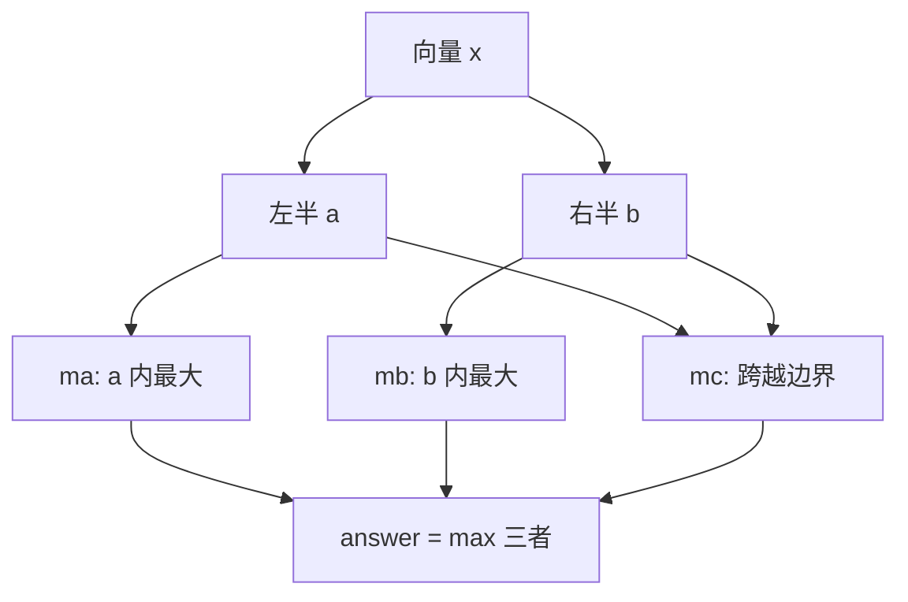

Column 2 讲了算法设计对程序员的日常效应：算法洞见能让程序更简单。本篇看这个领域不那么常见但更戏剧性的贡献：**精巧的算法有时带来极端的性能提升**。一个小问题的四个算法：第一个程序解规模 100,000 的问题要 15 天，最后一个程序只要 5 毫秒。

## 8.1 问题与简单算法

问题来自一维模式识别。输入是 n 个浮点数的向量 x，输出是**任意连续子向量的最大和**（maximum-sum subvector）。例如十元素输入 $(31, -41, 59, 26, -53, 58, 97, -93, -23, 84)$ 的答案是 x[2..6] 之和 187。全负时定义为空向量，和为零。

显然的程序：枚举所有 $0 \le i \le j < n$ 的 (i, j) 对，逐一求和取最大——**算法 1**：

```c
maxsofar = 0
for i = [0, n)
    for j = [i, n)
        sum = 0
        for k = [i, j]
            sum += x[k]
        /* sum is sum of x[i..j] */
        maxsofar = max(maxsofar, sum)
```

短、直白、易懂——但慢：n=10,000 约 22 分钟，n=100,000 要 15 天。大 O 分析给出原因：三层循环嵌套，总代价 $O(n^3)$（立方算法）。大 O 的弱点是不知道具体输入的确切耗时；强项是分析通常容易做，且渐近时间足够支撑"这个程序够不够用"的信封估算。

往下读之前，先花一分钟自己找个更快的算法。

## 8.2 两个平方算法

多数读者的第一反应是"有明显办法快很多"。明显的办法有两个——**看到一个的人常常看不到另一个**。两者都是 $O(n^2)$，都把"计算 x[i..j] 之和"从 $j-i+1$ 次加法降到常数时间，但手段迥异。

**算法 2** 利用 x[i..j] 之和与刚算过的 x[i..j-1] 之和的亲密关系：

```c
maxsofar = 0
for i = [0, n)
    sum = 0
    for j = [i, n)
        sum += x[j]
        /* sum is sum of x[i..j] */
        maxsofar = max(maxsofar, sum)
```

**算法 2b** 在外层循环之前先建数据结构：`cumarr[i]` 存 x[0..i] 的累加和，于是 `sum(x[i..j]) = cumarr[j] - cumarr[i-1]`：

```c
cumarr[-1] = 0
for i = [0, n)
    cumarr[i] = cumarr[i-1] + x[i]
maxsofar = 0
for i = [0, n)
    for j = [i, n)
        sum = cumarr[j] - cumarr[i-1]
        /* sum is sum of x[i..j] */
        maxsofar = max(maxsofar, sum)
```

到这里，所有算法都在检查子向量起止点的所有 $O(n^2)$ 个组合——**任何逐个检查这些组合的算法至少是平方时间**。能绕开它吗？

## 8.3 分治算法

**算法 3** 基于分治（divide-and-conquer）配方：解规模 n 的问题 = 递归解两个约 n/2 的子问题 + 合并。把向量对半分成 a 与 b，递归求出 a 内最大子向量 ma、b 内最大子向量 mb——**但答案未必是两者中的大者**：最大子向量要么全在 a，要么全在 b，要么**跨越 a 与 b 的边界**（记为 mc）。



mc 的求法：左边取"从边界伸入 a 的最大子向量"，右边取"从边界伸入 b 的最大子向量"，相加。递归基：单元素向量取 $\max(0, x[l])$，空向量取 0。

```c
float maxsum3(l, u)
    if (l > u)  /* zero elements */
        return 0
    if (l == u) /* one element */
        return max(0, x[l])
    m = (l + u) / 2
    /* find max crossing to left */
    lmax = sum = 0
    for (i = m; i >= l; i--)
        sum += x[i]
        lmax = max(lmax, sum)
    /* find max crossing to right */
    rmax = sum = 0
    for i = (m, u]
        sum += x[i]
        rmax = max(rmax, sum)

    return max(lmax+rmax, maxsum3(l, m), maxsum3(m+1, u))
```

代码精细、容易写错，但 $O(n \log n)$。递推关系 $T(n) = 2T(n/2) + O(n)$，$T(1) = O(1)$，解为 $T(n) = O(n \log n)$（习题 15 用数学归纳证明）。

## 8.4 扫描算法

**算法 4** 是操作数组最朴素的方式：从左端 x[0] 扫到右端 x[n-1]，跟踪迄今见过的最大和。设已解决 x[0..i-1]，如何扩展到 x[i]？前 i 个元素的最大子数组要么在前 i−1 个里（存 `maxsofar`），**要么恰好以位置 i 结尾**（存 `maxendinghere`）。关键一步是不从头重算，而是复用"以 i−1 结尾的最大子向量"：

```c
maxsofar = 0
maxendinghere = 0
for i = [0, n)
    /* invariant: maxendinghere and maxsofar
       are accurate for x[0..i-1] */
    maxendinghere = max(maxendinghere + x[i], 0)
    maxsofar = max(maxsofar, maxendinghere)
```

`maxendinghere + x[i]` 为正就累加，变负就归零（以 i 结尾的最大子向量成了空向量）。代码虽精细，但短而快：$O(n)$，线性算法。

## 8.5 这有什么要紧？

四个算法的对比（400MHz Pentium II 实测外推）：

| 算法 | 复杂度 | n=10⁴ | n=10⁵ | 时间随 n |
| --- | --- | --- | --- | --- |
| 1 立方 | $O(n^3)$ | 22 分钟 | 15 天 | ×1000 |
| 2 平方 | $O(n^2)$ | 秒级 | 分钟级 | ×100 |
| 3 分治 | $O(n\log n)$ | 毫秒级 | 数十毫秒级 | ≈×12 |
| 4 线性 | $O(n)$ | 毫秒 | 毫秒级 | ×10 |

**比较立方、平方与线性算法时，常数因子无关大局**。为强调这点，作者做了极端实验：算法 4 跑在 Radio Shack TRS-80 Model III（1980 年的 Z-80 个人机，2.03MHz）上、还用了解释执行比编译慢一两 orders 的 Basic；算法 1 跑在 533MHz 的 Alpha 21164 上。结果：立方算法 0.58n³ 纳秒，线性算法 19.5n 毫秒（每秒处理约 50 个元素）——**常数因子差 3300 万倍**。立方算法起初领先，但 n≈5,800 处两者打平（各约两分钟），此后 TRS-80 上的线性算法碾压。

## 8.6 原则

问题的历史照亮了算法设计技术。它源于 Brown 大学 Ulf Grenander 的模式匹配问题（二维形式，最大和子数组是数字化图片中某类模式的极大似然估计）；二维太慢，他简化成一维来理解结构。Grenander 觉得立方太慢，得出算法 2；1977 年他把问题讲给 Michael Shamos，Shamos 一夜设计出算法 3；Shamos 随后在 CMU 的研讨班上讲了问题与历史，听众中的统计学家 **Jay Kadane 一分钟内勾出了算法 4**。任何正确算法都必须检查全部 n 个输入（习题 6），所以线性已是最优。而 Grenander 原始的二维问题，在第二版付印时仍未解决——觉得一维线性算法"显然"的读者，请去做习题 13 的"显然"算法。

这些算法体现的设计技术：

- **Save state to avoid recomputation（存状态免重算）**：算法 2 与 4 用的这一简单形式就是**动态规划（dynamic programming）**——用空间存结果，省下重算的时间。
- **Preprocess information into data structures（把信息预处理进数据结构）**：算法 2b 的 cumarr 让子向量求和变常数时间。
- **Divide-and-conquer（分治）**：算法 3。
- **Scanning algorithms（扫描）**：数组问题常可问"如何把 x[0..i-1] 的解扩展到 x[0..i]"——存旧答案加一点辅助数据算新答案。
- **Cumulatives（累加表）**：第 i 项存前 i 项之和；处理区间问题的常用结构——业务分析师用"十月累计销售额减二月累计销售额"得三至十月销量。
- **Lower bounds（下界）**：算法设计师只有证明匹配的下界才能安睡——确知自己的算法最优。

## 8.7 习题选

**3.精确分析各算法的 max 调用次数与空间？** 算法 1 约 $n^3/6$ 次，算法 2 约 $n^2/2$ 次，算法 4 约 2n 次；2b 需线性额外空间（累加数组），3 需对数额外空间（递归栈），其余常数。**算法 4 是在线算法（online）**：单遍扫描即出答案，处理磁盘文件尤其有用。

**7.脚手架报算法 2b、3 的答案与算法 4 不一致？** 数值非常接近但不全同——**浮点舍入**，不同求和次序产生不同舍入误差。

**10.找和最接近零的子向量？** 预处理累加数组 cum，x[l..u] 之和为零当且仅当 `cum[l-1] == cum[u]`——**找 cum 中最接近的两个元素**，排序后 O(n log n) 完成；这已逼近最优（可归约到 Element Uniqueness 问题）。

**11.收费高速公路 n 个收费站、n−1 段路各有费用，如何 O(n) 空间、常数时间答任意两站间费用？** 累加数组：`cum[j] - cum[i-1]`。

**12.数组初值为零，n 次区间加操作 `for i in [l,u]: x[i] += v` 后输出全数组，如何快于 $O(n^2)$？** 又是累加数组的变形——**差分数组**：每次操作只做 `cum[u] += v; cum[l-1] -= v`，最后从右往左 `x[i] = x[i+1] + cum[i]` 一遍还原，总计 O(n)。此题来自 Appel n 体程序（6.1 节）的统计函数，把它从 4 小时缩到 20 分钟——程序要跑一年时这点加速无所谓，跑一天时就重要了。

**13.二维：n×n 实数数组，找最大和矩形子数组，复杂度？** 行方向用算法 2、列方向用算法 4，得 $O(n^3)$——二十年来的最好结果；Tamaki 与 Tokuyama 1998 年给出略快的 $O(n^3\sqrt{\log\log n/\log n})$，最好下界仍是 $n^2$。

## 8.8 深入阅读

- Aho、Hopcroft、Ullman《Data Structures and Algorithms》(1983)：优秀本科教材，第 10 章"Algorithm Design Techniques"与本篇最相关。
- Cormen、Leiserson、Rivest《Introduction to Algorithms》(MIT Press, 1990)：千页巨著，Part IV"Advanced Design and Analysis Techniques"契合本篇主题。
