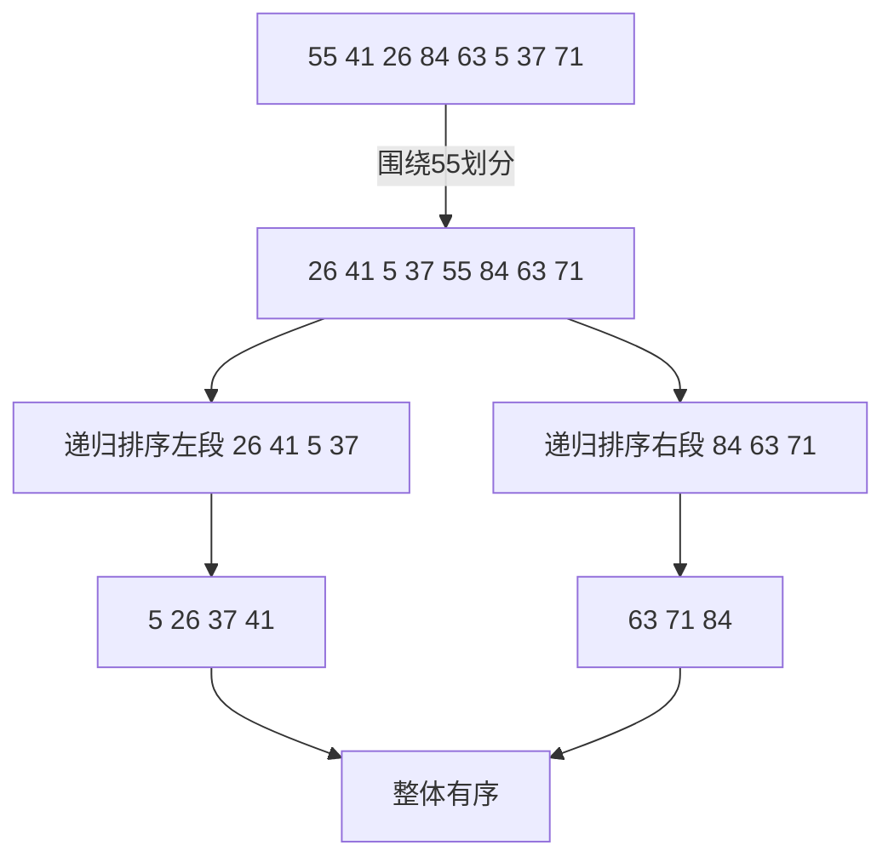

怎么把一组记录排成有序？答案通常很简单：**用库排序函数**（1.1 节的解答、2.8 节的变位词程序都这么干）。但这招不总是灵：现成排序可能难用或太慢（1.1 节见过），那时程序员就只好自己写排序了。

## 11.1 插入排序

**插入排序（Insertion Sort）**是多数牌手理牌的方法：已拿到的牌保持有序，每来一张新牌就插进恰当位置。排序数组 x[n]：以 x[0..0] 为有序子数组起步，依次插入 x[1..n-1]：

```c
for i = [1, n)
    /* invariant: x[0..i-1] is sorted */
    /* goal: sift x[i] down to its
         proper place in x[0..i] */
```

四元素数组的推进过程（`|` 表示 i，左边有序、右边保持原序）：

```text
3|1 4 2
1 3|4 2
1 3 4|2
1 2 3 4|
```

把 x[i] **筛（sift）**到正确位置用从右到左的循环实现——只要还有前驱（j>0）且与前驱失序就交换。**isort1**：

```c
for i = [1, n)
    for (j = i; j > 0 && x[j-1] > x[j]; j--)
        swap(j-1, j)
```

自己写排序时这是第一个该试的函数：三行直白代码。代码调优者的下一步：内层循环的 swap 函数调用碍眼，把函数体内联（多数优化编译器会代劳）：

```c
t = x[j];  x[j] = x[j-1];  x[j-1] = t
```

机器上 **isort2 约为 isort1 耗时的三分之一**。这又打开下一扇门：t 被反复赋同一个值（x[i] 原本的值），把对 t 的赋值移出循环、改比较对象，得 **isort3**：

```c
for i = [1, n)
    t = x[i]
    for (j = i; j > 0 && x[j-1] > t; j--)
        x[j] = x[j-1]
    x[j] = t
```

只要 t 比数组值小就把元素右移一格，最后把 t 放进正确位置——比 isort2 再快约 15%。

随机数据与最坏情况下，插入排序都是 $O(n^2)$：isort3 排 1,000 个整数要几毫秒，10,000 个要三分之一秒，**一百万个几乎要一小时**（马上会看到一秒内排完一百万的代码）。但**输入几乎有序时插入排序飞快**——每个元素只需移动很短距离；11.3 节的算法正是利用这一点。

## 11.2 简单快速排序

**快速排序（Quicksort）**由 C. A. R. Hoare 在 1962 年的经典论文中描述，用 8.3 节的分治思路：划分数组为两块，递归排序。八元素数组先围绕首元素 55 划分——小于它的在左、大于它的在右，再递归排序 [0..2] 与 [4..7]：



平均时间远低于插入排序的 $O(n^2)$：**一次划分让约一半元素落到分割值之下、一半之上**，排序进展神速；而同样耗一次循环的时间，插入排序只多安顿一个元素。

递归骨架（区间用 l、u 表示，少于两元素即返回）：

```c
void qsort(l, u)
    if l >= u then
        /* at most one element, do nothing */
        return
    /* goal: partition array around a particular value,
       which is eventually placed in its correct position p */
    qsort(l, p-1)
    qsort(p+1, u)
```

划分采用从 Nico Lomuto 学来的简单方案（比下一节的双向划分慢一点，但简单到很难写错、也绝不慢；作者见过太多人被双向划分的细节坑——自己曾花近两天追一个藏在短划分循环里的 bug）。维护不变量：小于 t 的都在 m 左边、其余在 i 左边；扫到 x[i] < t 时先 `++m` 再交换 x[i] 与 x[m]：

```c
m = a-1
for i = [a, b]
    if x[i] < t
        swap(++m, i)
```

Quicksort 里取 t = x[l]（即 a = l+1、b = u），循环结束时交换 x[l] 与 x[m]，使分割元就位。（跳过这步、以 (l, m) 与 (m+1, u) 递归很诱人——可惜当 t 是子数组严格最大元时会**死循环**；Miriam Jacob 给过优雅的不正确性证明：x[l] 从不被移动，所以只有最小元素恰好在 x[0] 时排序才可能工作。）完整程序 **qsort1**：

```c
void qsort1(l, u)
    if (l >= u)
        return
    m = l
    for i = [l+1, u]
        /* invariant: x[l+1..m]   <  x[l] &&
                      x[m+1..i-1] >= x[l] */
        if (x[i] < x[l])
            swap(++m, i)
    swap(l, m)
    /* x[l..m-1] < x[m] <= x[m+1..u] */
    qsort1(l, m-1)
    qsort1(m+1, u)
```

正确性证明的大半已在推导中（这正是它该在的位置）：对 n 归纳——if 正确处理空与单元素数组，划分正确搭建递归调用；x[m] 在每次调用中被排除，故递归不会无限——与 4.3 节二分查找的终止论证如出一辙。对互异元素的随机排列，平均 $O(n\log n)$ 时间、$O(\log n)$ 栈空间；任何基于比较的排序必须 $\Omega(n\log n)$，Quicksort 接近最优。

实测：qsort1 一秒多排完一百万随机整数，**比精调的 C 库 qsort 还快约两倍**（库函数背着通用接口、每次比较都要函数调用）。但它有多数 Quicksort 的通病：**在一些常见输入上退化为平方时间**。

## 11.3 更好的快速排序

极端案例：n 个全部相等的元素。插入排序在此输入上是**最好情形**（每个元素零移动，$O(n)$）；qsort1 却惨败——n−1 趟划分每趟花 O(n) 只剥下一个元素，$O(n^2)$：n=1,000,000 时从一秒暴涨到两小时。

解法是**双向划分（two-sided partitioning）**：i、j 初始化到两端，主循环里第一内循环让 i 越过小元素停在大元素上，第二内循环让 j 越过大元素停在小元素上，检测交叉则交换两值。相等元素怎么处理？想跳过它们少干活？全相等输入直接退化平方。**相反，在每个相等元素上都停下来并交换**——多做些不必要的 swap，把全相等的**最坏情形变成最好情形**（恰约 $n\log_2 n$ 次比较）：

```c
void qsort3(l, u)
    if l >= u
        return
    t = x[l]; i = l; j = u+1
    loop
        do i++ while i <= u && x[i] < t
        do j-- while x[j] > t
        if i > j
            break
        swap(i, j)
    swap(l, j)
    qsort3(l, j-1)
    qsort3(j+1, u)
```

另一个退化源：**总用首元素做分割元**。输入已升序时，每趟都围绕最小元划分，又是 $O(n^2)$。改成**随机选分割元**——先 `swap(l, randint(l, u))`（randint 必须返回 [l, u] 内的值，越界是阴险的 bug；自己做随机数见 12.1 节）。组合随机分割与双向划分后，**对任意 n 元输入，期望运行时间都是 $n\log n$——性能保证来自调用随机数生成器，而不是对输入分布的假设**。

最后一招来自 Bob Sedgewick：Quicksort 花大量时间排序很小的子数组，小数组不值得兴师动众。**子数组太小时直接返回**（`if u-l < cutoff return`），主程序结束时数组未完全有序、但已聚成"左簇元素都小于右簇"的小簇——**近似有序的数组交给插入排序收拾残局**（`qsort4(0, n-1); isort3()`，cutoff 的取值见习题 3）。再把内层循环的 swap 展开，最终的 **qsort4**：

```c
void qsort4(l, u)
    if u-l < cutoff
        return
    swap(l, randint(l, u))
    t = x[l]; i = l; j = u+1
    loop
        do i++; while i <= u && x[i] < t
        do j--; while x[j] > t
        if i > j
            break
        temp = x[i]; x[i] = x[j]; x[j] = temp
    swap(l, j)
    qsort4(l, j-1)
    qsort4(j+1, u)
```

qsort4 用 15 行 C 加 isort3 的 5 行。一百万随机整数：从 C++ 库 `sort` 的 **0.6 秒**到 C 库 `qsort` 的 **2.7 秒**。Column 14 将看到**最坏情形也保证 $O(n\log n)$** 的整数排序算法。

## 11.4 原则

- **C 库 qsort** 简单且相对快，慢于手写 Quicksort 只因通用灵活的接口每次比较都要函数调用；**C++ 库 sort** 接口最简（`sort(x, x+n)`）实现还特别高效。**系统排序能满足需求时，根本别考虑自己写。**
- **插入排序**编码简单，小活够快：isort3 排 10,000 个整数只要三分之一秒。
- 大 n 时，Quicksort 的 $O(n\log n)$ 是关键：Column 8 的算法设计技术给出分治思路，Column 4 的验证技术帮我们把它落成精炼高效的代码。
- **大提速靠换算法，但 Column 9 的代码调优仍让插入排序快 4 倍、Quicksort 快 2 倍。**

## 11.5 习题选

**1.求数组的最小/最大/均值/中位数/众数，排序如何被滥用或漏用？** 最小、最大、均值是 O(n) 一遍扫描——排序（O(n log n)）是滥用；中位数、众数借助排序（或 9 题的选择算法）则很自然。

**4.Quicksort 平均只用 O(log n) 栈空间，最坏却是线性——为什么？怎么改？** 分割极不均衡（如已有序输入固定取首元素）时递归深度达 n；改为**每趟只递归较小的一侧，对较大的一侧用循环（尾调用消除）**，栈深即为 O(log n)。

**9.O(n) 期望时间找第 k 小元素？** 划分定位分割元最终位置 p：p==k 即答案，否则只递归含 k 的一侧——"快速选择（quickselect）"，见 Solution 11.9。

## 11.6 深入阅读

- Knuth《The Art of Computer Programming, Vol. 3: Sorting and Searching》(1973, 2nd ed. 1998)：本主题的权威参考，详述算法、数学分析运行时间并用汇编实现；MIX 汇编显老，代码揭示的原则永不过时。
- Sedgewick《Algorithms》第三版（C 版 1997、C++ 版 1998、Java 版 1999）：更现代的排序与搜索专著，强调有用算法的实现并直观解释性能。

这两本是本篇、Column 13（搜索）与 Column 14（堆）的主要参考。
