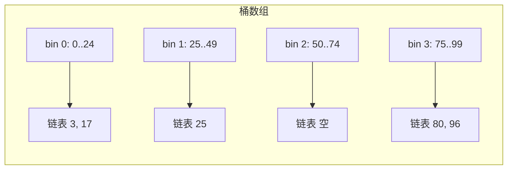

搜索问题形态万千：编译器查变量名的类型与地址、拼写检查器查词典、电话目录查号码、域名服务器查 IP——都在**一个集合里查找与特定项关联的信息**。本篇深入研究一个小而典型的问题：**如何表示一个整数集合（无附加数据）**——麻雀虽小，实现任何数据结构的关键问题俱全。

## 13.1 接口

延续上一篇的问题：生成 [0, maxval) 内 m 个不重复随机整数的有序序列。骨架伪代码：

```c
initialize set S to empty
size = 0
while size < m do
    t = bigrand() % maxval
    if t is not in S
        insert t into S
        size++
print the elements of S in sorted order
```

把数据结构叫 **IntSet**，接口定义为 C++ 类：

```c
class IntSetImp {
public:
    IntSetImp(int maxelements, int maxval);
    void insert(int t);
    int size();
    void report(int *v);
};
```

构造函数把集合初始化为空（两个参数描述元素数上限与元素值上限，实现可忽略）；insert 在 t 不存在时插入；size 报元素数；report 按序把元素写进 v。这是教学接口——工业强度类还缺错误处理、析构函数等；专家会用抽象类加虚函数，这里用更简单（有时更快）的方式：直接命名 `IntSetArr`、`IntSetList` 等。使用方式：

```c
void gensets(int m, int maxval)
{   int *v = new int[m];
    IntSetImp S(m, maxval);
    while (S.size() < m)
        S.insert(bigrand() % maxval);
    S.report(v);
    for (int i = 0; i < m; i++)
        cout << v[i] << "\n";
}
```

insert 保证不插重复元素，调用方就无须先测成员性——**成对计算（pairing computation）**的例子。最省事的实现直接包 **C++ 标准模板库（Standard Template Library, STL）的 `set`**：构造函数忽略参数，insert/size 一一对应，report 用标准迭代器按序导出。这个通用结构不错但不完美——**对这特定任务，我们马上会看到时间与空间都快 5 倍的实现**。

## 13.2 线性结构

**有序数组**是最简单的结构。构造时分配数组（多一个元素放**哨兵**）并置 `x[0] = maxval`——哨兵比一切元素大，把"走到头了吗"的测试换成"找到更大的元素了吗"（后者本来就要做），代码更简单还顺带更快：

```c
void insert(t)
    for (i = 0; x[i] < t; i++)
        ;
    if x[i] == t
        return
    for (j = n; j >= i; j--)
        x[j+1] = x[j]
    x[i] = t
    n++
```

第一循环扫过小于 t 的元素；相等即已存在；否则把更大者（含哨兵）整体右移一格，t 入洞。**O(n) 插入**，report 是 O(n) 拷贝。集合大小预先已知时数组是极好的结构；由于有序，还可加 O(log n) 的二分查找成员函数。

大小不预知时，**有序链表**是首选，还免去插入时滑动元素的代价。节点含值与 next 指针；同样保持有序、同样用值大于一切实值的哨兵节点。链表插入要走到"找到相等（返回）或遇到更大值（在此插入）"——各种特例通常导致繁琐代码；最干净的是递归：

```c
void insert(t)
    head = rinsert(head, t)

node *rinsert(p, t)
    if p->val < t
        p->next = rinsert(p->next, t)
    else if p->val > t
        p = new node(t, p)
        n++
    return p
```

**当问题埋在一堆特例之下时，递归常能导出这样直白的代码。**

两种结构生成 m 个随机整数都是总时间 $O(m^2)$。作者原以为链表略快——链表多花指针空间但免滑动数组上方的元素。实测（n 固定一百万、m 从 10,000 到 40,000）：数组如预期平方增长、常数合理；链表第一版**慢一个数量级且增长快于平方**。排查两步：

1. **怪罪递归**：调用开销之外，rinsert 的递归深度是元素位置 O(n)，且递归到底后几乎每个指针都被原值重写一遍。改成迭代版（Solution 4），**时间降到近三分之一**。
2. **改存储分配**（9.1 节 Van Wyk 技术）：不再逐次 new 节点，构造时一次分配 m 个节点组成的块。两重收益——附录 3 成本模型显示分配比简单操作贵两个数量级，m 次昂贵操作变一次；空间上块分配每节点只占 8 字节（4 整数 + 4 指针），40,000 节点共 320KB 舒服地待在 Level-2 缓存里，而逐个分配每节点实占 48 字节、总共 1.92MB 溢出缓存。

在另一台分配器更高效的机器上，去递归提速 5 倍、单块分配只快 10%——**缓存与去递归这些调优技术，时而大赚时而无效**。

留一道思考题：链表只做数组工作的一半（找位置但不滑动），为什么耗时反是两倍？一半答案是内存翻倍（为 4 字节整数要读 8 字节节点进缓存）；另一半是**数组访存完全可预测，链表访存在内存里乱蹦**。

## 13.3 二分搜索树

要同时支持快速查找与插入，上**二分搜索树（Binary Search Tree, BST）**：依次插入 31、41、59、26 后的树——左子树值小、右子树值大。节点含值与左右指针；插入沿树下走，找到即止、掉出树即插：

```c
node *rinsert(p, t)
    if p == 0
        p = new node(t)
        n++
    else if t < p->val
        p->left = rinsert(p->left, t)
    else if t > p->val
        p->right = rinsert(p->right, t)
    // do nothing if p->val == t
    return p
```

应用中元素随机插入，不必操心精细的平衡方案。report 用**中序遍历（inorder traversal）**——先左子树、再本节点、后右子树，天然有序：

```c
void traverse(p)
    if p == 0
        return
    traverse(p->left)
    v[vn++] = p->val
    traverse(p->right)
```

（脚注轶事：作者第一版漏了 `p == 0` 测试，优化器试图把尾递归转成循环时找不到终止测试、报了个 internal inconsistency 死掉——作者先怪编译器，后来才明白错在自己。）

实测（maxval = 10⁸，m 增到内存耗尽颠簸为止）：我们的简单 BST 略快于 STL set 且更省空间——STL 为保证最坏情形性能带平衡方案；STL 在 m ≈ 1,600,000 开始颠簸，我们的 BST 到 1,900,000。表中 **BST\*** 行是综合优化的版本：节点一次性分配（省三分之一时间）加去递归加哨兵节点（再快约 25%）。

## 13.4 面向整数的结构

最后两个结构利用"集合里装的是整数"这一事实。

**位向量（bit vector）**是 Column 1 的老朋友：`set`/`clr`/`test` 三函数（`i>>SHIFT` 定位字、`i & MASK` 定位位）；构造分配数组并清零全部位；insert 先 test 再 set；report 扫描全部位。maxval 小到向量装得进内存时**remarkably efficient**（习题 8：按字并行操作还能更快）；但 maxval = 2³² 时要半个 GB。

**桶（bins）**结合链表与位向量之长：把整数放进 m 个桶——4 个 0..99 的整数分进 4 个桶，桶 0 装 [0,24]、桶 1 装 [25,49]……每桶内是有序链表。这可看作一种**哈希（hashing）**；整数均匀分布时每条链表期望长度为 1：



```c
void insert(t)
    i = t / (1 + maxval/bins)
    bin[i] = rinsert(bin[i], t)
```

桶号映射不用显然的 `t*bins/maxval`——**可能数值溢出**（作者有过惨痛调试经验），改用上面这条安全式（习题 9 再把除法换成移位）。report 就是按桶序跑链表代码。实测中 bins 很快；**Bins\***（初始化时一次性分配全部节点）空间约四分之一、时间约一半，去递归再快 10%。

**五种结构平均性能总表**（m ≪ n，b 为每字位数）：

| 结构 | insert 总时间 | report 时间 | 空间 |
| --- | --- | --- | --- |
| STL set | $O(m\log m)$ | $O(m)$ | ~48m 字节（逐个分配时） |
| 有序数组 | $O(m^2)$ | $O(m)$ | m |
| 有序链表 | $O(m^2)$ | $O(m)$ | 2m（值+指针） |
| BST | $O(m\log m)$ | $O(m)$ | 3m |
| 位向量 | $O(m)$ | $O(n)$ | $n/b$ |
| bins | $O(m)$（期望） | $O(m)$ | 2m |

## 13.5 原则

- **The Role of Libraries（库的角色）**：STL 给出易实现、易维护易扩展的通用解——遇到数据结构问题，第一反应应是找通用工具；但专用代码能吃透特定问题的性质，快得多。
- **The Importance of Space（空间的重要性）**：精调链表干一半的活却花两倍时间——数组每元素内存减半且顺序访存；BST 用定制分配省空间三倍、省时间两倍。**越过魔法边界（Level-2 缓存的半 MB、空闲 RAM 的 ~80MB）时时间剧增。**
- **Code Tuning Techniques（代码调优技术）**：最大的一项改进是通用内存分配换成一次大块分配（消灭昂贵调用 + 空间更紧）；递归改迭代让链表快三倍、对 bins 只快 10%；哨兵给多数结构干净简单的代码，顺带减少运行时间。

## 13.6 习题选

**4.把链表、桶、BST 的递归插入改写成迭代，测时间差。**（见 13.2/13.4 的实测数字。）

**8.位向量的初始化与 report 如何按字并行提速？char/short/int/long 哪个单位最划算？** 一次置零/测试整个字的所有位——通常 int 对齐缓存线最划算。

**9.桶的除法如何换成移位？** 让每桶跨度是 2 的幂，`t >> k` 代替 `t / (1 + maxval/bins)`。

## 13.7 深入阅读

Knuth《Sorting and Searching》第 6 章（书的后半）与 Sedgewick《Algorithms》Part 4（最后四分之一）专讲搜索。

## 13.8 边栏：一个真实的搜索问题

正文的玩具结构为研究工业强度的结构打好了基础。本栏速览 Doug McIlroy 1978 年为 spell 程序表示词典的非凡结构——作者词典对 pearl 的定义是"very choice or precious（极精粹或极珍贵）"，这个程序当之无愧。细节见其论文《Development of a spelling list》（IEEE Trans. Communications, 1982 年 1 月号）。

**词表的收集**：先是足本词典（有效性）∩ 布朗大学百万词语料（时新性）的交集，然后是漫长的补全——专有名词多数词典不收：常见姓氏 1000 个、男孩女孩名、名人（Dijkstra、Nixon）、Bulfinch 神话索引；见到 Xerox、Texaco 这类"拼写错误"后加入财富 500 强；书目里出版社泛滥，也进；各国首都、美国各州首府、美国与世界百大城市、海洋行星恒星；动植物俗名、化学、解剖、计算机术语。同时克制：**剔除那些像真实拼写错误的合法词**（地质学术语 cwm），同词多拼法只留其一（留 traveling 不留 travelling）。McIlroy 的诀窍是**检查 spell 真实运行的输出**：一度 spell 自动把输出发邮件给他；发现问题就给出尽可能宽泛的解。最终 75,000 词的精粹清单。

**词缀分析（affix analysis）**：英语没有"完整词表"这回事，拼写检查器要么猜测 misrepresented 这类词的派生、要么把大量合法词报为错误。目标：把 misrepresented 剥成 mis- + re- + pre- + sent + -ed（尽管 represent 并不意为"再次 present"——spell 利用巧合缩小词典）。40 条前缀规则 + 30 条后缀规则 + 1300 词的停止列表（拦截把 intend 误拼的 entend 剥成 en-+tend 这类"好而不对"的猜测）。75,000 词由此缩到 30,000。

**空间挤压**（原论文摘要）：**剥词缀把词表缩到三分之一以下；哈希丢掉剩余位数的 60%；数据压缩再砍一半**——75,000 词（连同约同数量的屈折形式）装进了 26,000 个 16 位字，活在一个 64KB 地址空间的 PDP-11 里。

三级哈希方案（玩具词表 a / list / of / five / words）：

1. 普通哈希表：n 与表长相当，每格挂一条链表。
2. 大表哈希：取 n = 23，多数非空格只装一个元素；spell 用 **n = 2²⁷**（约 1.34 亿格）。
3. **大胆一步：每格只存一个位，不存链表**。查 w 看 h(w) 那一位：0 则正确地报告不在；1 则**假定** w 在表中。坏词恰好哈希到已置位上的概率是 30,000/2²⁷ ≈ **1/4000**——草稿很少超过 20 个错误，因此至多百分之一的运行受此缺陷拖累，这正是选 27 的理由。

2²⁷ 个位的表要 16MB，程序只表示为 1 的那些位——即存哈希值本身（5, 10, 13, 18, 22）；显然的表示要 30,000 个 27 位字，但机器地址空间只有 32,000 个 16 位字。于是**排序后用变长码存相邻哈希值的差**：5, 5, 3, 5, 4（以虚构的 0 起算）。spell 的差值平均 **13.6 位**，余下几百字指向压缩列表的有用起点加速顺序查找。结果：**64KB 的词典，访问快，极少犯错**——古董机器上半分钟查完十页论文、十分钟查完一本本书，单词拼写几秒可查（小词典从磁盘读得飞快）。
