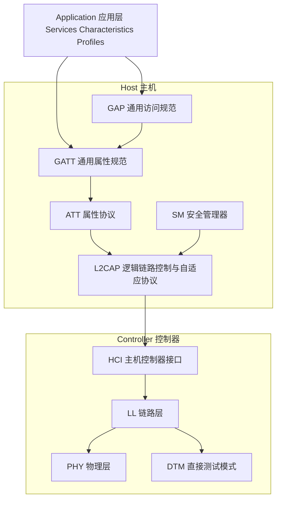
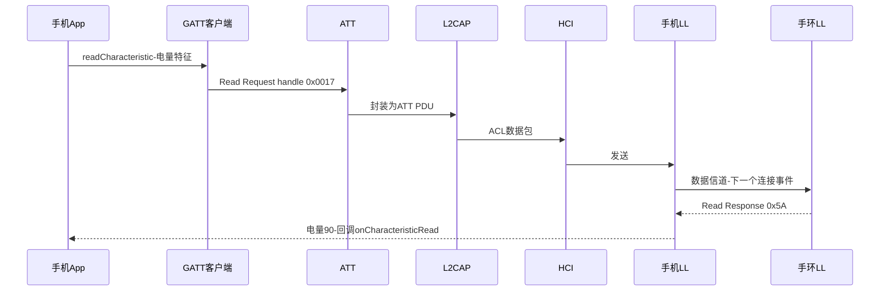

## 1. 三大块:Controller、Host 与 Application

BLE 协议栈纵向切成三块,**Controller(控制器)**、**Host(主机)**、**Application(应用)**,这是贯穿整个规范的组织方式:

各层一句话职责:

| 层 | 职责 |
| -- | ---- |
| PHY(Physical Layer, 物理层) | 2.4 GHz 射频:调制解调、收发分组、跳频 |
| LL(Link Layer, 链路层) | 状态机与空口协议:广播、扫描、连接、跳频、CRC、加密、ACK 重传 |
| HCI(Host Controller Interface, 主机控制器接口) | Host 与 Controller 之间的标准命令/事件/数据通道 |
| L2CAP(Logical Link Control and Adaptation Protocol) | 信道复用、协议分段重组、少量信令 |
| SM(Security Manager, 安全管理器) | 配对(Pairing)、密钥生成与分发、加密协商 |
| ATT(Attribute Protocol, 属性协议) | 定义"属性"及对属性表的读写/发现操作 |
| GATT(Generic Attribute Profile) | 在 ATT 之上规定服务/特征的组织与使用方式 |
| GAP(Generic Access Profile) | 规定设备发现、连接、安全与角色的通用流程 |
| DTM(Direct Test Mode, 直接测试模式) | 射频认证测试用的空口控制接口 |

**记忆锚点**:Controller 负责"无线电与空口时序"(硬实时),Host 负责"数据组织与安全"(软逻辑),Application 负责"数据语义"。分层不是为了优雅,而是为了**可拆卖**:Controller 与 Host 可以做在同一颗芯片(SoC),也可以分居两颗芯片通过 HCI 通信。

## 2. 协议栈的物理形态:几种芯片方案

### 2.1 单芯片方案(Single-Chip)

Controller + Host + App 全在一颗 MCU 里,如 TI CC254x、Nordic nRF52、Dialog DA1458x。应用代码与协议栈以库/任务形式共存,功耗与成本最优,典型于传感器、手环。

### 2.2 双芯片方案(Two-Chip)

手机方案:Controller(蓝牙芯片)+ Host(运行在应用处理器上)通过 HCI 相连。HCI 传输可以是 UART、USB 或 SDIO。这是 Android 手机与 PC 的标准形态。

### 2.3 双芯片的另一种拆法

嵌入式"主机 + 网络处理器"方案:一颗纯 Controller 芯片(如只跑 HostTest 固件的 CC2540),应用 MCU 通过 HCI(UART)驱动它——原书称之为网络处理器(Network Processor)形态,好处是应用侧不必实现协议栈,坏处是 HCI 交互固件行为受芯片厂商制约。

### 2.4 三芯片方案(Three-Chip)

Controller + Host + 单独的应用处理器。规范并不关心这种拆法,现实里对应"蓝牙模块(自带 Controller+Host 固件)+ 主 MCU 走串口 AT 命令或厂商协议"的产品形态。

## 3. 新使用模型(为什么这些分层长这样)

原书第 4 章指出 BLE 开启了经典蓝牙做不了的几类使用模型,这些模型决定了各层的形态:

- **存在检测(Presence Detection)**:设备周期性广播,手机据此感知"钥匙在不在身边"。只依赖广播,不需要连接——所以广播被设计成一等公民。
- **数据广播(Broadcasting Data)**:体温计向周围所有人广播体温(广播载荷 + 周期广播/扩展广播),单向、零状态。
- **无连接传感器(Connectionless Sensors)**:传感器广播即完成上报,观察者聚合。
- **网关(Gateways)**:一个双模设备把 BLE 传感器数据转成 Wi-Fi/IP 上云,推动 4.2 的 IPSP(IPv6 Support Profile)。

## 4. 与经典蓝牙协议栈的对照

| BLE | 经典蓝牙对应 | 备注 |
| --- | ------------ | ---- |
| LL | 基带(Baseband)+ 链路控制器 | BLE 的 LL 把基带、调度、ACK 全收拢成一台状态机 |
| L2CAP | L2CAP | 同名复用,BLE 只用固定信道 + 少量信令 |
| SMP | 没有直接对应(经典用 SSP) | BLE 用 AES-CCM + ECDH 重新设计 |
| ATT + GATT | SDP + 各专用 profile | BLE 用一张属性表统一了所有应用协议 |
| GAP | GAP | 同名,BLE 角色与流程完全重定义 |

## 5. 一次"读电池电量"在栈内的完整旅程

以手机(Host+Controller)读手环(SoC)电量为例,自上而下串一遍各层,后续各篇展开的就是这条路上的每一站:

- **ATT** 只管"读 0x0017 号属性";
- **GATT** 知道 0x0017 属于 Battery Service 的 Battery Level 特征,把它翻译成电量百分比语义;
- **L2CAP** 把 ATT PDU 装进 LE 信道(CID 0x0004);
- **HCI** 把它交给(或跨到)Controller;
- **LL** 等到下一个连接事件,选定跳频信道,把包发出去并等待对方在相同事件内应答;
- **PHY** 完成 GFSK 调制发射。

每一层只认识相邻层:这就是 BLE 协议栈的全部骨架。
