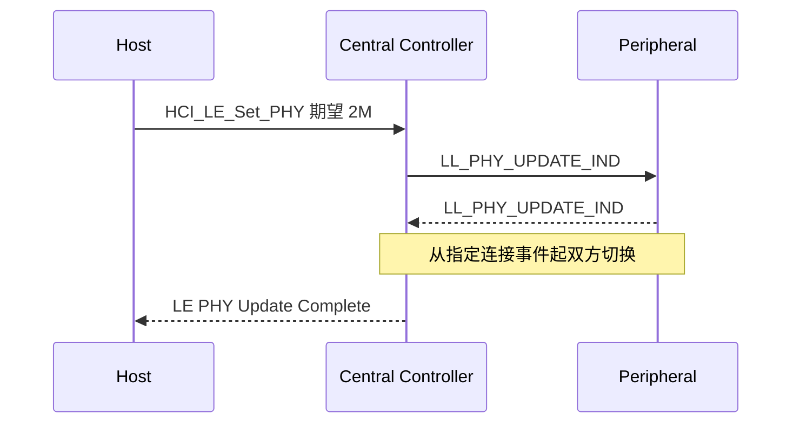

## 1. 2.4 GHz ISM 频段与信道规划

BLE 工作在 2.4 GHz ISM(Industrial, Scientific and Medical)免许可频段,具体为 **2402 - 2480 MHz**,划分为 **40 个物理信道,每信道宽 2 MHz**:

| 信道类别 | 信道号 | 频率 | 用途 |
| -------- | ------ | ---- | ---- |
| 广播信道(Advertising Channels) | 37 / 38 / 39 | 2402 / 2426 / 2480 MHz | 广播、扫描、发起连接 |
| 数据信道(Data Channels) | 0 - 36 | 其余 37 个 | 连接期间的点对点数据 |

三个广播信道的频点是刻意挑选的:它们正好避开 Wi-Fi 1/6/11 三个信道的中心频带(2412/2437/2462 MHz),让"发现设备"这个最重要的过程在 Wi-Fi 密集环境里最可靠。对比经典蓝牙用 79 个 1 MHz 信道,BLE 用更少的信道换来更宽的单信道带宽(1 Mbps 调制需要)与更低的跳频开销。

> **跳频(Frequency Hopping)**:数据信道按信道选择算法在 37 个数据信道间逐包跳变,配合**自适应跳频(Adaptive Frequency Hopping, AFH)**——Central 周期性下发信道地图(Channel Map),把被 Wi-Fi 等占用的信道标记为坏信道跳过。这是 BLE 在 2.4 GHz 拥挤环境下鲁棒性的根基。

## 2. 调制与速率:三种 PHY

BLE 统一采用 **GFSK(Gaussian Frequency Shift Keying, 高斯频移键控)**,调制指数 0.5,1 Msym/s 符号率。蓝牙 5.0 之后 LE 有三种物理层速率可选:

| PHY | 空口速率 | 接收灵敏度(规范最低) | 引入版本 | 典型用途 |
| --- | -------- | --------------------- | -------- | -------- |
| LE 1M | 1 Mbps | -70 dBm | 4.0 | 默认,兼容一切设备 |
| LE 2M | 2 Mbps | -70 dBm | 5.0 | 短距离高吞吐(OTA、LE Audio),发射窗口减半即省电 |
| LE Coded(S=8) | 125 kbps | 约 -82 dBm | 5.0 | 长距离(前向纠错 FEC,宣称约 4 倍距离) |
| LE Coded(S=2) | 500 kbps | 约 -75 dBm | 5.0 | 折中(约 2 倍距离) |

Coded PHY 的本质是给每个 bit 加卷积编码(FEC),用带宽换灵敏度——传同样的信息花更长时间,但弱信号也能解调。注意 **2M/Coded PHY 只用于连接后的数据信道**;广播接收兼容性要求广播基本仍走 1M PHY(扩展广播可以指定编码 PHY,但扫描方必须支持)。

## 3. 发射功率与链路预算

- 规范规定的 LE 最大发射功率 **10 dBm(10 mW)**,最小 -20 dBm,典型实现 0 dBm(1 mW)。
- 空间传播损耗大致遵循自由空间模型($d$ 为距离,单位米):$P_{loss} = 40 + 20\log_{10}(d)$,即距离每翻一倍多 6 dB。

链路预算只有一条公式:**最大允许路径损耗 = 发射功率 − 接收灵敏度**(两个都是 dBm,相减即可)。分步算一遍 1M 与 Coded(S=8)的差距:

| 步骤 | LE 1M | LE Coded(S=8) |
| ---- | ----- | --------------- |
| ① 发射功率(典型实现) | 0 dBm | 0 dBm |
| ② 接收灵敏度(规范最低) | -70 dBm | -82 dBm |
| ③ 允许路径损耗 = ① − ② | 70 dB | 82 dB |
| ④ 反解距离:令 $40 + 20\log_{10}(d)$ = ③ | $d \approx 30$ m | $d \approx 125$ m |
| ⑤ 相对倍数 | 基准 | ×4:灵敏度多 12 dB,每 6 dB 距离翻倍,正好对上规范宣传的"约 4 倍距离" |

理论值还要打折:人体遮挡约 10-20 dB、多径衰落、共存干扰都会吃掉预算,典型室内 10-30 m——这就是"理论很远、实际看环境"的由来。Coded PHY 的增益来源不是功率,而是**用带宽与时间换灵敏度**(FEC 解码增益)。

## 4. 分组的空口结构

PHY 层对上层(LL)交付的每个分组加上**前导(Preamble)、访问地址(Access Address)与 CRC**:

```text
| 前导 1B | 访问地址 4B | LL 分组(1 - 255B) | CRC 3B |
```

- **前导**:10101010(b)或 01010101(b)——依访问地址第一位的电平二选一,保证交界处有跳变,供接收方做频率/位同步;2M PHY 与 Coded PHY 的前导是 2 字节。
- **访问地址(Access Address, AA)**:不是"地址",而是空口分组的相关字(correlator word)。广播分组 AA 固定为 0x8E89BED6——所以抓包器能立刻认出广播;连接建立时 LL 为每条连接生成一个随机 AA,数据分组据此识别"这个包属于哪条连接"。
- **CRC**:24 位,由 LL 使用 24 位 CRCInit(连接时随机分配)初值计算,PHY 无条件透明传输。

**白化(Whitening)**:LL 分组在空口上与一个伪随机序列异或,避免长串 0/1 造成直流偏移与定时漂移,接收端解白化恢复。

## 5. 直接测试模式(DTM)

**DTM(Direct Test Mode, 直接测试模式)** 是规范内置的射频测试接口:测试仪通过 HCI 命令让被测设备以指定信道、功率、分组长度连续发射或接收,用于认证测试(发射功率谱、调制精度、灵敏度)。产品过 SIG 认证或 FCC/CE 时走的就是它,嵌入式开发中常用于产线 RF 校准。

## 6. 与 Wi-Fi 的共存

2.4 GHz 频段上 Wi-Fi、经典蓝牙、BLE、Zigbee 互相拥挤,共存手段分三级:

1. **频率躲避**:广播信道避 Wi-Fi 主信道;AFH 剔除坏信道。
2. **时间仲裁**:同一设备内 Wi-Fi 与蓝牙共享天线时,由共存仲裁(三线/TDD 协调)分时收发,常见于手机平台。
3. **重传兜底**:LL 的 ACK + 重传机制天然容忍瞬时碰撞。

## 7. PHY 的工程落点

三种 PHY 在真实系统里怎么选、怎么看、怎么测:

**切换是连接后协商的,不是广播里声明的**。连接默认从 1M 起步,双方特性交换确认都支持 2M 后,由任意一端发起 PHY 更新过程:



- 每个方向可独立设置(下行 2M、上行 1M 混搭);对端不支持或信道质量差则停留 1M,不影响连接本身;
- **Android**:`BluetoothGatt.setPreferredPhy()` 表达期望、`onPhyUpdate` 回调拿结果;多数现代手机在信号好时自动协商 2M,App 不干预也能受益;
- **iOS**:系统自动管理,无公开 PHY API;
- **抓包可见性**:HCI 日志里表现为 `HCI_LE_Set_PHY` 命令与 `LE PHY Update Complete` 事件;空口 sniffer 逐帧标注当前 PHY——注意抓 2M 流量要求 sniffer 自身支持 2M 跟随。

**产线与认证**:发射功率谱、调制精度、接收灵敏度这些 PHY 指标的测量都走 DTM(第 5 节)——测试仪经 HCI 让被测件在指定信道、指定功率连续收发;产线 RF 校准(往芯片里写每颗的功率/频偏补偿表)用的同一接口。PHY 层的"实现",一半在协议里,另一半在产线治具里。

理解 PHY 的关键词就三个:**GFSK、40 信道、访问地址**。再往上,什么时候发、发在哪、谁收——全是链路层的事。
