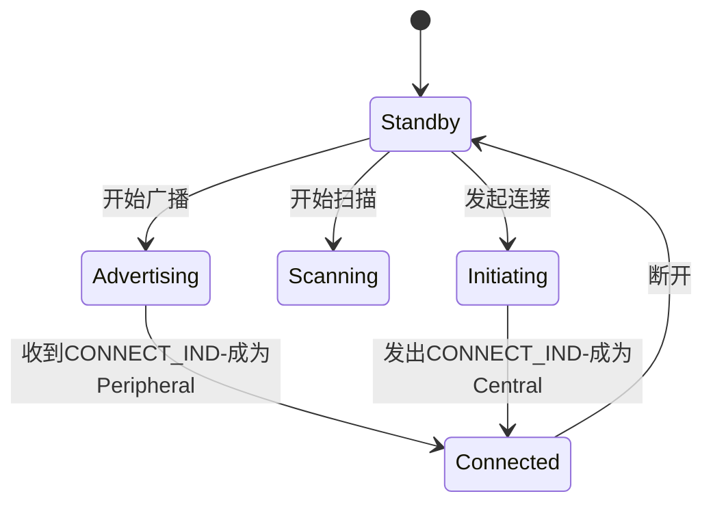
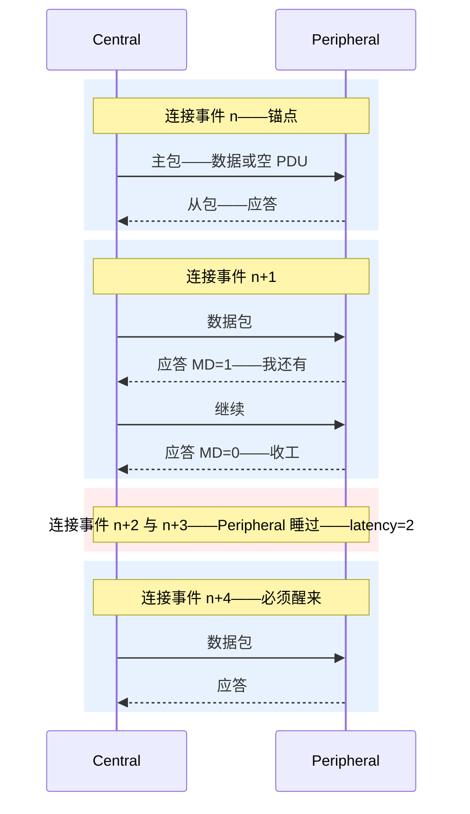

## 1. 链路层状态机

**LL(Link Layer, 链路层)** 是 BLE 最核心的一层:一台状态机,管理广播、扫描、连接、跳频、加密与重传。五种基本状态:



| 状态 | 角色 | 干什么 |
| ---- | ---- | ------ |
| Standby | - | 待机,不收不发 |
| Advertising | Broadcaster / Peripheral | 在 37/38/39 信道发广播,或回应扫描请求 |
| Scanning | Observer / Central | 被动监听广播,或主动发 SCAN_REQ 索要更多数据 |
| Initiating | Central | 监听目标广播并回 CONNECT_IND 建立连接 |
| Connected | Central / Peripheral | 在 37 个数据信道上按连接参数跳频收发 |

**角色与状态的关系**:Broadcaster/Observer 只用广播态与扫描态;Peripheral(外围)= 广播态等人连;Central(中心)= 扫描 + 发起连接。同一设备可以同时处于多个状态(4.1 起放宽),例如手机一边连着手环一边广播自己。

## 2. 设备地址

48 位,两类四种:

| 类型 | 值特征 | 说明 |
| ---- | ------ | ---- |
| Public Address(公有地址) | IEEE 分配,全球唯一 | 需付费购买,多数嵌入式产品不用 |
| Random Static(随机静态地址) | 高两 bit 为 11,其余随机 | 上电不变或每次复位重生成,最常用 |
| Non-resolvable Private(不可解析私有地址) | 高两 bit 为 00 | 定时轮换的假地址,无法追溯身份 |
| Resolvable Private Address, RPA(可解析私有地址) | 高两 bit 为 01 | 由 IRK 生成,只有"认识你"的对端能还原——隐私核心机制 |

RPA 的生成与解析:48 位地址分两段——**高 24 位是随机数 prand,低 24 位是哈希 hash = ah(IRK, prand)**。对端持有配对时交换的 IRK(Identity Resolving Key),用收到地址里的 prand 算一遍哈希、与低 24 位比对,一致即确认"这还是我认识的那个设备"。手机默认使用 RPA,这就是为什么抓包看到的手机地址总在变。

## 3. 广播(Advertising)

### 3.1 广播分组与广播类型

- 广播只在 37/38/39 三个信道上发,每个广播事件(Advertising Event)依次在三个信道各发一次,外加 0-10 ms 随机延迟(advDelay)抗持续碰撞。
- **广播间隔(Advertising Interval)**:20 ms - 10.24 s。间隔越长越省电、被发现越慢。
- 4.x 传统广播( Legacy Advertising )的五种 PDU:

| PDU | 广播类型 | 谁用 |
| --- | -------- | ---- |
| ADV_IND | 可连接、可扫描、无定向 | 最常见,手环、传感器 |
| ADV_DIRECT_IND | 可连接、定向(带对端地址) | 重连加速;高/低占空两种 |
| ADV_NONCONN_IND | 不可连接、不可扫描 | 纯广播信标 iBeacon |
| ADV_SCAN_IND | 不可连接、可扫描 | 附加数据放 SCAN_RSP |
| SCAN_REQ / SCAN_RSP | 主动扫描的请求与响应 | Observer → Broadcaster |

观察者发 **SCAN_REQ**,广播者回 **SCAN_RSP**(也携 31 字节数据)——这是广播信道上仅有的双向交互。

- 4.0/4.1 中广播 + 响应载荷各 **31 字节**;蓝牙 5.0 的**扩展广播(Extended Advertising)**把传统 PDU 变成"AUX 链"(ADV_EXT_IND → AUX_ADV_IND → AUX_CHAIN_IND),单包载荷 255 字节,链式最长约 1650 字节,还支持**周期广播(Periodic Advertising)**——大数据广播与 AoA/AoD、Mesh 采样都建立在它上面。

### 3.2 广播包解剖:从十六进制到语义

抓包器/Wireshark 看到的就是下面这种字节流。一条 ADV_IND 的链路层 PDU(前导、访问地址、CRC 由 PHY 处理,这里看 LL 部分):

```text
02 10 | BC 9A 78 56 34 12 | 02 01 06 06 09 42 4C 45 31 32
^^ ^^   ^^^^^^^^^^^^^^^^^^   ^^^^^^^^^^^^^ ^^^^^^^^^^^^^^^^^^^^^^
头  长度  AdvA 广播地址6B       Flags       完整设备名
```

逐字段读:

| 字节 | 值 | 解读 |
| ---- | -- | ---- |
| 0x02 | PDU 头 | type=0000b 即 **ADV_IND**;TxAdd=1 表示 AdvA 是随机地址;RxAdd=0 |
| 0x10 | Payload 长度 | 16 = 6(地址)+ 10(广播数据) |
| BC…12 | AdvA | **小端序**(最低字节在前),读出地址为 12:34:56:78:9A:BC |
| 02 01 06 | AD 结构 1 | Len=2,Type=0x01 Flags,值 0x06 = LE General Discoverable + BR/EDR Not Supported |
| 06 09 "BLE12" | AD 结构 2 | Len=6,Type=0x09 Complete Local Name,ASCII "BLE12" |

**读包三步法**:看头字节认 PDU 类型 → 按该类型的固定字段切长度 → 剩余部分按 AD 结构(Len+Type+Data)逐个剥。SCAN_RSP、CONNECT_IND、数据信道 PDU 全部同理,只是字段表不同——CONNECT_IND 里从 AA、CRCInit 到连接参数逐字段排开,解析器(和 btmon)做的就是查表翻译。做私有广播协议(传感器直出数据)时,载荷就挂在 0xFF Manufacturer Data 或 0x16 Service Data 里,按同样的 TLV 规则自己定义子结构。

### 3.3 广播信道的选择与过滤

广播/扫描受**过滤策略(Filter Policy)**控制:可用**白名单(White List)**限定"只接受/只扫/只连白名单设备",链路层直接在硬件里过滤,省主机功耗。

## 4. 扫描(Scanning)与发起连接(Initiating)

- **被动扫描(Passive Scanning)**:只收广播。
- **主动扫描(Active Scanning)**:收广播后回 SCAN_REQ 索要 SCAN_RSP,拿到设备名等附加数据。Android 的 `ScanSettings.SCAN_MODE_BALANCED` 等就是扫描窗口/间隔的预设组合。
- **扫描窗口 / 扫描间隔(Scan Window / Scan Interval)**:窗口 ≤ 间隔;占空比越高越快发现、越耗电。连续扫描(窗口=间隔)只在 INITIATING 与高功耗扫描时使用。
- **发起连接(Initiating)**:Central 监听目标地址的广播,收到 ADV_IND 后在**同一广播信道**回 **CONNECT_IND**(旧称 CONNECT_REQ),其中携带连接的全部初始参数——这是 BLE 连接建立的唯一"握手",此后双方直接进入连接态,不再有任何确认(连接可能因首包丢失而失败,靠 Supervision Timeout 收敛)。

## 5. 连接(Connection)

### 5.1 连接参数

CONNECT_IND 下发的参数决定了 Peripheral 未来全部作息:

| 参数 | 含义 | 典型值 |
| ---- | ---- | ------ |
| Access Address | 该连接专属随机相关字 | 随机 |
| CRCInit | CRC 初值 | 随机 |
| Hop Increment | 跳频步长(5-16) | 随机 |
| connInterval(Connection Interval, 连接间隔) | 两个连接事件的间隔,1.25 ms 的倍数 | 7.5 ms - 4 s,常用 15-50 ms |
| connLatency(Slave/Peripheral Latency, 从机延迟) | Peripheral 可连续睡眠掉的连接事件数 | 0 - 499 |
| connSupervisionTimeout(监督超时) | 多久没收到有效包判死 | 100 ms - 32 s,须 > 2×(1+latency)×interval |
| Transmit Window(Size/Offset) | 第一个连接事件的发包窗口 | 随机 offset 抗碰撞 |
| SCA(Sleep Clock Accuracy) | Central 时钟精度等级 | 影响 window 冗余 |

**连接事件(Connection Event)**:Central 在每个间隔起点(锚点 Anchor Point)发包,Peripheral 在收到后应答,一来一回最多 150 µs 间隔连续交换多个包,直到某方 MD=0 或窗口结束。Peripheral 若设了 latency,可以睡掉不被 Central 寻址的事件——**低功耗的第二个旋钮**(第一个是间隔本身)。



latency 的代价藏在图里:睡过的事件中 Central 发来的包只能等下一个醒着的事件处理,所以 latency 适合上行数据稀疏的传感器,不适合随时可能被下发的场景。

### 5.2 连接参数怎么调:从原理到 API

连接参数不是一锤子买卖:连接建立后,Central 或 Peripheral(经 L2CAP 信令请求)都可以发起更新,LL 层用 LL_CONNECTION_UPDATE_IND 协商、双方按新参数对齐后生效。三个时间旋钮的工程含义:

| 旋钮 | 调小 | 调大 | 决定权 |
| ---- | ---- | ---- | ------ |
| connInterval | 低时延、高功耗 | 低功耗、高时延,单事件打包数变少、吞吐上限变低 | Central 裁定 |
| connLatency | 不漏下行 | 睡得多,等效响应时延变为 interval × (1 + latency) | Central 裁定 |
| supervisionTimeout | 快速发现掉线 | 容忍瞬断 | 须恒大于 2 × interval × (1 + latency) |

从原理落到三个入口:

- **Android 客户端**:`BluetoothGatt.requestConnectionPriority(HIGH / BALANCED / LOW_POWER)`——公开 API 只有三档预设,大致对应 11-15 ms / 30-50 ms / 100-200 ms 量级,由栈向对端发起更新;
- **Peripheral 侧**:外设自己发起时走 L2CAP 信令(LE Connection Parameter Update Request)请 Central 裁定——典型如手环连上手机后立刻请求放宽间隔省电,交互高峰期再请求收紧;
- **抓包闭环**:HCI 日志里 `HCI_LE_Connection_Update` 命令、LL 侧 `LL_CONNECTION_UPDATE_IND`、生效后的 `LE Connection Update Complete` 事件构成证据链。排查"连上又秒断"先看这里:参数非法组合会被对端直接拒绝;部分 133 断连的根因是首连接事件丢包加监督超时过紧,日志表现为 Enhanced Connection Complete 之后没有任何 ACL 数据、随即 Disconnection Complete。

### 5.3 数据信道 PDU 与可靠性

数据分组按连接专属 AA 在数据信道上交互,PDU 头部关键字段:

| 字段 | 作用 |
| ---- | ---- |
| LLID | 区分:LL 数据续包 / 完整 L2CAP 起始包 / LL 控制 PDU |
| NESN / SN | 1-bit 序号 + 期望序号,构成**停等式 ACK 与重传**(重传按需、零开销 ACK) |
| MD(More Data) | "我还有数据",对端必须在同事件继续应答——突发吞吐的关键 |
| Length | 载荷长度;4.0/4.1 上限 27 字节,4.2 起 **DLE(Data Length Extension)** 放宽到 251 字节,大幅减少大块传输的分片开销 |
| MIC | 加密时链路层完整性校验(加密在 LL 做,上层无感) |

**NESN/SN 手算一遍**(初始双方 SN=0、NESN=0):

1. Central 发 SN=0 的包;Peripheral 收到,回包带 NESN=1——"期望你的下一个序号是 1",即隐式确认了 0 号包;
2. Central 看到对方 NESN=1 与自己将发的 SN=1 一致,确认已送达,发新包 SN=1;
3. 若 Peripheral 没收到(碰撞或丢包),它回包的 NESN 仍是 0;Central 发现自己要发的序号与对方期望不符,原样重发上一包——**整个 ACK 与重传就是这两个 bit 的比对与翻转**,协议里不存在独立的确认报文。

**信道选择算法**:Algorithm 1 = (lastChan + hop) mod 37,配合信道重映射绕开坏信道;5.0 的 **Algorithm 2** 基于访问地址的伪随机序列,跳频图更随机、更抗跟频与碰撞。连接期间 Central 周期性下发 **Channel Map**(AFH),动态剔除 Wi-Fi 占用信道。

### 5.4 加密与控制 PDU

连接建立后默认**明文**。Central 可随时发起 `LL_ENC_REQ` → 双方用 LTK 派生会话密钥,走 **AES-CCM** 链路层加密(LTK 等长期密钥来自配对过程),之后所有数据 PDU 带 MIC。其余控制 PDU 还负责:版本交换、特性交换、连接参数更新、信道地图更新、PHY 更新(切换 1M/2M/Coded)、MTU 无关的最小可用时间、数据包长度更新(DLE)等。

### 5.5 断连

- 主动断:任一方发 `LL_TERMINATE_IND`(带原因码,如 0x13 远端用户断开、0x08 连接超时)。
- 被动断:监督超时未收到有效包。手机上大量"神秘 133 错误"就是连接建立后首事件丢失/超时导致。

## 6. 等时信道(ISO)在链路层的位置

蓝牙 5.2 为 LE Audio 在 LL 增加了**等时信道(Isochronous Channels)**:CIS(Connected Isochronous Stream, 面向连接等时流)在连接事件旁开辟等时子事件传输有 deadline 的音频帧;BIS(Broadcast Isochronous Stream, 广播等时流)配合 BIG 在广播里周期发流,不重传、靠前向纠错与流内冗余兜底。链路层状态机因此新增了 ISO Broadcaster / Synchronized Receiver 等状态;等时数据"过期即弃",不为迟到帧无限重传。

## 7. 小结:链路层的设计巧思(原书视角)

原书第 7 章把 LL 的设计选择总结为一组"为什么这样设计",每条都值得回味:

- **高比特率、低开销**:1 Mbps 让同样的数据发射窗口更短;
- **单信道连接事件**:连接事件内不跳频,收发连续完成;
- **离线加密(Offline Encryption)**:加密计算在上一个连接事件空闲期完成,不占空口时间;
- **次速率连接事件(Subrating)**:快速建连后按需退化为稀疏事件(5.3 起成为正式特性 Conn Subrating)。
