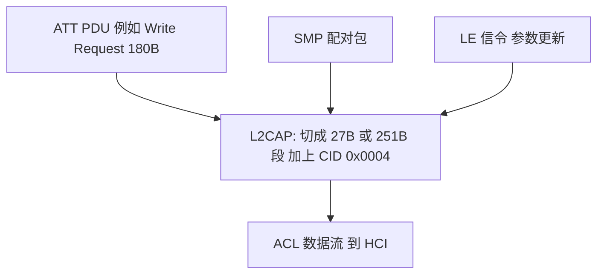

## 1. L2CAP 在 LE 里的角色

**L2CAP(Logical Link Control and Adaptation Protocol, 逻辑链路控制与自适应协议)** 位于 Host 侧最底层,职责朴素:

1. **信道复用**:用一个**信道标识(Channel ID, CID)** 区分上层协议,让 ATT、SM、信令共享一条 ACL 连接;
2. **分段与重组(Segmentation and Reassembly)**:把上层 PDU 切成 LL 能装下的片段,对端拼回;
3. **少量信令**:连接参数更新、信道建立等控制消息。

LE 里的 L2CAP 比经典蓝牙简单得多:**只用固定信道(Fixed Channels),不支持动态信道的全套复杂特性**——没有经典蓝牙的配置协商、重传模式,但 4 字节头(2 字节长度 + 2 字节 CID)与经典蓝牙保持一致。

## 2. 固定信道(Fixed Channels)

| CID | 承载的协议 |
| --- | ---------- |
| 0x0001 | 经典蓝牙 L2CAP 信令信道(LE 不用) |
| 0x0004 | **ATT**(属性协议) |
| 0x0005 | **LE L2CAP 信令信道** |
| 0x0006 | **SMP**(安全管理协议) |
| 0x0007 | **EATT**(增强属性协议, 5.2 起) |

固定信道"随连接自动存在、无需建立"——这就是 BLE 连接建立后立刻能发 ATT 的原因,零信令开销。

## 3. 分组格式

```text
| Length 2B | CID 2B | 上层 PDU(信息载荷)|
```

- Length 只计信息部分;链路层 27 字节(4.x 默认)或 251 字节(DLE 后)的 LL 载荷里,**第一个包带 L2CAP 头,后续续包靠 LLID 区分**,重组由 L2CAP 完成;
- LE 上 L2CAP 载荷上限即 **65535 字节**,实际受 ATT MTU 与 LL 缓冲约束——这就是"MTU 协商"横跨 ATT/L2CAP/LL 三层的原因。

## 4. LE 信令信道(CID 0x0005)

信令 PDU 格式:`Code 1B + Identifier 1B + Length 2B + Data`。Identifier 匹配请求与响应。LE 定义的命令不多:

| Code | 命令 | 用途 |
| ---- | ---- | ---- |
| 0x01 | Command Reject | 拒绝不认识的命令 |
| 0x12 | LE Connection Parameter Update Request | Peripheral 请求更新连接参数(参数直接内嵌) |
| 0x13 | LE Connection Parameter Update Response | Central 回复接受/拒绝 |
| 0x14/0x15 | LE Credit Based Connection Request/Response | 5.2:建立面向连接信道(LE Audio 用) |
| 0x16 | LE Flow Control Credit | 信用流量控制 |

**为什么"连接参数更新"走 L2CAP 而不走 HCI?** 因为这个方向是 **Peripheral(外侧)发起请求**——外设往往没有到对端 Controller 的直接通道,借主机信令转交;Central 随后用 LL 控制过程真正生效。(4.0 时代此信令有竞态问题,4.1 规范修订了流程,原书成书时对此有专门吐槽。)

## 5. 分段重组与流量控制

- **分段**:上层 PDU(如一个 247 字节的 ATT Write)按 LL 载荷切成多段,首段带 L2CAP 头;
- **重组**:按 LLID(首包/续包)与序列拼装,不校验顺序(LL 已保证按序递交);
- **LE 信用流量控制(LE Credit Based Flow Control)**:5.2 引入,面向连接信道(L2CAP LE COC)按"信用(credit)"发放发送额度,接收方用 `LE Flow Control Credit` 归还——为 LE Audio 控制流与 GATT 之上的自定义大流量信道服务。

## 6. 一图收尾



LE 的 L2CAP 记三点就够:**CID 0x0004 跑 ATT、0x0005 跑信令、0x0006 跑 SMP;分段重组;参数更新是唯一高频信令**。真正的复杂性都不在这一层。
