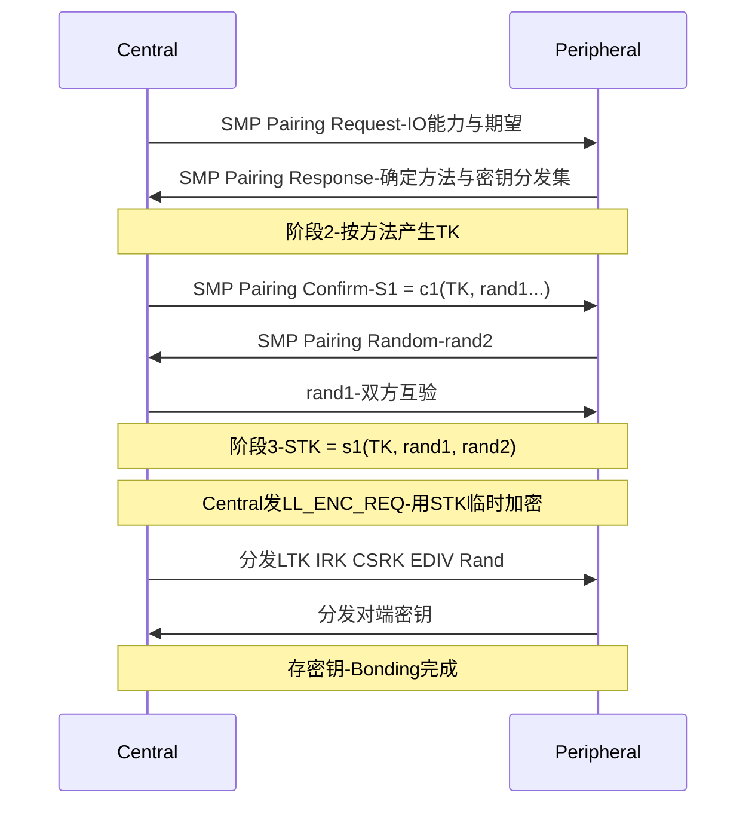

## 1. 安全概念

BLE 的安全由 Host 侧的 **SM(Security Manager, 安全管理器)** 协议(经 L2CAP CID 0x0006)与链路层加密共同实现。先厘清五个概念:

- **认证(Authentication)**:确认"你是谁"——密钥持有人身份;
- **授权(Authorization)**:确认"你可以做这件事"——权限;
- **完整性(Integrity)**:数据没被篡改(MIC 校验);
- **机密性(Confidentiality)**:数据没被第三方读懂(AES-CCM 加密);
- **隐私(Privacy)**:地址不可追踪(RPA 可解析私有地址)。

两个流程术语:

> **配对(Pairing)**:临时协商出加密密钥并启用链路加密的一次性过程。
> **绑定(Bonding)**:把配对产生的密钥存下来,下次直连加密(重连不再重新配对)。

## 2. 配对方法与 IO 能力

配对采用哪种"身份对账"方法,由双方 **IO Capabilities(输入输出能力:显示/是否可确认/键盘/none)** 协商决定:

| 方法 | 前提 | 防中间人 MITM |
| ---- | ---- | -------------- |
| Just Works(直接配对) | 双方都没像样的 IO | ✗ |
| Passkey Entry(密码输入) | 一方显示 6 位数字,另一方输入 | ✓ |
| Numeric Comparison(数字比较) | 双方都能显示且可确认,仅 LE Secure Connections | ✓ |
| OOB(Out of Band, 带外) | 密钥材料经 NFC/QR 等旁路传递 | ✓ |

Just Works 不防中间人,但加密本身照常工作——多数"无屏无键"传感器只能用它,这是 BLE 安全模型里最重要的工程折中。

## 3. LE Legacy 配对(4.0/4.1)

经典三阶段流程:



关键点:

- **TK(Temporary Key, 临时密钥)128 位**:Just Works 时全 0;Passkey 时由 6 位数字重复填充;OOB 时直接就是带外数据。**TK 的熵决定了被暴力破解的难度**——Passkey 6 位数字仅约 20 bit 熵。
- **STK(Short-Term Key, 短期密钥)**:用 TK 加密双方的随机数派生,仅用于"配对过程本身"的临时加密;
- **密钥分发(Key Distribution)**:临时加密建立后,双方互发长期密钥,存档供下次直连。

## 4. LE Secure Connections(4.2 起)

Legacy 配对的 TK 熵太低,4.2 引入 **LE Secure Connections**:配对直接用 **ECDH(P-256)椭圆曲线 Diffie-Hellman** 交换公钥,双方独立算出共享密钥:

- 密钥熵 128 bit,TK 不再存在;
- 解锁 **Numeric Comparison**:双端各显示 6 位数字,用户比对"相同才确认",真正防住 MITM;
- 派生 LTK、数学上验证对方公钥;Mac/钥匙类应用应强制使用 SC;
- 5.2 起还支持 **Secure Connections Only 模式**(拒绝 legacy 设备)。

## 5. 密钥全家福

| 密钥 | 用途 |
| ---- | ---- |
| **LTK(Long-Term Key)** | 连接加密主密钥,加密时配合 Rand/EDIV 使用(SC 场景直接持有) |
| **STK** | 配对过程临时密钥,不保存 |
| **IRK(Identity Resolving Key)** | 生成与解析 RPA 私有地址 |
| **CSRK(Connection Signature Resolving Key)** | 数据签名(ATT Signed Write,无连接历史时的完整性) |
| EDIV / Rand | 在 legacy 配对里定位 LTK 的"索引"(加密请求时随 LL_ENC_REQ 传递,对端据此查表) |

**加密的启动与 LTK 的使用**:重连后 Central 发 `LL_ENC_REQ(Rand, EDIV)`,Peripheral 查出对应 LTK 回复,双方各自派生会话密钥(AES-CCM,逐包计数器);若 Peripheral 不认识该 Rand/EDIV,配对信息已失,只能重配——这是"手机删了配对、设备还留着"时连不上的根因。

## 6. 地址解析与隐私闭环

配对时交换 IRK 后:

1. 手机重连时广播用 RPA(定时轮换,如 15 分钟);
2. 设备端用保存的 IRK 试算 hash 验证"是那台手机";
3. 反之设备广播 RPA,手机解析后直接自动重连。

这套机制让抓包者无法长期跟踪同一设备。**地址解析列表(Resolving List)** 在 Controller 硬件里完成,配合"定向广播 + RPA"能把重连功耗降到最低。

## 7. 数据签名(可选能力)

无加密连接上,用 CSRK 对 ATT Write 命令 + 32 位计数器做签名(`Signed Write Command`),接收方验证签名与计数器递增(防重放)。实践中少用——多数产品选择直接走加密连接。

## 8. 配对过程的可观测面(从原理到日志)

SMP 与 LL 加密的每一步都能在 HCI 日志(btsnoop / btmon,Wireshark 过滤 `btsmp`)里逐条对上。一次"配对 + 断开 + 重连加密"的时间线:

```text
btsmp      Pairing Request / Response        IO 能力与方法协商——确定 Just Works 还是 Passkey
btsmp      Pairing Confirm / Random ×2       c1 承诺与随机数互验
bthci_evt  Encryption Change                 STK 加密生效——进入密钥分发 LTK/IRK/CSRK
... 断开 ... 重连 ...
bthci_cmd  LE Start Encryption——Rand 与 EDIV  Central 用 Rand/EDIV 选定 LTK
btle       LL_ENC_REQ / LL_START_ENC 握手    双方用 LTK 派生会话密钥
btatt      Exchange MTU / Read By Group      加密后业务流量恢复
```

卡点的读法(三段式定位):停在 Confirm 之前是方法协商问题;Confirm 之后加密失败是 TK/密钥计算不一致;加密完成但业务读写报错(0x05/0x0F)是权限等级问题——基本覆盖所有配对故障。

**Android 侧的落点**:

- 配对由系统发起,App 用 `BluetoothDevice.createBond()` 请求;绑定记录与密钥在系统蓝牙数据里,`adb shell dumpsys bluetooth_manager` 能列出每台已绑定设备与密钥概要;
- "系统设置里取消配对"只清手机侧;设备侧 LTK 仍在,重连时 `LL_ENC_REQ` 索引不到密钥即失败——解法是双侧都删绑(设备恢复出厂或删绑),这是第 5 节末尾"手机删了配对、设备还留着"场景的工程闭环;
- 要在 Wireshark 里解密加密后的 `btle`/`btatt` 帧,需拿到 LTK 填入 Bluetooth 协议首选项的密钥表(调试固件可导出);密文本身不可离线破解。

## 9. 排障与选型清单

**配对故障对照表**:

| 现象 | 常见根因 | 查证手段 |
| ---- | -------- | -------- |
| 一连上就触发配对、失败后循环弹窗 | 双侧绑定记录不同步(一侧删了另一侧没删) | 日志看 LL_ENC 被拒;双侧删绑重试 |
| 配对方式与产品预期不符(该输密码的没弹) | IO 能力声明与期望的方法不一致 | 读 Pairing Request/Response 里的 IO Capabilities |
| 重连时搜不到或连不上 | RPA 轮换后对端解析失败(IRK 未存或解析列表未启用) | 看广播地址是否总在变;查 Resolving List |
| 加密连接里部分特征读写报错 | 特征要求认证等级,而配对只到了 Just Works | ATT 错误码 0x05/0x0F;改用带 MITM 防护的方法 |

**选型红线**:

- 数字钥匙/门禁/支付类场景:强制 LE Secure Connections + Numeric Comparison 或 OOB;
- 加密强度:AES-128-CCM 至今未破,但**安全边界永远在配对信道**(Just Works 可被 MITM)而非加密算法本身;
- 调试入口:`HCI_LE_Start_Encryption`、`LL_ENC_REQ`、SMP 的 Confirm/Random 序列能把 99% 的配对问题定位到具体环节。
