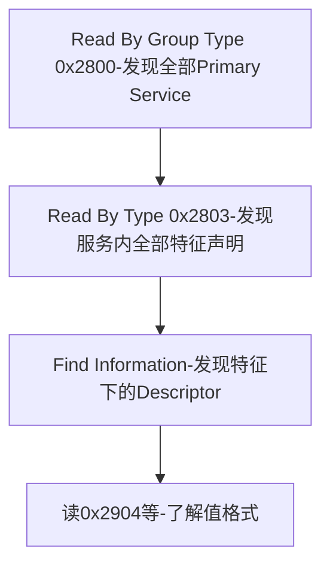
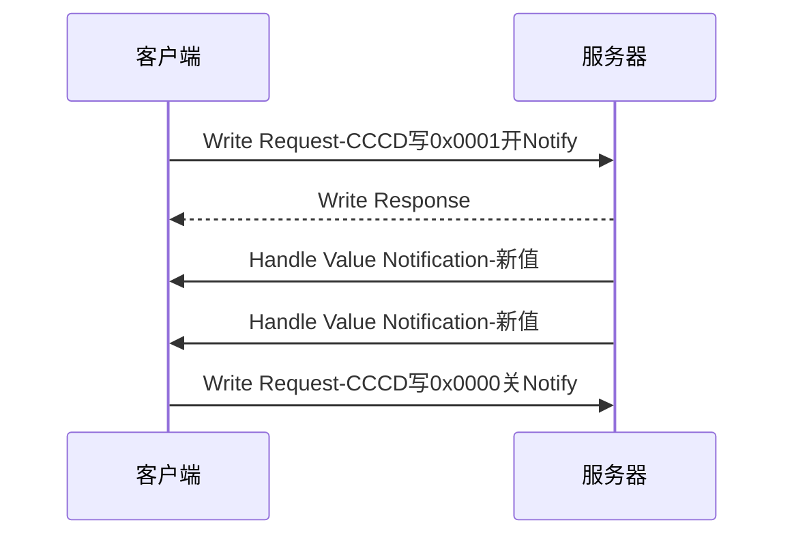
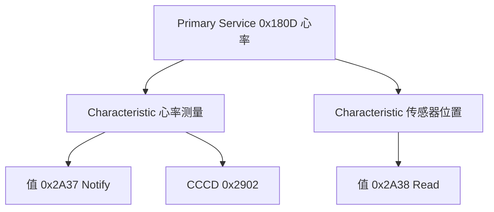

## 1. GATT:给属性表立规矩

**GATT(Generic Attribute Profile, 通用属性规范)** 规定属性如何组织成**服务(Service)与特征(Characteristic)**,以及客户端发现、读写、订阅的标准流程。它不新增报文——所有 GATT 流程最终都映射为 ATT PDU,只是规定了"怎么用 ATT 才互通"。

**角色**:GATT 服务器持有属性表,GATT 客户端发起操作。服务器/客户端与 Central/Peripheral 相互独立,但典型组合是 Peripheral 当服务器、Central 当客户端。

## 2. UUID 体系

- **16 位 UUID** 由 SIG 分配(如 0x180F 电池服务、0x2A19 电量特征),实际是 128 位基础 UUID 的低 16 位:
  `0000xxxx-0000-1000-8000-00805F9B34FB`;
- **128 位自定义 UUID** 用于私有协议(厂商随意生成,不与 SIG 冲突);
- 16 位是"缩写"而非另一套体系——互转零成本。拿现成 SIG 分配能白嫖生态:手机系统 UI 会直接把 0x180F 显示成电量。

## 3. 服务、特征、描述符

| 概念 | UUID 类型 | 作用 |
| ---- | --------- | ---- |
| Service(服务) | 0x2800 Primary / 0x2801 Secondary | 一组相关功能的属性集合,带句柄区间 |
| Included Service(包含服务) | 0x2802 | 服务间复用/引用 |
| Characteristic Declaration(特征声明) | 0x2803 | 元数据:属性位 + 值句柄 + 值类型 |
| Characteristic Value(特征值) | 该特征自己的 UUID | 真正的数据本体 |
| Descriptor(描述符) | 0x29xx 系列 | 特征的附加配置/说明 |

**特征属性位(Properties)**(声明里的第 1 字节):

| 位 | 属性 | 含义 |
| -- | ---- | ---- |
| 0x01 | BROADCAST | 可经广播出(配合 SCCD) |
| 0x02 | READ | 可读 |
| 0x04 | WRITE WITHOUT RESPONSE | 可无响应写(Write Command) |
| 0x08 | WRITE | 可写(Write Request) |
| 0x10 | NOTIFY | 可通知 |
| 0x20 | INDICATE | 可指示 |
| 0x40 | AUTHENTICATED SIGNED WRITES | 签名写 |
| 0x80 | EXTENDED PROPERTIES | 还有扩展属性位(0x2900) |

**常用描述符**:

| UUID | 名称 | 作用 |
| ---- | ---- | ---- |
| 0x2900 | Characteristic Extended Properties | 扩展属性位 |
| 0x2901 | Characteristic User Description | 人类可读说明 |
| 0x2902 | **CCCD**(Client Characteristic Configuration Descriptor) | 通知/指示总开关,客户端写它来订阅 |
| 0x2903 | Server Characteristic Configuration | 广播开关 |
| 0x2904 | Characteristic Presentation Format | 值的格式/单位(如温度 ℃) |

## 4. 发现流程(Discovery)

一次完整的"摸清对端数据模型"按固定套路走,每步都是 ATT 读操作:

| 步骤 | ATT 操作 | 返回 |
| ---- | -------- | ---- |
| 1. 发现服务 | Read By Group Type(type=0x2800) | 服务区间句柄 + 服务 UUID |
| 2. 发现特征 | Read By Type(type=0x2803, 在服务区间内) | 声明:属性位 + 值句柄 + 特征 UUID |
| 3. 发现描述符 | Find Information(值句柄之后到服务末尾) | 句柄 + 描述符 UUID |
| 4. 按需发现包含服务 | Read By Type(type=0x2802) | 被包含服务的句柄区间 |

## 5. 读写与订阅流程

### 5.1 读特征值

`Read Request(值句柄)` → 服务器回值或错误。值长于 MTU-1 时客户端再发 `Read Blob` 带偏移分段读。

### 5.2 写特征值

- **Write Request**:可靠写,收 `Write Response` 或错误;写灯的开关这类"必须成功"的操作用它;
- **Write Command**:不回包、低延迟,写高频数据流(如遥控器的按键流)用它;
- **Long Write**:值超过 MTU-3 时,Prepare Write 攒段 + Execute Write 一次生效。

### 5.3 订阅 Notification / Indication

- CCCD 写 **0x0001 开 Notification、0x0002 开 Indication、0x0003 两者**;
- **Notification 不确认**(快、可能丢),**Indication 必须回 Confirmation**(慢、可靠,同时只能挂一个);
- 服务器"愿意推"与客户端"要接收"由 CCCD 双向确认——**忘记写 CCCD 是新手收不到通知的第一大原因**。

## 6. GATT 过程与 ATT PDU 的映射

| GATT 过程 | 底层 ATT PDU |
| --------- | ------------ |
| Discover All Primary Services | Read By Group Type Request |
| Discover Characteristics by UUID | Read By Type Request |
| Discover All Characteristic Descriptors | Find Information Request |
| Read Characteristic Value | Read / Read Blob |
| Write Characteristic Value | Write Request / Write Command / Prepare+Execute |
| Characteristic Value Notification | Handle Value Notification |
| Characteristic Value Indication(含确认) | Handle Value Indication + Confirmation |
| Read Characteristic Descriptors | Read / Read Blob |

## 7. 特殊服务与工程要点

- **Service Changed(0x2A05,属 GAP 服务)**:固件升级改变了属性表布局后,服务器用它(带句柄区间)通知老客户端"表变了,重新发现"。Apple/Android 对它有额外强约定;
- **Database Hash / Client Supported Features(5.x)**:新一代"表变了"通知机制,逐步替代 Service Changed;
- **设计自定义服务时**:特征粒度按"一次读写一个完整语义值"切;高频推送用 Notify 而不是 Indicate;写命令方向避免需要应答语义却用 Write Command;
- **MTU 影响**:通知单包 = MTU-3;要推大对象(OTA 固件块)先协商 MTU 与 DLE,吞吐可提升一个数量级;
- **权限标注**:需要加密的特征在属性表声明加密要求,未加密连接访问会得到 0x05/0x0F 错误码——客户端应据此触发配对。

## 8. 动手设计:一个自定义服务的完整过程

以"智能灯控制"为例走一遍设计流程——这是从"看懂协议"到"做出产品"的关键一步。

**第 1 步:定语义,再定属性**。先列应用需要的状态与操作:读灯的状态、改灯的状态、灯要主动上报状态变化、读固件版本。逐条映射到特征:

| 需求 | 特征 | 属性位 | 理由 |
| ---- | ---- | ------ | ---- |
| 读状态 | Light State | READ + NOTIFY | 轮询与推送双通道 |
| 写控制 | Light Control | WRITE + WRITE WITHOUT RESPONSE | 关键指令要确认(带响应写),高频调节要低延迟(无响应写) |
| 读版本 | Firmware Version | READ | 只读元数据 |

**第 2 步:定值格式**。Light State / Control 共用一种结构:`[开关 1B][亮度 1B][色温 2B little-endian]`,固定 4 字节。要点:

- **定长优先**:MTU 变化、分片与否都不影响解析;
- 字节序写进文档(建议 little-endian,与协议栈一致);
- 留扩展位(如最高 bit 定义为"扩展标志")而不是改结构。

**第 3 步:排属性表**(128 位自定义 UUID 略写为 xxx1、xxx2…):

| Handle | Type | 内容 | 权限 |
| ------ | ---- | ---- | ---- |
| 0x0100 | 0x2800 Primary Service | Light Service(xxx0) | R |
| 0x0101 | 0x2803 Declaration | 0x12(READ+NOTIFY),值句柄 0x0102,类型 xxx1 | R |
| 0x0102 | xxx1 Light State | 4 字节状态 | R,Notify;**要求加密** |
| 0x0103 | 0x2902 CCCD | 通知开关 | R/W |
| 0x0104 | 0x2803 Declaration | 0x0C(WRITE 两种),值句柄 0x0105,类型 xxx2 | R |
| 0x0105 | xxx2 Light Control | 4 字节控制 | W,要求加密 |
| 0x0106 | 0x2803 Declaration | 0x02,值句柄 0x0107,类型 xxx3 | R |
| 0x0107 | xxx3 Firmware Version | ASCII | R |

**第 4 步:定权限与安全**。控制与状态特征要求加密连接(未加密访问返回错误码 0x0F,触发客户端发起配对);版本信息公开可读——把"要不要加密"当成每个特征的独立设计项。

**第 5 步:定行为细节**。写 Control 后灯是否立即回执(带响应写的 Response 即回执;无响应写则靠 State 的 NOTIFY 反馈)?状态变化是推送新值还是推 diff?多客户端同时订阅时 CCCD 与广播标志怎么维护?这些答案不进协议,但决定实现质量。

**第 6 步:验证**。用 nRF Connect 之类通用客户端走一遍:发现服务 → 读状态 → 订阅 → 无响应写调亮度(观察通知回流的节流)→ 断开重连(绑定后权限与 CCCD 持久化是否符合预期)。通用客户端测得顺,说明属性表设计是"自解释"的;测不顺,通常是语义切分或权限设计有问题。

## 9. GATT 一图流

GATT = ATT 的"目录学":**服务是章,特征是节,值是正文,描述符是脚注,CCCD 是订阅开关**。所有 BLE 应用协议(健康、健身、HID、电池、LE Audio 的音量控制……)都只是这张目录的具体实例。
