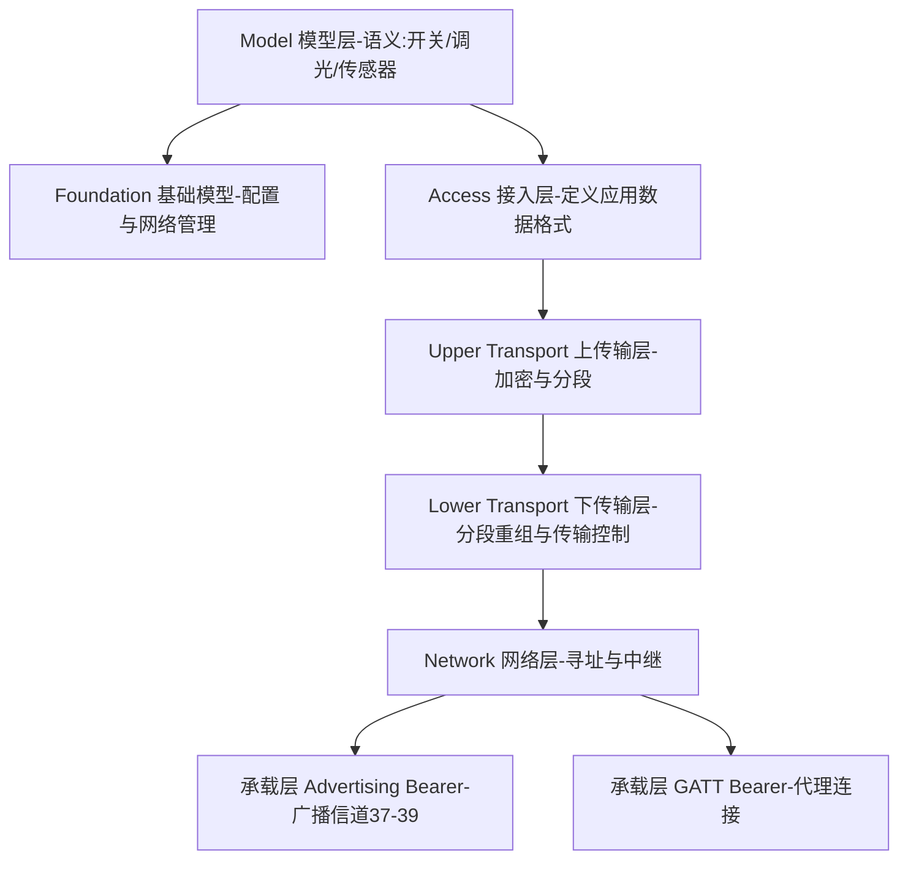
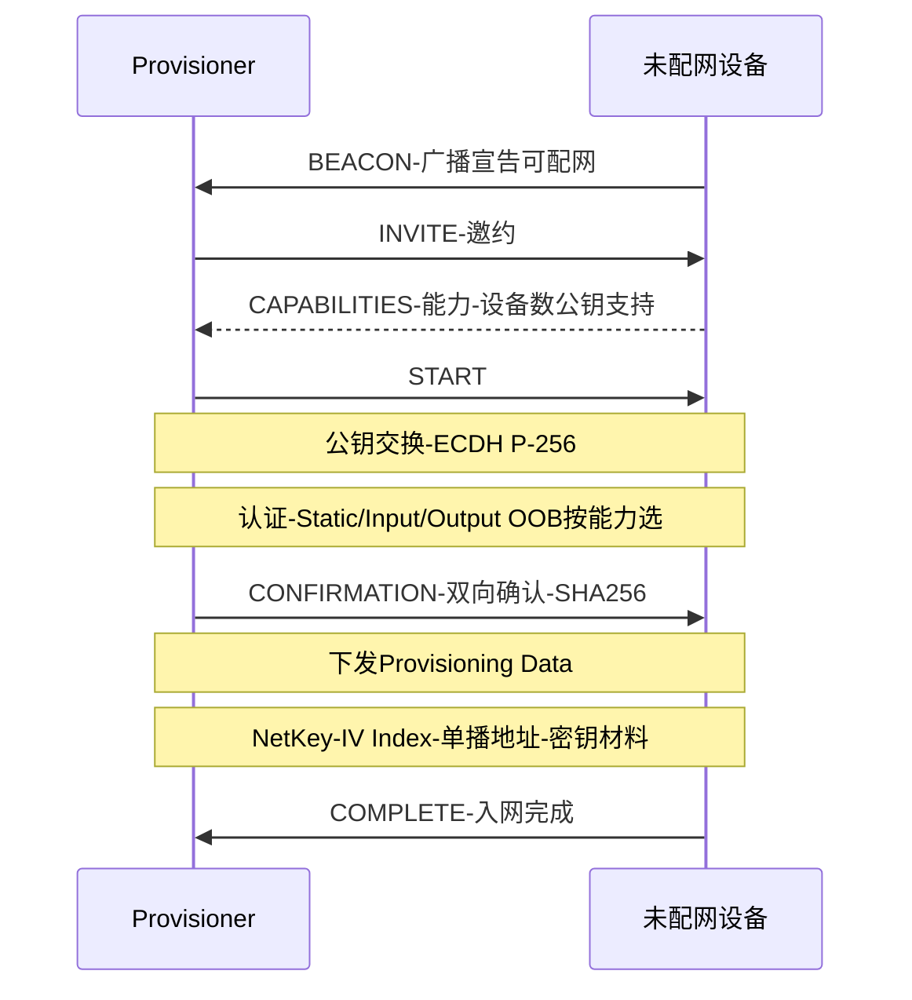

## 1. Mesh 是什么、不是什么

**蓝牙 Mesh(2017 年随 Mesh Profile 1.0 发布)** 是构建在 BLE 广播机制之上的**多对多网络**协议:照明、传感、楼宇自动化里成百上千个节点互相中继消息。它**不是新空口**——PHY/LL 原封不动,Mesh 报文就装在 BLE 广播包(或 GATT 连接)里;它也不是 BLE 连接的集合——**Mesh 网络里没有连接、没有 Central,只有洪泛**。

- 网络机制:**管理式泛洪(Managed Flooding)**——每个节点收到消息,检查缓存(见过就丢)、校验、然后原样再广播(TTL 减一),靠"全网都帮忙转发"换取零路由状态、零单点故障;
- 对比 BLE 连接:连接是点对点、可靠、有状态;Mesh 是全网投递、尽力而为、无状态——照明开关丢一包重按一次即可,但网络永不"断线"。

## 2. 协议栈分层



| 层 | 职责 |
| -- | ---- |
| Model | 具体应用语义:Generic OnOff、Light Lightness、Sensor……SIG 标准模型 + 厂商模型 |
| Foundation | 配置模型(Configuration Model)与健康管理,组网后的"网管" |
| Access | 应用层数据格式(Opcode + 参数)与 AppKey 加解密的边界 |
| Upper Transport | 应用数据加密 TransMIC、访问层 PDU 的分段(SAR)、Friend 缓存 |
| Lower Transport | 分段重组、传输控制(如 Friend 心跳) |
| Network | 24-bit 序列号、源/目标地址、TTL、NetKey 加密与混淆(Privacy)、中继判定 |
| Bearer | **Advertising Bearer**(广播信道收发)+ **GATT Bearer**(Proxy 连接里收发) |

## 3. 承载与代理(Proxy)

- **Advertising Bearer**:Mesh 报文装进 BLE 广播(AD Type 0x2A Mesh Message),跑在 37/38/39 信道——主力承载;
- **GATT Bearer + Proxy 节点**:手机不适合长期开广播监听,于是支持 **Proxy 特性**的节点同时维持一条标准 GATT 连接(代理服务 0x1828),把 Mesh 报文在"连接"里转发给手机。手机 App 连 Proxy 节点即可接入整个 Mesh 网络;
- **PB-ADV / PB-GATT**:两种配网(Provisioning)承载,分别走广播与 GATT。

## 4. 配网(Provisioning)

把"新设备"变成"网内节点"的过程,由 Provisioner(通常为手机 App)发起:



产出的关键材料:**NetKey(网络密钥)、设备的 Unicast Address(单播地址)、IV Index**。此后设备按配置模型被分配 AppKey、绑定模型、设置订阅——一切远程配置都走 Mesh 消息本身。

## 5. 寻址

| 地址类型 | 范围 | 说明 |
| -------- | ---- | ---- |
| Unicast(单播) | 0x0001 - 0x7FFF | 配网时分配,每设备唯一(含元素级) |
| Virtual(虚拟) | 0x8000 - 0xBFFF | 由 Label UUID 派生,跨设备逻辑分组 |
| Group(组播) | 0xC000 - 0xFFFE | 如"客厅灯组";固定特殊组:All Proxies 0xFFFC、All Friends 0xFFFD、All Relays 0xFFFE、All Nodes 0xFFFF |

发布(Publish)到一个地址,所有订阅(Subscribe)该地址的模型都收到——**发布订阅是 Mesh 的应用层通信范式**。

## 6. 安全模型

Mesh 的安全是"三层钥匙、逐层剥洋葱":

| 密钥 | 保护范围 |
| ---- | -------- |
| **NetKey**(网络密钥) | 网络层:中继与传输能校验、但看不到应用明文;派生 NID/加密钥/隐私钥 |
| **AppKey**(应用密钥) | 接入层:每个应用域一把(照明与门禁互不可读),绑定到模型 |
| **DevKey**(设备密钥) | 每节点唯一,配置模型专用——即使 AppKey 泄露,无法用它做配置 |

配套机制:**密钥刷新(Key Refresh)**平稳换钥踢节点;**IV Update** 防序号耗尽;**Secure Network Beacon** 声明网络状态;所有消息带 MIC 与序列号防重放。Mesh 的安全设计普遍被认为比早期 BLE 点对点配对更体系化。

## 7. 节点特性(可选能力)

| 特性 | 干什么 | 代价 |
| ---- | ------ | ---- |
| Relay(中继) | 转发收到的消息,扩展覆盖 | 常开收发,功耗高 |
| Proxy(代理) | 广播承载 ↔ GATT 承载互转,给手机当入口 | 需维持 GATT |
| Friend(朋友) | 为低功耗节点缓存消息 | 内存与电 |
| Low Power Node, LPN(低功耗节点) | 平时沉睡,按约定向 Friend 取件 | 依赖 Friend |

Friendship 建立:LPN 发 Friend Request,Friend 回 Offer(LPD 收件窗口等参数),之后 LPN 间歇性轮询——**Mesh 里做电池设备的唯一姿势**。

## 8. 报文飞行轨迹(一条开关消息)

```text
开关节点:
  Access: [Vendor/Generic OnOff opcode + 新状态]  --AppKey加密-->
  Upper Transport: + TransMIC,超长则SAR分段
  Network: + 序列号/SRC/DST/TTL,--NetKey加密与混淆--> Network PDU
  Bearer: 装进BLE广播  --> 37/38/39

中继节点: 收到→查缓存→TTL>1? → 原样重广播 - TTL-1
灯节点:   剥Network→校验、剥Transport→解密AppKey→Access→执行OnOff→按需回Status
```

TTL 上限 127(建议 5 以内控制风暴),消息缓存默认最少缓存最近若干条防环。

## 9. Mesh 1.1(2023)与生态现状

Mesh 1.1 的主要增强:**远程配网(Remote Provisioning)**、基于证书的配网(Certificate-based Provisioning)、私有信标(Private Beacons,抗被动跟踪)、子网桥接(Subnet Bridging)、定向转发(Directed Forwarding,为大规模网络提供非洪泛路径)、模型版本管理等。生态上,照明(含 NLC 网络化照明控制系列规范)是 Mesh 最成熟的落地域;截至 2026 年,Mesh Profile/Model 已迭代到 1.1.x。

## 10. 上手路径:从协议到可跑的 Demo

概念之外,动手的最短路径:

1. **硬件与固件**:两块 nRF52 开发板(或任意支持 Mesh 的 Zephyr 板卡),分别烧 Zephyr 的 `samples/bluetooth/mesh` 系列示例——onoff client 与 onoff server 各一块;
2. **配网**:手机装 nRF Mesh App,选中待配网设备(它正以未配网身份广播),完成 ECDH 公钥交换与 OOB/静态认证,App 下发 NetKey 与单播地址——第 4 节的配网流程在这里变成几次点击;
3. **点灯**:把 client 节点 Generic OnOff Client 模型的发布地址指向 server 的单播地址或组地址,按键触发;报文飞行轨迹就是第 8 节那条链;
4. **代码形态**:Zephyr 里一个 Model 用 `BT_MESH_MODEL_*` 宏族声明(opcode 分发表 + 回调 + 发布/订阅参数),与第 2 节分层里的 Model 层一一对应;Proxy 节点让手机经一条普通 GATT 连接进入 Mesh 网络;
5. **观测**:Mesh 报文在空口上是普通 BLE 广播,nRF Sniffer 抓下来 Wireshark 自带 Mesh 解析,Network PDU 逐层剥开。

## 11. 选型速查:连接 vs 广播 vs Mesh

| 需求 | 方案 |
| ---- | ---- |
| 手机与设备点对点(手环、耳机控制) | GATT 连接 |
| 一对多单向小数据(信标、传感器广播) | 广播 + 扫描 |
| 多设备互控、无网关自动化(照明、楼宇) | Mesh |
| 高吞吐音频 | LE Audio(连接 + ISO) |
