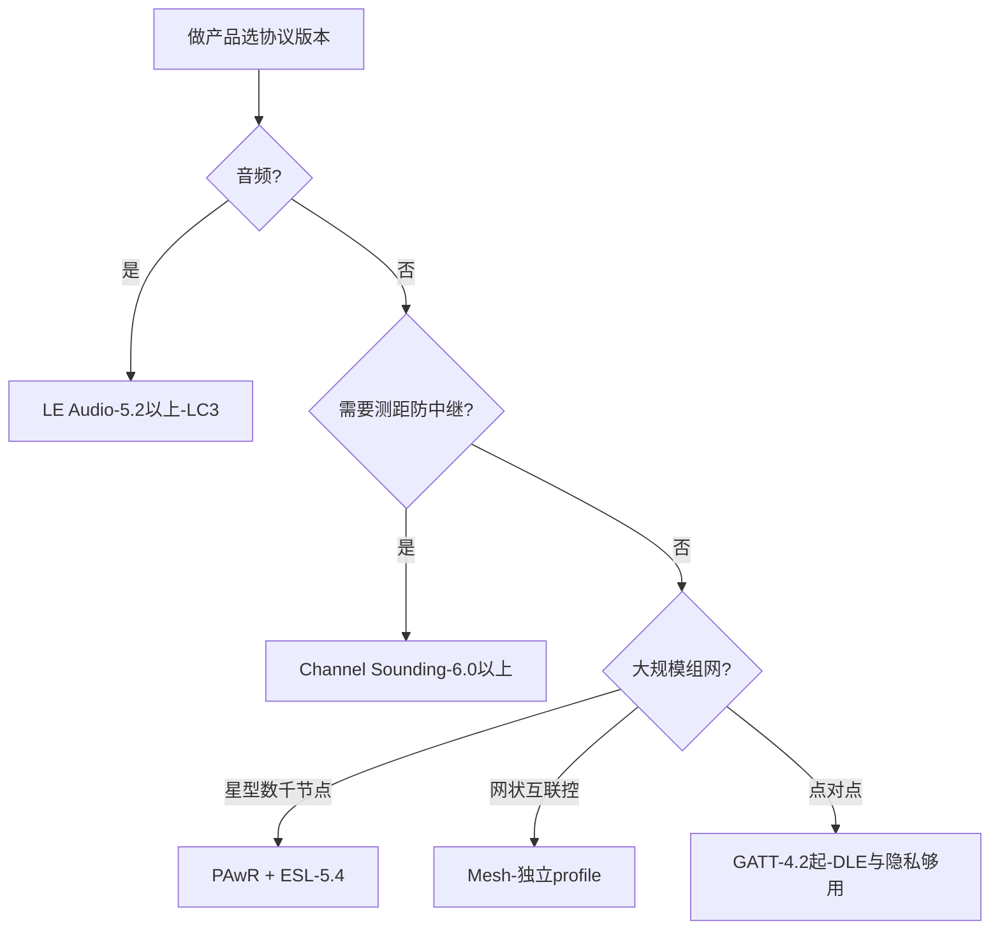

## 1. 主线:从 4.0 到 6.3

原书成书时(2012-2014)只有 4.0/4.1,十年间 BLE 的演进脉络一句话:**先把"管道"修宽(4.2-5.0),再把"方向"修准(5.1),再把"时间"修稳(5.2 音频),再把"网络"修密(5.4-6.x)**。

| 版本(年份) | 关键特性 | 一句话意义 |
| ----------- | -------- | ---------- |
| 4.0(2010) | BLE 诞生 | 广播 + 连接 + GATT |
| 4.1(2013) | 共存优化、多角色、4.1 服务 | 手机可同时主从 |
| 4.2(2014) | **DLE**(载荷 27→251B)、隐私 1.2(RPA)、**IPSP**(6LoWPAN) | 管道加宽、可直连 IPv6 |
| 5.0(2016) | **2M PHY / Coded PHY**、**扩展广播**、广播容量 ×8 | 高速与远距二选一,广播不再是 31 字节 |
| 5.1(2019) | **AoA/AoD 寻向**、广播重试、同步转移 | 亚米级定位(实时定位系统 RTS) |
| 5.2(2020) | **ISO 等时信道、CIS/BIS、LC3、功率控制** | LE Audio 三件套 |
| 5.3(2021) | Conn Subrating、信道分类增强、周期广播接收增强 | 连接灵活性与共存微调 |
| 5.4(2023) | **PAwR** 带响应周期广播、**加密广播数据**、GATT 安全等级 | 电子货架标签(ESL)级星型网络 |
| 6.0(2024) | **Channel Sounding**、决策广播过滤、监测广播者(Monitoring Advertisers)、帧间距更新 | 安全测距,数字钥匙的地基 |
| 6.1(2025) | 近距安全增强(SHIELD):未配对设备间经 CS 建立共享密钥 | 防中继攻击的"靠近即信任" |
| 6.2 / 6.3(2026) | 已采纳;高吞吐 HDT 相关能力推进中 | 持续演进 |

> 6.x 细节以蓝牙 SIG 官网为准;规范发布 → 芯片支持 → 系统支持 → 应用普及,通常每步滞后 1-2 年。

## 2. LE Audio:蓝牙音频的换血

LE Audio(基于 5.2 及以上)不是"又一个音频 profile",而是**替换经典蓝牙 A2DP/HFP 整套音频架构**的新体系,三大基石:

### 2.1 LC3 编解码器

**LC3(Low Complexity Communications Codec)** 取代沿用 20 年的 SBC:同码率音质更好,或**同等音质下码率减半**(如 160 kbps 双声道接近 SBC 345 kbps 的听感),支持 8/16/24/32/48 kHz 采样率,复杂度低到入门级耳机芯片也跑得动——**省码率就是省空口时间,就是省电**。

### 2.2 等时信道:ISO / CIS / BIS

| 机制 | 全称 | 场景 |
| ---- | ---- | ---- |
| **CIS** | Connected Isochronous Stream | 单播:耳机通话/听歌,重传+前向纠错兜底 |
| **CIG** | Connected Isochronous Group | 一组同步的 CIS(左右耳共享时钟基准) |
| **BIS** | Broadcast Isochronous Stream | 广播:一发多收,不重传,靠冗余兜底 |
| **BIG** | Broadcast Isochronous Group | 一组同步的 BIS(多声道广播) |

"等时(Isochronous)"的含义:数据带**时间期限**,过期的音频帧直接丢弃,不为它重传到底——这是音频(而非文件)传输的正确姿势。链路层为 ISO 开了新的分组类型与子事件调度。

### 2.3 profile 体系(摘自 SIG 已采纳规范,2026 现状)

| 规范 | 作用 |
| ---- | ---- |
| BAP(Basic Audio Profile) | 音频流的发现、编解码协商、建立 |
| ASCS / PACS / ASHA 等 | 音频控制服务 / 能力声明 / 助听器流 |
| CAP(Common Audio Profile) | 统一调度单播/广播/多设备场景 |
| TMAP(Telephony and Media Audio) | 通话+媒体的基础组合 |
| HAP(Hearing Access) | 助听器 |
| GMAP(Gaming Audio) | 游戏低延迟音频 |
| BASS / PBP | 广播音频扫描服务 / 公共广播(Auracast 体系) |
| Microphone Control / Telephone Bearer / Media Control | 麦克风/电话/媒体控制 |

### 2.4 Auracast 广播音频

**Auracast**(2023 年商用)把"BIS 广播 + 广播音频扫描服务(BASS)+ 公共广播规范(PBP)"包装成消费级能力:机场/健身房/电影院用发射器广播音源,任何人用 Auracast 耳机"选台"收听;也能把手机变成小发射台分享音乐。实践影响:助听器终于能在公共场所直接听广播——SIG 把它当作无障碍基础设施推广。

**多设备新姿势**:一台手机以 CIG 同时向多副耳机发同步 CIS;左右耳各自独立接收(不再需要主耳机转发给副耳);LC3 多语言广播让一场会议人人听到母语同传。

## 3. Channel Sounding(6.0):测距而非估算

BLE 定位历来靠 RSSI(功率估算),误差大且可被攻击。**Channel Sounding(CS,信道探测)** 用两种互补手段在**两个设备之间测出真实距离**:

- **PBR(Phase-Based Ranging, 相位测距)**:在多个信道上测量音调/数据载波的相位差,几何求解距离,精度可达分米/厘米级;
- **RTT(Round-Trip Time, 往返时间)**:测量信号往返时延,作为 PBR 的校验与安全层——**天线延迟攻击(中继攻击)会让 RTT 暴露异常**,这正是数字车锁、门禁需要的"真在场"证明。

配套的 **Ranging Service/Profile(1.0)** 规定了 GATT 层的使用方式。典型精度宣称约 ±0.5 m 内(受多径影响),显著优于 RSSI,且**内置中继攻击缓解**——"Find My"防丢 tag、数字车钥匙(CCC Digital Key)、门禁是第一批落地场景。Android 15 起已在系统 API 层引入 Channel Sounding 支持。

## 4. 面向大规模星型网络的 5.4:PAwR 与 ESL

- **PAwR(Periodic Advertising with Responses, 带响应的周期广播)**:一个广播者按时间表向**数千个**从设备发出子事件,从设备在指定的微秒级时隙内**回包**——半双工星型网络,从设备只需极窄的接收窗口;
- **加密广播数据(Encrypted Advertising Data)**:广播载荷可加密,密钥经 GATT 会话分发;
- **ESL(Electronic Shelf Label, 电子货架标签)** profile:一网关挂数千价签的标准答案——单颗纽扣电池撑数年。

## 5. 高吞吐 HDT(草案进行中)

**HDT(High Data Throughput)** 是 SIG 已公布的草案方向:在 2 Mbps 之上成倍提升吞吐(链路自适应、更高阶调制),目标场景是 DisplayPort 替代、AR/VR 与大文件传输。截至 2026 年尚在规范草案阶段,未随 6.2/6.3 全面定稿——追新需盯 SIG 官网。

## 6. 给开发者的版本决策树

兼容性铁律:**新特性只在"双方都支持"时可用,协商由 LL 特性交换与 GATT 服务发现完成**;广播侧新格式(扩展广播等)对旧扫描器不可见,不影响共存。
