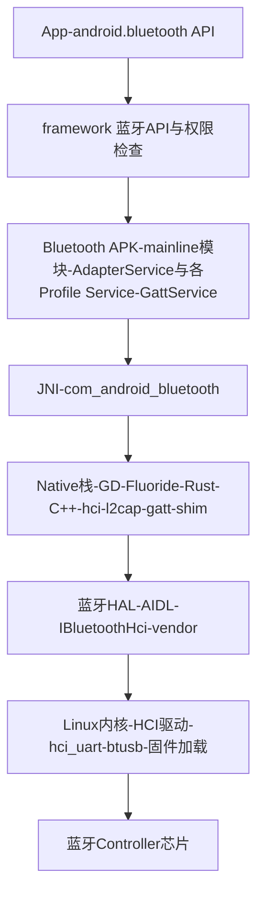

## 1. Android 蓝牙栈全景

Android 的蓝牙协议栈自成一派,历史沿革:早期(≤4.1)用 Linux **BlueZ**;4.2 起换成 Broadcom 开源的 **Bluedroid**(后称 **Fluoride**);Android 11 起逐步引入下一代 **GD(Gabeldorsche)** 栈并用 **Rust** 重写各层(内存安全),迁移以 shim 层兼容旧代码;Android 13 起蓝牙整体进入 **Project Mainline** 模块化(`com.android.bluetooth` APK,经 Google Play 系统更新独立升级)。ChromeOS 上还有平行的 Rust 栈 Floss,思路同源。



| 层 | 位置 | 说明 |
| -- | ---- | ---- |
| 应用 API | `android.bluetooth.*` | BluetoothAdapter / BluetoothLeScanner / BluetoothGatt / BluetoothGattServer / BluetoothLeAudio… |
| 框架层 | `packages/modules/Bluetooth/framework` | API 定义、权限校验、跨进程 Binder |
| 服务层 | `com.android.bluetooth` APK | AdapterService 总管 + 各 Profile Service(A2dp、Headset、Hid、LeAudio…)+ **GattService**(BLE 核心) |
| 原生栈 | `packages/modules/Bluetooth/system/stack` | Fluoride/GD 的 LL 之 Host 部分:L2CAP、ATT/GATT、SMP、HCI、连接管理,逐步 Rust 化 |
| HAL | `android.hardware.bluetooth` | AIDL 接口 IBluetoothHci,厂商实现(open/close/发送 ACL 与 HCI 命令/注册回调) |
| 内核 | `drivers/bluetooth` | `hci_uart`(H4/BCSP)、`btusb`(USB dongle)、rfkill 电源、固件下载 |
| 芯片 | Qualcomm/MTK/Broadcom/Realtek… | Controller 固件内跑 LL 与 PHY |

**关键认知**:Android 的 Host(协议栈)跑在应用处理器上,通过 UART/SDIO + HCI 与蓝牙芯片通信;手机上所有 BLE 流量最终都体现为 HAL 与内核间的 HCI 分组。

## 2. BLE 客户端 API 与内部流程

### 2.1 扫描

```kotlin
val scanner = BluetoothAdapter.getDefaultAdapter().bluetoothLeScanner
val settings = ScanSettings.Builder()
    .setScanMode(ScanSettings.SCAN_MODE_BALANCED)   // 扫描占空比预设
    .setCallbackType(ScanSettings.CALLBACK_TYPE_ALL_MATCHES)
    .build()
val filter = ScanFilter.Builder().setServiceUuid(ParcelUuid(UUID.fromString(
    "0000fe95-0000-1000-8000-00805f9b34fb"))).build()   // 小米 0xFE95 举例
scanner.startScan(listOf(filter), settings, object : ScanCallback() {
    override fun onScanResult(callbackType: Int, result: ScanResult) {
        val record = result.scanRecord          // 已解析的 AD structures
        val rssi = result.rssi
    }
})
```

内部路径:`BluetoothLeScanner` → Binder → **GattService** → **ScanManager**:

- **过滤卸载(Offloaded Filtering)**:ScanFilter 尽量下发到 Controller 硬件匹配(`LE Set Extended Scan` 等),省主机电;
- **批量卸载(Offloaded Batch)**:结果攒批上报;
- 硬件不支持或过滤不下来时退化为**软件过滤/无过滤扫描**;
- **节流与配额**:系统对同时扫描数量、后台扫描(Doze、屏幕 off)有严格限制,滥用会收到 `SCAN_FAILED_SCANNING_TOO_FREQUENTLY` 等错误——后台扫描优先用 `PendingIntent` + 关联设备(CompanionDeviceManager)。

### 2.2 连接与 GATT

```kotlin
val gatt = device.connectGatt(context, false, gattCallback, BluetoothDevice.TRANSPORT_LE)

override fun onConnectionStateChange(g: BluetoothGatt, status: Int, newState: Int) {
    if (newState == BluetoothProfile.STATE_CONNECTED) g.discoverServices()
}

override fun onServicesDiscovered(g: BluetoothGatt, status: Int) {
    val ch = gatt.getService(BATTERY_SERVICE_UUID)
        ?.getCharacteristic(BATTERY_LEVEL_UUID)
    gatt.readCharacteristic(ch)          // 读电量
}

override fun onCharacteristicRead(g: BluetoothGatt, c: BluetoothGattCharacteristic, status: Int) { /* value */ }
```

内部路径:`BluetoothGatt` → Binder(`IBluetoothGatt`)→ GattService → JNI → 原生 GATT 客户端(`btgatt_client`)→ ATT PDU → L2CAP → HCI ACL → 芯片。`discoverServices()` 对应的正是 ATT 的标准发现流程(Read By Group Type / Read By Type 连招),回调里拿到的是镜像成 Java 对象的属性表。

### 2.3 订阅通知(经典易错点)

```kotlin
gatt.setCharacteristicNotification(char, true)              // 只打开本地接收
val cccd = char.descriptors.first { it.uuid == CLIENT_CHARACTERISTIC_CONFIG } // 0x2902
cccd.value = BluetoothGattDescriptor.ENABLE_NOTIFICATION_VALUE  // 0x0001
gatt.writeDescriptor(cccd)                                   // 还必须写对端CCCD
```

`setCharacteristicNotification(true)` 只是本机开关;**不写 CCCD 就永远收不到 Notification**,这是 BLE on Android 的第一大坑。

### 2.4 连接参数与吞吐

- `requestConnectionPriority(CONNECTION_PRIORITY_HIGH/BALANCED/LOW_POWER)` → 触发对端做连接参数更新(间隔 11-15 ms / 30-50 ms / 100-200 ms 量级);
- `requestMtu(247)` 提升单包容量(要在**连接建立后、写大块数据前**调用);
- 吞吐三件套:2M PHY(`setPreferredPhy`)+ MTU 247 + DLE,缺一个都会明显掉速。

## 3. 权限演进

| Android 版本 | 扫描/连接所需权限 | 备注 |
| ------------ | ---------------- | ---- |
| 4.3-5.x | BLUETOOTH + BLUETOOTH_ADMIN | 安装即授予 |
| 6.0-11 | 上述 + **ACCESS_FINE_LOCATION**(扫描) | 广播 MAC 被视为位置信息 |
| 12+ | **BLUETOOTH_SCAN / BLUETOOTH_CONNECT / BLUETOOTH_ADVERTISE**(运行时权限) | 旧权限 `maxSdkVersion=30` 自动失效;SCAN 可加 `neverForLocation` 免定位声明 |
| 13+ | 通知类场景另需 POST_NOTIFICATIONS;LE Audio 设备配对框 | |

**适配要点**:12+ 上未授予 CONNECT 权限调用 API 直接 SecurityException;`neverForLocation` 要同时在 manifest 声明,且不得再从广播里解析位置信标。

## 4. LE Audio 与 Channel Sounding 在 Android 的落地

| 能力 | 版本 | 说明 |
| ---- | ---- | ---- |
| LE Audio 单播(耳机通话/媒体) | Android 13(API 33) | `BluetoothLeAudio` API;系统蓝牙设置可发现 LE Audio 耳机 |
| Auracast 广播助手(Broadcast Assistant) | Android 14(API 34) | `BluetoothLeBroadcastAssistant` 扫描/加入 Auracast 发射源 |
| Channel Sounding | Android 15(API 35)起 | `BluetoothChannelSounding` 等(初期多为 SystemApi/设备白名单,生态随 6.0 芯片铺开) |
| 助听器 HEARING AID | 10+ | 早于 LE Audio 的 ASHA 路径,13 起向 HAP 迁移 |

实现上 LE Audio 的 ISO 数据流由原生栈的 ISO 模块直通音频框架(AAudio/Audio HAL),应用侧只做控制面(发现、配对、音量)——**数据面不过应用层**。

## 5. GATT 服务器与外围模式

- `BluetoothGattServer.open()` + `addService()` 可让手机做外围:广播(`BluetoothLeAdvertiser`)+ 属性表;
- 典型用途:配网(把 Wi-Fi 凭据写进手机 GATT)、桌面端反连、自动化测试;
- 限制:广播数据 31 字节(legacy)、后台广播受省电策略限制(需前台服务)、部分机型厂商策略拦截。

最小可用的服务器骨架(建表、响应读请求、主动通知):

```kotlin
val serverCallback = object : BluetoothGattServerCallback() {
    override fun onConnectionStateChange(device: BluetoothDevice, status: Int, newState: Int) { /* 连接/断开 */ }

    override fun onCharacteristicReadRequest(device: BluetoothDevice, offset: Int,
                                              characteristic: BluetoothGattCharacteristic) {
        characteristic.value = currentStatusBytes()          // 按自己的状态填充
        server.sendResponse(device, BluetoothGatt.GATT_SUCCESS, offset, characteristic.value)
    }

    override fun onDescriptorWriteRequest(device: BluetoothDevice, offset: Int,
                                          descriptor: BluetoothGattDescriptor,
                                          preparedWrite: Boolean, responseNeeded: Boolean,
                                          value: ByteArray?, sentOffset: Int) {
        if (responseNeeded) server.sendResponse(device, BluetoothGatt.GATT_SUCCESS, 0, null)
        // 记住 CCCD 的值;之后即可对该设备 notifyCharacteristicChanged
    }

    override fun onNotificationSent(device: BluetoothDevice, status: Int) { /* 上一条通知发完,可发下一条 */ }
}

val server = bluetoothManager.openGattServer(context, serverCallback)   // 回调随 open 传入

val stateChar = BluetoothGattCharacteristic(
    STATE_UUID,
    BluetoothGattCharacteristic.PROPERTY_READ or BluetoothGattCharacteristic.PROPERTY_NOTIFY,
    BluetoothGattCharacteristic.PERMISSION_READ
).apply {
    addDescriptor(BluetoothGattDescriptor(
        UUID.fromString("00002902-0000-1000-8000-00805f9b34fb"),   // CCCD
        BluetoothGattDescriptor.PERMISSION_READ or BluetoothGattDescriptor.PERMISSION_WRITE
    ))
}

server.addService(BluetoothGattService(
    SERVICE_UUID, BluetoothGattService.SERVICE_TYPE_PRIMARY
).apply { addCharacteristic(stateChar) })

fun pushStatus(device: BluetoothDevice) {
    stateChar.value = currentStatusBytes()
    server.notifyCharacteristicChanged(device, stateChar, false)
}
```

注意点:`notifyCharacteristicChanged` 要求对端已写 CCCD 订阅;通知要跟随 `onNotificationSent` 节奏逐条发(协议栈不会无限缓冲);API 33/34 对回调与 `openGattServer` 引入了返回值/Executor 的新重载,新项目按新签名写。

## 6. 调试:HCI 日志是终极手段

1. 开发者选项 → 打开"启用蓝牙 HCI 信息收集日志";
2. 复现问题后拉取:`adb bugreport`,日志位于 `data/misc/bluetooth/logs/btsnoop_hci.log`;
3. Wireshark 打开,过滤 `bthci_cmd || bthci_evt || btle || btatt || btsmp`:

| 过滤器 | 看什么 |
| ------ | ------ |
| `bthci_evt.le_meta_advertising_report` | 广播是否发出/看到 |
| `bthci_evt.le_meta_enhanced_connection_complete` | 连接参数(handle/interval/latency) |
| `btsmp` | 配对过程卡在哪一步 |
| `btatt` | ATT 发现/读写/订阅的完整往返 |
| `bluetooth.eir.manufacturer` 等 | 广播字段解析 |

配套日志:`logcat -s bt_stack bluetooth_libbluetooth`、GattService 的 dump(`adb shell dumpsys bluetooth_manager`);常见 133(`GATT_ERROR`)连接失败,在 HCI 里几乎都能看到根因:广播被过滤、加密被拒(LTK 不匹配)、监督超时(参数与抗频干扰问题)等。

## 7. 工程经验清单

- **连接管理**:`connectGatt(autoConnect=true)` 走后台队列、慢而稳;false 则快但有超时;频繁连断先查连接参数与 GATT 操作排队(同一时间一个未完成请求,和 ATT 事务规则一致);
- **绑定与密钥**:系统设置里"取消配对"只删手机侧记录,设备侧仍留着旧密钥——表现是"永远连不上",把设备也删绑或重置;
- **Android 地址**:Android 手机对外多使用 RPA,设备端要用 IRK 解析;定向广播对 Android 需 Central Address Resolution 支持(现代机型默认支持);
- **厂商碎片化**:各家 ROM 的扫描节流、后台限制、LE Audio 开关行为差异大,量产前过一遍主流机型;
- **AOSP 视角**:蓝牙栈代码主线在 `packages/modules/Bluetooth`(gd/rust 重写在 `system/stack/gd` 与 `rust/` 目录推进),HAL 接口定义见 `hardware/interfaces/bluetooth`。
