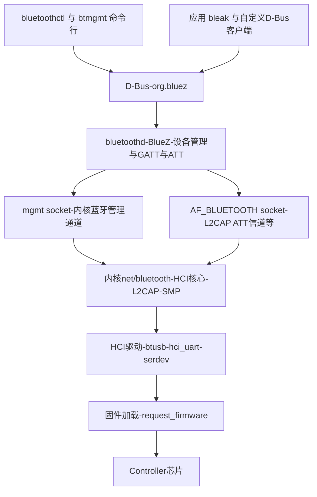

## 1. Linux 蓝牙全景:内核 + BlueZ 双层架构

Linux 是 BLE 最完整的开源参考实现:**内核(net/bluetooth)管 HCI、L2CAP、SMP 等硬协议,用户态守护进程 bluetoothd(BlueZ 项目)管设备管理与 GATT**,应用一律通过 D-Bus 或 socket 访问。Android 4.2 之后抛弃了 BlueZ 自研协议栈,但内核侧的 HCI 驱动框架(btusb/hci_uart)两家同源——理解 Linux 这条路径,对嵌入式 Linux、树莓派、以及"Linux 主机 + 任意 BLE 控制器"的实验台都直接适用。



| 层 | 在哪里 | 负责什么 |
| -- | ------ | -------- |
| 内核蓝牙子系统 | `net/bluetooth/` | HCI 核心状态机、连接调度、L2CAP(含 ATT 固定信道)、**LE SMP 配对加密**、mgmt 管理通道、RFCOMM/BNEP/HIDP 等经典协议 |
| HCI 驱动 | `drivers/bluetooth/` | `btusb`(USB dongle)、`hci_uart`(串口)、`hci_serdev` 系(现代 ARM 平台的 BCM/TI/NXP 等,设备树描述) |
| BlueZ bluetoothd | `/usr/libexec/bluetooth/bluetoothd` | 唯一的 mgmt 客户端:开关广播、扫描、连接、配对代理(Agent);**GATT 客户端/服务器全部在它内部实现**(用户态) |
| 应用接口 | D-Bus `org.bluez` | `Adapter1` / `Device1` / `GattService1` / `GattCharacteristic1` 等对象树 |

**职责分界记忆法**:内核做到 L2CAP 为止(含 ATT 的承载信道与 SMP 加密),**ATT 语义与 GATT 都在 bluetoothd 用户态**;这与 Android(整套 Host 都在 native 栈)不同,与 TI OSAL 单芯片方案(全在设备里)又不同。

## 2. 内核侧:hci0 是怎么诞生的

以三类典型硬件为例,从上电到 `hci0` 出现:

| 硬件 | 驱动 | 过程 |
| ---- | ---- | ---- |
| USB dongle(CSR/RTL/Intel…) | `btusb` | USB 枚举匹配 VID/PID → 按芯片加载固件(如 `rtl_bt/rtl8761b_fw.bin`,经 `request_firmware` 从 `/lib/firmware` 取)→ 复位后开始 HCI 交互 |
| 旧式 UART 模块 | `hci_uart` | 用户态 `btattach`(旧名 hciattach)打开串口、设波特率、声明协议(H4/H5/BCSP),向内核注册 hci 设备 |
| 现代 ARM SoC/Wi-Fi 模组 | `hci_serdev` 系(`hci_bcm`、`hci_ti`…) | 设备树描述串口与电源/唤醒脚,驱动 probe 时下载固件并注册 hci 设备,无需用户态 attach |

验证与开关:

```bash
ls /sys/class/bluetooth/            # hci0
btmgmt info                         # 当前地址、已使能特性、供电状态
btmgmt power on                     # 等价于 hciconfig hci0 up(旧命令已废弃)
dmesg | grep -i blue                # 排障第一步:固件缺失、rfkill、驱动失败都会在这里
rfkill list bluetooth               # 被软/硬阻断时 radio 不可用
```

内核还提供三种**原始 HCI 通道**(socket 选项 HCI_CHANNEL),是各种工具的底座:

| 通道 | 谁在用 | 说明 |
| ---- | ------ | ---- |
| RAW | 旧 hcitool 类工具 | 直接注入 HCI 命令,绕过 bluetoothd |
| **MONITOR** | **btmon** | 只读旁路,复制全系统所有 HCI 分组 |
| USER | QEMU、自定义实验栈 | 独占控制器,内核不干预命令(直通信道) |

内核源码导览(读码路线图):

| 文件 | 内容 |
| ---- | ---- |
| `net/bluetooth/hci_core.c` / `hci_event.c` / `hci_conn.c` | HCI 设备状态机、事件分发、连接对象生命周期 |
| `net/bluetooth/mgmt.c` | bluetoothd 所用管理通道的全部命令(扫描、连接、配对触发…) |
| `net/bluetooth/l2cap_core.c` / `l2cap_sock.c` | L2CAP 与固定信道(ATT 0x0004、SMP 0x0006)及 socket 封装 |
| `net/bluetooth/smp.c` | LE 安全管理器:配对、ECDH、AES-CCM 会话密钥——**内核里做** |
| `drivers/bluetooth/btusb.c` | USB 传输与各厂商初始化,学习 HCI 四种传输的活样本 |

## 3. BlueZ 用户侧:D-Bus 对象模型

bluetoothd 启动后把所有蓝牙资源发布成 D-Bus 对象树(`org.bluez` 总线下):

```text
/org/bluez/hci0                                  → Adapter1        适配器
/org/bluez/hci0/dev_F1_8C_2D_xx_xx_xx            → Device1         扫描到的设备
/org/bluez/hci0/dev_.../service0010              → GattService1    0000180d 心率
/org/bluez/hci0/dev_.../service0010/char0011     → GattCharacteristic1  0x2a37
/org/bluez/hci0/dev_.../.../desc0013             → GattDescriptor1 CCCD
```

应用(包括一切高层库,如 Python 的 bleak)对 BLE 的每个动作都是对这棵树的 D-Bus 方法调用与属性监听:**`org.bluez.Device1.Connect()`、`GattCharacteristic1.ReadValue()`、`StartNotify()`**……没有第二个入口。

## 4. 实战一:命令行采集一条心率带(全过程解说)

`bluetoothctl` 交互全程,每步右侧是它在协议栈里实际发生的事:

```text
$ bluetoothctl
[bluetoothctl]# scan on
Discovery started
[NEW] Device F1:8C:2D:4A:12:34:56 HRM-1234
```

> **协议动作**:bluetoothctl → bluetoothd(mgmt: Start Discovery)→ 内核下发 `HCI_LE_Set_Extended_Scan_Enable` → 控制器开始在 37/38/39 信道监听 → `LE Advertising Report` 事件逐包上报,bluetoothd 解析广播 AD 结构生成 Device1 对象并广播 D-Bus PropertiesChanged。

```text
[bluetoothctl]# scan off
[bluetoothctl]# connect F1:8C:2D:4A:12:34:56
Attempting to connect to F1:8C:2D:4A:12:34:56
[CHG] Device F1:8C:2D:4A:12:34:56 Connected: yes
```

> **协议动作**:mgmt Connect Device → `HCI_LE_Create_Connection`(含白名单策略与 RPA 处理)→ 控制器收到目标广播回 `CONNECT_IND` → `LE Connection Complete` 事件 → 内核建立 hci_conn 与 L2CAP ATT 固定信道 → bluetoothd 在该信道上开始 GATT 服务发现(Read By Group Type / Read By Type 连招),把发现的属性树发布为 GattService1/GattCharacteristic1 对象。

```text
[HRM-1234]# menu gatt
[HRM-1234]# list-attributes
Primary Service (Heart Rate)
        /org/bluez/hci0/dev_F1_8C_2D_4A_12_34_56/service0010
Characteristic (Heart Rate Measurement)
        /org/bluez/hci0/dev_F1_8C_2D_4A_12_34_56/service0010/char0011
[HRM-1234]# select-attribute /org/bluez/hci0/dev_F1_8C_2D_4A_12_34_56/service0010/char0011
[HRM-1234:/service0010/char0011]# notify on
[CHG] Attribute Notifying: yes
Notify started
  00 52                                      # flags=0x00 心率为uint8, 0x52=82 bpm
```

> **协议动作**:notify on → bluetoothd 向 char0011 的 CCCD(0x2902)发 `Write Request(0x0001)` → 之后每一条 `Handle Value Notification` 到达,bluetoothd 解析心率测量结构(首字节 flags:bit0=1 表示心率 16 位)再以 D-Bus 信号 `ValueNotified` 交给应用。

断开:`disconnect` 发 `HCI_Disconnect`;`remove` 同时清掉本机绑定密钥。

## 5. 实战二:Python 脚本化(bleak,底层即 BlueZ D-Bus)

```python
import asyncio
from bleak import BleakScanner, BleakClient

HRM_SVC = "0000180d-0000-1000-8000-00805f9b34fb"
HRM_MEAS = "00002a37-0000-1000-8000-00805f9b34fb"

def parse_hrm(_char, data: bytearray):   # 回调签名:特征对象, 值
    flags = data[0]
    if flags & 0x01:                       # 16-bit 心率
        hr = int.from_bytes(data[1:3], "little")
    else:                                  # 8-bit 心率
        hr = data[1]
    print(f"心率 {hr} bpm")

async def main():
    # 1. 扫描并按服务UUID过滤(广播里带0x180d)
    dev = await BleakScanner.find_device_by_filter(
        lambda d, ad: HRM_SVC in (ad.service_uuids or []), timeout=10.0)
    if dev is None:
        return
    # 2. 连接 + 自动服务发现
    async with BleakClient(dev) as client:
        # 3. 订阅通知(内部完成CCCD写入)
        await client.start_notify(HRM_MEAS, parse_hrm)
        await asyncio.sleep(60)

asyncio.run(main())
```

这段脚本在 Linux 上的完整数据路径(自上而下):

```text
bleak(asyncio)
  → D-Bus 方法调用 org.bluez.GattCharacteristic1.StartNotify
    → bluetoothd: shared/gatt 客户端, 发 ATT Write Request 到 CCCD
      → 内核 L2CAP ATT 固定信道 socket(CID 0x0004)
        → HCI ACL 数据包(btusb URB / hci_uart 帧)
          → 控制器固件(LL)在下一个连接事件发出
```

**每个用户动作与协议事件的对应关系**(排查"脚本为什么没反应"时的对照表):

| 用户动作 | ATT/HCI 事件 | 没发生时查什么 |
| -------- | ------------ | -------------- |
| find_device_by_filter | LE Advertising Report | 广播过滤条件、scan 参数、目标设备是否在广播 |
| BleakClient(...) 进入 | LE Connection Complete + 服务发现若干 Read By Group/Type | 地址类型不匹配、连接参数被拒、信号差 |
| start_notify | Write Request → CCCD,随后 Handle Value Notification | 特征 properties 是否含 notify(0x10)、加密要求是否满足 |
| read_gatt_char | Read Request / Read Response | 权限错误码 0x02/0x05/0x0f |

## 6. 全程观测:btmon 与 Wireshark

btmon 通过内核 MONITOR 通道旁听全系统 HCI 分组,是 Linux 侧蓝牙调试的第一工具:

```bash
sudo btmon -w /tmp/trace.snoop        # 边实时滚动边写 btsnoop 文件
sudo btmon | grep -A2 ATT             # 只看ATT交互
```

实时输出形如(节选一次连接建立):

```text
> HCI Event: LE Meta Event (0x3e) plen 18
    LE Connection Complete (0x01)
      Status: Success (0x00)
      Handle: 512
      Role: Master (0x00)
      Interval: 24 (30.000 msec)
      Latency: 0
      Supervision Timeout: 72 (720.000 msec)
      Master Clock Accuracy: 0x05
< ACL Data TX: Handle 512 flags 0x00 dlen 7
    Exchange MTU Request (0x02) plen 2
      Client Rx MTU: 517
> ACL Data RX: Handle 512 flags 0x02 dlen 27
    Exchange MTU Response (0x03) plen 2
      Server Rx MTU: 247
```

`-w` 写出的就是 btsnoop 格式,**Wireshark 直接打开**,过滤 `btatt` / `bthci_evt` / `btsmp` 与 Android 的 btsnoop_hci.log 完全同源——一套抓包分析技能通吃两大平台。

## 7. 自建实验台:任意控制器接进 Linux

学 BLE 协议最划算的实验配置:**一颗 nRF52(烧 Zephyr 的 hci_uart 示例固件)当作纯 Controller,通过 USB 串口接到 Linux**,主机侧全程 btmon 可见:

```bash
# Zephyr: samples/bluetooth/hci_uart 编译烧录后,板子以串口暴露 H4 HCI
sudo btattach -B /dev/ttyACM0 -S 1000000 -P h4   # 注册为新的 hci 设备
btmgmt --index 1 power on                        # 给它上电
btmon                                             # 从此它的一切HCI交互尽收眼底
```

这个组合的价值:HCI 每条命令、每个事件都可观察、可注入(btmgmt 甚至能手动白名单/广播参数实验);配合空口 sniffer,能把"控制器固件行为"与"主机决策"两头对上。老硬件(TI CC2540 烧 HostTestRelease 固件)也是同样的思路。

## 8. 外围角色:让 Linux 当 GATT 服务器

- **快捷路径**:BlueZ 源码自带示例——`test/example-gatt-server.py`(D-Bus `RegisterApplication` 注册自定义 GATT 服务树)与 bluetoothd 的 gatt-example 示例插件,适合起步与测试手机客户端;
- **产品路径**:按 BlueZ 插件规范写 C 插件编进 bluetoothd,或在应用进程内用 D-Bus 注册完整属性表(服务/特征/描述符、读写回调、notify 触发);
- **广播**:广播内容由 bluetoothd 注册的 `LEAdvertisement1` D-Bus 对象描述(厂商数据、服务 UUID 等),`bluetoothctl` 的 `advertise on/off/peripheral` 与 `menu advertise` 子命令控制开关和字段——Linux 主机既可当 Central 也可当 Peripheral(树莓派做 BLE 网关的常见姿势)。

配对代理(Agent)是外围/中央都会碰到的机制:`bluetoothctl` 里 `agent on` + `default-agent` 注册一个确认器,收到 Numeric Comparison/Passkey 请求时向用户弹确认——这正是安全管理协议(Security Manager Protocol, SMP)IO 能力协商的用户态落地,BlueZ 把它做成可插拔的 D-Bus 接口(`org.bluez.Agent1`),应用可自实现无人值守策略。

## 9. Linux 与 Android 实现路线对比

| 维度 | Linux / BlueZ | Android |
| ---- | ------------- | ------- |
| Host 协议栈 | bluetoothd(用户态)+ 内核(到 L2CAP/SMP) | Mainline 模块 APK 内 native 栈(Fluoride→GD→Rust) |
| 应用入口 | D-Bus / socket | Java `android.bluetooth.*` Binder API |
| GATT 位置 | bluetoothd 用户态 | native 栈 |
| LE 加密(SMP) | 内核 `smp.c` | native 栈 |
| HCI 采集 | btmon(MONITOR 通道) | btsnoop(HCI snoop log) |
| 内核角色 | 协议大部分在内核 + 驱动 | 内核基本只做驱动(串口/USB 传输) |
| 实验自由度 | 高:mgmt/HCI 可直接注入,开源全栈可读 | 低:栈在系统分区,普通应用只见框架 API |

## 10. Linux 侧排障速查

| 症状 | 查法 |
| ---- | ---- |
| 没有 hci0 | `dmesg | grep -i blue`(固件缺失最常见)、`lsusb`、`rfkill list` |
| 扫不到任何设备 | `btmgmt info` 确认 powered 与 le 支持;USB dongle 天线/信道地域码问题 |
| 能扫到连不上 | 地址类型(设备广播 RPA)、`btmon` 看 `LE Create Connection` 是否发出/取消 |
| 连上但 GATT 报 Not Supported | bluetoothd 是否以实验特性运行(LE Audio 等需 `-E`)、bluez 版本过旧 |
| 配对卡死 | Agent 没注册(`agent on`)、IO 能力落成 NoInputNoOutput 只能 Just Works |
| 通知收不到 | 特征无 notify 属性、CCCD 写失败(加密不足,先 `pair`) |
| 旧教程命令失效 | hciconfig→`btmgmt`、hcitool→`bluetoothctl`、hcidump→`btmon`(旧工具已废弃多年) |

## 11. LE Audio 在 Linux 的现状(2026)

内核 5.15 起提供 **BTPROTO_ISO socket**(等时信道 CIS/BIS 的用户态接口),BlueZ 相应支持 ISO 流与基础 LE Audio 配置,PipeWire 侧的 unicast LE Audio 播放链路在主流发行版已可实验性使用;广播音频(Auracast)接收与 Broadcast Assistant 工具链仍在完善。相对 Android 13+ 的系统级 LE Audio 支持,Linux 桌面生态整体仍偏"开发者可用、消费级尚在补齐"——做 LE Audio 产品原型时,Linux + btmon 是目前透明度最高的观察平台。
