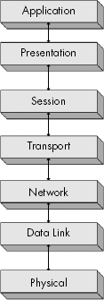
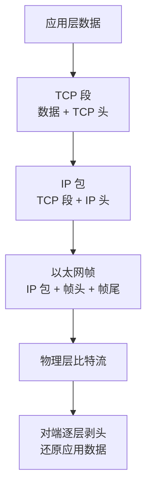
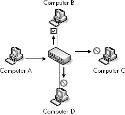
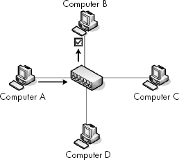
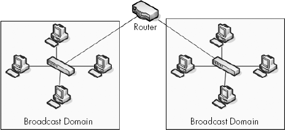
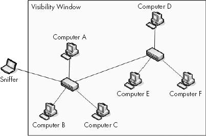
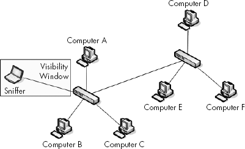
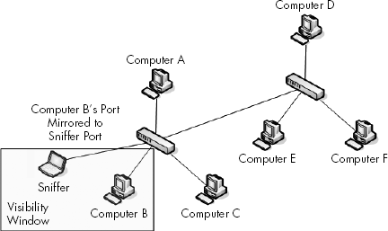
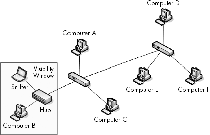
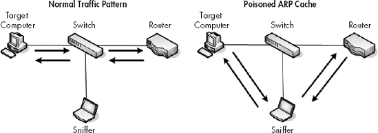

## 1. 什么是数据包分析

> Packet analysis, often referred to as packet sniffing or protocol analysis, describes the process of capturing and interpreting live data as it flows across a network in order to better understand what is happening on that network.
>
> 数据包分析（packet analysis，也称 packet sniffing 或 protocol analysis）指捕获并解读网络中流动的实时数据，以弄清网络上正在发生什么的过程。（PPA）

为什么要下到数据包层面？PPA 的回答很直接：

> All network problems stem from the packet level, where even the prettiest-looking applications can reveal their horrible implementations and seemingly trustworthy protocols can prove malicious.
>
> 一切网络问题都源自数据包层面。在这里，再漂亮的应用也会暴露出糟糕的实现，再看似可信的协议也可能被证明怀有恶意。

数据包分析能帮我们：了解网络特征、看清谁在网络上、查明谁占用了带宽、找出流量高峰时段、发现攻击与恶意行为、定位不受保护或过度冗余的应用协议。

常见的抓包工具有三类：命令行的 `tcpdump`、GUI 类的 Wireshark 与 OmniPeek 等。选择时考虑四点：支持的协议数量、易用性、成本（抓包工具不该花钱——免费品已足够好）、程序支持与操作系统支持。Wireshark 在这四项上都是最优解，也是本系列的主角。

### 1.1 嗅探器的三个步骤

PPA 把抓包过程拆成三步：

1. **收集（collection）**：把选定的网卡切换为混杂模式，抓取网段上的原始二进制数据。
2. **转换（conversion）**：把二进制数据转成可读形式。许多命令行嗅探器到此为止，剩下的解读全靠用户。
3. **分析（analysis）**：识别数据所用的协议，剖析该协议的具体字段，并对多个数据包、多个网络元素做比较分析。

Wireshark 的价值在于三步全包：既替你完成底层收集，又把"分析"做成一层层可展开的协议树。

## 2. 网络协议与分层模型

### 2.1 协议要解决哪些问题

**协议（protocol）** 是一组治理网络通信的公共语言。现代网络由不同平台的大量系统组成，全靠协议栈（protocol stack，协同工作的协议的逻辑分组）撑起通信。尽管协议之间差异巨大，大多数都要回答这几类问题：

- 流量控制（flow control）：接收方要求发送方加速或减速
- 包确认（packet acknowledgment）：接收方告知发送方已收到数据
- 错误检测（error detection）：用校验码确认数据在传输中未损坏
- 错误纠正（error correction）：重传丢失或损坏的数据
- 分段（segmentation）：把长数据流切小以提高传输效率
- 数据加密与压缩

这些关键词后文会一一在具体协议里见到：TCP 承担了其中大部分，这正是它复杂的根源。

### 2.2 OSI 七层模型

**OSI 模型（Open Systems Interconnection, 开放系统互连参考模型）** 由 ISO 于 1983 年发布（ISO 7498），把通信过程分为七层。它只是行业推荐标准，并非强制；现实中更贴近实际的是 TCP/IP 模型，但七层的词汇（"二层交换机""三层设备"）已成行业通用语。

*图 2-1｜OSI 七层模型的层次视角（PPA 原书插图，下同）*

| 层 | 名称 | 职责 | 典型协议 | 常见设备 |
|---|---|---|---|---|
| 7 | 应用层 Application | 用户访问网络资源的接口 | HTTP, SMTP, FTP, Telnet | — |
| 6 | 表示层 Presentation | 编解码、加密解密 | ASCII, MPEG, JPEG | — |
| 5 | 会话层 Session | 建立与管理会话、双工方式 | NetBIOS, SAP, SDP | — |
| 4 | 传输层 Transport | 可靠传输、流控、分段 | TCP, UDP, SPX | 防火墙 |
| 3 | 网络层 Network | 逻辑寻址与路由 | IP, ICMP, ARP（部分）, RIP | 路由器、三层交换机 |
| 2 | 数据链路层 Data Link | 物理设备寻址、差错校验 | Ethernet, Token Ring, FDDI | 交换机、网桥 |
| 1 | 物理层 Physical | 电气与物理特性 | — | 集线器、网线、中继器 |

注意 ARP 的特殊地位：它介于网络层与数据链路层之间，负责把三层地址翻译成二层地址，这也是 PPA 说它"同时服务两层"的原因。

### 2.3 协议协同与封装

通信时数据自上而下逐层传递：发送方从应用层出发，逐层下沉到物理层发出去；接收方从物理层接收后逐层上溯回应用层。各层协议分工不重复——发送方某层负责加密，接收方对等层就负责解密。

不同层之间靠**封装（encapsulation）**协作：每层给上层交来的数据加上自己的头部（或尾部），供对等层解读。封装产生的"数据 + 各层头尾"整体称为**协议数据单元（Protocol Data Unit, PDU）**。PDU 到达物理层时达到最终形态；接收方逐层剥离头尾，到最上层只剩原始数据。

日常说的"数据包（packet）"泛指包含所有层头尾信息的完整 PDU。打开 Wireshark 的 Packet Details 窗格，一个帧从外到内展开为 Frame → Ethernet → IP → TCP → 应用层协议，**这正是分层模型在抓包工具里的具象化**——你在逐层查看发送方逐层封装的产物。

## 3. 网络硬件：流量怎么被转发

嗅探器能不能看到流量，取决于转发设备怎么处理流量，所以硬件模型必须先弄清。

### 3.1 集线器：所有端口都广播

**集线器（hub）** 是物理层的重复设备：把一个端口收到的数据原样复制到**其余所有端口**。目标机器收下数据，无关机器检查二层地址后丢弃。结果是大量无效流量；且所有端口共享带宽、只能半双工，两台设备同时发送就会**冲突（collision）**，双方都要退避重传。集线器已被交换机淘汰，但它是理解"广播域"和嗅探位置的最佳教具——后文讲 hubbing out 抓包法时会再遇到它。

*图 1-4｜计算机 A 发数据给 B 时，集线器把它复制给了所有端口*

### 3.2 交换机：按 MAC 地址精准转发

**交换机（switch）** 工作在数据链路层，把每个已连接设备的二层（MAC）地址记录在 **CAM（Content Addressable Memory, 内容寻址存储器）表**中，据此把帧只发往目标所在的端口。同一时刻可以有多对设备并行全双工通信，流量效率远高于集线器。

*图 1-6｜交换机只把数据发给目标端口，其他设备毫无感知*

代价是给抓包者出了难题：**接在交换机某个端口上的嗅探器，只能看到广播流量与本端口自己收发的流量**。要看到别人的单播流量，得想办法"骗"交换机或让它复制一份——这正是本章第 5 节的主题。

企业级交换机多为**可管理交换机**（managed switch），支持开关端口、查看端口状态、远程管理等，其中"把一个端口的流量复制到另一端口"的功能（Port Mirroring）是抓包的利器。

### 3.3 路由器：分隔广播域的守门人

**路由器（router）** 工作在网络层，基于三层地址（IP 地址）在**不同网络之间**转发数据包，这一过程称为路由（routing）。三层交换机（Layer 3 switch）则是内置了路由功能的交换机。

直观理解：把每个网段想成一条街，街内串门（同网段通信）靠交换机；去别的街（跨网段通信）必须按路标过路口——路由器。广播也一样：广播包在交换机间一路复制，直到撞上路由器被拦下。**广播包能到达的范围称为广播域（broadcast domain）**——即不经过路由器就能直接互相送达的网段。站在家门口喊一嗓子，只有同一条街的人听得见；想跟别条街的人说话，得走过去。

## 4. 流量分类：广播、多播与单播

- **广播（broadcast）**：发给网段上所有端口的包，集线器只会广播，交换机对广播帧全端口复制。二层广播地址为 `ff:ff:ff:ff:ff:ff`。
- **多播（multicast）**：一个源同时发给多个目的地，靠特殊的多播地址把接收者编入多播组（如 IP multicast），目标是尽量少复制数据。
- **单播（unicast）**：一台计算机直接发给另一台，最常见的流量形态。

*图 1-10｜广播域一直延伸到路由器为止*

抓包时先用显示过滤器 `not broadcast and not multicast` 滤掉广播与多播，往往能让列表清爽一大截。

## 5. 把嗅探器放到正确的位置

> Placing your sniffer on the network is sometimes the biggest challenge you will face.
>
> 把嗅探器放到正确的位置，有时是你面临的最大挑战。（PPA）

抓包不是把笔记本插上网口就能看到一切。**可视窗口（visibility window）**——你能看到哪些设备的流量——完全由接入位置的设备类型决定。

### 5.1 集线器环境：所见即全部

集线器把流量发往所有端口，所以随便插到哪个空端口，就能看到集线器上所有计算机的往来流量，可视窗口无限大。麻烦是无关流量太多（需要过滤器帮忙），而且这类环境如今几乎绝迹。

*图 2-2｜集线器环境下的可视窗口没有边界*

### 5.2 交换机环境：三种对策

交换机环境下直接插上去只能看到广播和自己的流量。要捕获目标设备的流量，有三种经典方法：

*图 2-4｜交换机环境下，可视窗口缩小到你插的那个端口*

**方法一：Port Mirroring（端口镜像）**。登录交换机命令行，把目标端口的流量复制一份到接嗅探器的端口。这是最正规的方式，前提是交换机支持且有空余端口。各厂商命令不同：

| 厂商 | 命令 |
|---|---|
| Cisco | `set span <源端口> <目的端口>` |
| Enterasys | `set port mirroring create <源端口> <目的端口>` |
| Nortel | `port-mirroring mode mirror-port <源端口> monitor-port <目的端口>` |

注意吞吐上限：把 23 个全双工 100 Mbps 端口镜像到一个端口，理论上会有 4600 Mbps 涌向单个端口，超出口径后交换机会丢包甚至暂停背板，反而干扰分析。

*图 2-5｜端口镜像把目标端口的流量复制一份给嗅探器*

**方法二：Hubbing Out（用集线器接出）**。把目标设备的网线从交换机拔下，插到集线器上，集线器再上联交换机，自己的嗅探器也插在集线器上。目标设备从此与嗅探器同处一个广播域，流量一览无余。副作用：目标设备从全双工降到半双工；操作前记得跟设备主人打个招呼。另外要确认手里的"集线器"是真集线器——不少厂商把低级交换机当集线器卖。鉴别办法：接两台机器上去互相抓，抓得到就是真的。

*图 2-6｜Hubbing Out 把目标设备与嗅探器圈进同一个广播域*

**方法三：ARP Cache Poisoning（ARP 缓存投毒）**。利用 ARP 协议"谁先声明谁拥有"的机制，向交换机或路由器发送伪造的 ARP 应答，把"网关的 IP 对应我的 MAC"灌输给目标机器，让它的流量先经过嗅探器再转发出去，即中间人位置。它本是攻击手法（可窃听或造成拒绝服务），但同样可以用于合法的抓包定位。老牌工具是 Oxid.it 的 Cain & Abel（如今已停止维护，现代替代品有 bettercap、Ettercap 等，原理相同）。

*图 2-7｜ARP 投毒让目标机器的流量绕经嗅探器*

投毒方式的注意点：嗅探器会成为目标机器所有流量的瓶颈。**不要对高流量设备（如千兆链路上的文件服务器）使用**，尤其当你的分析机只有百兆链路时——这会把分析变成拒绝服务，数据也不可信。

### 5.3 路由环境：两侧都看

路由环境下上述方法都可用，额外要点是**嗅探器位置要覆盖问题的两侧**。跨网段的问题（如网段 D 访问不了网段 A）只在 D 上抓，只能看到"包发出去了、没有回应"；沿着路径在上一跳网段再抓一次，才发现流量是被网段 B 的路由器丢弃的。跨多台路由器的问题，常常需要同时在多个网段取证。

### 5.4 画一张网络拓扑图

**网络拓扑图（network map）** 标明网络上的技术资源及其连接方式。有现成的就放在手边；没有就自己画一张。排障时"把问题定位在哪儿"经常就是战斗的一半，一张清晰的拓扑图能让嗅探器位置的决策从猜变成算。

## 6. 小结

分层模型决定了数据的模样，转发硬件决定了你能不能看到数据。合起来就是抓包前的两张地图：**数据长什么样**（封装结构），**去哪里接它**（可视窗口）。
