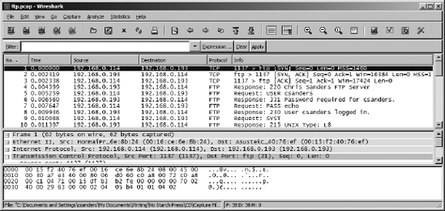

## 1. Wireshark 的前世今生

Wireshark 的前身叫 **Ethereal**，1998 年由 Gerald Combs 出于工作需要编写，以 GNU GPL 许可发布。2006 年 Combs 离职创业，Ethereal 商标留在老东家手里，协商无果后他与整个开发团队把项目更名为 **Wireshark**，此后 Ethereal 原名停止开发。

Wireshark 的几项核心优势（PPA 按"选型四要素"逐条评估）：

- **协议支持**：开源社区持续贡献解析器（dissector），常见协议全覆盖，冷门协议也能自行编码提交。今天支持的协议数以千计。
- **易用性**：GUI 界面、清晰的上下文菜单、按协议着色的包列表，对新手远比命令行的 `tcpdump` 友好。
- **成本**：免费开源，商用无限制。
- **社区与平台**：文档、wiki、邮件列表一应俱全；Windows、macOS、Linux 全平台可用。

〔《简单》·Wireshark 的前世今生〕同款故事中文视角：作者强调 Wireshark 之于网络工程师，就像听诊器之于医生——便宜、易得，却能把"望闻问切"升级到看见 internals 的层面。

## 2. 第一次抓包

装好后打开 Wireshark，界面上空空如也——**它不主动抓包，得你给它数据**。

1. 菜单 `Capture ▸ Interfaces`（或双击首页的网卡列表），列出所有可抓包的接口及其 IP。
2. 选中活跃接口，开始捕获。抓包进行中会出现流量类型与持续时间的摘要窗口。
3. 等一两分钟，点 Stop，主窗口顿时涌满数据。

新手常见疑问："网络没出问题抓什么包？"两个回答：一是**网络上永远有问题**，只是没暴露；二是**排障之前需要基线**——想知道 DHCP 故障长什么样，先得看清正常的 DHCP 交互；想知道今天流量异常不异常，先存一份"正常的一天"。多数分析人员研究正常流量的时间远多于排障时间。

抓不到包的最常见原因是权限：Windows 需管理员运行，Linux 需 root 或给 Wireshark 配置 dumpcap 的捕获能力（`setcap`）。

## 3. 主窗口与三大窗格

主窗口从上到下三个窗格，环环相扣：

| 窗格 | 位置 | 内容 |
|---|---|---|
| Packet List 包列表 | 上 | 当前抓包文件里所有数据包的表格：编号、时间、源/目的地址、协议、Info 摘要 |
| Packet Details 包详情 | 中 | 选中包的分层协议树，每层可展开，逐字段显示 |
| Packet Bytes 字节窗格 | 下 | 选中层的原始十六进制与 ASCII 字节 |

联动关系是理解的关键：**在包列表选中一个包，详情窗格才会展示它的协议树；在详情窗格点中某一层，字节窗格才会高亮该层对应的原始字节**。看不懂详情里某个字段时，去字节窗格对照原始数据；怀疑 Wireshark 解析有误时，也去字节窗格验尸。



*图 3-5｜Wireshark 主窗口的三窗格设计（Wireshark 1.x 时代截图，现版本布局一致）*

## 4. 偏好设置与着色规则

### 4.1 Preferences

`Edit ▸ Preferences` 打开偏好设置，五组最常用：

- **User Interface**：三窗格布局、字体、列的排布
- **Capture**：默认抓包接口、是否默认混杂模式、实时刷新包列表
- **Printing**：打印选项
- **Name Resolution**：三类名称解析的开关
- **Protocols**：各协议的解析选项，默认不动，有明确理由再改

### 4.2 着色规则

包列表里每个包都有底色，不是随机的：默认绿色是 HTTP、蓝色是 DNS……颜色对应协议（更准确地说，对应过滤表达式）。打开 `View ▸ Coloring Rules` 可以查看、修改、新建规则，每条规则 = 一个显示过滤表达式 + 前景/背景色。


*图 3-7｜着色让协议一目了然*

用法示例：怀疑网络里有野 DHCP 服务器时，把 DHCP 规则改成醒目的亮黄色，海量抓包里一眼锁定。日常把最常排障的协议设成专属颜色，浏览大文件的效率成倍提升。

〔《简单》·你一定会喜欢的技巧〕几句最值钱的操作，一学就会：

- **右键即过滤**：在包详情里选中任意字段，右键 `Apply as Filter`（作为过滤器应用）或 `Prepare a Filter`（先准备好不立即生效），Wireshark 替你把该字段写成过滤表达式——不用背语法，用着用着就会了。
- **右键即追踪**：右键 `Follow ▸ TCP Stream` 直接看应用层对话。
- **右键即着色**：右键 `Colorize Conversation` 给整条会话着色，多会话混杂时一眼分清你我。
- **快速复制**：右键 `Copy` 可以把字段值、过滤器表达式直接拷走写报告。

## 5. 查找、标记与时间参考

### 5.1 查找数据包

`Ctrl-F` 打开 Find Packet，三种查找方式：

| 方式 | 示例 |
|---|---|
| Display filter（显示过滤） | `not ip`、`ip.addr==192.168.0.1`、`arp` |
| Hex value（十六进制） | `00:ff`、`00:AB:B1:f0` |
| String（字符串） | `Workstation1`、`UserB`、`domain` |

`Ctrl-N` 找下一个匹配、`Ctrl-B` 找上一个。字符串与十六进制查找还可指定搜索的窗格、字符集与方向。

### 5.2 标记数据包

右键 `Mark/Unmark Packet` 或 `Ctrl-M` 标记感兴趣的包，被标记的包以黑底白字高亮。用途：把散落各处的关键包做记号，`Shift-Ctrl-N / Shift-Ctrl-B` 在标记间跳转，保存文件时还能只存被标记的包。标记数量不限。

### 5.3 时间显示格式与时间参考

排障就是跟时间打交道。`View ▸ Time Display Format` 切换包列表 Time 列的格式：绝对时间、自抓包开始的秒数、自上一包的秒数等，精度可选自动到微秒。看"哪个包之间隔了很久"用"自上一包"，对照日志用"绝对时间"。

**时间参考（time reference）**：选中某个包按 `Ctrl-T` 设为参考点，其后所有包的时间都相对它计算，Time 列显示 `*REF*`。一个抓包文件里有多次独立请求时，分别对每次请求的起点设参考，各请求的耗时一目了然。注意：时间参考只在显示格式为"自抓包开始"时有意义，其他格式下会得出莫名其妙的数字。

## 6. 文件操作：保存、导出、合并

- **保存**：`File ▸ Save As`，默认 `.pcapng` 格式（PPA 时代为 `.pcap`，两者可互通）。杀手级功能是**按条件另存**：只存指定编号区间、只存标记的包、只存当前显示过滤的结果——给臃肿的抓包文件瘦身就靠它。
- **导出**：`File ▸ Export` 可导出为纯文本、PostScript、CSV、XML，交给表格软件或报告系统；`Export Specified Packets` 则是把过滤结果另存为新的抓包文件。
- **合并**：`File ▸ Merge` 把另一个文件并入当前文件，可选前置、追加或**按时间戳归并**——双侧取证（客户端一份、服务器一份）后的标准动作，归并后时间线统一，才能对出"请求发了、回应没到"这类事实。更快的方式：在资源管理器里把第二个文件直接拖进 Wireshark 窗口。

## 7. 捕获过滤器与显示过滤器

Wireshark 有两套语法完全不同的过滤器，新手最大的坑就在混淆二者：

| | 捕获过滤器 capture filter | 显示过滤器 display filter |
|---|---|---|
| 生效时机 | 抓包过程中，符合的才进文件 | 抓包文件已存在，只决定显示哪些 |
| 语法 | BPF（Berkeley Packet Filter）语法，tcpdump 同款 | Wireshark 专属表达式 |
| 丢弃数据？ | **是，没抓到的永久没了** | 否，清掉过滤随时复原 |
| 典型场景 | 海量流量中只留目标；资源受限的抓包点 | 分析阶段反复筛选、试错 |

**能用显示过滤解决的，就不要用捕获过滤**——因为显示过滤不毁数据，捕获过滤留下的盲区无法弥补。只有流量大到抓不动、或嗅探器资源紧张时才上捕获过滤（例如在目标机器上抓包时用 `host 10.1.4.176` 限定只留与它相关的流量）。

### 7.1 捕获过滤器：BPF 语法

在抓包选项的 Capture Filter 输入框填写。常用形式：

```text
host www.example.com                        # 只留与该主机的往来
host www.example.com and not port 80        # 该主机的非 web 流量
port 262                                    # 只留端口 262 的流量
not broadcast and not multicast             # 只留单播
```

语法与 `tcpdump` 一致，学会一份两处受益。

### 7.2 显示过滤器：表达式写法

显示过滤器输在包列表上方的过滤栏，回车生效，清空复原。写法分三层：


*图 4-9｜在过滤栏输入 `!arp` 隐藏所有 ARP 包*

**按协议**：直接写协议名。`tcp` 只留 TCP 流量，`!icmp` 或 `not icmp` 去掉 ICMP。

**比较运算符**：字段与值比较。

| 运算符 | 含义 |
|---|---|
| `==` | 等于 |
| `!=` | 不等于 |
| `>` `<` | 大于 / 小于 |
| `>=` `<=` | 大于等于 / 小于等于 |

例：`ip.addr==192.168.0.1` 显示涉及该 IP 的所有包；`frame.len <= 128` 只看小包。

**逻辑运算符**：组合多个条件。

| 运算符 | 含义 |
|---|---|
| `and` / `&&` | 与，两者皆真 |
| `or` / `||` | 或，其一为真 |
| `xor` | 异或，恰一为真 |
| `not` / `!` | 非 |

例：`ip.addr==192.168.0.1 or ip.addr==192.168.0.2`；`(tcp.flags.reset == 1) && (tcp.seq == 1)`——**找出所有复位标志置位、序号为 1 的包，即"连接刚建立就被 RST 掐断"的位置**，定位"能连上却立刻被拒"的服务问题一抓一个准。

懒得记字段名时用表达式构造器：过滤栏左侧按钮打开 Filter Expression 对话框，展开协议树选字段、选关系、填值，自动生成表达式。熟练后手写更快，字段提示（输入即弹出补全）就是速查手册。

**保存常用过滤器**：过滤栏右侧书签图标 → Save this filter，命名保存后一键复用。排障常用的几十条表达式值得积累成自己的过滤器库。

### 7.3 两套语法的速查对照

```text
捕获过滤器            显示过滤器
host 192.168.0.1      ip.addr==192.168.0.1
port 80               tcp.port==80
not arp               !arp
net 192.168.0.0/24    ip.addr==192.168.0.0/24
```

## 8. 小结

本篇覆盖日常操作的主干：抓、看、找、存、滤。其中过滤器是 Wireshark 的灵魂——三本书的每个案例里，过滤器都是从几十万包的汪洋里捞出真相的渔网。
