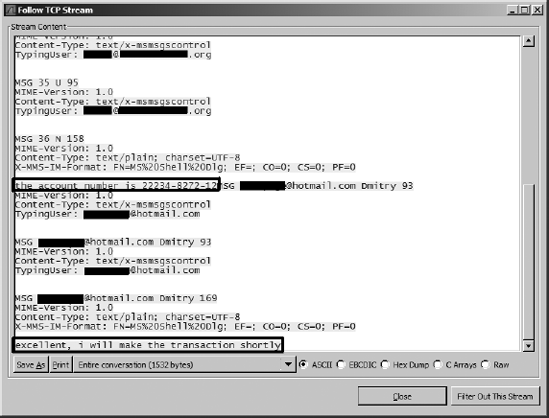
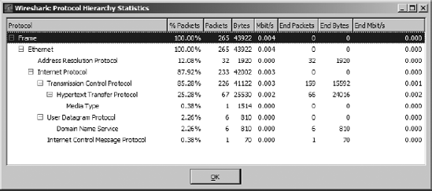
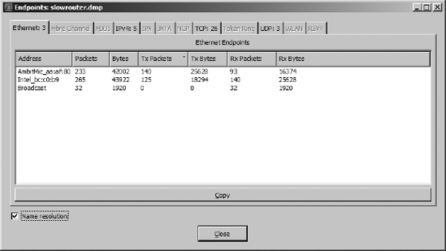
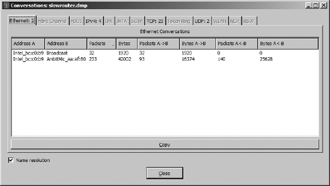
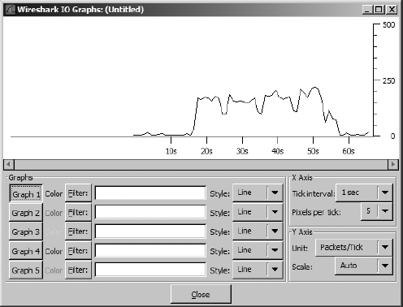

## 1. 名称解析

抓包里满是 `00:16:CE:6E:8B:24` 这样的地址，读起来费劲。**名称解析（name resolution）** 就是把一种地址换算成另一种可读标识的过程——比如把上面的 MAC 地址换算成主机名 Marketing-2。Wireshark 提供三类解析：

| 类型 | 做什么 | 依据 |
|---|---|---|
| MAC 名称解析 | 二层地址 → 三层地址或厂商名 | ARP 记录；失败则查 MAC 前三字节的 IEEE 厂商登记，如 Netgear_01:02:03 |
| 网络名称解析 | IP 地址 → DNS 主机名，如 192.168.1.50 → MarketingPC1 | 反向 DNS 查询 |
| 传输名称解析 | 端口号 → 服务名，如 80 → http | 已知端口号表 |

在 `Capture ▸ Options` 的抓包选项里勾选启用（显示阶段也可在 `View ▸ Name Resolution` 切换）。

**它有代价，别无脑开**（PPA 列举的四个坑）：

1. 解析可能失败——名字服务器不知道答案。
2. 解析结果**不存进抓包文件**，每次打开文件都要重新解析；当年解析所依赖的服务器下线了，解析就永远失败。
3. **网络解析会发出真实的 DNS 查询包**，悄悄混进抓包文件，污染数据。
4. 大文件的解析开销可观，内存紧张时果断关掉。

经验法则：临时定位"这台机器是谁"时开，正式分析时关——保持数据干净比名字可读重要。

## 2. 协议解析器与强制解码

**解析器（dissector）** 是 Wireshark 内置的"翻译官"：每种协议各有一个，负责把线上的原始字节翻译成协议树。一个包往往由多个解析器接力解读，选哪个由 Wireshark 按端口号等线索**猜**。

猜错的典型场景：**应用跑在非标准端口上**。PPA 给的例子——FTP 服务器被配置在 137 端口（NetBIOS 的默认端口），Wireshark 一看端口号就按 NetBIOS 解读，结果包列表里满屏 NetBIOS，而 Packet Bytes 里明明能看见用户名密码等明文 FTP 内容。

解法叫**强制解码（forced decode）**：

1. 右键嫌疑包 → `Decode As`；
2. 指定条件（如 TCP source 端口 137）与应使用的解析器（FTP）；
3. 确认后整个文件立即按新规则重新解读。

三个注意点：强制解码**不随文件保存**，每次重新打开文件都要重设；一个文件可以设多条，`Decode As` 对话框里 `Show Current` 查看全部、`Clear` 一键清空；它改变的是"显示"，不碰原始数据。

看到解析结果与内容气质不符（协议名说 A、字节里像 B）时，第一反应就该是 Decode As。

## 3. 跟随 TCP 流

**Follow TCP Stream（跟随 TCP 流）** 是 Wireshark 最实用的功能之一。TCP 把应用数据切成一段段小包传输，肉眼看包列表只见碎片；这个功能把一条 TCP 连接双向的所有载荷**按应用层视角重组**，还原成一段完整的对话。

操作：右键任意包 → `Follow ▸ TCP Stream`。弹出窗口里通常以两种颜色区分方向——红色是客户端 → 服务器，蓝色是服务器 → 客户端。窗口底部可以切换显示格式（ASCII、Raw、Hex 等），也能把重组结果另存为文件。

*图 5-5｜Follow TCP Stream 把零散的包重组为完整对话*

经典用途（PPA 的两个例子）：

- **看明文协议的实际内容**：FTP 登录的用户名密码、Telnet 会话的每一步、POP 邮件的正文，一屏尽收。
- **取证即时通信**：旧版 MSN Messenger 用明文 MSG 包聊天，跟随 TCP 流即得完整聊天记录——顺带说明为什么公司内网聊天要注意分寸。

对 HTTP 这类文本协议，跟随 TCP 流能直接看到完整的请求与响应头、响应码与正文，是排查 Web 问题的第一利器——一个 403 Forbidden 的扯皮故障，靠它一屏定责。

## 4. 统计视图：先俯瞰再下潜

Statistics 菜单下的几个视图是分析大文件的标配。心法：**先看统计把握全局，再用过滤器下潜到包**。

### 4.1 Protocol Hierarchy 协议分布

`Statistics ▸ Protocol Hierarchy` 列出抓包文件里各协议的占比树（以太网 → IP → TCP → HTTP……每层的包数、字节数与百分比）。

*图 5-6｜协议分布视图：这份抓包里各层协议的占比*

两大用途：

- **基线对照**：平时 ARP 占 10%，今天一份抓包里 ARP 占 50%——不用看任何一个包，问题已经浮出水面（典型的 ARP 风暴或扫描）。
- **快速画像**：接手陌生抓包文件，先看协议分布就知道"这里面发生了什么类型的活动"。

注意各层百分比相加会超过 100%——一个包同时计入它经过的每一层协议，这是正常的。

### 4.2 Endpoints 端点

**端点（endpoint）** 指某协议上一段通信的末端：二层端点是两块网卡的 MAC 地址，三层端点是通信双方的 IP 地址。`Statistics ▸ Endpoints` 为每个端点列出收发包数与字节数，顶部标签页按协议类型切换。

用途：谁在往外发最多的包？哪个 IP 消耗了带宽？右键任一端点可直接生成"只看它 / 排除它"的过滤器，还能一键把该端点转成着色规则。

*图 5-8｜Endpoints 视图：每个端点的收发包数与字节数*

### 4.3 Conversations 会话

**会话（conversation）** 是两个端点之间的往来。`Statistics ▸ Conversations` 以 Address A ↔ Address B 成对列出所有会话及其双向流量，同样按协议分页。

PPA 的评价很实在：一台工作站上出现 243 条 TCP 会话是不正常的，同一数字出现在服务器上却稀松平常——**会话数量与分布本身就是证据**。右键任一会话可生成 `A<->B` 过滤器，把这条会话的所有包单独拎出来。凡是"一台机器吃光带宽"型的破案——文件共享工具、下载器——几乎都是从会话统计开始收网的。

*图 5-9｜Conversations 视图：成对列出会话两端及其流量*

### 4.4 IO Graphs 吞吐曲线

`Statistics ▸ IO Graphs` 把吞吐量画成随时间变化的折线图，横轴时间、纵轴每秒包数或比特数。可自定义最多五条曲线，每条绑定一个显示过滤器并指定颜色——比如红色画 ARP、蓝色画 DHCP，两条曲线的此起彼伏说明流量结构的变迁。

典型用途：找流量尖峰与低谷、对照"用户说慢的时间点"、验证限速策略是否生效。性能排查中它是常驻嘉宾。

*图 5-10｜IO Graphs：下载文件的吞吐曲线*

## 5. Expert Info：让 Wireshark 先说话

`Analyze ▸ Expert Info`（旧版叫 Expert Infos）是 Wireshark 替你做的一层"预分析"：解析过程中发现的异常会被归类汇总——

| 级别 | 含义 | 典型条目 |
|---|---|---|
| Error 错误 | 协议违规或明确故障 | 格式错误的包、RST 后仍有数据 |
| Warning 警告 | 强烈暗示问题 | TCP retransmission、duplicate ACK、previous segment not captured |
| Note 提示 | 可能正常也可能异常 | TCP window update、zero window |
| Chat 对话 | 日常事件 | 连接建立、GET 请求 |

Severity filter 可以滤掉低级别条目。看抓包先扫一眼 Expert Info，几十万包里的重传、窗口异常、丢段被浓缩成一张摘要表——"越传越慢"的下载故障，正是从这里的成片 warning 开始现形的。

〔《艺术》·Wireshark 的提示〕两册中文书特别提醒：**状态栏与 Expert Info 的提示是"线索"而非"判决"**。`previous segment not captured`（前一段未被抓到）只说明抓包点没看到那个段——可能真丢了，也可能只是没经过你的网卡；`TCP ACKed unseen segment`（确认了未见过的段）往往只是抓包位置问题。**别强迫症式地想把每个提示清零**：提示引导你去验证，验证了再下结论。

## 6. 专家们的收藏夹

三本书的作者日常高频使用的功能盘点：

- PPA：Protocol Hierarchy 定基调、Conversations 找嫌疑人、IO Graphs 看趋势、Follow TCP Stream 取证——"统计视图先俯瞰，过滤器再下潜，流窗口定罪"。
- 《简单》：最推崇的是**着色规则 + 右键 Apply as Filter** 的组合，以及看 TCP 流时对方向颜色的敏感。
- 《艺术》：Expert Info 的每条提示都值得追问一句"它为什么出现"，加上 tshark 命令行做批量统计。

工具篇到此收官。工具的价值，要在真实的协议流量里兑现。
