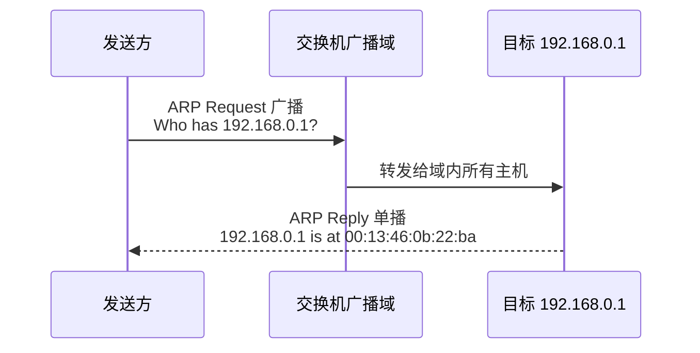
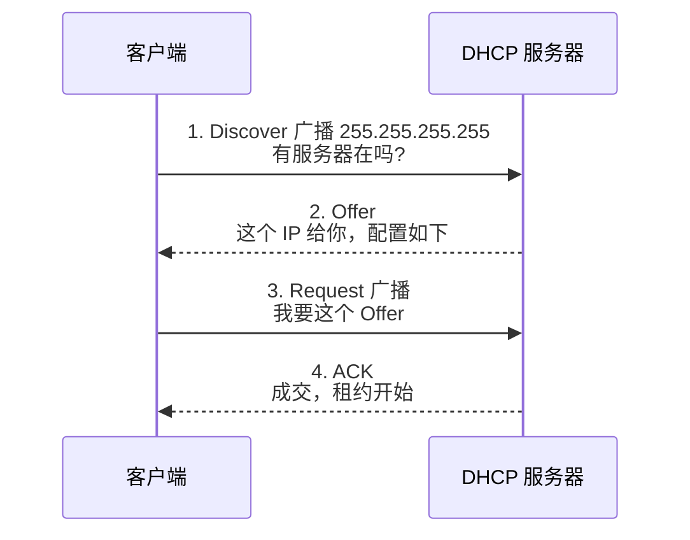
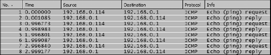
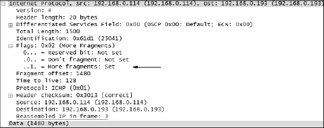
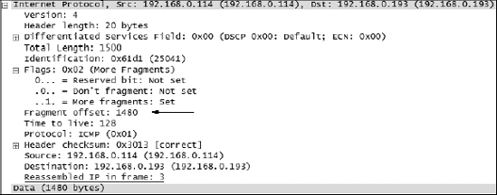

## 1. ARP：地址解析协议

**ARP（Address Resolution Protocol, 地址解析协议）**（RFC 826）把三层 IP 地址翻译成二层 MAC 地址——交换机和路由器只认二层地址，没有这层翻译，IP 包根本没法装进以太网帧。

PPA 评价它是最适合入门的协议：**整个工作流程只需两个包**。

*图 6-1｜真实抓包中的 ARP 一问一答，全程只有两个包*

要点：

- 请求是**广播**：目的 MAC 为 `ff:ff:ff:ff:ff:ff`，域内每台机器都收到。MAC 地址不匹配的直接丢弃，匹配的以单播应答自己的 MAC。
- 地址对随后进入双方的 **ARP 缓存**，短期内不再重复询问。
- 类比：想找电话簿里的某个 Smith 却不知道叫哪个——只能挨个打过去问。ARP 的广播就是"打给所有 Smith"。

**免费 ARP（gratuitous ARP）**：主机上线时主动广播"这个 IP 对应我的 MAC"，用于检测地址冲突与刷新他人缓存。正常只见免费 ARP **请求**；若出现免费 ARP **应答**，说明网络里有另一台机器占用了同一 IP——诊断 IP 冲突的快速线索。

显示过滤器：`arp`。ARP 的攻击面是**缓存投毒**（ARP spoofing）：伪造 ARP 应答，把"网关 IP 对应攻击者 MAC"灌进受害者缓存，让它的流量先流经攻击者再转发，可窃听也可造成拒绝服务；防御靠交换机上的动态 ARP 检测（Dynamic ARP Inspection, DAI）。

## 2. DHCP：自动配置协议

**DHCP（Dynamic Host Configuration Protocol, 动态主机配置协议）**（RFC 2131）为客户端自动下发网络配置：IP 地址、子网掩码、默认网关、DNS 服务器、域名、NTP 服务器等。核心是经典的**四步交互**（DORA，即 Discover、Offer、Request、ACK）：

*图 6-4｜DHCP ACK 包的详情：下发的 IP 与全部配置参数*

抓包观察点：

- 第 1、3 步都是**广播**（客户端此时尚无 IP，Request 广播还能通知其他 DHCP 服务器"我不选你们的 Offer 了"）。
- 每笔事务有 **Transaction ID**，Info 列可见。多台客户端同时获取地址时，靠它区分"哪个 Offer/ACK 属于谁"——分析 DHCP 问题必看字段。
- 一个抓包文件里最多能见到八种 DHCP 报文（Discover/Offer/Request/ACK/NAK/Decline/Release/Inform），完整语义查 RFC 2131。

常见故障模式：抓包里只有 Discover 没有 Offer——广播域里没有 DHCP 服务器或中间设备挡了广播；Offer 有、ACK 没了——地址池耗尽或服务器拒绝。给 DHCP 流量设条亮黄色的着色规则，排查内网接入问题先看它。

## 3. ICMP：互联网控制消息协议

**ICMP（Internet Control Message Protocol, 互联网控制消息协议）**（RFC 792）是 IP 的配套协议，PPA 管它叫"工具协议"——它不搬运业务数据，专为报告错误与诊断而生。`ping` 是它最著名的用户。

### 3.1 类型与代码

每个 ICMP 包都有一个数字 **type** 标识用途，部分 type 还有更细的 **code**。必背的几个：

| Type | 名称 | 含义 |
|---|---|---|
| 0 | Echo Reply | ping 应答 |
| 3 | Destination Unreachable | 目标不可达，细分 code 见下 |
| 8 | Echo Request | ping 请求 |
| 11 | Time Exceeded | TTL 耗尽，traceroute 的基石 |

Type 3 的常用 code：

| Code | 含义 |
|---|---|
| 0 | 网络不可达 |
| 1 | 主机不可达 |
| 2 | 协议不可达 |
| 3 | 端口不可达 |

### 3.2 ping 与"目标不可达"的读法

正常 ping 是一问一答：type 8 → type 0。抓包诊断不可达场景（PPA 案例）：

- 客户端发出 type 8，回来一个 **type 3**——注意看**应答者的 IP 不是你 ping 的目标**，而是途中某台路由器/交换机，这本身就说明请求没能抵达目标。
- code 1（主机不可达）：包到了最后一跳设备，但该设备在网段里问了一圈 ARP 没人应答——目标主机不在线或地址配错。配合观察是否伴随无人应答的 ARP 广播（见第 1 节）。
- code 2（端口不可达）：主机在线但目标端口没有服务在听。

*图 6-32｜ping 的请求与应答：type 8 出、type 0 回*

### 3.3 traceroute：靠 TTL 探路

`traceroute`（Windows 下 `tracert`，基于 ICMP；Unix 默认基于 UDP）逐跳探测路径，原理是操纵 **TTL（time-to-live，生存时间）**：

1. 发出 TTL=1 的探测包，第一个路由器把 TTL 减到 0 后丢弃，并回一个 **type 11（TTL exceeded）**——于是知道了第一跳的地址与耗时；
2. 发 TTL=2 的包，第二个路由器回 type 11——得到第二跳；
3. 依此递增直到抵达目标。

抓包对照输出读：某跳**连续三个探测包都没有 type 11 回来**（间隔约 3 秒重试三次后放弃），说明该跳设备无响应或被 ACL 拦截——照此逐跳排除，就能把"全网都慢"钉到具体某一跳设备上。

过滤器：`icmp`；快速筛查扫描行为的组合拳：`icmp.type==13 || icmp.type==15 || icmp.type==17`（时间戳/信息/地址掩码请求，正常网络不应出现，出现即疑似操作系统指纹探测）。

## 4. IP 分片与 MTU

### 4.1 为什么会有分片

链路层一次能驮的数据有上限——以太网默认 **MTU（Maximum Transmission Unit, 最大传输单元）1500 字节**。上层交给 IP 的数据超出限额时，IP 把它**分片（fragmentation）**成多个包发送，接收方再重组。

PPA 的对照实验：普通 ping 数据 32 字节，一问一答共 8 个包；把数据加到 3072 字节后，每个方向都要拆成 3 个包，抓包膨胀到 24 个——多出来的就是分片。

### 4.2 在 Wireshark 里读分片

展开 IP 层的 Flags 与 Fragment Offset 字段：

- **More Fragments（MF）标志**：1 = 后面还有分片；0 = 这是最后一片。一串分片里只有最后一个 MF=0。
- **Fragment Offset（片偏移）**：本片数据在原始数据流中的字节位置。计算规则是**前一片的偏移 + 前一片的净荷长度**：第 1 片偏移 0，第 2 片偏移 1480，第 3 片偏移 2960……接收方靠偏移值把分片排回原序。

*图 7-8｜More Fragments 标志为 1，说明后面还有分片*

*图 7-10｜第 2 片的偏移值 1480 = 前一片偏移 0 + 前一片净荷 1480*

过滤器：`ip.flags.mf == 1` 找出所有非末片，`ip.flags.df == 1` 找出禁止分片的包。

### 4.3 分片的现实问题

〔《艺术》·几个关于分片的问题〕原书以问答形式澄清几个常见误区，综合整理如下：

- **为什么实践上要尽量避免分片**：任何一片丢失，整个原始包都要全部重传（重传机制工作在 TCP 层，它看不见分片）；中间设备还可能出于安全直接丢弃分片。
- **TCP 几乎不产生分片**：握手时双方协商 **MSS（Maximum Segment Size, 最大段大小）**，让每个 TCP 段装进 MTU 里。真正容易踩坑的是 UDP 与隧道（隧道封装额外头部，实际可用 MTU 变小）。
- **DF（Don't Fragment）位**：置位时中间设备遇到超长包不加分片，而是回 type 3 code 4（需要分片但 DF 置位）的 ICMP 错误——路径 MTU 发现（PMTUD）依赖它。若防火墙把这类 ICMP 错误也拦了，就会出现下述悲剧。

〔《艺术》·MTU 导致的悲剧〕经典故障模式：**ping 一切正常、小包交互正常，传大文件或打开大页面时卡死**。根因链：某条路径 MTU 更小（常见于 PPPoE、VPN 隧道）+ 发送方发的是不分片的大包 + 中途的"需要分片"ICMP 错误被防火墙吞掉 → 发送方等不到反馈，MSS 始终降不下来 → 大包一次次无声消失。诊断路径：对比小包/大包行为 → 抓包看大包是否发出后无应答 → 检查沿途是否回 type 3 code 4。处置：调整隧道路径的 MTU/MSS clamp（钳制 MSS），或放行 type 3 code 4。

## 5. UDP：用户数据报协议

〔《简单》·简单的代价〕**UDP（User Datagram Protocol, 用户数据报协议）**（RFC 768）是传输层的"不设防"选项：无连接、不握手、不确认、不重传、无拥塞控制——一个 8 字节的头部（源端口、目的端口、长度、校验和）之后直接装数据。

"简单"的代价是可靠性，收益是**低开销与低延迟**，以及对"最新数据比完整数据重要"这类场景的天然契合。谁在用 UDP：

- **DNS**：一次查询一次应答，不值得为它建 TCP 连接（现代 DNS 在大报文时会回落 TCP）。
- **DHCP**：客户端还没有 IP，TCP 无从建立，只能广播 UDP。
- **流媒体、语音、游戏**：丢一帧就丢一帧，重传来的旧帧反而没用；靠应用层自己兜底。
- **SNMP、NTP** 等轻量管理协议。

抓包视角的 UDP 与 TCP 的最大差异：**列表里看不到握手与挥手**，包与包之间没有序号确认关系，Wireshark 也因此基本不给 UDP 画"流分析"的花样（无重传提示、无窗口）。诊断 UDP 问题的思路随之改变：**应用层有没有自己的应答机制？**DNS 看有没有 Response、超时是谁没回；语音看 RTP 序列号有没有跳变。UDP 丢包在 IP 层是无声的——发送方根本不知道，这正是应用层协议必须自己设计可靠性的原因。

过滤器：`udp`；按端口：`udp.port==53`（DNS）、`udp.port==67 || udp.port==68`（DHCP）。

## 6. 小结

这一组协议的共同点：**短小、自成一体**，抓包里一眼能看完一次完整交互。它们也是所有大协议的地基——ARP 里有二层与三层的缝合，DHCP 展示了广播的用法，ICMP 是一切连通性诊断的语言，分片揭示 MTU 的约束，UDP 则是理解 TCP 复杂性的反面参照。
