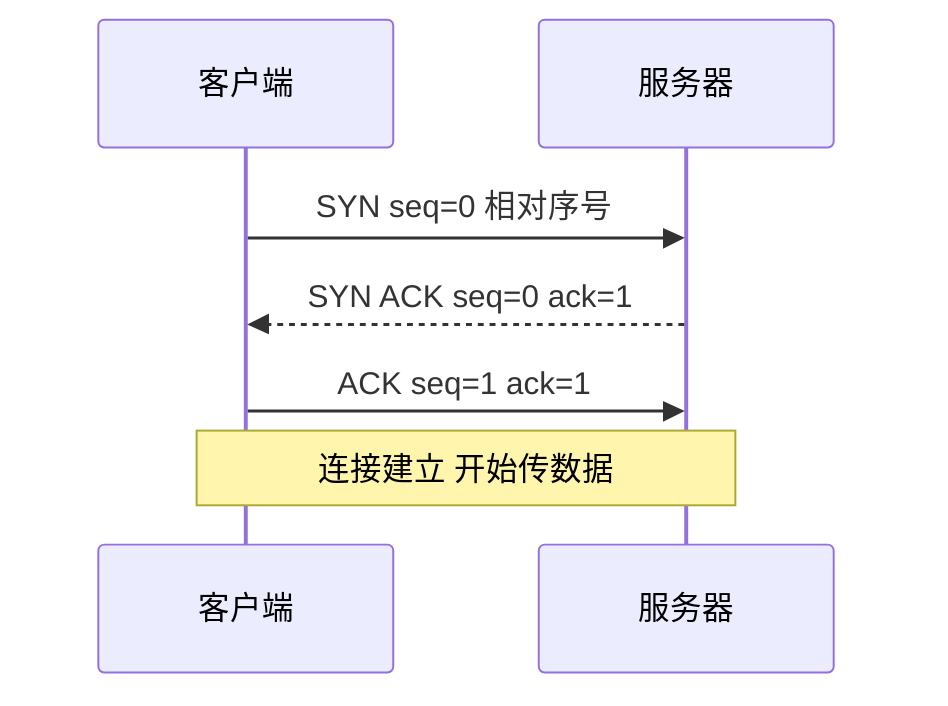
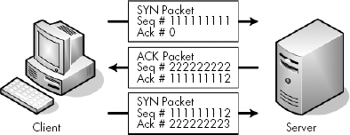
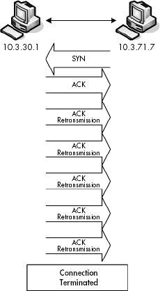
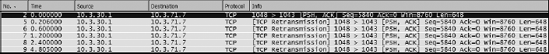
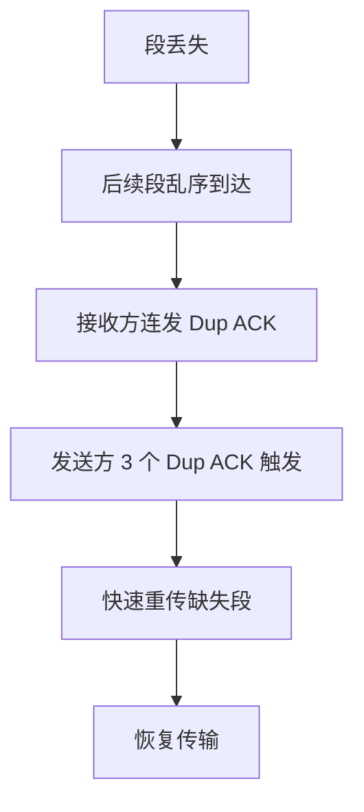
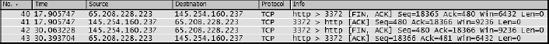

## 1. TCP 头部：在 Wireshark 里要看什么

**TCP（Transmission Control Protocol, 传输控制协议）**（RFC 793）是互联网可靠传输的基石。抓包分析 TCP，Packet Details 的 TCP 段展开后盯这几个字段：

| 字段 | 作用 |
|---|---|
| Source/Destination Port | 端口，标识两端的应用进程 |
| Sequence Number | 本段数据的起始序号 |
| Acknowledgment Number | 期望对方下一个字节的序号，即"这之前的都收到了" |
| Flags | SYN/ACK/FIN/RST/PSH/URG 等控制位 |
| Window | 接收窗口大小，流控的调节旋钮 |
| Calculated RTT / ACK RTT | Wireshark 算出的往返时延（RTT = Round-Trip Time） |

**序号默认按相对值显示**：Wireshark 把每条流的第一个序号平移为 0，后续依实际字节累加——不必跟真实的初始序号（ISN，Initial Sequence Number）斗智斗勇。想看真实值，在 Preferences ▸ Protocols ▸ TCP 里关掉 Relative sequence numbers。

## 2. 三次握手

任何 TCP 通信都从**三次握手（three-way handshake）**开始（RFC 793 定义）：





*图 6-5｜三次握手：SYN、SYN/ACK、ACK 各自带序号与确认号*

逐包读法：

1. **SYN**：客户端发起同步，携带初始序号（相对显示为 0）。
2. **SYN/ACK**：服务器应答，ACK 部分把客户端的序号 +1 作为确认号（"你的 SYN 我收到了"），SYN 部分带上自己的初始序号。
3. **ACK**：客户端确认，确认号 = 服务器序号 +1。至此连接建立。

握手顺带完成两件事：**MSS 协商**（双方在 SYN 里通告各自能接受的 Maximum Segment Size, 最大段大小，让段塞得进链路 MTU、避免 IP 分片）与窗口缩放因子（Window Scale）协商。

〔《艺术》·三次握手的小知识〕原书借此篇回答一个经典面试题"为什么恰好是三次"：两次无法让双方都确认到"自己的发送与接收能力都被对方验证"；而 SYN 里的**初始序号要随机选取**——防的是旧连接的迟到报文窜入新连接，以及让序号不可预测（安全考量）。握手恰恰提供了双方交换各自 ISN 的机会。

诊断入口：**握手都没完成，后面一切免谈**。抓包里只见 SYN 反复重发没有 SYN/ACK——服务器不在线、端口没监听或防火墙静默丢弃；SYN/ACK 到了、第三次 ACK 没出去——方向性问题。过滤器：`tcp.flags.syn==1 && tcp.flags.ack==0` 找所有发起握手的 SYN。

## 3. 数据传输：序号推进与确认

握手后，序号按**发送的净荷字节数**推进（不再 +1）。接收方每收到一段，回 ACK 带上"下一个期望的字节号"。于是包列表里出现一幅对账图：客户端 `seq=x, len=1460`，服务器 `ack=x+1460`——**确认号始终等于对方已发净荷的累计**。

〔《艺术》·被误解的 TCP〕人们常把"TCP 保证可靠"理解成"数据一定送达"。精确地说：TCP 保证的是**已确认的部分有序且未损坏**；数据是否真正送达，取决于连接存活期间的重传是否成功——连接被 RST 掐断或对端宕机时，未确认的数据就是丢了。这也是为什么应用层对关键数据仍要有自己的确认语义（应用层 ACK、事务 ID、落盘校验）。抓包上这条认知的推论是：**看到 ACK 不等于对端应用处理完，只等于内核收到了**。

## 4. 滑动窗口与流控

〔《简单》·快递员的工作策略〕书中把 TCP 发送方比作快递员：客户（接收方）家里能堆多少包裹是有限的，快递员必须按客户门口的**剩余空位**决定一次发多少。这个"剩余空位"通告就是 TCP 头里的 **Window（窗口）** 字段——接收方在每个 ACK 里持续更新它，发送方在途未确认的数据量不得超过窗口。窗口从收缩到放开的过程在抓包里表现为一串 **TCP Window Update** 包。

两个必须认识的异常信号：

- **Zero Window（零窗口）**：窗口字段降为 0——"我家满了，一件都别发"。发送方停发，定期发窗口探测包询问。抓包里出现持续的 zero window + window probe，说明**接收端应用读得太慢**（应用卡顿、阻塞、读缓冲不够），网络本身可能无辜。
- **TCP Window Full**：Wireshark 提示发送方已填满对方通告的窗口，在途数据到顶。若同时 RTT 很小，说明瓶颈是应用消费速度而非链路带宽。

〔《艺术》·另一种流控〕零窗口就是"另一种流控"——不同于为了网络健康的拥塞控制（见第 7 节），流控保护的是**对端应用的缓冲区**。原书案例的教训：性能问题不一定在网线上，抓包能把"网络慢"与"应用慢"干净地切开——窗口一路缩到零，慢的就不是网络。

两种机制都让发送方减速，但保护对象与信号来源不同，对照如下：

| | 流控（滑动窗口） | 拥塞控制 |
|---|---|---|
| 保护对象 | 接收方的缓冲区 | 网络本身 |
| 谁发信号 | 接收方，经 ACK 里的 Window 字段通告 | 发送方自己从丢包与 RTT 变化推断 |
| 抓包可见 | Zero window、Window update | 成片重传、RTT 攀升、吞吐拐点 |

过滤器：`tcp.analysis.zero_window`、`tcp.analysis.window_update`。

## 5. 重传的讲究

〔《简单》·重传的讲究〕包丢了怎么办？TCP 的答案分两套，区分它们是抓包分析的基本功：

**超时重传（RTO retransmission）**：发送方等确认等到超时（RTO，Retransmission Time-Out，重传超时，初始约 1 秒，逐次指数回退），重发未确认的段。抓包特征：同一个 seq 的包**间隔明显的时间**原样再发。PPA 补充了 Windows 实现的账目：默认最多重传 5 次，累计约 **9.6 秒**后放弃、断开连接。把时间列调成"自上一包的秒数"，五次重传间隔翻倍的节奏一目了然；再顺着重传包的 `Seq` 与此前 ACK 的 `Ack` 对上号，可精确定位是哪个包丢了。



*图 7-3｜超时重传：等不到确认就重发，等待时间逐次翻倍*



*图 7-4｜Windows 默认重传 5 次的时间线，间隔 1、2、4、8 秒递增*

**快速重传（fast retransmit）**：中间的段丢了（后面的段反而到了），接收方每收到一个"乱序"段就**重复确认**缺失位置——抓包里连成一串的 **TCP Dup ACK**（同一确认号反复出现）。发送方收到 3 个重复 ACK，不等超时立即重发缺失段。特征：Dup ACK 串 → TCP Retransmission（seq = 缺口）→ 串终止。



读法要领：**Dup ACK 的确认号 = 丢失段的起始序号**；偶发一两个重传无伤大雅，成片出现才是性能问题。过滤器：`tcp.analysis.retransmission`、`tcp.analysis.fast_retransmission`、`tcp.analysis.duplicate_ack`。

## 6. 延迟确认与 Nagle 算法

〔《简单》·延迟确认与 Nagle〕两个独立发明、目标都是省流量的机制，凑在一起却制造了著名的"200 毫秒卡顿"：

- **延迟确认（delayed ACK）**：接收方不必每段必答，攒一攒——通常等约 40–200 毫秒（Windows 典型 200 ms），期间若恰好有数据要回，就捎带确认（piggyback）；或攒满两个段确认一次。
- **Nagle 算法**：发送方线上有未确认的小段时，**不许再发新的小段**，把后续小数据攒成大段再发。初衷是遏制"交互式应用一个字节一个字节地发"造成的包头开销。

两者相遇于"发送方一次性写不完"的场景：发送方被 Nagle 按住不能发小段 → 对方在延迟确认的计时器里干等 → 每次交互平白多出上百毫秒。典型症状：**ping 延迟极低，应用操作却固定地卡 200 ms 左右**。抓包特征：请求与响应之间恒定的大间隔，响应前的 ACK 与数据合并出现。

〔《艺术》·过犹不及〕原书借此提醒：每个优化都有适用前提——Nagle 为低速广域网而生，在千兆内网 + 小包高频交互（数据库、行情类）场景就是纯损耗。现代系统普遍支持 `TCP_NODELAY`（关 Nagle）与快速 ACK，诊断这类问题时先确认两端策略，再谈网络。

## 7. 在途字节数与拥塞点估算

〔《艺术》·计算"在途字节数"〕**在途字节数（bytes in flight）** 指已发出、尚未被确认的数据量，逐包可算：

```text
in-flight = 下一字节序号 seq + len - 已收到的最新确认号 ack
```

Wireshark 的 TCP 流详情（Statistics ▸ TCP Stream Graphs 的 Time Sequence 图，或选中包看 TCP 段的 Bytes in flight 字段）直接给出。它回答一个关键问题：**这条连接此刻对网络施加了多大压力**。

〔《艺术》·估算网络拥塞点〕把每时刻的在途字节数与 RTT 放在一起看，可以反推链路的瓶颈带宽：瓶颈带宽 ≈ 在途字节峰值 / 对应 RTT。原书方法论：在 IO Graph 或时序图上找到**吞吐不再上涨而 RTT 开始攀升的拐点**——拐点处的在途字节数就是链路的近似瓶颈容量。此后若发送速率仍被人为抬高，只会堆积队列、放大延迟（缓冲膨胀），表现为"带宽没变慢却变慢了"。这套估算不需要任何网络侧权限，纯靠一份抓包完成，是分析远端链路的利器。

## 8. LSO：抓包里的巨型帧从哪来

〔《艺术》·顺便说说 LSO〕抓包时偶尔看到远超 MSS 的巨型 TCP 段（几万字节一包），先别急着惊呼协议违规——多半是**LSO（Large Send Offload, 大段卸载）** 的"杰作"。LSO 让网卡替协议栈把大块数据切分成段，切分发生在**网卡硬件里**，于是 Wireshark 在协议栈出口抓到的还是"切分前"的大块。它减轻了 CPU 负担，却让抓包失真：重传、分段的细节都被藏进网卡。

需要看真实分段行为时（分析重传、窗口、拥塞就必须看），关掉网卡的 offload：Windows 在网卡高级属性里禁用 Large Send Offload；Linux 用 `ethtool -K eth0 tso off gso off`。顺带一提，接收方向的 LRO/GRO 卸载同理——**看到不符合物理常理的包，先怀疑抓包点，再怀疑协议**。

## 9. 连接的关闭与 RST

### 9.1 四次挥手

正常关闭由一方发起 **FIN**（优雅关闭，"我发完了"），对方 ACK；反方向再 FIN/ACK 一轮——即 FIN/ACK 四步。PPA 在 HTTP 案例中给出完整序列：服务器发 FIN/ACK → 客户端 ACK（此后服务器不再发数据但仍可收）→ 客户端发自己的 FIN/ACK → 服务器 ACK。抓包过滤器：`tcp.flags.fin==1`。



*图 6-11｜包列表中的 FIN/ACK 四次挥手全过程*

### 9.2 RST：暴力的中止

**RST（reset）** 则是立即中止：不握手、不留恋，收到就断。谁发的 RST 是诊断的关键线索：

| RST 由谁发 | 常见含义 |
|---|---|
| 服务器，握手第三步前 | 端口没监听（服务未启动/挂了），或防火墙主动拒绝 |
| 中间设备 | ACL 拦截、会话超时强制拆除、TCP 代理健康检查 |
| 一端收到不属于任何连接的包 | 对端已重启，旧连接的包无处安放 |

排查"服务通不了"的利器（这条过滤式来自本仓库旧笔记，值得收藏）：

```text
(tcp.flags.reset == 1) && (tcp.seq == 1)
```

含义：**序号为 1（相对值，即连接刚开始）的 RST**——连接刚建立就被掐断，直接锁定"握手即被拒"的位置；顺着 RST 的来源 IP 就知道是谁在拒绝。配合 `tcp.analysis.reset` 快速过滤所有复位。

PPA 的间谍软件案例里还有 RST 的另一面：**健康的主机用 RST 拒绝不请自来的连接**——流氓程序来敲门，本机无对应服务，内核礼貌而坚定地回一个 RST。RST 本身中性，要看它在谁的故事里。

## 10. 小结

TCP 篇的字段级知识点浓缩成一张速查表：

| 抓包信号 | 首要怀疑 |
|---|---|
| SYN 反复无应答 | 端口未监听 / 防火墙丢弃 |
| seq==1 的 RST | 服务拒绝 / ACL |
| 成片 Dup ACK + 快速重传 | 中途丢包 |
| 超时间隔翻倍的重传 | 连接质量差 / 对端无响应 |
| Zero Window | 接收端应用处理慢 |
| 恒定 200 ms 级间隔 | 延迟确认 × Nagle 相互作用 |
| 巨型段 | 网卡 offload 失真 |
| 吞吐拐点 | 用在途字节估算瓶颈 |


